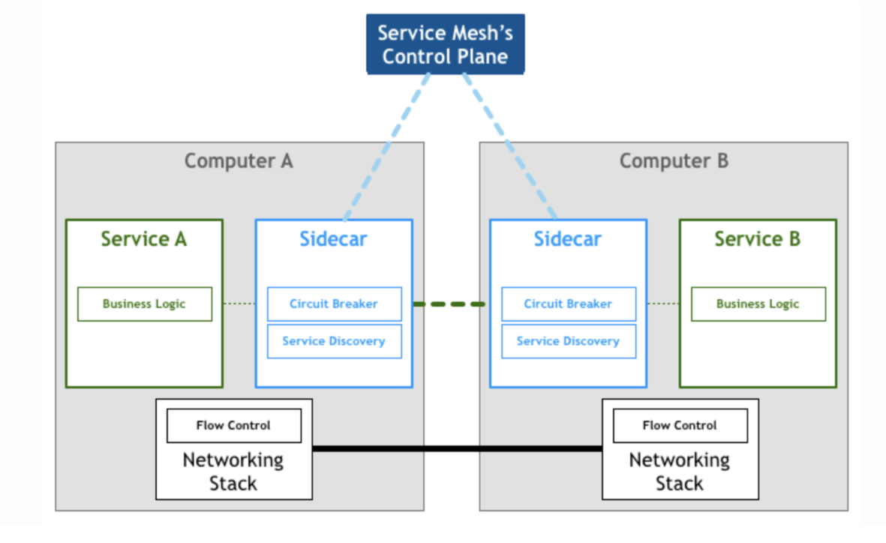

# 云原生概念

> 要想理解云原生，还需要从单体架构到微服务架构说起，一切的缘由都来自微服务架构体系。

## 1. 单体架构

单体架构的弊端，我们都比较清楚，不便于维护，不便于扩展，不利于管理，资源的利用无法达到最优（无法针对某个特定的服务增加资源）

这时候，就需要一种新的架构模型，这就是微服务架构。

## 2. 微服务架构

`微服务是一种软件架构风格，它是以专注于单一责任与功能的小型功能区块为基础，利用模块化的方式组合出复杂的大型应用程序，各功能区块使用与语言无关的 API 集相互通信`

在微服务架构的体系下，服务进行了细粒度的拆分，可以针对某个服务进行资源的分配。

但是在越来越多的互联网人群的增长背景下，诞生了新的需求。

举个例子：

订单服务，在搞活动的时候，比如qps能达到1亿，但是平时订单服务的qps只有1千万，那么问题来了，你是按照1亿准备服务器资源呢？还是按照1千万准备资源呢？

**按照传统的思维，自然是按照1亿准备资源，但是就需要购买或者租用足以支撑起的服务器资源（机器和带宽等），这时候你一定会有一个疑问？如果这样，那么岂不是产生的极大的浪费？**

## 3. 云计算

> 有没有一种服务，能够按需取用所需的资源，不用的时候，可以及时止损，避免额外的开销呢？

**云计算是一种模型，它支持对网络进行无处不在、方便的按需访问可配置计算资源的共享池（例如，网络、服务器、存储器、应用程序和服务等），可以用最少的管理工作与服务提供者交互**

就像你从电力局那里获得电力，而不是自己发电一样。

通过云您可以获得作为商品的计算资源（例如，服务器、存储和网络）。

云提供商管理底层云基础设施，因此消费者无需担心机器或网络等物理资源。

传统 IT 基础设施无法提供弹性能力。公司必须计算所需的最大计算能力，并建立支持该能力的基础设施，即使大部分情况下只是偶尔需要。

随着云计算模型的出现，计算资源受到监控，消费者只为他们实际使用的东西付费。

对于云基础设施应该在哪里或应该由谁提供，没有严格的要求。云服务有几种部署模型，主要是私有云、公共云和混合云。

- 私有云。为单个组织使用而配置的云基础架构。可以由组织本身或第三方管理，也可以内部部署或外部托管。对于要处理敏感数据或非常关键系统的组织，私有云通常是云计算的首选选项。例如，银行和医疗服务提供商很可能建立自己的云基础设施。
- 公共云。为公共使用而配置的云基础架构。它通常是由某组织所有并提供管理，也就是云服务商，都托管在提供商的场所。公有云服务提供商的例子有 阿里云，腾讯云等
- 混合云。由两个或多个不同的云基础架构组成，由前面的类型绑定在一起并提供服务，就好像它们是一个单一的环境。

云计算模型提供了五种主要的服务模型，具体取决于给消费者提供哪些功能。关于选择哪种服务模型的决策，应该是由消费者对基础设施的需求控制程度，以及他们需要管理的哪种类型的计算资源。

### 3.1 IaaS

在基础设施即服务（IaaS）模型中，消费者可以直接控制提供的资源，如服务器、存储和网络等。例如，他们可以配置虚拟机并安装操作系统和库等软件。

### 3.2 CaaS

使用容器即服务（CaaS）模型，使用者不能控制原始虚拟化资源。相反，他们管理的是容器。云服务商将提供满足这些容器所需的底层资源。例如，启动新的虚拟机并配置网络以使其可通过互联网访问。Docker Swarm 和 Kubernetes 提供的是 CaaS 级别的服务。所有主要云服务商都提供托管 Kubernetes 服务，这已成为事实上的 CaaS 标准

### 3.3 PaaS

在平台即服务（PaaS）模型中，云服务商管理栈直至运行时和容器级别。消费者运行和管理应用程序，而平台处理其余所有事情。例如，作为开发人员，您可以构建 Java 应用程序，将其打包为 JAR 文件，然后将其部署到根据 PaaS 模型工作的平台。平台提供 Java 运行时和其他必需的中间件，还可以提供其他服务，如数据库或消息传递系统。

### 3.4 FaaS

功能即服务（FaaS）模型利用无服务器计算让消费者管理由事件触发的功能。云提供处理所有其余事情。在这个模型中，开发人员构建单个功能，而不是整个应用程序。FaaS 平台配置何时应执行此类功能。例如，您可以编写一个函数，该函数在消息队列可用时分析数据集并计算结果。

### 3.5 SaaS

抽象程度最高的服务是软件即服务（SaaS）。在这个模型中，消费者只能作为用户访问应用程序，而云服务商管理整个应用程序堆栈。许多公司构建应用程序，使用 CaaS 或 PaaS 模型运行它们，然后将其作为 SaaS 销售给终端客户。SaaS 应用程序的消费者通常使用 瘦客户端 web 浏览器来访问它们。

## 4. 云原生

> 了解了上面的知识后，云原生的定义就比较好理解了，云原生就是构建在云上的应用

云原生应用程序的主要属性是可伸缩性、松耦合、健壮性、可管理性和可观察性。

### 4.1 可伸缩性

- **垂直扩展**。垂直缩放或上下缩放，这意味着给计算节点添加或删除硬件资源，如 CPU 或 内存。这种方法是有限度的，因为不可能无限添加硬件资源。另一方面，应用程序不需要做什么特殊设计就可以缩放。
- **水平扩展**。水平缩放或内外缩放，意味着添加更多计算节点或容器（例如，当使用 Kubernetes 时）到系统中。这种方法与垂直扩展不同，几乎没有限制，但它需要应用程序要特别处理以支持水平扩展。

传统系统通常会在工作负载增加的情况下采用垂直扩展。添加 CPU 和内存使应用程序支持更多用户

在云中，一切都是动态不断变化的，水平扩展是首选。

基于云计算模型提供的抽象级别，可以直接启动应用程序的新实例，而不是增加已经运行的机器的计算能力。因为云是有弹性的，所以可以在短时间内动态地进行缩放。我把弹性作为一个主要特性来讨论：根据需求主动采取行动，调配和释放计算资源。可伸缩性是弹性的先决条件。

下图显示了垂直扩展和水平扩展之间的区别。在垂直扩展情况下，我们通过向现有虚拟机添加更多资源来扩展。在水平扩展情况下，我们添加另一个虚拟机，以帮助现有虚拟机处理额外的工作负载。

### 4.2 松耦合

松耦合是系统的一个基本特性，即系统各部分之间尽可能少的相互依赖。其目标是可以独立地开发每一个部分，以便于某部分的修改，不影响其他部分。

几十年来，`耦合` 及其孪生概念 `内聚` 在面向对象的软件工程中起着至关重要的作用。将系统分解为模块（模块化），最小化对其他部分依赖（松耦合），并对代码的修改封闭（高内聚），是一种很好的设计实践。

根据架构风格的不同，可以对整体或对独立服务（例如，微服务）进行建模。按照松耦合和高内聚性进行模块化。

模块化的三个好处：

- **可管理性**。由于每个模块都是松散耦合的，因此团队可以减少开发的时间，因为与其他团队进行大量协调和沟通就不需要了。
- **产品灵活性**。每个模块应独立于其他模块进行演变，形成了一个非常灵活的系统。
- **可理解性**。不必从整体上研究系统来理解一个特定的模块，而是一次一个模块的研究。

上述好处通常都是与微服务相关的好处。

> 这里需要注意，并不是所有的应用只要分模块就是微服务，如果不能满足松耦合和高内聚特性，那么只能是一种失败的架构，形似而神不似。

### 4.3 健壮性

如果系统即使在出现故障或环境发生变化的情况下也能提供服务，则系统是有健壮性的。

健壮性是“面对故障或挑战性操作，软硬件网络仍能提供和维持一个可接受的服务水平”。

云原生应用程序在动态环境中运行，其中所有内容都在不断变化，并且故障可能随时会发生。这是无法阻止的。过去，我们习惯于把变化和故障作为异常。但对于高度分布式的系统，如云原生系统，变化不是异常：`它们是常态`。

您的目标应该是：无论基础架构或软件中是否出现故障，都要确保您的应用程序可用。

在讨论健壮性时，有必要定义三个基本概念：故障、错误和失效。

- **故障（Fault）**：是软件或基础设施中会产生错误内部状态的缺陷。例如：方法调用返回空值，其规范要求返回非 null 值。
- **错误（Error）**：是指系统的预期行为与实际行为的差异。例如：由于上面的错误，将引发抛出 NullPointerException。
- **失效（Failure）**：当触发故障并导致错误时，可能会发生失效，导致系统没有响应，无法按照其规范运行。示例：如果未捕获 NullPointerException，则错误会引发失效，系统将对任何请求返回 500 响应。

故障可能会变成错误，这可能会引发失效，因此您应该将应用程序设计为能够 `容错（fault tolerant）`。

同时健壮性的一个重要部分是确保失效不会波及到其他系统组件，而是使它保持隔离。

而且还需要这个系统能够 `自我修复（self-repairing）`，而`云模型`实际上可以实现这一点。

### 4.4 可观察性

可观察性是来自控制理论的一个特性。考察一个系统时，可观察性是一种通过衡量外部输出，来推断其内部状态的方法。在软件工程中，系统是一个单一的应用程序或一个分布式系统。整体外部输出可以是日志等数据。

Twitter 的可观察性工程团队确定了可观察性的四大支柱：

- **监测**：监测是关于测量应用程序的某些特定方面，以获得有关其整体健康状况的信息并识别故障。比如 Spring Boot Actuator。
- **警报/可视化**。收集有关系统状态的数据只有在使用时才有用。在监测到应用程序发现故障时，应触发警报，并且应该采取一些措施来处理它。定制监控大盘用于可视化收集的数据，并将其绘制在相关图表中，旨在提供系统运行的良好视图。
- **分布式系统跟踪基础设施**。在分布式系统中，仅仅跟踪每个子系统的行为是不够的。跟踪数据流经的不同子系统非常重要。
- **日志聚合/分析**。跟踪应用程序中的主要事件至关重要，可以推断软件的行为并在出现问题时进行调试。在云原生系统中，通过收集日志和对其进行聚合，以便更好地了解系统行为，才有可能进行分析，从数据中挖掘信息。

### 4.5 可管理性

可管理性是 通过外部输入可以很轻松的更改系统状态或者系统输出。更直白一点来说，它是一种无需更改代码即可修改应用程序行为的能力。

不要与可维护性相混淆，可维护性是一个衡量从内部高效地更改系统的指标，也就是说通过更改代码有多容易达成目的的指标。

可管理性的一个方面是部署和更新应用程序，同时保持整个系统是启用的、持续运行的。

另一个方面是配置。

可管理性不仅关系到变更本身，还关系到您应用这一修改是否轻松、高效。

云原生系统非常复杂，因此设计应用程序可以适应功能、环境和安全方面不断变化的需求非常重要。

考虑到复杂性，您应该致力于尽可能多地通过自动化进行管理。

云基础设施的两大自动化类别：资源调配和配置管理。我们把它们称为: `架构即代码（infrastructure as code）` 和 `配置即代码（configuration as code）`。

> 云计算模型的特点是，提供的计算资源都在自动化的自助服务模式中，并具有弹性地增加或减少计算资源的能力。

 `架构即代码` 的定义：“像任何软件系统的代码一样，通过源代码定义计算和网络基础设施的方法”。

云服务商提供方便的 API 来创建和配置服务器、网络和存储。

配置计算资源后，您可以管理它们并自动配置它们。

`配置即代码` 是像任何软件系统的代码那样，通过代码定义配置资源。

通过自动化所有任务，来处理与基础架构资源调配和配置管理相关的工作，您可以避免不稳定、不可靠的 `雪花服务器（snowflake server）`，如果手动配置、管理每个服务器，结果将是一个独一无二的 `雪花`：一个脆弱的、独特的服务器，无法复制，任何更改都有风险。

自动化有助于避免这种情况。

> 上述自动化的管理能达到云原生定义中的`不可变服务器`，其实就是降低风险，能够复用，当资源需求变更时，能轻松的通过配置进行修改，销毁上一个服务器，重新构建新的服务器。

## 5. 云原生架构

> 要达到云原生的这些特性，不只是在编写应用程序是需要考虑，同时也需要其他的服务和软件，思想等一起来辅助，它们共同组成了一个新的架构体系，这就是云原生架构。

`CNCF`：云原生计算基金会，其定义了云原生的标准。https://landscape.cncf.io/

1. 在公有云、私有云和混合云等新型动态环境中，基于容器、服务网格、微服务、不可变基础设施和声明式 API 构建可弹性扩展的应用

2. 基于自动化技术构建具备高容错性、易管理和便于观察的松耦合系统

3. 构建一个统一的开源云技术生态，能和云厂商提供的服务解耦

总结起来，有这么几个关键字，`容器`，`微服务`，`服务网格`, `DevOps`，`持续交付`，`声明式API`

> 也就是说，如果我们要学习云原生需要围绕上述的技术学习，其中微服务，服务网格都属于微服务架构，现在云原生向着serverless，也就是无服务化方向发展，容器技术，现在热门的就是Docker以及k8s，持续交付就是CI/CD（有大量相关的软件），DevOps是一个概念，一个思想（开发人员和运维协同工作），声明式API是一种定义API的思想或者说应用（k8s有实现）

### 5.1 服务网格

Service Mesh 最早在 2016 年 9 月 29 日由开发 Linkerd 的 Buoyant 公司首次提出，Service Mesh 是用于处理服务间通信的基础设施层，它负责通过构成现代云原生应用程序的复杂拓扑结构来可靠地传递请求。

因此 Service Mesh 也被称为微服务时代的 TCP 协议。

在微服务中，每一个服务都需要做与自身实际业务逻辑无关的一些逻辑，比如负载均衡，监控，安全，通信配置，服务发现，超时重试，熔断限流等等的，比如以下的微服务架构：

很明显绿色的部分，成为可以抽取的部分。

为什么要将其抽取出来，有以下原因：

1. 如果A，B两个服务是由不同语言实现的，那么对绿色部分的升级改造就需要重复迭代和开发。
2. 当需要对绿色部分进行升级的时候，会对业务产生影响，可能需要重新部署或者开发改造。
3. 对配置管理造成影响，配置可能和业务产生耦合，无法做到统一配置管理，实时下发配置。

**Service Mesh 是如何解决这些问题的?**

从一个全局视角来看，Sidecar 连接成网，组成 Service Mesh。

TCP 协议催生了分布式系统，分布式系统催生了微服务，Service Mesh 就是下一代微服务技术的代名词，是微服务时代的 TCP 协议。Service Mesh 以 Sidecar 形式，将服务治理从业务逻辑中剥离，并拆解为独立进程，实现异构系统的统一治理和网络安全。

Service Mesh 将 SDK 拆解为单独进程，并以 Sidecar 模式进行部署，使得业务进程专注于业务逻辑。

Sidecar 是一个轻量级的网络代理，它们与应用程序部署在一起，对所有流入与流出的网络请求进行拦截，实现各种网络策略，例如：服务发现与负载均衡、流量拆分、故障注入、熔断器以及分阶段发布等功能。

分为`数据平面`和`控制平面`。

数据平面：Sidecar做为轻量级网络代理，做为微服务通信的基础设施层。具有业务无关，语言无关，独立演进，透明升级的特性。

控制平面：负责对Sidecar代理进行控制和管理，提供微服务治理和运维的统一入口。

这种架构实现了服务治理技术和业务逻辑的解耦，是云原生时代微服务治理技术的主要实现。

`Istio + Envoy` 和`Linkerd`是 service mesh的主要社区方案之一。

### 5.2 无服务化

要理解为什么诞生serverless，就要从一个问题说起，当我们上线一个服务的时候，如果这个服务一直没有被使用到，但是它所占用的资源一直在那，举个例子，比如一个公司上线了一款产品，购买了4核8G的服务器，但是上线后，只有100的访问量，远远达不到服务器的极限，所以服务器的资源被浪费了。

serverless就是解决类似这样的问题，普遍认为开发人员应当将精力集中在为用户提供价值的方面，升级 Linux 发行版不会为用户提供价值，管理 Kubernetes 集群不会为用户提供价值，只有提供解决问题的产品才会为用户提供价值。

**定义**

维基百科的定义：

* 云服务商按需分配计算机资源，开发者无须运维这些资源，不用关心容器、虚拟机或物理服务器的容量规划、配置、管理、维护、操作和扩展。
* Serverless 计算无状态，可在短时间内完成计算，其结果保存在外部存储中。
* 当不使用某个应用时，不向其分配计算资源。
* 计费基于应用消耗的实际资源来度量。

CNCF（Cloud Native Computing Foundation，云原生计算基金会）认为 Serverless 旨在构建和运行不需要服务器管理的应用程序，二者的不同之处在于它描述了一个更细粒度的部署模型，能够以一个或多个函数的形式将应用打包并上传到平台执行，并且按需执行、自动扩展和计费。

Serverless 并不意味着不需要服务器来托管和运行代码，也不意味着不再需要运维工程师。Serverless 是指开发者不再需要将时间和资源花费在服务器调配、维护、更新、扩展和容量规划上，这些任务都由 Serverless 平台处理，开发者只需要专注于编写应用程序的业务逻辑，运维工程师能够将精力放在业务运维上。

Serverless服务主要分为FaaS和BaaS。

BaaS是Backend as a Service，后端即服务，基于 API 的三方服务，用来取代应用程序中功能的核心子集。比如redis集群，mongo集群，mysql集群，消息队列等 都由云提供商提供。

FaaS，Function as a Service，功能即服务或者说函数即服务，开发人员只关心业务层面，扩容维度从应用层面降低到函数层面，无需关心其他的。

> Serverless让我们的应用变为一种新的计费模式，提交函数，运行函数，当不运行函数时，将其资源释放，用多少资源花多少资源

*knative*是谷歌开源的 serverless 架构方案。

### 5.3 持续交付

CNCF 指出，云原生技术应与强大的自动化相结合，以支持经常进行影响较大的更改。

其中一部分是通过持续交付提供的。

持续交付是“一种软件开发规程，让您在的软件可以随时投入生产的方式”。

通过持续交付，团队在短周期内实现功能，确保软件可在任何时间可靠释放。

`持续集成`（CI）是持续交付的先决条件，包括集成提交更改后的软件，构建它，并最终在类生产环境进行自动化测试。此过程应自动化，并由 CI 服务器执行。这个流程中涉及的步骤被声明为 `流水线（pipelines）`。

`持续交付`（CD）通过在流水线中包含额外步骤而构建在 CI 之上。之后通过运行自动化测试，软件被打包，发布版本被构建并部署到 类生产环境，以验证其是否有效。自动化流水在连续生产中的应用交付称为 `部署流水线`。

由于持续交付的基础是持续集成，我们通常将其称为 CI/CD。

典型的有：Jenkins，Drone CI，Gitlab-CI，Flux等

### 5.4 DevOps

DevOps是一种思想或者一种文化，在这种文化中，人们不分头衔或背景，共同规划、开发、部署和运维一个系统。

这意味着各自为战的终结，开发团队、QA 团队和运维团队之间不再有隔阂。

- *DevOps 并不意味着没有运维*。一个常见的错误是认为开发人员负责运维，这里运维人员的角色消失了。这是一种合作。一个团队包括这两种角色，有助于提高团队的整体技能，将创意变成产品。
- *DevOps 不是一个工具*。像 Docker、Ansible、Splunk 和 Prometheus 这样的工具通常是称为 DevOps 工具，但这是错误的。DevOps 是一种文化。您不会因为使用这些工具而成为 DevOps 组织。换句话说，DevOps 不是产品，而是相关促成者的工具。
- *DevOps 不是自动化*。即使自动化是 DevOps 的重要组成部分，但不是 DevOps 的定义。DevOps 是关于开发者和运维人员从构思到实践的合作，同时可能自动化一些流程，如 `持续交付`。
- *DevOps 不是一个角色*。如果我们认为 DevOps 是一种文化，一种观念，很难理解 DevOps 角色。然而，对 DevOps 工程师的要求越来越高。通常，当招聘人员寻找 DevOps 工程师时，他们需要的技能包括熟练使用自动化工具、脚本和 IT 系统。
- *DevOps 不是一个团队*。没有充分了解上述风险的组织，最终会保持与以前相同的思路。

开发人员和运维人员之间的协作，在云原生中至关重要。

设计和构建云原生应用程序，需要您始终记住您将在哪里部署这些应用程序：`云端`。

与运维人员合作允许开发人员设计和制造更高质量的产品。

有了 DevOps 思维，您可以真正实现 CNCF 定义的云原生应用目标：“允许工程师用最少的劳动，进行频繁的和可预测的重大功能更新”。

**DevOps工具包括 Docker、Kubernetes、Jenkins、Terraform、Packer、Ansible、Chef 和 Puppet等等**

### 5.5 容器

在我们加入一个开发团队，设置新的环境时，我们需要保证开发团队中所有人的环境一致。

我们交付测试时，期望应用运行在同一个环境下。

在我们将服务部署在多台服务器上的时候，我们期望每台服务器的环境能够一致。

而这些正是容器来解决的。

 在没有容器的时候，依赖虚拟机来保证环境的可复制性、隔离和可配置性。虚拟化通过利用虚拟机监控程序进行硬件抽象，使其能够在同一台物理机上运行多个操作系统，以一种相互隔离的方式。

虚拟机有一些缺点：

1. 每启动一个虚拟机，就会占用大量的内存和硬盘资源，即使不使用
2. 为了管理各个虚拟机，又需要额外的内存资源
3. 单台计算机上可运行的虚拟机数量有上限，随着虚拟机的增多，系统资源的浪费会加重

这就需要容器，相比虚拟机，容器共享了底层的操作系统，启动，销毁，移植变的更加容易，快速且代价低廉，成为云时代最好的选择。

`Docker`是现在最为流行的容器实现。

当然，虚拟化和容器并不是相互排斥的。实际上，您可以在云中同时使用它们：在虚拟机组成的基础架构中运行容器。IaaS 模型（基础架构即服务）提供了一个虚拟化层，可以用于引导新的虚拟机。

> 应用程序通常由在同一台机器上运行的不同容器组成，当为了扩展性而开始复制容器时，将容器分布到不同的机器上，你会发现管理如此众多的容器，变的极为困难，这就需要容器编排。

容器编排可帮助您自动化许多不同的任务：

- 管理集群，必要时启动和关闭机器；
- 将集群中的容器进行调度并部署，直到满足容器对 CPU 和内存的要求；
- 动态扩展容器实例，利用运行状况监测实现高可用性和韧性；
- 为容器建立相互通信的网络，定义路由、服务发现和负载平衡；
- 向因特网公开服务，建立端口和网络；
- 根据特定标准向容器分配资源；
- 配置容器中运行的应用程序；
- 确保安全并强制执行访问控制策略。

容器编排器可以使用 `Kubernetes`、`Docker Swarm` 或 `Apache Mesos`。

**Kubernetes**是一个开源的，用于管理云平台中多个主机上的容器化的应用，Kubernetes的目标是让部署容器化的应用简单高效，Kubernetes提供了应用部署、规划、更新、维护的一种机制。

一般我们都使用Kubernetes，Kubernetes由于其特性，被誉为云原生的操作系统，众多组件都与其深度集成，围绕着Kubernetes，实现了众多满足或者支撑云原生架构的组件。

> 学习云原生，我们需要从开发，交付，部署，管理等方面，形成一条完整的链路，将众多技术融会贯通。
