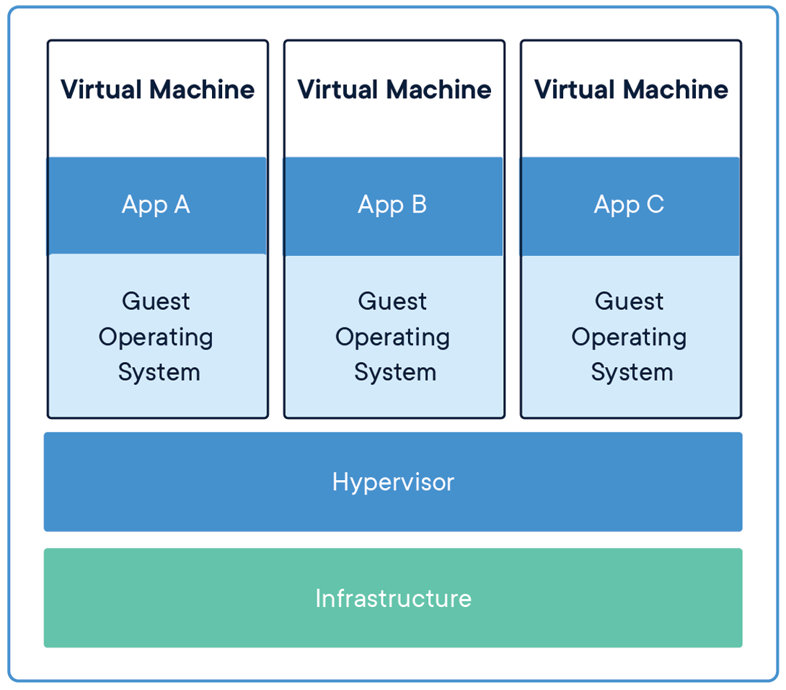
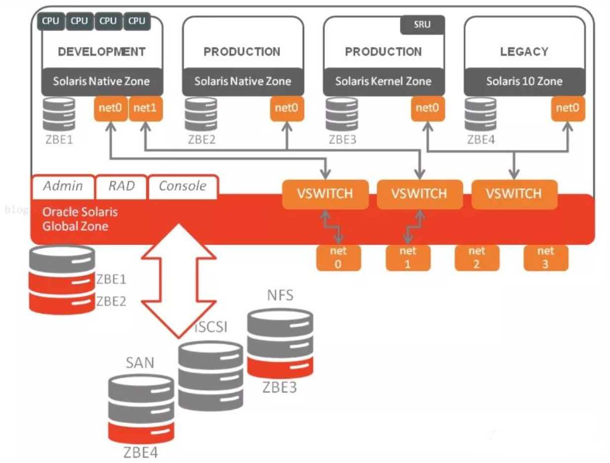
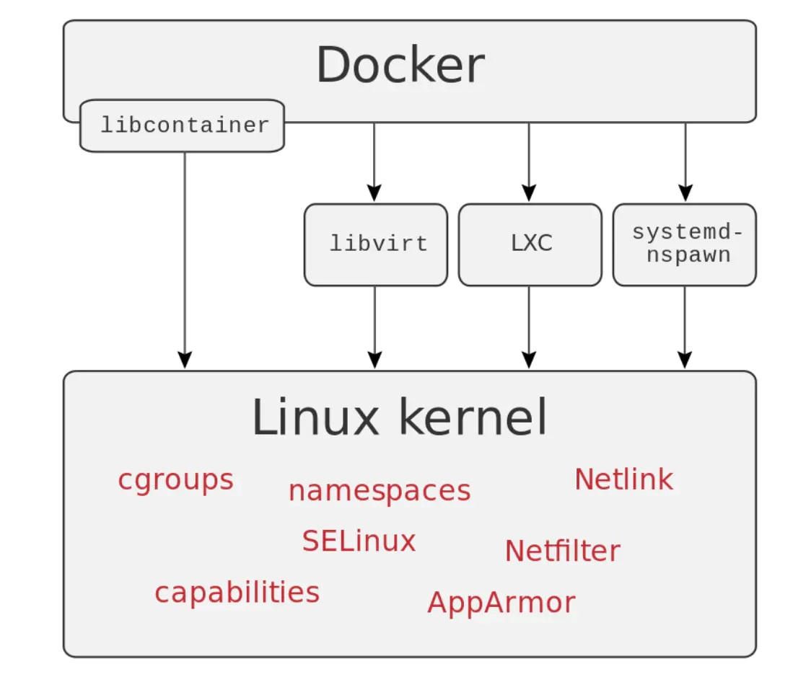

# 初识Docker

## 1. Docker为什么诞生？

随着计算机硬件的性能提升，会有这些现象发生：

* 计算机上可运行的软件越来越多，不同软件之间或者相同软件不同版本之间，会造成一些冲突，这时候需要一种技术，将冲突的软件进行隔离
* 硬件性能过剩，希望将其最大限度的利用起来
* 操作系统上安装的软件，希望能完整的copy给其他人，而不用重新安装

为了应对上述需求，一般是一台电脑安装多个操作系统或者多个电脑协同工作，但缺点显而易见，很麻烦，且没法最大限度的利用硬件资源。

> **怎么办？**

`硬件虚拟化`这个解决方案就普及开来并迅速成为主流。

所谓`硬件虚拟化`，就是某个特殊的`软件`，`仿真`出一台或者多台计算机的各种硬件，用户可以在这一台虚拟机上`安装、运行操作系统`（一般叫来宾操作系统，`Guest OS`）和各种应用，并且把 `Guest OS` 和上面应用软件对硬件资源的访问转发到`底层的硬件`上来实现。

对于` Guest OS `和上面的应用程序来说，这台虚拟机和普通物理计算机是完全一样没有任何区别的——除了性能可能差一点。全球第一人气的 `VMware Workstation `就是这么一个软件，Oracle 的 `VirtualBox `以及 Microsoft 的 `Virtual PC `都是。

这类软件英语有一个专用的单词是 `Hypervisor`（虚拟机管理程序）。



### 1.1 虚拟机的优缺点

> 优点：

1. 硬件最大化利用
2. 更易移植
3. 更易拓展（比如云服务，利用虚拟机虚拟不同的物理资源）

> 缺点：

**硬件资源的严重浪费**

1. 每启动一个虚拟机，就会占用大量的内存和硬盘资源，即使不使用
2. 为了管理各个虚拟机，又需要额外的内存资源
3. 单台计算机上可运行的虚拟机数量有上限，随着虚拟机的增多，系统资源的浪费会加重

### 1.2 解决虚拟机的缺点

> 能不能解决虚拟机的缺点呢？

这里有个`前提：` 一般单台计算机上运行的虚拟机操作系统大多是一样的。

基于上述前提，能不能所有的`虚拟机`都使用同一个操作系统底层呢？这样就避免了硬件资源的浪费。当然共享操作系统底层的时候，`虚拟机`之间的隔离性仍旧需要存在。

**「操作系统层虚拟化——容器」**概念的提出，就是为了解决这个问题。

**Docker** 就是一个容器的标准化实现。

## 2. 认识容器化技术

`容器化`就是应用程序级别的虚拟化技术。容器提供了将应用程序的代码、运行时、系统工具、系统库和配置打包到一个实例中的标准方法。容器共享一个内核（操作系统），它安装在硬件上。


和虚拟机相比，容器有以下优点：

1. 启动迅速：没有虚拟机硬件的初始化，没有 Guest OS 的启动过程，可以节约很多启动时间，这就是容器的“开箱即用”；
2. 占用资源少：没有运行 Guest OS 所需的内存开销，无需为虚拟机预留运行内存，无需安装、运行 App 不需要的运行库/操作系统服务，内存占用、存储空间占用都小的多。相同配置的服务器，如果运行虚拟机能运行十多台的，通常可以运行上百个容器毫无压力——当然前提是单个容器应用本身不会消耗太多资源

### 2.1 容器化技术历史

**1979年**

1979年，第一个Unix版本V7发布，在1979年的这个V7版本上，chroot这个系统调用被发明了出来，什么是chroot呢？就是改变一个进程及其子进程的根目录到另外一个目录下，在经过 chroot 之后，系统读取到的目录和文件将不在是旧系统根下的而是新根下(即被指定的新的位置)的目录结构和文件，这样有几个好处：

- 增强系统安全性，限制了用户进程的权限，使得进程不能访问一些特定的文件；
- 建立一个和原系统隔离的目录结构（是不是联想到了容器的隔离文件系统union gs），为进程指定一个单独的、新的文件系统上下文环境。

于是，Unix就具有了这种能力：为每个进程提供一个隔离的虚拟文件系统。Chroot在后来的1982年被新增到了BSD这个分支中。可见，在早期构建Unix系统的先驱们已经有了这种意识，就是隔离的意识。chroot可以认为是容器技术的鼻祖。

**1999年**

在这年，一家共享主机托管商提供了FreeBSD Jails的概念，顾名思义，就是将服务和客户端服务明确的区分开，实现安全性和可管理的便捷性，它允许将系统划分为几个独立的较小的系统，称之为Jail，并且这些小系统有独立的配置和IP地址。这就有容器的意思了。2000年，伴随FreeBSD4.0版的发布，正式对外公开。系统管理者可以使用jail(8)这个命令来调用这个服务。

**2001年**

该Linux出场了，GUN和Linux整合后迅速发展，这个时间点上Linux已经比较成熟了，Linux Vserver出现了，和Free BSD的Jails是相同的原理，可以对OS上的资源（文件系统、网络等）进行隔离划分。到了2001年，Linux通过对内核打补丁的方式实现了该种虚拟化，其实就是namespace机制，中间经过了很多次完善，最后的stable补丁在2006年发布。

**2004年**

Solaris属于Unix的一个变种，在2004年，Solaris上的虚拟化诞生了，初期称为Solaris container，Solaris的虚拟化技术由Sun公司开发，2004年2月同Solaris10版本对外发布，Sun公司在2009年被并购后落入了Oracle公司，Solaris11之后叫Solaris zones。从名字也能看出来，也是一种操作系统层面的轻量级虚拟化技术。

Solaris zones 是Native zone，kernel zone的统称，能够为你使你的应用在隔离的环境中运行，并实现有效的资源管理。几乎所有的Oracle用户都在使用Zone，广泛应用在生产环境中，从web app 到Oracle数据库实例都可以安装在zone里面。zone 技术为应用程序创建了虚拟的一层，可以将zone 称之为一个沙箱，我们安装的操作系统称为global-zone，在global zone里面可以创建很多独立的zone，称为non-globalzone，global zone 控制着操作系统内核，设备驱动，系统内存管理，文件系统等等并为non global zone 提供接口。非global zone 之间互相独立，互不影响，每一个zone 拥有自己的文件系统，进程空间，防火墙，网络配置等等，对于global zone 来说每一个non-global zone 是一个拥有一组资源并用zone ID命名的进程。Solaris zone 是一种轻量级的虚拟化技术，虚拟化的开销很小，所有的native zone 依赖于操作系统内核，kernelzone 可以拥有独立的内核版本：



**2005: Open VZ (Open Virtuzzo)**

2005年，SWsoft发布了Open VZ，OpenVZ是开源软件，是基于Linux平台的操作系统级服务器虚拟化解决方案。OpenVZ采用SWsoft的Virtuozzo虚拟化服务器软件产品的内核，Virutozzo是SWsoft公司提供的商业虚拟化解决方案。

OpenVZ可以在单个物理服务器上创建多个隔离的虚拟专用服务器(VPS)并以最大效率共享硬件和管理资源。每个VPS的运行和独立服务器完全一致，因其自身的用户、应用程序都可以独立重启，它拥有根访问权限、用户、IP地址、内存、处理器、文件、应用服务、系统库文件和配置文件等。拥有轻量级处理损耗和高效设计的OpenVZ是运行应用服务和实时数据生产型服务器虚拟化的最佳选择。

OpenVZ软件同时为用户提供工具，协助自动化管理虚拟服务器。基于模板的应用程序部署可以在几分钟内用简单的方法创建新的虚拟服务器并投入使用，而且与其他的虚拟化技术相比，OpenVZ可以在每CPU上运行几倍于其他虚拟化服务器技术的虚拟化服务器。

OpenVZ是基于Linux内核和作业系统的操作系统级虚拟化技术。OpenVZ允许物理服务器运行多个操作系统，被称虚拟专用服务器（VPS，Virtual Private Server）或虚拟环境（VE, Virtual Environment）。

与硬件虚拟化的VMware和半虚拟化的Xen相比，OpenVZ的host OS和guest OS都必需是Linux（虽然在不同的虚拟环境里可以用不同的Linux发行版）。但是，OpenVZ声称这样做有性能上的优势。根据OpenVZ网站的说法，使用OpenVZ与使用独立的服务器相比，性能只会有1-3%的损失。

**2006: Process Containers**

Process Containers横空出世，这个名字可能比较陌生，但是提到另外一个名字：Cgroups你可能就了然了。Cgroups在容器中控制容器的资源配额，是极其重要的一个控制功能，由谷歌工程师在2006年发布，2008年在2.6.24版本合并到Linux内核中。

**2008: LXC**

终于，在2008年，LXC横空出世，LXC作为集大成者，采集众家之所长，有了前期的N多铺垫，终于有了容器技术的雏形。LXC的主要两大依托就是namespace和Cgroups，一个做资源隔离，解决进程可以用什么资源的问题；一个做资源控制，解决进程可以用多少资源的问题。

进程在运行时，除了CPU和内存外，其实还需要很多其他资源，为了将其隔离，需要将资源一并隔离，如网络、文件系统、IPC等，什么是namespace？

```text
A namespace wraps a global system resource in an abstraction that  makes it
 appear to the processes within the namespace that they have their own isolated
 instance of the global resource.  Changes to the global resource are visible 
to other processes that are members of the namespace, but are invisible to other
 processes. One use of namespaces is to implement containers.
```

namespace的存在，使得每个进程都以为自己是单独的存在，拥有独享的必要资源，其实是被划分到一个单独的隔离区域。


**2011: Warden**

LXC是个好东西，加上Linux系统的覆盖面和应用广泛的加持，CloudFoundry在2011年启动了Warden项目，早期使用了LXC的技术，但是后面就用自己的实现替代掉了，它可以隔离进程的上下文环境，并且在后台提供了一个daemon进程提供了各种API来供你进行容器的管理,它提供了一种C/S架构的工具用来跨域多个主机来管理容器，它支持对cgroups，namespace及进程生命周期的管理。这是不是有Docker的影子了？如果你对Docker比较熟悉的话，和Docker的架构有点像。

**2013: LMCTFY**

Let Me Contain That For You (LMCTFY)，谷歌在2013年搞起的一个容器栈，可以为Linux应用提供容器（container）。这些容器可以让一台机器上的不同应用使用相互隔离的资源，以独占的方式运行在同一台机器上。这些应用也可以拥有容器，因此能够创建和管理属于他们自己的子容器。这个项目的地址如下：

```text
https://github.com/google/lmctfy
```

谷歌后来转向了libcontainer，因此这个项目在2015年停止更新，现在已经合并到了[https://github.com/opencontainers/runc/tree/master/libcontainer](https://link.zhihu.com/?target=https%3A//github.com/opencontainers/runc/tree/master/libcontainer)

读到这里，感觉是不是越来越像Docker了？

**2013: Docker**

是的，Docker（go语言开发）也很快出现了，Docker优秀的设计使得它非常流行，像Warden一样，初期也是基于LXC的，后来就以自己的libcontainer来替代了，Docker之所以如此流行，一个重要的原因就是提供了一个完整的解决方案生态系统，使得易用、简单，这是它的前辈们所做不到的，历史上的解决方案看起来都有Docker的影子，但是都有各种各样的不足，Docker几乎解决了所有的痛点，变得非常易用。


**2014 微服务**

明明讲容器技术的发展史，为什么提到微服务呢？这是有原因的，大家对微服务的一致性认知，都是出自2014年，马丁福勒的那篇布道文，通俗易懂的阐述了什么是微服务架构。

其实微服务的概念早在2012年就陆续的出现了，但是由于容器技术还不太完善，微服务的一个特点就是拆分，服务的数量会增长，膨胀的服务如何部署是个问题，无论是用虚拟机还是物理机，成本都比较高，而且扩容也不是很流畅。容器技术逐渐完善了后，微服务的发展终于得到了解放，一个个小而美的服务运行在容器里，具有必要的隔离性，且近乎原生系统的性能（直接在内核上运行），简直是再合适不过了。微服务得到了长足的进展，而这又反过来促进了容器的发展。

**2014 k8s**

Docker引爆了容器技术，加上微服务的加持，使得二者发展迅速，但是容器更像是一个好玩的玩具，如何在产线上工业化的使用起来？网络问题、负载均衡问题、监控、部署、更新、镜像管理、发布……需要解决很多很多问题，因此容器的编排应运而生，k8s在2014年横空出世，说横空出世或许有点夸张，因为它是基于谷歌内部建设了十几年的Borg构建的开源版本，实践出真知，因此很快就成为容器编排事实上的标准。

**2014: Rocket**

Rocket代码：  https://github.com/coreos/rkt

Rocket ( 也叫rkt，Go语言实现 ) 是一个类似Docker的命令行工具。她可以打包应用和依赖包到可移植容器中，简化搭环境等部署工作。
Rocket  的开发者认为，现在的Docker社区背离了当初设计Docker的初衷：即一个可复用的标准Linux容器。

Rocket设计目标就是希望再次实现这个初衷, 当然，它也兼容Docker(rkt可以执行 Docker镜像)。

"Rocket 和 Docker 不同的地方在于，Rocket 没有 Docker 那些为企业用户提供的“友好功能”，比如云服务加速工具、集群系统等。反过来说，Rocket 想做的，是一个更纯粹的业界标准。"

`CoreOS发布并开始支持rkt（最初作为Rocket发布）作为Docker的替代品。`

**2015 CNCF**

容器技术，容器编排，微服务，三者相辅相成，共同促进，迅速发展，容器云的概念也应运而生，于是乎，谷歌在2015年底拉着一票巨头成立了CNCF这个组织，共同做大云原生这个生态，无利不起早，也是为了照顾自家生意。

**如今**

微服务、容器编排、容器云，整个生态变得异常的火爆

## 3. Docker历史

2010 年，几个搞 IT 的年轻人，在美国旧金山成立了一家名叫 `dotCloud` 的公司。dotCloud 的平台即服务（Platform-as-a-Service, PaaS）提供商。底层技术上，dotCloud 平台利用了 Linux 的 LXC 容器技术。

为了方便创建和管理这些容器，dotCloud 基于 Google 公司推出的 Go 语言开发了一套内部工具，之后被命名为 `Docker`。Docker 就是这样诞生的。

`提示：“Docker”一词来自英国口语，意为码头工人（Dock Worker），即从船上装卸货物的人。`

> LXC 是 Docker 的底层基石，但是在 Docker 0.9 版本的时候，Docker 见异思迁了，引入了基于 Go 语言构建的 Libcontainer 的 execution driver。有了 Libcontainer 这个项目，Docker 不再需要依赖于 Linux 部件（LXC，libvirt，systemd-nspawn...）就可以处理 namespaces、control groups、capabilities、apparmor profiles、network interfaces。这下，LXC 沦为可选项。



在 Docker 1.8 中 LXC 被 deprecated，`在 Docker 1.10，LXC 彻底出局`。Docker 推出 Libcontainer 自己集成了 Linux 内核中的很多特性，作为一个独特、稳定且不受制于 Linux 的 Library，独立的时代终于到来了。


如同 Docker 的 Logo 一样，Docker 的思想来源于集装箱。集装箱解决了什么问题？在一艘大船上，可以把货物规整的摆放起来，并且各种各样的货物被集装箱标准化，集装箱与集装箱之间互不影响。那么就不需要专门运送水果的船和专门运送化学用品的船了。只要这些货物封装在不同的集装箱里，就可以用一艘大船把它们都运走。


2013年，dotCloud 的 PaaS 业务并不景气，公司需要寻求新的突破。

2013 年 3 月，dotCloud 公司的创始人之一，Docker 之父，28 岁的 **「Solomon Hykes」** 正式决定，将 Docker 项目开源。

怀揣着“将 Docker 和容器技术推向全世界”的使命，开启了一段新的征程。

开源之后，越来越多的 IT 工程师发现了 Docker 的优点，然后蜂拥而至，加入 Docker 开源社区。Docker 的人气迅速攀升，速度之快，令人瞠目结舌。

此时的 Docker，已经成为行业里人气最火爆的开源技术，没有之一。

于是他们聘请了 Ben Golub 作为新的 CEO，将公司重命名为“Docker”，放弃dotCloud PaaS 平台。

## 4. 容器和虚拟机的比较

 Docker 和传统虚拟化方式的不同之处，容器是在操作系统层面上实现虚拟化，直接复用本地主机的操作系统，而传统方式则是在硬件层面实现。


