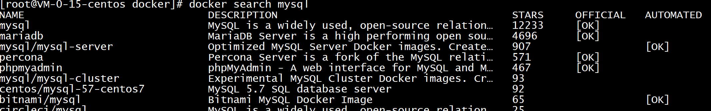
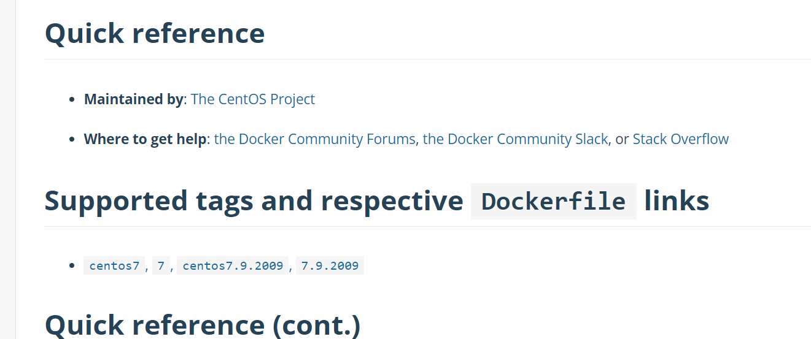
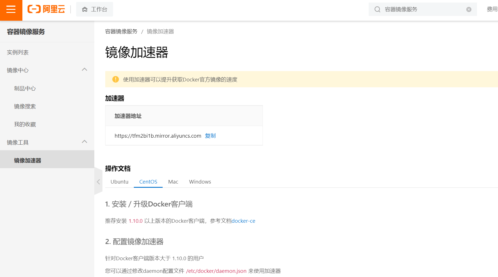
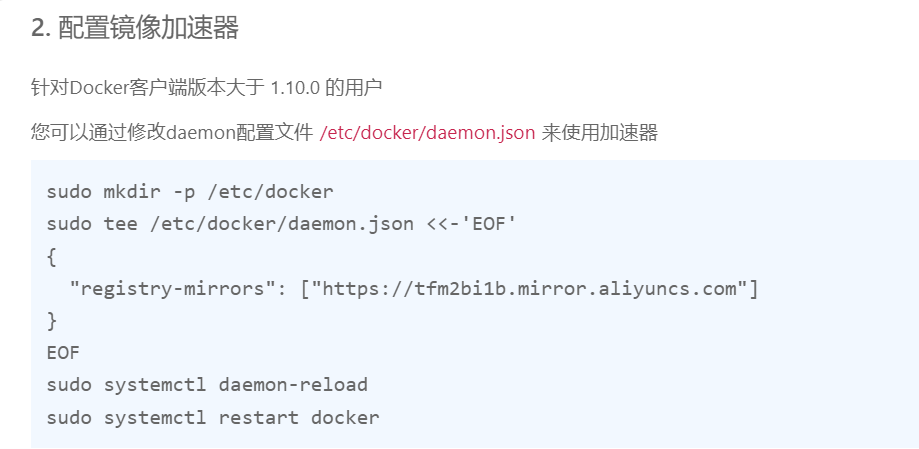
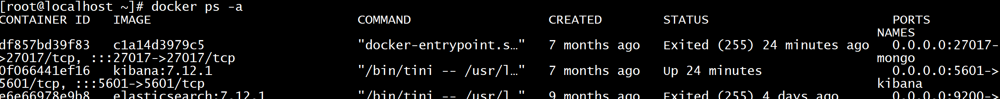
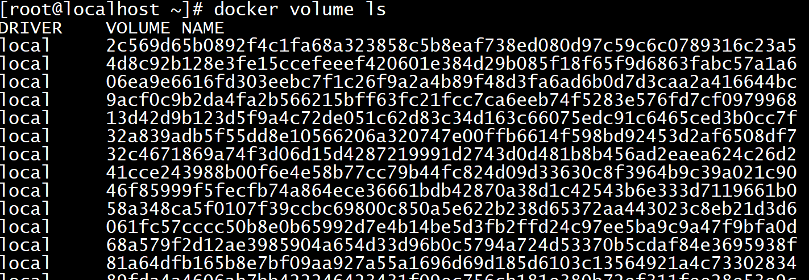
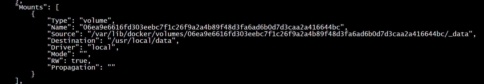
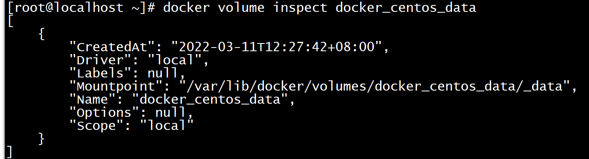

# Docker常用命令

官方文档：https://docs.docker.com/reference/

## 1. 查看镜像

~~~shell
[root@VM-0-15-centos ~]# docker images
REPOSITORY   TAG       IMAGE ID   CREATED   SIZE
~~~

- `REPOSITORY`：镜像在仓库中的名称
- `TAG`：镜像标签(一般是软件的版本号)
- `IMAGE ID`：镜像 ID
- `CREATED`：镜像的创建日期（不是获取该镜像的日期）
- `SIZE`：镜像大小

## 2. 搜索镜像

如果需要下载镜像，但是又不知道docker有没有，可以通过搜索镜像命令进行查看。

~~~shell
[root@VM-0-15-centos ~]# docker search 镜像名称
~~~

比如：



- `NAME`：镜像名称
- `DESCRIPTION`：镜像描述
- `STARS`：用户评价，反映一个镜像的受欢迎程度
- `OFFICIAL`：是否为官方构建
- `AUTOMATED`：自动构建，表示该镜像由 Docker Hub 自动构建流程创建的。

## 3. 拉取镜像

拉取镜像就是从中央仓库下载镜像到本地。

~~~shell
[root@VM-0-15-centos ~]# docker pull 镜像名称:tag
~~~

如果不声明tag，默认拉取latest版本。

可以通过https://hub.docker.com/ 搜索该镜像，查看支持的 tag 信息。

比如我们要下载centos7的镜像：



~~~shell
[root@VM-0-15-centos ~]# docker pull centos:7
~~~

## 4. 镜像仓库加速

因为docker的网站是国外的，有时候访问速度较慢，我们可以设置镜像仓库加速，提升获取Docker官方镜像的速度。

这里我们选用阿里云，阿里云搜索[容器镜像服务](https://cr.console.aliyun.com/cn-beijing/instances)



选择centos，因为我的操作系统是centos的。



根据提示，配置镜像加速器

## 5. 删除镜像

~~~shell
[root@VM-0-15-centos ~]# docker rmi 镜像id
~~~

~~~shell
[root@VM-0-15-centos ~]# docker rmi 镜像名称
~~~

~~~shell
[root@VM-0-15-centos ~]# docker rmi 镜像名称:tag
~~~

**使用镜像id删除的时候，输入id的前几位即可**

> 删除镜像的时候，必须保证没有镜像被使用，也就是说没有通过镜像创建容器，如果有，则必须先删除容器

`docker images -q` 可以查询到所有镜像的 ID

~~~shell
#以下命令可以删除 所有镜像
docker rmi `docker images -q`
~~~

## 6. 查看正在运行的容器

~~~shell
[root@localhost ~]# docker ps
CONTAINER ID   IMAGE   COMMAND  CREATED    STATUS  PORTS   NAMES
~~~

- `CONTAINER ID`：容器 ID
- `IMAGE`：所属镜像
- `COMMAND`：命令
- `CREATED`：创建时间
- `STATUS`：容器状态 Up运行 Exited退出
- `PORTS`：端口
- `NAMES`：容器名称

## 7. 查看所有的容器

不管是运行的还是未运行的

~~~shell
[root@localhost ~]# docker ps -a
CONTAINER ID   IMAGE   COMMAND  CREATED    STATUS  PORTS   NAMES
~~~



## 8. 其他容器查看命令

~~~shell
#查看退出的容器
docker ps -f status=exited
#查看最后一次运行的容器
docker ps -l
~~~

## 9. 容器启动命令

~~~shell
[root@localhost ~]# docker run [OPTIONS] IMAGE [COMMAND] [ARG...]
~~~

- `-i`：表示运行容器；
- `-t`：表示容器启动后会进入其命令行。加入这两个参数后，容器创建就能登录进去。即分配一个伪终端；
- `--name`：为创建的容器命名；
- `-v`：表示目录映射关系（前者是宿主机目录，后者是映射到宿主机上的目录），可以使用多个 -v 做多个目录或文件映射。注意：最好做目录映射，在宿主机上做修改，然后共享到容器上；
- `-d`：在 run 后面加上 -d 参数，则会创建一个守护式容器在后台运行（这样创建容器后不会自动登录容器，如果只加 -i -t 两个参数，创建容器后就会自动进容器里）；
- `-p`：表示端口映射，前者是宿主机端口，后者是容器内的映射端口。可以使用多个 -p 做多个端口映射。
- `-P`：随机使用宿主机的可用端口与容器内暴露的端口映射。

### 9.1 创建并进入容器

~~~shell
docker run -it --name 容器名称 镜像名称:标签 /bin/bash
~~~

**注意：Docker 容器运行必须有一个前台进程， 如果没有前台进程执行，容器认为是空闲状态，就会自动退出。**

退出命令 exit，一旦退出容器停止运行

示例：

~~~shell
docker run -it --name mszlu_mysql mysql:5.7 /bin/bash
~~~

### 9.2 守护方式创建容器

~~~shell
docker run -di --name 容器名称 镜像名称:标签
~~~

**此方式创建完成后，会启动容器，但不会进入容器，容器一直运行，除非使用docker stop命令关闭容器**

### 9.3 守护方式进入容器

~~~shell
# 必须是容器正在运行
docker exec -it 容器名称|容器ID /bin/bash
~~~


## 10. 停止与启动容器

~~~shell
# 停止容器
docker stop 容器名称|容器ID
# 启动容器
docker start 容器名称|容器ID
~~~

## 11. 文件拷贝

如果我们需要将文件拷贝到容器内可以使用 cp 命令。

~~~shell
docker cp 需要拷贝的文件或目录 容器名称:容器目录
~~~

也可以将文件从容器内拷贝出来。

~~~shell
docker cp 容器名称:容器目录 需要拷贝的文件或目录
~~~

## 12. 容器数据卷

> 数据卷这个概念非常重要

比如有以下场景：

1. 配置文件需要频繁修改
2. 容器内部的数据需要备份
3. 删除容器不希望删除数据

上述的需求，有了数据卷之后，变的非常容易。

我们可以在`创建容器`的时候，将宿主机的`目录与容器内的目录进行映射`，这样我们就可以通过修改宿主机某个目录的文件从而去影响容器，而且这个操作是`双向绑定`的，也就是说容器内的操作也会影响到宿主机，实现备份功能。

但是容器被删除的时候，`宿主机`的内容`并不会被删除`，因为底层是通过`拷贝`实现的。如果多个容器挂载同一个目录，其中一个容器被删除，其他容器的内容也不会受到影响，同理，底层是拷贝实现的。

> 容器与宿主机之间的数据卷属于引用的关系，数据卷是从外界挂载到容器内部中的，所以可以脱离容器的生命周期而独立存在，正是由于数据卷的生命周期并不等同于容器的生命周期，在容器退出或者删除以后，数据卷仍然不会受到影响，数据卷的生命周期会一直持续到没有容器使用它为止。

### 12.1 命令

创建容器添加 `-v` 参数，格式为`宿主机目录:容器目录`，例如：

~~~shell
docker run -di -v /mszlu/docker/centos/data:/usr/local/data --name centos7-01 centos:7
# 多目录挂载
docker run -di -v /宿主机目录:/容器目录 -v /宿主机目录2:/容器目录2 镜像名

~~~

**注意：目录挂载操作可能会出现权限不足的提示。这是因为 CentOS7 中的安全模块 SELinux 把权限禁掉了，在 docker run 时通过 `--privileged=true` 给该容器加权限来解决挂载的目录没有权限的问题。**

### 12.2 匿名挂载

匿名挂载只需要写容器目录即可，宿主机对应的目录会在 `/var/lib/docker/volumes` 中生成。

~~~shell
# 匿名挂载
docker run -di -v /usr/local/data --name centos7-02 centos:7
# 查看 volume 数据卷信息
docker volume ls
~~~



如果需要知道当前容器的挂载情况：

~~~shell
# docker inspect centos7-02（容器名称）
~~~



### 12.3 具名挂载

具名挂载就是给数据卷起了个名字，容器外对应的目录会在 `/var/lib/docker/volume` 中生成。

~~~shell
# 具名挂载
docker run -di -v docker_centos_data:/usr/local/data --name centos7-03 centos:7
# 查看 volume 数据卷信息
docker volume ls
~~~

通过 `docker volume inspect 数据卷名称` 可以查看该数据卷对应宿主机的目录地址。



### 12.4 只读/读写

~~~shell
# 只读。只能通过修改宿主机内容实现对容器的数据管理。
docker run -it -v /宿主机目录:/容器目录:ro 镜像名
# 读写，默认。宿主机和容器可以双向操作数据。
docker run -it -v /宿主机目录:/容器目录:rw 镜像名
~~~

### 12.5 数据卷容器（数据卷继承）

~~~shell
# 容器 centos7-01 指定目录挂载
docker run -di -v /mydata/docker_centos/data:/usr/local/data --name centos7-01 centos:7
# 容器 centos7-04 和 centos7-05 相当于继承 centos7-01 容器的挂载目录
docker run -di --volumes-from centos7-01 --name centos7-04 centos:7
docker run -di --volumes-from centos7-01 --name centos7-05 centos:7
~~~

上述 `centos7-01`称为数据卷容器

 这样做的好处就是，如果需要创建大量的相同目录的映射关系，可以简化命令便于操作和记忆


## 13. 查看容器ip地址

我们可以通过以下命令查看容器的元信息。


```shell
docker inspect 容器名称|容器ID
```

　　也可以直接执行下面的命令直接输出 IP 地址。

```shell
docker inspect --format='{{.NetworkSettings.IPAddress}}' 容器名称|容器ID
```

## 14. 删除容器

~~~shell
# 删除指定容器
docker rm 容器名称|容器ID
# 删除多个容器
docker rm 容器名称|容器ID 容器名称|容器ID

~~~

