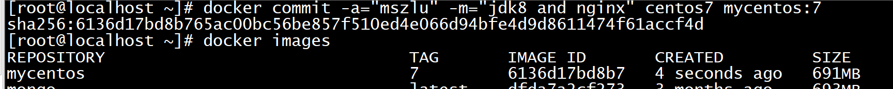

# Docker镜像构建

## 1. docker commit

平常我们都是从公共仓库拉取镜像，我们也可以从容器中构建我们自己的镜像。

需求：

~~~java
1. 基础镜像centos
2. 安装jdk
3. 安装nginx
~~~

### 1.1 创建容器

~~~shell
# 拉取镜像
docker pull centos:7
# 创建容器
docker run -di --name centos7 centos:7
~~~

### 1.2 安装jdk和nginx

~~~shell
#进入容器
docker exec -it centos7 /bin/bash
# 安装jdk
yum -y install java-1.8.0-openjdk.x86_64
# 安装nginx
yum -y install epel-release
yum install -y nginx
# 安装vim
yum -y install vim
# 启动nginx
/usr/sbin/nginx
# 访问nginx
curl http://localhost
~~~

### 1.3 构建镜像

接下来，我们将我们做好的容器，构建为一个新的镜像

~~~shell
docker commit [OPTIONS] CONTAINER [REPOSITORY[:TAG]]
docker commit -a="mszlu" -m="jdk8 and nginx" centos7 mycentos:7
~~~

- `-a`：提交的镜像作者；
- `-c`：使用 Dockerfile 指令来创建镜像；
- `-m`：提交时的说明文字；
- `-p`：在 commit 时，将容器暂停。




我们可以发现我们构建的镜像比较大，因为里面有jdk和nginx

### 1.4 使用新镜像构建容器

~~~shell
docker run -di --name mycentos7 -p 80:80 mycentos:7
#进入容器 启动nginx
/usr/sbin/nginx
~~~

访问：

http://ip/index.html

## 2. Dockerfile 

在 Docker 中构建镜像最常用的方式，就是使用 `Dockerfile`。Dockerfile 是一个用来构建镜像的文本文件，文本内容包含了一条条构建镜像所需的指令和说明。官方文档：https://docs.docker.com/engine/reference/builder/

### 2.1 常用指令

**FROM**

语法：`FROM <image>:<tag>`

指明构建的新镜像是来自于哪个基础镜像，如果没有选择 tag，那么默认值为 latest。

```
FROM centos:7
```

> 　　如果不以任何镜像为基础，那么写法为：FROM scratch。官方说明：scratch 镜像是一个空镜像，可以用于构建 busybox 等超小镜像，可以说是真正的从零开始构建属于自己的镜像。


**MAINTAINER**

语法：`MAINTAINER <name>`

指明镜像维护者及其联系方式（一般是邮箱地址）。官方说明已过时，推荐使用 LABEL。

```shell
MAINTAINER mszlu <mszlu@mszlu.com>
```

**LABEL **

语法：`LABEL <key>=<value> <key>=<value> <key>=<value> ...`

功能是为镜像指定标签。也可以使用 LABEL 来指定镜像作者。

```
LABEL maintainer="mszlu.com"
```

**RUN**

语法：`RUN <command>`

构建镜像时运行的 Shell 命令，比如构建的新镜像中我们想在 /usr/local 目录下创建一个 java 目录。

```shell
RUN mkdir -p /usr/local/java
```

**ADD**

语法：`ADD <src>... <dest>`

拷贝文件或目录到镜像中。src 可以是一个本地文件或者是一个本地压缩文件，压缩文件会自动解压。还可以是一个 url，如果把 src 写成一个 url，那么 ADD 就类似于 wget 命令，然后自动下载和解压。

```shell
ADD jdk-11.0.6_linux-x64_bin.tar.gz /usr/local/java
```

**COPY **

语法：`COPY <src>... <dest>`

拷贝文件或目录到镜像中。用法同 ADD，只是不支持自动下载和解压。

```shell
COPY jdk-11.0.6_linux-x64_bin.tar.gz /usr/local/java
```

**EXPOSE**

语法：`EXPOSE <port> [<port>/<protocol>...]`

暴露容器运行时的监听端口给外部，可以指定端口是监听 TCP 还是 UDP，如果未指定协议，则默认为 TCP。

~~~she
EXPOSE 80 443 8080/tcp
~~~

如果想使得容器与宿主机的端口有映射关系，必须在容器启动的时候加上 -p 参数。

**ENV**

语法：`ENV <key> <value>` 添加单个，`ENV <key>=<value> ...` 添加多个。

设置容器内环境变量。

```shell
ENV JAVA_HOME /usr/local/java/jdk-11.0.6/
```

**CMD**

语法：

- `CMD ["executable","param1","param2"]`，比如：`CMD ["/usr/local/tomcat/bin/catalina.sh", "start"]`
- `CMD ["param1","param2"]`，比如：`CMD [ "echo", "$JAVA_HOME" ]`
- `CMD command param1 param2`，比如：`CMD echo $JAVA_HOME`

　　启动容器时执行的 Shell 命令。在 Dockerfile 中只能有一条 CMD 指令。如果设置了多条 CMD，只有最后一条 CMD 会生效。


```shell
CMD ehco $JAVA_HOME
```

> 　　如果创建容器的时候指定了命令，则 CMD 命令会被替代。假如镜像叫 `centos:7`，创建容器时命令是：`docker run -it --name centos7 centos:7 echo "helloworld"` 或者 `docker run -it --name centos7 centos:7 /bin/bash`，就不会输出 `$JAVA_HOME` 的环境变量信息了，因为 CMD 命令被 `echo "helloworld"`、`/bin/bash` 覆盖了。


**ENTRYPOINT **

语法：

- `ENTRYPOINT ["executable", "param1", "param2"]`，比如：`ENTRYPOINT ["/usr/local/tomcat/bin/catalina.sh", "start"]`
- `ENTRYPOINT command param1 param2`，比如：`ENTRYPOINT ehco $JAVA_HOME`

　　启动容器时执行的 Shell 命令，同 CMD 类似，不会被 docker run 命令行指定的参数所覆盖。在 Dockerfile 中只能有一条 ENTRYPOINT 指令。如果设置了多条 ENTRYPOINT，只有最后一条 ENTRYPOINT 会生效。


```shell
ENTRYPOINT ehco $JAVA_HOME
```

> - 如果在 Dockerfile 中同时写了 ENTRYPOINT 和 CMD，并且 CMD 指令不是一个完整的可执行命令，那么 CMD 指定的内容将会作为 ENTRYPOINT 的参数；
> - 如果在 Dockerfile 中同时写了 ENTRYPOINT 和 CMD，并且 CMD 是一个完整的指令，那么它们两个会互相覆盖，谁在最后谁生效


**WORKDIR **

语法：`WORKDIR /path/to/workdir`

为 RUN、CMD、ENTRYPOINT 以及 COPY 和 AND 设置工作目录。

```
WORKDIR /usr/local
```

指定容器挂载点到宿主机自动生成的目录或其他容器。一般的使用场景为需要持久化存储数据时。


**VOLUME**

```shell
# 容器的 /var/lib/mysql 目录会在运行时自动挂载为匿名卷，匿名卷在宿主机的 /var/lib/docker/volumes 目录下
VOLUME ["/var/lib/mysql"]
```

> 一般不会在 Dockerfile 中用到，更常见的还是在 docker run 的时候通过 -v 指定数据卷。

### 2.2 构建镜像

　Dockerfile 文件编写好以后，真正构建镜像时需要通过 `docker build` 命令。

　`docker build` 命令用于使用 `Dockerfile` 创建镜像。


```shell
# 使用当前目录的 Dockerfile 创建镜像
docker build -t mycentos:7 .
# 通过 -f Dockerfile 文件的位置创建镜像
docker build -f /usr/local/dockerfile/Dockerfile -t mycentos:7 .
```

- `-f`：指定要使用的 Dockerfile 路径；
- `--tag, -t`：镜像的名字及标签，可以在一次构建中为一个镜像设置多个标签。


**关于最后面.的理解**

我们在使用 `docker build` 命令去构建镜像时，往往会看到命令最后会有一个 `.` 号。它究竟是什么意思呢？

　　很多人以为是用来指定 `Dockerfile` 文件所在的位置的，但其实 `-f` 参数才是用来指定 `Dockerfile` 的路径的，那么 `.` 号究竟是用来做什么的呢？

　　`Docker` 在运行时分为 `Docker 引擎（服务端守护进程）` 和 `客户端工具`，我们日常使用各种 `docker 命令`，其实就是在使用 `客户端工具` 与 `Docker 引擎` 进行交互。

　　当我们使用 `docker build` 命令来构建镜像时，这个构建过程其实是在 `Docker 引擎` 中完成的，而不是在本机环境。如果在 `Dockerfile` 中使用了一些 `ADD` 等指令来操作文件，如何让 `Docker 引擎` 获取到这些文件呢？

　　这里就有了一个 `镜像构建上下文` 的概念，当构建的时候，由用户指定构建镜像时的上下文路径，而 `docker build` 会将这个路径下所有的文件都打包上传给 `Docker 引擎`，引擎内将这些内容展开后，就能获取到上下文中的文件了。

　　举个例子：我的宿主机 jdk 文件在 /root 目录下，Dockerfile 文件在 /usr/local/dockerfile 目录下，文件内容如下：

```shell
ADD jdk-11.0.6_linux-x64_bin.tar.gz /usr/local/java
```

那么构建镜像时的命令就该这样写：

```shell
docker build -f /usr/local/dockerfile/Dockerfile -t mycentos:7 /root
```

再举个例子：我的宿主机 jdk 文件和 Dockerfile 文件都在 /usr/local/dockerfile 目录下，文件内容如下：

```shell
ADD jdk-11.0.6_linux-x64_bin.tar.gz /usr/local/java
```

那么构建镜像时的命令则这样写：

```
docker build -f /usr/local/dockerfile/Dockerfile -t mycentos:7 .
```

### 2.3 实例

接下来我们通过基础镜像 `centos:7`，在该镜像中安装 jdk 和 tomcat 以后将其制作为一个新的镜像 `mscentos:7`

创建目录

```shell
mkdir -p /mnt/docker/dockerfile
```

编写 Dockerfile 文件。

```shell
vim Dockerfile
```

Dockerfile 文件内容如下：

```shell
# 指明构建的新镜像是来自于 centos:7 基础镜像
FROM centos:7
# 通过镜像标签声明了作者信息
LABEL maintainer="mszlu.com"
# 设置工作目录
WORKDIR /usr/local
# 新镜像构建成功以后创建指定目录
RUN mkdir -p /usr/local/java && mkdir -p /usr/local/tomcat
# 拷贝文件到镜像中并解压
ADD jdk-11.0.8_linux-x64_bin.tar.gz /usr/local/java
ADD apache-tomcat-9.0.59.tar.gz /usr/local/tomcat
# 暴露容器运行时的 8080 监听端口给外部
EXPOSE 8080
# 设置容器内 JAVA_HOME 环境变量
ENV JAVA_HOME /usr/local/java/jdk-11.0.8/
ENV PATH $PATH:$JAVA_HOME/bin
# 启动容器时启动 tomcat
CMD ["/usr/local/tomcat/apache-tomcat-9.0.59/bin/catalina.sh", "run"]
```

上传jdk和tomcat到Dockerfile一样的目录下

构建镜像

```shell
[root@localhost ~]# docker build -f /usr/local/dockerfile/Dockerfile -t mscentos:7 .
```

**使用构建的镜像创建容器**

~~~shell
# 创建容器
docker run -di --name mscentos7 -p 8080:8080 mscentos:7
# 访问 http://192.168.200.101:8080/ 看到页面说明环境 OK!

~~~

