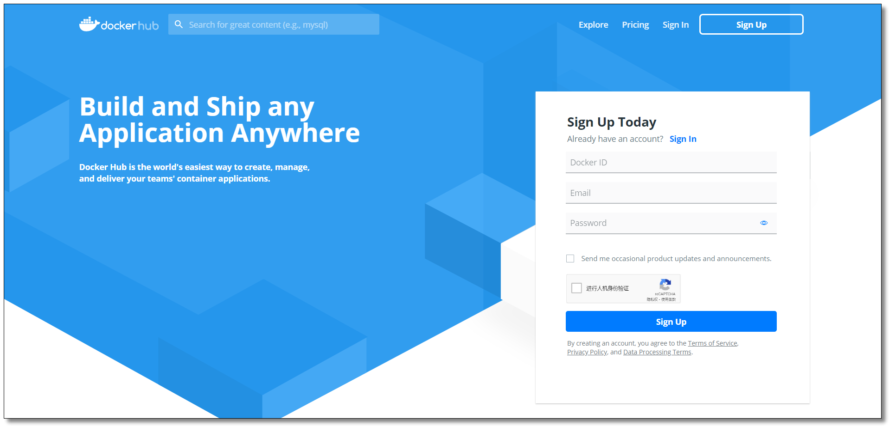

# 镜像其他相关操作

## 1. 镜像备份

使用 `docker save` 将指定镜像保存成 tar 归档文件。

~~~shell
docker save [OPTIONS] IMAGE [IMAGE...]
docker save -o /root/mycentos7.tar mycentos:7
~~~

- `-o`：镜像打包后的归档文件输出的目录。

## 2. 镜像恢复

　　使用 `docker load` 导入 docker save 命令导出的镜像归档文件。

~~~shell
docker load [OPTIONS]
docker load -i mycentos7.tar
~~~

- `--input, -i`：指定导入的文件；
- `--quiet, -q`：精简输出信息。

## 3. 镜像迁移

　　镜像迁移同时涉及到了上面两个操作，备份和恢复。

　　我们可以将任何一个 Docker 镜像从一台机器迁移到另一台机器。在迁移过程中，首先我们要把容器构建为 Docker 镜像。然后，该 Docker 镜像被作为 tar 包文件保存到本地。此时只需要拷贝或移动该镜像到我们想要的机器上，恢复该镜像并运行容器即可。

## 4. 镜像仓库

### 4.1 注册账号

官网：https://hub.docker.com/

### 4.2 登录账号

　　

　　通过 `docker login` 命令输入账号密码登录 DockerHub。

### 4.3 推送镜像至仓库

需要先创建repository

先给镜像设置标签 `docker tag local-image:tagname new-repo:tagname`

再将镜像推送至仓库 `docker push new-repo:tagname`

~~~shell
docker tag mscentos:7 mszlu/test-centos:1.0.0
docker push mszlu/test-centos:1.0.0
~~~

### 4.4 查看仓库镜像

### 4.5 拉取镜像

通过 `docker pull mszlu/test-centos:1.0.0` 测试镜像是否可以拉取。

### 4.6 退出登录

通过 `docker logout` 命令退出 DockerHub。

## 5. 私有仓库

DockerHub 为我们提供了很多官方镜像和个人上传的镜像，我们可以下载机构或个人提供的镜像，也可以上传我们自己的本地镜像，但缺点是：

- 由于网络的原因，从 DockerHub 下载和上传镜像速度可能会比较慢；
- 在生产上使用的 Docker 镜像可能包含我们的代码、配置信息等，不想被外部人员获取，只允许内网的开发人员下载。

为了解决以上问题，Docker 官方提供了一个叫做 `registry` 的镜像用于搭建本地私有仓库使用。在内部网络搭建的 Docker 私有仓库可以使内网人员下载、上传都非常快速，不受外网带宽等因素的影响，同时不在内网的人员也无法下载我们的镜像，并且私有仓库也支持配置仓库认证功能。

### 5.1 拉取私有仓库镜像

　　拉取私有仓库镜像

~~~shell
docker pull registry
~~~

### 5.2 修改配置

修改 daemon.json 文件

~~~shell
vim /etc/docker/daemon.json
~~~

添加以下内容，用于让 Docker 信任私有仓库地址，保存退出

~~~shell
{
    "insecure-registries": ["192.168.200.101:5000"]
}
~~~

重新加载配置信息及重启 Docker 服务

~~~shell
# 重新加载某个服务的配置文件
sudo systemctl daemon-reload
# 重新启动 docker
sudo systemctl restart docker

~~~

### 5.3 创建私有仓库容器

创建私有仓库容器

~~~shell
docker run -di --name registry -p 5000:5000 -v /mnt/docker/docker_registry:/var/lib/registry registry

~~~

- `-d`：后台运行容器；
- `--name`：为创建的容器命名；
- `-p`：表示端口映射，前者是宿主机端口，后者是容器内的映射端口。可以使用多个 -p 做多个端口映射；
- `-v`：将容器内 `/var/lib/registry` 目录下的数据挂载至宿主机 `/mnt/docker/docker_registry` 目录下；

打开浏览器输入：http://ip:5000/v2/_catalog 看到 `{"repositories":[]}` 表示私有仓库搭建成功。

### 5.4 推送镜像至私有仓库

先给镜像设置标签 `docker tag local-image:tagname new-repo:tagname`

再将镜像推送至私有仓库 `docker push new-repo:tagname`

~~~shell
docker tag mscentos:7 192.168.200.101:5000/test-centos:1.0.0
docker push 192.168.200.101:5000/test-centos:1.0.0
~~~

打开浏览器输入：http://192.168.200.101:5000/v2/_catalog 可以看到私有仓库中已上传的镜像。

由于我们做了目录挂载，因此可以在宿主机 `/mnt/docker/docker_registry/docker/registry/v2/repositories` 目录下查看。

### 5.5 配置私有仓库认证

私有仓库已经搭建好了，要确保私有仓库的安全性，还需要一个安全认证证书，防止发生意想不到的事情。所以需要在搭建私有仓库的 Docker 主机上先生成自签名证书。

创建证书存储目录

~~~shell
mkdir -p /usr/local/registry/certs
~~~

生成自签名证书命令

~~~shell
openssl req -newkey rsa:2048 -nodes -sha256 -keyout /usr/local/registry/certs/domain.key -x509 -days 365 -out /usr/local/registry/certs/domain.crt

~~~

- `openssl req`：创建证书签名请求等功能；
- `-newkey`：创建 CSR 证书签名文件和 RSA 私钥文件；
- `rsa:2048`：指定创建的 RSA 私钥长度为 2048；
- `-nodes`：对私钥不进行加密；
- `-sha256`：使用 SHA256 算法；
- `-keyout`：创建的私钥文件名称及位置；
- `-x509`：自签发证书格式；
- `-days`：证书有效期；
- `-out`：指定 CSR 输出文件名称及位置；

#### 5.5.1 生成自签名证书

通过 openssl 先生成自签名证书，运行命令以后需要填写一些证书信息，里面最关键的部分是：`Common Name (eg, your name or your server's hostname) []:192.168.200.101`，这里填写的是私有仓库的地址。

~~~shell
[root@localhost ~]# openssl req -newkey rsa:2048 -nodes -sha256 -keyout /usr/local/registry/certs/domain.key -x509 -days 365 -out /usr/local/registry/certs/domain.crt
Generating a 2048 bit RSA private key
.......................+++
.........................+++
writing new private key to '/usr/local/registry/certs/domain.key'
-----
You are about to be asked to enter information that will be incorporated
into your certificate request.
What you are about to enter is what is called a Distinguished Name or a DN.
There are quite a few fields but you can leave some blank
For some fields there will be a default value,
If you enter '.', the field will be left blank.
-----
Country Name (2 letter code) [XX]:CN
State or Province Name (full name) []:BJ
Locality Name (eg, city) [Default City]:BJ
Organization Name (eg, company) [Default Company Ltd]:mszlu
Organizational Unit Name (eg, section) []:mszlu
Common Name (eg, your name or your server's hostname) []:192.168.200.101
Email Address []:test@mszlu.com

~~~

#### 5.5.2 生成鉴权密码文件

~~~shell
# 创建存储鉴权密码文件目录
mkdir -p /usr/local/registry/auth
# 如果没有 htpasswd 功能需要安装 httpd
yum install -y httpd
# 创建用户和密码，-c创建文件，-b使用命令行中的密码，而不是提示输入密码，-B强制bcrypt加密密码（非常安全）
# 第一次生成时使用-c参数创建用户及密码文件，下次再生成时无需使用-c参数会追加至文件
htpasswd -cbB /usr/local/registry/auth/htpasswd root root

~~~

htpasswd 是 apache http 的基本认证文件，使用 htpasswd 命令可以生成用户及密码文件

#### 5.5.3 创建私有仓库容器

~~~shell
docker run -di --name registry -p 5000:5000 \
   -v /mydata/docker_registry:/var/lib/registry \
   -v /usr/local/registry/certs:/certs \
   -v /usr/local/registry/auth:/auth \
   -e "REGISTRY_AUTH=htpasswd" \
   -e "REGISTRY_AUTH_HTPASSWD_REALM=Registry Realm" \
   -e REGISTRY_AUTH_HTPASSWD_PATH=/auth/htpasswd \
   -e REGISTRY_HTTP_TLS_CERTIFICATE=/certs/domain.crt \
   -e REGISTRY_HTTP_TLS_KEY=/certs/domain.key \
   registry

~~~

#### 5.5.4 推送镜像至私有仓库失败

先给镜像设置标签 `docker tag local-image:tagname new-repo:tagname`

再将镜像推送至私有仓库 `docker push new-repo:tagname`

~~~shell
docker tag mscentos:7 192.168.200.101:5000/test-centos:1.0.1
docker push 192.168.200.101:5000/test-centos:1.0.1

~~~

如果直接 push 镜像肯定会失败，并且出现 `no basic auth credentials` 的错误，这是因为我们没有进行登录认证

#### 5.5.5 登录账号

　通过 `docker login` 命令输入账号密码登录私有仓库

​	再次 push 镜像，发现已经可以推送成功了

​	通过 `docker logout` 命令退出账号