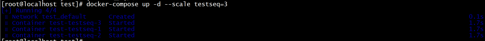

# 容器编排

我们可以通过 Dockerfile 文件让用户很方便的定义一个单独的应用容器。然而，在日常工作中，经常会碰到需要多个容器相互配合来完成某项任务的情况。

Docker Compose 恰好满足了这样的需求，它是用于**定义和运行多容器 Docker 应用程序**的工具。通过 Compose，您可以使用 `YAML` 文件来配置应用程序所需要的服务。然后使用一个命令，就可以通过 `YAML` 配置文件创建并启动所有服务。

　　Docker Compose 项目是 Docker 官方的开源项目，来源于之前的 Fig 项目，使用 Python 语言编写。负责实现对 Docker 容器集群的快速编排。项目地址为：https://github.com/docker/compose/releases

　　Docker Compose 使用的三个步骤为：

- 使用 `Dockerfile` 文件（镜像）定义应用程序的环境；
- 使用 `docker-compose.yml` 文件定义构成应用程序的服务，这样它们可以在隔离环境中一起运行；
- 最后，执行 `docker-compose up` 命令来创建并启动所有服务。

## 1. Compose安装

官方文档：https://docs.docker.com/compose/install/

　　我们可以使用 `curl` 命令从 Github 下载它的二进制文件来使用，运行以下命令下载 Docker Compose 的当前稳定版本。或者从网页下载后上传至服务器指定目录 `/usr/local/bin` 也行。

~~~shell
sudo curl -L "https://github.com/docker/compose/releases/download/v2.3.3/docker-compose-$(uname -s)-$(uname -m)" -o /usr/local/bin/docker-compose
~~~

因为 Docker Compose 存放在 GitHub，可能不太稳定。你也可以通过执行下面的命令，高速安装 Compose。该加速通道由 `DaoCloud` 提供：http://get.daocloud.io/#install-compose

~~~shell
sudo curl -L https://get.daocloud.io/docker/compose/releases/download/v2.3.3/docker-compose-`uname -s`-`uname -m` > /usr/local/bin/docker-compose

~~~

您可以通过修改 URL 中的版本，自定义您所需要的版本文件。

授权：

~~~shell
# 将可执行权限应用于该二进制文件
sudo chmod +x /usr/local/bin/docker-compose
~~~

测试：

~~~shell
docker-compose --version
~~~

卸载 Compose 非常简单，直接删除二进制文件即可

~~~shell
sudo rm /usr/local/bin/docker-compose
~~~

## 2. docker-compose.yml文件详解

　官方文档：https://docs.docker.com/compose/compose-file/

　Docker Compose 允许用户通过 `docker-compose.yml` 文件（YAML 格式）来定义一组相关联的容器为一个工程`（project）`。一个工程包含多个服务`（service）`，每个服务中定义了创建容器时所需的镜像、参数、依赖等。

> 工程名若无特殊指定，即为 `docker-compose.yml` 文件所在目录的名称。

　　Docker Compose 模板文件我们需要关注的顶级配置有 `version`、`services`、`networks`、`volumes` 几个部分：

- `version`：描述 Compose 文件的版本信息，当前最新版本为 `3.8`，对应的 Docker 版本为 `19.03.0+`
- `services`：定义服务，可以多个，每个服务中定义了创建容器时所需的镜像、参数、依赖等；
- `networkds`：定义网络，可以多个，根据 DNS server 让相同网络中的容器可以直接通过容器名称进行通信；
- `volumes`：数据卷，用于实现目录挂载。

### 2.1 案例

在配置文件中，所有的容器通过 `services` 来定义，然后使用 `docker-compose` 脚本来启动，停止和重启容器，非常适合多个容器组合使用进行开发的场景。我们先从一个简单的 Compose 案例学起。

　　编写 `docker-compose.yml` 文件：

~~~yml
# 创建目录
mkdir -p /mnt/dcoker/docker-compose/docker-nginx
# 切换至指定目录
cd /mnt/dcoker/docker-compose/docker-nginx/
# 编写 docker-compose.yml 文件
vim docker-compose.yml
~~~

在文件中添加以下内容：

~~~yml
# 描述 Compose 文件的版本信息
version: "3.8"
# 定义服务，可以多个
services:
  nginx: # 服务名称
    image: nginx # 创建容器时所需的镜像
    container_name: mynginx # 容器名称，默认为"工程名称_服务条目名称_序号"
    ports: # 宿主机与容器的端口映射关系
      - "80:80" # 左边宿主机端口:右边容器端口
    networks: # 配置容器连接的网络，引用顶级 networks 下的条目
      - nginx-net

# 定义网络，可以多个。如果不声明，默认会创建一个网络名称为"工程名称_default"的 bridge 网络
networks:
  nginx-net: # 一个具体网络的条目名称
    name: nginx-net # 网络名称，默认为"工程名称_网络条目名称"
    driver: bridge # 网络模式，默认为 bridge

~~~

使用 `docker-compose up` 创建并启动所有服务

~~~shell
# 前台启动
docker-compose up
# 后台启动
docker-compose up -d
~~~

浏览器访问：http://192.168.200.101/ 

使用 `docker-compose down` 可以停止并删除容器、网络

### 2.2 version

描述 Compose 文件的版本信息，当前最新版本为 `3.8`，对应的 Docker 版本为 `19.03.0+`。关于每个版本的详细信息请参考：https://docs.docker.com/compose/compose-file/compose-versioning/

　　以下为 Compose 文件的版本信息所对应的 Docker 版本。


### 2.3 services

`services` 用来定义服务，可以多个，每个服务中定义了创建容器时所需的镜像、参数、依赖等，就像将命令行参数传递给 `docker run` 一样。同样，网络和数据卷的定义也是一样的。

比如，之前我们通过 `docker run` 命令构建一个 MySQL 应用容器的命令如下：


```shell
docker run -di --name mysql8 -p 3306:3306 -v /mydata/docker_mysql/conf:/etc/mysql/conf.d -v /mydata/docker_mysql/data:/var/lib/mysql -e MYSQL_ROOT_PASSWORD=1234 mysql:8
```

　　使用 `docker-compose.yml` 以后则可以这样定义：


```yml
# 描述 Compose 文件的版本信息
version: "3.8"
# 定义服务，可以多个
services:
  mysql: # 服务名称
    image: mysql:8 # 创建容器时所需的镜像
    container_name: mysql8 # 容器名称，默认为"工程名称_服务条目名称_序号"
    ports: # 宿主机与容器的端口映射关系
      - "3306:3306" # 左边宿主机端口:右边容器端口
    environment: # 创建容器时所需的环境变量
      MYSQL_ROOT_PASSWORD: 1234
    volumes:
      - "/mydata/docker_mysql/conf:/etc/mysql/conf.d"
      - "/mydata/docker_mysql/data:/var/lib/mysql"
```

　　然后通过 `dokcer-compose` 相关命令即可完成容器的创建，停止或删除等一系列操作。

#### 2.3.1 image

指定创建容器时所需的**镜像名称标签**或者**镜像 ID**。如果镜像在本地不存在，会去远程拉取。

~~~yml
services:
  web:
    image: hello-world
~~~

#### 2.3.2 build

除了可以基于指定的镜像构建容器，还可以基于 `Dockerfile` 文件构建，在使用 `up` 命令时会执行构建任务

通过 `build` 配置项可以指定 `Dockerfile` 所在文件夹的路径。Compose 将会利用 `Dockerfile` 自动构建镜像，然后使用镜像启动服务容器

`build` 配置项可以使用绝对路径，也可以使用相对路径

~~~shell
# 绝对路径，在该路径下基于名称为 Dockerfile 的文件构建镜像
/usr/local/docker-centos
# 相对路径，相对当前 docker-compose.yml 文件所在目录，基于名称为 Dockerfile 的文件构建镜像
.
~~~

通过基础镜像 `centos:7`，在该镜像中安装 jdk 和 tomcat 以后将其制作为一个新的镜像 `mycentos:7`

创建目录并编写 `Dockerfile` 文件

~~~shell
# 创建目录
mkdir -p /mnt/docker/docker-compose/docker-centos
# 切换至指定目录
cd /mnt/docker/docker-compose/docker-centos/
# 编写 Dockerfile 文件
vim Dockerfile

~~~

`Dockerfile` 文件内容如下：

~~~shell
# 指明构建的新镜像是来自于 centos:7 基础镜像
FROM centos:7
# 通过镜像标签声明了作者信息
LABEL maintainer="mszlu.com"
# 设置工作目录
WORKDIR /usr/local
# 新镜像构建成功以后创建指定目录
RUN mkdir -p /usr/local/java && mkdir -p /usr/local/tomcat
# 拷贝文件到镜像中并解压
ADD jdk-11.0.8_linux-x64_bin.tar.gz /usr/local/java
ADD apache-tomcat-9.0.59.tar.gz /usr/local/tomcat
# 暴露容器运行时的 8080 监听端口给外部
EXPOSE 8080
# 设置容器内 JAVA_HOME 环境变量
ENV JAVA_HOME /usr/local/java/jdk-11.0.8/
ENV PATH $PATH:$JAVA_HOME/bin
# 启动容器时启动 tomcat 并查看 tomcat 日志信息
CMD ["/usr/local/tomcat/apache-tomcat-9.0.59/bin/catalina.sh", "run"]

~~~

将所需的资源包 `jdk` 和 `tomcat` 上传至 Dockerfile 同一目录

创建目录并编写 `docker-compose.yml` 文件

~~~yml
# 描述 Compose 文件的版本信息
version: "3.8"
# 定义服务，可以多个
services:
  mycentos: # 服务名称
    build: . # 相对当前 docker-compose.yml 文件所在目录，基于名称为 Dockerfile 的文件构建镜像
    container_name: mycentos7 # 容器名称，默认为"工程名称_服务条目名称_序号"
    ports: # 宿主机与容器的端口映射关系
      - "8080:8080" # 左边宿主机端口:右边容器端口

~~~

然后通过 `docker-compose` 相关命令即可完成容器的创建，停止或删除等一系列操作

#### 2.3.3 context

该选项可以是 Dockerfile 文件的绝对/相对路径，也可以是远程 Git 仓库的 URL，当提供的值是相对路径时，相对当前 docker-compose.yml 文件所在目录。

~~~yml
build:
  context: . # 相对当前 docker-compose.yml 文件所在目录，基于名称为 Dockerfile 的文件构建镜像
~~~

#### 2.3.4 dockerfile

一般情况下，默认都基于文件名叫 Dockerfile 的文件构建镜像，当然也可以是自定义的文件名，使用 `dockerfile` 声明，不过这个选项只能声明文件名，文件所在路径还是要通过 centext 来声明

~~~yml
build:
  context: . # 相对当前 docker-compose.yml 文件所在目录
  dockerfile: Dockerfile-alternate # 基于名称为 Dockerfile-alternate 的文件构建镜像

~~~

#### 2.3.5 container_name

Compose 创建的容器默认生成的名称格式为：`工程名称_服务条目名称_序号`。如果要使用自定义名称，使用 `container_name` 声明

~~~yml
services:
  mycentos:
    build: .
    container_name: mycentos7 # 容器名称，默认为"工程名称_服务条目名称_序号"

~~~

**因为 Docker 容器名称必须是唯一的，所以如果指定了自定义名称，就不能将服务扩展至多个容器。这样做可能会导致错误**

#### 2.3.6 序号

序号是干什么用的呢？

`docker-compose.yml` 文件内容如下

~~~yml
# 描述 Compose 文件的版本信息
version: "3.8"
# 定义服务，可以多个
services:
  testseq: # 服务名称
    image: centos:7
~~~

然后通过 `--scale` 指定 `testseq` 服务一次性启动 3 个

~~~shell
docker-compose up -d --scale testseq=3
~~~


通过下图可以看到有 3 个容器被创建，容器名称最后的**序号**是从 1 开始累加的，这就是序号的作用。所以如果指定了自定义名称，就不能将服务扩展至多个容器



#### 2.3.7 depends_on

使用 Compose 最大的好处就是敲最少的命令做更多的事情，但一般项目容器启动的顺序是有要求的，如果直接从上到下启动容器，必然会因为容器依赖问题而启动失败。例如在没有启动数据库容器的情况下启动了 Web 应用容器，应用容器会因为找不到数据库而退出。`depends_on` 就是用来解决容器依赖、启动先后问题的配置项

~~~yml
version: "3.8"
services:
  web:
    build: .
    depends_on:
      - db
      - redis
  redis:
    image: redis
  db:
    image: mysql

~~~

上述 YAML 文件定义的容器会先启动 db 和 redis 两个服务，最后才启动 web 服务。

#### 2.3.8 port

容器对外暴露的端口，格式：`左边宿主机端口:右边容器端口`

~~~yml
ports:
  - "80:80"
  - "8080:8080"

~~~

#### 2.3.9 expose

容器暴露的端口不映射到宿主机，只允许能被连接的服务访问

~~~yml
expose:
  - "80"
  - "8080"
~~~

#### 2.3.10 restart

容器重启策略，简单的理解就是 Docker 重启以后容器要不要一起启动：

- `no`：默认的重启策略，在任何情况下都不会重启容器；
- `on-failure`：容器非正常退出时，比如退出状态为`非0`(异常退出)，才会重启容器；
- `always`：容器总是重新启动，即使容器被手动停止了，当 Docker 重启时容器也还是会一起启动；
- `unless-stopped`：容器总是重新启动，除非容器被停止（手动或其他方式），那么 Docker 重启时容器则不会启动

~~~yml
services:
  nginx:
    image: nginx
    container_name: mynginx
    ports:
      - "80:80"
    restart: always

~~~

#### 2.3.11 environment

添加环境变量。可以使用数组也可以使用字典。布尔相关的值（true、false、yes、no）都需要用引号括起来，以确保 YML 解析器不会将它们转换为真或假

~~~yml
environment:
  RACK_ENV: development
  SHOW: 'true'
  SESSION_SECRET:

~~~

或者以下格式：

~~~yml
environment:
  - RACK_ENV=development
  - SHOW=true
  - SESSION_SECRET

~~~

#### 2.3.12 env_file

从文件中获取环境变量，可以指定一个或多个文件，其优先级低于 environment 指定的环境变量

~~~yml
env_file:
  - /opt/runtime_opts.env # 绝对路径
  - ./common.env # 相对路径，相对当前 docker-compose.yml 文件所在目录
  - ./apps/web.env # 相对路径，相对当前 docker-compose.yml 文件所在目录

~~~

> 注意：env 文件中的每一行需采用 `键=值` 格式。以 `#` 开头的行会被视为注释并被忽略。空行也会被忽略。

#### 2.3.13 command

覆盖容器启动后默认执行的命令

~~~yml
command: echo "helloworld"
~~~

该命令也可以是一个列表

~~~yml
command: ["echo", "helloworld"]
~~~

#### 2.3.14 volumes

数据卷，用于实现目录挂载，支持**指定目录挂载**、**匿名挂载**、**具名挂载**。

- 指定目录挂载的格式为：`左边宿主机目录:右边容器目录`，或者`左边宿主机目录:右边容器目录:读写权限`；
- 匿名挂载格式为：`容器目录即可`，或者`容器目录即可:读写权限`；
- 具名挂载格式为：`数据卷条目名称:容器目录`，或者`数据卷条目名称:容器目录:读写权限`。

~~~yml
# 描述 Compose 文件的版本信息
version: "3.8"
# 定义服务，可以多个
services:
  mysql: # 服务名称
    image: mysql:8 # 创建容器时所需的镜像
    container_name: mysql8 # 容器名称，默认为"工程名称_服务条目名称_序号"
    ports: # 宿主机与容器的端口映射关系
      - "3306:3306" # 左边宿主机端口:右边容器端口
    environment: # 创建容器时所需的环境变量
      MYSQL_ROOT_PASSWORD: 1234
    volumes:
      # 绝对路径
      - "/mnt/docker/docker_mysql/data:/var/lib/mysql"
      # 相对路径，相对当前 docker-compose.yml 文件所在目录
      - “./conf:/etc/mysql/conf.d“
      # 匿名挂载，匿名挂载只需要写容器目录即可，容器外对应的目录会在 /var/lib/docker/volume 中生成
      - "/var/lib/mysql"
      # 具名挂载，就是给数据卷起了个名字，容器外对应的目录会在 /var/lib/docker/volume 中生成
      - "mysql-data-volume:/var/lib/mysql"

# 定义数据卷，可以多个
volumes:
  mysql-data-volume: # 一个具体数据卷的条目名称
    name: mysql-data-volume # 数据卷名称，默认为"工程名称_数据卷条目名称"

~~~

#### 2.3.15 network_mode

设置网络模式，类似 `docker run` 时添加的参数 `--net host` 或者 `--network host` 的用法

~~~yml
network_mode: "bridge"
network_mode: "host"
network_mode: "none"
network_mode: "service:[service name]"
network_mode: "container:[container name/id]"

~~~

#### 2.3.16 networks

配置容器连接的网络，引用顶级 networks 下的条目

~~~yml
# 定义服务，可以多个
services:
  nginx: # 服务名称
    networks: # 配置容器连接的网络，引用顶级 networks 下的条目
      - nginx-net # 一个具体网络的条目名称

# 定义网络，可以多个。如果不声明，默认会创建一个网络名称为"工程名称_default"的 bridge 网络
networks:
  nginx-net: # 一个具体网络的条目名称
    name: nginx-net # 网络名称，默认为"工程名称_网络条目名称"
    driver: bridge # 网络模式，默认为 bridge

~~~

#### 2.3.17 aliases

网络上此服务的别名。

同一网络上的其他容器可以使用服务名或此别名连接到服务容器。

同一服务在不同的网络上可以具有不同的别名

~~~yml
# 定义服务，可以多个
services:
  nginx: # 服务名称
    networks: # 配置容器连接的网络，引用顶级 networks 下的条目
      nginx-net: # 一个具体网络的条目名称
        aliases: # 服务别名，可以多个
          - nginx1 # 同一网络上的其他容器可以使用服务名或此别名连接到服务容器

# 定义网络，可以多个。如果不声明，默认会创建一个网络名称为"工程名称_default"的 bridge 网络
networks:
  nginx-net: # 一个具体网络的条目名称
    name: nginx-net # 网络名称，默认为"工程名称_网络条目名称"
    driver: bridge # 网络模式，默认为 bridge

~~~

### 2.4 volumes

以下方式的数据卷声明创建卷时会使用默认的名称：`"工程名称_数据卷条目名称"`

~~~yml
# 描述 Compose 文件的版本信息
version: "3.8"
# 定义服务，可以多个
services:
  mysql:
    image: mysql:8
    container_name: mysql8
    ports:
      - "3306:3306"
    environment
      MYSQL_ROOT_PASSWORD: 1234
    volumes:
      # 具名挂载，就是给数据卷起了个名字，容器外对应的目录会在 /var/lib/docker/volume 中生成
      - "mysql-data-volume:/var/lib/mysql"

# 定义数据卷，可以多个
volumes:
  mysql-data-volume: # 一个具体数据卷的条目名称

~~~

以下方式的数据卷声明创建卷时会使用自定义的名称

~~~yml
# 描述 Compose 文件的版本信息
version: "3.8"
# 定义服务，可以多个
services:
  mysql:
    image: mysql:8
    container_name: mysql8
    ports:
      - "3306:3306"
    environment
      MYSQL_ROOT_PASSWORD: 1234
    volumes:
      # 具名挂载，就是给数据卷起了个名字，容器外对应的目录会在 /var/lib/docker/volume 中生成
      - "mysql-data-volume:/var/lib/mysql"

# 定义数据卷，可以多个
volumes:
  mysql-data-volume: # 一个具体数据卷的条目名称
    name: mysql-data-volume # 数据卷名称，默认为"工程名称_数据卷条目名称"

~~~

### 2.5 networks

如果不声明网络，每个工程默认会创建一个网络名称为`"工程名称_default"`的 `bridge` 网络。

~~~yml
# 描述 Compose 文件的版本信息
version: "3.8"
# 定义服务，可以多个
services:
  nginx:
    image: nginx
    container_name: mynginx
    ports:
      - "80:80"

# 定义网络，可以多个。如果不声明，默认会创建一个网络名称为"工程名称_default"的 bridge 网络
#networks:

~~~

以下方式的网络声明创建网络时会使用默认的名称：`"工程名称_网络条目名称"`，网络模式默认为 `bridge`

~~~yml
# 描述 Compose 文件的版本信息
version: "3.8"
# 定义服务，可以多个
services:
  nginx:
    image: nginx
    container_name: mynginx
    ports:
      - "80:80"
    networks: # 配置容器连接的网络，引用顶级 networks 下的条目
      nginx-net:

# 定义网络，可以多个
networks:
  nginx-net: # 一个具体网络的条目名称

~~~

以下方式的网络声明创建网络时会使用自定义的名称，还可以通过 `driver` 选择网络模式，默认为 `bridge`

~~~yml
# 描述 Compose 文件的版本信息
version: "3.8"
# 定义服务，可以多个
services:
  nginx:
    image: nginx
    container_name: mynginx
    ports:
      - "80:80"
    networks: # 配置容器连接的网络，引用顶级 networks 下的条目
      nginx-net:

# 定义网络，可以多个
networks:
  nginx-net: # 一个具体网络的条目名称
    name: nginx-net # 网络名称，默认为"工程名称_网络条目名称"
    driver: bridge # 网络模式，默认为 bridge

~~~

## 3. Compose 常用命令

官方文档：https://docs.docker.com/compose/reference/overview/

为了更熟练的使用 Compose，以下常用命令大家多多练习，方可熟能生巧。

~~~shell
docker-compose [-f <arg>...] [options] [COMMAND] [ARGS...]
~~~

部分命令选项如下：

- `-f，--file`：指定使用的 Compose 模板文件，默认为 `docker-compose.yml`，可以多次指定，指定多个 yml；
- `-p, --project-name`：指定工程名称，默认使用 `docker-compose.yml` 文件所在目录的名称；
- `-v`：打印版本并退出；
- `--log-level`：定义日志等级（DEBUG, INFO, WARNING, ERROR, CRITICAL）。

### 3.1 help

`docker-compose -help` 查看帮助

~~~shell
[root@localhost ~]# docker-compose -help
Define and run multi-container applications with Docker.

Usage:
  docker-compose [-f <arg>...] [options] [COMMAND] [ARGS...]
  docker-compose -h|--help

Options:
  -f, --file FILE             Specify an alternate compose file
                              (default: docker-compose.yml)
  -p, --project-name NAME     Specify an alternate project name
                              (default: directory name)
  -c, --context NAME          Specify a context name
  --verbose                   Show more output
  --log-level LEVEL           Set log level (DEBUG, INFO, WARNING, ERROR, CRITICAL)
  --no-ansi                   Do not print ANSI control characters
  -v, --version               Print version and exit
  -H, --host HOST             Daemon socket to connect to

  --tls                       Use TLS; implied by --tlsverify
  --tlscacert CA_PATH         Trust certs signed only by this CA
  --tlscert CLIENT_CERT_PATH  Path to TLS certificate file
  --tlskey TLS_KEY_PATH       Path to TLS key file
  --tlsverify                 Use TLS and verify the remote
  --skip-hostname-check       Don't check the daemon's hostname against the
                              name specified in the client certificate
  --project-directory PATH    Specify an alternate working directory
                              (default: the path of the Compose file)
  --compatibility             If set, Compose will attempt to convert keys
                              in v3 files to their non-Swarm equivalent
  --env-file PATH             Specify an alternate environment file

Commands:
  build              Build or rebuild services
  config             Validate and view the Compose file
  create             Create services
  down               Stop and remove containers, networks, images, and volumes
  events             Receive real time events from containers
  exec               Execute a command in a running container
  help               Get help on a command
  images             List images
  kill               Kill containers
  logs               View output from containers
  pause              Pause services
  port               Print the public port for a port binding
  ps                 List containers
  pull               Pull service images
  push               Push service images
  restart            Restart services
  rm                 Remove stopped containers
  run                Run a one-off command
  scale              Set number of containers for a service
  start              Start services
  stop               Stop services
  top                Display the running processes
  unpause            Unpause services
  up                 Create and start containers
  version            Show the Docker-Compose version information

~~~

### 3.2 config

`docker-compose config -q` 验证 `docker-compose.yml` 文件。当配置正确时，不输出任何内容，当配置错误时，输出错误信息。

### 3.3 pull

`docker-compose pull` 拉取服务依赖的镜像

~~~shell
# 拉取工程中所有服务依赖的镜像
docker-compose pull
# 拉取工程中 nginx 服务依赖的镜像
docker-compose pull nginx
# 拉取镜像过程中不打印拉取进度信息
docker-compose pull -q

~~~

### 3.4 up

`docker-compose up` 创建并启动所有服务的容器。指定多个 yml 加 `-f` 选项。以守护进程模式运行加 `-d` 选项。

~~~shell
# 前台启动
docker-compose up
# 后台启动
docker-compose up -d
# -f 指定使用的 Compose 模板文件，默认为 docker-compose.yml，可以多次指定，指定多个 yml
docker-compose -f docker-compose.yml up -d 

~~~

### 3.5 logs

`docker-compose logs` 查看服务容器的输出日志。默认情况下，docker-compose 将对不同的服务输出使用不同的颜色来区分。可以通过 `--no-color` 来关闭颜色

~~~shell
# 输出日志，不同的服务输出使用不同的颜色来区分
docker-compose logs
# 跟踪日志输出
docker-compose logs -f
# 关闭颜色
docker-compose logs --no-color

~~~

### 3.6 ps

`docker-compose ps` 列出工程中所有服务的容器

~~~shell
# 列出工程中所有服务的容器
docker-compose ps
# 列出工程中指定服务的容器
docker-compose ps nginx

~~~

### 3.7 run

`docker-compose run` 在指定服务容器上执行一个命令

~~~shell
# 在工程中指定服务的容器上执行 echo "helloworld"
docker-compose run nginx echo "helloworld"
~~~

### 3.8 exec

`docker-compose exec` 进入服务容器

~~~shell
# 进入工程中指定服务的容器
docker-compose exec nginx bash
# 当一个服务拥有多个容器时，可通过 --index 参数进入到该服务下的任何容器
docker-compose exec --index=1 nginx bash

~~~

### 3.9 pause

`docker-compose pause` 暂停服务容器

~~~shell
# 暂停工程中所有服务的容器
docker-compose pause
# 暂停工程中指定服务的容器
docker-compose pause nginx

~~~

### 3.10 unpause

`docker-compose unpause` 恢复服务容器

~~~shell
# 恢复工程中所有服务的容器
docker-compose unpause
# 恢复工程中指定服务的容器
docker-compose unpause nginx

~~~

### 3.11 restart

`docker-compose restart` 重启服务容器

~~~shell
# 重启工程中所有服务的容器
docker-compose restart
# 重启工程中指定服务的容器
docker-compose restart nginx

~~~

### 3.12 start

`docker-compose start` 启动服务容器

~~~shell
# 启动工程中所有服务的容器
docker-compose start
# 启动工程中指定服务的容器
docker-compose start nginx

~~~

### 3.13 stop

`docker-compose stop` 停止服务容器

~~~shell
# 停止工程中所有服务的容器
docker-compose stop
# 停止工程中指定服务的容器
docker-compose stop nginx

~~~

### 3.14 kill

`docker-compose kill` 通过发送 `SIGKILL` 信号停止指定服务的容器

~~~shell
# 通过发送 SIGKILL 信号停止工程中指定服务的容器
docker-compose kill nginx

~~~

### 3.15 rm

`docker-compose rm` 删除服务（停止状态）容器

~~~shell
# 删除所有（停止状态）服务的容器
docker-compose rm
# 先停止所有服务的容器，再删除所有服务的容器
docker-compose rm -s
# 不询问是否删除，直接删除
docker-compose rm -f
# 删除服务容器挂载的数据卷
docker-compose rm -v
# 删除工程中指定服务的容器
docker-compose rm -sv nginx

~~~

### 3.16 down

停止并删除所有服务的容器、网络、镜像、数据卷

~~~shell
# 停止并删除工程中所有服务的容器、网络
docker-compose down
# 停止并删除工程中所有服务的容器、网络、镜像
docker-compose down --rmi all
# 停止并删除工程中所有服务的容器、网络、数据卷
docker-compose down -v

~~~

### 3.17 ~~create~~

`docker-compose create` 为服务创建容器，已不推荐使用。推荐使用 `docker-compose up` 来实现该功能

### 3.18 ~~scale~~

`docker-compose scale` 设置指定服务运行的容器个数，已不推荐使用

推荐使用 `--scale service=num` 的参数来设置数量

~~~shell
# 通过 --scale 指定 helloworld 服务一次性启动 3 个
docker-compose up -d --scale helloworld=3
~~~

### 3.19 images

`docker-compose images` 打印服务容器所对应的镜像

~~~shell
# 打印所有服务的容器所对应的镜像
docker-compose images
# 打印指定服务的容器所对应的镜像
docker-compose images nginx

~~~

### 3.20 port

`docker-compose port` 打印指定服务容器的某个端口所映射的宿主机端口

~~~shell
[root@localhost docker-nginx]# docker-compose port nginx 80
0.0.0.0:80
~~~

### 3.21 top

`docker-compose top` 显示正在运行的进程

~~~shell
# 显示工程中所有服务的容器正在运行的进程
docker-compose top
# 显示工程中指定服务的容器正在运行的进程
docker-compose top nginx

~~~

