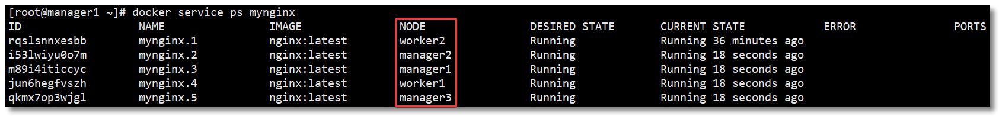

# Docker Swarm

Docker Swarm 是 Docker 官方推出的容器集群管理工具，基于 Go 语言实现。代码开源在：https://github.com/docker/swarm 使用它可以将多个 Docker 主机封装为单个大型的虚拟 Docker 主机，快速打造一套容器云平台。

Docker Swarm 是生产环境中运行 Docker 应用程序最简单的方法。作为容器集群管理器，Swarm 最大的优势之一就是 100% 支持标准的 Docker API。各种基于标准 API 的工具比如 Compose、docker-py、各种管理软件，甚至 Docker 本身等都可以很容易的与 Swarm 进行集成。大大方便了用户将原先基于单节点的系统移植到 Swarm 上，同时 Swarm 内置了对 Docker 网络插件的支持，用户可以很容易地部署跨主机的容器集群服务。

　　Docker Swarm 和 Docker Compose 一样，都是 Docker 官方容器编排工具，但不同的是，**Docker Compose** 是一个在**单个服务器或主机上创建多个容器的工具**，而 **Docker Swarm** 则可以在**多个服务器或主机上创建容器集群服务**，对于微服务的部署，显然 Docker Swarm 会更加适合。

## 1. Swarm 核心概念

　　

### 1.1 Swarm

　　Docker Engine 1.12 引入了 Swarm 模式，一个 Swarm 由多个 Docker 主机组成，它们以 Swarm 集群模式运行。Swarm 集群由 **Manager 节点**（管理者角色，管理成员和委托任务）和 **Worker 节点**（工作者角色，运行 Swarm 服务）组成。这些 Docker 主机有些是 Manager 节点，有些是 Worker 节点，或者同时扮演这两种角色。

　　Swarm 创建服务时，需要指定要使用的镜像、在运行的容器中执行的命令、定义其副本的数量、可用的网络和数据卷、将服务公开给外部的端口等等。与独立容器相比，集群服务的主要优势之一是，你可以修改服务的配置，包括它所连接的网络和数据卷等，而不需要手动重启服务。还有就是，如果一个 Worker Node 不可用了，Docker 会调度不可用 Node 的 Task 任务到其他 Nodes 上。

　　

### 1.2 Nodes

　　

　　Swarm 集群由 **Manager 节点**（管理者角色，管理成员和委托任务）和 **Worker 节点**（工作者角色，运行 Swarm 服务）组成。一个节点就是 Swarm 集群中的一个实例，也就是一个 Docker 主机。你可以运行一个或多个节点在单台物理机或云服务器上，但是生产环境上，典型的部署方式是：Docker 节点交叉分布式部署在多台物理机或云主机上。节点名称默认为机器的 hostname。

- **Manager**：负责整个集群的管理工作包括集群配置、服务管理、容器编排等所有跟集群有关的工作，它会选举出一个 leader 来指挥编排任务；
- **Worker**：工作节点接收和执行从管理节点分派的任务（Tasks）运行在相应的服务（Services）上。

　　

### 1.3 Services and Tasks

　　

　　**服务**（Service）是一个抽象的概念，是对要在管理节点或工作节点上执行的**任务的定义**。它是集群系统的中心结构，是用户与集群交互的主要根源。Swarm 创建服务时，可以为服务定义以下信息：

- 服务名称；
- 使用哪个镜像来创建容器；
- 要运行多少个副本；
- 服务的容器要连接到哪个网络上；
- 要映射哪些端口。

　　**任务**（Task）包括**一个 Docker 容器**和**在容器中运行的命令**。任务是一个集群的最小单元，任务与容器是一对一的关系。管理节点根据服务规模中设置的副本数量将任务分配给工作节点。一旦任务被分配到一个节点，便无法移动到另一个节点。它只能在分配的节点上运行或失败。

　　

### 1.4 Replicated and global services

　　

　　Swarm 不只是提供了优秀的高可用性，同时也提供了节点的**弹性扩容和缩容**的功能。可以通过以下两种类型的 Services 部署实现：

- **Replicated Services**：当服务需要动态扩缩容时，只需通过 `scale` 参数或者 `--replicas n` 参数指定运行相同任务的数量，即可复制出新的副本，将一系列复制任务分发至各节点当中，这种操作便称之为**副本服务**（Replicate）。
- **Global Services**：我们也可以通过 `--mode global` 参数将服务分发至全部节点之上，这种操作我们称之为**全局服务**（Global）。在每个节点上运行一个相同的任务，不需要预先指定任务的数量，每增加一个节点到 Swarm 中，协调器就会创建一个任务，然后调度器把任务分配给新节点。

　　下图用黄色表示拥有三个副本服务 Replicated Service，用灰色表示拥有一个全局服务 Global Service。

　　

## 2. Swarm 工作流程

　　

Swarm Manager：

1. API：接受命令并创建 service 对象（创建对象）
2. orchestrator：为 service 对象创建的 task 进行编排工作（服务编排）
3. allocater：为各个 task 分配 IP 地址（分配 IP）
4. dispatcher：将 task 分发到 nodes（分发任务）
5. scheduler：安排一个 worker 节点运行 task（运行任务）

　　

Worker Node：

1. worker：连接到调度器，检查分配的 task（检查任务）
2. executor：执行分配给 worker 节点的 task（执行任务）

　　

## 3. Overlay 网络

　　

　　关于 Docker 的网络我们在网络那个章节中已经给大家详细讲解过。

不过，Docker Swarm 集群模式下却默认使用的是 Overlay 网络（覆盖网络），这里简单介绍一下什么是 Overlay 网络。

　　Overlay 网络其实并不是一门新技术，它是指构建在另一个网络上的计算机网络，这是一种网络虚拟化技术的形式，近年来云计算虚拟化技术的演进促进了网络虚拟化技术的应用。所以 Overlay 网络就是建立在另一个计算机网络之上的虚拟网络，它是不能独立出现的，Overlay 底层依赖的网络就是 Underlay 网络。

　　Underlay 网络是专门用来承载用户 IP 流量的基础架构层，它与 Overlay 网络之间的关系有点类似物理机和虚拟机。Underlay 网络和物理机都是真正存在的实体，它们分别对应着真实存在的网络设备和计算设备，而 Overlay 网络和虚拟机都是依托在下层实体的基础之上，使用软件虚拟出来的层级。

　　在 Docker 版本 1.12 以后 **Swarm 模式原生已支持覆盖网络**（Overlay Network），只要是这个覆盖网络内的容器，不管在不在同一个宿主机上都能相互通信，即跨主机通信。不同覆盖网络内的容器之间是相互隔离的（相互 ping 不通）。

　　Overlay 网络是目前主流的容器跨节点数据传输和路由方案。当然，容器在跨主机进行通信的时候，除了可以使用 overlay 网络模式进行通信之外，还可以使用 host 网络模式，直接使用物理机的 IP 地址就可以进行通信

## 4. 集群搭建

　　

### 4.1 环境准备

　　

- 五台安装了 Docker 的 CentOS 机器，版本为：`CentOS 7.8.2003`
- Docker Engine 1.12+（最低要求 1.12）
- 防火墙开启以下端口或者关闭防火墙：
  - TCP 端口 2377，用于集群管理通信；
  - TCP 和 UDP 端口 7946，用于节点之间通信；
  - UDP 端口 4789，用于覆盖网络。

　　

### 4.2 机器分布

　　

| 角色    | IP              | HOSTNAME | Docker 版本 |
| ------- | --------------- | -------- | ----------- |
| Manager | 192.168.200.101 | manager1 | 20.10.13    |
| Manager | 192.168.200.102 | manager2 | 20.10.13    |
| Manager | 192.168.200.103 | manager3 | 20.10.13    |
| Worker  | 192.168.200.104 | worker1  | 20.10.13    |
| Worker  | 192.168.200.105 | worker2  | 20.10.13    |

- 可以通过 `hostname 主机名` 修改机器的主机名（立即生效，重启后失效）；
- 或者 `hostnamectl set-hostname 主机名` 修改机器的主机名（立即生效，重启也生效）；
- 或者 `vi /etc/hosts` 编辑 hosts 文件，如下所示， 给 127.0.0.1 添加主机名（重启生效）。

~~~shell
127.0.0.1   manager1 localhost 
::1         localhost localhost.localdomain localhost6 localhost6.localdomain6
~~~

### 4.3 创建集群

　　在任意节点下通过 `docker swarm init` 命令创建一个新的 Swarm 集群并加入，且该节点会默认成为 Manager 节点。根据我们预先定义的角色，在 101 ~ 103 的任意一台机器上运行该命令即可。

　　通常，第一个加入集群的管理节点将成为 `Leader`，后来加入的管理节点都是 `Reachable`。当前的 Leader 如果挂掉，所有的 Reachable 将重新选举一个新的 Leader。

~~~shell
[root@localhost ~]# docker swarm init --advertise-addr 192.168.200.101
Swarm initialized: current node (clumstpieg0qzzxt1caeazg8g) is now a manager.

To add a worker to this swarm, run the following command:

    docker swarm join --token SWMTKN-1-5ob7jlej85qsygxubqypjuftiwruvew8e2cr4u3iuo4thxyrhg-3hbf2u3i1iagurdprl3n3yra1 192.168.10.101:2377

To add a manager to this swarm, run 'docker swarm join-token manager' and follow the instructions.

~~~

　　

### 4.4 加入集群

　　

　　Docker 中内置的集群模式自带了公钥基础设施(PKI)系统，使得安全部署容器变得简单。集群中的节点使用传输层安全协议(TLS)对集群中其他节点的通信进行身份验证、授权和加密。

　　默认情况下，通过 `docker swarm init` 命令创建一个新的 Swarm 集群时，Manager 节点会生成新的根证书颁发机构（CA）和密钥对，用于保护与加入集群的其他节点之间的通信安全。

　　Manager 节点会生成两个令牌，供其他节点加入集群时使用：一个 Worker 令牌，一个 Manager 令牌。每个令牌都包括根 CA 证书的摘要和随机生成的密钥。当节点加入群集时，加入的节点使用摘要来验证来自远程管理节点的根 CA 证书。远程管理节点使用密钥来确保加入的节点是批准的节点。

　　

　　

#### Manager

　　

　　若要向该集群添加 Manager 节点，管理节点先运行 `docker swarm join-token manager` 命令查看管理节点的令牌信息。

~~~shell
docker swarm join-token manager
~~~

然后在其他节点上运行 `docker swarm join` 并携带令牌参数加入 Swarm 集群，该节点角色为 Manager。

#### Worker

　　

要向这个集群添加一个 Worker 节点，管理节点先运行 `docker swarm join-token worker` 命令查看工作节点的令牌信息。

然后在其他节点上运行 `docker swarm join` 并携带令牌参数加入 Swarm 集群，该节点角色为 Worker。

### 4.5 查看集群信息

　　在任意 Manager 节点中运行 `docker info` 可以查看当前集群的信息。

　　

### 4.6 查看集群节点

　　

　　在任意 Manager 节点中运行 `docker node ls` 可以查看当前集群节点信息。

~~~shell
docker node ls 
~~~

> `*` 代表当前节点，现在的环境为 3 个管理节点构成 1 主 2 从，以及 2 个工作节点。

　　

　　节点 `MANAGER STATUS` 说明：表示节点是属于 Manager 还是 Worker，没有值则属于 Worker 节点。

- `Leader`：该节点是管理节点中的主节点，负责该集群的集群管理和编排决策；
- `Reachable`：该节点是管理节点中的从节点，如果 Leader 节点不可用，该节点有资格被选为新的 Leader；
- `Unavailable`：该管理节点已不能与其他管理节点通信。如果管理节点不可用，应该将新的管理节点加入群集，或者将工作节点升级为管理节点。

　　

　　节点 `AVAILABILITY` 说明：表示调度程序是否可以将任务分配给该节点。

- `Active`：调度程序可以将任务分配给该节点；
- `Pause`：调度程序不会将新任务分配给该节点，但现有任务仍可以运行；
- `Drain`：调度程序不会将新任务分配给该节点，并且会关闭该节点所有现有任务，并将它们调度在可用的节点上。

　　

### 4.7 删除节点

　　

#### Manager

　　

　　删除节点之前需要先将该节点的 `AVAILABILITY` 改为 `Drain`。其目的是为了将该节点的服务迁移到其他可用节点上，确保服务正常。最好检查一下容器迁移情况，确保这一步已经处理完成再继续往下。

~~~shell
docker node update --availability drain 节点名称|节点ID
~~~

然后，将该 Manager 节点进行降级处理，降级为 Worker 节点。

~~~shell
docker node demote 节点名称|节点ID
~~~

然后，在已经降级为 Worker 的节点中运行以下命令，离开集群。

~~~shell
docker swarm leave
~~~

最后，在管理节点中对刚才离开的节点进行删除。

~~~shell
docker node rm 节点名称|节点ID
~~~

#### Worker

　　

删除节点之前需要先将该节点的 `AVAILABILITY` 改为 `Drain`。其目的是为了将该节点的服务迁移到其他可用节点上，确保服务正常。最好检查一下容器迁移情况，确保这一步已经处理完成再继续往下。

~~~shell
docker node update --availability drain 节点名称|节点ID
~~~

然后，在准备删除的 Worker 节点中运行以下命令，离开集群。

~~~shell
docker swarm leave
~~~

最后，在管理节点中对刚才离开的节点进行删除。

~~~shell
docker node rm 节点名称|节点ID
~~~

## 5. 服务部署

　　

> 注意：跟集群管理有关的任何操作，都是在 Manager 节点上操作的。

　　

~~~shell
# 如果出现manager不能用的情况 请重新选举
docker swarm init --force-new-cluster
~~~

### 5.1 创建服务

　　

　　下面这个案例，使用 nginx 镜像创建了一个名为 mynginx 的服务，该服务会被随机指派给一个工作节点运行。

~~~shell
docker service create --replicas 1 --name mynginx -p 80:80 nginx
~~~

- `docker service create`：创建服务；
- `--replicas`：指定一个服务有几个实例运行；
- `--name`：服务名称。

　　

### 5.2 查看服务

　　

可以通过 `docker service ls` 查看运行的服务。

~~~shell
[root@manager1 ~]# docker service ls
ID                NAME           MODE              REPLICAS        IMAGE              PORTS
hepx06k5ik5n      mynginx        replicated        1/1             nginx:latest       *:80->80/tcp

~~~

　　

可以通过 `docker service inspect 服务名称|服务ID` 查看服务的详细信息。

~~~shell
[root@manager1 ~]# docker service inspect mynginx
[
    {
        "ID": "k0dbjg1zzy3l3g71kdwa56ect",
        "Version": {
            "Index": 127
        },
        "CreatedAt": "2020-09-16T10:05:55.627974095Z",
        "UpdatedAt": "2020-09-16T10:05:55.629507771Z",
        "Spec": {
            "Name": "mynginx",
            "Labels": {},
            "TaskTemplate": {
                "ContainerSpec": {
                    "Image": "nginx:latest@sha256:c628b67d21744fce822d22fdcc0389f6bd763daac23a6b77147d0712ea7102d0",
                    "Init": false,
                    "StopGracePeriod": 10000000000,
                    "DNSConfig": {},
                    "Isolation": "default"
                },
                "Resources": {
                    "Limits": {},
                    "Reservations": {}
                },
                "RestartPolicy": {
                    "Condition": "any",
                    "Delay": 5000000000,
                    "MaxAttempts": 0
                },
                "Placement": {
                    "Platforms": [
                        {
                            "Architecture": "amd64",
                            "OS": "linux"
                        },
                        {
                            "OS": "linux"
                        },
                        {
                            "OS": "linux"
                        },
                        {
                            "Architecture": "arm64",
                            "OS": "linux"
                        },
                        {
                            "Architecture": "386",
                            "OS": "linux"
                        },
                        {
                            "Architecture": "mips64le",
                            "OS": "linux"
                        },
                        {
                            "Architecture": "ppc64le",
                            "OS": "linux"
                        },
                        {
                            "Architecture": "s390x",
                            "OS": "linux"
                        }
                    ]
                },
                "ForceUpdate": 0,
                "Runtime": "container"
            },
            "Mode": {
                "Replicated": {
                    "Replicas": 1
                }
            },
            "UpdateConfig": {
                "Parallelism": 1,
                "FailureAction": "pause",
                "Monitor": 5000000000,
                "MaxFailureRatio": 0,
                "Order": "stop-first"
            },
            "RollbackConfig": {
                "Parallelism": 1,
                "FailureAction": "pause",
                "Monitor": 5000000000,
                "MaxFailureRatio": 0,
                "Order": "stop-first"
            },
            "EndpointSpec": {
                "Mode": "vip",
                "Ports": [
                    {
                        "Protocol": "tcp",
                        "TargetPort": 80,
                        "PublishedPort": 80,
                        "PublishMode": "ingress"
                    }
                ]
            }
        },
        "Endpoint": {
            "Spec": {
                "Mode": "vip",
                "Ports": [
                    {
                        "Protocol": "tcp",
                        "TargetPort": 80,
                        "PublishedPort": 80,
                        "PublishMode": "ingress"
                    }
                ]
            },
            "Ports": [
                {
                    "Protocol": "tcp",
                    "TargetPort": 80,
                    "PublishedPort": 80,
                    "PublishMode": "ingress"
                }
            ],
            "VirtualIPs": [
                {
                    "NetworkID": "st2xiy7pjzap093wz4w4u6nbs",
                    "Addr": "10.0.0.15/24"
                }
            ]
        }
    }
]

~~~

可以通过 `docker service ps 服务名称|服务ID` 查看服务运行在哪些节点上。

在对应的任务节点上运行 `docker ps` 可以查看该服务对应容器的相关信息。

　　

### 5.3 调用服务

　　

　　接下来我们测试一下服务是否能被正常访问，并且该集群下任意节点的 IP 地址都要能访问到该服务才行。

　　测试结果：5 台机器均可正常访问到该服务。

　　

### 5.4 弹性服务

　　

　　将 service 部署到集群以后，可以通过命令弹性扩缩容 service 中的容器数量。在 service 中运行的容器被称为 task（任务）。

　　通过 `docker service scale 服务名称|服务ID=n` 可以将 service 运行的任务扩缩容为 n 个。

　　通过 `docker service update --replicas n 服务名称|服务ID` 也可以达到扩缩容的效果。

　　将 mynginx service 运行的任务扩展为 5 个：

~~~shell
[root@manager1 ~]# docker service scale mynginx=5
mynginx scaled to 5
overall progress: 5 out of 5 tasks 
1/5: running   [==================================================>] 
2/5: running   [==================================================>] 
3/5: running   [==================================================>] 
4/5: running   [==================================================>] 
5/5: running   [==================================================>] 
verify: Service converged

~~~

通过 `docker service ps 服务名称|服务ID` 查看服务运行在哪些节点上。

我们再来一波缩容的操作，命令如下：

~~~shell
[root@manager1 ~]# docker service update --replicas 3 mynginx
mynginx
overall progress: 3 out of 3 tasks 
1/3: running   [==================================================>] 
2/3: running   [==================================================>] 
3/3: running   [==================================================>] 
verify: Service converged

~~~

通过 `docker service ps 服务名称|服务ID` 查看服务运行在哪些节点上。

在 Swarm 集群模式下真正意义实现了所谓的**弹性服务**，动态扩缩容一行命令搞定，简单、便捷、强大。

　　

### 5.5 删除服务

　　

　　通过 `docker service rm 服务名称|服务ID` 即可删除服务。

~~~shell
[root@manager1 ~]# docker service rm mynginx
mynginx
[root@manager1 ~]# docker service ls
ID                NAME              MODE              REPLICAS          IMAGE             PORTS

~~~

　　

## 6. 滚动更新及回滚

　　

以下案例将演示 Redis 版本如何滚动升级至更高版本再回滚至上一次的操作。

首先，创建 5 个 Redis 服务副本，版本为 5，详细命令如下：

~~~shell
# 创建 5 个副本，每次更新 2 个，更新间隔 10s，20% 任务失败继续执行，超出 20% 执行回滚，每次回滚 2 个
docker service create --replicas 5 --name redis \
--update-delay 10s \
--update-parallelism 2 \
--update-failure-action continue \
--rollback-monitor 20s \
--rollback-parallelism 2 \
--rollback-max-failure-ratio 0.2 \
redis:5

~~~

- `--update-delay`：定义滚动更新的时间间隔；
- `--update-parallelism`：定义并行更新的副本数量，默认为 1；
- `--update-failure-action`：定义容器启动失败之后所执行的动作；
- `--rollback-monitor`：定义回滚的监控时间；
- `--rollback-parallelism`：定义并行回滚的副本数量；
- `--rollback-max-failure-ratio`：任务失败回滚比率，超过该比率执行回滚操作，0.2 表示 20%。

　　

　　然后通过以下命令实现服务的滚动更新。

~~~shell
docker service update --image redis:6 redis
~~~

　　

回滚服务，只能回滚到上一次操作的状态，并不能连续回滚到指定操作。

~~~shell
docker service update --rollback redis
~~~

　　

## 7. 常用命令

　　

### 7.1 docker swarm

　　

| 命令                            | 说明                 |
| ------------------------------- | -------------------- |
| docker swarm init               | 初始化集群           |
| docker swarm join-token worker  | 查看工作节点的 token |
| docker swarm join-token manager | 查看管理节点的 token |
| docker swarm join               | 加入集群             |

　　

### 7.2 docker node

　　

| 命令                                 | 说明                               |
| ------------------------------------ | ---------------------------------- |
| docker node ls                       | 查看集群所有节点                   |
| docker node ps                       | 查看当前节点所有任务               |
| docker node rm 节点名称\|节点ID      | 删除节点（`-f`强制删除）           |
| docker node inspect 节点名称\|节点ID | 查看节点详情                       |
| docker node demote 节点名称\|节点ID  | 节点降级，由管理节点降级为工作节点 |
| docker node promote 节点名称\|节点ID | 节点升级，由工作节点升级为管理节点 |
| docker node update 节点名称\|节点ID  | 更新节点                           |

　　

### 7.3 docker service

　　

| 命令                                    | 说明                     |
| --------------------------------------- | ------------------------ |
| docker service create                   | 创建服务                 |
| docker service ls                       | 查看所有服务             |
| docker service inspect 服务名称\|服务ID | 查看服务详情             |
| docker service logs 服务名称\|服务ID    | 查看服务日志             |
| docker service rm 服务名称\|服务ID      | 删除服务（`-f`强制删除） |
| docker service scale 服务名称\|服务ID=n | 设置服务数量             |
| docker service update 服务名称\|服务ID  | 更新服务                 |