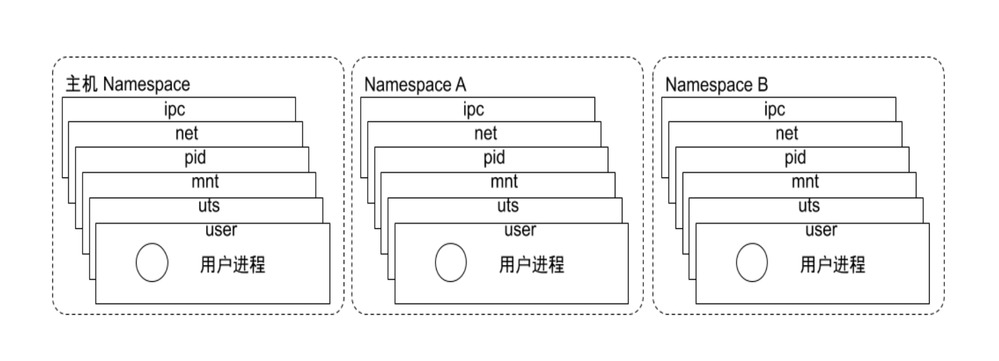

# Docker原理

在前面我们学习了Docker，接下来我们探究一下Docker的底层技术原理

Linux 命名空间（namespace）、控制组（cgroups）和 联合文件系统（UnionFS） 三大技术支撑了目前 Docker 的实现，也是 Docker 能够出现的最重要原因

## 1. Namespace

**背景**

> 在日常使用 Linux 时，我们并没有运行多个完全分离的服务器的需要，但是如果我们在服务器上启动了多个服务，这些服务其实会相互影响的，每一个服务都能看到其他服务的进程，也可以访问宿主机器上的任意文件，这是很多时候我们都不愿意看到的，我们更希望运行在同一台机器上的不同服务能做到完全隔离，就像运行在多台不同的机器上一样。

`命名空间（namespaces）`是 Linux 为我们提供的用于分离进程树、网络接口、挂载点以及进程间通信等资源的方法。

Namespace是在内核级别以一种抽象的形式来封装系统资源，通过将系统资源放在不同的Namespace中，来实现资源隔离的目的。不同的Namespace程序，可以享有一份独立的系统资源。

Linux 的命名空间机制提供了以下8种不同的命名空间，包括 :

- CLONE_NEWCGROUP
- CLONE_NEWIPC
- CLONE_NEWNET
- CLONE_NEWNS
- CLONE_NEWPID
- CLONE_NEWTIME
- CLONE_NEWUSER
- CLONE_NEWUTS

通过这八个选项, 我们能在创建新的进程时, 设置新进程应该在哪些资源上与宿主机器进行隔离。具体如下：

| **Namespace** |      **Flag**       |        **Page**        |                         **Isolates**                         |
| :-----------: | :-----------------: | :--------------------: | :----------------------------------------------------------: |
|    Cgroup     | **CLONE_NEWCGROUP** | **cgroup_namespaces**  | Cgroup root directory，Cgroup 信息隔离。用于隐藏进程所属的控制组的身份，使命名空间中的 cgroup 视图始终以根形式来呈现，保障安全 |
|      IPC      |  **CLONE_NEWIPC**   |   **ipc_namespaces**   | System V IPC,POSIX message queues ， 进程 IPC 通信隔离。让只有相同 IPC 命名空间的进程之间才可以共享内存、信号量、消息队列通信 |
|    Network    |  **CLONE_NEWNET**   | **network_namespaces** | Network devices,stacks, ports, etc.网络隔离。使每个 net 命名空间有独立的网络设备，IP 地址，路由表，/proc/net 目录等网络资源 |
|     Mount     |   **CLONE_NEWNS**   |  **mount_namespaces**  | Mount points ，文件目录挂载隔离。用于隔离各个进程看到的挂载点视图 |
|      PID      |  **CLONE_NEWPID**   |   **pid_namespaces**   | Process IDs ，进程 ID 隔离。使每个命名空间都有自己的初始化进程，PID 为 1，作为所有进程的父进程 |
|     Time      |  **CLONE_NEWTIME**  |  **time_namespaces**   | Boot and monotonic clocks，系统时间隔离。允许不同进程查看到不同的系统时间 |
|     User      |  **CLONE_NEWUSER**  |  **user_namespaces**   | User and group IDs ，用户 UID 和组 GID 隔离。例如每个命名空间都可以有自己的 root 用户 |
|      UTS      |  **CLONE_NEWUTS**   |   **uts_namespaces**   | Hostname and NIS domain name ，主机名或域名隔离。使其在网络上可以被视作一个独立的节点而非主机上的一个进程 |

命名空间将全局系统资源封装在抽象中，使命名空间内的进程看起来拥有自己的全局资源单独实例。 对全局资源的更改对属于命名空间成员的其他进程可见，但对其他进程不可见。



### 1.1 查看进程的Namespace

每个进程都有一个独立的`/proc/[pid]/ns/`子目录，其中包含了每个被支持操作的命名空间的条目，每个条目都是一个符号链接，其指向为对应namespace的文件的iNode ID，可以通过readlink命令查看这两个进程是否属于同一个命名空间，如果`inode ID`相同，则他们所属的相同的命名空间。

~~~shell
[root@master proc]# ls -l /proc/$$/ns
总用量 0
lrwxrwxrwx 1 root root 0 8月  15 18:22 ipc -> ipc:[4026531839]
lrwxrwxrwx 1 root root 0 8月  15 18:22 mnt -> mnt:[4026531840]
lrwxrwxrwx 1 root root 0 8月  15 18:22 net -> net:[4026531956]
lrwxrwxrwx 1 root root 0 8月  15 18:22 pid -> pid:[4026531836]
lrwxrwxrwx 1 root root 0 8月  15 18:22 user -> user:[4026531837]
lrwxrwxrwx 1 root root 0 8月  15 18:22 uts -> uts:[4026531838]
[root@master proc]# readlink /proc/300/ns/uts  
uts:[4026531838]
[root@master proc]# readlink /proc/30199/ns/uts
uts:[4026531838]
~~~

### 1.2 PID Namespace

`PID Namespace` 的作用是用来隔离进程ID。在不同的 PID Namespace 中，进程可以拥有相同的 PID 号，利用 PID Namespace 可以实现每个容器的主进程为 1 号进程，而容器内的进程在主机上却拥有不同的PID。例如一个进程在主机上 PID 为 122，使用 PID Namespace 可以实现该进程在容器内看到的 PID 为 1。

~~~shell
 # 获取当前bash环境下，bash的ns信息
[root@master ns]# ls -l /proc/$$/ns | awk '{print $1, $9, $10, $11}'
总用量   
lrwxrwxrwx ipc -> ipc:[4026531839]
lrwxrwxrwx mnt -> mnt:[4026531840]
lrwxrwxrwx net -> net:[4026531956]
lrwxrwxrwx pid -> pid:[4026531836]
lrwxrwxrwx user -> user:[4026531837]
lrwxrwxrwx uts -> uts:[4026531838]
# 使用unshare命令为执行bash命令时，为其赋予一个新的PID Namespace.
[root@master ns]# unshare --fork --pid --mount-proc /bin/bash
#执行完上述命令后，我们在主机上创建了一个新的 PID Namespace，并且当前命令行窗口加入了新创建的 PID Namespace
# 通过ps -ef，可以看到PID的1号进程和Host OS的1号进程不一致。而且我们也看不到主机上的其他进程信息
[root@master ns]# ps -ef
UID         PID   PPID  C STIME TTY          TIME CMD
root          1      0  0 18:33 pts/2    00:00:00 /bin/bash
root         25      1  0 18:33 pts/2    00:00:00 ps -ef
# 通过如下命令，可以看到在新的PID Namespace中我们只能看到自身命名空间的进程，并且当前的bash的PID,MNT和上述PID, MNT不一致。
[root@master ns]# ls -l /proc/$$/ns | awk '{print $1, $9, $10, $11}'
总用量   
lrwxrwxrwx ipc -> ipc:[4026531839]
lrwxrwxrwx mnt -> mnt:[4026533014]
lrwxrwxrwx net -> net:[4026531956]
lrwxrwxrwx pid -> pid:[4026533015]
lrwxrwxrwx user -> user:[4026531837]
lrwxrwxrwx uts -> uts:[4026531838]
[root@master ns]# exit
exit
[root@master ns]# ls -l /proc/$$/ns | awk '{print $1, $9, $10, $11}'
总用量   
lrwxrwxrwx ipc -> ipc:[4026531839]
lrwxrwxrwx mnt -> mnt:[4026531840]
lrwxrwxrwx net -> net:[4026531956]
lrwxrwxrwx pid -> pid:[4026531836]
lrwxrwxrwx user -> user:[4026531837]
lrwxrwxrwx uts -> uts:[4026531838]
~~~

unshare 是 util-linux 工具包中的一个工具，CentOS 7 系统默认已经集成了该工具，使用 unshare 命令可以实现创建并访问不同类型的 Namespace。执行命令后，当前命令行窗口加入了新创建的namespace。

### 1.3 Mount Namespace

Mount Namespace 用来隔离不同的进程或者进程组看到的挂载点。在容器内的挂载操作不会影响主机的挂载目录。

~~~shell
# 使用unshare命令为执行bash命令时，为其赋予一个新的Mount Namespace.
[root@master ns]# unshare --mount --fork /bin/bash
[root@master ns]# mkdir /tmp/mnt
[root@master ns]# mount -t tmpfs -o size=1m tmpfs /tmp/mnt
[root@master ns]# df -h|grep mnt
tmpfs                    1.0M     0  1.0M    0% /tmp/mnt
# 另外起一个终端,查看Host OS内的挂载信息, 发现无此挂载信息
[root@master ~]# df -h|grep mnt
[root@master ~]# 
~~~

独立的 Mount Namespace 中执行 mount 操作并不会影响主机。

查看一下当前进程的 Namespace 信息

~~~shell
[root@master ns]# ls -l /proc/self/ns/
总用量 0
lrwxrwxrwx 1 root root 0 8月  15 21:46 ipc -> ipc:[4026531839]
lrwxrwxrwx 1 root root 0 8月  15 21:46 mnt -> mnt:[4026533020]
lrwxrwxrwx 1 root root 0 8月  15 21:46 net -> net:[4026531956]
lrwxrwxrwx 1 root root 0 8月  15 21:46 pid -> pid:[4026531836]
lrwxrwxrwx 1 root root 0 8月  15 21:46 user -> user:[4026531837]
lrwxrwxrwx 1 root root 0 8月  15 21:46 uts -> uts:[4026531838]
~~~

在另一个窗口查看Host OS的Namespace 信息

~~~shell
[root@master ~]# ls -l /proc/self/ns/
总用量 0
lrwxrwxrwx 1 root root 0 8月  15 21:47 ipc -> ipc:[4026531839]
lrwxrwxrwx 1 root root 0 8月  15 21:47 mnt -> mnt:[4026531840]
lrwxrwxrwx 1 root root 0 8月  15 21:47 net -> net:[4026531956]
lrwxrwxrwx 1 root root 0 8月  15 21:47 pid -> pid:[4026531836]
lrwxrwxrwx 1 root root 0 8月  15 21:47 user -> user:[4026531837]
lrwxrwxrwx 1 root root 0 8月  15 21:47 uts -> uts:[4026531838]
~~~

我们可以看到，除了 Mount Namespace 的 ID 值不一样外，其他Namespace 的 ID 值均一致。

使用 unshare 命令可以新建 Mount Namespace，并且在新建的 Mount Namespace 内 mount 是和外部完全隔离的。

### 1.4 IPC Namespace       

`IPC Namespace` 主要是用来隔离进程间通信的。例如 PID Namespace 和 IPC Namespace 一起使用可以实现同一 IPC Namespace 内的进程彼此可以通信，不同 IPC Namespace 的进程却不能通信。

~~~shell
# 使用unshare命令为执行bash命令时，为其赋予一个新的IPC Namespace.
[root@master ~]#  unshare --fork --ipc /bin/bash
# 使用ipcs -q 命令查看当前IPC Namespace下的系统通信队列列表，可以看到当前为空
[root@master ~]# ipcs -q

--------- 消息队列 -----------
键        msqid      拥有者  权限     已用字节数 消息
# 使用 ipcmk -Q 命令创建一个系统通信队列
[root@master ~]# ipcmk -Q
消息队列 id：0
# 再次执行ipcs -q，可以看到当前通信队列列表已经有数据了。
[root@master ~]# ipcs -q

--------- 消息队列 -----------
键        msqid      拥有者  权限     已用字节数 消息      
0xd7fd88f0 0          root       644        0            0
# 我们新打开一个窗口(实际生成一个新的bash进程)，使用ipcs -q 发现是无法看到
# 另一个IPC Namespace下的队列信息的，从而实现了系统通信队列的隔离。
[root@master ns]# ipcs -q

--------- 消息队列 -----------
键        msqid      拥有者  权限     已用字节数 消息

~~~

在单独的 IPC Namespace 内创建的系统通信队列在主机上无法看到。即 IPC Namespace 实现了系统通信队列的隔离。

### 1.5 UTS Namespace

UTS Namespace 主要是用来隔离主机名的，它允许每个 UTS Namespace 拥有一个独立的主机名。例如我们的主机名称为 docker，使用 UTS Namespace 可以实现在容器内的主机名称为 msdocker 或者其他任意自定义主机名。

~~~shell
# 使用unshare命令为执行bash命令时，为其赋予一个新的UTS Namespace.
[root@master ns]# unshare --fork --uts /bin/bash
# 在当前uts namespace下修改主机名为docker
[root@master ns]# hostname -b docker
# 查看主机名，可以看到已经被修改为docker
[root@master ns]# hostname
docker
# 新打开一个终端，查看主机名称，可以发现主机主机名并未发生改变。
[root@master ~]# hostname
master
~~~

### 1.6 User Namespace

User Namespace 主要是用来隔离用户和用户组的。一个比较典型的应用场景就是在主机上以非 root 用户运行的进程可以在一个单独的 User Namespace 中映射成 root 用户。使用 User Namespace 可以实现进程在容器内拥有 root 权限，而在主机上却只是普通用户。

User Namespace的创建是可以不使用root权限的，普通用户也可以使用。


CentOS7 默认允许创建的 User Namespace 为 0，如果执行unshare命令失败（ unshare 命令返回的错误为 unshare: unshare failed: Invalid argument ），需要使用以下命令修改系统允许创建的 User Namespace 数量，命令为：`echo 65535 > /proc/sys/user/max_user_namespaces`，然后再次尝试创建 User Namespace。


~~~shell
[root@master ~]# echo 65535 > /proc/sys/user/max_user_namespaces
# 创建ops用户
[root@master ~]# useradd ops
# 切换到ops用户
[root@master ~]# su ops
[ops@master root]$ 
# 使用unshare命令为执行bash命令时，为其赋予一个新的User Namespace.，并在这个namespace中将用户
#映射为root用户
[ops@master root]$ unshare --user -r /bin/bash
# 执行id命令，可以发现我们用户已经变成了root,uid, gid都变成0了。但是在执行reboot命名的时候，我们发现在这个user namespace中 root用户并没有获取到主机的root权限，通过User Namespace实现了用户和用户组的隔离。
[root@master root]# id
uid=0(root) gid=0(root) 组=0(root)
[root@master root]# reboot
Failed to open /dev/initctl: 权限不够
Failed to talk to init daemon.
~~~

### 1.7 Net Namespace

`Net Namespace` 是用来隔离网络设备、IP 地址和端口等信息的。Net Namespace 可以让每个/组进程拥有自己独立的 IP 地址，端口和网卡信息。例如主机 IP 地址为 172.16.4.1 ，容器内可以设置独立的 IP 地址为 192.168.1.1。

~~~shell
 # 查看主机的网络配置相关的信息
 [root@master ns]# ip a
1: lo: <LOOPBACK,UP,LOWER_UP> mtu 65536 qdisc noqueue state UNKNOWN group default qlen 1000
    link/loopback 00:00:00:00:00:00 brd 00:00:00:00:00:00
    inet 127.0.0.1/8 scope host lo
       valid_lft forever preferred_lft forever
    inet6 ::1/128 scope host 
       valid_lft forever preferred_lft forever
2: ens33: <BROADCAST,MULTICAST,UP,LOWER_UP> mtu 1500 qdisc pfifo_fast state UP group default qlen 1000
    link/ether 00:0c:29:97:8d:3b brd ff:ff:ff:ff:ff:ff
    inet 192.168.200.101/24 brd 192.168.200.255 scope global noprefixroute ens33
       valid_lft forever preferred_lft forever
    inet6 fe80::6a53:ff1b:e5f6:5f0a/64 scope link tentative noprefixroute dadfailed 
       valid_lft forever preferred_lft forever
    inet6 fe80::2c16:ca53:4745:229/64 scope link noprefixroute 
       valid_lft forever preferred_lft forever
 # 使用unshare命令为bash进程生成一个Net Namespace，使用ip a 命名可以看到该Net Namespace下网络设备和主机的网络设备不一样的。
 [root@master ns]# unshare --net --fork /bin/bash
[root@master ns]# ip a
1: lo: <LOOPBACK> mtu 65536 qdisc noop state DOWN group default qlen 1000
    link/loopback 00:00:00:00:00:00 brd 00:00:00:00:00:00
~~~

### 1.8 Cgroup Namespace

- Cgroup Namespace是对进程的cgroup视图虚拟化。 每个 cgroup 命名空间都有自己的一组 cgroup 根目录。Linux 4.6开始支持。
- cgroup 命名空间提供的虚拟化有多种用途：
  1. 防止信息泄漏。否则容器外的cgroup 目录路径对容器中的进程可见。
  2. 简化了容器迁移等任务。
  3. 允许更好地限制容器化进程。可以挂载容器的 cgroup 文件系统，这样容器无需访问主机 cgroup 目录。

### 1.9 Time Namespace

虚拟化两个系统时钟名称空间，用于隔离时间。 linux 5.7内核开始支持

### 1.10 go代码实例演示


**clone()**

```c
int clone(int (*fn)(void *), void *stack, int flags, void *arg, ...
                 /* pid_t *parent_tid, void *tls, pid_t *child_tid */ );
```

clone() 用于创建新进程，通过传入一个或多个系统调用参数（ flags 参数）可以创建出不同类型的 NameSpace ，并且子进程也将会成为这些 NameSpace 的成员。

**setns()**

```C
int setns(int fd, int nstype);
```

setns() 用于将进程加入到一个现有的 Namespace 中。其中 fd 为文件描述符，引用 `/proc/[pid]/ns/` 目录里对应的文件，nstype 代表 NameSpace 类型。

**unshare()**

```c
int unshare(int flags);
```

unshare() 用于将进程移出原本的 NameSpace ，并加入到新创建的 NameSpace 中。同样是通过传入一个或多个系统调用参数（ flags 参数）来创建新的 NameSpace 。

**ioctl()**

```c
int ioctl(int fd, unsigned long request, ...);
```

ioctl() 用于发现有关 NameSpace 的信息。

上面的这些系统调用函数，我们可以直接用 C 语言调用，创建出各种类型的 NameSpace ，对于 Go 语言，其内部已经帮我们封装好了这些函数操作，可以更方便地直接使用，降低心智负担。

#### 1.10.1 执行命令初始程序

~~~go
package main

import (
	"os"
	"os/exec"
)

func main() {
	switch os.Args[1] {
	case "run":
		run()
	default:
		panic("help")
	}
}

func run() {
	cmd := exec.Command(os.Args[2], os.Args[3:]...)
	cmd.Stdin = os.Stdin
	cmd.Stdout = os.Stdout
	cmd.Stderr = os.Stderr
	must(cmd.Run())
}

func must(err error) {
	if err != nil {
		panic(err)
	}
}

~~~

需要在linux系统进行测试。

~~~shell
[root@localhost k8s]# go run main.go run echo hello
hello
~~~


当我们执行 `go run main.go run echo hello` 时，会创建出 `main` 进程， `main` 进程内执行 `echo hello` 命令创建出一个新的 `echo` 进程，最后随着 `echo` 进程的执行完毕，`main` 进程也随之结束并退出。

#### 1.10.2 启动bash进程

先查看当前进程id

~~~shell
[root@localhost ~]# ps
  PID TTY          TIME CMD
61779 pts/1    00:00:00 bash
62358 pts/1    00:00:00 ps
~~~

目前当前bash的pid为61779

~~~shell
[root@localhost k8s]# go run main.go run /bin/bash
[root@localhost k8s]# ps
  PID TTY          TIME CMD
12429 pts/1    00:00:00 go
12447 pts/1    00:00:00 main
12450 pts/1    00:00:00 bash
13021 pts/1    00:00:00 ps
61779 pts/1    00:00:00 bash
[root@localhost k8s]# exit
exit
[root@localhost k8s]# ps
  PID TTY          TIME CMD
13611 pts/1    00:00:00 ps
61779 pts/1    00:00:00 bash
~~~

在执行 `go run main.go run /bin/bash` 后，我们的会话被切换到了 PID 12450的 `bash` 进程中，而 `main` 进程也还在运行着（当前所处的 `bash` 进程是 `main` 进程的子进程，`main` 进程必须存活着，才能维持 `bash` 进程的运行）。当执行 `exit` 退出当前所处的 `bash` 进程后，`main` 进程随之结束，并回到原始的 PID 61779的 `bash` 会话进程。

> 容器的实质是进程，你现在可以把 `main` 进程当作是 “Docker” 工具，把 `main` 进程启动的 `bash` 进程，当作一个 “容器” 。这里的 “Docker” 创建并启动了一个 “容器”。

但是这个 `bash` 进程中，我们可以随意使用操作系统的资源，并没有做资源隔离。

#### 1.10.3 UTS隔离

要想实现资源隔离，在 run() 函数增加 `SysProcAttr` 配置，先从最简单的 UTS 隔离开始，传入对应的 `CLONE_NEWUTS` 系统调用参数，并通过 `syscall.Sethostname` 设置主机名：

~~~go
func run() {
 cmd := exec.Command(os.Args[2], os.Args[3:]...)
 cmd.Stdin = os.Stdin
 cmd.Stdout = os.Stdout
 cmd.Stderr = os.Stderr
 cmd.SysProcAttr = &syscall.SysProcAttr{
  Cloneflags: syscall.CLONE_NEWUTS,
 }
 must(syscall.Sethostname([]byte("mycontainer")))
 must(cmd.Run())
}
~~~

但是这样做是修改的main进程的主机，所以需要`/proc/self/exe`

在 Linux 2.2 内核版本及其之后，`/proc/[pid]/exe` 是对应 pid 进程的二进制文件的符号链接，包含着被执行命令的实际路径名。如果打开这个文件就相当于打开了对应的二进制文件，甚至可以通过重新输入 `/proc/[pid]/exe` 重新运行一个对应于 pid 的二进制文件的进程。

对于 `/proc/self` ，当进程访问这个神奇的符号链接时，可以解析到进程自己的 `/proc/[pid]` 目录。

合起来就是，当进程访问 `/proc/self/exe` 时，可以运行一个对应进程自身的二进制文件。

~~~go
package main

import (
 "os"
 "os/exec"
 "syscall"
)

func main() {
 switch os.Args[1] {
 case "run":
  run()
 case "child":
  child()
 default:
  panic("help")
 }
}

func run() {
 cmd := exec.Command("/proc/self/exe", append([]string{"child"}, os.Args[2:]...)...)
 cmd.Stdin = os.Stdin
 cmd.Stdout = os.Stdout
 cmd.Stderr = os.Stderr
 cmd.SysProcAttr = &syscall.SysProcAttr{
  Cloneflags: syscall.CLONE_NEWUTS,
 }
 must(cmd.Run())
}

func child() {
 must(syscall.Sethostname([]byte("mycontainer")))
 cmd := exec.Command(os.Args[2], os.Args[3:]...)
 cmd.Stdin = os.Stdin
 cmd.Stdout = os.Stdout
 cmd.Stderr = os.Stderr
 must(cmd.Run())
}

func must(err error) {
 if err != nil {
  panic(err)
 }
}
~~~

在 run() 函数中，我们不再是直接运行用户所传递的命令行参数，而是运行 `/proc/self/exe` ，并传入 `child` 参数和用户传递的命令行参数。

同样当执行 `go run main.go run echo hello` 时，会创建出 `main` 进程， `main` 进程内执行 `/proc/self/exe child echo hello` 命令创建出一个新的 `exe` 进程，关键也就是这个 `exe` 进程，我们已经为其配置了 `CLONE_NEWUTS` 系统调用参数进行 UTS 隔离。也就是说，`exe` 进程可以拥有和 `main` 进程不同的主机名，彼此互不干扰。

进程访问 `/proc/self/exe` 代表着运行对应进程自身的二进制文件。因此，按照 `exe` 进程的启动参数，会执行 child() 函数，而 child() 函数内首先调用 `syscall.Sethostname` 更改了主机名（此时是 `exe` 进程执行的，并不会影响到 `main` 进程）, 再次使用 `exec.Command` 运行用户命令行传递的参数。

> 总结一下就是， `main` 进程创建了 `exe` 进程（`exe` 进程已经进行 UTS 隔离，`exe` 进程更改主机名不会影响到 `main` 进程）， 接着 `exe` 进程内执行 `echo hello` 命令创建出一个新的 `echo` 进程，最后随着 `echo` 进程的执行完毕，`exe` 进程随之结束，`exe` 进程结束后， `main` 进程再结束并退出。

创建 `exe` 进程的同时我们传递了 `CLONE_NEWUTS` 标识符创建了一个 UTS NameSpace ，Go 内部帮我们封装了系统调用函数 clone() 的调用，我们也说过，由 clone() 函数创建出的进程的子进程也将会成为这些 NameSpace 的成员，所以默认情况下（创建新进程时无继续指定系统调用参数），由 `exe` 进程创建出的 `echo` 进程会继承 `exe` 进程的资源， `echo` 进程将拥有和 `exe` 进程相同的主机名，并且同样和 `main` 进程互不干扰。

因此，借助中间商 `exe` 进程 ，`echo` 进程可以成功实现和宿主机（ `main` 进程）资源隔离，拥有不同的主机名。

通过启动 `/bin/bash` 进行验证主机名是否已经成功隔离：

~~~go
[root@localhost k8s]# go run main.go run /bin/bash
[root@mycontainer k8s]# hostname
mycontainer
[root@mycontainer k8s]# ps
  PID TTY          TIME CMD
50603 pts/1    00:00:00 go
50621 pts/1    00:00:00 main
50624 pts/1    00:00:00 exe
50627 pts/1    00:00:00 bash
53616 pts/1    00:00:00 ps
61779 pts/1    00:00:00 bash
[root@mycontainer k8s]# exit
exit
[root@localhost k8s]# hostname
localhost.localdomain
~~~

可以使用`ps afx`查看关于 PID 61779的 `bash` 会话进程的层次信息

~~~shell
[root@localhost ~]# ps afx
61775 ?        Ss     0:00  \_ sshd: root@pts/1,pts/2
61779 pts/1    Ss     0:00      \_ -bash
50603 pts/1    Sl     0:00      |   \_ go run main.go run /bin/bash
50621 pts/1    Sl     0:00      |       \_ /tmp/go-build3255194546/b001/exe/main run /bin/bash
50624 pts/1    Sl     0:00      |           \_ /proc/self/exe child /bin/bash
50627 pts/1    S+     0:00      |               \_ /bin/bash
50643 pts/2    Ss     0:00      \_ -bash
~~~

#### 1.10.4 PID隔离

~~~go
package main

import (
	"fmt"
	"os"
	"os/exec"
	"syscall"
)

func main() {
	switch os.Args[1] {
	case "run":
		run()
	case "child":
		child()
	default:
		panic("help")
	}
}

func run() {
	fmt.Println("[main]", "pid:", os.Getpid())
	cmd := exec.Command("/proc/self/exe", append([]string{"child"}, os.Args[2:]...)...)
	cmd.Stdin = os.Stdin
	cmd.Stdout = os.Stdout
	cmd.Stderr = os.Stderr
	cmd.SysProcAttr = &syscall.SysProcAttr{
		Cloneflags: syscall.CLONE_NEWUTS |
			syscall.CLONE_NEWPID |
			syscall.CLONE_NEWNS,
		Unshareflags: syscall.CLONE_NEWNS,
	}
	must(cmd.Run())
}

func child() {
	fmt.Println("[exe]", "pid:", os.Getpid())
	must(syscall.Sethostname([]byte("mycontainer")))
	must(os.Chdir("/"))
	must(syscall.Mount("proc", "proc", "proc", 0, ""))
	cmd := exec.Command(os.Args[2], os.Args[3:]...)
	cmd.Stdin = os.Stdin
	cmd.Stdout = os.Stdout
	cmd.Stderr = os.Stderr
	must(cmd.Run())
	must(syscall.Unmount("proc", 0))
}

func must(err error) {
	if err != nil {
		panic(err)
	}
}

~~~

`Cloneflags` 参数新增了 `CLONE_NEWPID` 和 `CLONE_NEWNS` 分别隔离进程 pid 和文件目录挂载点视图，`Unshareflags: syscall.CLONE_NEWNS` 则是用于禁用挂载传播。

当我们创建 PID Namespace 时，`exe` 进程包括其创建出来的子进程的 pid 已经和 `main` 进程隔离了，这一点可以通过打印 `os.Getpid()` 结果或执行 `echo $$` 命令得到验证。但此时还不能使用 `ps` 命令查看，因为 `ps` 和 `top` 等命令会使用 `/proc` 的内容，所以我们才继续引入了 Mount Namespace ，并在 `exe` 进程挂载 `/proc` 目录。

验证：

~~~shell
[root@localhost k8s]# ps
  PID TTY          TIME CMD
 6431 pts/1    00:00:00 ps
61779 pts/1    00:00:00 bash
[root@localhost k8s]# go run main.go run /bin/bash
[main] pid: 6454
[exe] pid: 1
[root@mycontainer /]# ps
  PID TTY          TIME CMD
    1 pts/1    00:00:00 exe
    4 pts/1    00:00:00 bash
   15 pts/1    00:00:00 ps
[root@mycontainer /]# echo $$
4
[root@mycontainer /]# exit
exit
[root@localhost k8s]# ps
  PID TTY          TIME CMD
 7047 pts/1    00:00:00 ps
61779 pts/1    00:00:00 bash
~~~

`exe` 作为初始化进程，pid 为 1 ，创建出了 pid 4 的 `bash` 子进程，而且已经看不到 `main` 进程了

## 2. Cgroup

 Linux CGroup全称Linux Control Group， 是Linux内核的一个功能，用来限制，控制与分离一个进程组群的资源（如CPU、内存、磁盘输入输出等）。这个项目最早是由Google的工程师在2006年发起（主要是Paul Menage和Rohit Seth），最早的名称为进程容器（process containers）。在2007年时，因为在Linux内核中，容器（container）这个名词太过广泛，为避免混乱，被重命名为cgroup，并且被合并到2.6.24版的内核中去。然后，其它开始了他的发展。 

Linux CGroup可让您为系统中所运行任务（进程）的用户定义组群分配资源 — 比如 CPU 时间、系统内存、网络带宽或者这些资源的组合。您可以监控您配置的 cgroup，拒绝 cgroup 访问某些资源，甚至在运行的系统中动态配置您的 cgroup。

主要功能:

1. 限制资源使用，比如内存使用上限以及文件系统的缓存限制。
2. 优先级控制，CPU利用和磁盘IO吞吐。
3. 一些审计或一些统计，主要目的是为了计费。
4. 挂起进程，恢复执行进程。

### 2.1 相关概念

1. task: 在cgroups中，任务就是系统的一个进程。
2. control group: 控制组，指明了资源的配额限制。进程可以加入到某个控制组，也可以迁移到另一个控制组。
3. hierarchy: 层级结构，控制组有层级结构，子节点的控制组继承父节点控制组的属性(资源配额、限制等)
4. subsystem: 子系统，一个子系统其实就是一种资源的控制器，比如memory子系统可以控制进程内存的使用。子系统需要加入到某个层级，然后该层级的所有控制组，均受到这个子系统的控制。

### 2.2 相互关系

1. 每次在系统中创建新层级时，该系统中的所有任务都是那个层级的默认cgroup（root cgroup，此cgroup在创建层级时自动创建，后面在该层级中创建的cgroup都是此cgroup的后代）的初始成员。
2. 一个子系统最多只能附加到一个层级
3. 一个层级可以附加多个子系统
4. 一个任务可以是多个cgroup的成员，但是这些cgroup必须在不同的层级
5. 系统中的进程（任务）创建子进程（任务）时，该子任务自动成为其父进程所在cgroup的成员。然后可根据需要将该子任务移动到不同的cgroup中，但开始时它总是继承其父任务的cgroup。


当你的**cgroup** 关联了哪些**subsystem** ，那这个**cgroup** 目录下就会有对应**subsystem** 的参数配置文件，可以通过这些文件对对应的资源进行限制

cgroup目录下的tasks文件里面可以添加你想要进行资源限制管理的进程的PID

### 2.3 子系统

1. cpu 子系统，主要限制进程的 cpu 使用率。
2. cpuacct 子系统，可以统计 cgroups 中的进程的 cpu 使用报告。
3. cpuset 子系统，可以为 cgroups 中的进程分配单独的 cpu 节点或者内存节点。
4. memory 子系统，可以限制进程的 memory 使用量。
5. blkio 子系统，可以限制进程的块设备 io。
6. devices 子系统，可以控制进程能够访问某些设备。
7. net_cls 子系统，可以标记 cgroups 中进程的网络数据包，然后可以使用 tc 模块（traffic control）对数据包进行控制。
8. net_prio — 这个子系统用来设计网络流量的优先级
9. freezer 子系统，可以挂起或者恢复 cgroups 中的进程。
10. ns 子系统，可以使不同 cgroups 下面的进程使用不同的 namespace
11. hugetlb — 这个子系统主要针对于HugeTLB系统进行限制，这是一个大页文件系统。

#### 2.3.1 CPU子系统

cpu子系统限制对CPU的访问，每个参数独立存在于cgroups虚拟文件系统的伪文件系中，参数如
下：

**cpu.shares**: cgroup对时间的分配。比如cgroup A设置的是1，cgroup B设置的是2，那么B中的任务获取cpu的时间，是A中任务的2倍。

**cpu.cfs_period_us**: 完全公平调度器的调整时间配额的周期。

**cpu.cfs_quota_us**: 完全公平调度器的周期当中可以占用的时间。

**cpu.stat** 统计值

- nr_periods 进入周期的次数
- nr_throttled 运行时间被调整的次数
- throttled_time 用于调整的时间

#### 2.3.2 cpuacct子系统

cpuacct子系统生成cgroup任务所使用的CPU资源报告，不做资源限制功能。

~~~shell
cpuacct.usage # 该cgroup中所有任务总共使用的CPU时间（ns纳秒）
cpuacct.stat # 该cgroup中所有任务总共使用的CPU时间，区分user和system时间。
cpuacct.usage_percpu # 该cgroup中所有任务使用各个CPU核数的时间。
~~~

#### 2.3.3 cpuset子系统

适用于分配独立的CPU节点和Mem节点，比如将进程绑定在指定的CPU或者内存节点上运行，各
参数解释如下

~~~shell
cpuset.cpus # 可以使用的cpu节点
cpuset.mems # 可以使用的mem节点
cpuset.memory_migrate # 内存节点改变是否要迁移？
cpuset.cpu_exclusive # 此cgroup里的任务是否独享cpu？ 
cpuset.mem_exclusive # 此cgroup里的任务是否独享mem节点？
cpuset.mem_hardwall # 限制内核内存分配的节点（mems是用户态的分配）
cpuset.memory_pressure # 计算换页的压力。
cpuset.memory_spread_page # 将page cache分配到各个节点中，而不是当前内存节点。
cpuset.memory_spread_slab # 将slab对象(inode和dentry)分散到节点中。
cpuset.sched_load_balance # 打开cpu set中的cpu的负载均衡。
cpuset.sched_relax_domain_level # 迁移任务的搜索范围the searching range when migrating tasks
cpuset.memory_pressure_enabled # 是否需要计算 memory_pressure?

~~~

#### 2.3.4 memory子系统

memory子系统主要涉及内存一些的限制和操作，主要有以下参数：

~~~shell
memory.usage_in_bytes # 当前内存中的使用量
memory.memsw.usage_in_bytes # 当前内存和交换空间中的使用量
memory.limit_in_bytes # 设置or查看内存使用量
memory.memsw.limit_in_bytes # 设置or查看 内存加交换空间使用量
memory.failcnt # 查看内存使用量被限制的次数
memory.memsw.failcnt # - 查看内存和交换空间使用量被限制的次数
memory.max_usage_in_bytes # 查看内存最大使用量
memory.memsw.max_usage_in_bytes # 查看最大内存和交换空间使用量
memory.soft_limit_in_bytes # 设置or查看内存的soft limit
memory.stat # 统计信息
memory.use_hierarchy # 设置or查看层级统计的功能
memory.force_empty # 触发强制page回收
memory.pressure_level # 设置内存压力通知
memory.swappiness # 设置or查看vmscan swappiness 参数
memory.move_charge_at_immigrate # 设置or查看 controls of moving charges?
memory.oom_control # 设置or查看内存超限控制信息(OOM killer)
memory.numa_stat # 每个numa节点的内存使用数量
memory.kmem.limit_in_bytes # 设置or查看 内核内存限制的硬限
memory.kmem.usage_in_bytes # 读取当前内核内存的分配
memory.kmem.failcnt # 读取当前内核内存分配受限的次数
memory.kmem.max_usage_in_bytes # 读取最大内核内存使用量
memory.kmem.tcp.limit_in_bytes # 设置tcp 缓存内存的hard limit
memory.kmem.tcp.usage_in_bytes # 读取tcp 缓存内存的使用量
memory.kmem.tcp.failcnt # tcp 缓存内存分配的受限次数
memory.kmem.tcp.max_usage_in_bytes # tcp 缓存内存的最大使用量

~~~

#### 2.3.5 blkio子系统

主要用于控制设备IO的访问。有两种限制方式：权重和上限，权重是给不同的应用一个权重值，按百分比使用IO资源，上限是控制应用读写速率的最大值。

按权重分配IO资源：

- blkio.weight：填写 100-1000 的一个整数值，作为相对权重比率，作为通用的设备分配比。
- blkio.weight_device： 针对特定设备的权重比，写入格式为 `device_types:node_numbers weight`，空格前的参数段指定设备，weight参数与blkio.weight相同并覆盖原有的通用分配比。

按上限限制读写速度：

- blkio.throttle.read_bps_device：按每秒读取块设备的数据量设定上限，格式device_types:node_numbers bytes_per_second。
- blkio.throttle.write_bps_device：按每秒写入块设备的数据量设定上限，格式device_types:node_numbers bytes_per_second。
- blkio.throttle.read_iops_device：按每秒读操作次数设定上限，格式device_types:node_numbers operations_per_second。
- blkio.throttle.write_iops_device：按每秒写操作次数设定上限，格式device_types:node_numbers operations_per_second

针对特定操作 (read, write, sync, 或 async) 设定读写速度上限

- blkio.throttle.io_serviced：针对特定操作按每秒操作次数设定上限，格式device_types:node_numbers operation operations_per_second
- blkio.throttle.io_service_bytes：针对特定操作按每秒数据量设定上限，格式device_types:node_numbers operation bytes_per_second

### 2.4 实例（限制进程CPU消耗）

查看cgroup挂载点

~~~shell
[root@master cgroup]# mount -t cgroup
cgroup on /sys/fs/cgroup/systemd type cgroup (rw,nosuid,nodev,noexec,relatime,xattr,release_agent=/usr/lib/systemd/systemd-cgroups-agent,name=systemd)
cgroup on /sys/fs/cgroup/memory type cgroup (rw,nosuid,nodev,noexec,relatime,memory)
cgroup on /sys/fs/cgroup/hugetlb type cgroup (rw,nosuid,nodev,noexec,relatime,hugetlb)
cgroup on /sys/fs/cgroup/cpu,cpuacct type cgroup (rw,nosuid,nodev,noexec,relatime,cpuacct,cpu)
cgroup on /sys/fs/cgroup/cpuset type cgroup (rw,nosuid,nodev,noexec,relatime,cpuset)
cgroup on /sys/fs/cgroup/net_cls,net_prio type cgroup (rw,nosuid,nodev,noexec,relatime,net_prio,net_cls)
cgroup on /sys/fs/cgroup/pids type cgroup (rw,nosuid,nodev,noexec,relatime,pids)
cgroup on /sys/fs/cgroup/blkio type cgroup (rw,nosuid,nodev,noexec,relatime,blkio)
cgroup on /sys/fs/cgroup/devices type cgroup (rw,nosuid,nodev,noexec,relatime,devices)
cgroup on /sys/fs/cgroup/freezer type cgroup (rw,nosuid,nodev,noexec,relatime,freezer)
cgroup on /sys/fs/cgroup/perf_event type cgroup (rw,nosuid,nodev,noexec,relatime,perf_event)
~~~


创建一个死循环的shell脚本

~~~shell
#/bin/sh
a=1
while (( 1 ))
do
 let a++
done
~~~

然后运行起来，top命令可以查看到这个shell脚本进程的PID的7537，CPU消耗为100%


给进程添加cpu消耗限制

我们在原有的/sys/fs/cgroup/cpu下面创建一个新的cgroup为cpu_t

~~~shell
[root@master ~]# cd /sys/fs/cgroup/cpu
[root@master cpu]# mkdir cpu_t
[root@master cpu]# cd cpu_t/
[root@master cpu_t]# ls
cgroup.clone_children  cgroup.procs  cpuacct.usage         cpu.cfs_period_us  cpu.rt_period_us   cpu.shares  notify_on_release
cgroup.event_control   cpuacct.stat  cpuacct.usage_percpu  cpu.cfs_quota_us   cpu.rt_runtime_us  cpu.stat    tasks
# 将该cgroup的cpu消耗限制为20%  1000 1%  20*1000 20%
[root@master cpu_t]# echo 20000 > /sys/fs/cgroup/cpu/cpu_t/cpu.cfs_quota_us  
# 将进程纳入该cgroup限制管理
[root@master cpu_t]# echo 7537 >> /sys/fs/cgroup/cpu/cpu_t/tasks
~~~

这个时候再用top命令查看 就会发现这个shell脚本进程的cpu消耗变成了20%，限制起了作用


### 2.5 实例（内存限制）

memory subsystem 默认的 hierarchy 就在 `/sys/fs/cgroup/memory` 目录

~~~shell
[root@localhost k8s]# mount | grep memory
cgroup on /sys/fs/cgroup/memory type cgroup (rw,nosuid,nodev,noexec,relatime,seclabel,memory)
~~~

在这个 hierarchy 目录下创建一个文件夹，就相当于创建了一个 cgroup 节点：

~~~shell
[root@localhost k8s]# cd /sys/fs/cgroup/memory
[root@localhost memory]# pwd
/sys/fs/cgroup/memory
[root@localhost memory]# mkdir hello
[root@localhost memory]# cd hello/
[root@localhost hello]# ll
总用量 0
-rw-r--r--. 1 root root 0 8月  16 04:53 cgroup.clone_children
--w--w--w-. 1 root root 0 8月  16 04:53 cgroup.event_control
-rw-r--r--. 1 root root 0 8月  16 04:53 cgroup.procs
-rw-r--r--. 1 root root 0 8月  16 04:53 memory.failcnt
--w-------. 1 root root 0 8月  16 04:53 memory.force_empty
-rw-r--r--. 1 root root 0 8月  16 04:53 memory.kmem.failcnt
-rw-r--r--. 1 root root 0 8月  16 04:53 memory.kmem.limit_in_bytes
-rw-r--r--. 1 root root 0 8月  16 04:53 memory.kmem.max_usage_in_bytes
-r--r--r--. 1 root root 0 8月  16 04:53 memory.kmem.slabinfo
-rw-r--r--. 1 root root 0 8月  16 04:53 memory.kmem.tcp.failcnt
-rw-r--r--. 1 root root 0 8月  16 04:53 memory.kmem.tcp.limit_in_bytes
-rw-r--r--. 1 root root 0 8月  16 04:53 memory.kmem.tcp.max_usage_in_bytes
-r--r--r--. 1 root root 0 8月  16 04:53 memory.kmem.tcp.usage_in_bytes
-r--r--r--. 1 root root 0 8月  16 04:53 memory.kmem.usage_in_bytes
-rw-r--r--. 1 root root 0 8月  16 04:53 memory.limit_in_bytes
-rw-r--r--. 1 root root 0 8月  16 04:53 memory.max_usage_in_bytes
-rw-r--r--. 1 root root 0 8月  16 04:53 memory.memsw.failcnt
-rw-r--r--. 1 root root 0 8月  16 04:53 memory.memsw.limit_in_bytes
-rw-r--r--. 1 root root 0 8月  16 04:53 memory.memsw.max_usage_in_bytes
-r--r--r--. 1 root root 0 8月  16 04:53 memory.memsw.usage_in_bytes
-rw-r--r--. 1 root root 0 8月  16 04:53 memory.move_charge_at_immigrate
-r--r--r--. 1 root root 0 8月  16 04:53 memory.numa_stat
-rw-r--r--. 1 root root 0 8月  16 04:53 memory.oom_control
----------. 1 root root 0 8月  16 04:53 memory.pressure_level
-rw-r--r--. 1 root root 0 8月  16 04:53 memory.soft_limit_in_bytes
-r--r--r--. 1 root root 0 8月  16 04:53 memory.stat
-rw-r--r--. 1 root root 0 8月  16 04:53 memory.swappiness
-r--r--r--. 1 root root 0 8月  16 04:53 memory.usage_in_bytes
-rw-r--r--. 1 root root 0 8月  16 04:53 memory.use_hierarchy
-rw-r--r--. 1 root root 0 8月  16 04:53 notify_on_release
-rw-r--r--. 1 root root 0 8月  16 04:53 tasks
~~~

我们创建的 `hello` 文件夹内的所有文件都是系统自动创建的。常用的几个文件功能如下：

| 文件名                                                       | 功能                                                         |
| :----------------------------------------------------------- | :----------------------------------------------------------- |
| tasks                                                        | cgroup 中运行的进程（ PID）列表。将 PID 写入一个 cgroup 的 tasks 文件，可将此进程移至该 cgroup |
| cgroup.procs                                                 | cgroup 中运行的线程群组列表（ TGID ）。将 TGID 写入 cgroup 的 cgroup.procs 文件，可将此线程组群移至该 cgroup |
| cgroup.event_control                                         | event_fd() 的接口。允许 cgroup 的变更状态通知被发送          |
| notify_on_release                                            | 用于自动移除空 cgroup 。默认为禁用状态（0）。设定为启用状态（1）时，当 cgroup 不再包含任何任务时（即，cgroup 的 `tasks` 文件包含 PID，而 PID 被移除，致使文件变空），kernel 会执行 `release_agent` 文件（仅在 root cgroup 出现）的内容，并且提供通向被清空 cgroup 的相关路径（与 root cgroup 相关）作为参数 |
| memory.usage_in_bytes                                        | 显示 cgroup 中进程当前所用的内存总量（以字节为单位）         |
| memory.memsw.usage_in_bytes                                  | 显示 cgroup 中进程当前所用的内存量和 swap 空间总和（以字节为单位） |
| memory.max_usage_in_bytes                                    | 显示 cgroup 中进程所用的最大内存量（以字节为单位）           |
| memory.memsw.max_usage_in_bytes                              | 显示 cgroup 中进程的最大内存用量和最大 swap 空间用量（以字节为单位） |
| memory.limit_in_bytes                                        | 设定用户内存（包括文件缓存）的最大用量                       |
| memory.memsw.limit_in_bytes                                  | 设定内存与 swap 用量之和的最大值                             |
| memory.failcnt                                               | 显示内存达到 `memory.limit_in_bytes` 设定的限制值的次数      |
| memory.memsw.failcnt                                         | 显示内存和 swap 空间总和达到 `memory.memsw.limit_in_bytes` 设定的限制值的次数 |
| memory.oom_control                                           | 可以为 cgroup 启用或者禁用“内存不足”（Out of Memory，OOM） 终止程序。默认为启用状态（0），尝试消耗超过其允许内存的任务会被 OOM 终止程序立即终止。设定为禁用状态（1）时，尝试使用超过其允许内存的任务会被暂停，直到有额外内存可用。 |
| 更多文件的功能说明可以查看 kernel 文档中的 **cgroup-v1/memory**[4] | https://www.kernel.org/doc/Documentation/cgroup-v1/memory.txt |

在这个 `hello cgroup` 节点中，我们想限制某些进程的内存资源，只需将对应的进程 pid 写入到 `tasks` 文件，并把内存最大用量设定到 `memory.limit_in_bytes` 文件即可。

~~~shell
[root@localhost hello]# cat memory.oom_control
oom_kill_disable 0
under_oom 0
[root@localhost hello]# cat memory.failcnt
0
[root@localhost hello]# echo 100M > memory.limit_in_bytes
[root@localhost hello]# cat memory.limit_in_bytes
104857600
[root@localhost hello]# 
~~~

`hello cgroup` 节点默认启用了 OOM 终止程序，因此，当有进程尝试使用超过可用内存时会被立即终止。查询 `memory.failcnt` 可知，目前还没有进程内存达到过设定的最大内存限制值。

我们已经设定了 `hello cgroup` 节点可使用的最大内存为 100M ，此时新启动一个 `bash` 会话进程并将其移入到 `hello cgroup` 节点中：

~~~shell
[root@localhost hello]# /bin/bash
[root@localhost hello]# echo $$
31211
[root@localhost hello]# cat tasks
[root@localhost hello]# echo $$ > tasks
[root@localhost hello]# cat tasks      
31211
31812
[root@localhost hello]# cat memory.usage_in_bytes
258048
[root@localhost hello]# 
~~~

后续在此会话进程所创建的子进程都会加入到该 `hello cgroup` 节点中（例如 pid 31812 就是由于执行 cat 命令而创建的新进程，被系统自动加入到了 tasks 文件中）。

使用 **memtester**工具来测试 100M 的最大内存限制是否生效：

1. 从资料获取其tar包

2. 解压

   ~~~shell
   tar -zxvf memtester-4.5.1.tar.gz
   ~~~

3. 安装

   ~~~shell
   [root@localhost mem]# cd memtester-4.5.1
   [root@localhost memtester-4.5.1]# make && make install
   ~~~

~~~shell
[root@localhost hello]# memtester 50M 1
memtester version 4.5.1 (64-bit)
Copyright (C) 2001-2020 Charles Cazabon.
Licensed under the GNU General Public License version 2 (only).

pagesize is 4096
pagesizemask is 0xfffffffffffff000
want 50MB (52428800 bytes)
got  50MB (52428800 bytes), trying mlock ...locked.
Loop 1/1:
  Stuck Address       : ok         
  Random Value        : ok
  Compare XOR         : ok
  Compare SUB         : ok
  Compare MUL         : ok
  Compare DIV         : ok
  Compare OR          : ok
  Compare AND         : ok
  Sequential Increment: ok
  Solid Bits          : ok         
  Block Sequential    : ok         
  Checkerboard        : ok         
  Bit Spread          : ok         
  Bit Flip            : ok         
  Walking Ones        : ok         
  Walking Zeroes      : ok         
  8-bit Writes        : ok
  16-bit Writes       : ok

Done.
[root@localhost hello]# cat memory.failcnt
0
~~~

申请50M的内存成功

~~~shell
[root@localhost hello]# memtester 100M 1    
memtester version 4.5.1 (64-bit)
Copyright (C) 2001-2020 Charles Cazabon.
Licensed under the GNU General Public License version 2 (only).

pagesize is 4096
pagesizemask is 0xfffffffffffff000
want 100MB (104857600 bytes)
got  100MB (104857600 bytes), trying mlock ...已杀死
[root@localhost hello]# cat memory.failcnt
212
~~~

当 memtester 尝试申请 100M 内存时，失败了，而 `memory.failcnt` 报告显示内存达到 `memory.limit_in_bytes` 设定的限制值（100M）的次数为 212次。

如果想要删除 cgroup 节点，也只需要删除对应的文件夹即可。

~~~shell
[root@localhost hello]# exit
exit
[root@localhost hello]# cd ..
[root@localhost memory]# rmdir hello/
~~~

### 2.6 内存限制 go实例

~~~go
//go:build linux
// +build linux

package main

import (
	"fmt"
	"io/ioutil"
	"os"
	"os/exec"
	"path/filepath"
	"strconv"
	"syscall"
)

func main() {
	switch os.Args[1] {
	case "run":
		run()
	case "child":
		child()
	default:
		panic("help")
	}
}

func run() {
	fmt.Println("[main]", "pid:", os.Getpid())
	cmd := exec.Command("/proc/self/exe", append([]string{"child"}, os.Args[2:]...)...)
	cmd.Stdin = os.Stdin
	cmd.Stdout = os.Stdout
	cmd.Stderr = os.Stderr
	cmd.SysProcAttr = &syscall.SysProcAttr{
		Cloneflags: syscall.CLONE_NEWUTS |
			syscall.CLONE_NEWPID |
			syscall.CLONE_NEWNS,
		Unshareflags: syscall.CLONE_NEWNS,
	}
	must(cmd.Run())
}

func child() {
	fmt.Println("[exe]", "pid:", os.Getpid())
	cg()
	must(syscall.Sethostname([]byte("mycontainer")))
	must(os.Chdir("/"))
	must(syscall.Mount("proc", "proc", "proc", 0, ""))
	cmd := exec.Command(os.Args[2], os.Args[3:]...)
	cmd.Stdin = os.Stdin
	cmd.Stdout = os.Stdout
	cmd.Stderr = os.Stderr
	must(cmd.Run())
	must(syscall.Unmount("proc", 0))
}

func cg() {
	mycontainer_memory_cgroups := "/sys/fs/cgroup/memory/mycontainer"
	os.Mkdir(mycontainer_memory_cgroups, 0755)
	must(ioutil.WriteFile(filepath.Join(mycontainer_memory_cgroups, "memory.limit_in_bytes"), []byte("100M"), 0700))
	must(ioutil.WriteFile(filepath.Join(mycontainer_memory_cgroups, "notify_on_release"), []byte("1"), 0700))
	must(ioutil.WriteFile(filepath.Join(mycontainer_memory_cgroups, "tasks"), []byte(strconv.Itoa(os.Getpid())), 0700))
}

func must(err error) {
	if err != nil {
		panic(err)
	}
}

~~~

我们在 `exe` 进程添加了对 cg() 函数的调用，代码相对简单，和上面用命令对内存限制的操作一致，区别只在于为 `notify_on_release` 文件设定为 1 值，使得当我们的 `exe` 进程退出后，可以自动移除所创建的 cgroup 。

~~~shell
[root@localhost k8s]# go run main.go run /bin/bash
[main] pid: 48988
[exe] pid: 1
[root@mycontainer /]# ps
  PID TTY          TIME CMD
    1 pts/2    00:00:00 exe
    4 pts/2    00:00:00 bash
   15 pts/2    00:00:00 ps
[root@mycontainer /]# cat /sys/fs/cgroup/memory/mycontainer/tasks
1
4
16
[root@mycontainer /]# cat /sys/fs/cgroup/memory/mycontainer/notify_on_release
1
[root@mycontainer /]# cat /sys/fs/cgroup/memory/mycontainer/memory.limit_in_bytes
104857600
[root@mycontainer /]# memtester 100M 1
memtester version 4.5.1 (64-bit)
Copyright (C) 2001-2020 Charles Cazabon.
Licensed under the GNU General Public License version 2 (only).

pagesize is 4096
pagesizemask is 0xfffffffffffff000
want 100MB (104857600 bytes)
got  100MB (104857600 bytes), trying mlock ...已杀死
~~~

和上面命令结果一致

> 通过 NameSpace 技术帮进程隔离出自己单独的空间，并使用 Cgroups 技术限制和监控这些空间的资源开销，这种特殊的进程就是容器的本质。

## 3. UnionFS

UnionFS 全称 Union File System （联合文件系统），在 2004 年由纽约州立大学石溪分校开发，是为 Linux、FreeBSD 和 NetBSD 操作系统设计的一种分层、轻量级并且高性能的文件系统，可以 **把多个目录内容联合挂载到同一个目录下** ，而目录的物理位置是分开的，并且对文件系统的修改是类似于 git 的 commit 一样 **作为一次提交来一层层的叠加的** 。


在 Docker 中，镜像相当于是容器的模板，一个镜像可以衍生出多个容器。镜像利用 UnionFS 技术来实现，就可以利用其 **分层的特性** 来进行镜像的继承，基于基础镜像，制作出各种具体的应用镜像，不同容器就可以直接 **共享基础的文件系统层** ，同时再加上自己独有的改动层，大大提高了存储的效率。


~~~dockerfile
FROM ubuntu:18.04
LABEL org.opencontainers.image.authors="org@example.com"
COPY . /app
RUN make /app
RUN rm -r $HOME/.cache
CMD python /app/app.py
~~~

镜像的每一层都可以代表 Dockerfile 中的一条指令，并且除了最后一层之外的每一层都是只读的。

在该 Dockerfile 中包含了多个命令，如果命令修改了文件系统就会创建一个层（利用 UnionFS 的原理）。

首先 `FROM` 语句从 `ubuntu:18.04` 镜像创建一个层 【1】，而 `LABEL` 命令仅修改镜像的元数据，不会生成新镜像层，接着 `COPY` 命令会把当前目录中的文件添加到镜像中的 `/app` 目录下，在层【1】的基础上生成了层【2】。

第一个 `RUN` 命令使用 `make` 构建应用程序，并将结果写入新层【3】。第二个 `RUN` 命令删除缓存目录，并将结果写入新层【4】。最后，`CMD` 指令指定在容器内运行什么命令，只修改了镜像的元数据，也不会产生镜像层。

这【4】个层（layer）相互堆叠在一起就是一个镜像。当创建一个新容器时，会在 **镜像层（image layers）** 上面再添加一个新的可写层，称为 **容器层（container layer）** 。对正在运行的容器所做的所有更改，例如写入新文件、修改现有文件和删除文件，都会写入到这个可写容器层。


对于相同的镜像层，每一个容器都会有自己的可写容器层，并且所有的变化都存储在这个容器层中，所以多个容器可以共享对同一个底层镜像的访问，并且拥有自己的数据状态。而当容器被删除时，其可写容器层也会被删除，如果用户需要持久化容器里的数据，就需要使用 Volume 挂载到宿主机目录。


UnionFS 其实是一种为 Linux 操作系统设计的用于把多个文件系统『联合』到同一个挂载点的文件系统服务。

目前 Docker 支持的 UnionFS 有以下几种类型：

| 联合文件系统  | 存储驱动       | 说明                                                         |
| :------------ | :------------- | :----------------------------------------------------------- |
| OverlayFS     | overlay2       | 当前所有受支持的 Linux 发行版的 **首选** 存储驱动程序，并且不需要任何额外的配置 |
| OverlayFS     | fuse-overlayfs | 仅在不提供对 rootless 支持的主机上运行 Rootless Docker 时才首选 |
| Btrfs 和 ZFS  | btrfs 和 zfs   | 允许使用高级选项，例如创建快照，但需要更多的维护和设置       |
| VFS           | vfs            | 旨在用于测试目的，以及无法使用写时复制文件系统的情况下使用。此存储驱动程序性能较差，一般不建议用于生产用途 |
| AUFS          | aufs           | Docker 18.06 和更早版本的首选存储驱动程序。但是在没有 overlay2 驱动的机器上仍然会使用 aufs 作为 Docker 的默认驱动 |
| Device Mapper | devicemapper   | RHEL （旧内核版本不支持 overlay2，最新版本已支持）的 Docker Engine 的默认存储驱动，有两种配置模式：loop-lvm（零配置但性能差） 和 direct-lvm（生产环境推荐） |
| OverlayFS     | overlay        | 推荐使用 overlay2 存储驱动                                   |


AUFS 目前并未被合并到 Linux 内核主线，因此只有 Ubuntu 和 Debian 等少数操作系统支持 AUFS。你可以使用以下命令查看你的系统是否支持 AUFS：

~~~shell
[root@master fs]# grep aufs /proc/filesystems
nodev   aufs
~~~

执行以上命令后，如果输出结果包含aufs，则代表当前操作系统支持 AUFS。AUFS 推荐在 Ubuntu 或 Debian 操作系统下使用，如果你想要在 CentOS 等操作系统下使用 AUFS，需要单独安装 AUFS 模块（生产环境不推荐）。

由于我们的虚拟机是centos系统，所以暂不学习AUFS

现在docker中主流使用overlay2，所以我们着重学习OverlayFS即可。

### 3.1 OverlayFS

OverlayFS 的发展分为两个阶段。2014 年，OverlayFS 第一个版本被合并到 Linux 内核 3.18 版本中，此时的 OverlayFS 在 Docker 中被称为overlay文件驱动。由于第一版的`overlay`文件系统存在很多弊端（例如运行一段时间后Docker 会报 "too many links problem" 的错误）， Linux 内核在 4.0 版本对overlay做了很多必要的改进，此时的 OverlayFS 被称之为`overlay2`。

因此，在 Docker 中 OverlayFS 文件驱动被分为了两种，一种是早期的`overlay`，不推荐在生产环境中使用，另一种是更新和更稳定的`overlay2`，推荐在生产环境中使用。

下面的内容我们主要围绕overlay2展开。

#### 3.1.1 使用 overlay2 的先决条件

overlay2虽然很好，但是它的使用是有一定条件限制的。

* 要想使用overlay2，Docker 版本必须高于 17.06.02。

* 如果你的操作系统是 RHEL 或 CentOS，Linux 内核版本必须使用 3.10.0-514 或者更高版本，其他 Linux 发行版的内核版本必须高于 4.0（例如 Ubuntu 或 Debian），你可以使用uname -a查看当前系统的内核版本。

* overlay2最好搭配 xfs 文件系统使用，并且使用 xfs 作为底层文件系统时，d_type必须开启，可以使用以下命令验证 d_type 是否开启：

  ~~~shell
  [root@master fs]# xfs_info /var/lib/docker | grep ftype
  naming   =version 2              bsize=4096   ascii-ci=0 ftype=1
  ~~~

  当输出结果中有 ftype=1 时，表示 d_type 已经开启。如果你的输出结果为 ftype=0，则需要重新格式化磁盘目录，命令如下：

  ~~~shell
   sudo mkfs.xfs -f -n ftype=1 /path/to/disk
  ~~~

  另外，在生产环境中，推荐挂载 /var/lib/docker 目录到单独的磁盘或者磁盘分区，这样可以避免该目录写满影响主机的文件写入，并且把挂载信息写入到 /etc/fstab，防止机器重启后挂载信息丢失。
  挂载配置中推荐开启 pquota，这样可以防止某个容器写文件溢出导致整个容器目录空间被占满。

  写入到 /etc/fstab 中的内容如下：

  ~~~shell
  $UUID /var/lib/docker xfs defaults,pquota 0 0
  ~~~

  其中 UUID 为 /var/lib/docker 所在磁盘或者分区的 UUID 或者磁盘路径。


#### 3.1.2 如何在 Docker 中配置 overlay2？

~~~shell
[root@localhost ~]# docker info
Client:
 Context:    default
 Debug Mode: false
 Plugins:
  app: Docker App (Docker Inc., v0.9.1-beta3)
  buildx: Build with BuildKit (Docker Inc., v0.5.1-docker)
  scan: Docker Scan (Docker Inc.)

Server:
 Containers: 25
  Running: 5
  Paused: 0
  Stopped: 20
 Images: 31
 Server Version: 20.10.6
 Storage Driver: overlay2
~~~

默认就是overlay2，也可以在 /etc/docker 目录下创建 daemon.json 文件，如果该文件已经存在，则修改配置为以下内容：

~~~json
{
  "storage-driver": "overlay2",
  "storage-opts": [
    "overlay2.size=20G",
    "overlay2.override_kernel_check=true"
  ]
}
~~~

其中 storage-driver 参数指定使用 overlay2 文件驱动，overlay2.size 参数表示限制每个容器根目录大小为 20G。限制每个容器的磁盘空间大小是通过 xfs 的 pquota 特性实现，overlay2.size 可以根据不同的生产环境来设置这个值的大小。我推荐你在生产环境中开启此参数，防止某个容器写入文件过大，导致整个 Docker 目录空间溢出。

#### 3.1.3 overlay2 工作原理

overlay2 由四个结构组成，其中：

- lowerdir ：表示较为底层的目录，对应 Docker 中的只读镜像层
- upperdir ：表示较为上层的目录，对应 Docker 中的可写容器层
- workdir ：表示工作层（中间层）的目录，在使用过程中对用户不可见
- merged ：所有目录合并后的联合挂载点，给用户暴露的统一目录视图，对应 Docker 中用户实际看到的容器内的目录视图

overlay 的架构图:


其中 lowerdir 所对应的镜像层（ Image layer ），实际上是可以有很多层的。


**overlay2 是如何存储文件的？**

overlay2 将所有目录称之为层（layer），overlay2 的目录是镜像和容器分层的基础，而把这些层统一展现到同一的目录下的过程称为联合挂载（union mount）。overlay2 把目录的下一层叫作`lowerdir`，上一层叫作`upperdir`，联合挂载后的结果叫作`merged`。

> overlay2 文件系统最多支持 128 个层数叠加，也就是说你的 Dockerfile 最多只能写 128 行，不过这在日常使用中足够了。

下面我们通过拉取一个 Ubuntu 操作系统的镜像来看下 overlay2 是如何存放镜像文件的。
首先，我们通过以下命令拉取 Ubuntu 镜像：

~~~shell
[root@localhost ~]# docker pull ubuntu:16.04
16.04: Pulling from library/ubuntu
58690f9b18fc: Pull complete 
b51569e7c507: Pull complete 
da8ef40b9eca: Pull complete 
fb15d46c38dc: Pull complete 
Digest: sha256:0f71fa8d4d2d4292c3c617fda2b36f6dabe5c8b6e34c3dc5b0d17d4e704bd39c
Status: Downloaded newer image for ubuntu:16.04
docker.io/library/ubuntu:16.04
~~~

可以看到镜像一共被分为四层拉取，拉取完镜像后我们查看一下 overlay2 的目录：

~~~shell
 ls -l /var/lib/docker/overlay2/
~~~

 overlay2 目录下有一个l目录，查看一下l目录的内容

~~~shell
[root@localhost ~]#  ls -l /var/lib/docker/overlay2/l
总用量 0
lrwxrwxrwx. 1 root root 72 10月 20 2020 2C5TPWLZKJONOIYFO5CYPL55ZA -> ../6e02d33676a98e2735c067377a967effad16e54f9e30ea136e176db359a53fe8/diff
lrwxrwxrwx. 1 root root 77 5月  29 2021 2QH3LICRWXE7SFIRPFF5BA5KPH -> ../f4ad658be88b4694e5ae73057af314846f9e5d59290af7df25c8a327a6a276de-init/diff
lrwxrwxrwx. 1 root root 72 3月   7 04:05 2TLWY7JJSLEPIXNECPPVIOKNVO -> ../b5a738a2eb3f44b3fa35491247bfcff416bcd0728a3c914d6632a7ea7a45d23e/diff
lrwxrwxrwx. 1 root root 77 3月  12 22:46 2Z6AIST35OCWZH6RQQFI2LQQXH -> ../8478bba3a2b6b24f1a643875f5de2d4e1d8a5247c812dbcc6e366824e6dd82be-init/diff
lrwxrwxrwx. 1 root root 72 3月  13 12:32 2ZO7AB4ZKY6G2BLELWQVTNPE42 -> 
~~~

可以看到l目录是一堆软连接，把一些较短的随机串软连到镜像层的 diff 文件夹下，这样做是为了避免达到mount命令参数的长度限制。
下面我们查看任意一个镜像层下的文件内容：

~~~shell
[root@localhost ~]#  ls -l /var/lib/docker/overlay2/0011046f6ad9e1c948ea8d41aaaef1e5e3dae2a861636ce9f28a7ee21321c8a2
总用量 8
-rw-------. 1 root root   0 5月  31 2021 committed
drwxr-xr-x. 4 root root  28 5月  31 2021 diff
-rw-r--r--. 1 root root  26 5月  31 2021 link
-rw-r--r--. 1 root root 289 5月  31 2021 lower
drwx------. 2 root root   6 5月  31 2021 work
~~~

**镜像层的 link 文件内容为该镜像层的短 ID，diff 文件夹为该镜像层的改动内容，lower 文件为该层的所有父层镜像的短 ID。**

我们可以通过`docker image inspect`命令来查看某个镜像的层级关系，例如我想查看刚刚下载的 Ubuntu 镜像之间的层级关系，可以使用以下命令：

~~~shell
[root@localhost ~]# docker image inspect ubuntu:16.04
 "GraphDriver": {
            "Data": {
                "LowerDir": "/var/lib/docker/overlay2/a84b6f8870a910b91b389fe7dff072240c371e8103d3c0dcfdae31bd7766a1c0/diff:/var/lib/docker/overlay2/e93f39f96e33beae8304c011b60f0f52db023d33842a57e19c92e3eb28784914/diff:/var/lib/docker/overlay2/b98609f1022c3daab34ea41b70e2fe85557c96451c546d9ca465f252b05477c6/diff",
                "MergedDir": "/var/lib/docker/overlay2/db623868ac22d4e7e49073a043b691c6c94d7ba033ab75e39d943d4a755447f6/merged",
                "UpperDir": "/var/lib/docker/overlay2/db623868ac22d4e7e49073a043b691c6c94d7ba033ab75e39d943d4a755447f6/diff",
                "WorkDir": "/var/lib/docker/overlay2/db623868ac22d4e7e49073a043b691c6c94d7ba033ab75e39d943d4a755447f6/work"
            },
            "Name": "overlay2"
        },
        "RootFS": {
            "Type": "layers",
            "Layers": [
                "sha256:be96a3f634de79f523f07c7e4e0216c28af45eb5776e7a6238a2392f71e01069",
                "sha256:df54c846128da3c71cc11b2150a3df39ec86fb170e299765daf6bb016a0705c2",
                "sha256:47ef83afae74745639f6738a05fe5320fcfca9e6c7765fba4f25e270bc0df9dc",
                "sha256:1251204ef8fc20da275e09f6e3ab9205421d4ff34732f2d50a1d3e86d2995edd"
            ]
        },
~~~

其中 MergedDir 代表当前镜像层在 overlay2 存储下的目录，LowerDir 代表当前镜像的父层关系，使用冒号分隔，冒号最后代表该镜像的最底层。

下面我们将镜像运行起来成为容器：

~~~shell
docker run --name=ubuntu -d ubuntu:16.04 sleep 3600
~~~

我们使用docker inspect命令来查看一下容器的工作目录：

~~~shell
 [root@localhost ~]# docker inspect ubuntu
 "GraphDriver": {
            "Data": {
                "LowerDir": "/var/lib/docker/overlay2/bd1ee3fcbb5e4f6d29d039b16ff037f9e3e4e5c6982ae928a2a0176c440979df-init/diff:/var/lib/docker/overlay2/db623868ac22d4e7e49073a043b691c6c94d7ba033ab75e39d943d4a755447f6/diff:/var/lib/docker/overlay2/a84b6f8870a910b91b389fe7dff072240c371e8103d3c0dcfdae31bd7766a1c0/diff:/var/lib/docker/overlay2/e93f39f96e33beae8304c011b60f0f52db023d33842a57e19c92e3eb28784914/diff:/var/lib/docker/overlay2/b98609f1022c3daab34ea41b70e2fe85557c96451c546d9ca465f252b05477c6/diff",
                "MergedDir": "/var/lib/docker/overlay2/bd1ee3fcbb5e4f6d29d039b16ff037f9e3e4e5c6982ae928a2a0176c440979df/merged",
                "UpperDir": "/var/lib/docker/overlay2/bd1ee3fcbb5e4f6d29d039b16ff037f9e3e4e5c6982ae928a2a0176c440979df/diff",
                "WorkDir": "/var/lib/docker/overlay2/bd1ee3fcbb5e4f6d29d039b16ff037f9e3e4e5c6982ae928a2a0176c440979df/work"
            },
            "Name": "overlay2"
        },
~~~

MergedDir 后面的内容即为容器层的工作目录，LowerDir 为容器所依赖的镜像层目录。 然后我们查看下 overlay2 目录下的内容：

~~~shell
ls -l /var/lib/docker/overlay2/
~~~

 overlay2 目录下增加了容器层相关的目录，我们再来查看一下容器层下的内容

~~~shell
[root@localhost ~]# ls -l /var/lib/docker/overlay2/bd1ee3fcbb5e4f6d29d039b16ff037f9e3e4e5c6982ae928a2a0176c440979df
总用量 8
drwxr-xr-x. 2 root root   6 8月  16 00:58 diff
-rw-r--r--. 1 root root  26 8月  16 00:58 link
-rw-r--r--. 1 root root 144 8月  16 00:58 lower
drwxr-xr-x. 1 root root   6 8月  16 00:58 merged
drwx------. 3 root root  18 8月  16 00:58 work
~~~

link 和 lower 文件与镜像层的功能一致，**link 文件内容为该容器层的短 ID，lower 文件为该层的所有父层镜像的短 ID 。diff 目录为容器的读写层，容器内修改的文件都会在 diff 中出现，merged 目录为分层文件联合挂载后的结果，也是容器内的工作目录。**

总体来说，overlay2 是这样储存文件的：`overlay2`将镜像层和容器层都放在单独的目录，并且有唯一 ID，每一层仅存储发生变化的文件，最终使用联合挂载技术将容器层和镜像层的所有文件统一挂载到容器中，使得容器中看到完整的系统文件。

**overlay2 如何读取、修改文件？**

对于读的情况：

- 文件在 upperdir ，直接读取
- 文件不在 upperdir ，从 lowerdir 读取，会产生非常小的性能开销
- 文件同时存在 upperdir 和 lowerdir 中，从 upperdir 读取（upperdir 中的文件隐藏了 lowerdir 中的同名文件）

对于写的情况：

- 创建一个新文件，文件在 upperdir 和 lowerdir 中都不存在，则直接在 upperdir 创建
- 修改文件，如果该文件在 upperdir 中存在，则直接修改
- 修改文件，如果该文件在 upperdir 中不存在，将执行 copy_up 操作，把文件从 lowerdir 复制到 upperdir ，后续对该文件的写入操作将对已经复制到 upperdir 的副本文件进行操作。这就是 **写时复制（copy-on-write）**
- 删除文件，如果文件只在 upperdir 存在，则直接删除
- 删除文件，如果文件只在 lowerdir 存在，会在 upperdir 中创建一个同名的空白文件（whiteout file），lowerdir 中的文件不会被删除，因为他们是只读的，但 whiteout file 会阻止它们继续显示
- 删除文件，如果文件在 upperdir 和 lowerdir 中都存在，则先将 upperdir 中的文件删除，再创建一个同名的空白文件（whiteout file）
- 删除目录和删除文件是一致的，会在 upperdir 中创建一个同名的不透明的目录（opaque directory），和 whiteout file 原理一样，opaque directory 会阻止用户继续访问，即便 lowerdir 内的目录仍然存在

这里面没有涉及到`workdir`，但其实 workdir 的作用不可忽视。想象一下，在删除文件（或目录）的场景下（文件或目录在 upperdir 和 lowerdir 中都存在），对于 lowerdir 而言，倒没什么，毕竟只读，不需要理会，但是对于 upperdir 来讲就不同了。在 upperdir 中，我们要先删除对应的文件，然后才可以创建同名的 whiteout file ，如何保证这两步必须都执行，这就涉及到了原子性操作了。

workdir 是用来进行一些中间操作的，其中就包括了原子性保证。在上面的问题中，完全可以先在 workdir 创建一个同名的 whiteout file ，然后再在 upperdir 上执行两步操作，成功之后，再删除掉 workdir 中的 whiteout file 即可。

而当修改文件时，workdir 也在充当着中间层的作用，当对 upperdir 里面的副本进行修改时，会先放到 workdir ，然后再从 workdir 移到 upperdir 里面去。


> overlay2 目前已经是 Docker 官方推荐的文件系统了，也是目前安装 Docker 时默认的文件系统，因为 overlay2 在生产环境中不仅有着较高的性能，它的稳定性也极其突出。但是 overlay2 的使用还是有一些限制条件的，例如要求 Docker 版本必须高于 17.06.02，内核版本必须高于 4.0 等。因此，在生产环境中，如果你的环境满足使用 overlay2 的条件，请尽量使用 overlay2 作为 Docker 的联合文件系统。
>


## 4. 说明

 对Docker 来说，它最核心的原理实际上就是为待创建的用户进程：

1. 启用 Linux Namespace 配置；
2. 设置指定的 Cgroups 参数；
3. 切换进程的根目录（Change Root）。

这样，一个完整的容器就诞生了。不过，Docker 项目在最后一步的切换上会优先使用 pivot_root 系统调用，如果系统不支持，才会使用 chroot。

我们一般会在这个容器的根目录下挂载一个完整操作系统的文件系统，比如 Ubuntu16.04 的 ISO。这样，在容器启动之后，我们在容器里通过执行 "ls /" 查看根目录下的内容，就是 Ubuntu 16.04 的所有目录和文件。

而这个挂载在容器根目录上、用来为容器进程提供隔离后执行环境的文件系统，就是所谓的“容器镜像”。它还有一个更为专业的名字，叫作：`rootfs（根文件系统）`。

所以，一个最常见的 rootfs，或者说容器镜像，会包括如下所示的一些目录和文件，比如 `/bin，/etc，/proc 等等`。

而你进入容器之后执行的 /bin/bash，就是 /bin 目录下的可执行文件，与宿主机的 /bin/bash 完全不同。


**需要明确的是，rootfs 只是一个操作系统所包含的文件、配置和目录，并不包括操作系统内核。在 Linux 操作系统中，这两部分是分开存放的，操作系统只有在开机启动时才会加载指定版本的内核镜像。**

所以说，`rootfs `只包括了操作系统的“躯壳”，并没有包括操作系统的“灵魂”。

那么，对于容器来说，这个操作系统的“灵魂”又在哪里呢？

实际上，同一台机器上的所有容器，都共享宿主机操作系统的内核。

这就意味着，如果你的应用程序需要`配置内核参数`、`加载额外的内核模块`，以及跟`内核进行直接的交互`，你就需要注意了，这些操作和依赖的对象，都是宿主机操作系统的内核，它对于该机器上的所有容器来说是一个“全局变量”，`牵一发而动全身`。

这也是容器相比于虚拟机的主要缺陷之一，毕竟后者不仅有模拟出来的硬件机器充当沙盒，而且每个沙盒里还运行着一个完整的 Guest OS 给应用随便折腾。

不过，正是由于 rootfs 的存在，容器才有了一个被反复宣传至今的重要特性：`一致性。`

**由于 rootfs 里打包的不只是应用，而是整个操作系统的文件和目录，也就意味着，应用以及它运行所需要的所有依赖，都被封装在了一起。**

**这种深入到操作系统级别的运行环境一致性，打通了应用在本地开发和远端执行环境之间难以逾越的鸿沟。**
