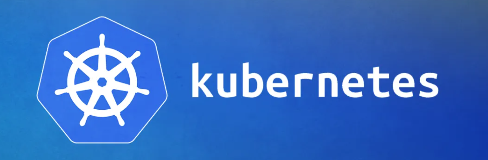
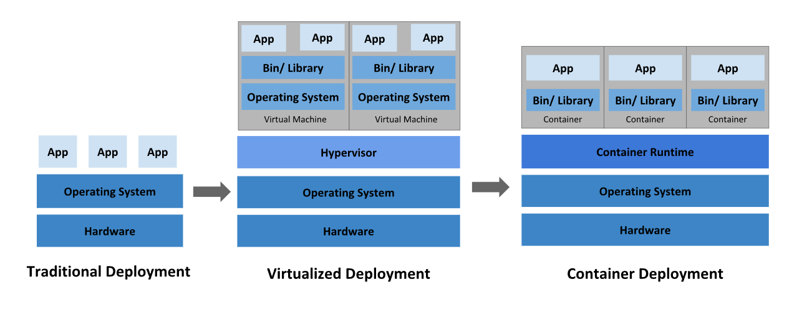
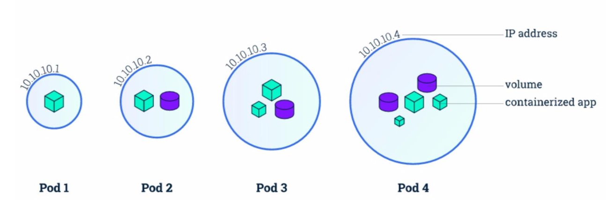
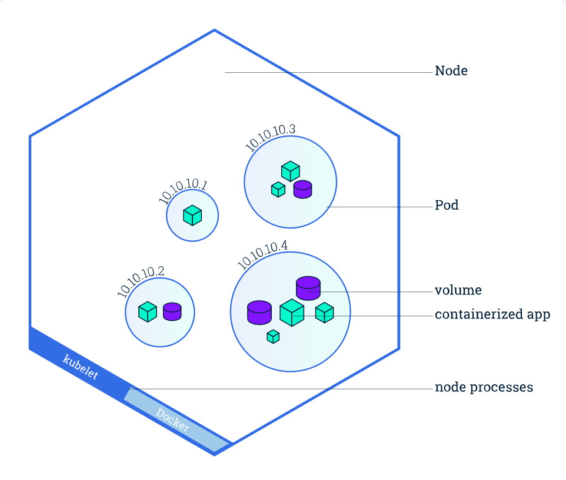
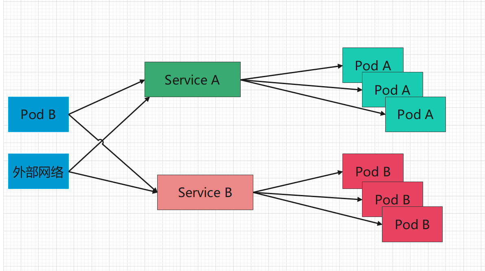

# Kubernetes基础介绍

## 1. 发音

有很多人不知道kubernetes应该怎么发音，正确的发音是[kubə’netis]，重音在第三个音节，读音：库伯耐踢死

那为什么很多场景称为 是 `k8s`呢？

这个其实和硅谷的人起名有关系，他们有一个坏习惯，就是喜欢把一个单词首字母+跳过的字母数来进行缩写，比如亚马逊的Algorithms被缩写成A9，而kubernetes缩写为k8s，意思就是k后面跳过8个字母后到s，就变成了k8s。

## 2. 来源

`Kubernetes`最初源于谷歌内部的`Borg`，提供了面向应用的容器集群部署和管理系统。

Google 是最早研发 Linux 容器技术的企业之一[（组建了cgroups）](https://zh.wikipedia.org/wiki/Cgroups)，曾公开分享介绍[ Google 如何将一切都运行于容器之中](https://speakerdeck.com/jbeda/containers-at-scale)（这是 Google 云服务背后的技术）。Google 每周会启用超过 20 亿个容器——全都由内部平台 [Borg](http://blog.kubernetes.io/2015/04/borg-predecessor-to-kubernetes.html) 支撑。Borg 是 Kubernetes 的前身，多年来开发 Borg 的经验教训成了影响 Kubernetes 中许多技术的主要因素。

`趣事`：Kubernetes 徽标的七个轮辐代表着项目最初的名称"[九之七项目](https://cloudplatform.googleblog.com/2016/07/from-Google-to-the-world-the-Kubernetes-origin-story.html)"(Project Seven of Nine)。

2015 年，Google 将 Kubernetes 项目[捐赠](https://techcrunch.com/2015/07/21/as-kubernetes-hits-1-0-google-donates-technology-to-newly-formed-cloud-native-computing-foundation-with-ibm-intel-twitter-and-others/)给新成立的[云原生计算基金会](https://www.cncf.io/)。

## 3. 为什么需要Kubernetes？

真正的生产型应用会涉及多个容器。这些容器必须跨多个服务器主机进行部署。基于容器安全性的考虑，需要进行多层部署。因此可能会比较复杂。

当容器数量上升到一定程度，那么部署和管理的难度将直线上升（运维介入，需要做大量的操作）。

这时候`Kubernetes`横空出世，解决了上述问题。

Kubernetes是容器集群管理系统，是一个开源的平台，可以实现容器集群的自动化部署、自动扩缩容、维护等功能。

通过Kubernetes你可以：

1. **快速扩展应用**

2. **无缝对接新的应用功能**

3. **节省资源，优化硬件资源的使用**

Kubernetes 特点：

**可移植**: 支持公有云，私有云，混合云，多重云（multi-cloud）

**可扩展**: 模块化, 插件化, 可挂载, 可组合

**自动化**: 自动部署，自动重启，自动复制，自动伸缩/扩展

官方定义：

> Kubernetes 是用于自动部署，扩展和管理容器化应用程序的开源系统，它将组成应用程序的容器组合成逻辑单元，以便于管理和服务发现。Kubernetes 源自[Google 15 年生产环境的运维经验](http://queue.acm.org/detail.cfm?id=2898444)，同时凝聚了社区的最佳创意和实践。

## 4. k8s是如何做的

k8s的官网：https://kubernetes.io/，目前版本v1.24

上述是k8s集群所需的组件。

从图上我们可以看出，总共分为两大类型组件，`Control Plane （控制平面）`和`Node （节点）`

> 在之前的版本中，Control Plane称为是Master，即主节点，Node为Worder Node，即工作节点

**Control Plane节点和Node工作节点均可以有多个，共同组成了k8s集群**

### 4.1 Control Plane

控制平面的组件对集群做出全局决策(比如调度)，以及检测和响应集群事件（例如，当不满足部署的 replicas(副本) 字段时，启动新的 pod）。

**Control Plane节点可以部署在任意的机器上，并且可以多节点部署，但是一般由于其不是主要工作节点，性能开销小，可以单独部署在一台机器上即可**

* `Kubernetes API Server-(kube-apiserver)`
   提供HTTP RESTful API接口的主要服务，是Kubernetes里对所有资源进行操作的`唯一`入口，也是集群控制的入口进程。（通知别的组件干活的）

* `Kubernetes Controller Manager(kube-controller-manager)`
   Kubernetes里所有资源对象的自动化控制中心，可以将其理解为资源对象的“大总管”，有以下一些控制器组件：
  * Node controller：节点挂掉或者故障时，负责通知和响应
  * Job controller: 监控 job 的变化，然后创建相应的 pod运行其任务直到完成
  * Endpoints controller: endpoints 资源对象的控制器，其通过对service、pod资源的监听，当这2种资源发生变化时会触发 endpoints controller 对相应的endpoints资源进行协调操作，从而完成endpoints对象的新建、更新、删除等操作。
  * Service Account & Token controllers: 为新命名空间创建默认账户和API访问令牌

* `Kubernetes Scheduler-(kube-scheduler)`
   如果用户创建了一个服务，新建了一个Pod，调度器会为其分配一个工作节点运行

* `etcd`
   是一个分布式的一个存储系统，API Server 中所需要的这些原信息都被放置在 etcd 中，etcd 本身是一个高可用系统，通过 etcd 保证整个 Kubernetes 的 Control Plane组件的高可用性，K8S 中仅API Server才具备读写权限，其他组件必须通过API Server 的接口才能读写数据。

* `Cloud Controller Manager-(kube-controller-manager)`
   云控制器管理器是指嵌入特定云的控制逻辑的控制平面组件。 云控制器管理器使得可以将集群连接到云提供商的API之上，并将与该云平台交互的组件同与你的集群交互的组件分离开来。
   cloud-controller-manager 仅运行指定的云平台的控制器。如果在自己的环境中运行 Kubernetes，或者在本地计算机中运行学习环境，所部署的环境中不需要云控制器管理器。

### 4.2 Node

节点组件在每个节点上运行，维护运行的POD并提供Kubernetes运行时环境。

一般习惯称之为工作节点。

* `kubelet`
   负责Pod对应容器的创建、启停等任务，同时与Control Plane密切协作，实现集群管理的基本功能。运行在集群的每个节点。可以理解为，定期向Control Plane汇报自己节点的状态，并接受指示采取调整措施。

* `kube-proxy`
   Kube-Proxy是一个网络代理，在集群中的每个节点上运行，Kube-Proxy 负责 Node 在 k8s的网络通讯、以及对外部网络流量的负载均衡。

* `容器运行时-Container Runtime`
   负责本机的容器创建和管理，比如安装docker提供容器的运行环境等

### 4.3 k8s部署流程

1. 将应用程序清单提交给Kubernetes API，API Server将清单中定义的对象写入etcd

2. 控制器（Controller）通过etcd注意到新创建的对象并创建多个新对象-每个对象对应一个应用程序实例

3. 调度器（Scheduler）为每个实例分配一个节点

4. Kubelet 注意到一个实例被分配给了 Kubelet 的节点。它通过容器运行时（Container Runtime）运行应用程序实例

5. Kube proxy注意到应用程序实例已准备好接受来自客户端的连接并为他们配置网络，负载均衡等

6. Kubelet 和 Controller 监控系统并保持应用程序运行

## 5. 重要概念

### 5.1 Pod

**Pod** 是可以在 Kubernetes 中创建和管理的、最小的可部署的计算单元。

简单理解，Pod是一组容器的集合，这里的容器我们可以理解为就是Docker，当然除了 Docker 之外，Kubernetes 支持 很多其他容器运行时。

在Pod中的容器中，共享网络，存储以及怎样运行容器的一些声明。比如：一个Pod中的容器可以使用localhost来进行互相访问。

Pod中的内容总是搭配在一起来运行，统一调度，在`共享上下文`中运行。

Pod 的共享上下文包括一组 `Linux 命名空间`、`控制组（cgroup）`和可能一些其他的`隔离`方面， 即用来隔离 `Docker` 容器的技术。 在 Pod 的上下文中，每个独立的应用可能会进一步实施隔离。

就 Docker 概念的术语而言，Pod 类似于共享命名空间和文件系统卷的`一组 Docker 容器`。

Pod示例：

~~~yml
apiVersion: v1
kind: Pod
metadata:
  name: nginx
  namespace: dev
spec:
  containers:
  - name: nginx
    image: nginx:1.14.2
    ports:
    - containerPort: 80
~~~

由一个运行镜像 `nginx:1.14.2` 的容器组成

* `apiVersion`记录 k8s 的 API Server 版本

* `kind`记录该 yaml 的对象，比如这是一份 Pod 的 yaml 配置文件，那么值内容就是`Pod`

* `metadata`记录了 Pod 自身的元数据，比如这个 Pod 的名字、这个 Pod 属于哪个 namespace

* `spec`记录了 Pod 内部所有的资源的详细信息

  * `containers`记录了 Pod 内的容器信息
    * `name`容器名
    * `image`容器的镜像地址
    * `resources`容器需要的 CPU、内存、GPU 等资源
    * `command`容器的入口命令
    * `args`容器的入口参数
    * `volumeMounts`容器要挂载的 Pod 数据卷
    * `ports`端口
  * `volumes`记录了 Pod 内的数据卷信息

  

Kubernetes 集群中的 Pod 主要有两种用法：

* **运行单个容器的 Pod**。"每个 Pod 一个容器" 模型是最常见的 Kubernetes 用例； 在这种情况下，可以将 Pod 看作单个容器的包装器，并且 Kubernetes 直接管理 Pod，而不是容器。
* **运行多个协同工作的容器的 Pod**。 Pod 可能封装由多个紧密耦合且需要共享资源的共处容器组成的应用程序。 

每个 Pod 都旨在运行给定应用程序的单个实例。如果希望横向扩展应用程序 （例如，运行多个实例以提供更多的资源），则应该使用多个 Pod，每个实例使用一个 Pod。 在 Kubernetes 中，这通常被称为**副本（Replication）**。

> 注意：Pod不是进程，只是提供了容器的运行环境，Pod一旦被创建，就会在其节点上运行，直到结束或者被销毁

在Pod中的容器也分为多种类型：

* 初始化容器（Init Container）：

  Init容器会在启动应用容器之前运行并完成

* 应用容器（App Container）：

  在初始化容器启动完毕后才开始启动，我们一般部署的容器
  
* 边车容器 （Sidecar Container）：
  
  与Pod中的应用容器一起运行的容器，Sidecar模式，在不更改主容器的基础上，增强其功能
  
* 临时容器（Ephemeral Container）：
  
  临时容器是使用 API 中的一种特殊的 `ephemeralcontainers` 处理器进行创建的，实现了调试容器附加到主进程的功能，然后你可以用于调试任何类型的问题，在做故障排查时很有用
  
  
  

### 5.2 Service

官方定义：

> 将运行在一组 Pods 上的应用程序公开为网络服务的抽象方法。
>
> 使用 Kubernetes，您无需修改应用程序即可使用不熟悉的服务发现机制。Kubernetes 为 Pods 提供自己的 IP 地址，并为一组 Pod 提供相同的 DNS 名， 并且可以在它们之间进行负载均衡。

  

  

假定有一组 Pod，它们对外暴露了 9376 端口，同时还被打上 `app=MyApp` 标签

~~~yml
apiVersion: v1
kind: Service
metadata:
  name: my-service
  namespace: dev
spec:
  selector:
    app: MyApp
  ports:
    - protocol: TCP
      port: 80
      targetPort: 9376
~~~

上述配置创建一个名称为 "my-service" 的 Service 对象，它会将请求代理到使用 TCP 端口 9376，并且具有标签 `"app=MyApp"` 的 Pod 上。

Kubernetes 为该服务分配一个 IP 地址（有时称为 “集群 IP”），该 IP 地址由服务代理使用。

