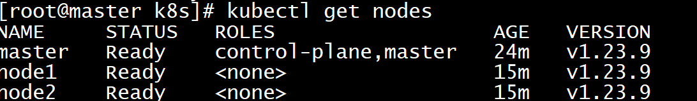

# 安装

> 在大致了解了一些k8s的基本概念之后，我们实际部署一个k8s集群，做进一步的了解

## 1. 裸机安装

采用三台机器，一台机器为Master（控制面板组件）两台机器为Node（工作节点）

机器的准备有两种方式：

* VMware虚拟机 centos7操作系统 三台
* 云厂商 租用服务器 按量付费 费用极低 用完销毁即可

 

### 1.1 设置主机名

~~~shell
# 每个节点分别设置对应主机名
hostnamectl set-hostname master
hostnamectl set-hostname node1
hostnamectl set-hostname node2
~~~

### 1.2 修改hosts

~~~shell
# 所有节点都修改 hosts
vim /etc/hosts
192.168.200.104 master
192.168.200.105 node1
192.168.200.106 node2

~~~

### 1.3 关闭防火墙

~~~shell
# 所有节点关闭 SELinux
setenforce 0
sed -i --follow-symlinks 's/SELINUX=enforcing/SELINUX=disabled/g' /etc/sysconfig/selinux
~~~

~~~go
所有节点确保防火墙关闭
systemctl stop firewalld
systemctl disable firewalld
~~~

关闭swap分区：

~~~shell
# 临时关闭
swapoff -a

# 永久关闭  
vim /etc/fstab 
#注释下面这行,或使用 sed 命令注释 sed -ri 's/.*swap.*/#&/' /etc/fstab
#/dev/mapper/centos-swap swap                    swap    defaults        0 0

# 查看是否关闭成功
free -m
# 若都显示 0 则表示关闭成功，需要重启服务器生效，可以使用 reboot 或 shutdown -r now 命令重启
[root@master ~]# free -m
              total        used        free      shared  buff/cache   available
Mem:           3770         305        3115          11         350        3242
Swap:             0           0           0

~~~

同步网络时间：

~~~shell
# 如果没有 ntpdate ，使用如下命令安装
# yum install -y ntpdate
ntpdate ntp1.aliyun.com # 使用
date 

~~~

### 1.4 添加安装源

~~~shell
#所有节点
# 添加 k8s 安装源
cat <<EOF > kubernetes.repo
[kubernetes]
name=Kubernetes
baseurl=https://mirrors.aliyun.com/kubernetes/yum/repos/kubernetes-el7-x86_64
enabled=1
gpgcheck=0
repo_gpgcheck=0
gpgkey=https://mirrors.aliyun.com/kubernetes/yum/doc/yum-key.gpg https://mirrors.aliyun.com/kubernetes/yum/doc/rpm-package-key.gpg
EOF
mv kubernetes.repo /etc/yum.repos.d/

# 添加 Docker 安装源
yum-config-manager --add-repo http://mirrors.aliyun.com/docker-ce/linux/centos/docker-ce.repo
~~~

如果报错 -bash: yum-config-manager: command not found 则运行 yum install -y yum-utils
如果安装 yum-utils 报错 failure: repodata/repomd.xml from kubernetes: [Errno 256] No more mirrors to try.，则设置 repo_gpgcheck=0

### 1.5 安装所需组件

* Kubectl： Kubectl 管理 Kubernetes 集群命令行工具
* kubeadm：Kubeadm 是一个快捷搭建kubernetes(k8s)的安装工具,它提供了kubeadm init 以及kubeadm join这两个命令来快速创建kubernetes集群
* kubelet：kubelet 是在每个 Node 节点上运行的主要 “节点代理”。

~~~shell
# 所有节点
yum install -y kubelet-1.23.9 kubectl-1.23.9 kubeadm-1.23.9 docker-ce
~~~

### 1.6 启动

~~~shell
#所有节点
systemctl enable docker
systemctl start docker
systemctl enable kubelet
systemctl start kubelet
~~~

### 1.8 修改docker配置

~~~shell
# kubernetes 官方推荐 docker 等使用 systemd 作为 cgroupdriver，否则 kubelet 启动不了
cat <<EOF > daemon.json
{
  "exec-opts": ["native.cgroupdriver=systemd"],
  "registry-mirrors": ["https://tfm2bi1b.mirror.aliyuncs.com"]
}
EOF
mv daemon.json /etc/docker/

# 重启生效
systemctl daemon-reload
systemctl restart docker
~~~

### 1.9 kubeadm 初始化集群

~~~shell
#仅在主节点运行 
# 失败了可以用 kubeadm reset 重置
#关闭交互分区
swapoff -a

#初始化集群控制台 Control plane
# apiserver-advertise-address： master 节点 IP
# image-repository：镜像仓库地址
# kubernetes-version： 版本号
# pod-network-cidr 和 service-cidr 不清楚如何设置，使用该默认值
# 查看其他默认值可使用命令： kubeadm config print init-defaults > kubeadm.yaml 查看默认初始化文件
kubeadm init \
--apiserver-advertise-address=192.168.200.101 \
--image-repository registry.aliyuncs.com/google_containers \
--kubernetes-version=v1.23.9 \
--pod-network-cidr=10.244.0.0/16 \
--service-cidr=10.96.0.0/16 

# 记得把 kubeadm join xxx 保存起来
# 忘记了重新获取：kubeadm token create --print-join-command

# 复制授权文件，以便 kubectl 可以有权限访问集群
# 如果你其他节点需要访问集群，需要从主节点复制这个文件过去其他节点
mkdir -p $HOME/.kube
cp -i /etc/kubernetes/admin.conf $HOME/.kube/config
chown $(id -u):$(id -g) $HOME/.kube/config

# 在其他机器上创建 ~/.kube/config 文件也能通过 kubectl 访问到集群
~~~

kubeadm join 192.168.200.101:6443 --token wou8ux.tpfiunjbgrjqy8vz --discovery-token-ca-cert-hash sha256:f1ae65b2e88427a44cd0883df9739bb13e3bb122227b7a12c4717d68c317cdc8

如果token过期，可以在master 主节点执行 `kubeadm token create --print-join-command --ttl=0` ，token 永不过期，获取到新的join命令

### 1.10 把工作节点加入集群

~~~shell
swapoff -a
kubeadm join 192.168.200.101:6443 --token wou8ux.tpfiunjbgrjqy8vz --discovery-token-ca-cert-hash sha256:f1ae65b2e88427a44cd0883df9739bb13e3bb122227b7a12c4717d68c317cdc8

~~~

### 1.11 安装网络插件

kube-flannel.yml

~~~yaml
---
kind: Namespace
apiVersion: v1
metadata:
  name: kube-flannel
  labels:
    pod-security.kubernetes.io/enforce: privileged
---
kind: ClusterRole
apiVersion: rbac.authorization.k8s.io/v1
metadata:
  name: flannel
rules:
- apiGroups:
  - ""
  resources:
  - pods
  verbs:
  - get
- apiGroups:
  - ""
  resources:
  - nodes
  verbs:
  - list
  - watch
- apiGroups:
  - ""
  resources:
  - nodes/status
  verbs:
  - patch
---
kind: ClusterRoleBinding
apiVersion: rbac.authorization.k8s.io/v1
metadata:
  name: flannel
roleRef:
  apiGroup: rbac.authorization.k8s.io
  kind: ClusterRole
  name: flannel
subjects:
- kind: ServiceAccount
  name: flannel
  namespace: kube-flannel
---
apiVersion: v1
kind: ServiceAccount
metadata:
  name: flannel
  namespace: kube-flannel
---
kind: ConfigMap
apiVersion: v1
metadata:
  name: kube-flannel-cfg
  namespace: kube-flannel
  labels:
    tier: node
    app: flannel
data:
  cni-conf.json: |
    {
      "name": "cbr0",
      "cniVersion": "0.3.1",
      "plugins": [
        {
          "type": "flannel",
          "delegate": {
            "hairpinMode": true,
            "isDefaultGateway": true
          }
        },
        {
          "type": "portmap",
          "capabilities": {
            "portMappings": true
          }
        }
      ]
    }
  net-conf.json: |
    {
      "Network": "10.244.0.0/16",
      "Backend": {
        "Type": "vxlan"
      }
    }
---
apiVersion: apps/v1
kind: DaemonSet
metadata:
  name: kube-flannel-ds
  namespace: kube-flannel
  labels:
    tier: node
    app: flannel
spec:
  selector:
    matchLabels:
      app: flannel
  template:
    metadata:
      labels:
        tier: node
        app: flannel
    spec:
      affinity:
        nodeAffinity:
          requiredDuringSchedulingIgnoredDuringExecution:
            nodeSelectorTerms:
            - matchExpressions:
              - key: kubernetes.io/os
                operator: In
                values:
                - linux
      hostNetwork: true
      priorityClassName: system-node-critical
      tolerations:
      - operator: Exists
        effect: NoSchedule
      serviceAccountName: flannel
      initContainers:
      - name: install-cni-plugin
       #image: flannelcni/flannel-cni-plugin:v1.1.0 for ppc64le and mips64le (dockerhub limitations may apply)
        image: docker.io/rancher/mirrored-flannelcni-flannel-cni-plugin:v1.1.0
        command:
        - cp
        args:
        - -f
        - /flannel
        - /opt/cni/bin/flannel
        volumeMounts:
        - name: cni-plugin
          mountPath: /opt/cni/bin
      - name: install-cni
       #image: flannelcni/flannel:v0.19.0 for ppc64le and mips64le (dockerhub limitations may apply)
        image: docker.io/rancher/mirrored-flannelcni-flannel:v0.19.0
        command:
        - cp
        args:
        - -f
        - /etc/kube-flannel/cni-conf.json
        - /etc/cni/net.d/10-flannel.conflist
        volumeMounts:
        - name: cni
          mountPath: /etc/cni/net.d
        - name: flannel-cfg
          mountPath: /etc/kube-flannel/
      containers:
      - name: kube-flannel
       #image: flannelcni/flannel:v0.19.0 for ppc64le and mips64le (dockerhub limitations may apply)
        image: docker.io/rancher/mirrored-flannelcni-flannel:v0.19.0
        command:
        - /opt/bin/flanneld
        args:
        - --ip-masq
        - --kube-subnet-mgr
        resources:
          requests:
            cpu: "100m"
            memory: "50Mi"
          limits:
            cpu: "100m"
            memory: "50Mi"
        securityContext:
          privileged: false
          capabilities:
            add: ["NET_ADMIN", "NET_RAW"]
        env:
        - name: POD_NAME
          valueFrom:
            fieldRef:
              fieldPath: metadata.name
        - name: POD_NAMESPACE
          valueFrom:
            fieldRef:
              fieldPath: metadata.namespace
        - name: EVENT_QUEUE_DEPTH
          value: "5000"
        volumeMounts:
        - name: run
          mountPath: /run/flannel
        - name: flannel-cfg
          mountPath: /etc/kube-flannel/
        - name: xtables-lock
          mountPath: /run/xtables.lock
      volumes:
      - name: run
        hostPath:
          path: /run/flannel
      - name: cni-plugin
        hostPath:
          path: /opt/cni/bin
      - name: cni
        hostPath:
          path: /etc/cni/net.d
      - name: flannel-cfg
        configMap:
          name: kube-flannel-cfg
      - name: xtables-lock
        hostPath:
          path: /run/xtables.lock
          type: FileOrCreate
~~~

~~~shell
kubectl apply -f kube-flannel.yml
~~~

## 1.12 安装 dashboard

github地址：https://github.com/kubernetes/dashboard/，

我们的版本为v1.23 所以安装 2.5.1版本

资料中的kubernetes-dashboard.yaml

执行安装：

~~~shell
kubectl apply -f kubernetes-dashboard.yaml
~~~

资料中dashboard-adminuser.yaml

想要访问dashboard服务，就要有访问权限，创建kubernetes-dashboard管理员角色

~~~shell
kubectl apply -f dashboard-adminuser.yaml
~~~

~~~shell
kubectl describe secrets -n kubernetes-dashboard admin-user-token  | grep token | awk 'NR==3{print $2}'
~~~

获取到token：

~~~shell
eyJhbGciOiJSUzI1NiIsImtpZCI6Ik5nUVQzNjhGS0R6MGlWLU82VnFraEdpRWtCajFnQ1hhVWdfc1Fmbjl3NlEifQ.eyJpc3MiOiJrdWJlcm5ldGVzL3NlcnZpY2VhY2NvdW50Iiwia3ViZXJuZXRlcy5pby9zZXJ2aWNlYWNjb3VudC9uYW1lc3BhY2UiOiJrdWJlcm5ldGVzLWRhc2hib2FyZCIsImt1YmVybmV0ZXMuaW8vc2VydmljZWFjY291bnQvc2VjcmV0Lm5hbWUiOiJhZG1pbi11c2VyLXRva2VuLTZscXd3Iiwia3ViZXJuZXRlcy5pby9zZXJ2aWNlYWNjb3VudC9zZXJ2aWNlLWFjY291bnQubmFtZSI6ImFkbWluLXVzZXIiLCJrdWJlcm5ldGVzLmlvL3NlcnZpY2VhY2NvdW50L3NlcnZpY2UtYWNjb3VudC51aWQiOiI2NWNmODVkMy0wYzM2LTQ3ZjEtYmRlMi05MDNlMDYxZjJjNTQiLCJzdWIiOiJzeXN0ZW06c2VydmljZWFjY291bnQ6a3ViZXJuZXRlcy1kYXNoYm9hcmQ6YWRtaW4tdXNlciJ9.G9zvUV2X_h5lHmk5YF7evjlA78x8EMEpbdVySOijXgIbToHt8XUw5H5YKOMRgEvQ-hVM__BaPAH5MhtcIQLFD7VSr6sXEU3tbBDaPGVEEA8fl4HZh-lLkcGb1OpGmgdmM3-V7W2iere79kD6JDkpq4NzuKDu_-OLyMl2eyBuKunPICeV0KG75rzfglopIqkZ5U6lYdiG9B8Kyk51RIHq6303E-6iGNoSYVfPoqNtxpX3Ws7qitAX5nDJ9X1DLjBSH7TKjeaBxgm7MOF2BJHvIIVSkTv03aXvJZ96yZdEzUlF7fvMEnF7sSsqYBM8k-W1hQG-6J1-6Mn2JkwCAFf8TA
~~~

查看服务端口：

~~~shell
kubectl get pods --all-namespaces
kubectl describe pod kubernetes-dashboard --namespace=kubernetes-dashboard
~~~

~~~shell
kubectl get svc -n kubernetes-dashboard
~~~

登录：

https://192.168.200.101:32000

看到ui界面

出问题可清空一个iptables

~~~shell
systemctl stop kubelet
systemctl stop docker
iptables --flush
systemctl start kubelet
systemctl start docker
~~~

