# 命令详解

kubectl是官方的CLI命令行工具，用于与 apiserver进行通信，将用户在命令行输入的命令，组织并转化为 apiserver能识别的信息，进而实现管理k8s各种资源的一种有效途径

## 1. 帮助

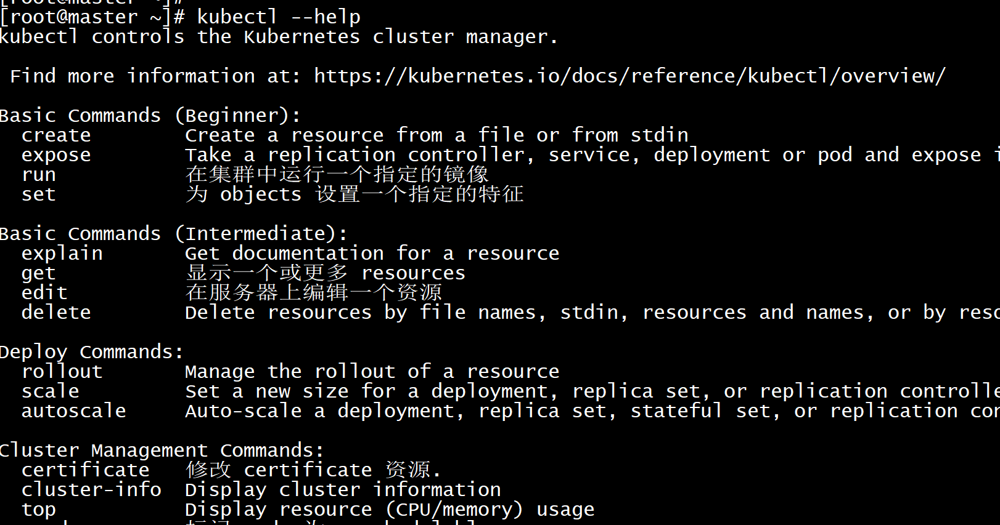

## 2. 查看版本信息

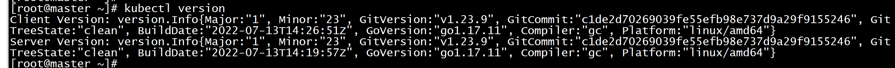

## 3. 查看资源对象等

*查看Node状态*

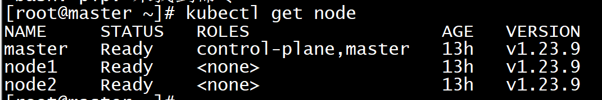

*查看Master组件状态*

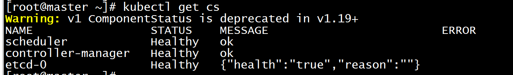

*列出K8s所有资源*

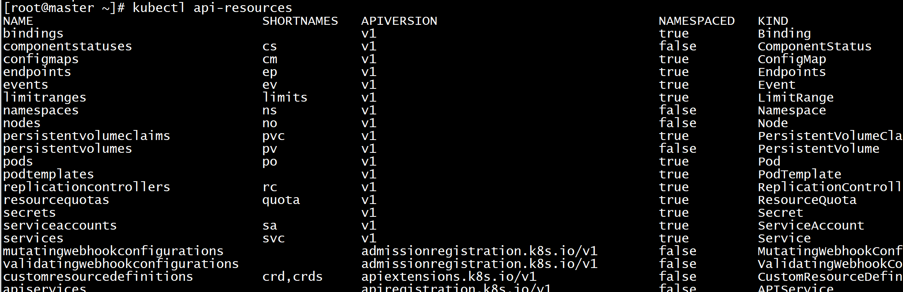

*查看集群接口信息*

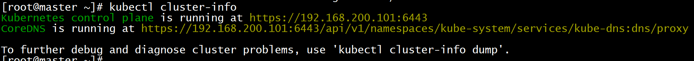

*查看apiserver聚合层注册信息*

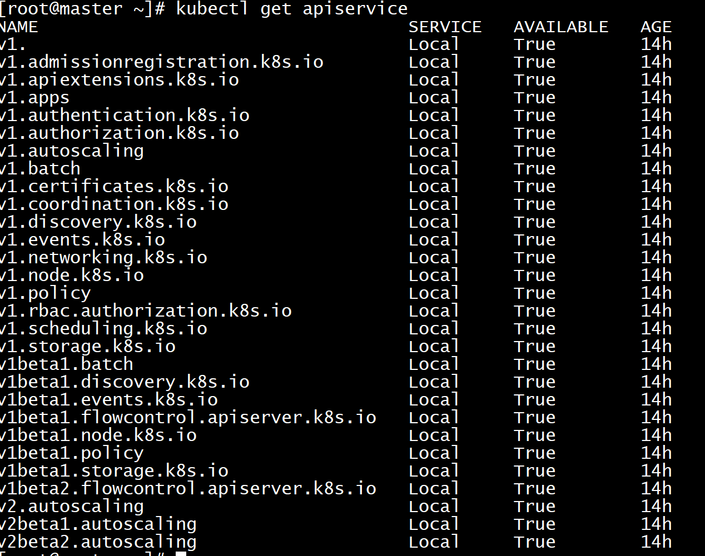

*查看API的版本*

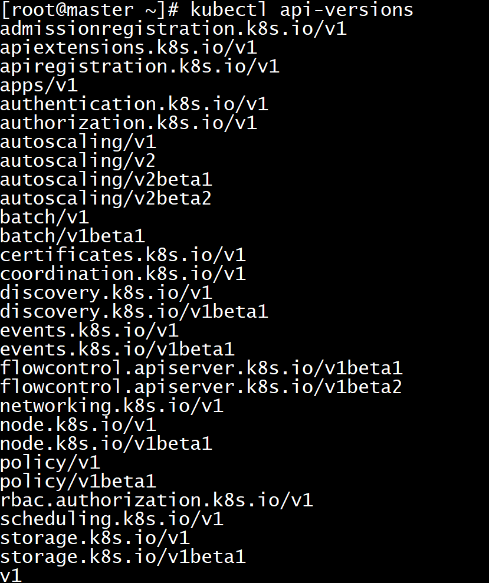

`查看某个node的详细信息`

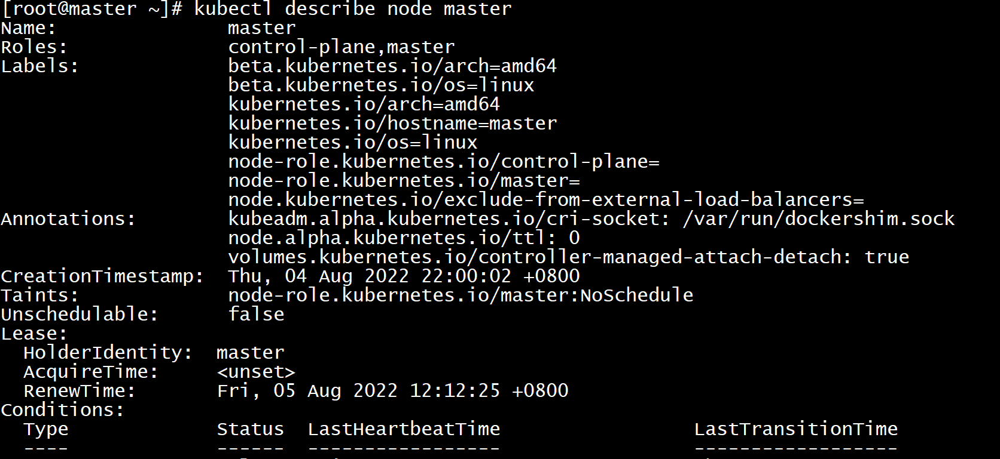

## 4. kubectl自动补齐

~~~shell
yum -y install bash-completion
source /usr/share/bash-completion/bash_completion
echo "source <(kubectl completion bash)" >> ~/.bashrc
~~~

现在

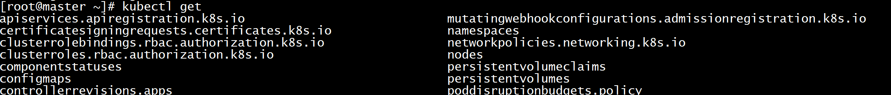

## 5. Namespaces

namespace是k8s系统中的一种非常重要的资源，它的主要作用是用来实现多套环境的资源隔离或者多租户的资源隔离。

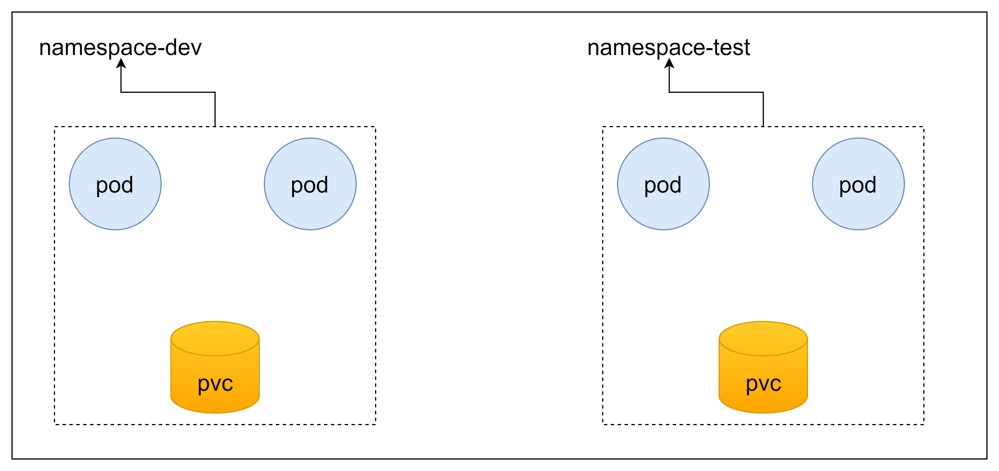

默认情况下，k8s集群中的所有的pod都是可以相互访问的。但是在实际中，可能不想让两个pod之间进行互相的访问，此时就可以将两个pod划分到不同的namespace下。k8s将通过将集群内部的资源分配到不同的namespace中，可以形成逻辑上的”组“，以方便不同的组的资源进行隔离使用和管理，可以通过k8s的授权机制，将不同的namespace交给不同租户进行管理，这样就实现了多租户的资源隔离。

此时还能结合k8s的资源配额机制，限定不同租户能占用的资源，例如cpu使用量，内存使用量等，来实现租户可用资源的管理。

### 5.1 查看所有的ns

默认创建的namespace

~~~shell
[root@master ~]# kubectl get namespace
NAME              STATUS   AGE
default           Active   41h  #所有未指定namespace的对象都会被分配在default命名空间
kube-node-lease   Active   41h  #集群节点之间的心跳维护，v1.13开始引入
kube-public       Active   41h  #此命名空间下的资源可以被所有人访问（包括未认证用户）
kube-system       Active   41h  #所有由k8s系统创建的资源都处于这个命名空间
~~~

~~~shell
[root@master ~]# kubectl get ns
NAME                   STATUS   AGE
default                Active   18h
kube-node-lease        Active   18h
kube-public            Active   18h
kube-system            Active   18h
kubernetes-dashboard   Active   18h
~~~

### 5.2 查看指定的ns

~~~shell
#命令：kubectl get ns ns名称 -o 格式参数
#k8s支持的格式很多，比较常见的是wide、json、yaml
[root@master ~]# kubectl get ns default -o yaml
apiVersion: v1
kind: Namespace
metadata:
  creationTimestamp: "2022-08-04T14:00:03Z"
  labels:
    kubernetes.io/metadata.name: default
  name: default
  resourceVersion: "206"
  uid: 7d9da512-008f-4ed7-8d92-90bef1dba4d5
spec:
  finalizers:
  - kubernetes
status:
  phase: Active
~~~

### 5.3 查看ns详情

```shell
#命令 kubectl describe ns ns名称
[root@master ~]# kubectl describe ns default
Name:         default
Labels:       kubernetes.io/metadata.name=default
Annotations:  <none>
Status:       Active #Active 命名空间正在使用中，Terminating 正在删除命名空间
#Resource quota 针对namespace做的资源限制
No resource quota.
#LimitRange针对namespace的每个组件做的资源限制
No LimitRange resource.
```

### 5.4 创建

~~~shell
#创建namespace
[root@master ~]# kubectl create ns dev
namespace/dev created
~~~

### 5.5 删除

~~~shell
[root@master ~]# kubectl delete ns dev
namespace "dev" deleted
~~~

### 5.6 配置方式

首先准备一个yaml文件：ns-dev.yaml

~~~yaml
apiVersion: v1
kind: Namespace
metadata:
  name: dev
~~~

~~~shell
[root@master ns]# kubectl create -f ns-dev.yaml
namespace/dev created
[root@master ns]# kubectl get ns dev
NAME   STATUS   AGE
dev    Active   20s
[root@master ns]# kubectl delete -f ns-dev.yaml       
namespace "dev" deleted
[root@master ns]# kubectl get ns dev           
Error from server (NotFound): namespaces "dev" not found
~~~

## 6. Pods

pod是k8s集群进行管理的最小单元，程序要运行必须部署到容器中，而容器必须存在于pod中。

pod可以认为是容器的封装，一个pod中可以存在一个或多个容器

k8s在集群启动之后，集群中的各个组件也都是以pod方式运行的，可以通过下面命令查看：

~~~shell
[root@master ns]# kubectl get pod -n kube-system
NAME                             READY   STATUS    RESTARTS          AGE
coredns-6d8c4cb4d-8tqtt          0/1     Running   123 (5m58s ago)   21h
coredns-6d8c4cb4d-vm7fx          0/1     Running   123 (5m26s ago)   21h
etcd-master                      1/1     Running   4 (21h ago)       21h
kube-apiserver-master            1/1     Running   7 (8h ago)        21h
kube-controller-manager-master   1/1     Running   3 (8h ago)        21h
kube-proxy-lwls6                 1/1     Running   0                 21h
kube-proxy-scwzg                 1/1     Running   0                 21h
kube-proxy-sn9kc                 1/1     Running   2 (21h ago)       21h
kube-scheduler-master            1/1     Running   5 (8h ago)        21h
~~~

### 6.1 查看所有pod

~~~shell
[root@master ~]# kubectl get pods --all-namespaces
NAMESPACE              NAME                                         READY   STATUS    RESTARTS          AGE
kube-flannel           kube-flannel-ds-lrqqm                        1/1     Running   1 (9m9s ago)      19m
kube-flannel           kube-flannel-ds-ssfgk                        1/1     Running   0                 19m
kube-flannel           kube-flannel-ds-xg9xb                        1/1     Running   0                 19m
kube-system            coredns-6d8c4cb4d-8tqtt                      1/1     Running   126 (9m4s ago)    22h
kube-system            coredns-6d8c4cb4d-vm7fx                      1/1     Running   126 (9m4s ago)    22h
kube-system            etcd-master                                  1/1     Running   5 (9m9s ago)      22h
kube-system            kube-apiserver-master                        1/1     Running   8 (8m59s ago)     22h
kube-system            kube-controller-manager-master               1/1     Running   4 (9m9s ago)      22h
kube-system            kube-proxy-lwls6                             1/1     Running   0                 22h
kube-system            kube-proxy-scwzg                             1/1     Running   0                 22h
kube-system            kube-proxy-sn9kc                             1/1     Running   3 (9m9s ago)      22h
kube-system            kube-scheduler-master                        1/1     Running   6 (9m9s ago)      22h
kubernetes-dashboard   dashboard-metrics-scraper-799d786dbf-4fj8b   1/1     Running   132 (5m49s ago)   21h
kubernetes-dashboard   kubernetes-dashboard-77b9df557f-hpxmr        1/1     Running   92 (14m ago)      21h
~~~


### 6.2 创建并运行

~~~shell
root@master ~]# kubectl create ns dev
namespace/dev created

#命令格式：kubectl run (pod控制器名称) [参数]
# --image 指定pod的镜像
# --port 指定端口
# --namespace 指定namespace
[root@master ~]# kubectl run nginx --image=nginx:1.17.1 --port=80 --namespace dev
pod/nginx created
~~~

### 6.3 查看pod

~~~shell
[root@master ~]# kubectl get pod -n dev
NAME    READY   STATUS    RESTARTS   AGE
nginx   1/1     Running   0          5s
[root@master ~]# kubectl describe pod nginx -n dev                 
Name:         nginx
Namespace:    dev
Priority:     0
Node:         node1/192.168.200.102
Start Time:   Fri, 05 Aug 2022 20:31:52 +0800
Labels:       run=nginx
Annotations:  <none>
Status:       Running
IP:           10.244.1.4
IPs:
  IP:  10.244.1.4
Containers:
  nginx:
    Container ID:   docker://614f6b0c1b75b48750898014c9289e71ee85ec010619cfdb4184b25f3015965b
    Image:          nginx:1.17.1
    Image ID:       docker-pullable://nginx@sha256:b4b9b3eee194703fc2fa8afa5b7510c77ae70cfba567af1376a573a967c03dbb
    Port:           80/TCP
    Host Port:      0/TCP
    State:          Running
      Started:      Fri, 05 Aug 2022 20:31:53 +0800
    Ready:          True
    Restart Count:  0
    Environment:    <none>
    Mounts:
      /var/run/secrets/kubernetes.io/serviceaccount from kube-api-access-mxqzz (ro)
~~~

### 6.4 访问pod

~~~shell
[root@master ~]# kubectl get pods -n dev -o wide
NAME    READY   STATUS    RESTARTS   AGE   IP           NODE    NOMINATED NODE   READINESS GATES
nginx   1/1     Running   0          18m   10.244.1.2   node1   <none>           <none>
[root@master ~]# curl 10.244.1.2
<!DOCTYPE html>
<html>
<head>
<title>Welcome to nginx!</title>
<style>
    body {
        width: 35em;
        margin: 0 auto;
        font-family: Tahoma, Verdana, Arial, sans-serif;
    }
</style>
</head>
<body>
<h1>Welcome to nginx!</h1>
<p>If you see this page, the nginx web server is successfully installed and
working. Further configuration is required.</p>

<p>For online documentation and support please refer to
<a href="http://nginx.org/">nginx.org</a>.<br/>
Commercial support is available at
<a href="http://nginx.com/">nginx.com</a>.</p>

<p><em>Thank you for using nginx.</em></p>
</body>
</html>
~~~

### 6.5 删除pod

~~~shell
#找到对应pod并删除
kubectl delete pod nginx --namespace=dev
~~~

### 6.6 配置方式

创建一个pod-nginx.yaml，内容如下：

~~~yaml
apiVersion: v1
kind: Pod
metadata:
  name: nginx
  namespace: dev
spec: 
  containers:
  - image: nginx:1.17.1
    imagePullPolicy: IfNotPresent
    name: pod
    ports: 
    - name: nginx-port
      containerPort: 80
      protocol: TCP
~~~

k8s的配置文件中经常看到有imagePullPolicy属性，这个属性是描述镜像的拉取策略

`Always` 总是拉取镜像
`IfNotPresent` 本地有则使用本地镜像,不拉取
`Never` 只使用本地镜像，从不拉取，即使本地没有
如果省略imagePullPolicy，  策略为always 

~~~shell
#创建
[root@master ~]# kubectl create -f pod-nginx.yaml 
pod/nginx created
[root@master ~]# kubectl get pod -n dev
NAME    READY   STATUS    RESTARTS   AGE
nginx   1/1     Running   0          5m34s

#删除
[root@master ~]# kubectl delete -f pod-nginx.yaml 
pod "nginx" deleted
~~~

## 7. Lable

Label是k8s系统中的一个重要概念。它的作用就是在资源上添加标识，用来对它们进行区分和选择。

Label的特点：

- 一个label会以KEY/VALUE键值对的形式附加到各种形象上，如Node、Pod、Service等
- 一个资源对象可以定义任意数量的label，同一个label也可以被添加到任意数量的资源对象上去
- label通常在资源对象定义时确定，当然也可以在对象创建后动态添加或者删除

可以通过label实现资源的多维度分组，以便灵活、方便地进行资源分配、调度、配置、部署等管理工作

一些常用的label示例如下：

- 版本标签："version":"release"，"version":"stable"
- 环境标签："environment":"dev"，"environment":"test"，"environment":"pro"
- 架构标签："tier":"frontend"，"tier":"backend"

标签定义完毕之后，还要考虑到标签的选择，这就要使用到label selector，即：

- label用于给某个资源对象定义标识
- label selector用于查询和筛选拥有某些标签的资源对象

当前有两种label selector：

- 基于等式的label selector：

name = slave：选择所有包含label中key="name"且value="slave"的对象

env != production：选择所有包括label中的key="env"且value不等于"production"的对象

- 基于集合的label selector

name in (master, slave)：选择所有包含label中key="name"且value="master"或"slave"的对象

name not in (frontend)：选择所有包含label中的key="name"且value不等于"frontend"的对象

标签的选择条件可以使用多个，此时将多个label selector进行组合，使用逗号","进行分隔即可。例如

~~~shell
 name = slave,env != production

 name not in (frontend),env != production
~~~

### 7.1 为pod资源打标签

~~~shell
[root@master pod]# kubectl create -f pod-nginx.yaml
pod/nginx created
[root@master pod]# kubectl get pod -n dev
NAME    READY   STATUS    RESTARTS   AGE
nginx   1/1     Running   0          5s
#查看标签
[root@master pod]# kubectl get pod -n dev --show-labels
NAME    READY   STATUS    RESTARTS   AGE   LABELS
nginx   1/1     Running   0          18s   <none>
[root@master pod]# kubectl label pod nginx -n dev version=1.0
pod/nginx labeled
[root@master pod]# kubectl get pod -n dev --show-labels
NAME    READY   STATUS    RESTARTS   AGE   LABELS
nginx   1/1     Running   0          32s   version=1.0
~~~

### 7.2 标签更新

更新version标签为2.0

```
[root@master ~]# kubectl label pod nginx -n dev version=2.0 --overwrite
pod/nginx labeled
[root@master ~]# kubectl get pod -n dev --show-labels
NAME    READY   STATUS    RESTARTS   AGE     LABELS
nginx   1/1     Running   0          4m52s   version=2.0
```

### 7.3 筛选标签

修改pod-nginx.yaml中的name为nginx1并创建pod，修改version标签为1.0

```
[root@master ~]# vim pod-nginx.yaml 
[root@master ~]# kubectl create -f pod-nginx.yaml 
pod/nginx1 created
[root@master ~]# kubectl label pod nginx1 -n dev version=1.0
pod/nginx1 labeled
[root@master ~]# kubectl get pod -n dev --show-labels
NAME     READY   STATUS    RESTARTS   AGE     LABELS
nginx    1/1     Running   0          7m58s   version=2.0
nginx1   1/1     Running   0          64s     version=1.0
```

使用标签选择器

```shell
[root@master ~]# kubectl get pod -l "version=2.0" -n dev --show-labels
NAME    READY   STATUS    RESTARTS   AGE     LABELS
nginx   1/1     Running   0          9m36s   version=2.0
[root@master ~]# kubectl get pod -l "version!=2.0" -n dev --show-labels
NAME     READY   STATUS    RESTARTS   AGE     LABELS
nginx1   1/1     Running   0          3m16s   version=1.0
```

### 7.4 删除标签

```
#格式：kubectl label pod nginx -n dev 标签名-
[root@master ~]# kubectl label pod nginx -n dev version-
pod/nginx labeled
[root@master ~]# kubectl get pod -n dev --show-labels
NAME     READY   STATUS    RESTARTS   AGE     LABELS
nginx    1/1     Running   0          13m     <none>
nginx1   1/1     Running   0          6m46s   version=1.0
```

### 7.5 通过配置方式进行更新

修改nginx-pod.yaml内容

```
apiVersion: v1
kind: Pod
metadata:
  name: nginx
  namespace: dev
  labels:
    version: "3.0"
    env: "test"
spec: 
  containers:
  - image: nginx:1.17.1
    imagePullPolicy: IfNotPresent
    name: pod
    ports: 
    - name: nginx-port
      containerPort: 80
      protocol: TCP
```

执行命令

```
[root@master ~]# vim pod-nginx.yaml 
[root@master ~]# kubectl apply -f pod-nginx.yaml 
Warning: kubectl apply should be used on resource created by either kubectl create --save-config or kubectl apply
pod/nginx configured
[root@master ~]# kubectl get pod -n dev --show-labels
NAME     READY   STATUS    RESTARTS   AGE   LABELS
nginx    1/1     Running   0          21m   env=test,version=3.0
nginx1   1/1     Running   0          14m   version=1.0
```

## 8. Deployment

在k8s中，pod是最小的控制单元，但是k8s很少直接控制pod，一般都是通过pod控制器来完成。

pod控制器用于对pod的管理，确保pod资源符合预期的状态，当pod的资源出现故障时，会尝试进行重启或重建pod

在k8s中pod控制器的种类很多，deployment是其中的一种

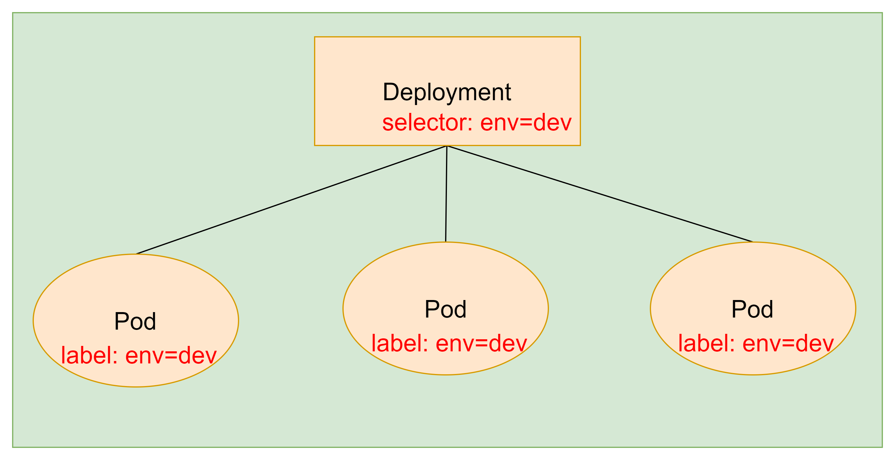

命令格式：kubectl create deployment deployment名称 [参数]

--image 指定pod的镜像

--port 指定端口

--replicas 指定创建pod数量

--namespace 指定namespace

### 8.1 查看创建的pod

~~~shell
#创建一个pod
[root@master ~]# kubectl create deployment nginx --image=nginx:1.17.1 --port=80 --replicas=3 --namespace=dev
kubectl run --generator=deployment/apps.v1 is DEPRECATED and will be removed in a future version. Use kubectl run --generator=run-pod/v1 or kubectl create instead.
deployment.apps/nginx created
#同时查看pod和deployment两种资源
[root@master ~]# kubectl get deployment,pod -n dev
NAME                    READY   UP-TO-DATE   AVAILABLE   AGE
deployment.apps/nginx   3/3     3            3           114s

NAME                         READY   STATUS    RESTARTS   AGE
pod/nginx-64777cd554-2mbxb   1/1     Running   0          114s
pod/nginx-64777cd554-h6spm   1/1     Running   0          114s
pod/nginx-64777cd554-zjdp8   1/1     Running   0          114s
~~~

### 8.2 查看创建的deployment的详细信息

~~~shell
[root@master ~]# kubectl describe deploy nginx -n dev
Name:                   nginx
Namespace:              dev
CreationTimestamp:      Fri, 02 Jul 2021 19:29:46 +0800
Labels:                 run=nginx
Annotations:            deployment.kubernetes.io/revision: 1
Selector:               run=nginx
Replicas:               3 desired | 3 updated | 3 total | 3 available | 0 unavailable
StrategyType:           RollingUpdate
MinReadySeconds:        0
RollingUpdateStrategy:  25% max unavailable, 25% max surge
Pod Template:
  Labels:  run=nginx
  Containers:
   nginx:
    Image:        nginx:1.17.1
    Port:         80/TCP
    Host Port:    0/TCP
    Environment:  <none>
    Mounts:       <none>
  Volumes:        <none>
Conditions:
  Type           Status  Reason
  ----           ------  ------
  Available      True    MinimumReplicasAvailable
  Progressing    True    NewReplicaSetAvailable
OldReplicaSets:  <none>
NewReplicaSet:   nginx-64777cd554 (3/3 replicas created)
Events:
  Type    Reason             Age    From                   Message
  ----    ------             ----   ----                   -------
  Normal  ScalingReplicaSet  4m42s  deployment-controller  Scaled up replica set nginx-64777cd554 to 3
~~~

### 8.3 删除deployment

~~~shell
[root@master ~]# kubectl delete deploy nginx -n dev
deployment.apps "nginx" deleted
[root@master ~]# kubectl get pod -n dev
No resources found in dev namespace.
~~~

### 8.4 使用配置文件来操作

创建一个deploy-nginx.yaml，内容如下：

~~~shell
apiVersion: apps/v1
kind: Deployment
metadata: 
  name: nginx
  namespace: dev
spec: 
  replicas: 3
  selector: 
    matchLabels: 
      run: nginx
  template:
    metadata:
      labels: 
        run: nginx
    spec:
      containers:
      - image: nginx:1.17.1
        name: nginx
        ports: 
        - containerPort: 80
          protocol: TCP
~~~

~~~shell
#创建
[root@master ~]# vim deploy-nginx.yaml
[root@master ~]# kubectl create -f deploy-nginx.yaml 
deployment.apps/nginx created
[root@master ~]# kubectl get deploy,pod -n dev
NAME                    READY   UP-TO-DATE   AVAILABLE   AGE
deployment.apps/nginx   3/3     3            3           14s

NAME                         READY   STATUS    RESTARTS   AGE
pod/nginx-64777cd554-5k9m4   1/1     Running   0          13s
pod/nginx-64777cd554-gbn6t   1/1     Running   0          13s
pod/nginx-64777cd554-qwn2s   1/1     Running   0          13s

#删除
[root@master ~]# kubectl delete -f deploy-nginx.yaml 
deployment.apps "nginx" deleted
[root@master ~]# kubectl get deploy,pod -n dev
No resources found in dev namespace.
~~~

## 9. Service

使用deploy-nginx.yaml创建控制器

~~~shell
apiVersion: apps/v1
kind: Deployment
metadata: 
  name: nginx
  namespace: dev
spec: 
  replicas: 3
  selector: 
    matchLabels: 
      run: nginx
  template:
    metadata:
      labels: 
        run: nginx
    spec:
      containers:
      - image: nginx:1.17.1
        name: nginx
        ports: 
        - containerPort: 80
          protocol: TCP
[root@master ~]# kubectl create -f deploy-nginx.yaml 
deployment.apps/nginx created
~~~

查看pod列表

```shell
[root@master ~]# kubectl get pod -n dev -o wide
NAME                     READY   STATUS    RESTARTS   AGE     IP            NODE    NOMINATED NODE   READINESS GATES
nginx-64777cd554-4m2nj   1/1     Running   0          3m30s   10.244.1.15   node2   <none>           <none>
nginx-64777cd554-lp8v2   1/1     Running   0          3m30s   10.244.1.16   node2   <none>           <none>
nginx-64777cd554-w2m2t   1/1     Running   0          3m30s   10.244.2.9    node1   <none>     
```

删除其中一个pod

```shell
[root@master ~]# kubectl delete pod nginx-64777cd554-4m2nj -n dev
pod "nginx-64777cd554-4m2nj" deleted
```

查看新的pod

```shell
[root@master ~]# kubectl get pod -n dev -o wide
NAME                     READY   STATUS    RESTARTS   AGE     IP            NODE    NOMINATED NODE   READINESS GATES
nginx-64777cd554-lp8v2   1/1     Running   0          7m32s   10.244.1.16   node2   <none>           <none>
nginx-64777cd554-rlbm8   1/1     Running   0          47s     10.244.1.17   node2   <none>           <none>
nginx-64777cd554-w2m2t   1/1     Running   0          7m32s   10.244.2.9    node1   <none>           <none>
```

 **发现ip地址和以前不一样了**


虽然每个pod都会分配一个单独的pod ip，然而却存在如下问题：

- pod ip 会随着pod的重建产生变化
- pod ip仅仅是集群内可见的虚拟ip，外部无法访问

这样对于访问这个服务带来了难度，因此k8s设计了service来解决这个问题

service可以看作是一组同类pod对外的访问接口，借助service，应用可以方便地实现服务发现和负载均衡


### 9.1 创建集群内部可访问的service

暴露service

~~~shell
[root@master ~]# kubectl expose deployment nginx --name=svc-nginx1 --type=ClusterIP --port=80 --target-port=80 -n dev
service/svc-nginx1 exposed
[root@master ~]# kubectl get service -n dev
NAME         TYPE        CLUSTER-IP      EXTERNAL-IP   PORT(S)   AGE
svc-nginx1   ClusterIP   10.100.210.11   <none>        80/TCP    44s
#这里产生了一个ClusterIP，这就是service的ip，在service的生命周期中，这个地址是不会变的，可以通过这个Ip访问当前service对应的pod
#访问service
[root@master ~]# curl 10.100.210.11:80
<!DOCTYPE html>
<html>
<head>
<title>Welcome to nginx!</title>
<style>
    body {
        width: 35em;
        margin: 0 auto;
        font-family: Tahoma, Verdana, Arial, sans-serif;
    }
</style>
</head>
<body>
<h1>Welcome to nginx!</h1>
<p>If you see this page, the nginx web server is successfully installed and
working. Further configuration is required.</p>

<p>For online documentation and support please refer to
<a href="http://nginx.org/">nginx.org</a>.<br/>
Commercial support is available at
<a href="http://nginx.com/">nginx.com</a>.</p>

<p><em>Thank you for using nginx.</em></p>
</body>
</html>
~~~

### 9.2 创建集群外部也可以访问的service

上面搭建的service的type类型为ClusterIP，这个ip地址只能集群内部可访问

如果需要创建外部也可以访问的Service，需要修改type为NodePort

~~~shell
[root@master ~]# kubectl expose deploy nginx --name=svc-nginx2 --type=NodePort --port=80 --target-port=80 -n dev
service/svc-nginx2 exposed
[root@master ~]# kubectl get svc -n dev
NAME         TYPE        CLUSTER-IP      EXTERNAL-IP   PORT(S)        AGE
svc-nginx1   ClusterIP   10.100.210.11   <none>        80/TCP         20m
svc-nginx2   NodePort    10.104.222.53   <none>        80:32714/TCP   67s
~~~

在浏览器中访问

### 9.3 删除service

~~~shell
root@master ~]# kubectl delete svc svc-nginx2 -n dev
service "svc-nginx2" deleted
[root@master ~]# kubectl delete svc svc-nginx1 -n dev
service "svc-nginx1" deleted
~~~

### 9.4 使用配置方式

~~~shell
apiVersion: v1
kind: Service
metadata: 
  name: svc-nginx
  namespace: dev
spec:
  ports:
  - port: 80
    protocol: TCP
    targetPort: 80
  selector:
    run: nginx
  type: ClusterIP
~~~

使用配置文件

```shell
[root@master ~]# vim svc-nginx.yaml
[root@master ~]# kubectl create -f svc-nginx.yaml 
service/svc-nginx created
[root@master ~]# kubectl get svc -n dev
NAME        TYPE        CLUSTER-IP       EXTERNAL-IP   PORT(S)   AGE
svc-nginx   ClusterIP   10.102.204.135   <none>        80/TCP    14s
```

删除

```shell
[root@master ~]# kubectl delete -f svc-nginx.yaml 
service "svc-nginx" deleted
[root@master ~]# kubectl get svc -n dev
No resources found in dev namespace.
```