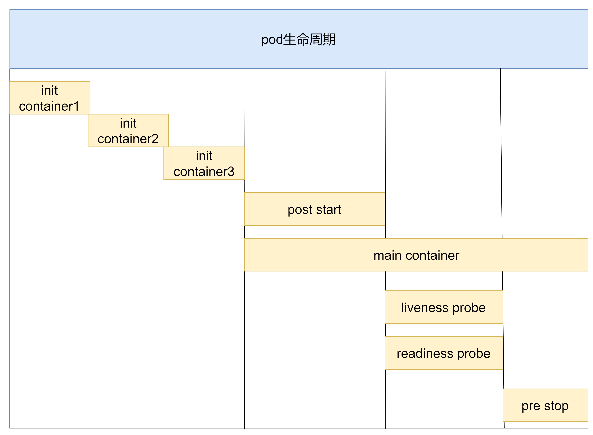
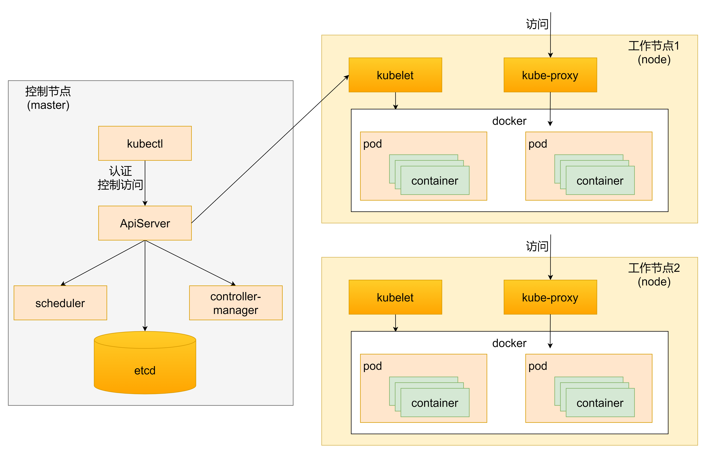

# Pod配置以及生命周期

## 1. Pod结构定义

每个pod中都可以包含一个或多个容器，这些容器可以分为两类

- 用户程序所在的容器，数量可多可少
- Pause容器，这是每个Pod都会有的一个根容器，它的作用有两个
  - 可以以它为根据，评估整个pod的健康状态
  - 可以在根容器上设置IP地址，其他容器都以此IP（Pod IP），以实现Pod内部的网络通信

~~~shell
[root@master ~]# kubectl get po -o wide --namespace=dev
NAME    READY   STATUS    RESTARTS   AGE     IP           NODE    NOMINATED NODE   READINESS GATES
nginx   1/1     Running   0          6d14h   10.244.1.6   node1   <none>           <none>
~~~

~~~shell
[root@node1 ~]# docker ps |grep nginx
a26eb43e2a6b   98ebf73aba75                                        "nginx -g 'daemon of…"   6 days ago       Up 6 days                 k8s_pod_nginx_dev_7229a25a-7b87-49cd-a8e7-e0f2ef83924b_0
b46b6ff6da7e   registry.aliyuncs.com/google_containers/pause:3.6   "/pause"                 6 days ago       Up 6 days                 k8s_POD_nginx_dev_7229a25a-7b87-49cd-a8e7-e0f2ef83924b_0
~~~

**可以看到创建的nginx pod里面有两个容器**

### 1.1 定义

在k8s中所有资源的一级属性都是一样的，主要包含5部分：

- apiVersion `<string> `  版本，由k8s内部定义，版本号可以用 kubectl api-versions查询到
- kind `<string>`        类型，由k8s内部定义，可以用 kubectl api-resources查询到
- metadata `<Object> `  元数据，主要是资源标识和说明，常用的有name，namespace，labels等
- spec `<Object>`       描述，这是配置中最重要的一部分，里面是对各种资源配置的详细描述
- status `<Object>  `    状态信息，里面的内容不需要定义，由k8s自动生成

在上面的属性中，**spec**是重点：

- containers `<[]Object>`     容器列表，用于定义容器的详细信息
- nodeName `<String> `     根据nodename的值将pod调度到指定的Node节点上
- nodeSelector `<map[]> `    根据NodeSelector中定义的信息选择将该Pod调度到包含这些label的node上
- hostNetwork `<boolean>`   是否使用主机网络模式，默认为false，如果设置为true，表示使用宿主机网络
- volumes `<[]Object>  `     存储卷，用于定义Pod上面挂载的存储信息
- restartPolicy `<string> `    重启策略，表示Pod在遇到故障的时候的处理策略


#### 1.1.1 pod定义

~~~yaml
apiVersion: v1     #必选，版本号，例如v1
kind: Pod       　 #必选，资源类型，例如 Pod
metadata:       　 #必选，元数据
  name: string     #必选，Pod名称
  namespace: string  #Pod所属的命名空间,默认为"default"
  labels:       　　  #自定义标签列表
    - name: string      　          
spec:  #必选，Pod中容器的详细定义
  containers:  #必选，Pod中容器列表
  - name: string   #必选，容器名称
    image: string  #必选，容器的镜像名称
    imagePullPolicy: [ Always|Never|IfNotPresent ]  #获取镜像的策略 
    command: [string]   #容器的启动命令列表，如不指定，使用打包时使用的启动命令
    args: [string]      #容器的启动命令参数列表
    workingDir: string  #容器的工作目录
    volumeMounts:       #挂载到容器内部的存储卷配置
    - name: string      #引用pod定义的共享存储卷的名称，需用volumes[]部分定义的的卷名
      mountPath: string #存储卷在容器内mount的绝对路径，应少于512字符
      readOnly: boolean #是否为只读模式
    ports: #需要暴露的端口库号列表
    - name: string        #端口的名称
      containerPort: int  #容器需要监听的端口号
      hostPort: int       #容器所在主机需要监听的端口号，默认与Container相同
      protocol: string    #端口协议，支持TCP和UDP，默认TCP
    env:   #容器运行前需设置的环境变量列表
    - name: string  #环境变量名称
      value: string #环境变量的值
    resources: #资源限制和请求的设置
      limits:  #资源限制的设置
        cpu: string     #Cpu的限制，单位为core数，将用于docker run --cpu-shares参数
        memory: string  #内存限制，单位可以为Mib/Gib，将用于docker run --memory参数
      requests: #资源请求的设置
        cpu: string    #Cpu请求，容器启动的初始可用数量
        memory: string #内存请求,容器启动的初始可用数量
    lifecycle: #生命周期钩子
        postStart: #容器启动后立即执行此钩子,如果执行失败,会根据重启策略进行重启
        preStop: #容器终止前执行此钩子,无论结果如何,容器都会终止
    livenessProbe:  #对Pod内各容器健康检查的设置，当探测无响应几次后将自动重启该容器
      exec:       　 #对Pod容器内检查方式设置为exec方式
        command: [string]  #exec方式需要制定的命令或脚本
      httpGet:       #对Pod内个容器健康检查方法设置为HttpGet，需要制定Path、port
        path: string
        port: number
        host: string
        scheme: string
        HttpHeaders:
        - name: string
          value: string
      tcpSocket:     #对Pod内个容器健康检查方式设置为tcpSocket方式
        port: number
        initialDelaySeconds: 0       #容器启动完成后首次探测的时间，单位为秒
        timeoutSeconds: 0    　　    #对容器健康检查探测等待响应的超时时间，单位秒，默认1秒
        periodSeconds: 0     　　    #对容器监控检查的定期探测时间设置，单位秒，默认10秒一次
        successThreshold: 0
        failureThreshold: 0
        securityContext:
          privileged: false
  restartPolicy: [Always | Never | OnFailure]  #Pod的重启策略
  nodeName: <string> #设置NodeName表示将该Pod调度到指定到名称的node节点上
  nodeSelector: obeject #设置NodeSelector表示将该Pod调度到包含这个label的node上
  imagePullSecrets: #Pull镜像时使用的secret名称，以key：secretkey格式指定
  - name: string
  hostNetwork: false   #是否使用主机网络模式，默认为false，如果设置为true，表示使用宿主机网络
  volumes:   #在该pod上定义共享存储卷列表
  - name: string    #共享存储卷名称 （volumes类型有很多种）
    emptyDir: {}       #类型为emtyDir的存储卷，与Pod同生命周期的一个临时目录。为空值
    hostPath: string   #类型为hostPath的存储卷，表示挂载Pod所在宿主机的目录
      path: string      　　        #Pod所在宿主机的目录，将被用于同期中mount的目录
    secret:       　　　#类型为secret的存储卷，挂载集群与定义的secret对象到容器内部
      scretname: string  
      items:     
      - key: string
        path: string
    configMap:         #类型为configMap的存储卷，挂载预定义的configMap对象到容器内部
      name: string
      items:
      - key: string
        path: string

~~~

可以发现，pod的资源非常繁多，因此要一个一个记住是不现实的

所以k8s提供了能够查看每种资源的配置项的命令

~~~shell
#kubectl explain 资源类型      #查看某种资源可以配置的一级属性
#kubectl explain 资源类型.属性   #查看属性的子属性
~~~

查看pod资源的一级属性

~~~shell
[root@master ~]# kubectl explain pod
KIND:     Pod
VERSION:  v1

DESCRIPTION:
     Pod is a collection of containers that can run on a host. This resource is
     created by clients and scheduled onto hosts.

FIELDS:
   apiVersion   <string>
     APIVersion defines the versioned schema of this representation of an
     object. Servers should convert recognized schemas to the latest internal
     value, and may reject unrecognized values. More info:
     https://git.k8s.io/community/contributors/devel/sig-architecture/api-conventions.md#resources

   kind <string>
     Kind is a string value representing the REST resource this object
     represents. Servers may infer this from the endpoint the client submits
     requests to. Cannot be updated. In CamelCase. More info:
     https://git.k8s.io/community/contributors/devel/sig-architecture/api-conventions.md#types-kinds

   metadata     <Object>
     Standard object's metadata. More info:
     https://git.k8s.io/community/contributors/devel/sig-architecture/api-conventions.md#metadata

   spec <Object>
     Specification of the desired behavior of the pod. More info:
     https://git.k8s.io/community/contributors/devel/sig-architecture/api-conventions.md#spec-and-status

   status       <Object>
     Most recently observed status of the pod. This data may not be up to date.
     Populated by the system. Read-only. More info:
     https://git.k8s.io/community/contributors/devel/sig-architecture/api-conventions.md#spec-and-status

~~~

查看pod资源的metadata的子属性

~~~shell
[root@master ~]# kubectl explain pod.metadata
KIND:     Pod
VERSION:  v1

RESOURCE: metadata <Object>

DESCRIPTION:
     Standard object's metadata. More info:
     https://git.k8s.io/community/contributors/devel/sig-architecture/api-conventions.md#metadata

     ObjectMeta is metadata that all persisted resources must have, which
     includes all objects users must create.

FIELDS:
   annotations  <map[string]string>
     Annotations is an unstructured key value map stored with a resource that
     may be set by external tools to store and retrieve arbitrary metadata. They
     are not queryable and should be preserved when modifying objects. More
     info: http://kubernetes.io/docs/user-guide/annotations

   clusterName  <string>
     The name of the cluster which the object belongs to. This is used to
     distinguish resources with same name and namespace in different clusters.
     This field is not set anywhere right now and apiserver is going to ignore
     it if set in create or update request.
 ......
~~~

查看pod.spec.containers属性：

~~~shell
[root@master ~]# kubectl explain pod.spec.containers
KIND:     Pod
VERSION:  v1

RESOURCE: containers <[]Object>

DESCRIPTION:
     List of containers belonging to the pod. Containers cannot currently be
     added or removed. There must be at least one container in a Pod. Cannot be
     updated.

     A single application container that you want to run within a pod.

FIELDS:
   args <[]string>
     Arguments to the entrypoint. The docker image's CMD is used if this is not
     provided. Variable references $(VAR_NAME) are expanded using the
     container's environment. If a variable cannot be resolved, the reference in
     the input string will be unchanged. Double $$ are reduced to a single $,
     which allows for escaping the $(VAR_NAME) syntax: i.e. "$$(VAR_NAME)" will
     produce the string literal "$(VAR_NAME)". Escaped references will never be
     expanded, regardless of whether the variable exists or not. Cannot be
     updated. More info:
     https://kubernetes.io/docs/tasks/inject-data-application/define-command-argument-container/#running-a-command-in-a-shell

   command      <[]string>
     Entrypoint array. Not executed within a shell. The docker image's
     ENTRYPOINT is used if this is not provided. Variable references $(VAR_NAME)
     are expanded using the container's environment. If a variable cannot be
     resolved, the reference in the input string will be unchanged. Double $$
     are reduced to a single $, which allows for escaping the $(VAR_NAME)
     syntax: i.e. "$$(VAR_NAME)" will produce the string literal "$(VAR_NAME)".
     Escaped references will never be expanded, regardless of whether the
     variable exists or not. Cannot be updated. More info:
     https://kubernetes.io/docs/tasks/inject-data-application/define-command-argument-container/#running-a-command-in-a-shell

   env  <[]Object>
     List of environment variables to set in the container. Cannot be updated.

   envFrom      <[]Object>
     List of sources to populate environment variables in the container. The
     keys defined within a source must be a C_IDENTIFIER. All invalid keys will
     be reported as an event when the container is starting. When a key exists
     in multiple sources, the value associated with the last source will take
     precedence. Values defined by an Env with a duplicate key will take
     precedence. Cannot be updated.
~~~


## 2. 简易使用

### 2.1 基本配置

创建pod-base.yaml文件，内容如下：

~~~yaml
apiVersion: v1
kind: Pod
metadata: 
  name: pod-base
  namespace: dev
  labels:
    user: zhangsan
spec:
  containers:
  - name: nginx
    image: nginx:1.17.1
  - name: busybox
    image: busybox:1.30
~~~

上面定义了一个比较简单的Pod的配置，里面有两个容器：

- nginx：用1.17.1版本的nginx镜像创建（nginx是一个轻量级web容器）
- busybox：用1.30版本的busybox镜像创建（busybox是一个小巧的linux命令集合）

~~~shell
[root@master pod]# kubectl create -f pod-base.yaml 
pod/pod-base created
[root@master pod]# kubectl get pod -n dev
NAME       READY   STATUS              RESTARTS   AGE
nginx      1/1     Running             0          6d23h
pod-base   0/2     ContainerCreating   0          32s
[root@master pod]# 
[root@master pod]# kubectl get pod -n dev
NAME       READY   STATUS             RESTARTS     AGE
nginx      1/1     Running            0            6d23h
pod-base   1/2     CrashLoopBackOff   1 (6s ago)   41s
[root@master pod]# kubectl get pod -n dev -o wide
NAME       READY   STATUS             RESTARTS        AGE     IP           NODE    NOMINATED NODE   READINESS GATES
nginx      1/1     Running            0               6d23h   10.244.1.6   node1   <none>           <none>
pod-base   1/2     CrashLoopBackOff   5 (2m32s ago)   6m4s    10.244.2.3   node2   <none>           <none>
~~~

### 2.2 设置镜像拉取

创建pod-imagepullpolicy.yaml文件，内容如下：

~~~yaml
apiVersion: v1
kind: Pod
metadata: 
  name: pod-imagepullpolicy
  namespace: dev
  labels:
    user: ayanami
spec:
  containers:
  - name: nginx
    image: nginx:1.17.1
    imagePullPolicy: Always  #用于设置镜像拉取策略
  - name: busybox
    image: busybox:1.30
~~~

imagePullPolicy，用于设置镜像拉取策略，k8s支持配置三种拉取策略：

- Always：总是从远程仓库拉取镜像（一直用远程）
- IfNotPresent：本地有则使用本地镜像，本地没有则从远程仓库拉取镜像（本地有则本地，本地没有则远程）
- Never：只使用本地镜像，从不去远程仓库拉取，本地没有就报错（一直使用本地）

默认值说明：

- 如果镜像TAG为具体版本号，默认策略是IfNotPresent
- 如果镜像TAG为：latest（最终版本），默认策略是always

~~~shell
[root@master pod]# kubectl create -f pod-imagepullpolicy.yaml 
pod/pod-imagepullpolicy created
[root@master pod]# kubectl get pod -n dev
NAME                  READY   STATUS             RESTARTS       AGE
nginx                 1/1     Running            0              6d23h
pod-base              1/2     CrashLoopBackOff   6 (4m1s ago)   10m
pod-imagepullpolicy   1/2     CrashLoopBackOff   2 (17s ago)    50s
[root@master pod]# kubectl get pod -n dev -o wide             
NAME                  READY   STATUS             RESTARTS       AGE     IP           NODE    NOMINATED NODE   READINESS GATES
nginx                 1/1     Running            0              6d23h   10.244.1.6   node1   <none>           <none>
pod-base              1/2     CrashLoopBackOff   6 (4m7s ago)   10m     10.244.2.3   node2   <none>           <none>
pod-imagepullpolicy   1/2     CrashLoopBackOff   2 (23s ago)    56s     10.244.2.4   node2   <none>           <none>
~~~

### 2.3 启动命令

在前面的案例中，一直有一个问题没有解决，就是busybox容器一直没有成功运行，那么到底是什么原因导致这个容器的故障呢

这是因为busybox并不是一个程序，而是类似于一个工具类的集合，k8s集群启动管理后，它会自动关闭。解决方法就是让其一直在运行，这就用到了command配置

创建pod-command.yaml文件，内容如下：

~~~shell
apiVersion: v1
kind: Pod
metadata: 
  name: pod-command
  namespace: dev
spec:
  containers:
  - name: nginx
    image: nginx:1.17.1
    imagePullPolicy: Always  #用于设置镜像拉取策略
  - name: busybox
    image: busybox:1.30
    command: ["/bin/sh","-c","touch /tmp/hello.txt;while true;do /bin/echo $(date +%T) >> /tmp/hello.txt;sleep 3;done;"]
~~~

对上面命令的解释：

`"/bin/sh","-c"`  使用sh执行命令

`touch /tmp/hello.txt;`  创建一个/tmp/hello.txt文件

`while true;do /bin/echo $(data +%T) >> /tmp/hello.txt;sleep 3;done; `每隔三秒向文件中写入当前时间

~~~shell
[root@master pod]# kubectl create -f pod-command.yaml 
pod/pod-command created
[root@master pod]# kubectl get pod -n dev
NAME                  READY   STATUS             RESTARTS        AGE
nginx                 1/1     Running            0               6d23h
pod-base              1/2     CrashLoopBackOff   7 (2m16s ago)   13m
pod-command           2/2     Running            0               36s
pod-imagepullpolicy   1/2     CrashLoopBackOff   5 (49s ago)     4m9s
[root@master pod]#  kubectl get pod -n dev -o wide 
NAME                  READY   STATUS             RESTARTS        AGE     IP           NODE    NOMINATED NODE   READINESS GATES
nginx                 1/1     Running            0               6d23h   10.244.1.6   node1   <none>           <none>
pod-base              1/2     CrashLoopBackOff   7 (2m19s ago)   13m     10.244.2.3   node2   <none>           <none>
pod-command           2/2     Running            0               39s     10.244.1.8   node1   <none>           <none>
pod-imagepullpolicy   1/2     CrashLoopBackOff   5 (52s ago)     4m12s   10.244.2.4   node2   <none>           <none>
~~~

进入容器查看文件:

~~~shell
[root@master pod]# kubectl exec pod-command -n dev -it -c busybox -- /bin/sh
/ # tail -f /tmp/hello.txt 
13:41:43
13:41:46
13:41:49
13:41:52
13:41:55
13:41:58
13:42:01
13:42:04
13:42:07
13:42:10
13:42:13
13:42:16
~~~

特别说明：

通过上面发现command已经可以完成启动命令和传递参数的功能，为什么这里还要提供一个args选项，用于传递参数呢？

这其实跟docker有关系，k8s中的command，arg两项其实是实现覆盖DockerFile中的ENTRYPOINT的功能

- 如果command和args均没有写，那么用DockerFile的配置
- 如果command写了，但args没有写，那么DockerFile默认的配置会被忽略，执行输入的command
- 如果command没写，但args写了，那么DockerFile中配置的ENTRYPOINT的命令会被执行，使用当前args的参数
- 如果command和args都写了，那么DockerFile的配置被忽略，执行command并追加上args参数

### 2.4 环境变量

创建pod-env.yaml文件，内容如下：

~~~shell
apiVersion: v1
kind: Pod
metadata: 
  name: pod-env
  namespace: dev
spec:
  containers:
  - name: busybox
    image: busybox:1.30
    command: ["/bin/sh","-c","while true;do /bin/echo $(date +%T) sleep 60;done;"]
    env: #设置环境变量列表
    - name: "username"
      value: "admin"
    - name: "password"
      value: "123456"
~~~

~~~shell
[root@master pod]# kubectl create -f pod-env.yaml 
pod/pod-env created
[root@master pod]# kubectl get pod -n dev
NAME                  READY   STATUS             RESTARTS       AGE
nginx                 1/1     Running            0              6d23h
pod-base              1/2     CrashLoopBackOff   8 (76s ago)    17m
pod-command           2/2     Running            0              4m47s
pod-env               1/1     Running            0              5s
pod-imagepullpolicy   1/2     CrashLoopBackOff   6 (2m8s ago)   8m20s
~~~

进入容器

```shell
[root@master ~]# kubectl exec -it pod-env -n dev -c busybox -- /bin/sh
/ # echo $username
admin
/ # echo $password
123456
/ # exit
```

### 2.5 端口设置

查看端口资源

~~~yaml
[root@master pod]# kubectl explain pod.spec.containers.ports
KIND:     Pod
VERSION:  v1

RESOURCE: ports <[]Object>

DESCRIPTION:
     List of ports to expose from the container. Exposing a port here gives the
     system additional information about the network connections a container
     uses, but is primarily informational. Not specifying a port here DOES NOT
     prevent that port from being exposed. Any port which is listening on the
     default "0.0.0.0" address inside a container will be accessible from the
     network. Cannot be updated.

     ContainerPort represents a network port in a single container.

FIELDS:
   containerPort        <integer> -required-
     Number of port to expose on the pod's IP address. This must be a valid port
     number, 0 < x < 65536.

   hostIP       <string>
     What host IP to bind the external port to.

   hostPort     <integer>
     Number of port to expose on the host. If specified, this must be a valid
     port number, 0 < x < 65536. If HostNetwork is specified, this must match
     ContainerPort. Most containers do not need this.

   name <string>
     If specified, this must be an IANA_SVC_NAME and unique within the pod. Each
     named port in a pod must have a unique name. Name for the port that can be
     referred to by services.

   protocol     <string>
     Protocol for port. Must be UDP, TCP, or SCTP. Defaults to "TCP".
~~~

接下来，创建`pod-ports.yaml`

~~~yaml
apiVersion: v1
kind: Pod
metadata: 
  name: pod-ports
  namespace: dev
spec:
  containers:
  - name: nginx
    image: nginx:1.17.1
    ports: 
    - name: nginx-port
      containerPort: 80
      protocol: TCP
~~~

~~~shell
[root@master pod]# kubectl create -f pod-ports.yaml               
pod/pod-ports created
[root@master pod]# kubectl get pod -n dev
NAME                  READY   STATUS             RESTARTS        AGE
nginx                 1/1     Running            0               6d23h
pod-base              1/2     CrashLoopBackOff   9 (109s ago)    23m
pod-command           2/2     Running            0               10m
pod-env               1/1     Running            0               5m49s
pod-imagepullpolicy   1/2     CrashLoopBackOff   7 (2m41s ago)   14m
pod-ports             1/1     Running            0               18s
~~~

~~~shell
[root@master pod]# kubectl get pod pod-ports -n dev -o wide
NAME        READY   STATUS    RESTARTS   AGE   IP           NODE    NOMINATED NODE   READINESS GATES
pod-ports   1/1     Running   0          37s   10.244.2.6   node2   <none>           <none>
~~~

查看详情

~~~shell
[root@master pod]# kubectl get pod pod-ports -n dev -o yaml       
apiVersion: v1
kind: Pod
metadata:
  creationTimestamp: "2022-08-12T14:04:57Z"
  name: pod-ports
  namespace: dev
  resourceVersion: "125110"
  uid: 676d55e3-71e2-422d-93f5-4537b45ff543
spec:
  containers:
  - image: nginx:1.17.1
    imagePullPolicy: IfNotPresent
    name: nginx
    ports:
    - containerPort: 80
      name: nginx-port
      protocol: TCP
~~~

### 2.6 资源配额

容器中的程序要运行，肯定是要占用一定资源的，比如cpu和内存等，如果不对某个容器的资源做限制，那么它就可能吃掉大量资源，导致其他容器无法运行。

针对这种情况，k8s提供了对内存和cpu的资源进行配额的机制，这种机制主要通过resources选项实现，它有两个子选项：

- limits：用于限制运行时容器的最大占用资源，当容器占用资源超过limits时会被终止，并进行重启
- requests：用于设置容器需要的最小资源，如果环境资源不够，容器将无法启动

创建pod-resources.yaml

~~~yaml
apiVersion: v1
kind: Pod
metadata: 
  name: pod-resources
  namespace: dev
spec:
  containers:
  - name: nginx
    image: nginx:1.17.1
    resources: #资源配额
      limits: #限制资源(上限)
        cpu: "2" #cpu限制
        memory: "10Gi"  #内存限制
      requests: #请求资源(下限)
        cpu: "1"
        memory: "10Mi"  #内存限制
~~~

~~~shell
[root@master pod]# kubectl create -f pod-resources.yaml 
pod/pod-resources created
[root@master pod]# kubectl get pod pod-resources -n dev
NAME            READY   STATUS    RESTARTS   AGE
pod-resources   1/1     Running   0          8s
[root@master pod]# kubectl describe pod pod-resources -n dev
Name:         pod-resources
Namespace:    dev
Priority:     0
Node:         node1/192.168.200.102
Start Time:   Fri, 12 Aug 2022 22:07:19 +0800
Labels:       <none>
Annotations:  <none>
Status:       Running
IP:           10.244.1.10
IPs:
  IP:  10.244.1.10
Containers:
  nginx:
    Container ID:   docker://fa7247baf122da83cfd677186bf1d45f53ab7a36e6d40c7ce8fcdc3c3b0131ee
    Image:          nginx:1.17.1
    Image ID:       docker-pullable://nginx@sha256:b4b9b3eee194703fc2fa8afa5b7510c77ae70cfba567af1376a573a967c03dbb
    Port:           <none>
    Host Port:      <none>
    State:          Running
      Started:      Fri, 12 Aug 2022 22:07:21 +0800
    Ready:          True
    Restart Count:  0
    Limits:
      cpu:     2
      memory:  10Gi
    Requests:
      cpu:        1
      memory:     10Mi
    Environment:  <none>
    Mounts:
      /var/run/secrets/kubernetes.io/serviceaccount from kube-api-access-9vhq6 (ro)
Conditions:
  Type              Status
  Initialized       True 
  Ready             True 
  ContainersReady   True 
  PodScheduled      True 
Volumes:
  kube-api-access-9vhq6:
    Type:                    Projected (a volume that contains injected data from multiple sources)
    TokenExpirationSeconds:  3607
    ConfigMapName:           kube-root-ca.crt
    ConfigMapOptional:       <nil>
    DownwardAPI:             true
QoS Class:                   Burstable
Node-Selectors:              <none>
Tolerations:                 node.kubernetes.io/not-ready:NoExecute op=Exists for 300s
                             node.kubernetes.io/unreachable:NoExecute op=Exists for 300s
Events:
  Type    Reason     Age   From               Message
  ----    ------     ----  ----               -------
  Normal  Scheduled  16s   default-scheduler  Successfully assigned dev/pod-resources to node1
  Normal  Pulled     2s    kubelet            Container image "nginx:1.17.1" already present on machine
  Normal  Created    2s    kubelet            Created container nginx
  Normal  Started    2s    kubelet            Started container nginx
~~~

## 3. 生命周期

我们一般将Pod对象从创建到终止的这段时间范围称为Pod的生命周期，它主要包含下面的过程：

- pod创建过程
- 运行初始化容器（init container）过程
- 运行主容器（main container）
  - 容器启动后钩子（post start）、容器终止前钩子（pre stop）
  - 容器的存活性检测（liveness probe）、就绪性检测（readiness probe）
- pod终止过程



我们首先了解下Pod的状态值，我们可以通过`kubectl explain pod.status`命令来了解关于Pod的一些信息，Pod的状态定义在`PodStatus`对象中，其中有一个`phase字段`，下面是`phase的可能取值`：

- 挂起（Pending）:Pod信息已经提交给了集群，但它尚未被调度完成或仍处于下载镜像的过程中。
- 运行中（Running）:Pod已经被调度到某节点，并且所有容器已经被Kubectl创建完成。
- 成功（Succeeded）:Pod中的所有容器都已经成功终止并且不会被重启。
- 失败（Failed）:所有容器都已经终止，并且至少有一个容器是因为失败终止，即容器返回了非0值的退出状态或被系统终止。
- 未知（Unknown）:API Server无法正常获取到Pod对象的状态信息，通常由于网络通信失败所导致。

除此之外，`PodStatus`对象中还包含一个`PodCondition`的数组，里面包含的属性有：

- lastProbeTime：最后一次探测 Pod Condition 的时间戳。
- lastTransitionTime：上次 Condition 从一种状态转换到另一种状态的时间。
- message：上次 Condition 状态转换的详细描述。
- reason：Condition 最后一次转换的原因。
- status：Condition 状态类型，可以为 “True”, “False”, and “Unknown”.
- type：Condition 类型，包括以下方面：
  - PodScheduled（Pod 已经被调度到其他 node 里）
  - Ready（Pod 能够提供服务请求，可以被添加到所有可匹配服务的负载平衡池中）
  - Initialized（所有的`init containers`已经启动成功）
  - Unschedulable（调度程序现在无法调度 Pod，例如由于缺乏资源或其他限制）
  - ContainersReady（Pod 里的所有容器都是 ready 状态）

### 3.1 pod创建过程



1. 用户通过kubectl或其他api客户端提交需要创建的pod信息给apiserver
2. apiserver开始生成pod对象的信息，并将信息存入etcd，然后返回确认信息至客户端
3. apiserver开始反映etcd中pod对象的变化，其他组件使用watch机制来跟踪检查apiserver上的变动
4. scheduler发现有新的pod对象要创建，开始为pod分配主机并将结果信息更新至apiserver
5. node节点上的kubelet发现有pod调度过来，尝试调用docker启动容器，并将结果返回送至apiserver
6. apiserver将接收到的pod状态信息存入etcd中

### 3.2 终止过程

1. 用户向apiserver发送删除pod对象的命令
2. apiserver中的pod对象信息会随着时间的推移而更新，在宽限期内（默认30s），pod被视为dead
3. 将pod标记为terminating状态
4. kubelet在监控到pod对象转为terminating状态的同时启动pod关闭进程
5. 端点控制器监控到pod对象的关闭行为时将其从所有匹配到此端点的service资源的端点列表移除
6. 如果当前pod对象定义了prestop钩子处理器，则在其标记为terminating后即会以同步的方式启动执行
7. pod对象中的容器进程收到停止信号
8. 宽限期结束后，若pod中还存在仍在运行的进程，那么pod对象会收到立即终止的信号
9. kubelet请求apiserver将此pod资源的宽限期设置为0从而完成删除操作，此时pod对于用户已不可见

### 3.3 初始化容器

初始化容器`Init Container`是在Pod的主容器启动之前要运行的容器，主要是做一些主容器的前置工作，可以是一个 它具有两大特征：

- 初始化容器必须运行完成直至结束，如果某个初始化容器运行失败，那么Kubernetes需要重启它直至成功完成。
- 初始化容器必须按照定义的顺序执行，当且仅当前一个成功之后，后面一个才能运行。

初始化容器有很多应用场景，下面列出的是最常见的几种：

- 提供主容器镜像中不具备的工具程序或自定义代码。
- 初始化容器要先于应用容器串行启动并运行完成；因此可用于延后应用容器的启动直至其依赖的条件得到满足。

**案例**

假设要以主容器来运行Nginx,但是要求在运行Nginx之前要能够连接上MySQL和Redis所在的服务器。

为了简化测试，提前规定好MySQL和Redis所在的IP地址分别为192.168.111.101,192.168.111.102（注意这两个IP都不能ping通）

创建pod-initcontainer.yaml文件

~~~yaml
apiVersion: v1
kind: Pod
metadata:
  name: pod-initcontainer
  namespace: dev
  labels:
    user: zhangsan
spec:
  containers:
    - name: nginx # 容器名称
      image: nginx:1.17.1  # 容器需要的镜像地址
      imagePullPolicy: IfNotPresent  # 设置镜像的拉取策略
      ports:
        - name: nginx-port  # 端口名称，如果执行，必须保证name在Pod中是唯一的
          containerPort: 80 # 容器要监听的端口
          protocol: TCP # 端口协议
      resources: # 资源配额
        limits: # 限制资源的上限
          cpu: "2"  # CPU限制，单位是core数
          memory: "10Gi"  # 内存限制
        requests: # 限制资源的下限
          cpu: "1"
          memory: "10Mi"
  initContainers: # 初始化容器配置
    - name: test-mysql
      image: busybox:1.30
      command: ["sh","-c","until ping 192.168.111.101 -c 1;do echo waiting for mysql ...;sleep 2;done;"]
      securityContext:
        privileged: true # 使用特权模式运行
    - name: test-redis
      image: busybox:1.30
      command: ["sh","-c","until ping 192.168.111.102 -c 1;do echo waiting for redis ...;sleep 2; done;"]

~~~

接下来启动并动态查看状态


```shell
[root@master pod]# kubectl create -f pod-initcontainer.yaml
pod/pod-initcontainer created
[root@master pod]# kubectl get pods pod-initcontainer -n dev -w 
NAME                READY   STATUS     RESTARTS   AGE
pod-initcontainer   0/1     Init:0/2   0          31s
```

我们发现，Pod没有准备就绪，状态是Init。


~~~shell
#查看具体的运行节点
[root@master pod]# kubectl get pods pod-initcontainer -n dev -w -o wide
NAME                READY   STATUS     RESTARTS   AGE   IP           NODE    NOMINATED NODE   READINESS GATES
pod-initcontainer   0/1     Init:0/2   0          13m   10.244.2.9   node2   <none>           <none>
~~~


我们给对应的节点的网卡添加IP:

~~~shell
ifconfig ens33:1 192.168.111.101 netmask 255.255.255.0 up
ifconfig ens33:2 192.168.111.102 netmask 255.255.255.0 up
~~~

~~~shell
[root@master pod]# kubectl get pods pod-initcontainer -n dev -w
NAME                READY   STATUS     RESTARTS   AGE
pod-initcontainer   0/1     Init:0/2   0          13m

pod-initcontainer   0/1     Init:1/2   0          14m
pod-initcontainer   0/1     PodInitializing   0          14m
pod-initcontainer   1/1     Running           0          14m
~~~

### 3.4 Pod Hook

钩子函数能够感知自身生命周期中的事件，并在相应的时刻到来时运行用户指定的程序代码。

k8s在主容器的启动之后和停止之前提供了两个钩子函数

- post start：容器创建之后执行，如果失败了会重启容器，主要用于资源部署、环境准备等。不过需要注意的是如果钩子花费太长时间以至于不能运行或者挂起，容器将不能达到 running 状态。
- pre stop：容器终止之前执行，执行完成之后容器将成功终止，在其完成之前会阻塞删除容器的操作，主要用于优雅关闭应用程序、通知其他系统等。如果钩子在执行期间挂起，Pod 阶段将停留在 running 状态并且永不会达到 failed 状态。

我们有三种方式来实现上面的钩子函数：

- Exec命令：在容器内执行一次命令，不过要注意的是该命令消耗的资源会被计入容器

  ~~~yaml
  ......
      lifecycle:
          postStart:
              exec:
                  command:
                      - cat
                      - /tmp/healthy
  ......
  
  ~~~

- TCPSocket：在当前容器尝试访问指定的socket

  ~~~yaml
  ......
      lifecycle:
          postStart:
              tcpSocket:
                  port:8080
  ......
  
  ~~~

  

- HttpGet：在当前容器中向某url发起http请求

  ~~~yaml
  ......
      lifecycle:
          postStart:
              httpGet:
                  path:/ # url地址
                  port:80  # 端口号
                  host:192.168.209.128  # 主机地址
                  scheme: HTTP  # 支持的协议，http或https
  ......
  
  ~~~

  

**示例**

创建pod-hook-exec.yaml文件，内容如下：

~~~yaml
apiVersion: v1
kind: Pod
metadata: 
  name: pod-hook-exec
  namespace: dev
spec:
  containers:
  - name: main-container
    image: nginx:1.17.1
    ports: 
    - name: nginx-port
      containerPort: 80
    lifecycle:
      postStart:
        exec: #在容器启动的时候执行一个命令，修改掉nginx的默认首页内容
          command: ["/bin/sh","-c","echo postStart... > /usr/share/nginx/html/index.html"]
      preStop: #在容器停止之前停止nginx服务
        exec:
          command: ["/usr/sbin/nginx","-s","quit"]
~~~

~~~shell
[root@master pod]# kubectl create -f pod-hook-exec.yaml
pod/pod-hook-exec created
[root@master pod]# kubectl get pod pod-hook-exec -n dev -o wide
NAME            READY   STATUS    RESTARTS   AGE   IP            NODE    NOMINATED NODE   READINESS GATES
pod-hook-exec   1/1     Running   0          8s    10.244.1.11   node1   <none>           <none>
~~~

node1节点：

~~~shell
[root@node1 ~]# curl 10.244.1.11
postStart...
~~~

### 3.5 容器探测

容器探测用于检测容器中的应用实例是否能正常工作，是保障业务可用性的一种传统机制。如果经过探测，实例的状态不符合预期

，那么K8S就会把该问题实例“摘除”，不承担业务流量，k8s提供了两种探针来实现容器探测，分别是：

- liveness probes：存活性探针，用于检测应用实例当前是否处于正常运行状态，如果不是，k8s会重启容器
- readiness probes：就绪性探针，用于检测应用实例当前是否可以接受请求，如果不能，k8s不会转发流量

即livenessProbe决定是否重启容器，readinesProbe决定是否将请求转发给容器

> k8s在1.16版本之后新增了startupProbe探针，用于判断容器内应用程序是否已经启动。如果配置了startupProbe探针，就会先禁止其他的探针，直到startupProbe探针成功为止，一旦成功将不再进行探测。

上面两种探针目前均支持三种探测方式：

- Exec命令：在容器内执行一次命令，如果命令执行的退出码为0，则认为程序正常，否则不正常

  ~~~yaml
  ......
      livenessProbe:
          postStart:
              exec:
                  command:
                      - cat
                      - /tmp/healthy
  ......
  
  ~~~

  

- TCPSocket：将会尝试访问同一个用户容器的端口，如果能够建立这条连接，则认为程序正常，否则不正常

  ~~~yaml
  ......
    livenessProbe:
        tcpSocket:
          port: 8080
  ......
  ~~~

  

- HTTPGet：调用容器内Web应用的URL，如果返回的状态码在200和399之间，则认为程序正常，否则不正常

  ~~~yaml
  ......
    lifecycle:
      postStart:
        httpGet:
          path: #uri地址
          port:
          host: 
          scheme: HTTP  #支持的协议，http或者https
  ......
  ~~~

 下面以liveness probes为例：

#### 3.5.1 EXEC

创建pod-liveness-exec.yaml：

~~~yaml
apiVersion: v1
kind: Pod
metadata: 
  name: pod-liveness-exec
  namespace: dev
spec:
  containers:
  - name: main-container
    image: nginx:1.17.1
    ports: 
    - name: nginx-port
      containerPort: 80
    livenessProbe:
      exec:
        command: ["/bin/cat","/tmp/hello.txt"] #执行一个查看文件的命令
~~~

~~~shell
[root@node1 ~]# kubectl create -f pod-liveness-exec.yaml
pod/pod-liveness-exec created
[root@node1 ~]# kubectl get pod pod-liveness-exec -n dev 
NAME                READY   STATUS    RESTARTS   AGE
pod-liveness-exec   1/1     Running   0          7s
~~~

~~~shell
[root@master pod]# kubectl describe pod pod-liveness-exec -n dev
Events:
  Type     Reason     Age               From               Message
  ----     ------     ----              ----               -------
  Normal   Scheduled  62s               default-scheduler  Successfully assigned dev/pod-liveness-exec to node2
  Normal   Pulled     1s (x3 over 61s)  kubelet            Container image "nginx:1.17.1" already present on machine
  Normal   Created    1s (x3 over 61s)  kubelet            Created container main-container
  Normal   Started    1s (x3 over 61s)  kubelet            Started container main-container
  Warning  Unhealthy  1s (x6 over 51s)  kubelet            Liveness probe failed: /bin/cat: /tmp/hello.txt: No such file or directory
  Normal   Killing    1s (x2 over 31s)  kubelet            Container main-container failed liveness probe, will be restarted
~~~

由于没有此文件，报错，导致容器重启

修改其文件内容：

~~~yaml
apiVersion: v1
kind: Pod
metadata: 
  name: pod-liveness-exec
  namespace: dev
spec:
  containers:
  - name: main-container
    image: nginx:1.17.1
    ports: 
    - name: nginx-port
      containerPort: 80
    livenessProbe:
      exec:
        command: ["/bin/ls","/tmp/"] #执行一个查看文件的命令
~~~

~~~shell
[root@master pod]# kubectl delete -f pod-liveness-exec.yaml 
pod "pod-liveness-exec" deleted
[root@master pod]# kubectl create -f pod-liveness-exec.yaml
pod/pod-liveness-exec created
[root@master pod]# kubectl get pod pod-liveness-exec -n dev
NAME                READY   STATUS    RESTARTS   AGE
pod-liveness-exec   1/1     Running   0          7s
[root@master pod]# kubectl describe pod pod-liveness-exec -n dev
Name:         pod-liveness-exec
Namespace:    dev
Priority:     0
Node:         node2/192.168.200.103
Start Time:   Fri, 12 Aug 2022 23:49:20 +0800
Labels:       <none>
Annotations:  <none>
Status:       Running
IP:           10.244.2.11
IPs:
  IP:  10.244.2.11
Containers:
  main-container:
    Container ID:   docker://a3a7c02ff4a6f391184e23d3929d8b0bddb7937638fa955be7e69d1f448b7443
    Image:          nginx:1.17.1
    Image ID:       docker-pullable://nginx@sha256:b4b9b3eee194703fc2fa8afa5b7510c77ae70cfba567af1376a573a967c03dbb
    Port:           80/TCP
    Host Port:      0/TCP
    State:          Running
      Started:      Fri, 12 Aug 2022 23:49:20 +0800
    Ready:          True
    Restart Count:  0
    Liveness:       exec [/bin/ls /tmp/] delay=0s timeout=1s period=10s #success=1 #failure=3
    Environment:    <none>
    Mounts:
      /var/run/secrets/kubernetes.io/serviceaccount from kube-api-access-s42xs (ro)
Conditions:
  Type              Status
  Initialized       True 
  Ready             True 
  ContainersReady   True 
  PodScheduled      True 
Volumes:
  kube-api-access-s42xs:
    Type:                    Projected (a volume that contains injected data from multiple sources)
    TokenExpirationSeconds:  3607
    ConfigMapName:           kube-root-ca.crt
    ConfigMapOptional:       <nil>
    DownwardAPI:             true
QoS Class:                   BestEffort
Node-Selectors:              <none>
Tolerations:                 node.kubernetes.io/not-ready:NoExecute op=Exists for 300s
                             node.kubernetes.io/unreachable:NoExecute op=Exists for 300s
Events:
  Type    Reason     Age   From               Message
  ----    ------     ----  ----               -------
  Normal  Scheduled  24s   default-scheduler  Successfully assigned dev/pod-liveness-exec to node2
  Normal  Pulled     24s   kubelet            Container image "nginx:1.17.1" already present on machine
  Normal  Created    24s   kubelet            Created container main-container
  Normal  Started    24s   kubelet            Started container main-container
~~~

#### 3.5.2 TCPSocket

创建pod-liveness-tcpsocket.yaml

~~~yaml
apiVersion: v1
kind: Pod
metadata: 
  name: pod-liveness-tcpsocket
  namespace: dev
spec:
  containers:
  - name: main-container
    image: nginx:1.17.1
    ports: 
    - name: nginx-port
      containerPort: 80
    livenessProbe:
      tcpSocket:
        port: 8080  #尝试访问8080端口
~~~

~~~shell
[root@master pod]# kubectl create -f pod-liveness-tcpsocket.yaml
pod/pod-liveness-tcpsocket created
[root@master pod]# kubectl get pod pod-liveness-tcpsocket -n dev
NAME                     READY   STATUS    RESTARTS   AGE
pod-liveness-tcpsocket   1/1     Running   0          6s
[root@master pod]# kubectl describe pod pod-liveness-tcpsocket -n dev
Name:         pod-liveness-tcpsocket
Namespace:    dev
Priority:     0
Node:         node1/192.168.200.102
Start Time:   Fri, 12 Aug 2022 23:52:33 +0800
Labels:       <none>
Annotations:  <none>
Status:       Running
IP:           10.244.1.12
IPs:
  IP:  10.244.1.12
Containers:
  main-container:
    Container ID:   docker://8e9e6ca1f11f06f80fe7d7b3e7a8f18c11bddc5568dff33041b77ad1e9c72088
    Image:          nginx:1.17.1
    Image ID:       docker-pullable://nginx@sha256:b4b9b3eee194703fc2fa8afa5b7510c77ae70cfba567af1376a573a967c03dbb
    Port:           80/TCP
    Host Port:      0/TCP
    State:          Running
      Started:      Fri, 12 Aug 2022 23:52:34 +0800
    Ready:          True
    Restart Count:  0
    Liveness:       tcp-socket :8080 delay=0s timeout=1s period=10s #success=1 #failure=3
    Environment:    <none>
    Mounts:
      /var/run/secrets/kubernetes.io/serviceaccount from kube-api-access-8glq7 (ro)
Conditions:
  Type              Status
  Initialized       True 
  Ready             True 
  ContainersReady   True 
  PodScheduled      True 
Volumes:
  kube-api-access-8glq7:
    Type:                    Projected (a volume that contains injected data from multiple sources)
    TokenExpirationSeconds:  3607
    ConfigMapName:           kube-root-ca.crt
    ConfigMapOptional:       <nil>
    DownwardAPI:             true
QoS Class:                   BestEffort
Node-Selectors:              <none>
Tolerations:                 node.kubernetes.io/not-ready:NoExecute op=Exists for 300s
                             node.kubernetes.io/unreachable:NoExecute op=Exists for 300s
Events:
  Type     Reason     Age                      From               Message
  ----     ------     ----                     ----               -------
  Normal   Scheduled  60s                      default-scheduler  Successfully assigned dev/pod-liveness-tcpsocket to node1
  Normal   Pulled     17s (x2 over 46s)        kubelet            Container image "nginx:1.17.1" already present on machine
  Normal   Created    17s (x2 over 46s)        kubelet            Created container main-container
  Normal   Started    17s (x2 over 46s)        kubelet            Started container main-container
  Normal   Killing    17s                      kubelet            Container main-container failed liveness probe, will be restarted
  Warning  Unhealthy  <invalid> (x5 over 37s)  kubelet            Liveness probe failed: dial tcp 10.244.1.12:8080: connect: connection refused
~~~

更改文件内容：

~~~yaml
apiVersion: v1
kind: Pod
metadata: 
  name: pod-liveness-tcpsocket
  namespace: dev
spec:
  containers:
  - name: main-container
    image: nginx:1.17.1
    ports: 
    - name: nginx-port
      containerPort: 80
    livenessProbe:
      tcpSocket:
        port: 80  #尝试访问80端口
~~~

~~~shell
[root@master pod]# kubectl delete -f pod-liveness-tcpsocket.yaml 
pod "pod-liveness-tcpsocket" deleted
[root@master pod]# kubectl create -f pod-liveness-tcpsocket.yaml 
pod/pod-liveness-tcpsocket created
[root@master pod]# kubectl get pod pod-liveness-tcpsocket -n dev
NAME                     READY   STATUS    RESTARTS   AGE
pod-liveness-tcpsocket   1/1     Running   0          5s
[root@master pod]# kubectl describe pod pod-liveness-tcpsocket -n dev
Name:         pod-liveness-tcpsocket
Namespace:    dev
Priority:     0
Node:         node1/192.168.200.102
Start Time:   Fri, 12 Aug 2022 23:54:26 +0800
Labels:       <none>
Annotations:  <none>
Status:       Running
IP:           10.244.1.13
IPs:
  IP:  10.244.1.13
Containers:
  main-container:
    Container ID:   docker://15e1a720e720432817081d3dd0e8a1b42b925e38514df53f2782de7d278a62c0
    Image:          nginx:1.17.1
    Image ID:       docker-pullable://nginx@sha256:b4b9b3eee194703fc2fa8afa5b7510c77ae70cfba567af1376a573a967c03dbb
    Port:           80/TCP
    Host Port:      0/TCP
    State:          Running
      Started:      Fri, 12 Aug 2022 23:54:27 +0800
    Ready:          True
    Restart Count:  0
    Liveness:       tcp-socket :80 delay=0s timeout=1s period=10s #success=1 #failure=3
    Environment:    <none>
    Mounts:
      /var/run/secrets/kubernetes.io/serviceaccount from kube-api-access-tcfk7 (ro)
Conditions:
  Type              Status
  Initialized       True 
  Ready             True 
  ContainersReady   True 
  PodScheduled      True 
Volumes:
  kube-api-access-tcfk7:
    Type:                    Projected (a volume that contains injected data from multiple sources)
    TokenExpirationSeconds:  3607
    ConfigMapName:           kube-root-ca.crt
    ConfigMapOptional:       <nil>
    DownwardAPI:             true
QoS Class:                   BestEffort
Node-Selectors:              <none>
Tolerations:                 node.kubernetes.io/not-ready:NoExecute op=Exists for 300s
                             node.kubernetes.io/unreachable:NoExecute op=Exists for 300s
Events:
  Type    Reason     Age        From               Message
  ----    ------     ----       ----               -------
  Normal  Scheduled  10s        default-scheduler  Successfully assigned dev/pod-liveness-tcpsocket to node1
  Normal  Pulled     <invalid>  kubelet            Container image "nginx:1.17.1" already present on machine
  Normal  Created    <invalid>  kubelet            Created container main-container
  Normal  Started    <invalid>  kubelet            Started container main-container
~~~

#### 3.5.3 HTTPGet

创建pod-liveness-httpget.yaml

~~~yaml
apiVersion: v1
kind: Pod
metadata: 
  name: pod-liveness-httpget
  namespace: dev
spec:
  containers:
  - name: main-container
    image: nginx:1.17.1
    ports: 
    - name: nginx-port
      containerPort: 80
    livenessProbe:
      httpGet: #其实就是访问http://127.0.0.1:80/hello
        scheme: HTTP #支持的协议，http或https
        port: 80
        path: /hello #uri地址
~~~

~~~shell
[root@master pod]# kubectl create -f pod-liveness-httpget.yaml
pod/pod-liveness-httpget created
[root@master pod]# kubectl get pod pod-liveness-httpget -n dev
NAME                   READY   STATUS    RESTARTS   AGE
pod-liveness-httpget   1/1     Running   0          4s
[root@master pod]# kubectl describe pod pod-liveness-httpget -n dev
Events:
  Type     Reason     Age               From               Message
  ----     ------     ----              ----               -------
  Normal   Scheduled  30s               default-scheduler  Successfully assigned dev/pod-liveness-httpget to node2
  Normal   Pulled     0s (x2 over 29s)  kubelet            Container image "nginx:1.17.1" already present on machine
  Normal   Created    0s (x2 over 29s)  kubelet            Created container main-container
  Normal   Started    0s (x2 over 29s)  kubelet            Started container main-container
  Warning  Unhealthy  0s (x3 over 20s)  kubelet            Liveness probe failed: HTTP probe failed with statuscode: 404
  Normal   Killing    0s                kubelet            Container main-container failed liveness probe, will be restarted
~~~

可以看见pod在重启，详细描述说明没找到这个网址

修改配置文件

~~~yaml
apiVersion: v1
kind: Pod
metadata: 
  name: pod-liveness-httpget
  namespace: dev
spec:
  containers:
  - name: main-container
    image: nginx:1.17.1
    ports: 
    - name: nginx-port
      containerPort: 80
    livenessProbe:
      httpGet: #其实就是访问http://127.0.0.1:80/
        scheme: HTTP #支持的协议，http或https
        port: 80
        path: / #uri地址
~~~

~~~shell
[root@master pod]# kubectl create -f pod-liveness-httpget.yaml
pod/pod-liveness-httpget created
[root@master pod]# kubectl get pod pod-liveness-httpget -n dev
NAME                   READY   STATUS    RESTARTS   AGE
pod-liveness-httpget   1/1     Running   0          6s
[root@master pod]# kubectl describe pod pod-liveness-httpget -n dev         
Name:         pod-liveness-httpget
Namespace:    dev
Priority:     0
Node:         node2/192.168.200.103
Start Time:   Fri, 12 Aug 2022 23:57:29 +0800
Labels:       <none>
Annotations:  <none>
Status:       Running
IP:           10.244.2.13
IPs:
  IP:  10.244.2.13
Containers:
  main-container:
    Container ID:   docker://77688fa183b12141506d94bcfb270bf258e692b12664dc6851821705fb549f8f
    Image:          nginx:1.17.1
    Image ID:       docker-pullable://nginx@sha256:b4b9b3eee194703fc2fa8afa5b7510c77ae70cfba567af1376a573a967c03dbb
    Port:           80/TCP
    Host Port:      0/TCP
    State:          Running
      Started:      Fri, 12 Aug 2022 23:57:30 +0800
    Ready:          True
    Restart Count:  0
    Liveness:       http-get http://:80/ delay=0s timeout=1s period=10s #success=1 #failure=3
    Environment:    <none>
    Mounts:
      /var/run/secrets/kubernetes.io/serviceaccount from kube-api-access-plf5d (ro)
Conditions:
  Type              Status
  Initialized       True 
  Ready             True 
  ContainersReady   True 
  PodScheduled      True 
Volumes:
  kube-api-access-plf5d:
    Type:                    Projected (a volume that contains injected data from multiple sources)
    TokenExpirationSeconds:  3607
    ConfigMapName:           kube-root-ca.crt
    ConfigMapOptional:       <nil>
    DownwardAPI:             true
QoS Class:                   BestEffort
Node-Selectors:              <none>
Tolerations:                 node.kubernetes.io/not-ready:NoExecute op=Exists for 300s
                             node.kubernetes.io/unreachable:NoExecute op=Exists for 300s
Events:
  Type    Reason     Age   From               Message
  ----    ------     ----  ----               -------
  Normal  Scheduled  21s   default-scheduler  Successfully assigned dev/pod-liveness-httpget to node2
  Normal  Pulled     20s   kubelet            Container image "nginx:1.17.1" already present on machine
  Normal  Created    20s   kubelet            Created container main-container
  Normal  Started    20s   kubelet            Started container main-container
~~~

#### 3.5.4 其他

上面已经使用了livenessProbe演示了三种探测方式，但是查看livenessProbe的子属性，会发现除了这三种方式，还有一些其他的配置。

~~~shell
[root@master pod]# kubectl explain pod.spec.containers.livenessProbe
KIND:     Pod
VERSION:  v1

RESOURCE: livenessProbe <Object>

DESCRIPTION:
     Periodic probe of container liveness. Container will be restarted if the
     probe fails. Cannot be updated. More info:
     https://kubernetes.io/docs/concepts/workloads/pods/pod-lifecycle#container-probes

     Probe describes a health check to be performed against a container to
     determine whether it is alive or ready to receive traffic.

FIELDS:
   exec <Object>
     Exec specifies the action to take.

   failureThreshold     <integer>
     Minimum consecutive failures for the probe to be considered failed after
     having succeeded. Defaults to 3. Minimum value is 1.

   grpc <Object>
     GRPC specifies an action involving a GRPC port. This is an alpha field and
     requires enabling GRPCContainerProbe feature gate.

   httpGet      <Object>
     HTTPGet specifies the http request to perform.

   initialDelaySeconds  <integer>
     Number of seconds after the container has started before liveness probes
     are initiated. More info:
     https://kubernetes.io/docs/concepts/workloads/pods/pod-lifecycle#container-probes

   periodSeconds        <integer>
     How often (in seconds) to perform the probe. Default to 10 seconds. Minimum
     value is 1.

   successThreshold     <integer>
     Minimum consecutive successes for the probe to be considered successful
     after having failed. Defaults to 1. Must be 1 for liveness and startup.
     Minimum value is 1.

   tcpSocket    <Object>
     TCPSocket specifies an action involving a TCP port.

   terminationGracePeriodSeconds        <integer>
     Optional duration in seconds the pod needs to terminate gracefully upon
     probe failure. The grace period is the duration in seconds after the
     processes running in the pod are sent a termination signal and the time
     when the processes are forcibly halted with a kill signal. Set this value
     longer than the expected cleanup time for your process. If this value is
     nil, the pod's terminationGracePeriodSeconds will be used. Otherwise, this
     value overrides the value provided by the pod spec. Value must be
     non-negative integer. The value zero indicates stop immediately via the
     kill signal (no opportunity to shut down). This is a beta field and
     requires enabling ProbeTerminationGracePeriod feature gate. Minimum value
     is 1. spec.terminationGracePeriodSeconds is used if unset.

   timeoutSeconds       <integer>
     Number of seconds after which the probe times out. Defaults to 1 second.
     Minimum value is 1. More info:
     https://kubernetes.io/docs/concepts/workloads/pods/pod-lifecycle#container-probes
~~~

* `initialDelaySeconds `   	 容器启动后等待多少秒执行第一次探测
* ` timeoutSeconds`      	探测超时时间。默认1秒，最小1秒 
* `periodSeconds`       	 执行探测的频率。默认是10秒，最小1秒 
* `failureThreshold  ` 	 	 连续探测失败多少次才被认定为失败。默认是3。最小值是1 
* `successThreshold `   	连续探测成功多少次才被认定为成功。默认是1

`initialDelaySeconds`可以用来配置第一次执行探针的等待时间，对于启动非常慢的应用这个参数非常有用，比如 `Jenkins`、`Gitlab` 这类应用，但是如何设置一个合适的初始延迟时间呢？这个就和应用具体的环境有关系了，所以这个值往往不是通用的，这样的话可能就会导致一个问题，我们的资源清单在别的环境下可能就会健康检查失败了，为解决这个问题，在 Kubernetes v1.16 版本官方特地新增了一个 `startupProbe（启动探针）`，该探针将推迟所有其他探针，直到 Pod 完成启动为止，使用方法和存活探针一样：

~~~yaml
......
    startupProbe:
      httpGet:
        path: /healthz
        port: 8080
      failureThreshold: 30  # 尽量设置大点
      periodSeconds: 10
......

~~~

有的时候，应用程序可能暂时无法对外提供服务，例如，应用程序可能需要在启动期间加载大量数据或配置文件。在这种情况下，你不想杀死应用程序，也不想对外提供服务。那么这个时候我们就可以使用`readiness probe`来检测和减轻这些情况。 

Pod 中的容器可以报告自己还没有准备，不能处理 Kubernetes 服务发送过来的流量。

`readiness probe`的配置跟`liveness probe`基本上一致的。唯一的不同是使用`readinessProbe`而不是`livenessProbe`。两者如果同时使用的话就可以确保流量不会到达还未准备好的容器，准备好过后，如果应用程序出现了错误，则会重新启动容器。

### 3.6 重启策略

在容器探测中，一旦容器探测出现了问题，Kubernetes就会对容器所在的Pod进行重启，其实这是由Pod的重启策略决定的，Pod的重启策略有3种，分别如下：

* Always：容器失效时，自动重启该容器，默认值。

* OnFailure：容器终止运行且退出码不为0时重启。

* Never：不论状态如何，都不重启该容器。

重启策略适用于Pod对象中的所有容器，首次需要重启的容器，将在其需要的时候立即进行重启，随后再次重启的操作将由kubelet延迟一段时间后进行，且反复的重启操作的延迟时长以此为10s、20s、40s、80s、160s和300s，300s是最大的延迟时长。


创建pod-restart.yaml

~~~yaml
apiVersion: v1
kind: Pod
metadata:
  name: pod-restart
  namespace: dev
  labels:
    user: zhangsan
spec:
  containers:
    - name: nginx # 容器名称
      image: nginx:1.17.1  # 容器需要的镜像地址
      imagePullPolicy: IfNotPresent  # 设置镜像的拉取策略
      
      ports:
        - name: nginx-port  # 端口名称，如果执行，必须保证name在Pod中是唯一的
          containerPort: 80 # 容器要监听的端口
          protocol: TCP # 端口协议
      livenessProbe: # 声明周期配置
        httpGet:
          port: 80
          scheme: HTTP
          path: /hello
          host: 127.0.0.1
  restartPolicy: Never # 重启策略

~~~

~~~shell
[root@master pod]# kubectl create -f pod-restart.yaml       
pod/pod-restart-policy created
[root@master pod]# kubectl describe pod pod-restart -n dev  
Events:
  Type     Reason     Age                      From               Message
  ----     ------     ----                     ----               -------
  Normal   Scheduled  35s                      default-scheduler  Successfully assigned dev/pod-restart-policy to node1
  Normal   Pulled     22s                      kubelet            Container image "nginx:1.17.1" already present on machine
  Normal   Created    22s                      kubelet            Created container nginx
  Normal   Started    22s                      kubelet            Started container nginx
  Warning  Unhealthy  <invalid> (x3 over 12s)  kubelet            Liveness probe failed: Get "http://127.0.0.1:80/hello": dial tcp 127.0.0.1:80: connect: connection refused
  Normal   Killing    <invalid>                kubelet            Stopping container nginx
~~~

我们发现容器探测失败后，直接停止容器，并没有选择重启。