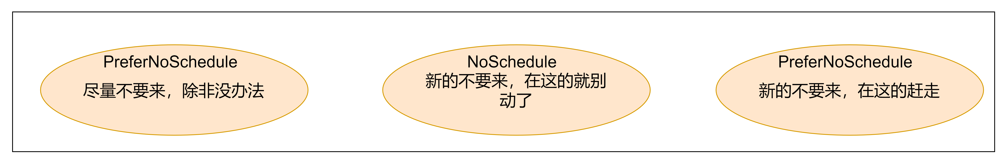

# Pod调度

在默认情况下，一个pod在哪个node节点上运行，是由scheduler组件采用相应的算法计算出来的，这个过程是不受人工控制的。

但是在实际过程中，这并不满足需求，因为很多情况下，我们想控制某些pod到达某些节点上，那么应该怎么做呢？

这就要求了解k8s对Pod的调度规则，k8s提供了四大类调度方式：

- 自动调度：运行在哪个节点上完全由Scheduler经过一系列的算法得出
- 定向调度：NodeName、NodeSelector
- 亲和性调度：NodeAffinity、PodAffinity、PodAntiAffinity
- 污点（容忍）调度：Taints、Toleration

## 1. 定向调度

定向调度，指的是利用在Pod上声明的NodeName或NodeSelector，以此将Pod调度到期望的Node节点上。注意，这里的调度是强制的，这就意味着即使要调度的目标Node不存在，也会向上面进行调度，只不过Pod运行失败而已

### 1.1 nodeName

nodeName用于强制约束将Pod调度到指定的name的Node节点上。这种方式，其实是直接跳过Scheduler的调度逻辑，直接将Pod调度到指定名称的节点。

创建一个pod-nodename.yaml文件

~~~yml
apiVersion: v1
kind: Pod
metadata:
  name: pod-nodename
  namespace: dev
  labels:
    user: zhangsan
spec:
  containers:
    - name: nginx # 容器名称
      image: nginx:1.17.1  # 容器需要的镜像地址
      imagePullPolicy: IfNotPresent  # 设置镜像的拉取策略
      ports:
        - name: nginx-port  # 端口名称，如果执行，必须保证name在Pod中是唯一的
          containerPort: 80 # 容器要监听的端口
          protocol: TCP # 端口协议
  nodeName: node1  # 指定调度到node1上

~~~

~~~shell
[root@master pod]# kubectl create -f pod-nodename.yaml
pod/pod-nodename created
[root@master pod]# kubectl get pod pod-nodename -n dev -o wide
NAME           READY   STATUS    RESTARTS   AGE   IP            NODE    NOMINATED NODE   READINESS GATES
pod-nodename   1/1     Running   0          5s    10.244.1.15   node1   <none>           <none>
~~~

更改配置文件为node3

~~~yaml
apiVersion: v1
kind: Pod
metadata:
  name: pod-nodename
  namespace: dev
  labels:
    user: zhangsan
spec:
  containers:
    - name: nginx # 容器名称
      image: nginx:1.17.1  # 容器需要的镜像地址
      imagePullPolicy: IfNotPresent  # 设置镜像的拉取策略
      ports:
        - name: nginx-port  # 端口名称，如果执行，必须保证name在Pod中是唯一的
          containerPort: 80 # 容器要监听的端口
          protocol: TCP # 端口协议
  nodeName: node3  # 指定调度到node1上

~~~

~~~shell
[root@master pod]# kubectl delete -f pod-nodename.yaml 
pod "pod-nodename" deleted
[root@master pod]# 
[root@master pod]# kubectl create -f pod-nodename.yaml        
pod/pod-nodename created
[root@master pod]# kubectl get pod pod-nodename -n dev -o wide
NAME           READY   STATUS    RESTARTS   AGE   IP       NODE    NOMINATED NODE   READINESS GATES
pod-nodename   0/1     Pending   0          3s    <none>   node3   <none>           <none>
~~~

虽然被指定在了node3，但是由于node3不存在，pod无法启动

### 1.2 nodeSelector

nodeSelector用于将Pod调度到添加了指定标签的Node节点上，它是通过Kubernetes的label-selector机制实现的，换言之，在Pod创建之前，会由Scheduler使用MatchNodeSelector调度策略进行label匹配，找出目标node，然后将Pod调度到目标节点，该匹配规则是强制约束。

**示例**

1. 为node节点添加标签

   ~~~shell
   [root@master ~]# kubectl label nodes node1 nodeenv=pro
   node/node1 labeled
   [root@master ~]# kubectl label nodes node2 nodeenv=test
   node/node2 labeled
   ~~~

2. 创建一个pod-nodeselector.yaml文件

   ~~~yaml
   apiVersion: v1
   kind: Pod
   metadata: 
     name: pod-nodeselector
     namespace: dev
   spec:
     containers:
     - name: nginx
       image: nginx:1.17.1
     nodeSelector: 
       nodeenv: pro  #指定调度到具有nodeenv=pro标签的节点上
   ~~~

3. 验证

   ~~~shell
   [root@master pod]# kubectl create -f pod-nodeselector.yaml 
   pod/pod-nodeselector created
   [root@master pod]# kubectl get pod pod-nodeselector -n dev -o wide
   NAME               READY   STATUS    RESTARTS   AGE   IP            NODE    NOMINATED NODE   READINESS GATES
   pod-nodeselector   1/1     Running   0          13s   10.244.1.16   node1   <none>           <none>
   ~~~

4. 同样如果调度到不存在的标签上，Pod无法启动

## 2. 亲和性调度

虽然定向调度的两种方式，使用起来非常方便，但是也有一定的问题，那就是如果没有满足条件的Node，那么Pod将不会被运行，即使在集群中还有可用的Node列表也不行，这就限制了它的使用场景。

基于上面的问题，Kubernetes还提供了一种亲和性调度（Affinity）。它在`nodeSelector`的基础之上进行了扩展，可以通过配置的形式，实现优先选择满足条件的Node进行调度，如果没有，也可以调度到不满足条件的节点上，使得调度更加灵活。

Affinity主要分为三类：

- nodeAffinity（node亲和性）：以Node为目标，解决Pod可以调度到那些Node的问题。
- podAffinity（pod亲和性）：以Pod为目标，解决Pod可以和那些已存在的Pod部署在同一个拓扑域中的问题。
- podAntiAffinity（pod反亲和性）：以Pod为目标，解决Pod不能和那些已经存在的Pod部署在同一拓扑域中的问题。

> 亲和性：如果两个应用频繁交互，那么就有必要利用亲和性让两个应用尽可能的靠近，这样可以较少因网络通信而带来的性能损耗。
>
> 反亲和性：当应用采用多副本部署的时候，那么就有必要利用反亲和性让各个应用实例打散分布在各个Node上，这样可以提高服务的高可用性。

### 2.1 nodeAffinity

nodeAffinity的可选配置项：

~~~yaml
requiredDuringSchedulingIgnoredDuringExecution  #Node节点必须满足指定的所有规则才可以，相当于硬限制
    nodeSelectorTerms  #节点选择列表
      matchFields   # 按节点字段列出的节点选择器要求列表  
      matchExpressions   #按节点标签列出的节点选择器要求列表(推荐)
        key    #键
        values #值
        operator #关系符 支持Exists, DoesNotExist, In, NotIn, Gt, Lt

preferredDuringSchedulingIgnoredDuringExecution #优先调度到满足指定的规则的Node，相当于软限制 (倾向)     
    preference   #一个节点选择器项，与相应的权重相关联
      matchFields #按节点字段列出的节点选择器要求列表
      matchExpressions   #按节点标签列出的节点选择器要求列表(推荐)
        key #键
        values #值
        operator #关系符 支持In, NotIn, Exists, DoesNotExist, Gt, Lt  
    weight # 倾向权重，在范围1-100。

~~~

关系符的使用说明：

~~~yaml
- matchExpressions:
	- key: env # 匹配存在标签的key为env的节点
	  operator: Exists   
	- key: env # 匹配标签的key为env,且value是"xxx"或"yyy"的节点
	  operator: In    
      values: ["xxx","yyy"]
    - key: env # 匹配标签的key为env,且value大于"xxx"的节点
      operator: Gt   
      values: "xxx"

~~~

#### 2.1.1 requiredDuringSchedulingIgnoredDuringExecution

硬限制

创建pod-nodeaffinity-required.yaml

~~~yaml
apiVersion: v1
kind: Pod
metadata: 
  name: pod-nodeaffinity-required
  namespace: dev
spec:
  containers:
  - name: nginx
    image: nginx:1.17.1
  affinity:   #亲和性设置
    nodeAffinity:   #设置node亲和性
      requiredDuringSchedulingIgnoredDuringExecution:  #硬限制
        nodeSelectorTerms:
        - matchExpressions:
          - key: nodeenv
            operator: In
            values: ["xxx","yyy"]
~~~


~~~shell
[root@master pod]# kubectl create -f pod-nodeaffinity-required.yaml 
pod/pod-nodeaffinity-required created
[root@master pod]# kubectl get pod pod-nodeaffinity-required -n dev
NAME                        READY   STATUS    RESTARTS   AGE
pod-nodeaffinity-required   0/1     Pending   0          5s
[root@master pod]# kubectl describe pod pod-nodeaffinity-required -n dev
Name:         pod-nodeaffinity-required
Namespace:    dev
Priority:     0
Node:         <none>
Labels:       <none>
Annotations:  <none>
Status:       Pending
IP:           
IPs:          <none>
Containers:
  nginx:
    Image:        nginx:1.17.1
    Port:         <none>
    Host Port:    <none>
    Environment:  <none>
    Mounts:
      /var/run/secrets/kubernetes.io/serviceaccount from kube-api-access-w97gs (ro)
Conditions:
  Type           Status
  PodScheduled   False 
Volumes:
  kube-api-access-w97gs:
    Type:                    Projected (a volume that contains injected data from multiple sources)
    TokenExpirationSeconds:  3607
    ConfigMapName:           kube-root-ca.crt
    ConfigMapOptional:       <nil>
    DownwardAPI:             true
QoS Class:                   BestEffort
Node-Selectors:              <none>
Tolerations:                 node.kubernetes.io/not-ready:NoExecute op=Exists for 300s
                             node.kubernetes.io/unreachable:NoExecute op=Exists for 300s
Events:
  Type     Reason            Age   From               Message
  ----     ------            ----  ----               -------
  Warning  FailedScheduling  15s   default-scheduler  0/3 nodes are available: 1 node(s) had taint {node-role.kubernetes.io/master: }, that the pod didn't tolerate, 2 node(s) didn't match Pod's node affinity/selector.
~~~

重新编辑配置文件的values

~~~yaml
apiVersion: v1
kind: Pod
metadata: 
  name: pod-nodeaffinity-required
  namespace: dev
spec:
  containers:
  - name: nginx
    image: nginx:1.17.1
  affinity:   #亲和性设置
    nodeAffinity:   #设置node亲和性
      requiredDuringSchedulingIgnoredDuringExecution:  #硬限制
        nodeSelectorTerms:
        - matchExpressions:
          - key: nodeenv
            operator: In
            values: ["pro","yyy"]
~~~

~~~shell
[root@master pod]# kubectl delete -f pod-nodeaffinity-required.yaml
pod "pod-nodeaffinity-required" deleted
[root@master pod]# kubectl create -f pod-nodeaffinity-required.yaml 
pod/pod-nodeaffinity-required created
[root@master pod]# kubectl get pod pod-nodeaffinity-required -n dev
NAME                        READY   STATUS    RESTARTS   AGE
pod-nodeaffinity-required   1/1     Running   0          5s
~~~

#### 2.1.2 preferredDuringSchedulingIgnoredDuringExecution

软限制

创建pod-nodeaffinity-preferred.yaml

~~~yaml
apiVersion: v1
kind: Pod
metadata: 
  name: pod-nodeaffinity-preferred
  namespace: dev
spec:
  containers:
  - name: nginx
    image: nginx:1.17.1
  affinity:   #亲和性设置
    nodeAffinity:   #设置node亲和性
      preferredDuringSchedulingIgnoredDuringExecution:  # 优先调度到满足指定的规则的Node，相当于软限制 (倾向)
      - weight: 1
        preference: # 一个节点选择器项，与相应的权重相关联
          matchExpressions:
          - key: nodeenv
            operator: In
            values: ["xxx","yyy"]
~~~

~~~shell
[root@master pod]# kubectl create -f pod-nodeaffinity-preferred.yaml 
pod/pod-nodeaffinity-preferred created
[root@master pod]# kubectl get pod pod-nodeaffinity-preferred -n dev -o wide
NAME                         READY   STATUS    RESTARTS   AGE   IP            NODE    NOMINATED NODE   READINESS GATES
pod-nodeaffinity-preferred   1/1     Running   0          13s   10.244.1.18   node1   <none>           <none>
~~~

即使没有满足条件，pod也被正常调度了

**注意：**

> 如果同时定义了`nodeSelector`和`nodeAffinity`，那么必须两个条件都满足，Pod才能运行在指定的Node上。
>
> 如果`nodeAffinity`指定了多个`nodeSelectorTerms`，那么只需要其中一个能够匹配成功即可。
>
> 如果一个`nodeSelectorTerms`中有多个`matchExpressions`，则一个节点必须满足所有的才能匹配成功。
>
> 如果一个Pod所在的Node在Pod运行期间其标签发生了改变，不再符合该Pod的`nodeAffinity`的要求，则系统将忽略此变化。

### 2.2 podAffinity

podAffinity主要实现以运行的Pod为参照，实现让新创建的Pod和参照的Pod在一个区域的功能。

查看PodAffinity的可选配置项

~~~yaml
requiredDuringSchedulingIgnoredDuringExecution  # 硬限制
  namespaces # 指定参照pod的namespace
  topologyKey # 指定调度作用域
  labelSelector # 标签选择器
    matchExpressions  # 按节点标签列出的节点选择器要求列表(推荐)
      key    #  键
      values # 值
      operator # 关系符 支持In, NotIn, Exists, DoesNotExist.
    matchLabels    # 指多个matchExpressions映射的内容  
  
preferredDuringSchedulingIgnoredDuringExecution # 软限制    
  podAffinityTerm  # 选项
    namespaces
    topologyKey
    labelSelector
       matchExpressions 
          key   #  键  
          values # 值  
          operator
       matchLabels 
  weight 倾向权重，在范围1-100

~~~

> topologyKey用于指定调度的作用域，例如:
>
> 如果指定为kubernetes.io/hostname，那就是以Node节点为区分范围。
>
> 如果指定为beta.kubernetes.io/os，则以Node节点的操作系统类型来区分。

#### 2.2.1 requireDuringSchedullingIgnoreDuringExecution

创建一个参照pod，pod-podaffinity-target.yaml

~~~yaml
apiVersion: v1
kind: Pod
metadata: 
  name: pod-podaffinity-target
  namespace: dev
  labels:
    podenv: pro   #设置标签
spec:
  containers:
  - name: nginx
    image: nginx:1.17.1
  nodeName: node1  #将目标pod明确指定到node1上
~~~

~~~shell
[root@master pod]# kubectl create -f pod-podaffinity-target.yaml
pod/pod-podaffinity-target created
[root@master pod]# kubectl get pod pod-podaffinity-target -n dev -o wide --show-labels
NAME                     READY   STATUS    RESTARTS   AGE   IP            NODE    NOMINATED NODE   READINESS GATES   LABELS
pod-podaffinity-target   1/1     Running   0          7s    10.244.1.19   node1   <none>           <none>            podenv=pro
~~~

创建pod-podaffinity-required.yaml

~~~yaml
apiVersion: v1
kind: Pod
metadata: 
  name: pod-podaffinity-required
  namespace: dev
spec:
  containers:
  - name: nginx
    image: nginx:1.17.1
  affinity:   #亲和性设置
    podAffinity:   #设置pod亲和性
      requiredDuringSchedulingIgnoredDuringExecution:  #硬限制
      -  labelSelector:
           matchExpressions: #匹配env的值在["xxx","yyy"]中的标签
           - key: podenv
             operator: In
             values: ["xxx","yyy"]
         topologyKey: kubernetes.io/hostname
~~~

~~~shell
[root@master pod]# kubectl create -f pod-podaffinity-required.yaml
pod/pod-podaffinity-required created
[root@master pod]# kubectl get pod pod-podaffinity-required -n dev -o wide --show-labels
NAME                       READY   STATUS    RESTARTS   AGE   IP       NODE     NOMINATED NODE   READINESS GATES   LABELS
pod-podaffinity-required   0/1     Pending   0          5s    <none>   <none>   <none>           <none>            <none>
[root@master pod]# kubectl describe pod pod-podaffinity-required -n dev
Name:         pod-podaffinity-required
Namespace:    dev
Priority:     0
Node:         <none>
Labels:       <none>
Annotations:  <none>
Status:       Pending
IP:           
IPs:          <none>
Containers:
  nginx:
    Image:        nginx:1.17.1
    Port:         <none>
    Host Port:    <none>
    Environment:  <none>
    Mounts:
      /var/run/secrets/kubernetes.io/serviceaccount from kube-api-access-mntx2 (ro)
Conditions:
  Type           Status
  PodScheduled   False 
Volumes:
  kube-api-access-mntx2:
    Type:                    Projected (a volume that contains injected data from multiple sources)
    TokenExpirationSeconds:  3607
    ConfigMapName:           kube-root-ca.crt
    ConfigMapOptional:       <nil>
    DownwardAPI:             true
QoS Class:                   BestEffort
Node-Selectors:              <none>
Tolerations:                 node.kubernetes.io/not-ready:NoExecute op=Exists for 300s
                             node.kubernetes.io/unreachable:NoExecute op=Exists for 300s
Events:
  Type     Reason            Age   From               Message
  ----     ------            ----  ----               -------
  Warning  FailedScheduling  12s   default-scheduler  0/3 nodes are available: 1 node(s) had taint {node-role.kubernetes.io/master: }, that the pod didn't tolerate, 2 node(s) didn't match pod affinity rules.
~~~

调度失败，修改配置信息:

~~~yaml
apiVersion: v1
kind: Pod
metadata: 
  name: pod-podaffinity-required
  namespace: dev
spec:
  containers:
  - name: nginx
    image: nginx:1.17.1
  affinity:   #亲和性设置
    podAffinity:   #设置pod亲和性
      requiredDuringSchedulingIgnoredDuringExecution:  #硬限制
      -  labelSelector:
           matchExpressions: #匹配env的值在["xxx","yyy"]中的标签
           - key: podenv
             operator: In
             values: ["pro","yyy"]
         topologyKey: kubernetes.io/hostname
~~~

~~~shell
[root@master pod]# kubectl delete -f pod-podaffinity-required.yaml                            
pod "pod-podaffinity-required" deleted
[root@master pod]# kubectl create -f pod-podaffinity-required.yaml 
pod/pod-podaffinity-required created
[root@master pod]# kubectl get pod pod-podaffinity-required -n dev -o wide --show-labels
NAME                       READY   STATUS    RESTARTS   AGE   IP            NODE    NOMINATED NODE   READINESS GATES   LABELS
pod-podaffinity-required   1/1     Running   0          6s    10.244.1.20   node1   <none>           <none>            <none>
~~~

#### 2.2.2 preferredDuringSchedulingIgnoredDuringExecution

创建pod-podaffinity-preferred.yaml，将pod调度到不满足调度条件的node上，看是否能成功

~~~yaml
apiVersion: v1
kind: Pod 
metadata:
  name: pod-podaffinity-preferred
  namespace: dev 
spec:
  containers: # 容器配置
    - name: nginx
      image: nginx:1.17.1
      imagePullPolicy: IfNotPresent
      ports:
        - name: nginx-port
          containerPort: 80
          protocol: TCP 
  affinity: # 亲和性配置
    podAffinity: # Pod亲和性
      preferredDuringSchedulingIgnoredDuringExecution: #软限制
        - podAffinityTerm:
            labelSelector:
              matchExpressions: 
                - key: podenv
                  operator: In
                  values:
                    - "xxx"
                    - "yyy"
            topologyKey: kubernetes.io/hostname
          weight: 1

~~~

~~~shell
[root@master pod]# kubectl create -f pod-podaffinity-preferred.yaml 
pod/pod-podaffinity-preferred created
[root@master pod]# kubectl get pod -n dev pod-podaffinity-preferred -o wide --show-labels
NAME                        READY   STATUS    RESTARTS   AGE   IP            NODE    NOMINATED NODE   READINESS GATES   LABELS
pod-podaffinity-preferred   1/1     Running   0          38s   10.244.1.21   node1   <none>           <none>            <none>
~~~

pod在不满足给定调度条件情况下，任然可以调度，pod被调度到了node1上。

### 2.3 podAntiAffinity

podAntiAffinity主要实现以运行的Pod为参照，让新创建的Pod和参照的Pod不在一个区域的功能。

其配置方式和podAffinity一样。

创建pod-podantiaffinity-required.yaml

~~~yaml
apiVersion: v1
kind: Pod
metadata: 
  name: pod-podantiaffinity-required
  namespace: dev
spec:
  containers:
  - name: nginx
    image: nginx:1.17.1
  affinity:   #亲和性设置
    podAntiAffinity:   #设置pod反亲和性
      requiredDuringSchedulingIgnoredDuringExecution:  #硬限制
      -  labelSelector:
           matchExpressions: #匹配env的值在["pro"]中的标签
           - key: podenv
             operator: In
             values: ["pro"]
         topologyKey: kubernetes.io/hostname
~~~

~~~shell
[root@master pod]# kubectl create -f pod-podantiaffinity-required.yaml
pod/pod-podantiaffinity-required created
[root@master pod]# kubectl get pod -n dev -o wide
NAME                           READY   STATUS             RESTARTS        AGE     IP            NODE    NOMINATED NODE   READINESS GATES
pod-podaffinity-target         1/1     Running            0               15m     10.244.1.19   node1   <none>           <none>
pod-podantiaffinity-required   1/1     Running            0               5s      10.244.2.14   node2   <none>           <none>
~~~

不在一个节点上

## 3. 污点和容忍

### 3.1 污点

前面的调度方式都是站在Pod的角度上，通过在Pod上添加属性，来确定Pod是否要调度到指定的Node上，其实我们也可以站在Node的角度上，通过在Node上添加`污点属性`，来决定是否运行Pod调度过来。

Node被设置了污点之后就和Pod之间存在了一种相斥的关系，进而拒绝Pod调度进来，甚至可以将已经存在的Pod驱逐出去。

污点的格式为：`key=value:effect`，key和value是污点的标签，effect描述污点的作用，支持如下三个选项：

 1、`PreferNoSchedule`：Kubernetes将尽量避免把Pod调度到具有该污点的Node上，除非没有其他节点可以调度。

 2、`NoSchedule`：Kubernetes将不会把Pod调度到具有该污点的Node上，但是不会影响当前Node上已经存在的Pod。

 3、`NoExecute`：Kubernetes将不会把Pod调度到具有该污点的Node上，同时也会将Node上已经存在的Pod驱逐。




污点相关语法:

- 设置污点

  ```shell
  kubectl taint node xxx key=value:effect
  ```

- 去除污点

  ```shell
  kubectl taint node xxx key:effect-
  ```

- 去除所有污点

  ```shell
  kubectl taint node xxx key-
  ```

- 查看指定节点上的污点

  ```shell
  kubectl describe node 节点名称
  ```

**案例**

演示污点的效果：

1. 准备节点node1（为了演示效果更加明显，暂时停止node2节点）
2. 为node1节点设置一个污点：tag=ms:PreferNoSchedule；然后创建pod1（pod1可以）
3. 修改为node1节点设置一个污点：tag=ms:NoSchedule；然后创建pod2（pod1正常 pod2失败）
4. 修改为node1节点设置一个污点：tag=ms:NoExecute；然后创建pod3（3个pod都失败）

在node2上执行下面命令，停掉node2:

```shell
kubeadm reset
```

在master节点上进行查看节点状态：

~~~shell
[root@master pod]# kubectl get node
NAME     STATUS     ROLES                  AGE   VERSION
master   Ready      control-plane,master   8d    v1.23.9
node1    Ready      <none>                 8d    v1.23.9
node2    NotReady   <none>                 8d    v1.23.9
~~~

为node1设置污点（PreferNoSchedule）：

~~~shell
kubectl taint nodes node1 tag=ms:PreferNoSchedule
~~~

创建pod1

~~~shell
[root@master pod]# kubectl run taint1 --image=nginx:1.17.1 -n dev
pod/taint1 created
[root@master pod]# kubectl get pod -n dev
NAME                           READY   STATUS             RESTARTS         AGE
taint1                         1/1     Running            0                8s
~~~

为node1设置污点（取消PreferNoSchedule设置为NoSchedule）

~~~shell
[root@master pod]# kubectl taint nodes node1 tag:PreferNoSchedule-
node/node1 untainted
[root@master pod]# kubectl taint nodes node1 tag=ms:NoSchedule     
node/node1 tainted
[root@master pod]# kubectl get pod -n dev
NAME                           READY   STATUS             RESTARTS         AGE
taint1                         1/1     Running            0                2m6s
~~~

pod1无变化

创建新的taint2（pod2）

~~~shell
[root@master pod]# kubectl run taint2 --image=nginx:1.17.1 -n dev
pod/taint2 created
[root@master pod]# kubectl get pod -n dev
NAME                           READY   STATUS             RESTARTS         AGE
taint1                         1/1     Running            0                2m51s
taint2                         0/1     Pending            0                10s
~~~

发现新的pod无法running，查看taint2

~~~shell
[root@master pod]# kubectl describe pod taint2 -n dev
Name:         taint2
Namespace:    dev
Priority:     0
Node:         <none>
Labels:       run=taint2
Annotations:  <none>
Status:       Pending
IP:           
IPs:          <none>
Containers:
  taint2:
    Image:        nginx:1.17.1
    Port:         <none>
    Host Port:    <none>
    Environment:  <none>
    Mounts:
      /var/run/secrets/kubernetes.io/serviceaccount from kube-api-access-gw6hn (ro)
Conditions:
  Type           Status
  PodScheduled   False 
Volumes:
  kube-api-access-gw6hn:
    Type:                    Projected (a volume that contains injected data from multiple sources)
    TokenExpirationSeconds:  3607
    ConfigMapName:           kube-root-ca.crt
    ConfigMapOptional:       <nil>
    DownwardAPI:             true
QoS Class:                   BestEffort
Node-Selectors:              <none>
Tolerations:                 node.kubernetes.io/not-ready:NoExecute op=Exists for 300s
                             node.kubernetes.io/unreachable:NoExecute op=Exists for 300s
Events:
  Type     Reason            Age   From               Message
  ----     ------            ----  ----               -------
  Warning  FailedScheduling  42s   default-scheduler  0/3 nodes are available: 1 node(s) had taint {node-role.kubernetes.io/master: }, that the pod didn't tolerate, 1 node(s) had taint {node.kubernetes.io/unreachable: }, that the pod didn't tolerate, 1 node(s) had taint {tag: ms}, that the pod didn't tolerate.
~~~

为node1设置污点（取消NoSchedule，设置为NoExecute）

~~~shell
[root@master pod]# kubectl taint node node1 tag:NoSchedule-
node/node1 untainted
[root@master pod]# kubectl taint node node1 tag=ms:NoExecute     
node/node1 tainted
[root@master pod]# kubectl get pod -n dev
~~~

pod1和pod2 都没了，创建一个taint3

~~~shell
[root@master pod]# kubectl run taint3 --image=nginx:1.17.1 -n dev
pod/taint3 created
[root@master pod]# kubectl get pod -n dev
NAME                           READY   STATUS        RESTARTS       AGE
taint3                         0/1     Pending       0              7s
~~~

新的也无法启动

**说明**

> 使用kubeadm搭建的集群，默认就会给Master节点添加一个污点标记，所以Pod就不会调度到Master节点上

### 3.2 容忍

上面介绍了污点的作用，我们可以在Node上添加污点用来拒绝Pod调度上来，但是如果就是想让一个Pod调度到一个有污点的Node上去，这时候应该怎么做？这就需要使用到容忍。

> 污点就是拒绝，容忍就是忽略，Node通过污点拒绝Pod调度上去，Pod通过容忍忽略拒绝。

容忍详细配置：

```shell
kubectl explain pod.spec.tolerations
......
FIELDS:
  key       # 对应着要容忍的污点的键，空意味着匹配所有的键
  value     # 对应着要容忍的污点的值
  operator  # key-value的运算符，支持Equal和Exists（默认）
  effect    # 对应污点的effect，空意味着匹配所有影响
  tolerationSeconds   # 容忍时间, 当effect为NoExecute时生效，表示pod在Node上的停留时间
```

当operator为Equal的时候，如果Node节点有多个Taint，那么Pod每个Taint都需要容忍才能部署上去。

当operator为Exists的时候，有如下的三种写法：

- 容忍指定的污点，污点带有指定的effect：

  ```shell
    tolerations: # 容忍
      - key: "tag" # 要容忍的污点的key
        operator: Exists # 操作符
        effect: NoExecute # 添加容忍的规则，这里必须和标记的污点规则相同
  ```

- 容忍指定的污点，不考虑具体的effect：

  ```shell
    tolerations: # 容忍
      - key: "tag" # 要容忍的污点的key
        operator: Exists # 操作符
  ```

- 容忍一切污点（慎用）：

  ```shell
   tolerations: # 容忍
      - operator: Exists # 操作符
  ```

在上面的污点示例中，已经给node1打上了NoExecute的污点，此时任何Pod是调度不上去的，可以通过在Pod中添加容忍，将Pod调度上去。

创建pod-toleration.yaml文件

~~~yaml
apiVersion: v1
kind: Pod
metadata: 
  name: pod-toleration
  namespace: dev
spec:
  containers:
  - name: nginx
    image: nginx:1.17.1
  tolerations:    #添加容忍
  - key: "tag"   #要容忍的污点的key
    operator: "Equal"   #操作符
    value: "ms"   #容忍的污点的value
    effect: "NoExecute"   #添加容忍的规则，这里必须和标记的污点规则相同
~~~

~~~shell
"pod-toleration.yaml" [新] 14L, 383C 已写入                                                                      
[root@master pod]# kubectl create -f pod-toleration.yaml
pod/pod-toleration created
[root@master pod]# kubectl get pod -n dev
NAME                           READY   STATUS        RESTARTS       AGE
pod-toleration                 1/1     Running       0              5s
taint3                         0/1     Pending       0              4m42s
~~~

