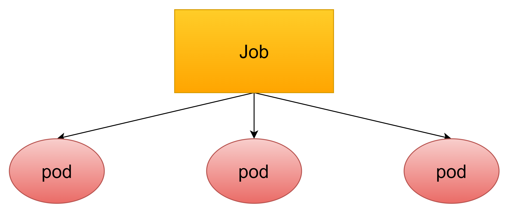
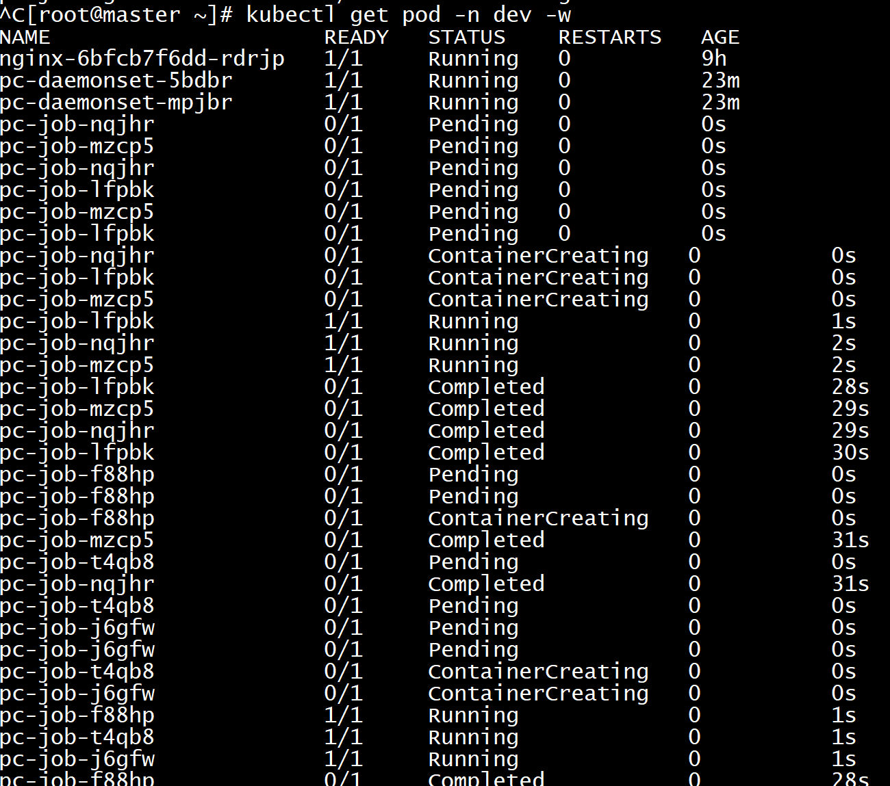

# Pod控制器

在k8s中，按照pod的创建方式可以将其分为两类

- 自主式pod：k8s直接创建出来的pod，这种pod删除后就没有了，也不会重建
- 控制器创建的pod：通过控制器创建的pod，这种pod删除了之后还会自动重建

## 1. 什么是pod控制器

pod控制器是管理pod的中间层，使用了pod控制器之后，我们只需要告诉pod控制器，想要多少个什么样的pod就可以了，它就会创建出满足条件的pod并确保每一个pod处于用户期望的状态，如果pod在运行中出现故障，控制器会基于指定策略重启动或者重建pod

## 2. 常见的pod控制器

在k8s中，有很多类型的pod控制器，每种都有自己的适合场景，常见的有下面这些：

- ReplicationController：比较原始的pod控制器，已经被废弃，由ReplicaSet替代
- ReplicaSet：保证指定数量的pod运行，并支持pod数量变更，镜像版本变更
- Deployment：通过控制ReplicaSet来控制pod，并支持滚动升级、版本回退
- Horizontal Pod Autoscaler：可以根据集群负载自动调整Pod数量，实现削峰填谷
- DaemonSet：在集群中的指定Node上都运行一个副本，一般用于守护进程类的任务
- Job：它创建出来的pod只要完成任务就立即退出，用于执行一次性任务
- Cronjob：它创建的pod会周期性地执行，用于执行周期性任务
- StatefulSet：管理有状态应用

## 3. ReplicaSet

### 3.1 ReplicaSet介绍

ReplicaSet的主要作用是保证一定数量的pod能够正常运行，它会持续监听这些pod的运行状态，一旦pod发生故障，就会重启或重建。同时它还支持对pod数量的扩缩容和版本镜像的升级。


假如我们现在有一个 Pod 正在提供线上的服务，我们来想想一下我们可能会遇到的一些场景：

- 某次运营活动非常成功，网站访问量突然暴增
- 运行当前 Pod 的节点发生故障了，Pod 不能正常提供服务了

第一种情况，可能比较好应对，活动之前我们可以大概计算下会有多大的访问量，提前多启动几个 Pod 副本，活动结束后再把多余的 Pod 杀掉，虽然有点麻烦，但是还是能够应对这种情况的。

第二种情况，可能某天夜里收到大量报警说服务挂了，然后起来打开电脑在另外的节点上重新启动一个新的 Pod，问题可以解决。

可是人工解决这些问题比较麻烦，如果有一种工具能够来帮助我们自动管理 Pod 就好了，Pod 挂了自动帮我在合适的节点上重新启动一个 Pod，这样是不是遇到上面的问题我们都不需要手动去解决了。

ReplicaSet就可以来帮助我们实现这个功能。

### 3.2 配置说明（资源文件清单）

~~~yaml
apiVersion: apps/v1  #版本号
kind: ReplicaSet  #类型
metadata:    #元数据
  name:    #rs名称
  namespace:   #所属命名空间
  labels:   #标签
    controller: rs
spec:   #详情描述
  replicas:  #副本数量
  selector:  #选择器，通过它指定该控制器管理哪些pod
    matchLabels:   #Labels匹配规则
       app: nginx-pod
    matchExpressions:   #Expression匹配规则
      - {key: app, operator: In, values: [nginx-pod]}
  template:  #模板，当副本数量不足时，会根据下面的模板创建pod副本
    metadata:
        labels:
          app: nginx-pod
    spec:
      containers:
      - name: nginx
        image: nginx:1.17.1
        ports:
        - containerPort: 80
~~~

在这里面，需要新了解的配置项就是spec下面几个选项：

- replicas：指定副本数量，其实就是当前rs创建出来的pod的数量，默认为1
- selector：选择器，它的作用时建立pod控制器和pod之间的关联关系，采用的Label Selector机制，在pod上定义Label，在控制器上定义选择器，就可以表明当前控制器能管理哪些pod了
- template：模板，就是当前控制器创建pod所使用的模板，里面其实就是前面学过的pod的定义

### 3.3 创建ReplicaSet

做之前记得删除污点，并且启动node2

~~~shell
kubectl taint node node1 tag:NoExecute-
~~~

kubeadm token create --print-join-command，获取join命令

~~~shell
[root@node2 ~]# echo "1" >/proc/sys/net/bridge/bridge-nf-call-iptables
[root@node2 ~]# kubeadm join 192.168.200.101:6443 --token sx1zsg.peupf7r7id5z81l4 --discovery-token-ca-cert-hash sha256:11a372a87d36a33db0e65cbb7aa87a4da69bdc324ede9325212a151432abd025
~~~


创建pc-replicaset.yaml文件

~~~yaml
apiVersion: apps/v1
kind: ReplicaSet
metadata:
  name: pc-replicaset
  namespace: dev
spec:
  replicas: 3
  selector:
    matchLabels:
      app: nginx-pod
  template:
    metadata:
      labels:
        app: nginx-pod
    spec:
      containers:
      - name: nginx
        image: nginx:1.17.1
~~~

~~~shell
[root@master pod]# kubectl create -f pc-replicaset.yaml                   
replicaset.apps/pc-replicaset created
[root@master pod]# kubectl get rs pc-replicaset -n dev -o wide
NAME            DESIRED   CURRENT   READY   AGE   CONTAINERS   IMAGES         SELECTOR
pc-replicaset   3         3         3       9s    nginx        nginx:1.17.1   app=nginx-pod
[root@master pod]# kubectl get pod -n dev
NAME                  READY   STATUS    RESTARTS   AGE
pc-replicaset-bkp4b   1/1     Running   0          15s
pc-replicaset-l6dp6   1/1     Running   0          15s
pc-replicaset-srj9g   1/1     Running   0          15s
~~~

### 3.4 扩缩容

#### 3.4.1 编辑rs文件

编辑rs的副本数量，修改spec:replicas

~~~shell
[root@master pod]# kubectl edit rs pc-replicaset -n dev
~~~

修改spec:replicas为6

~~~shell
[root@master pod]# kubectl get rs pc-replicaset -n dev -o wide
NAME            DESIRED   CURRENT   READY   AGE     CONTAINERS   IMAGES         SELECTOR
pc-replicaset   6         6         6       5h55m   nginx        nginx:1.17.1   app=nginx-pod
~~~

我们发现rs已经扩充为了6个。

查看pod，发现又新创建了3个pod

~~~shell
[root@master pod]# kubectl get pod -n dev
NAME                  READY   STATUS    RESTARTS   AGE
pc-replicaset-2cf7r   1/1     Running   0          70s
pc-replicaset-4mbf4   1/1     Running   0          70s
pc-replicaset-bkp4b   1/1     Running   0          5h56m
pc-replicaset-l6dp6   1/1     Running   0          5h56m
pc-replicaset-ns77g   1/1     Running   0          70s
pc-replicaset-srj9g   1/1     Running   0          5h56m
~~~

#### 3.4.2 使用命令

命令格式：

```shell
kubectl scale rs rs名称 --replicas=rs数量 -n 命名空间
```

将rs的数量减少为2个

~~~shell
[root@master pod]# kubectl scale rs pc-replicaset --replicas=2 -n dev
replicaset.apps/pc-replicaset scaled
[root@master pod]# kubectl get rs pc-replicaset -n dev -o wide
NAME            DESIRED   CURRENT   READY   AGE     CONTAINERS   IMAGES         SELECTOR
pc-replicaset   2         2         2       5h58m   nginx        nginx:1.17.1   app=nginx-pod
[root@master pod]# kubectl get pod -n dev
NAME                  READY   STATUS    RESTARTS   AGE
pc-replicaset-bkp4b   1/1     Running   0          5h58m
pc-replicaset-srj9g   1/1     Running   0          5h58m
~~~

### 3.5 镜像升级

在生产环境中，可能会遇见镜像某个版本出现问题，必须升级镜像，因此rs就给我们提供了升级rs镜像的功能

#### 3.5.1 编辑rs文件

~~~shell
[root@master pod]# kubectl edit rs pc-replicaset -n dev
~~~

将nginx版本从1.17.1升级为1.17.2

~~~shell
  spec:
      containers:
      - image: nginx:1.17.2
~~~

查看rs镜像，发现已经变成了1.17.2

~~~shell
[root@master pod]# kubectl get rs pc-replicaset -n dev -o wide
NAME            DESIRED   CURRENT   READY   AGE    CONTAINERS   IMAGES         SELECTOR
pc-replicaset   2         2         2       6h3m   nginx        nginx:1.17.2   app=nginx-pod
~~~

#### 3.5.2 使用命令

命令格式

```shell
kubectl set image rs rs名称 容器=镜像版本 -n 命名空间
```

使用命令将镜像版本修改回1.17.1

~~~shell
[root@master pod]# kubectl set image rs pc-replicaset nginx=nginx:1.17.1 -n dev
replicaset.apps/pc-replicaset image updated
[root@master pod]# kubectl get rs pc-replicaset -n dev -o wide
NAME            DESIRED   CURRENT   READY   AGE    CONTAINERS   IMAGES         SELECTOR
pc-replicaset   2         2         2       6h4m   nginx        nginx:1.17.1   app=nginx-pod
~~~

### 3.6 删除rs

使用kubectl delete命令会删除rs以及它管理的pod

在k8s删除rs前，会将rs的replicasclear调整为0，等待所有的pod被删除之后，再执行rs对象的删除

**三种删除rs的方式**

* 使用kubectl delete: 

  ~~~shell
  kubectl delete rs rs名称 -n 命名空间
  ~~~

* 只删除rs保留pod（不推荐使用）

  ~~~shell
  kubectl delete rs rs名称 -n 命名空间 --cascade=false
  ~~~

* 直接使用yaml删除（推荐）

  ~~~shell
  kubectl delete -f yaml文件名
  ~~~

  

  ~~~shell
  [root@master pod]# kubectl delete -f pc-replicaset.yaml 
  replicaset.apps "pc-replicaset" deleted
  [root@master pod]# kubectl get rs pc-replicaset -n dev
  Error from server (NotFound): replicasets.apps "pc-replicaset" not found
  ~~~

  

## 4. Deployment

为了更好地解决服务编排的问题，k8s在V1.2版本开始，引入了deployment控制器，值得一提的是，这种控制器并不直接管理pod，而 通过管理replicaset来间接管理pod，即：deployment管理replicaset，replicaset管理pod。所以deployment比replicaset的功能更强大。


deployment的主要功能有下面几个：

- 支持replicaset的所有功能
- 支持发布的停止、继续
- 支持版本的滚动更新和版本回退

### 4.1 配置说明（资源文件清单）

~~~yaml
apiVersion: apps/v1  #版本号
kind: Deployment  #类型
metadata:    #元数据
  name:    #名称
  namespace:   #所属命名空间
  labels:   #标签
    controller: deploy
spec:   #详情描述
  replicas:  #副本数量
  revisionHistoryLimit: #保留历史版本，默认是10
  paused: #暂停部署，默认是false
  progressDeadlineSeconds: #部署超时时间(s)，默认是600
  strategy: #策略
    type: RollingUpdates  #滚动更新策略
    rollingUpdate:  #滚动更新
      maxSurge: #最大额外可以存在的副本数，可以为百分比，也可以为整数
      maxUnavaliable: #最大不可用状态的pod的最大值，可以为百分比，也可以为整数
  selector:  #选择器，通过它指定该控制器管理哪些pod
    matchLabels:   #Labels匹配规则
       app: nginx-pod
    matchExpressions:   #Expression匹配规则
      - {key: app, operator: In, values: [nginx-pod]}
  template:  #模板，当副本数量不足时，会根据下面的模板创建pod副本
    metadata:
        labels:
          app: nginx-pod
    spec:
      containers:
      - name: nginx
        image: nginx:1.17.1
        ports:
        - containerPort: 80
~~~

### 4.2 创建deployment

创建pc-deployment.yaml

~~~yaml
apiVersion: apps/v1
kind: Deployment
metadata:
  name: pc-deployment
  namespace: dev
spec:
  replicas: 3
  selector:
    matchLabels:
     app: nginx-pod
  template:
    metadata:
      labels:
        app: nginx-pod
    spec:
      containers:
      - name: nginx
        image: nginx:1.17.1
~~~

~~~shell
[root@master pod]# kubectl create -f pc-deployment.yaml 
deployment.apps/pc-deployment created
[root@master pod]# kubectl get deploy -n dev -o wide
NAME            READY   UP-TO-DATE   AVAILABLE   AGE   CONTAINERS   IMAGES         SELECTOR
pc-deployment   3/3     3            3           10s   nginx        nginx:1.17.1   app=nginx-pod
~~~

查看deployment控制的rs和pod，发现rs是在deployment之后加了一段字符串，而pod是在rs之后加了一段字符串

~~~shell
[root@master pod]# kubectl get rs -n dev
NAME                       DESIRED   CURRENT   READY   AGE
pc-deployment-6f7f65b46d   3         3         3       55s
[root@master pod]# kubectl get pod -n dev  
NAME                             READY   STATUS    RESTARTS   AGE
pc-deployment-6f7f65b46d-4dpzs   1/1     Running   0          59s
pc-deployment-6f7f65b46d-7fnzg   1/1     Running   0          59s
pc-deployment-6f7f65b46d-kkcj4   1/1     Running   0          59s
~~~

### 4.3 扩缩容

#### 4.3.1 命令行

格式

```shell
kubectl scale deploy deploy名称 --replicas=pod数量 -n 命名空间
```

通过命令行变更pod数量为5个

~~~shell
[root@master pod]# kubectl scale deploy pc-deployment --replicas=5 -n dev
deployment.apps/pc-deployment scaled
[root@master pod]# kubectl get pod -n dev
NAME                             READY   STATUS    RESTARTS   AGE
pc-deployment-6f7f65b46d-4dpzs   1/1     Running   0          2m20s
pc-deployment-6f7f65b46d-54clm   1/1     Running   0          7s
pc-deployment-6f7f65b46d-7fnzg   1/1     Running   0          2m20s
pc-deployment-6f7f65b46d-kkcj4   1/1     Running   0          2m20s
pc-deployment-6f7f65b46d-vqgq7   1/1     Running   0          7s
~~~

#### 4.3.2 编辑deploy文件

格式

```shell
kubectl edit deploy deploy名字 -n 命名空间
```

通过编辑deploy文件编辑pod数量为3个

~~~shell
[root@master ~]# kubectl edit deploy pc-deployment -n dev
找到replicas，将其数量改为3
spec:
  progressDeadlineSeconds: 600
  replicas: 3
[root@master ~]# kubectl get pod -n dev
NAME                             READY   STATUS    RESTARTS   AGE
pc-deployment-6f7f65b46d-4dpzs   1/1     Running   0          4m33s
pc-deployment-6f7f65b46d-7fnzg   1/1     Running   0          4m33s
pc-deployment-6f7f65b46d-vqgq7   1/1     Running   0          2m20s
~~~

### 4.4 镜像更新

deployment支持两种镜像更新策略：**重建更新**和**滚动更新（默认）**，可以通过strategy选项进行配置

~~~yaml
strategy： # 指定新的pod替换旧的pod的策略，支持两个属性：
  type： #指定策略类型，支持两种策略
    Recreate： #在创建出新的pod之前会先杀掉所有已存在的pod
    RollingUpdate： #滚动更新，就是杀死一部分，就启动一部分，在更新过程中，存在两个版本pod
  rollingUpdate： #当type为RollingUpdate时生效，用于为RollingUpdate设置参数，支持两个属性
    maxUnavailable： #用来指定在升级过程中不可用pod的最大数量，默认为25%
    maxSurge： #用来指定在升级过程中可以超过期望的pod的最大数量，默认为25%
~~~

#### 4.4.1 重建更新

编辑pc-deployment.yaml，在spec节点下添加更新策略

~~~yaml
spec:
  strategy:  #策略
    type: Recreate  #重建更新策略
~~~

~~~shell
[root@master pod]# kubectl apply -f pc-deployment.yaml
~~~

~~~shell
#首先记录原本的pod名
[root@master ~]# kubectl get pod -n dev
NAME                             READY   STATUS    RESTARTS   AGE
pc-deployment-6f7f65b46d-4dpzs   1/1     Running   0          9m35s
pc-deployment-6f7f65b46d-7fnzg   1/1     Running   0          9m35s
pc-deployment-6f7f65b46d-vqgq7   1/1     Running   0          7m22s

#更改pod镜像
[root@master pod]# kubectl set image deploy pc-deployment nginx=nginx:1.17.2 -n dev
deployment.apps/pc-deployment image updated

#再次查看镜像
[root@master ~]# kubectl get pod -n dev
NAME                             READY   STATUS              RESTARTS   AGE
pc-deployment-86f4996797-65n7d   0/1     ContainerCreating   0          9s
pc-deployment-86f4996797-lcdms   0/1     ContainerCreating   0          9s
pc-deployment-86f4996797-xhk48   0/1     ContainerCreating   0          9s
[root@master pod]# kubectl get deploy -n dev -o wide
NAME            READY   UP-TO-DATE   AVAILABLE   AGE   CONTAINERS   IMAGES         SELECTOR
pc-deployment   3/3     3            3           10m   nginx        nginx:1.17.2   app=nginx-pod
~~~

#### 4.4.2 滚动更新

编辑pc-deployment.yaml，在spec节点下添加滚动更新策略（也可以把strategy去掉，因为默认策略就是滚动更新策略）

~~~yaml
strategy:
  type: RollingUpdate #滚动更新策略
  rollingUpdate:
    maxUnavailable: 25%
    maxSurge: 25%
~~~

~~~shell
[root@master pod]# kubectl apply -f pc-deployment.yaml 
deployment.apps/pc-deployment configured
~~~

~~~shell
#记录以前的pod
[root@master pod]# kubectl get pod -n dev
NAME                             READY   STATUS    RESTARTS   AGE
pc-deployment-6f7f65b46d-6kt2k   1/1     Running   0          26s
pc-deployment-6f7f65b46d-ckdnd   1/1     Running   0          25s
pc-deployment-6f7f65b46d-fhqf6   1/1     Running   0          28s
#更新镜像
[root@master pod]#  kubectl set image deploy pc-deployment nginx=nginx:1.17.2 -n dev
deployment.apps/pc-deployment image updated
#查看pod状态
[root@master pod]# kubectl get pod -n dev
NAME                             READY   STATUS    RESTARTS   AGE
pc-deployment-86f4996797-6wmmv   1/1     Running   0          3s
pc-deployment-86f4996797-f2g8b   1/1     Running   0          5s
pc-deployment-86f4996797-jxh6r   1/1     Running   0          4s
~~~

滚动更新的过程


记录变化：

~~~shell
#重建deployment
[root@master ~]# kubectl delete -f pc-deployment.yaml 
deployment.apps "pc-deployment" deleted
#添加record参数，表明创建时记录
[root@master ~]# kubectl create -f pc-deployment.yaml --record
deployment.apps/pc-deployment created
[root@master ~]# kubectl get deploy,rs,pod -n dev
NAME                            READY   UP-TO-DATE   AVAILABLE   AGE
deployment.apps/pc-deployment   3/3     3            3           49s

NAME                                       DESIRED   CURRENT   READY   AGE
replicaset.apps/pc-deployment-6f7f65b46d   3         3         3       49s

NAME                                 READY   STATUS    RESTARTS   AGE
pod/pc-deployment-6f7f65b46d-4qgzh   1/1     Running   0          49s
pod/pc-deployment-6f7f65b46d-58gh5   1/1     Running   0          49s
pod/pc-deployment-6f7f65b46d-6qmj6   1/1     Running   0          49s

~~~

克隆两个窗口监听rs和pod的变化

~~~shell
kubectl get rs -n dev -w
kubectl get pod -n dev -w
~~~

改变pod镜像

~~~shell
[root@master pod]# kubectl set image deploy pc-deployment nginx=nginx:1.17.2 -n dev
deployment.apps/pc-deployment image updated
~~~


pod的变化，发现序号6开头的pod在逐渐暂停，序号8开头的pod在逐渐创建


rs的变化，可以看见序号6开头的rs的pod数在减少，序号8开头的rs的pod数在增加

~~~shell
[root@master pod]# kubectl get rs -n dev
NAME                       DESIRED   CURRENT   READY   AGE
pc-deployment-6f7f65b46d   0         0         0       5m55s
pc-deployment-86f4996797   3         3         3       3m3s
~~~

原来的rs依旧存在，只是pod数量变为了0，而后又新产生了一个rs，pod数量为3。

### 4.5 版本回退

deployment支持版本升级过程中的暂停，继续功能以及版本回退等诸多功能。

kubectl rollout：版本升级相关功能，支持下面的选项：

- status：显示当前升级状态
- history：显示升级历史记录
- pause：暂停版本升级过程
- resume：继续已经暂停的版本升级过程
- restart：重启版本升级过程
- undo：回滚到上一级版本（可以使用--to-revision回滚到指定版本）


~~~shell
#查看升级状态
[root@master ~]# kubectl rollout status deploy pc-deployment -n dev
deployment "pc-deployment" successfully rolled out
#查看升级历史（注意：如果只显示版本号说明一开始使用yaml创建文件的时候没有加上--record命令）
[root@master ~]# kubectl rollout history deploy pc-deployment -n dev
deployment.apps/pc-deployment 
REVISION  CHANGE-CAUSE
1         kubectl create --filename=pc-deployment.yaml --record=true
2         kubectl create --filename=pc-deployment.yaml --record=true
#版本回滚
#这里使用--to-revision=1回滚到1版本，如果省略这个选项，则会回退到上个版本
[root@master ~]# kubectl rollout undo deploy pc-deployment --to-revision=1 -n dev
deployment.apps/pc-deployment rolled back
#查看是否回滚成功，发现6序号开头的rs被启动了
[root@master ~]# kubectl get rs -n dev
NAME                       DESIRED   CURRENT   READY   AGE
pc-deployment-6f7f65b46d   3         3         3       10m
pc-deployment-86f4996797   0         0         0       7m16s
~~~

### 4.6 金丝雀发布

deployment支持更新过程中的控制，如"暂停（pause）"或"继续（resume）"更新操作

比如有一批新的pod资源创建完成后立即暂停更新过程，此时，仅存在一部分新版本的应用，主体部分还是旧的版本。然后，再筛选一小部分的用户请求路由到新的pod应用，继续观察能否稳定地按期望的方式运行。确定没问题之后再继续完成余下的pod资源滚动更新，否则立即回滚更新操作。这就是所谓的金丝雀发布。

~~~shell
#更新deployment版本，并配置暂停deployment
[root@master ~]# kubectl set image deploy pc-deployment nginx=nginx:1.17.2 -n dev && > kubectl rollout pause deploy pc-deployment -n dev
deployment.apps/pc-deployment image updated
deployment.apps/pc-deployment paused

#查看rs，发现老版本rs没有减少，新版本rs增加一个
[root@master ~]# kubectl get rs -n dev
NAME                       DESIRED   CURRENT   READY   AGE
pc-deployment-6f7f65b46d   3         3         3       44m
pc-deployment-86f4996797   1         1         1       35m

#在窗口2中查看deploy状态，发现deploy正在等待更新且已经有1个更新好了
[root@master ~]# kubectl rollout status deploy pc-deployment -n dev
Waiting for deployment "pc-deployment" rollout to finish: 1 out of 3 new replicas have been updated...


#在窗口1中继续deploy的更新
[root@master ~]# kubectl rollout resume deploy pc-deployment -n dev
deployment.apps/pc-deployment resumed

#查看窗口2的状态

Waiting for deployment spec update to be observed...
Waiting for deployment spec update to be observed...
Waiting for deployment "pc-deployment" rollout to finish: 1 out of 3 new replicas have been updated...
Waiting for deployment "pc-deployment" rollout to finish: 2 out of 3 new replicas have been updated...
Waiting for deployment "pc-deployment" rollout to finish: 2 out of 3 new replicas have been updated...
Waiting for deployment "pc-deployment" rollout to finish: 2 out of 3 new replicas have been updated...
Waiting for deployment "pc-deployment" rollout to finish: 2 out of 3 new replicas have been updated...
Waiting for deployment "pc-deployment" rollout to finish: 1 old replicas are pending termination...
Waiting for deployment "pc-deployment" rollout to finish: 1 old replicas are pending termination...
deployment "pc-deployment" successfully rolled out

#在窗口1查看rs更新结果，发现老版本均停止，新版本已经创建好
[root@master pod]# kubectl get rs -n dev
NAME                       DESIRED   CURRENT   READY   AGE
pc-deployment-6f7f65b46d   0         0         0       39m
pc-deployment-86f4996797   3         3         3       36m
~~~

## 5. HPA

### 5.1 介绍

HPA（Horizontal Pod Autoscaler ），pod水平自动伸缩。

在前面的学习中，我们可以通过手工执行kubectl scale命令实现pod扩容，但是这显然不符合k8s的定位目标：自动化、智能化。

k8s期望可以通过监测pod的使用情况，实现pod数量的自动调整，于是就产生了HPA这种控制器

HPA可以获取每个pod利用率，然后和HPA中定义的指标进行对比，同时计算出需要伸缩的具体值，最后实现pod数量的调整。

其实HPA与之前的Deployment一样，也属于一种k8s资源对象，它通过追踪分析目标pod的负载变化情况，来确定是否需要针对性地调整目标pod的副本数。

说白了，就相当于你有10个pod在运行，但是pod利用率只有10%，那么HPA会根据指标自动给你删除其他不需要的pod。


### 5.2 安装metrics-server

metrics-server可以用来收集集群中的资源使用情况。

获取metrics-server,可以直接访问Github进行获取，自行从Github上获取注意版本号。[Github地址](https://github.com/kubernetes-sigs/metrics-server.git)

* 上传yaml

`由于国内访问github较慢的原因，从github上下载文件可能会失败，我在资料中准备好了`

~~~shell
[root@master pod]# kubectl apply -f components.yaml                                       
serviceaccount/metrics-server created
clusterrole.rbac.authorization.k8s.io/system:aggregated-metrics-reader created
clusterrole.rbac.authorization.k8s.io/system:metrics-server created
rolebinding.rbac.authorization.k8s.io/metrics-server-auth-reader created
clusterrolebinding.rbac.authorization.k8s.io/metrics-server:system:auth-delegator created
clusterrolebinding.rbac.authorization.k8s.io/system:metrics-server created
service/metrics-server created
deployment.apps/metrics-server created
apiservice.apiregistration.k8s.io/v1beta1.metrics.k8s.io created

~~~


* 查看pod

  ~~~shell
  [root@master pod]# kubectl get pods -n kube-system
  NAME                              READY   STATUS    RESTARTS       AGE
  coredns-6d8c4cb4d-8tqtt           1/1     Running   126 (8d ago)   9d
  coredns-6d8c4cb4d-vm7fx           1/1     Running   126 (8d ago)   9d
  etcd-master                       1/1     Running   5 (8d ago)     9d
  kube-apiserver-master             1/1     Running   8 (8d ago)     9d
  kube-controller-manager-master    1/1     Running   4 (8d ago)     9d
  kube-proxy-lwls6                  1/1     Running   1 (8d ago)     9d
  kube-proxy-scwzg                  1/1     Running   2              9d
  kube-proxy-sn9kc                  1/1     Running   3 (8d ago)     9d
  kube-scheduler-master             1/1     Running   6 (8d ago)     9d
  metrics-server-75c5f8c9f7-c429g   1/1     Running   0              15s
  ~~~

  

* 使用kubectl top node查看资源使用情况

  ~~~shell
  [root@master pod]# kubectl top node
  NAME     CPU(cores)   CPU%   MEMORY(bytes)   MEMORY%   
  master   71m          3%     1249Mi          65%       
  node1    20m          1%     447Mi           23%       
  node2    20m          1%     848Mi           44%       
  [root@master pod]# kubectl top pod -n kube-system
  NAME                              CPU(cores)   MEMORY(bytes)   
  coredns-6d8c4cb4d-8tqtt           1m           14Mi            
  coredns-6d8c4cb4d-vm7fx           1m           15Mi            
  etcd-master                       12m          75Mi            
  kube-apiserver-master             23m          337Mi           
  kube-controller-manager-master    8m           70Mi            
  kube-proxy-lwls6                  4m           12Mi            
  kube-proxy-scwzg                  1m           8Mi             
  kube-proxy-sn9kc                  1m           13Mi            
  kube-scheduler-master             2m           23Mi            
  metrics-server-75c5f8c9f7-c429g   33m          13Mi
  ~~~

  metrics-server安装完成

### 5.3 使用HPA

1. 准备deployment和service

用 Deployment 来创建一个 Nginx Pod

创建hpa-nginx.yaml

~~~yaml
apiVersion: apps/v1 # 版本号
kind: Deployment # 类型
metadata: # 元数据
  name: nginx # deployment的名称
  namespace: dev
spec: # 详细描述
  selector: # 选择器，通过它指定该控制器可以管理哪些Pod
    matchLabels: # Labels匹配规则
      app: nginx-pod
  template: # 模块 当副本数据不足的时候，会根据下面的模板创建Pod副本
    metadata:
      labels:
        app: nginx-pod
    spec:
      containers:
        - name: nginx # 容器名称
          image: nginx:1.17.1 # 容器需要的镜像地址
          ports:
            - containerPort: 80 # 容器所监听的端口
              protocol: TCP
          resources: # 资源限制
            requests:
              memory: "50Mi"
              cpu: "100m" # 100m表示100millicpu，即0.1个CPU

~~~

hpa-service.yaml

~~~yaml
apiVersion: v1 # 版本号
kind: Service # 类型
metadata: # 元数据
  name: hpa-nginx #名称
  namespace: dev
spec: # 详细描述
  selector: 
    app: nginx-pod
  ports:
    - port: 80 
      protocol: TCP
      nodePort: 30002
      targetPort: 80
  type: NodePort
~~~


~~~shell
#创建deployment
[root@master 1.8+]# kubectl create -f hpa-nginx.yaml
#创建service
[root@master pod]# kubectl create -f hpa-service.yaml 
service/hpa-nginx created
#查看
[root@master ~]# kubectl get deploy,pod,svc -n dev
NAME                            READY   UP-TO-DATE   AVAILABLE   AGE
deployment.apps/nginx           1/1     1            1           11s
deployment.apps/pc-deployment   3/3     3            3           100m

NAME                                 READY   STATUS    RESTARTS   AGE
pod/nginx                            1/1     Running   0          10m
pod/nginx-679bdbcc5b-rpzc9           1/1     Running   0          11s

NAME            TYPE       CLUSTER-IP     EXTERNAL-IP   PORT(S)        AGE
service/nginx   NodePort   10.96.65.124   <none>        80:30002/TCP   5s
~~~

~~~shell
[root@master pod]# kubectl get pod -n dev -o wide
NAME                     READY   STATUS    RESTARTS   AGE     IP            NODE    NOMINATED NODE   READINESS GATES
nginx-6bfcb7f6dd-rdrjp   1/1     Running   0          7m27s   10.244.1.47   node1   <none>           <none>
~~~

访问node1的ip加30002，http://192.168.200.102:30002/ 能正确访问到nginx

2. 部署HPA

   创建pc-hpa.yaml

   ~~~yaml
   apiVersion: autoscaling/v1
   kind: HorizontalPodAutoscaler
   metadata:
     name: pc-hpa
     namespace: dev
   spec:
     minReplicas: 1 #最小pod数量
     maxReplicas: 10  #最大pod数量
     targetCPUUtilizationPercentage: 3 #cpu使用率指标,意思是当pod使用率达到3%之后就增加新的pod
     scaleTargetRef:  #指定要控制的nginx信息
       apiVersion: apps/v1
       kind: Deployment
       name: nginx
   ~~~

   ~~~shell
   [root@master pod]# kubectl create -f pc-hpa.yaml 
   horizontalpodautoscaler.autoscaling/pc-hpa created
   [root@master pod]# kubectl get hpa -n dev
   NAME     REFERENCE          TARGETS        MINPODS   MAXPODS   REPLICAS   AGE
   pc-hpa   Deployment/nginx   <unknown>/3%   1         10        0          5s
   ~~~

3. hpa压力测试

   * 新建三个窗口，分别监听hpa，deploy，pod

     ~~~shell
     kubectl get deploy -n dev -w
     kubectl get pod -n dev -w
     kubectl get hpa -n dev -w
     ~~~

   * 压力测试

     ~~~go
     package k8s
     
     import (
     	"fmt"
     	"net/http"
     	"testing"
     )
     
     func Test_k8s(t *testing.T) {
     	for i := 0; i < 10000; i++ {
     		go func() {
     			// ip : master Ip
     			// port: svc暴露给我们的port
     			resp, err := http.Get("http://192.168.200.102:30002")
     			if err != nil {
     				fmt.Println(err)
     			} else {
     				fmt.Println(resp)
     			}
     		}()
     	}
     	select {}
     }
     
     ~~~

     

   * 查看监控

     

     

     

     可以发现由于pod使用率的增加，pod在不断地被创建，最后总共创建了10个pod，即我们设置的最大阈值。

     压力测试结束之后，在等几分钟，再次查看pod的情况，可以发现，大约10分钟之后，由于pod使用率降低，pod在不断地被删除，最后只剩一个pod

     

     

## 6. DaemonSet 

### 6.1 介绍

DS类型的控制器可以保证集群中的每一台（或指定）节点上都运行一个副本，一般适用于日志收集，节点监控等场景。也就是说，如果一个pod提供的功能是节点级别的（每个节点都需要且只需要一个），那么这类pod就适合使用DS类型的控制器创建。


DaemonSet控制器的特点

- 每当向集群中添加一个节点时，指定的pod副本也将添加到该节点上
- 当节点从集群中移除时，pod就被垃圾回收

### 6.2 配置说明（资源文件清单）

~~~yaml
apiVersion: apps/v1  #版本号
kind: DaemonSet   #类型
metadata:  #元数据
  name:
  namespace:
  labels:
    controller: daemonset
spec:  #详情描述
  revisionHistoryLimit: 3 #保留历史版本
  updateStrategy:  #更新策略
    type: RollingUpdate  #滚动更新策略
    rollingUpdate:  #滚动更新
      maxUnavailable: 1 #最大不可用状态的pod值，可以为百分比，也可以为整数
  selector: #选择器，通过它指定该控制器管理哪些pod
    matchLabels:   #labels匹配规则
      app: nginx-pod
    matchExpressions: #Expressions匹配规则
    - {key: app, operator: In, values: [nginx-pod]}
  template: #模板，当副本数量不足时，会根据下面的模板创建pod副本
    metadata:
      labels:
        app: nginx-pod
    spec: 
      containers:
      - name: nginx
        image: nginx:1.17.1
        ports:
        - containerPort: 80
~~~

### 6.3 简单使用

创建pc-daemonset.yaml

~~~yaml
apiVersion: apps/v1
kind: DaemonSet
metadata:
  name: pc-daemonset
  namespace: dev
spec:
 selector:
  matchLabels:
    app: nginx-pod
 template:
   metadata:
     labels:
      app: nginx-pod
   spec:
     containers:
     - name: nginx
       image: nginx:1.17.1
~~~

~~~shell
[root@master pod]# kubectl create -f pc-daemonset.yaml
daemonset.apps/pc-daemonset created
[root@master pod]# kubectl get ds pc-daemonset -n dev
NAME           DESIRED   CURRENT   READY   UP-TO-DATE   AVAILABLE   NODE SELECTOR   AGE
pc-daemonset   2         2         2       2            2           <none>          6s
[root@master pod]# kubectl get pod -n dev -o wide
NAME                     READY   STATUS    RESTARTS   AGE   IP            NODE    NOMINATED NODE   READINESS GATES
nginx-6bfcb7f6dd-rdrjp   1/1     Running   0          9h    10.244.1.47   node1   <none>           <none>
pc-daemonset-5bdbr       1/1     Running   0          20s   10.244.1.52   node1   <none>           <none>
pc-daemonset-mpjbr       1/1     Running   0          20s   10.244.2.37   node2   <none>           <none>
~~~

node1和node2都配置了DS。

## 7. Job

### 7.1 介绍

job，主要是用于负责批量处理(**一次要处理指定数量**)短暂的一次性(**每个任务仅运行一次就结束**)任务。

job特点如下：

- 当job创建的pod执行成功时，job将记录成功结束的pod数量
- 当成功结束的pod达到指定数量时，job将完成执行



Deployment, DaemonSet等控制器主要编排的对象都是"在线业务"，比如我们举例常用的Nginx，MySQL等。这些应用一旦运行起来，除非出错或者停止，它的容器进程会一直保持Running状态。

但是，有一类作业显然不满足这样的条件，这就是“离线业务”，或者叫作 Batch Job（计算业务）。这种业务在计算完成后就直接退出了，而此时如果依然用 Deployment 来管理这种业务的话，就会发现 Pod 会在计算结束后退出，然后被 Deployment Controller 不断地重启；而像“滚动更新”这样的编排功能，更无从谈起了 。

k8s在v1.4版本之后，社区设计出一个用来描述离线业务的API对象，它就是Job

### 7.2 配置说明（资源文件清单）

~~~yaml
apiVersion: batch/v1
kind: Job
metadata: 
  name:
  namespace:
  labels:
    controller: job
spec:
  completions: 1  #指定job需要成功运行pods的次数，默认值为1
  parallelism: 1  #指定job在任一时刻应该并发运行pods的数量，默认值为1
  activeDeadlineSeconds: 30  #指定job可运行的时间期限，超过时间还未结束，系统将会尝试进行终止
  backoffLimit: 6  #指定job失败后进行重试的次数，默认值是6
  manualSelector: true  #是否可以使用selector选择器选择pod，默认是false
  selector: #选择器，通过它指定该控制器管理哪些pod
    matchLabels:  #Labels匹配规则
      app: counter-pod
    matchExpressions:  #Expression匹配规则
      - {key: app, operator: In, values: [counter-pod]}
  template:  #模板，当副本数量不足时，会根据下面的模板创建pod副本
    metadata: 
      labels:
        app: counter-pod
    spec:
      restartPolicy: Never  #重启策略只能设置为Never或者OnFailure
      containers:
      - name: counter
        image: busybox:1.30
        command: ["bin/sh","-c","for i in 9 8 7 6 5 4 3 2 1;do echo $i;sleep 2;done"]
~~~

关于重启策略设置的说明：

- 如果指定为OnFailure，则job会在pod出现故障时重启容器，而不是创建pod，failed次数不变
- 如果指定为Never，则job会在pod出现故障时创建新的pod，并且故障pod不会消失，也不会重启，failed次数加一
- 如果指定为Always，就意味着一直重启，意味着job任务会重复去执行，当然不对，所以不能设置为Always

### 7.3 简单使用

创建pc-job.yaml

~~~yaml
apiVersion: batch/v1
kind: Job
metadata: 
  name: pc-job
  namespace: dev
spec:
  manualSelector: true  #是否可以使用selector选择器选择pod，默认是false
  selector: #选择器，通过它指定该控制器管理哪些pod
    matchLabels:  #Labels匹配规则
      app: counter-pod
  template:  #模板，当副本数量不足时，会根据下面的模板创建pod副本
    metadata: 
      labels:
        app: counter-pod
    spec:
      restartPolicy: Never  #重启策略只能设置为Never或者OnFailure
      containers:
      - name: counter
        image: busybox:1.30
        command: ["bin/sh","-c","for i in 9 8 7 6 5 4 3 2 1;do echo $i;sleep 3;done"]
~~~

新建两个窗口监听pod和job

~~~shell
kubectl get job -n dev -w
kubectl get pod -n dev -w
~~~

创建job

~~~shell
[root@master pod]# kubectl create -f pc-job.yaml
job.batch/pc-job created
~~~


查看日志：

~~~shell
[root@master pod]# kubectl logs pc-job-9gdmb -n dev
9
8
7
6
5
4
3
2
1
~~~


修改yaml配置，添加completions和parallelism，将pod运行的总数量改为6，并发运行的数量改为3

~~~yaml
apiVersion: batch/v1
kind: Job
metadata: 
  name: pc-job
  namespace: dev
spec:
  manualSelector: true  #是否可以使用selector选择器选择pod，默认是false
  completions: 6 #指定job需要成功运行pods的次数，默认值为1
  parallelism: 3  #指定job在任一时刻应该并发运行pods的数量，默认值为1
  selector: #选择器，通过它指定该控制器管理哪些pod
    matchLabels:  #Labels匹配规则
      app: counter-pod
  template:  #模板，当副本数量不足时，会根据下面的模板创建pod副本
    metadata: 
      labels:
        app: counter-pod
    spec:
      restartPolicy: Never  #重启策略只能设置为Never或者OnFailure
      containers:
      - name: counter
        image: busybox:1.30
        command: ["bin/sh","-c","for i in 9 8 7 6 5 4 3 2 1;do echo $i;sleep 3;done"]
~~~

重新运行

~~~shell
[root@master pod]# kubectl delete -f pc-job.yaml 
job.batch "pc-job" deleted
[root@master pod]# kubectl create -f pc-job.yaml       
job.batch/pc-job created
~~~




每次会运行3个pod，总共执行了6个pod

## 8. CronJob

CronJob控制器以Job控制器资源为其管控对象，并借助它管理pod资源对象，Job控制器定义的作业任务在其控制器资源创建之后便会立即执行，但CronJob可以以类似于Linux操作系统的周期性任务作业计划的方式控制其运行**时间点**及**重复运行**的方式。也就是说，CronJob可以在特定的时间点(反复地)去运行Job任务


`CronJob` 其实就是在 `Job` 的基础上加上了时间调度，我们可以在给定的时间点运行一个任务，也可以周期性地在给定时间点运行。这个实际上和我们 Linux 中的 `crontab` 就非常类似了。

一个 `CronJob` 对象其实就对应 `crontab` 文件中的一行，它根据配置的时间格式周期性地运行一个`Job`，格式和 `crontab` 也是一样的。

crontab 的格式为：`分 时 日 月 星期 要运行的命令` 。

- 第1列分钟0～59
- 第2列小时0～23
- 第3列日1～31
- 第4列月1～12
- 第5列星期0～7（0和7表示星期天）
- 第6列要运行的命令

### 8.1 配置说明（资源文件清单）

~~~yaml
apiVersion: batch/v1beta1
kind: CronJob
metadata:
  name:
  namespace:
  labels:
    controller: cronjob
spec:
  schedule: #cron格式的作业调度运行时间点，用于控制任务在什么时间执行
  concurrencyPolicy: #并发执行策略，用于定义前一次作业运行尚未完成时是否以及如何运行后一次的作业
  failedJobHistoryLimit: #为失败的任务执行保留的历史记录数，默认为1
  successfulJobHistoryLimit: #为成功的任务执行保留的历史记录数，默认为3
  startingDeadlineSeconds: #启动作业错误的超时时长
  jobTemplate: #job控制器模板，用于为cronjob控制器生成job对象，下面其实就是job的定义
    metadata:
    spec:
      completions: 1  #指定job需要成功运行pods的次数，默认值为1
      parallelism: 1  #指定job在任一时刻应该并发运行pods的数量，默认值为1
      activeDeadlineSeconds: 30  #指定job可运行的时间期限，超过时间还未结束，系统将会尝试进行终止
      backoffLimit: 6  #指定job失败后进行重试的次数，默认值是6
      manualSelector: true  #是否可以使用selector选择器选择pod，默认是false
      selector: #选择器，通过它指定该控制器管理哪些pod
        matchLabels:  #Labels匹配规则
          app: counter-pod
        matchExpressions:  #Expression匹配规则
          - {key: app, operator: In, values: [counter-pod]}
      template:  #模板，当副本数量不足时，会根据下面的模板创建pod副本
        metadata: 
          labels:
            app: counter-pod
        spec:
          restartPolicy: Never  #重启策略只能设置为Never或者OnFailure
          containers:
          - name: counter
            image: busybox:1.30
            command: ["bin/sh","-c","for i in 9 8 7 6 5 4 3 2 1;do echo $i;sleep 2;done"]
~~~

`schedule`：cron表达式，用于指定任务的执行时间
  */1      *      *     *      *
  <分钟>  <小时>  <日>  <月份>  <星期>

* 分钟值从0到59
* 小时值从0到23
* 日值从1到31
* 月值从1到12
* 星期值从0到6，0代表星期日
* 多个时间可以用逗号隔开，范围可以用连字符(-)给出，*可以作为通配符，/表示每
  * 比如 */1 * * * * 表示每一分钟运行一次


`concurrencyPolicy`：

* Allow：允许Jobs并发默认
* Forbid：禁止并发运行，如果上一次运行尚未完成，则跳过下一次运行
* Replace：替换，取消当前正在运行的作业并用新作业替换它

### 8.2 简单使用

创建pc-cronjob.yaml文件

~~~yaml
apiVersion: batch/v1beta1
kind: CronJob
metadata:
  name: pc-cronjob
  namespace: dev
  labels:
    controller: cronjob
spec:
  schedule: "*/1 * * * *"  #表明每一分钟都会执行这个任务
  jobTemplate: #job控制器模板，用于为cronjob控制器生成job对象，下面其实就是job的定义
    metadata:
    spec:
      template:  #模板，当副本数量不足时，会根据下面的模板创建pod副本
        spec:
          restartPolicy: Never  #重启策略只能设置为Never或者OnFailure
          containers:
          - name: counter
            image: busybox:1.30
            command: ["bin/sh","-c","for i in 9 8 7 6 5 4 3 2 1;do echo $i;sleep 3;done"]
~~~

分别监听cj，job，pod

~~~shell
kubectl get cj -n dev -w
kubectl get pod -n dev -w
kubectl get job -n dev -w
~~~


~~~shell
[root@master pod]# kubectl create -f pc-cronjob.yaml 
cronjob.batch/pc-cronjob created
~~~


每隔一分钟，就会运行一个pod
