# Service

我们知道 Pod 的生命周期是有限的。可以用 ReplicaSet 和Deployment 来动态的创建和销毁 Pod，每个 Pod 都有自己的 IP 地址，但是如果 Pod 重建了的话那么他的 IP 很有可能也就变化了。

这就会带来一个问题：比如我们有一些后端的 Pod 集合为集群中的其他应用提供 API 服务，如果我们在前端应用中把所有的这些后端的 Pod 的地址都写死，然后以某种方式去访问其中一个 Pod 的服务，这样看上去是可以工作的，但是如果这个 Pod 挂掉了，然后重新启动起来了，是不是 IP 地址非常有可能就变了，这个时候前端就极大可能访问不到后端的服务了。

为解决这个问题 Kubernetes 就为我们提供Service对象，Service 是一种抽象的对象，它定义了一组 Pod 的逻辑集合和一个用于访问它们的策略，其实这个概念和微服务非常类似。一个 Serivce 下面包含的 Pod 集合是由 Label Selector 来决定的。

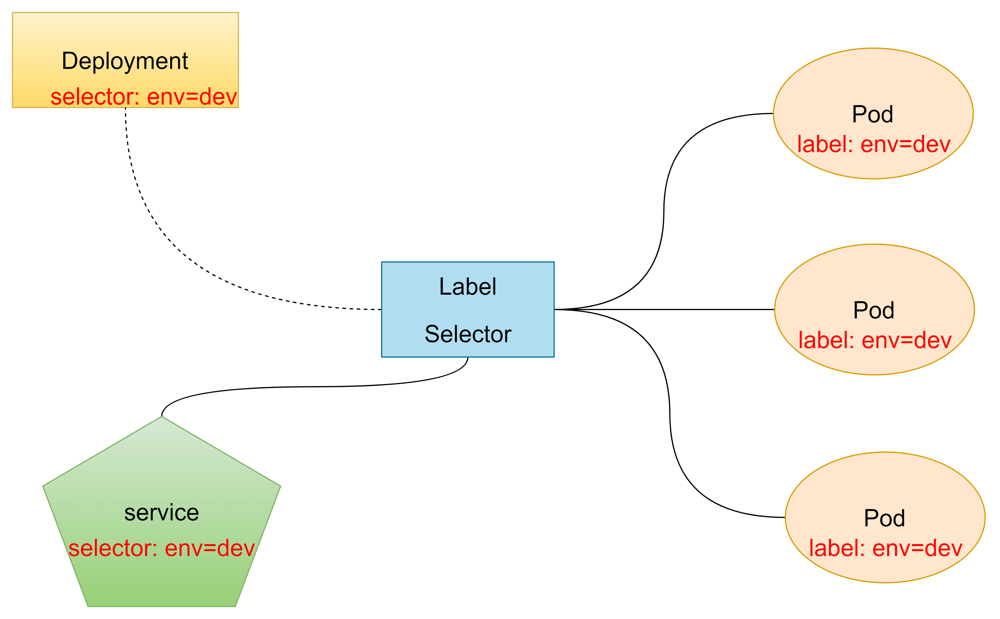

## 1. kube-proxy

service在很多情况下只是一个概念，真正起作用的其实是kube-proxy服务进程，每个node节点上都运行一个kube-proxy服务进程，当创建service的时候会通过api-server向etcd写入创建的service信息，而kube-proxy会基于监听的机制发现这种service的变动，然后**它会将最新的service信息转换成对应的访问规则**。

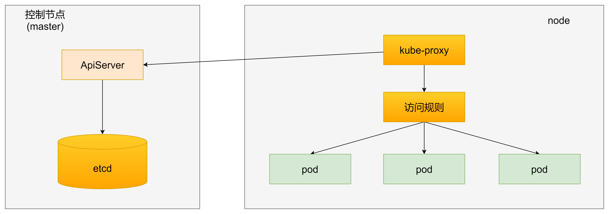

kube-proxy目前支持三种工作模式：

* userspace模式
* iptables模式
* ipvs模式

### 1.1 userspace模式

userspace模式下，kube-proxy为service后端的每个service创建一个监听端口，发向cluster ip的请求被iptables规则重定向到kube-proxy监听的端口上，kube-proxy根据LB算法选择一个提供服务的pod并和其建立连接，以将请求转发到pod上。

该模式下，kube-proxy充当了一个四层负载均衡器的角色，由于kube-proxy运行在userspace中，在进行转发处理时会增加内核和用户空间之间的数据拷贝，虽然比较稳定，但是效率比较低。

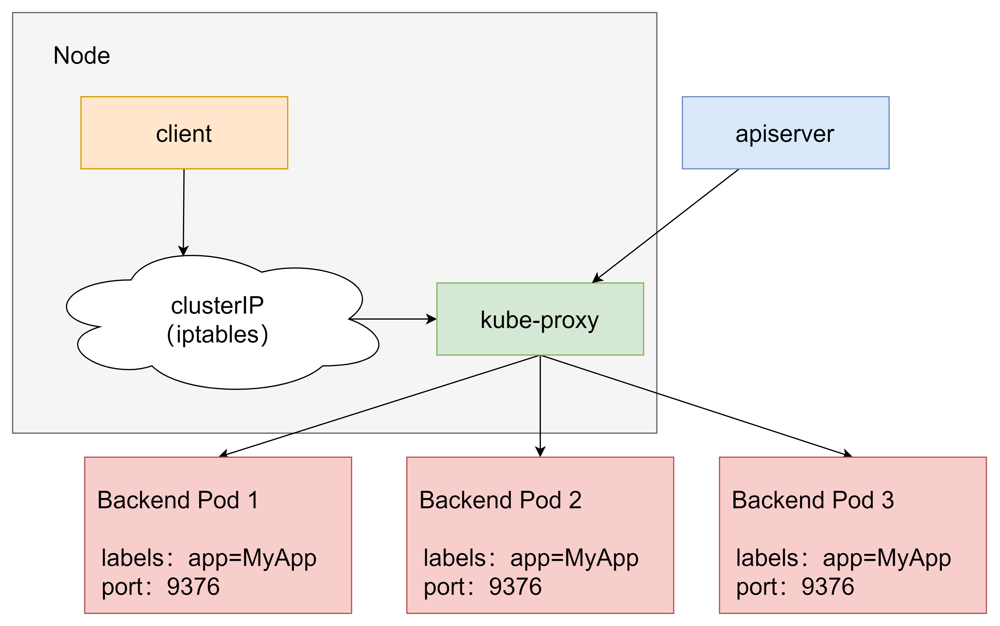

### 1.2 iptables模式

iptables模式下，kube-proxy为service后端的每个pod创建对应的iptables规则，直接将发向cluster ip的请求重定向到一个pod ip。

该模式下kube-proxy不承担四层负载均衡器的角色，只负责创建iptables规则。该模式的优点是较userspace模式效率更高，但不能提供灵活的LB策略，当后端pod不可用时也无法进行重试

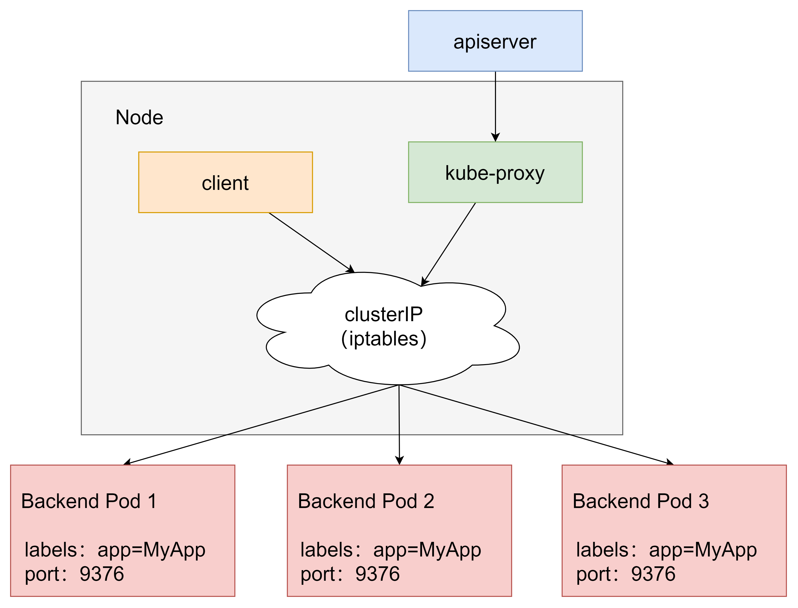

### 1.3 ipvs模式

ipvs模式和iptables类似，kube-proxy监控pod的变化并创建相应的ipvs规则，ipvs相对iptables转发效率更高。除此以外，ipvs支持更多的LB算法。

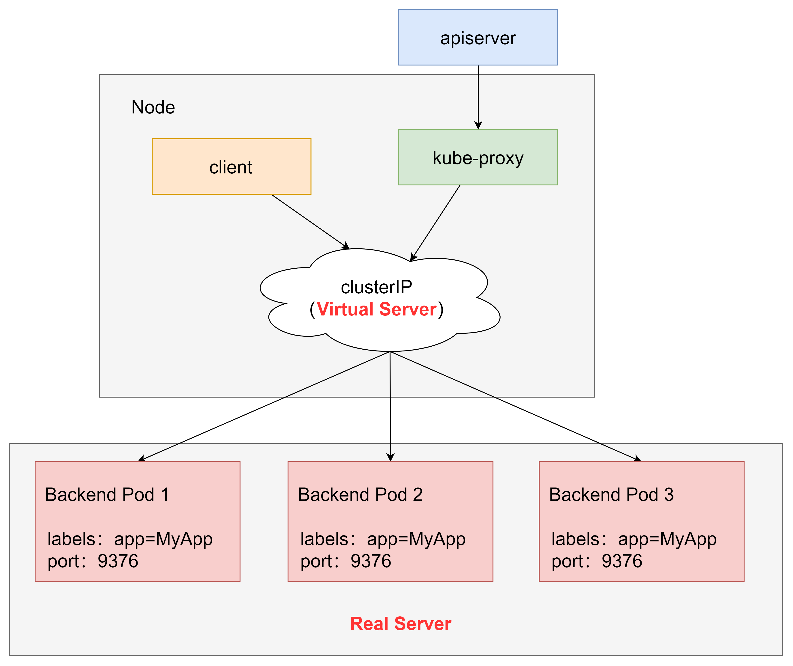

此模式必须安装ipvs内核模块，否则会降级为iptables。

* 安装ipset和ipvsadm

  ~~~shell
  [root@master ~]# yum install ipset ipvsadm -y
  ~~~

* 写入脚本文件

  ~~~shell
  [root@master ~]# cat <<EOF> /etc/sysconfig/modules/ipvs.modules
  > #!/bin/bash
  modprobe -- ip_vs
  modprobe -- ip_vs_rr
  modprobe -- ip_vs_wrr
  modprobe -- ip_vs_sh
  modprobe -- nf_conntrack_ipv4
  EOF
  ~~~

  

* 执行

  ~~~shell
  [root@master ~]# chmod +x /etc/sysconfig/modules/ipvs.modules 
  #执行脚本文件
  [root@master ~]# /bin/bash /etc/sysconfig/modules/ipvs.modules
  ~~~

  查看对应的模块是否加载成功

  ~~~shell
  [root@master ~]# lsmod |grep -e ip_vs -e nf_conntrack_ipv4
  ip_vs_sh               12688  0 
  ip_vs_wrr              12697  0 
  ip_vs_rr               12600  0 
  ip_vs                 145497  6 ip_vs_rr,ip_vs_sh,ip_vs_wrr
  nf_conntrack_ipv4      15053  15 
  nf_defrag_ipv4         12729  1 nf_conntrack_ipv4
  nf_conntrack          139264  10 ip_vs,nf_nat,nf_nat_ipv4,nf_nat_ipv6,xt_conntrack,nf_nat_masquerade_ipv4,nf_nat_masquerade_ipv6,nf_conntrack_netlink,nf_conntrack_ipv4,nf_conntrack_ipv6
  libcrc32c              12644  4 xfs,ip_vs,nf_nat,nf_conntrack
  
  ~~~

  重启系统。

* 开启ipvs

  ~~~shell
  [root@master ~]# kubectl edit cm kube-proxy -n kube-system
  ~~~

  将mode改为ipvs

  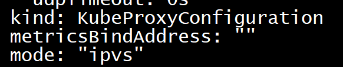

   删除kube-proxy的pod并重建

  ~~~shell
  [root@master ~]# kubectl delete pod -l k8s-app=kube-proxy -n kube-system
  pod "kube-proxy-lwls6" deleted
  pod "kube-proxy-scwzg" deleted
  pod "kube-proxy-sn9kc" deleted
  ~~~

  查看ipvs，发现产生了一批规则

  

  ~~~shell
  [root@master ~]# ipvsadm -Ln
  IP Virtual Server version 1.2.1 (size=4096)
  Prot LocalAddress:Port Scheduler Flags
    -> RemoteAddress:Port           Forward Weight ActiveConn InActConn
  TCP  172.17.0.1:30002 rr
    -> 10.244.1.95:80               Masq    1      0          0         
    -> 10.244.1.97:80               Masq    1      0          0         
    -> 10.244.2.41:80               Masq    1      0          0         
  TCP  172.17.0.1:32000 rr
    -> 10.244.0.15:8443             Masq    1      0          0         
  TCP  172.18.0.1:30002 rr
    -> 10.244.1.95:80               Masq    1      0          0         
    -> 10.244.1.97:80               Masq    1      0          0         
    -> 10.244.2.41:80               Masq    1      0          0         
  TCP  172.18.0.1:32000 rr
    -> 10.244.0.15:8443             Masq    1      0          0         
  TCP  172.19.0.1:30002 rr
    -> 10.244.1.95:80               Masq    1      0          0         
    -> 10.244.1.97:80               Masq    1      0          0         
    -> 10.244.2.41:80               Masq    1      0          0         
  TCP  172.19.0.1:32000 rr
    -> 10.244.0.15:8443             Masq    1      0          0         
  TCP  172.21.0.1:30002 rr
    -> 10.244.1.95:80               Masq    1      0          0         
    -> 10.244.1.97:80               Masq    1      0          0         
    -> 10.244.2.41:80               Masq    1      0          0         
  TCP  172.21.0.1:32000 rr
    -> 10.244.0.15:8443             Masq    1      0          0         
  TCP  172.22.0.1:30002 rr
    -> 10.244.1.95:80               Masq    1      0          0         
    -> 10.244.1.97:80               Masq    1      0          0         
    -> 10.244.2.41:80               Masq    1      0          0         
  TCP  172.22.0.1:32000 rr
    -> 10.244.0.15:8443             Masq    1      0          0         
  TCP  172.24.0.1:30002 rr
    -> 10.244.1.95:80               Masq    1      0          0         
    -> 10.244.1.97:80               Masq    1      0          0         
    -> 10.244.2.41:80               Masq    1      0          0         
  TCP  172.24.0.1:32000 rr
    -> 10.244.0.15:8443             Masq    1      0          0         
  TCP  172.25.0.1:30002 rr
    -> 10.244.1.95:80               Masq    1      0          0         
    -> 10.244.1.97:80               Masq    1      0          0         
    -> 10.244.2.41:80               Masq    1      0          0         
  TCP  172.25.0.1:32000 rr
    -> 10.244.0.15:8443             Masq    1      0          0         
  TCP  192.168.200.101:30002 rr
    -> 10.244.1.95:80               Masq    1      0          0         
    -> 10.244.1.97:80               Masq    1      0          0         
    -> 10.244.2.41:80               Masq    1      0          0         
  TCP  192.168.200.101:32000 rr
    -> 10.244.0.15:8443             Masq    1      0          0         
  TCP  10.96.0.1:443 rr
    -> 192.168.200.101:6443         Masq    1      0          0         
  TCP  10.96.0.10:53 rr
    -> 10.244.0.14:53               Masq    1      0          0         
    -> 10.244.0.16:53               Masq    1      0          0         
  TCP  10.96.0.10:9153 rr
    -> 10.244.0.14:9153             Masq    1      0          0         
    -> 10.244.0.16:9153             Masq    1      0          0         
  TCP  10.96.34.175:443 rr
    -> 10.244.0.15:8443             Masq    1      0          0         
  TCP  10.96.106.156:8000 rr
    -> 10.244.0.13:8000             Masq    1      0          0         
  TCP  10.96.127.29:443 rr
    -> 10.244.2.40:4443             Masq    1      0          0         
  TCP  10.96.253.220:80 rr
    -> 10.244.1.95:80               Masq    1      0          0         
    -> 10.244.1.97:80               Masq    1      0          0         
    -> 10.244.2.41:80               Masq    1      0          0         
  TCP  10.244.0.0:30002 rr
    -> 10.244.1.95:80               Masq    1      0          0         
    -> 10.244.1.97:80               Masq    1      0          0         
    -> 10.244.2.41:80               Masq    1      0          0         
  TCP  10.244.0.0:32000 rr
    -> 10.244.0.15:8443             Masq    1      0          0         
  TCP  10.244.0.1:30002 rr
    -> 10.244.1.95:80               Masq    1      0          0         
    -> 10.244.1.97:80               Masq    1      0          0         
    -> 10.244.2.41:80               Masq    1      0          0         
  TCP  10.244.0.1:32000 rr
    -> 10.244.0.15:8443             Masq    1      0          0         
  UDP  10.96.0.10:53 rr
    -> 10.244.0.14:53               Masq    1      0          0         
    -> 10.244.0.16:53               Masq    1      0          0   
  ~~~

  

## 2. 配置说明（资源文件清单）

~~~yaml
kind: Service  #资源类型
apiVersion: v1 #资源版本
metadata: 
  name: service
  namespace: dev
spec:
  selector:  #标签选择器，用于确定当前service代理哪些pod
    app: nginx
  type: #service类型，指定service的访问方式
  clusterIp: #虚拟服务的ip地址
  sessionAffinity: #session亲和性，支持ClientIp，None两个选项
  ports: #端口信息
    - protocol: TCP
      port: 3017  #service端口
      targetPort: 5003  #pod端口
      nodePort: 31122   #主机端口
~~~

Service类型

- ClusterIp：默认值，它是K8S系统自动分配的虚拟IP，只能在集群内部访问
- NodePort：将Service通过指定的Node上的端口暴露给外部，通过此方法，就可以在集群外部访问服务
- LoadBalancer：使用外接负载均衡器完成到服务的负载分发，注意此模式需要外部云环境支持
- ExternalName：把集群外部的服务引入到集群内部直接使用

## 3. 使用

利用deployment创建出3个pod，为pod设置app=nginx-pod的标签

创建deployment.yaml

~~~yaml
apiVersion: apps/v1
kind: Deployment
metadata: 
  name: pc-deployment
  namespace: dev
spec:
  replicas: 3
  selector:
    matchLabels:
      app: nginx-pod
  template:
    metadata: 
      labels:
        app: nginx-pod
    spec:
      containers:
      - name: nginx
        image: nginx:1.17.1
        ports: 
        - containerPort: 80
~~~

~~~shell
[root@master service]# kubectl create -f deployment.yaml 
deployment.apps/pc-deployment created
[root@master service]# kubectl get pod -n dev -o wide
NAME                             READY   STATUS    RESTARTS   AGE   IP             NODE    NOMINATED NODE   READINESS GATES
pc-deployment-6756f95949-rdpc5   1/1     Running   0          65s   10.244.2.45    node2   <none>           <none>
pc-deployment-6756f95949-sd724   1/1     Running   0          65s   10.244.1.120   node1   <none>           <none>
pc-deployment-6756f95949-xbk6d   1/1     Running   0          65s   10.244.1.121   node1   <none>           <none>
~~~

通过pod的Ip加上容器端口80访问nginx，验证是否可以访问

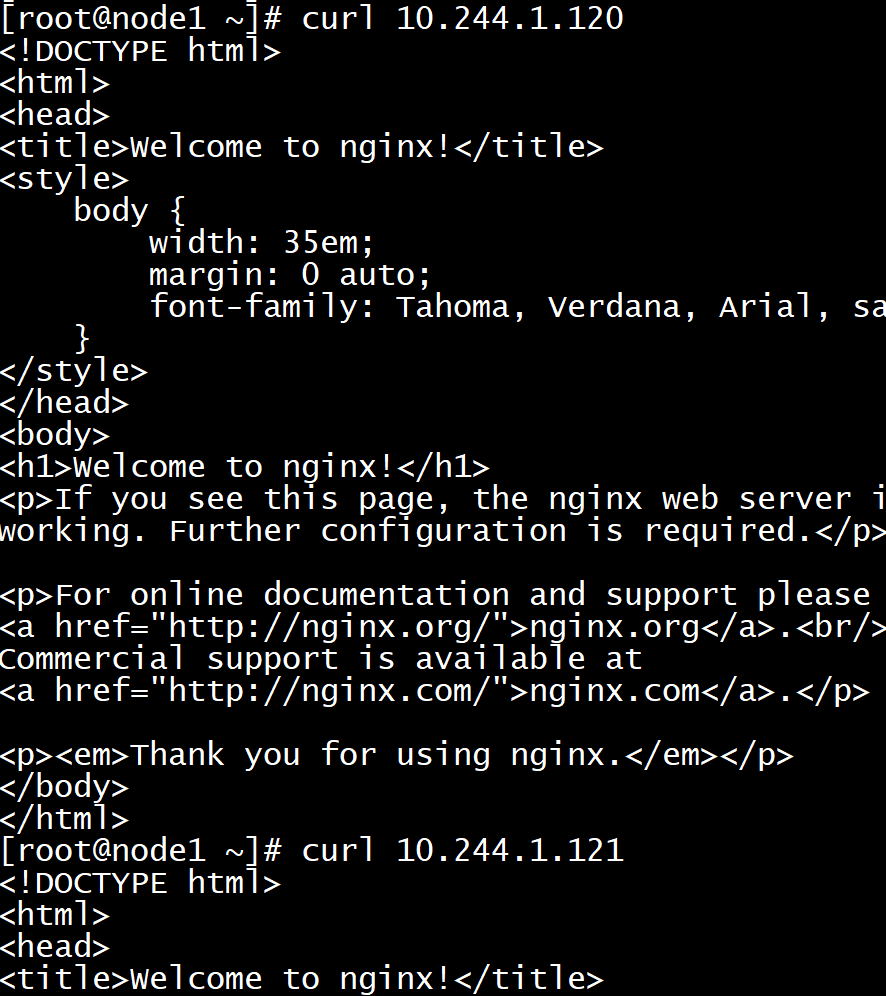

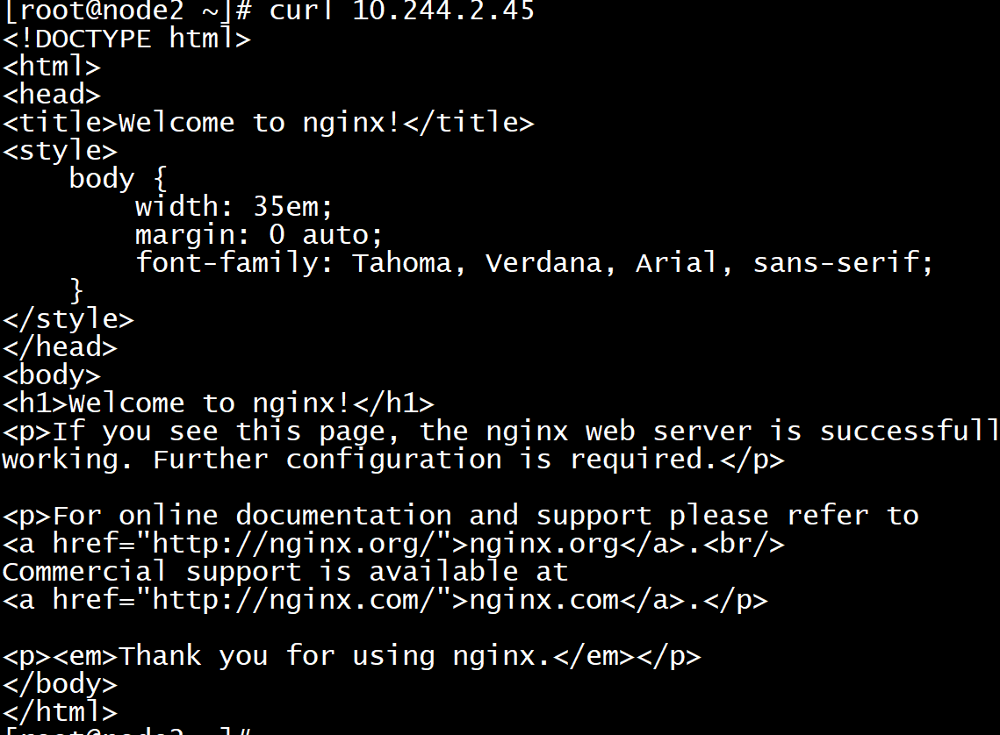

为了方便后面的测试，修改下面三台nginx的index.html页面（三台修改的Ip地址不一致）

~~~shell
#修改第一个pod
[root@master ~]# kubectl exec -it pc-deployment-6756f95949-sd724 -n dev -- /bin/sh
# echo "10.244.1.62" > /usr/share/nginx/html/index.html
# exit
#修改第二个pod
[root@master ~]# kubectl exec -it pc-deployment-6756f95949-xbk6d -n dev -- /bin/sh
# echo "10.244.2.32" > /usr/share/nginx/html/index.html
# exit
#修改第三个pod
[root@master ~]# kubectl exec -it pc-deployment-6756f95949-rdpc5 -n dev -- /bin/sh
# echo "10.244.1.61" > /usr/share/nginx/html/index.html
# exit
~~~

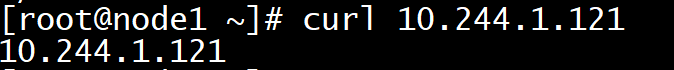

### 3.1 ClusterIp类型的Service

创建service-clusterip.yaml文件

~~~yaml
apiVersion: v1
kind: Service
metadata:
  name: service-clusterip
  namespace: dev
spec:
  selector:
    app: nginx-pod
  type: ClusterIP #clusterIP: 10.96.96.96  #service的Ip地址，如果不写，会默认生成一个
  ports:
  - port: 80  #service端口
    targetPort: 80  #pod端口
~~~

~~~shell
[root@master service]# kubectl create -f service-clusterip.yaml
service/service-clusterip created
[root@master service]# kubectl get svc service-clusterip -n dev
NAME                TYPE        CLUSTER-IP     EXTERNAL-IP   PORT(S)   AGE
service-clusterip   ClusterIP   10.96.66.152   <none>        80/TCP    8s
[root@master service]# kubectl describe svc service-clusterip -n dev
Name:              service-clusterip
Namespace:         dev
Labels:            <none>
Annotations:       <none>
Selector:          app=nginx-pod
Type:              ClusterIP
IP Family Policy:  SingleStack
IP Families:       IPv4
IP:                10.96.66.152
IPs:               10.96.66.152
Port:              <unset>  80/TCP
TargetPort:        80/TCP
Endpoints:         10.244.1.120:80,10.244.1.121:80,10.244.2.45:80
Session Affinity:  None
Events:            <none>
[root@master service]# ipvsadm -Ln
IP Virtual Server version 1.2.1 (size=4096)
Prot LocalAddress:Port Scheduler Flags
  -> RemoteAddress:Port           Forward Weight ActiveConn InActConn      
TCP  10.96.66.152:80 rr
  -> 10.244.1.120:80              Masq    1      0          0         
  -> 10.244.1.121:80              Masq    1      0          0         
  -> 10.244.2.45:80               Masq    1      0          0         
~~~

### 3.2 EndPoint

从上面的信息中我们看到有个字段叫`Endpoints`，`Endpoint`是Kubernetes中的一个资源对象，存储在etcd中，用来记录一个service对应的所有Pod的访问地址，它是根据service配置文件中的selector描述产生的。

一个service由一组Pod组成，这些Pod通过Endpoints暴露出来，Endpoints是`实现实际服务的端点集合`。换言之，service和Pod之间的联系是通过Endpoints实现的。

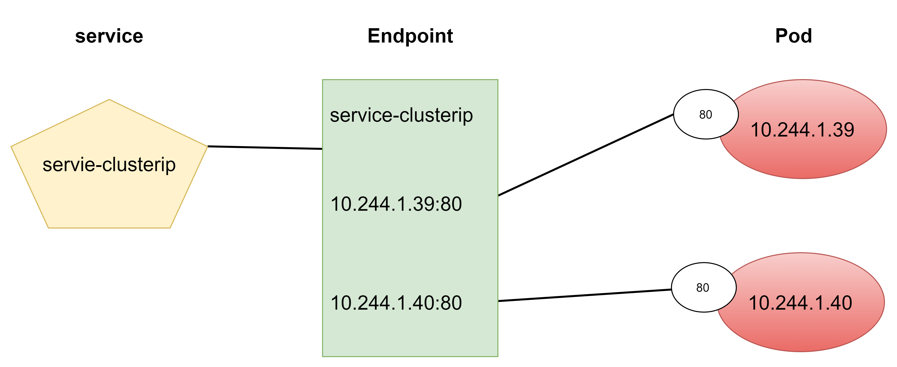

~~~shell
[root@master service]# kubectl get endpoints -n dev -o wide
NAME                ENDPOINTS                                        AGE
service-clusterip   10.244.1.120:80,10.244.1.121:80,10.244.2.45:80   5m7s
~~~

### 3.3 负载分发策略

对service的访问被分发到了后端的pod上去，目前k8s提供了两种负载分发策略：

- 如果不定义，默认使用kube-proxy的策略，比如随机，轮询
- 基于客户端地址的会话保持模式，即来自同一个客户端发起的所有请求都会转发到一个固定的pod上，此模式可以使在spec中添加sessionAffinity:ClientIP选项

~~~shell
#循环访问测试
[root@master service]# while true;do curl 10.96.66.152:80;sleep 5;done;
10.244.2.45
10.244.1.121
10.244.1.120
10.244.2.45
10.244.1.121
10.244.1.120
~~~

修改分发策略为sessionAffinity:ClientIP

~~~yaml
apiVersion: v1
kind: Service
metadata:
  name: service-clusterip
  namespace: dev
spec:
  sessionAffinity: ClientIP
  selector:
    app: nginx-pod
  clusterIP: 10.96.66.152  #service的Ip地址，如果不写，会默认生成一个
  type: ClusterIP
  ports:
  - port: 80  #service端口
    targetPort: 80  #pod端口
~~~

~~~shell
[root@master service]# kubectl delete -f service-clusterip.yaml           
service "service-clusterip" deleted
[root@master service]# vim service-clusterip.yaml 
apiVersion: v1
kind: Service
metadata:
  name: service-clusterip
  namespace: dev
spec:
  selector:
    app: nginx-pod
  type: ClusterIP
  ports:
  - port: 80  #service端口
apiVersion: v1
kind: Service
metadata:
  name: service-clusterip
  namespace: dev
spec:
  sessionAffinity: ClientIP
  selector:
    app: nginx-pod
  clusterIP: 10.96.66.152  #service的Ip地址，如果不写，会默认生成一个
  type: ClusterIP
  ports:
  - port: 80  #service端口
    targetPort: 80  #pod端口
                                                                                                                            
"service-clusterip.yaml" 14L, 320C 已写入                                                                        
[root@master service]# kubectl create -f service-clusterip.yaml
service/service-clusterip created
[root@master service]# kubectl describe svc service-clusterip -n dev
Name:              service-clusterip
Namespace:         dev
Labels:            <none>
Annotations:       <none>
Selector:          app=nginx-pod
Type:              ClusterIP
IP Family Policy:  SingleStack
IP Families:       IPv4
IP:                10.96.66.152
IPs:               10.96.66.152
Port:              <unset>  80/TCP
TargetPort:        80/TCP
Endpoints:         10.244.1.120:80,10.244.1.121:80,10.244.2.45:80
Session Affinity:  ClientIP
Events:            <none>
~~~

重新查看ipvs映射规则【persistent代表持久】，发现新增了persistent 10800秒，代表持续180分钟

~~~shell
[root@master service]# ipvsadm -Ln
TCP  10.96.66.152:80 rr persistent 10800
  -> 10.244.1.120:80              Masq    1      0          1         
  -> 10.244.1.121:80              Masq    1      0          1         
  -> 10.244.2.45:80               Masq    1      0          1    
~~~

再次进行循环访问测试，发现这次只访问一个pod

~~~shell
[root@master service]# while true;do curl 10.96.66.218:80;sleep 5;done;
10.244.2.45
10.244.2.45
10.244.2.45
10.244.2.45
~~~

### 3.4 HeadLiness类型的Service

在某些场景中，开发人员可能不想使用Service提供的负载均衡功能，而希望自己来控制负载均衡策略，针对这种情况，k8s提供了HeadLiness Service，这类Service不会分配ClusterIP，如果想要访问Service，只能通过service的域名进行查询。

创建service-headliness.yaml

~~~yaml
apiVersion: v1
kind: Service
metadata:
  name: service-headliness
  namespace: dev
spec:
  selector:
    app: nginx-pod
  clusterIP: None  #将clusterIP设置为None，即可创建headliness Service
  type: ClusterIP
  ports:
  - port: 80
    targetPort: 80
~~~

~~~shell
[root@master service]# kubectl create -f service-headliness.yaml
service/service-headliness created
[root@master service]# kubectl get svc service-headliness -n dev
NAME                 TYPE        CLUSTER-IP   EXTERNAL-IP   PORT(S)   AGE
service-headliness   ClusterIP   None         <none>        80/TCP    6s
[root@master service]# kubectl describe svc service-headliness -n dev
Name:              service-headliness
Namespace:         dev
Labels:            <none>
Annotations:       <none>
Selector:          app=nginx-pod
Type:              ClusterIP
IP Family Policy:  SingleStack
IP Families:       IPv4
IP:                None
IPs:               None
Port:              <unset>  80/TCP
TargetPort:        80/TCP
Endpoints:         10.244.1.120:80,10.244.1.121:80,10.244.2.45:80
Session Affinity:  None
Events:            <none>
~~~

查看域名解析情况

~~~shell
[root@master service]# kubectl exec -it pc-deployment-6756f95949-rdpc5 -n dev -- /bin/sh
# cat /etc/resolv.conf
nameserver 10.96.0.10
search dev.svc.cluster.local svc.cluster.local cluster.local
options ndots:5
# exit
#需要进入pod访问 但是pod内 无curl命令
#通过域名进行查询验证一下即可
[root@master ~]# yum -y install bind-utils
[root@master ~]# dig @10.96.0.10 service-headliness.dev.svc.cluster.local
; <<>> DiG 9.11.4-P2-RedHat-9.11.4-26.P2.el7_9.9 <<>> @10.96.0.10 service-headliness.dev.svc.cluster.local
; (1 server found)
;; global options: +cmd
;; Got answer:
;; WARNING: .local is reserved for Multicast DNS
;; You are currently testing what happens when an mDNS query is leaked to DNS
;; ->>HEADER<<- opcode: QUERY, status: NOERROR, id: 3116
;; flags: qr aa rd; QUERY: 1, ANSWER: 3, AUTHORITY: 0, ADDITIONAL: 1
;; WARNING: recursion requested but not available

;; OPT PSEUDOSECTION:
; EDNS: version: 0, flags:; udp: 4096
;; QUESTION SECTION:
;service-headliness.dev.svc.cluster.local. IN A

;; ANSWER SECTION:
service-headliness.dev.svc.cluster.local. 30 IN A 10.244.1.120
service-headliness.dev.svc.cluster.local. 30 IN A 10.244.2.45
service-headliness.dev.svc.cluster.local. 30 IN A 10.244.1.121

;; Query time: 9 msec
;; SERVER: 10.96.0.10#53(10.96.0.10)
;; WHEN: 日 8月 14 13:18:02 CST 2022
;; MSG SIZE  rcvd: 237

~~~

### 3.5 NodePort类型的Service

在前面的应用中，创建的Service的IP地址只有集群内部可以访问，如果希望Service暴露给集群外部使用，那么就要使用到另外一种类型的Service，称为NodePort类型。NodePort的工作原理其实就是**将service的端口映射到Node的一个端口上**，然后就可以通过NodeIp:NodePort来访问service了。

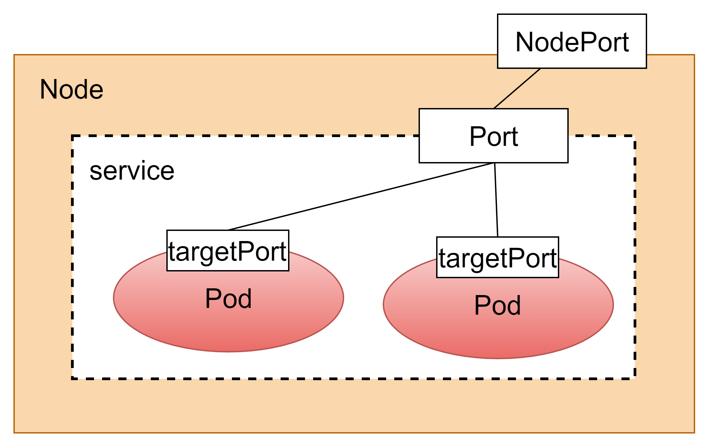

创建service-nodeport.yaml

~~~yaml
apiVersion: v1
kind: Service
metadata: 
  name: service-nodeport
  namespace: dev
spec:
  selector:
    app: nginx-pod
  type: NodePort  #service类型
  ports:
  - port: 80
    nodePort: 30003 #指定绑定的node的端口（默认的取值范围是：30000-32767），如果不指定，会默认分配
    targetPort: 80
~~~

~~~shell
[root@master service]# kubectl create -f service-nodeport.yaml    
service/service-nodeport created
[root@master service]# kubectl get svc service-nodeport -n dev
NAME               TYPE       CLUSTER-IP      EXTERNAL-IP   PORT(S)        AGE
service-nodeport   NodePort   10.96.114.171   <none>        80:30003/TCP   14s
~~~

### 3.6 LoadBalancer类型的Service

LoadBalancer和NodePort很相似，目的都是向外部暴露一个端口，区别在于LoadBalancer会在集群的外部再来做一个负载均衡设备，而这个设备需要外部环境支持的，外部服务发送到这个设备上的请求，会被设备负载之后转发到集群中。

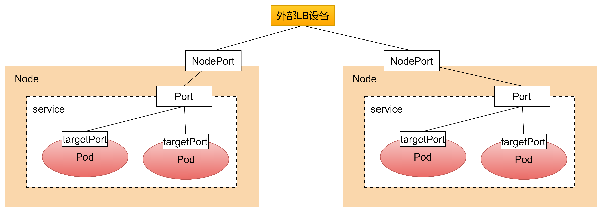

### 3.7 ExternalName类型的Service

ExternalName类型的Service用于引入集群外部的服务，它通过externalName属性指定外部一个服务的地址，然后在集群内部访问此Service就可以访问到外部的服务了

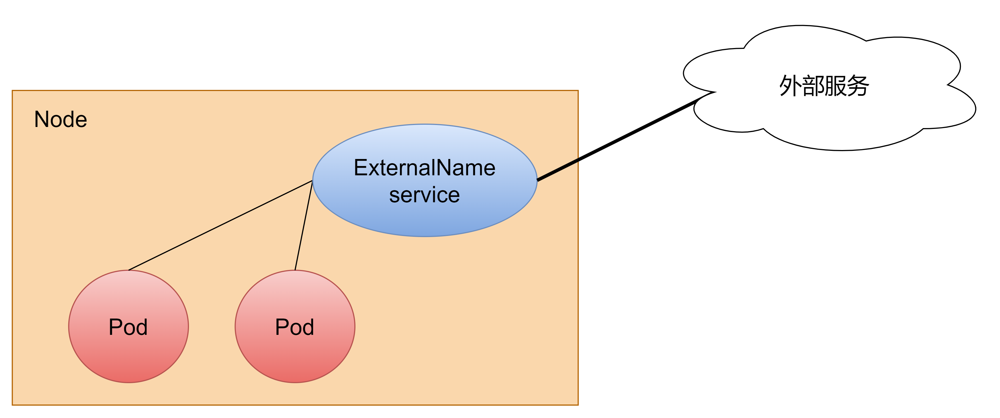

创建service-externalname.yaml

~~~yaml
apiVersion: v1
kind: Service
metadata:
  name: service-externalname
  namespace: dev
spec:
  type: ExternalName  #service类型
  externalName: www.baidu.com  #改成ip地址也可以
~~~

~~~shell
[root@master service]# kubectl create -f service-externalname.yaml 
service/service-externalname created
[root@master service]# kubectl get svc service-externalname -n dev
NAME                   TYPE           CLUSTER-IP   EXTERNAL-IP     PORT(S)   AGE
service-externalname   ExternalName   <none>       www.baidu.com   <none>    5s
[root@master service]# dig @10.96.0.10 service-externalname.dev.svc.cluster.local

; <<>> DiG 9.11.4-P2-RedHat-9.11.4-26.P2.el7_9.9 <<>> @10.96.0.10 service-externalname.dev.svc.cluster.local
; (1 server found)
;; global options: +cmd
;; Got answer:
;; WARNING: .local is reserved for Multicast DNS
;; You are currently testing what happens when an mDNS query is leaked to DNS
;; ->>HEADER<<- opcode: QUERY, status: NOERROR, id: 51694
;; flags: qr aa rd; QUERY: 1, ANSWER: 4, AUTHORITY: 0, ADDITIONAL: 1
;; WARNING: recursion requested but not available

;; OPT PSEUDOSECTION:
; EDNS: version: 0, flags:; udp: 4096
;; QUESTION SECTION:
;service-externalname.dev.svc.cluster.local. IN A

;; ANSWER SECTION:
service-externalname.dev.svc.cluster.local. 30 IN CNAME www.baidu.com.
www.baidu.com.          30      IN      CNAME   www.a.shifen.com.
www.a.shifen.com.       30      IN      A       14.215.177.39
www.a.shifen.com.       30      IN      A       14.215.177.38

;; Query time: 98 msec
;; SERVER: 10.96.0.10#53(10.96.0.10)
;; WHEN: 日 8月 14 21:52:44 CST 2022
;; MSG SIZE  rcvd: 247
~~~

## 4. Ingress

### 4.1 介绍

在前面的学习中已经知道，Service对集群之外暴露服务的主要方式有两种：NodePort和LoadBalancer，但是这两种方式，都有一定的缺点：

- NodePort方式的缺点是会占用很多集群机器的端口，那么当集群服务变多的时候，这个缺点就愈发明显
- LB方式的缺点是每个service需要一个LB，浪费、麻烦，并且需要k8s之外设备的支持

基于这种现状，k8s提供了Ingress资源对象。工作机制大致如下图所示：

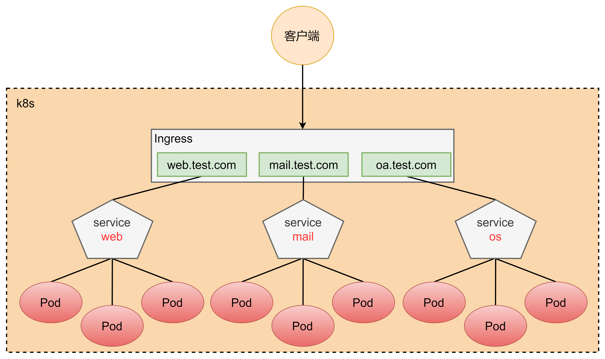

实际上，Ingress相当于一个7层的负载均衡器，是k8s对反向代理的一个抽象，它的工作原理类似于Nginx，可以理解成**在Ingress里建立诸多映射规则，Ingress Controller通过监听这些配置规则并转化成Nginx的配置，然后对外部提供服务**。在这里有两个核心概念：

- ingress：k8s中的一个对象，作用是定义请求如何转发到service的规则
- ingress controller：具体实现反向代理及负载均衡的程序，对ingress定义的规则进行解析，根据配置的规则来实现请求转发，实现方式有很多，比如nginx，contour，haproxy等等。

Ingress（以nginx为例）的工作原理如下：

1. 用户编写ingress规则，说明哪个域名对应k8s集群中的哪个service
2. ingress控制器动态感知ingress服务规则的变化，然后生成一段对应的nginx配置
3. ingress控制器会将生成的nginx配置写入到一个运行着的nginx服务中，并动态更新
4. 到此为止，其实真正在工作的就是一个nginx了，内部配置了用户定义的请求转发规则

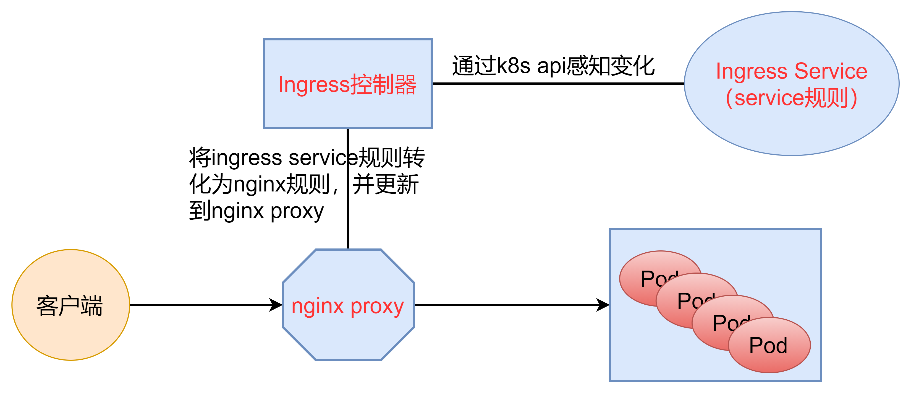

### 4.2 使用

#### 4.2.1 搭建ingress环境

~~~shell
kubectl apply -f https://raw.githubusercontent.com/kubernetes/ingress-nginx/controller-v1.3.0/deploy/static/provider/cloud/deploy.yaml
~~~

由于一些原因，镜像无法下载所以资料中准备好了修改过后的deploy.yaml

~~~shell
[root@master ingress-controller]# kubectl label nodes node1 hasIngress=true
[root@master ingress-controller]# kubectl label nodes node2 hasIngress=true
[root@master ingress-controller]# kubectl apply -f deploy.yaml
namespace/ingress-nginx created
serviceaccount/ingress-nginx created
serviceaccount/ingress-nginx-admission created
role.rbac.authorization.k8s.io/ingress-nginx created
role.rbac.authorization.k8s.io/ingress-nginx-admission created
clusterrole.rbac.authorization.k8s.io/ingress-nginx created
clusterrole.rbac.authorization.k8s.io/ingress-nginx-admission created
rolebinding.rbac.authorization.k8s.io/ingress-nginx created
rolebinding.rbac.authorization.k8s.io/ingress-nginx-admission created
clusterrolebinding.rbac.authorization.k8s.io/ingress-nginx created
clusterrolebinding.rbac.authorization.k8s.io/ingress-nginx-admission created
configmap/ingress-nginx-controller created
service/ingress-nginx-controller created
service/ingress-nginx-controller-admission created
daemonset.apps/ingress-nginx-controller created
job.batch/ingress-nginx-admission-create created
job.batch/ingress-nginx-admission-patch created
ingressclass.networking.k8s.io/nginx created
validatingwebhookconfiguration.admissionregistration.k8s.io/ingress-nginx-admission created
[root@master ingress-controller]# kubectl get pod -n ingress-nginx -o wide 
[root@master ingress-controller]# kubectl get pod -n ingress-nginx -o wide 
NAME                                   READY   STATUS      RESTARTS   AGE   IP                NODE    NOMINATED NODE   READINESS GATES
ingress-nginx-admission-create-vlr4h   0/1     Completed   0          24m   10.244.1.125      node1   <none>           <none>
ingress-nginx-admission-patch-vlx7d    0/1     Completed   1          24m   10.244.1.126      node1   <none>           <none>
ingress-nginx-controller-m5jld         1/1     Running     0          24m   192.168.200.102   node1   <none>           <none>
ingress-nginx-controller-t52dn         1/1     Running     0          24m   192.168.200.103   node2   <none>           <none>
[root@master ingress-controller]# kubectl get svc -n ingress-nginx
NAME                                 TYPE           CLUSTER-IP      EXTERNAL-IP   PORT(S)                      AGE
ingress-nginx-controller             LoadBalancer   10.96.49.11     <pending>     80:31915/TCP,443:30664/TCP   24m
ingress-nginx-controller-admission   ClusterIP      10.96.201.100   <none>        443/TCP                      24m
~~~

#### 4.2.2 准备service和pod

创建下图所示的模型

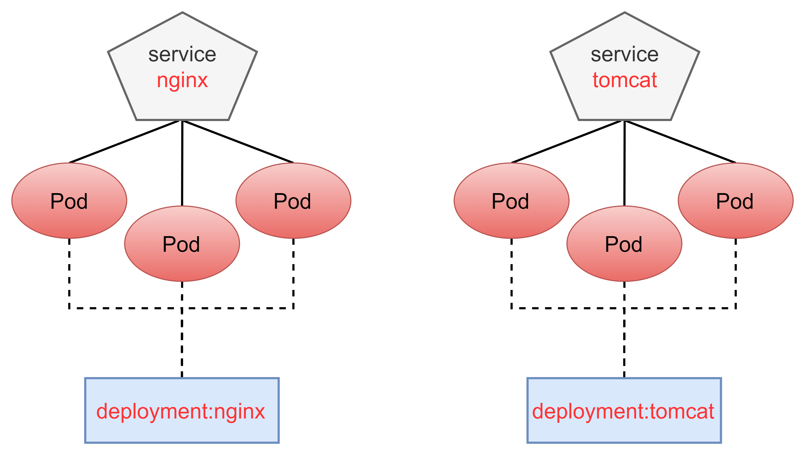

创建tomcat-nginx.yaml

~~~yaml
apiVersion: apps/v1
kind: Deployment
metadata: 
  name: nginx-deployment
  namespace: dev
spec:
  replicas: 3
  selector:
    matchLabels:
      app: nginx-pod
  template:
    metadata:
      labels:
        app: nginx-pod
    spec:
      containers:
      - name: nginx
        image: nginx:1.17.1
        ports: 
        - containerPort: 80

---

apiVersion: apps/v1
kind: Deployment
metadata: 
  name: tomcat-deployment
  namespace: dev
spec:
  replicas: 3
  selector:
    matchLabels:
      app: tomcat-pod
  template:
    metadata:
      labels:
        app: tomcat-pod
    spec:
      containers:
      - name: tomcat
        image: tomcat:8.5-jre10-slim
        ports: 
        - containerPort: 8080

---

apiVersion: v1
kind: Service
metadata: 
  name: nginx-service
  namespace: dev
spec:
  selector:
    app: nginx-pod
  clusterIP: None
  type: ClusterIP
  ports:
  - port: 80
    targetPort: 80

---

apiVersion: v1
kind: Service
metadata: 
  name: tomcat-service
  namespace: dev
spec:
  selector:
    app: tomcat-pod
  clusterIP: None
  type: ClusterIP
  ports:
  - port: 8080
    targetPort: 8080
~~~

~~~shell
[root@master service]# kubectl create -f tomcat-nginx.yaml 
deployment.apps/nginx-deployment created
deployment.apps/tomcat-deployment created
service/nginx-service created
service/tomcat-service created
[root@master service]# kubectl get svc -n dev
NAME             TYPE        CLUSTER-IP   EXTERNAL-IP   PORT(S)    AGE
nginx-service    ClusterIP   None         <none>        80/TCP     50s
tomcat-service   ClusterIP   None         <none>        8080/TCP   50s
~~~

#### 4.2.3 Http代理

创建ingress-http.yaml

~~~yaml
apiVersion: networking.k8s.io/v1
kind: Ingress
metadata:
  name: ingress-http
  namespace: dev
spec:
  ingressClassName: nginx
  rules:
  - host: nginx.test.com
    http:
      paths:
      - path: /
        pathType: Prefix
        backend:
          service:
            name: nginx-service
            port:
              number: 80
  - host: tomcat.test.com
    http:
      paths:
      - path: /
        pathType: Prefix
        backend:
          service:
            name: tomcat-service
            port:
              number: 8080

~~~

~~~shell
[root@master service]# kubectl create -f ingress-http.yaml 
ingress.networking.k8s.io/ingress-http created
[root@master service]# kubectl get ing ingress-http -n dev
NAME           CLASS   HOSTS                            ADDRESS   PORTS   AGE
ingress-http   nginx   nginx.test.com,tomcat.test.com             80      22s
[root@master service]# kubectl describe ing ingress-http -n dev
Name:             ingress-http
Labels:           <none>
Namespace:        dev
Address:          
Default backend:  default-http-backend:80 (<error: endpoints "default-http-backend" not found>)
Rules:
  Host             Path  Backends
  ----             ----  --------
  nginx.test.com   
                   /   nginx-service:80 (10.244.1.120:80,10.244.1.121:80,10.244.1.129:80 + 3 more...)
  tomcat.test.com  
                   /   tomcat-service:8080 (10.244.1.127:8080,10.244.1.128:8080,10.244.2.49:8080)
Annotations:       <none>
Events:
  Type    Reason  Age   From                      Message
  ----    ------  ----  ----                      -------
  Normal  Sync    29s   nginx-ingress-controller  Scheduled for sync
  Normal  Sync    29s   nginx-ingress-controller  Scheduled for sync
~~~

修改本机的hosts文件

~~~shell
node虚拟机的IP地址    nginx.test.com
node虚拟机的IP地址    tomcat.test.com
~~~

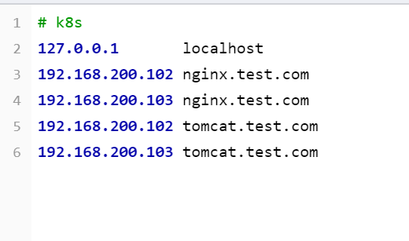

查看ingress为service提供的端口号

~~~shell
[root@master service]# kubectl get svc -n ingress-nginx
NAME                                 TYPE           CLUSTER-IP      EXTERNAL-IP   PORT(S)                      AGE
ingress-nginx-controller             LoadBalancer   10.96.49.11     <pending>     80:31915/TCP,443:30664/TCP   38m
ingress-nginx-controller-admission   ClusterIP      10.96.201.100   <none>        443/TCP                      38m
~~~

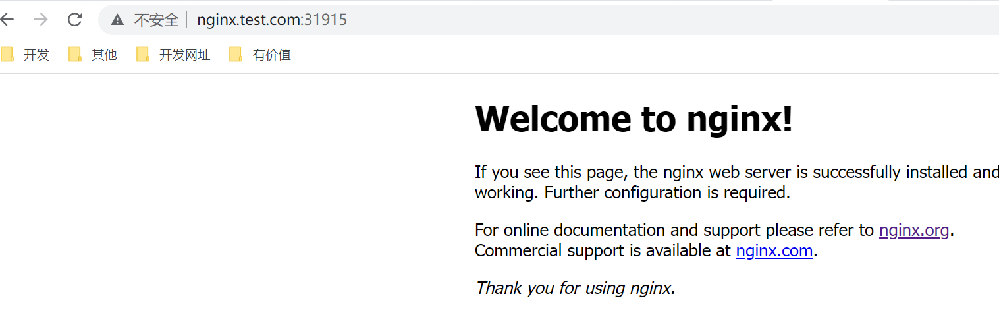

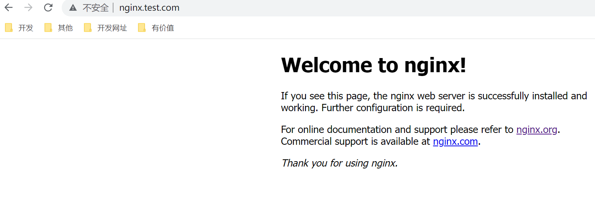

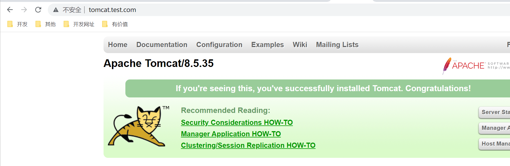

