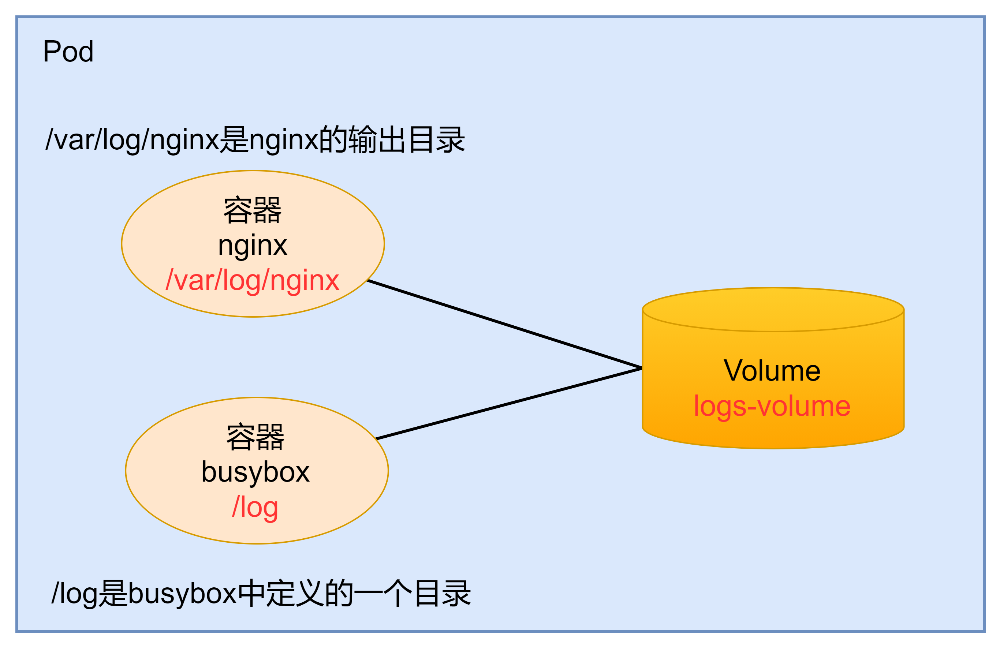
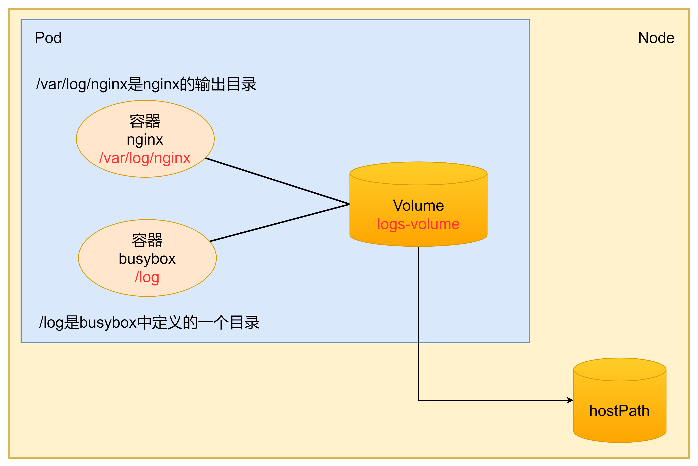
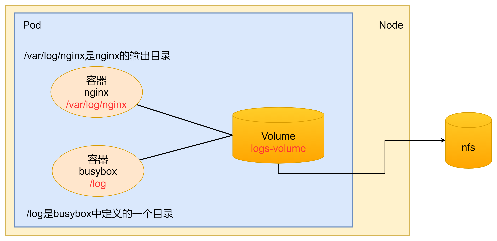
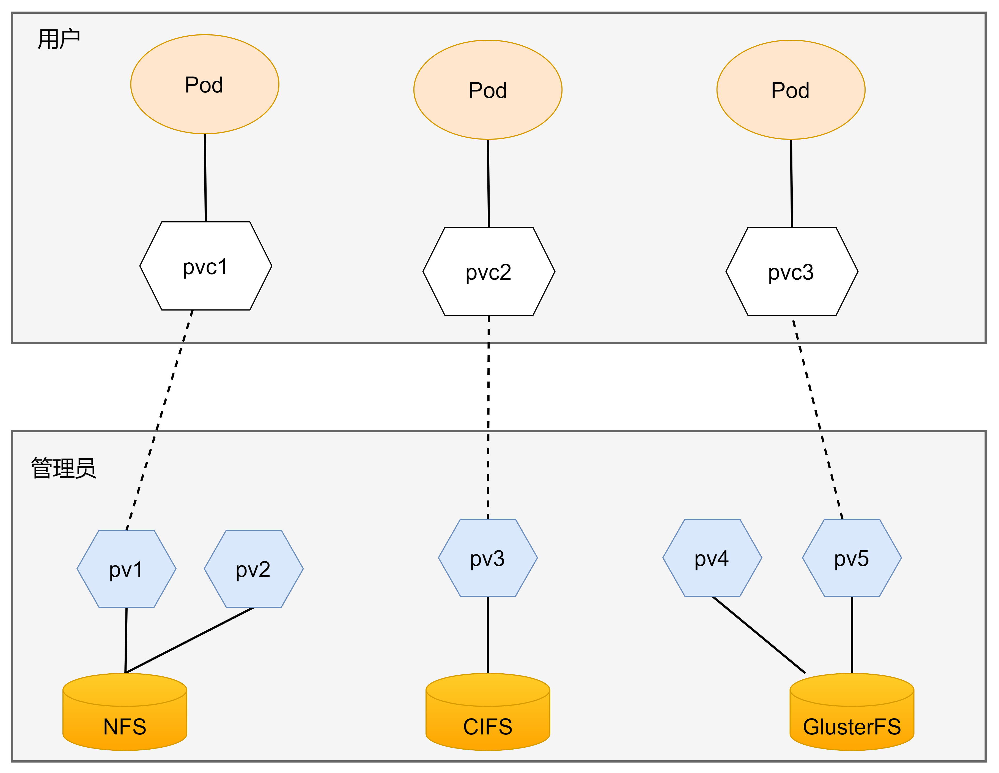
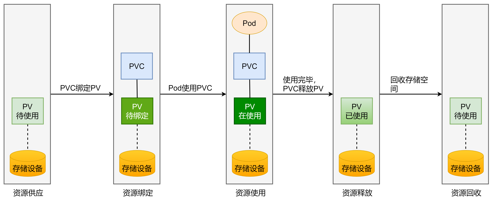

# 数据存储

通过前面的学习已经知道，容器的生命周期可能很短，会被频繁地创建和销毁，那么容器在销毁时，保存在容器中的数据也会被清除。这种结果对于用户来说，在某些情况下是不乐意看到的。为了持久化保存容器的数据，k8s引入了Volume的概念。

Volume是Pod中能够被多个容器访问的共享目录，它被定义在Pod上，然后被一个Pod里的多个容器挂载到具体的文件目录下，k8s通过Volume实现同一个Pod中不同容器之间的数据共享以及数据的持久化存储。

Volume的声明容器不与Pod中单个容器的生命周期相关，当容器终止或者重启时，Volume中的数据也不会丢失。

k8s中的Volume支持多种类型，比较常见的有下面几个：

- 基本存储：EmptyDir、HostPath、NFS
- 高级存储：PV、PC
- 配置存储：COnfigMap、Secret

## 1. 基本存储

### 1.1 EmptyDir

EmptyDir是最基础的Volume类型，一个EmptyDir就是Host上的一个空目录。

EmptyDir是在Pod被分配到Node时创建的，它的初始内容为空，并且无须指定宿主机上对应的目录文件，因为k8s会自动分配一个目录，当Pod销毁时，EmptyDir中的数据也会被永久删除。

EmptyDir用途如下：

- 临时空间，例如某些应用程序运行时所需的临时目录，且无须永久保留
- 一个容器需要从另一个容器中获取数据的目录（多容器共享目录）

**案例**

在一个Pod中准备两个容器nginx和busybox，然后声明一个Volume分别挂载到两个容器的目录中，然后nginx容器负责向Volume中写日志，busybox中通过命令将日志内容读到控制台

创建一个volume-emptydir.yaml

~~~yaml
apiVersion: v1
kind: Pod
metadata: 
  name: volume-emptydir
  namespace: dev
spec:
  containers:
  - name: nginx
    image: nginx:1.17.1
    ports:
    - containerPort: 80
    volumeMounts:  #将logs-volume挂载到nginx容器中，对应的目录为 /var/log/nginx
    - name: logs-volume
      mountPath: /var/log/nginx
  - name: busybox
    image: busybox:1.30
    command: ["/bin/sh","-c","tail -f /logs/access.log"] #初始命令，动态读取指定文件中内容
    volumeMounts: #将logs-volume挂载到busybox容器中，对应的目录为 /logs
    - name: logs-volume
      mountPath: /logs
  volumes: #声明volume，name为logs-volume，类型为emptyDir
  - name: logs-volume
    emptyDir: {}
~~~

~~~shell
[root@master volume]# kubectl create -f volume-emptydir.yaml
pod/volume-emptydir created
[root@master volume]# kubectl get pod volume-emptydir -n dev -o wide
NAME              READY   STATUS    RESTARTS   AGE   IP             NODE    NOMINATED NODE   READINESS GATES
volume-emptydir   2/2     Running   0          4s    10.244.1.130   node1   <none>           <none>
~~~

查看日志：

~~~shell
[root@master ~]# kubectl logs -f volume-emptydir -n dev -c busybox
10.244.1.1 - - [15/Aug/2022:03:44:36 +0000] "GET / HTTP/1.1" 200 612 "-" "curl/7.29.0" "-"
10.244.1.1 - - [15/Aug/2022:03:44:46 +0000] "GET / HTTP/1.1" 200 612 "-" "curl/7.29.0" "-"
10.244.1.1 - - [15/Aug/2022:03:44:54 +0000] "GET /hello HTTP/1.1" 404 153 "-" "curl/7.29.0" "-"
~~~

### 1.2 HostPath

由于EmptyDir中数据不会被持久化，它会随着Pod的结束而销毁，如果想简单地将数据持久化到主机中，可以选择HostPath。

HostPath就是将Node主机中一个实际目录挂载到Pod中，以供容器使用，这样的设计就可以保证Pod销毁了，但是数据依旧可以存在于Node主机上。

创建一个volume-hostpath.yaml

~~~yaml
apiVersion: v1
kind: Pod
metadata: 
  name: volume-hostpath
  namespace: dev
spec:
  containers:
  - name: nginx
    image: nginx:1.17.1
    ports:
    - containerPort: 80
    volumeMounts:  #将logs-volume挂载到nginx容器中，对应的目录为 /var/log/nginx
    - name: logs-volume
      mountPath: /var/log/nginx
  - name: busybox
    image: busybox:1.30
    command: ["/bin/sh","-c","tail -f /logs/access.log"] #初始命令，动态读取指定文件中内容
    volumeMounts: #将logs-volume挂载到busybox容器中，对应的目录为 /logs
    - name: logs-volume
      mountPath: /logs
  volumes:
  - name: logs-volume
    hostPath: 
      path: /root/logs
      type: DirectoryOrCreate  #目录存在就使用，不存在就先创建后使用
~~~

**关于type值的说明：**

* DirectoryOrCreate  目录存在就使用，不存在就先创建后使用  
* Directory  目录必须存在  
* FileOrCreate  文件存在就使用，不存在就先创建后使用  
* File 文件必须存在  
* Socket unix套接字必须存在  
* CharDevice  字符设备必须存在  
* BlockDevice  块设备必须存在

~~~shell
[root@master volume]# kubectl create -f volume-hostpath.yaml
pod/volume-hostpath created
[root@master volume]# kubectl get pods volume-hostpath -n dev -o wide
NAME              READY   STATUS    RESTARTS   AGE   IP             NODE    NOMINATED NODE   READINESS GATES
volume-hostpath   2/2     Running   0          4s    10.244.1.131   node1   <none>           <none>
~~~

pod被分配到了node1，那么node1上应该就会找到相应的目录

~~~shell
[root@node1 ~]# ll /root/logs/
总用量 0
-rw-r--r-- 1 root root 0 8月  15 11:47 access.log
-rw-r--r-- 1 root root 0 8月  15 11:47 error.log
~~~

访问nginx 查看日志变化

~~~shell
[root@node1 ~]# cd /root/logs/
[root@node1 logs]# tail -100f access.log 
10.244.1.1 - - [15/Aug/2022:03:50:55 +0000] "GET / HTTP/1.1" 200 612 "-" "curl/7.29.0" "-"

10.244.1.1 - - [15/Aug/2022:03:51:18 +0000] "GET /hello HTTP/1.1" 404 153 "-" "curl/7.29.0" "-"
~~~

删除pod，查看日志是否还会存在

~~~shell
[root@master volume]# kubectl delete -f volume-hostpath.yaml               
pod "volume-hostpath" deleted
[root@node1 logs]# cat access.log 
10.244.1.1 - - [15/Aug/2022:03:50:55 +0000] "GET / HTTP/1.1" 200 612 "-" "curl/7.29.0" "-"
10.244.1.1 - - [15/Aug/2022:03:51:18 +0000] "GET /hello HTTP/1.1" 404 153 "-" "curl/7.29.0" "-"
~~~

### 1.3 NFS

HostPath可以解决数据持久化的问题，但是一旦Node节点故障了，Pod如果转移到了别的节点，又会出现问题了，此时需要准备单独的网络存储系统，比较常用的有NFS、CIFS。

NFS是一个网络文件存储系统，可以搭建一台NFS服务器，然后将Pod中的存储直接连接到NFS系统上，这样的话，无论Pod在节点上怎么转移，只要Node跟NFS的对接没问题，数据就可以成功访问。

准备nfs的服务器，使用master节点做nfs服务器

~~~shell
#在master上安装nfs服务
[root@master ~]# yum install nfs-utils -y

#准备一个共享目录
[root@master volume]# mkdir /mnt/data/nfs -pv
mkdir: 已创建目录 "/mnt/data"
mkdir: 已创建目录 "/mnt/data/nfs"

#将共享目录以读写权限暴露给 你的虚拟机IP前9位.0/24网段中的所有主机（例如192.123.456.0/24）
[root@master ~]# vim /etc/exports
[root@master ~]# more /etc/exports
/mnt/data/nfs    你的虚拟机IP前9位.0/24(rw,no_root_squash)

#启动nfs服务
[root@master ~]# systemctl start nfs
~~~

在每个node节点上都安装nfs

~~~shell
[root@node1 logs]# yum install nfs-utils -y
[root@node2 logs]# yum install nfs-utils -y
~~~

创建volume-nfs.yaml

~~~yaml
apiVersion: v1
kind: Pod
metadata: 
  name: volume-nfs
  namespace: dev
spec:
  containers:
  - name: nginx
    image: nginx:1.17.1
    ports:
    - containerPort: 80
    volumeMounts:  #将logs-volume挂载到nginx容器中，对应的目录为 /var/log/nginx
    - name: logs-volume
      mountPath: /var/log/nginx
  - name: busybox
    image: busybox:1.30
    command: ["/bin/sh","-c","tail -f /logs/access.log"] #初始命令，动态读取指定文件中内容
    volumeMounts: #将logs-volume挂载到busybox容器中，对应的目录为 /logs
    - name: logs-volume
      mountPath: /logs
  volumes:
  - name: logs-volume
    nfs:
      server: 192.168.200.104  #nfs服务器地址（这里把虚拟机作为nfs服务器，所以填你master节点的IP地址）
      path: /mnt/data/nfs  #共享文件路径
~~~

~~~shell
[root@master volume]# kubectl create -f volume-nfs.yaml
pod/volume-nfs created
[root@master volume]# kubectl get pod volume-nfs -n dev -o wide
NAME         READY   STATUS    RESTARTS   AGE   IP             NODE    NOMINATED NODE   READINESS GATES
volume-nfs   2/2     Running   0          5s    10.244.1.132   node1   <none>           <none>
~~~

~~~shell
[root@master volume]# cd /mnt/data/
[root@master data]# ll
总用量 0
drwxr-xr-x 2 root root 41 8月  15 12:05 nfs
[root@master data]# cd nfs/
[root@master nfs]# ll
总用量 0
-rw-r--r-- 1 root root 0 8月  15 12:05 access.log
-rw-r--r-- 1 root root 0 8月  15 12:05 error.log
[root@master nfs]# 
[root@master nfs]# tail -100f access.log 
10.244.1.1 - - [15/Aug/2022:04:06:04 +0000] "GET /hello HTTP/1.1" 404 153 "-" "curl/7.29.0" "-"
10.244.1.1 - - [15/Aug/2022:04:06:06 +0000] "GET / HTTP/1.1" 200 612 "-" "curl/7.29.0" "-"
~~~

## 2. 高级存储

### 2.1 PV和PVC介绍

前面已经学习了使用NFS提供存储，此时就会要求用户会搭建NFS系统，并且会在yaml配置nfs，由于k8s支持的存储系统有很多，要求客户全部掌握，显然不现实。为了能够屏蔽底层存储实现的细节，方便用户使用，k8s引入PV和PVC两种资源对象。

* PV（Persistent Volume）是持久化卷的意思，是对底层的共享存储的一种抽象。一般情况下PV由k8s管理员进行创建和配置，它与底层具体的共享存储技术有关，并通过插件完成与共享存储的对接。

* PVC（Persistent Volume Claim）是持久卷声明的意思，是用户对于存储需求的一种声明。换句话说，PVC其实就是用户向k8s系统发出的一种资源需求申请。

### 2.2 PV

PV是存储资源的抽象，下面是资源清单文件

~~~yaml
apiVersion: v1
kind: PersistentVolume
metadata:
  name: pv2
spec:
  nfs: #存储类型，与底层真正存储对应
  capacity:  #存储能力，目前只支持存储空间的设置
    storage: 2Gi
accessModes: #访问模式
storageClassName:  #存储类别
persistentVolumeReclaimPolicy: #回收策略
~~~

PV的关键配置参数说明：

- 存储类型：底层实际存储的类型，k8s支持多种存储类型，每种存储类型的配置都有所差异
- 存储能力（capacity）：目前只支持存储空间的设置（storage=1Gi），不过未来可能会加入IOPS、吞吐量等指标的配置
- 访问模式（accessModes）：用于描述用户应用对存储资源的访问权限，访问权限包括下面几种方式：
  1. ReadWriteOnce（RWO）：读写权限，但是只能被单个节点挂载
  2. ReadOnlyMany（ROX）：只读权限，可以被多个节点挂载
  3. ReadWriteMany（RWX）：读写权限，可以被多个节点挂载

​     需要注意的是，底层不同的存储类型可能支持的访问模式不同

- 回收策略（persistentVolumeReclaimPolicy)：当PV不再被使用了之后，对其的处理方式。目前支持三种策略：
  1. Retain（保留）：保留数据，需要管理员手动清理数据
  2. Recycle（回收）：清除PV中的数据，效果相当于执行 rm -rf /thevolume/*
  3. Delete（删除）：与PV相连的后端存储完成volume的删除操作，当然这常见于云服务商的存储服务

​     需要注意的是，底层不同的存储类型可能支持的回收策略不同

- 存储类别：PV可以通过storageClassName参数指定一个存储类别
  1. 具有特定类别的PV只能与请求了该类别的PVC进行绑定
  2. 未设定类别的PV只能与不请求任何类别的PVC进行绑定

- 状态（status）：一个PV的生命周期中，可能会处于4种不同的阶段：
  1. Available（可用）：表示可用状态，还未被任何PVC绑定
  2. Bound（已绑定）：表示PV已经被PVC绑定
  3. Released（已释放）：表示PVC被删除，但是资源还未被集群重新声明
  4. Failed（失败）：表示该PV的自动回收失败

**案例**

使用NFS作为存储，创建3个PV，对应NFS中的3个暴露的路径

~~~shell
#创建目录
[root@master nfs]# mkdir /mnt/data/{pv1,pv2,pv3} -pv    
mkdir: 已创建目录 "/mnt/data/pv1"
mkdir: 已创建目录 "/mnt/data/pv2"
mkdir: 已创建目录 "/mnt/data/pv3""

#暴露服务
[root@master ~]# vim /etc/exports
[root@master ~]# more /etc/exports
/mnt/data/nfs     你master虚拟机的IP地址前9位.0/24(rw,no_root_squash)
/mnt/data/pv1     你master虚拟机的IP地址前9位.0/24(rw,no_root_squash)
/mnt/data/pv2     你master虚拟机的IP地址前9位.0/24(rw,no_root_squash)
/mnt/data/pv3     你master虚拟机的IP地址前9位.0/24(rw,no_root_squash)
#比如
[root@master data]#  vim /etc/exports
/mnt/data/nfs 192.168.200.0/24(rw,no_root_squash)
/mnt/data/pv1 192.168.200.0/24(rw,no_root_squash)
/mnt/data/pv2 192.168.200.0/24(rw,no_root_squash)
/mnt/data/pv3 192.168.200.0/24(rw,no_root_squash)
#重启服务
[root@master ~]# systemctl restart nfs
~~~

创建pv.yaml

~~~yaml
apiVersion: v1
kind: PersistentVolume
metadata:
  name: pv1
spec:
  capacity:  #存储能力，目前只支持存储空间的设置
    storage: 1Gi
  accessModes:
  - ReadWriteMany
  persistentVolumeReclaimPolicy: Retain
  nfs:
    path: /mnt/data/pv1
    server: 192.168.200.104

---

apiVersion: v1
kind: PersistentVolume
metadata:
  name: pv2
spec:
  capacity:  
    storage: 2Gi
  accessModes:
  - ReadWriteMany
  persistentVolumeReclaimPolicy: Retain
  nfs:
    path: /mnt/data/pv2
    server: 192.168.200.104

---

apiVersion: v1
kind: PersistentVolume
metadata:
  name: pv3
spec:
  capacity:  
    storage: 3Gi
  accessModes:
  - ReadWriteMany
  persistentVolumeReclaimPolicy: Retain
  nfs:
    path: /mnt/data/pv3
    server: 192.168.200.104
~~~

~~~shell
[root@master volume]# kubectl create -f pv.yaml 
persistentvolume/pv1 created
persistentvolume/pv2 created
persistentvolume/pv3 created
[root@master volume]# kubectl get pv -o wide
NAME   CAPACITY   ACCESS MODES   RECLAIM POLICY   STATUS      CLAIM   STORAGECLASS   REASON   AGE   VOLUMEMODE
pv1    1Gi        RWX            Retain           Available                                   5s    Filesystem
pv2    2Gi        RWX            Retain           Available                                   5s    Filesystem
pv3    3Gi        RWX            Retain           Available                                   5s    Filesystem
~~~

### 2.3 PVC

PVC是资源的申请，用来声明对存储空间、访问模式、存储类别需求信息。下面是资源清单文件

~~~yaml

apiVersion: v1
kind: PersistentVolumeClaim
metadata:
  name: pvc
  namespace: dev
spec:
  accessModes:  #访问模式
  selector: #采用标签对PV选择
  storageClassName: #存储类别
  resources:  #请求空间
    requests:
      storage: 5Gi
~~~

关键配置参数

- 访问模式（accessModes）：用于描述用户应用对存储资源的访问权限
- 选择条件（selector）：通过Label Selector的设置，可使PVC对于系统中已存在的PV进行筛选
- 存储类别（storageClassName）：PVC在定义时可以设定需要的后端存储的类别，只有设置了该class的pv才能被系统选出
- 资源请求（Resources）：描述对存储资源的请求

创建pvc.yaml，申请pv

~~~yaml
apiVersion: v1
kind: PersistentVolumeClaim
metadata:
  name: pvc1
  namespace: dev
spec:
  accessModes:  
  - ReadWriteMany
  resources:  #请求空间
    requests:
      storage: 1Gi

---

apiVersion: v1
kind: PersistentVolumeClaim
metadata:
  name: pvc2
  namespace: dev
spec:
  accessModes:  
  - ReadWriteMany
  resources:  #请求空间
    requests:
      storage: 1Gi

---

apiVersion: v1
kind: PersistentVolumeClaim
metadata:
  name: pvc3
  namespace: dev
spec:
  accessModes:  
  - ReadWriteMany
  resources:  #请求空间
    requests:
      storage: 5Gi
~~~

~~~shell
[root@master volume]# kubectl create -f pvc.yaml
persistentvolumeclaim/pvc1 created
persistentvolumeclaim/pvc2 created
persistentvolumeclaim/pvc3 created
[root@master volume]# kubectl get pvc -n dev
NAME   STATUS    VOLUME   CAPACITY   ACCESS MODES   STORAGECLASS   AGE
pvc1   Bound     pv1      1Gi        RWX                           5s
pvc2   Bound     pv2      2Gi        RWX                           5s
pvc3   Pending                                                     5s
[root@master volume]# kubectl get pv -o wide
NAME   CAPACITY   ACCESS MODES   RECLAIM POLICY   STATUS      CLAIM      STORAGECLASS   REASON   AGE     VOLUMEMODE
pv1    1Gi        RWX            Retain           Bound       dev/pvc1                           2m22s   Filesystem
pv2    2Gi        RWX            Retain           Bound       dev/pvc2                           2m22s   Filesystem
pv3    3Gi        RWX            Retain           Available                                      2m22s   Filesystem
~~~

创建pods.yaml，使用pv

~~~yaml
apiVersion: v1
kind: Pod
metadata: 
  name: pod1
  namespace: dev
spec:
  containers:
  - name: busybox
    image: busybox:1.30
    command: ["/bin/sh","-c","while true;do echo pod1 >> /root/out.txt;sleep 3; done;"] #初始命令，动态读取指定文件中内容
    volumeMounts: 
    - name: volume
      mountPath: /root/
  volumes:
  - name: volume
    persistentVolumeClaim:
      claimName: pvc1
      readOnly: false

---

apiVersion: v1
kind: Pod
metadata: 
  name: pod2
  namespace: dev
spec:
  containers:
  - name: busybox
    image: busybox:1.30
    command: ["/bin/sh","-c","while true;do echo pod2 >> /root/out.txt;sleep 3; done;"] #初始命令，动态读取指定文件中内容
    volumeMounts: 
    - name: volume
      mountPath: /root/
  volumes:
  - name: volume
    persistentVolumeClaim:
      claimName: pvc2
      readOnly: false
~~~

~~~shell
[root@master volume]# kubectl create -f pods.yaml 
pod/pod1 created
pod/pod2 created
[root@master volume]# kubectl get pod -n dev
NAME   READY   STATUS    RESTARTS   AGE
pod1   1/1     Running   0          5s
pod2   1/1     Running   0          5s
~~~

查看挂载状况

~~~shell
#查看pv1
[root@master ~]# ls /mnt/data/pv1
out.txt
[root@master ~]# tail -f /mnt/data/pv1/out.txt 
pod1
pod1
pod1
pod1
pod1
pod1

#查看pv2
[root@master ~]# ls /mnt/data/pv2
out.txt
[root@master ~]# tail -f /mnt/data/pv2/out.txt 
pod2
pod2
pod2
pod2
pod2
~~~

删除pv和pvc

~~~shell
root@master ~]# kubectl delete -f pods.yaml 
pod "pod1" deleted
pod "pod2" deleted
[root@master ~]# kubectl delete -f pvc.yaml 
persistentvolumeclaim "pvc1" deleted
persistentvolumeclaim "pvc2" deleted
persistentvolumeclaim "pvc3" deleted
~~~

查看pv状态，可以发现pv1和pv2已被释放

~~~shell
[root@master volume]# kubectl get pv
NAME   CAPACITY   ACCESS MODES   RECLAIM POLICY   STATUS      CLAIM      STORAGECLASS   REASON   AGE
pv1    1Gi        RWX            Retain           Released    dev/pvc1                           22m
pv2    2Gi        RWX            Retain           Released    dev/pvc2                           22m
pv3    3Gi        RWX            Retain           Available                                      22m
~~~

### 2.4 生命周期

PVC和PV是一一对应的，PV和PVC之间的相互作用遵循以下生命周期：

- 资源供应：管理员手动创建底层存储和PV
- 资源绑定：用户创建PVC，k8s负责根据PVC的声明去寻找PV，并绑定

　　在用户定义好PVC之后，系统将根据PVC对存储资源的请求在已存在的PV中选择一个满足条件的

1. 一旦找到，就将该PV与用户定义的PVC进行绑定，用户的应用就可以使用这个PVC了
2. 如果找不到，PVC则会无限处于Pending状态，直到等到系统管理员创建了一个符合其要求的PV

　　PV一旦绑定到某个PVC上，就会被这个PVC独占，不能再与其他PVC进行绑定了

- 资源使用：用户可在pod中像volume一样使用pvc

　　Pod使用volume的定义，将pvc挂载到容器内的某个路径进行使用

- 资源释放：用户删除pvc来释放pv

　　当存储资源使用完毕之后，用户可以删除pvc，与该pvc绑定的pv将会被标记为“已释放”，但还不能立刻与其他PVC进行绑定。通过之前PVC写入的数据可能还被留在存储设备上，只有在清除之后该PV才　　　　能再次使用

- 资源回收：k8s根据pv设置的回收策略进行资源的回收

　　对于pv，管理员可以设定回收策略，用于设置与之绑定的pvc释放资源之后如何处理遗留数据的问题。只有PV的存储空间完成回收，才能供新的PVC绑定和使用

## 3. 配置存储

### 3.1 ConfigMap

configmap是一种比较特殊的存储卷，它的主要作用是用来存储配置信息的

创建configmap.yaml

~~~yaml
apiVersion: v1
kind: ConfigMap
metadata:
  name: configmap
  namespace: dev
data:
  info:
    username:admin
    password:123456
~~~

使用此配置文件创建configmap

~~~shell
[root@master volume]# kubectl create -f configmap.yaml
configmap/configmap created
[root@master volume]# kubectl describe cm configmap -n dev
Name:         configmap
Namespace:    dev
Labels:       <none>
Annotations:  <none>

Data
====
info:
----
username:admin password:123456

BinaryData
====

Events:  <none>
~~~

创建一个pod-configmap.yaml，将上面创建的configmap挂载进去

~~~yaml
apiVersion: v1
kind: Pod
metadata:
  name: pod-configmap
  namespace: dev
spec:
  containers:
  - name: nginx
    image: nginx:1.17.1
    volumeMounts: 
    - name: config
      mountPath: /configmap/config
  volumes:
  - name: config
    configMap: 
      name: configmap
~~~

~~~shell
[root@master volume]# kubectl create -f pod-configmap.yaml 
pod/pod-configmap created
[root@master volume]# kubectl get pod pod-configmap -n dev
NAME            READY   STATUS    RESTARTS   AGE
pod-configmap   1/1     Running   0          5s
~~~

进入容器，可以看见映射已经成功，每个configmap都映射成了一个目录

~~~shell
[root@master volume]# kubectl exec -it pod-configmap -n dev -- /bin/sh
# cd /configmap/config
# ls
info
# more info
username:admin password:123456
~~~

编辑configmap，将password改为123456789

~~~yaml
[root@master volume]# kubectl edit cm configmap -n dev
~~~

再次查看info文件

~~~shell
# more info
username:admin password:123456789
~~~

### 3.2 Secret

在k8s中，还存在一种和ConfigMap非常类似的对象，称为Secret对象。它主要用于存储敏感信息，例如密码，密钥，证书等等。

首先使用base64对数据进行编码

~~~shell
[root@master ~]# echo -n 'admin' | base64
YWRtaW4=
[root@master ~]# echo -n '123456' | base64
MTIzNDU2
~~~

编写secret.yaml，并创建secret

~~~yaml
apiVersion: v1
kind: Secret
metadata:
  name: secret
  namespace: dev
type: Opaque
data: 
  username: YWRtaW4=
  password: MTIzNDU2
~~~

~~~shell
[root@master volume]# kubectl create -f secret.yaml
secret/secret created
[root@master volume]# kubectl describe secret/secret -n dev
Name:         secret
Namespace:    dev
Labels:       <none>
Annotations:  <none>

Type:  Opaque

Data
====
password:  6 bytes
username:  5 bytes
~~~

创建pod-secret.yaml，将上面的secret挂载进去

~~~yaml
apiVersion: v1
kind: Pod
metadata:
  name: pod-secret
  namespace: dev
spec:
  containers:
  - name: nginx
    image: nginx:1.17.1
    volumeMounts: 
    - name: config
      mountPath: /secret/config
  volumes:
  - name: config
    secret: 
      secretName: secret
~~~

~~~shell
[root@master volume]# kubectl create -f pod-secret.yaml
pod/pod-secret created
[root@master volume]# kubectl exec -it pod-secret -n dev -- /bin/sh
# cd /secret/config
# ls 
password  username
# more username
admin
# more password
123456
~~~

利用secret实现信息的编码