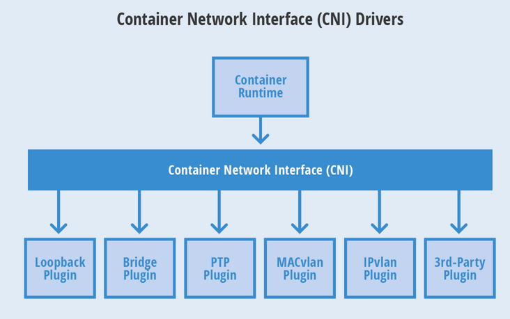
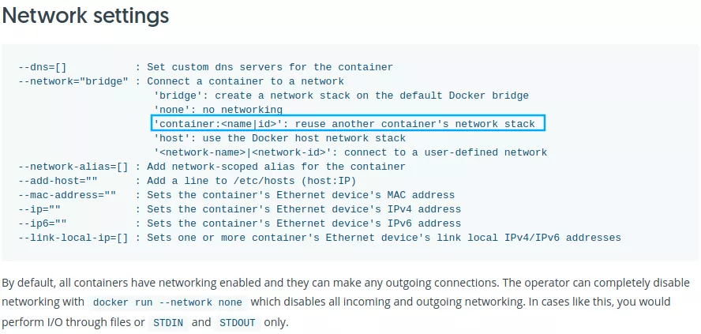

# 网络

容器网络发展到现在，形成了两大阵营，就是 Docker 的 CNM 和 Google、CoreOS、Kuberenetes 主导的 CNI。首先明确一点，CNM 和 CNI 并不是网络实现，他们是网络规范和网络体系，从研发的角度他们就是一堆接口，你底层是用 Flannel 也好、用 Calico 也好，他们并不关心，CNM 和 CNI 关心的是网络管理的问题。

- CNM（Container Network Model）: Docker Libnetwork 的优势就是原生，而且和 Docker 容器生命周期结合紧密；缺点也可以理解为是原生，被 Docker 绑架。支持 CNM 的网络模型包括了 Docker Swarm overlay, Macvlan & IP networkdrivers, Calico, Contiv, Weave.
- CNI 的优势是兼容其他容器技术（e.g. rkt）及上层编排系统（Kubernetes & Mesos)，而且社区活跃势头迅猛，Kubernetes 加上 CoreOS 主推；缺点是非 Docker 原生。支持 CNI 的网络模型包括了 Kubernetes, Weave, Macvlan, Calico, Flannel, Contiv, Mesos CNI.



CNI 的规范比较小巧。它规定了一个容器runtime和网络插件之间的简单的契约。这个契约通过JSON的语法定义了CNI插件所需要提供的输入和输出。一个容器可以被加入到被不同插件所驱动的多个网络之中。一个网络有自己对应的插件和唯一的名称。CNI 插件需要提供两个命令：一个用来将网络接口加入到指定网络，另一个用来将其移除。这两个接口分别在容器被创建和销毁的时候被调用。

容器runtime首先需要分配一个网络命名空间以及一个容器ID。然后连同一些CNI配置参数传给网络驱动。接着网络驱动会将该容器连接到网络并将分配的IP地址以JSON的格式返回给容器runtime。

## 1. 网络解决方案

### 1.1 隧道方案（Overlay Networking）

隧道模式分为两个过程：分配网段和封包/解包两个过程。

分配网络：宿主机利用etcd（etcd中维护ip）会为当前主机上运行的容器分配一个虚拟ip，并且宿主机上运行一个代理网络进程agent，代理出入的数据包。

封包/解包：宿主上的agent进程会改变容器的发出的数据包的源ip和目的ip，目的宿主机上的agent收到数据包进行拆包然后送到目的容器。

- Weave：UDP 广播，本机建立新的 BR，通过 PCAP 互通
- Open vSwitch（OVS）：基于 VxLan 和 GRE 协议，但是性能方面损失比较严重
- Flannel：Flannel 主要提供了 Overlay 的网络方案，UDP 模式由于其封包拆包的过程涉及了多次上下文的切换，导致性能很差，逐渐被社区抛弃；VXLAN 模式的封包拆包过程均在内核态，性能要比 UDP 好很多，也是最经常使用的模式；host-gw 模式不涉及封包拆包，所以性能相对较高，但要求节点间二层互通。
- Racher：IPsec

### 1.2 路由方案

整个路由过程分为分配网段、广播路由两个阶段。

分配网段： 类似隧道模式，每台宿主上的agent会从etcd中为每个容器分配一个虚ip。

广播路由：agent会在宿主机上增加一套路由规则，凡是目的地址是该容器的ip的就发往容器的虚拟网卡上，同时会通过BGP广播协议将自己的虚拟ip发往集群中其他node节点，其他的node节点收到广播同样在本机创建一条路由规则：该虚拟ip的数据包发至他的宿主机ip上。

- Calico：Calico 主要采用了 BGP 协议交换路由，没有采用 cni0 网桥，当二层网络不通的时候，可以采用 IPIP 模式，但由于涉及到封包拆包的过程，性能相对较弱，与 Flannel 的 VXLAN 模式相当。Calico 支持很细致的 ACL 控制，对混合云亲和度比较高。
- Macvlan：从逻辑和 Kernel 层来看隔离性和性能最优的方案，基于二层隔离，所以需要二层路由器支持，大多数云服务商不支持，所以混合云上比较难以实现。


> 由于隧道模式存在封包和拆包的过程而路由模式没有，所以路由模式性能高于隧道模式。
>
> 路由模式会因为路由表膨胀性能下降。

### 1.3 k8s Pod网络创建流程

1. 每个Pod除了创建时指定的容器外，都有一个kubelet启动时指定的基础容器

2. kubelet创建基础容器，生成network namespace

3. kubelet调用网络CNI driver，由它根据配置调用具体的CNI 插件

4. CNI 插件给基础容器配置网络

5. Pod 中其他的容器共享使用基础容器的网络

## 2. Pod内部网络

一个 Pod 中可以包含多个容器，而一个 Pod 只有一个 IP 地址。那么多个容器之间互相访问和访问外网是如何使用这一个 IP 地址呢？
答案是：多个容器共享同一个底层的网络命名空间 Net（网络设备、网络栈、端口等）。

创建一个 Pod 包含两个容器，pod-two-container.yaml 文件如下：

~~~yaml
apiVersion: apps/v1
kind: Deployment
metadata:
  name: pod-two-container
  namespace: dev
spec:
  replicas: 1
  selector:
    matchLabels:
     app: nginx
  template:
    metadata:
      labels:
        app: nginx
    spec:
      containers:
      - name: busybox
        image: busybox
        command:
        - "/bin/sh"
        - "-c"
        - "while true;do echo hello;sleep 1;done"
      - name: nginx
        image: nginx

~~~

~~~shell
[root@master net]# kubectl create -f pod-two-container.yaml 
deployment.apps/pod-two-container created
[root@master net]# kubectl get pods -n dev -o wide
NAME                                 READY   STATUS    RESTARTS   AGE     IP            NODE    NOMINATED NODE   READINESS GATES
pod-two-container-587c7b7696-hn9zt   2/2     Running   0          4m36s   10.244.2.52   node2   <none>           <none>
~~~

创建 1 个 Pod 中包含 2 个 Container，实际会创建 3 个 Container。多出的一个是“Pause”容器。

该 Container 是 Pod 的基础容器，为其他容器提供网络功能。

~~~shell
[root@node2 ~]# docker ps |grep pod-two
b4d1285f6084   nginx                                               "/docker-entrypoint.…"   4 minutes ago   Up 4 minutes             k8s_nginx_pod-two-container-587c7b7696-hn9zt_dev_9c88e5df-e4e4-4788-aa07-9c38690674b2_0
1d4fc26fd3ef   busybox                                             "/bin/sh -c 'while t…"   4 minutes ago   Up 4 minutes             k8s_busybox_pod-two-container-587c7b7696-hn9zt_dev_9c88e5df-e4e4-4788-aa07-9c38690674b2_0
300151f64387   registry.aliyuncs.com/google_containers/pause:3.6   "/pause"                 5 minutes ago   Up 5 minutes             k8s_POD_pod-two-container-587c7b7696-hn9zt_dev_9c88e5df-e4e4-4788-aa07-9c38690674b2_0
~~~

查看 Pause 容器的基础信息：

17b1f574d524d5c2ddcc2ca3a98cdf124de59fbbf21668865e7356c4e609c8b4

~~~shell
[root@node2 ~]# docker inspect 300151f64387
[
    {
        "Id": "300151f643875bd89df937ddd380584ebf3cf677a544295fe9d6fe0b3ee2dcbc",
~~~

 查看 Nginx 详细信息，其网络命名空间使用了 Pause 容器的命名空间，同样还有进程间通信的命名空间:

~~~shell
[root@node2 ~]# docker inspect b4d1285f6084
 "NetworkMode": "container:300151f643875bd89df937ddd380584ebf3cf677a544295fe9d6fe0b3ee2dcbc",
  "IpcMode": "container:300151f643875bd89df937ddd380584ebf3cf677a544295fe9d6fe0b3ee2dcbc",
~~~

查看 Busybox，也是一样

~~~shell
[root@node2 ~]# docker inspect 1d4fc26fd3ef
 "NetworkMode": "container:300151f643875bd89df937ddd380584ebf3cf677a544295fe9d6fe0b3ee2dcbc",
  "IpcMode": "container:300151f643875bd89df937ddd380584ebf3cf677a544295fe9d6fe0b3ee2dcbc",
~~~

实现方式：Nginx 和 Busybox 之所以能够和 Pause 的命名空间连通是因为 Docker 有一个特性：能够在创建时使用指定 Docker 的网络命名空间。



## 3. Flannel

Docker 的网络模式可以解决一个节点上的容器之间的网络通信问题，但是对于跨主机的容器之间的通信就无能为力了，就需要借助第三方的工具来实现容器的跨主机通信。为解决容器跨主机通信问题，社区出现了很多种网络解决方案。

`Flannel` 是 CoreOS（Etcd 的公司）推出的一个 Overlay 类型的容器网络插件，目前支持三种后端实现：`UDP`、`VXLAN`、`host-gw` 三种方式。UDP 是最开始支持的最简单的但是却是性能最差的一种方式，已经被弃用

`Flannel`的功能是让集群中的不同节点主机创建的Docker容器都具有全集群唯一的虚拟IP地址。


### 3.1 VXLAN 方式

`VXLAN`，即 Virtual Extensible LAN（虚拟可扩展局域网），是 Linux 内核本身就支持的一种网络虚似化技术。所以说，VXLAN 可以完全在内核态实现封装和解封装的工作,性能高很多。flannel默认就是使用的VXLAN方式。

当我们使用 `VXLAN` 模式的时候需要将 Flanneld 的 Backend 类型修改为 `vxlan`：

~~~shell
[root@master k8s]# kubectl edit cm kube-flannel-cfg -n kube-flannel
net-conf.json: |
    {
      "Network": "10.244.0.0/16",
      "Backend": {
        "Type": "vxlan" #默认的 不用改
      }
    }
~~~

重建下 Flanneld 的所有 Pod 

~~~shell
#也可以不重建 默认就是vxlan模式，如果不是改了之后需要重建
kubectl delete pod -n kube-flannel -l app=flannel
~~~

~~~shell
[root@master k8s]# kubectl get pods -n kube-flannel                
NAME                    READY   STATUS    RESTARTS        AGE
kube-flannel-ds-c6czj   1/1     Running   4 (8m10s ago)   9m2s
kube-flannel-ds-c9v27   1/1     Running   4 (8m10s ago)   9m2s
kube-flannel-ds-wrf75   1/1     Running   4 (8m30s ago)   9m2s
[root@master k8s]# kubectl logs -f kube-flannel-ds-c6czj -n kube-flannel
I0817 04:35:02.751806       1 kube.go:128] Node controller sync successful
I0817 04:35:02.751832       1 main.go:227] Created subnet manager: Kubernetes Subnet Manager - master
I0817 04:35:02.751836       1 main.go:230] Installing signal handlers
I0817 04:35:02.751879       1 main.go:467] Found network config - Backend type: vxlan
~~~

出现Found network config - Backend type: vxlan`的日志信息就证明已经配置成功了

Flannel 在启动时会通过 `Netlink` 机制与 Linux 内核通信，建立一个 `VTEP（Virtual Tunnel Access End Point）` 设备 `flannel.1`（命名规则为`flannel.[VNI]`，VNI 默认为1），类似于交换机当中的一个网口。我们可以通过 `ip -d link` 命令查看 `VTEP` 设备 `flannel.1` 的配置信息：

~~~shell
[root@master k8s]#  ip -d link show flannel.1
12: flannel.1: <BROADCAST,MULTICAST> mtu 1450 qdisc noqueue state DOWN mode DEFAULT group default 
    link/ether f6:32:d6:2b:e5:c9 brd ff:ff:ff:ff:ff:ff promiscuity 0 
    vxlan id 1 local 192.168.200.101 dev ens33 srcport 0 0 dstport 8472 nolearning ageing 300 noudpcsum noudp6zerocsumtx noudp6zerocsumrx addrgenmode eui64 numtxqueues 1 numrxqueues 1 gso_max_size 65536 gso_max_segs 65535
~~~

从上面输出可以看到，`VTEP` 的 local IP 为 192.168.200.101，destination port 为 `8472`。可以在节点上查看进程监听情况：

~~~shell
[root@node1 ~]# netstat -ulnp | grep 8472
udp        0      0 0.0.0.0:8472            0.0.0.0:*                           -   
~~~

最后一栏显示的不是进程的 ID 和名称，而是一个破折号`“-”`，这说明 UDP 的8472端口不是由用户态的进程在监听的，也证实了`VXLAN`模块工作在内核态模式下。

在 UDP 模式下由 Flannel 进程进行网络包的封包和解包的工作，而在 `VXLAN` 模式下解封包的事情交由内核处理，下面我们来看下 Flannel 后端的具体工具流程。当 Flannel 启动时将创建 `VTEP` 设备 `flannel.1`，并将 `VTEP` 设备的相关信息上报到 etcd 当中，而当在 Flannel 网络中有新的节点发现时，各个节点上的 Flannel 进程将依次执行以下流程：

1. 在节点当中创建一条该节点所属网段的路由表，主要是能让 Pod 当中的流量路由到 `flannel.1` 接口。通过`route -n`可以查看到节点当中已经有2条 `flannel.1` 接口的路由：

~~~shell
[root@node1 ~]# route -n
Kernel IP routing table
Destination     Gateway         Genmask         Flags Metric Ref    Use Iface
0.0.0.0         192.168.200.2   0.0.0.0         UG    100    0        0 ens33
10.244.0.0      10.244.0.0      255.255.255.0   UG    0      0        0 flannel.1
10.244.1.0      0.0.0.0         255.255.255.0   U     0      0        0 cni0
10.244.2.0      10.244.2.0      255.255.255.0   UG    0      0        0 flannel.1


~~~

比如 `10.244.2.0` 这条路由规则，他的意思就是发往 `10.244.2.0/24` 网段的 IP 包，都需要经过 `flannel.1` 设备发出，而且最后被发送到的网关地址是 `10.244.2.0`。而其实这个网关地址就是 node2 节点上的 VTEP 设备（也就是 flannel.1）的 IP 地址：

~~~shell
[root@node2 ~]# ifconfig
flannel.1: flags=4163<UP,BROADCAST,RUNNING,MULTICAST>  mtu 1450
        inet 10.244.2.0  netmask 255.255.255.255  broadcast 0.0.0.0
        inet6 fe80::e40e:c2ff:fe41:c1c5  prefixlen 64  scopeid 0x20<link>
        ether e6:0e:c2:41:c1:c5  txqueuelen 0  (Ethernet)
        RX packets 0  bytes 0 (0.0 B)
        RX errors 0  dropped 0  overruns 0  frame 0
        TX packets 0  bytes 0 (0.0 B)
        TX errors 0  dropped 8 overruns 0  carrier 0  collisions 0
~~~

2. 上面知道了目的 VTEP 设备的 IP 地址了，这个时候就需要知道目的 MAC 地址，才能把数据包发送过去，这个时候其实 Flannel 进程就会在节点当中维护所有节点的 IP 以及 `VTEP` 设备的静态 `ARP` 缓存。可通过 `arp -n` 命令查看到当前节点当中已经缓存了另外2个节点以及 `VTEP` 的 ARP 信息。

   ~~~shell
   [root@node1 ~]# arp -n
   Address                  HWtype  HWaddress           Flags Mask            Iface
   192.168.200.101          ether   00:0c:29:97:8d:3b   C                     ens33
   10.244.2.0               ether   e6:0e:c2:41:c1:c5   CM                    flannel.1
   10.244.1.144             ether   62:4c:a6:34:87:3a   C                     cni0
   192.168.200.1            ether   00:50:56:c0:00:08   C                     ens33
   10.244.0.0               ether   f6:32:d6:2b:e5:c9   CM                    flannel.1
   192.168.200.2            ether   00:50:56:fc:b2:c0   C                     ens33
   192.168.200.103          ether   00:0c:29:9c:45:1c   C                     ens33
   ~~~

   这里我们可以看到 IP 地址 `10.244.2.0` 对应的 MAC 地址是 ` e6:0e:c2:41:c1:c5`，这样我们就知道了目的 VTEP 设备的 MAC 地址。但是现在我们只是知道了目标设备的 MAC 地址，却不知道对应的宿主机的地址是什么？

   

3. 这个时候 Flannel 进程还会在节点当中添加一条该节点的转发表，通过 `bridge` 命令查看节点上的 VXLAN 转发表（FDB entry），MAC 为 `VTEP` 设备即 `flannel.1` 的 MAC 地址，IP 为 VTEP 对应的对外 IP（可通过 Flanneld 的启动参数 `--iface=eth0` 指定，若不指定则按默认网关查找网络接口对应的 IP），可以看到已经有2条转发表。

   ~~~shell
   [root@node1 ~]# bridge fdb show dev flannel.1
   f6:32:d6:2b:e5:c9 dst 192.168.200.101 self permanent
   e6:0e:c2:41:c1:c5 dst 192.168.200.103 self permanent
   ~~~
   这样我们就找到了上面目的 VTEP 设备的 MAC 地址对应的 IP 地址为 192.168.200.103 的主机，这就是我们的 node2 节点，所以我们就找到了要发往的目的地址。

   这个时候容器跨节点网络通信实现的完整流程为：

   node1上假设有一个pod-a（假设IP为10.244.1.236），node2上有一个pod-b（假设IP为10.244.2.123），两个pod要进行通信

   - pod-a(10.244.1.236)当中的 IP 包通过 pod-a 内的路由表被发送到 `cni0`
   - 到达 `cni0` 当中的 IP 包通过匹配节点 node1 当中的路由表发现通往 10.244.2.123 包应该交给 `flannel.1` 接口
   - `flannel.1` 作为一个 VTEP 设备，收到报文后将按照 `VTEP` 的配置进行封包，通过 node1 节点上的 arp 和转发表得知 10.244.2.123  属于节点 node2，并且会将 node2 节点对应的 VTEP 设备的 MAC 地址，根据 `flannel.1` 设备创建时的设置的参数（VNI、local IP、Port）进行 VXLAN 封包
   - 通过节点node2 跟 node1 之间的网络连接，VXLAN 包到达 node2 的 eth0 接口
   - 通过端口 8472，VXLAN 包被转发给 VTEP 设备 `flannel.1` 进行解包
   - 解封装后的 IP 包匹配节点 node2 当中的路由表（10.244.2.0），内核将 IP 包转发给`cni0`
   - `cni0`将 IP 包转发给连接在 `cni0` 上的 pod-b

### 3.2 host-gw

   `host-gw` 即 Host Gateway，从名字中就可以想到这种方式是通过把主机当作网关来实现跨节点网络通信的。那么具体如何实现跨节点通信呢？

同VXLAN 模式，首先将 Backend 中的 type 改为`host-gw`

~~~shell
[root@master k8s]# kubectl edit cm kube-flannel-cfg -n kube-flannel
  net-conf.json: |
    {
      "Network": "10.244.0.0/16",
      "Backend": {
        "Type": "host-gw"
      }
    }
~~~

重建：

~~~shell
[root@master k8s]# kubectl delete pod -n kube-flannel -l app=flannel
pod "kube-flannel-ds-bq8mh" deleted
pod "kube-flannel-ds-ptnz8" deleted
pod "kube-flannel-ds-snp2n" deleted
[root@master k8s]# kubectl get pods -n kube-flannel 
NAME                    READY   STATUS    RESTARTS   AGE
kube-flannel-ds-45wmx   1/1     Running   0          4s
kube-flannel-ds-77nfp   1/1     Running   0          4s
kube-flannel-ds-lfh77   1/1     Running   0          4s
[root@master k8s]# kubectl logs -f kube-flannel-ds-45wmx -n kube-flannel     
I0817 05:09:23.848998       1 main.go:207] CLI flags config: {etcdEndpoints:http://127.0.0.1:4001,http://127.0.0.1:2379 etcdPrefix:/coreos.com/network etcdKeyfile: etcdCertfile: etcdCAFile: etcdUsername: etcdPassword: version:false kubeSubnetMgr:true kubeApiUrl: kubeAnnotationPrefix:flannel.alpha.coreos.com kubeConfigFile: iface:[] ifaceRegex:[] ipMasq:true ifaceCanReach: subnetFile:/run/flannel/subnet.env publicIP: publicIPv6: subnetLeaseRenewMargin:60 healthzIP:0.0.0.0 healthzPort:0 iptablesResyncSeconds:5 iptablesForwardRules:true netConfPath:/etc/kube-flannel/net-conf.json setNodeNetworkUnavailable:true}
W0817 05:09:23.849086       1 client_config.go:614] Neither --kubeconfig nor --master was specified.  Using the inClusterConfig.  This might not work.
I0817 05:09:23.859722       1 kube.go:121] Waiting 10m0s for node controller to sync
I0817 05:09:23.947888       1 kube.go:402] Starting kube subnet manager
I0817 05:09:24.860379       1 kube.go:128] Node controller sync successful
I0817 05:09:24.860405       1 main.go:227] Created subnet manager: Kubernetes Subnet Manager - master
I0817 05:09:24.860408       1 main.go:230] Installing signal handlers
I0817 05:09:24.860522       1 main.go:467] Found network config - Backend type: host-gw
I0817 05:09:24.860551       1 match.go:206] Determining IP address of default interface
I0817 05:09:24.861391       1 match.go:259] Using interface with name ens33 and address 192.168.200.101
I0817 05:09:24.861403       1 match.go:281] Defaulting external address to interface address (192.168.200.101)
I0817 05:09:24.868041       1 kube.go:351] Setting NodeNetworkUnavailable
I0817 05:09:24.873644       1 main.go:345] Setting up masking rules
I0817 05:09:24.953871       1 main.go:366] Changing default FORWARD chain policy to ACCEPT
I0817 05:09:24.953942       1 main.go:379] Wrote subnet file to /run/flannel/subnet.env
I0817 05:09:24.953948       1 main.go:383] Running backend.
I0817 05:09:24.953958       1 main.go:404] Waiting for all goroutines to exit
I0817 05:09:24.953973       1 route_network.go:55] Watching for new subnet leases
W0817 05:09:24.954143       1 route_network.go:87] Ignoring non-host-gw subnet: type=vxlan
W0817 05:09:24.954160       1 route_network.go:87] Ignoring non-host-gw subnet: type=vxlan
I0817 05:09:24.954176       1 route_network.go:92] Subnet added: 10.244.2.0/24 via 192.168.200.103
I0817 05:09:24.983520       1 route_network.go:92] Subnet added: 10.244.1.0/24 via 192.168.200.102
I0817 05:09:25.051836       1 iptables.go:177] bootstrap done
I0817 05:09:25.053959       1 iptables.go:177] bootstrap done
~~~

出现 `Found network config - Backend type: host-gw` 日志就证明已经是 `host-gw` 模式了

采用 `host-gw` 模式后 Flannel 的唯一作用就是**负责主机上路由表的动态更新**，其实就是将每个 Flannel 子网（Flannel Subnet，比如：10.244.1.0/24）的`“下一跳”`，设置成了该子网对应的宿主机的 IP 地址，当然，Flannel 子网和主机的信息，都是保存在 etcd 当中的。Fannel 只需要 WACTH 这些数据的变化，然后实时更新路由表即可。主要流程如下所示：

1. 同 VXLAN 模式一致，通过容器A 的路由表 IP 包到达`cni0` 

2. 到达 `cni0` 的 IP 包匹配到 node1 当中的路由规则（10.244.2.0），并且网关为 192.168.200.103，即节点 node2，所以内核将 IP 包发送给节点 node2（192.168.200.103）:

   ~~~shell
   [root@master k8s]# route -n
   Kernel IP routing table
   Destination     Gateway         Genmask         Flags Metric Ref    Use Iface
   0.0.0.0         192.168.200.2   0.0.0.0         UG    100    0        0 ens33
   10.244.1.0      192.168.200.102 255.255.255.0   UG    0      0        0 ens33
   10.244.2.0      192.168.200.103 255.255.255.0   UG    0      0        0 ens33
   172.17.0.0      0.0.0.0         255.255.0.0     U     0      0        0 docker0
   192.168.200.0   0.0.0.0         255.255.255.0   U     100    0        0 ens33
   ~~~

3. IP 包通过物理网络到达节点的 node2 的 eth0 设备 

4. 到达 node2 节点 eth0 的 IP 包匹配到节点当中的路由表（10.244.2.0/24），IP 包被转发给 `cni0` 设备 

5. `cni0` 将 IP 包转发给连接在 `cni0` 上的 pod-b

这样就完成了整个跨主机通信流程，这个流程可能是最简单最容器理解的模式了，而且容器通信的过程还免除了额外的封包和解包带来的性能损耗，所以理论上性能肯定要更好，但是该模式是通过节点上的**路由表**来实现各个节点之间的跨节点网络通信，那么就得保证两个节点是可以**直接路由**过去的。按照内核当中的路由规则，网关必须在跟主机当中至少一个 IP 处于同一网段，故造成的结果就是采用`host-gw` 这种模式的时候，集群中所有的节点必须处于同一个网络当中，这对于集群规模比较大时需要对节点进行网段划分的话会存在一定的局限性，另外一个则是随着集群当中节点规模的增大，Flannel 需要维护主机上成千上万条路由表的动态更新也是一个不小的压力。


`Calico` 这种网络插件和 Flannel 的 `host-gw` 模式基本上是一样的，都是在每台主机上面添加子网和对应的主机的 IP 地址为网关这样的路由信息，不过，不同于 Flannel 通过 Etcd 和宿主机上的 flannel 来维护路由信息的做法，Calico 使用 `bgp` 来自动地在整个集群中分发路由信息。

## 4. NetworkPolicy（网络策略）

在 Kubernetes 中要实现容器之间网络的隔离，是通过一个专门的 API 对象 `NetworkPolicy`（网络策略）来实现的，要让网络策略生效，就需要特定的网络插件支持，目前已经实现了 `NetworkPolicy` 的网络插件包括 Calico、Weave 和 kube-router 等项目，但是并不包括 Flannel 项目。所以说，如果想要在使用 Flannel 的同时还使用 NetworkPolicy 的话，你就需要再额外安装一个网络插件，比如 Calico 项目，来负责执行 NetworkPolicy。由于我们这里使用的是 Flannel 网络插件，所以首先需要安装 Calico 来负责网络策略。

### 4.1 安装 Calico

首先确定 kube-controller-manager 配置了如下的两个参数：

~~~shell
spec:
  containers:
  - command:
    - kube-controller-manager
    - --allocate-node-cidrs=true
    - --cluster-cidr=10.244.0.0/16
~~~

如果是用的kubeadm，配置`--pod-network-cidr=10.244.0.0/16`即可，我们在安装的环境已经做了这个配置。

下载需要使用的资源清单文件

~~~shell
[root@master k8s]# curl https://projectcalico.docs.tigera.io/manifests/canal.yaml -O
  % Total    % Received % Xferd  Average Speed   Time    Time     Time  Current
                                 Dload  Upload   Total   Spent    Left  Speed
100 17738  100 17738    0     0  13530      0  0:00:01  0:00:01 --:--:-- 13530
~~~

如果之前配置的 pod CIDR 就是 `10.244.0.0/16` 网段，则可以跳过下面的配置，如果不同则可以使用如下方式进行替换：

```shell
$ POD_CIDR="<your-pod-cidr>" \
$ sed -i -e "s?10.244.0.0/16?$POD_CIDR?g" canal.yaml
```

然后直接安装即可：

~~~shell
[root@master k8s]# kubectl apply -f canal.yaml 
configmap/canal-config created
customresourcedefinition.apiextensions.k8s.io/bgpconfigurations.crd.projectcalico.org created
customresourcedefinition.apiextensions.k8s.io/bgppeers.crd.projectcalico.org created
customresourcedefinition.apiextensions.k8s.io/blockaffinities.crd.projectcalico.org created
customresourcedefinition.apiextensions.k8s.io/caliconodestatuses.crd.projectcalico.org created
customresourcedefinition.apiextensions.k8s.io/clusterinformations.crd.projectcalico.org created
customresourcedefinition.apiextensions.k8s.io/felixconfigurations.crd.projectcalico.org created
customresourcedefinition.apiextensions.k8s.io/globalnetworkpolicies.crd.projectcalico.org created
customresourcedefinition.apiextensions.k8s.io/globalnetworksets.crd.projectcalico.org created
customresourcedefinition.apiextensions.k8s.io/hostendpoints.crd.projectcalico.org created
customresourcedefinition.apiextensions.k8s.io/ipamblocks.crd.projectcalico.org created
customresourcedefinition.apiextensions.k8s.io/ipamconfigs.crd.projectcalico.org created
customresourcedefinition.apiextensions.k8s.io/ipamhandles.crd.projectcalico.org created
customresourcedefinition.apiextensions.k8s.io/ippools.crd.projectcalico.org created
customresourcedefinition.apiextensions.k8s.io/ipreservations.crd.projectcalico.org created
customresourcedefinition.apiextensions.k8s.io/kubecontrollersconfigurations.crd.projectcalico.org created
customresourcedefinition.apiextensions.k8s.io/networkpolicies.crd.projectcalico.org created
customresourcedefinition.apiextensions.k8s.io/networksets.crd.projectcalico.org created
clusterrole.rbac.authorization.k8s.io/calico-kube-controllers created
clusterrolebinding.rbac.authorization.k8s.io/calico-kube-controllers created
clusterrole.rbac.authorization.k8s.io/calico-node created
clusterrole.rbac.authorization.k8s.io/flannel created
clusterrolebinding.rbac.authorization.k8s.io/canal-flannel created
clusterrolebinding.rbac.authorization.k8s.io/canal-calico created
daemonset.apps/canal created
serviceaccount/canal created
deployment.apps/calico-kube-controllers created
serviceaccount/calico-kube-controllers created
poddisruptionbudget.policy/calico-kube-controllers created
~~~

### 4.2 网络策略

默认情况下 Pod 是可以接收来自任何发送方的请求，也可以向任何接收方发送请求。而如果我们要对这个情况作出限制，就必须通过 `NetworkPolicy` 对象来指定。

我们这里定义了一个网络策略资源清单文件：(test-network-policy.yaml)

~~~yaml
apiVersion: networking.k8s.io/v1
kind: NetworkPolicy
metadata:
  name: test-network-policy
  namespace: dev
spec:
  podSelector:
    matchLabels:
      role: db
  policyTypes:
  - Ingress
  - Egress
  ingress:
  - from:
    - ipBlock:
        cidr: 172.17.0.0/16
        except:
        - 172.17.1.0/24
    - namespaceSelector:
        matchLabels:
          project: myproject
    - podSelector:
        matchLabels:
          role: frontend
  egress:
  - to:
    - ipBlock:
        cidr: 10.0.0.0/24
    ports:
    - protocol: TCP
      port: 5978
~~~

与所有其他的 Kubernetes 资源对象一样，NetworkPolicy 需要 `apiVersion`、`kind` 和 `metadata` 字段，我们通过 `spec.podSelector` 字段定义这个 NetworkPolicy 的限制范围，因为 NetworkPolicy 目前只支持定义 `ingress` 规则，所以这里的 `podSelector` 本质上是为该策略定义 “目标pod”, 比如我们这里 `matchLabels:role=db` 表示的就是当前 Namespace 里携带了 `role=db` 标签的 Pod。而如果你把 `podSelector` 字段留空：

~~~shell
spec: 
  podSelector: {}
~~~

那么这个 NetworkPolicy 就会作用于当前 Namespace 下的所有 Pod。

然后每个 NetworkPolicy 包含一个 `policyTypes` 列表，可以是一个 `Ingress`、`Egress` 或者都包含，该字段表示给当前策略是否应用于所匹配的 Pod 的入口流量、出口流量或者二者都包含，如果没有指定 `policyTypes`，则默认情况下表示 `Ingress` 入口流量，如果配置了任何出口流量规则，则将指定为 `Egress`。

> `规则`
>
> 一旦 Pod 被 NetworkPolicy 选中，那么这个 Pod 就会进入`“拒绝所有”（Deny All）`的状态，即这个 Pod 既不允许被外界访问，也不允许对外界发起访问，所以 NetworkPolicy 定义的规则，其实就是“白名单”了。

比如上面示例表示的是该隔离规则只对 dev命名空间下的，携带了 `role=db` 标签的 Pod 有效。限制的请求类型包括 ingress（流入）和 egress（流出）。

**ingress**: 每个 NetworkPolicy 包含一个 ingress 规则的白名单列表。其中的规则允许同时匹配 `from` 和 `ports` 部分的流量。比如上面示例中我们配置的入口流量规则如下所示：

~~~yaml
ingress:
  - from:
    - ipBlock:
        cidr: 172.17.0.0/16
        except:
        - 172.17.1.0/24
    - namespaceSelector:
        matchLabels:
          project: myproject
    - podSelector:
        matchLabels:
          role: frontend
  - ports:
    - protocol: TCP
      port: 80
~~~

这里的 ingress 规则中我们定义了 `from` 和 `ports`，表示允许流入的`白名单`和端口，上面我们也说了 Kubernetes 会拒绝任何访问被隔离 Pod 的请求，除非这个请求来自于以下“白名单”里的对象或者访问的是80端口。而这个允许流入的`白名单`中指定了三种并列的情况，分别是：`ipBlock`、`namespaceSelector` 和 `podSelector`：

- dev命名空间下面带有 `role=frontend` 标签的 Pod
- 带有 `project=myproject` 标签的 Namespace 下的任何 Pod
- 任何源地址属于 `172.17.0.0/16` 网段，且不属于 `172.17.1.0/24` 网段的请求。

**egress**: 每个 NetworkPolicy 包含一个 egress 规则的白名单列表。每个规则都允许匹配 `to` 和 `port` 部分的流量。比如我们这里示例规则的配置：

~~~yaml
egress:
  - to:
    - ipBlock:
        cidr: 10.0.0.0/24
    ports:
    - protocol: TCP
      port: 5978
~~~

表示 Kubernetes 会拒绝被隔离 Pod 对外发起任何请求，除非请求的目的地址属于 `10.0.0.0/24` 网段，并且访问的是该网段地址的 `5978` 端口。

#### 4.2.1 测试

比如现在我们创建一个 Pod，带有 `role=db` 的 Label 标签：(test-networkpolicy-pod.yaml)

~~~yaml
apiVersion: v1
kind: Pod
metadata:
  name: test-networkpolicy
  namespace: dev
  labels:
    role: db
spec:
  containers:
  - name: testnp
    image: nginx
~~~

创建pod

~~~shell
[root@master net]# kubectl apply -f test-networkpolicy-pod.yaml 
pod/test-networkpolicy created
~~~

在创建一个pod，test-pod.yaml

~~~yaml
apiVersion: v1
kind: Pod
metadata:
  name: test-pod
  namespace: dev
spec:
  containers:
  - name: test-pod-nginx
    image: nginx
~~~

~~~shell
[root@master net]# kubectl apply -f test-pod.yaml 
pod/test-pod created
~~~

用test-pod对test-networkpolicy发起网络调用

~~~shell
[root@master net]# kubectl get pods -n dev -o wide
NAME                                 READY   STATUS        RESTARTS        AGE     IP            NODE    NOMINATED NODE   READINESS GATES
test-networkpolicy                   1/1     Running       0               2m39s   10.244.1.3    node1   <none>           <none>
test-pod                             1/1     Running       0               81s     10.244.2.2    node2   <none>           <none>
[root@master net]# kubectl exec test-pod curl 10.244.1.3 -n dev
kubectl exec [POD] [COMMAND] is DEPRECATED and will be removed in a future version. Use kubectl exec [POD] -- [COMMAND] instead.
  % Total    % Received % Xferd  Average Speed   Time    Time     Time  Current
                                 Dload  Upload   Total   Spent    Left  Speed
100   615  100   615    0     0  38437      0 --:--:-- --:--:-- --:--:-- 38437
<!DOCTYPE html>
<html>
<head>
<title>Welcome to nginx!</title>
<style>
html { color-scheme: light dark; }
body { width: 35em; margin: 0 auto;
font-family: Tahoma, Verdana, Arial, sans-serif; }
</style>
</head>
<body>
<h1>Welcome to nginx!</h1>
<p>If you see this page, the nginx web server is successfully installed and
working. Further configuration is required.</p>

<p>For online documentation and support please refer to
<a href="http://nginx.org/">nginx.org</a>.<br/>
Commercial support is available at
<a href="http://nginx.com/">nginx.com</a>.</p>

<p><em>Thank you for using nginx.</em></p>
</body>
</html>
~~~

我们可以看到可以成功请求，这个时候我们来创建上面的 NetworkPolicy 对象：

~~~shell
[root@master net]# kubectl apply -f test-network-policy.yaml 
networkpolicy.networking.k8s.io/test-network-policy created
[root@master net]# kubectl describe networkpolicy -n dev
Name:         test-network-policy
Namespace:    dev
Created on:   2022-08-17 17:33:18 +0800 CST
Labels:       <none>
Annotations:  <none>
Spec:
  PodSelector:     role=db
  Allowing ingress traffic:
    To Port: <any> (traffic allowed to all ports)
    From:
      IPBlock:
        CIDR: 172.17.0.0/16
        Except: 172.17.1.0/24
    From:
      NamespaceSelector: project=myproject
    From:
      PodSelector: role=frontend
  Allowing egress traffic:
    To Port: 5978/TCP
    To:
      IPBlock:
        CIDR: 10.0.0.0/24
        Except: 
  Policy Types: Ingress, Egress
~~~

这个时候我们创建了一个网络策略，由于匹配了网络策略的就会拒绝所有的网络请求，需要通过白名单来进行开启请求，由于我们这里的测试 Pod 明显没有在白名单之中，所以就会拒绝网络请求了：

~~~shell
[root@master net]# kubectl exec test-pod -n dev -- curl 10.244.1.3
  % Total    % Received % Xferd  Average Speed   Time    Time     Time  Current
                                 Dload  Upload   Total   Spent    Left  Speed
  0     0    0     0    0     0      0      0 --:--:--  0:00:04 --:--:--     0
~~~

这个时候我们可以用 NetworkPolicy 白名单里面匹配的 Pod 来对上面的 Pod 发起网络请求，比如在带有标签 `project=myproject` 的 Namespace 下面的 Pod 来发起网络请求，或者给 test-pod 加上一个 `role=frontend` 的标签：

~~~shell
[root@master net]# kubectl label pod test-pod -n dev role=frontend
pod/test-pod labeled
~~~

~~~shell
[root@master net]# kubectl exec test-pod -n dev -- curl 10.244.1.3
  % Total    % Received % Xferd  Average Speed   Time    Time     Time  Current
                                 Dload  Upload   Total   Spent    Left  Speed
  0     0    0     0    0     0      0      0 --:--:-- --:--:-- --:--:--     0<!DOCTYPE html>
<html>
<head>
<title>Welcome to nginx!</title>
<style>
html { color-scheme: light dark; }
body { width: 35em; margin: 0 auto;
font-family: Tahoma, Verdana, Arial, sans-serif; }
</style>
</head>
<body>
<h1>Welcome to nginx!</h1>
<p>If you see this page, the nginx web server is successfully installed and
working. Further configuration is required.</p>

<p>For online documentation and support please refer to
<a href="http://nginx.org/">nginx.org</a>.<br/>
Commercial support is available at
<a href="http://nginx.com/">nginx.com</a>.</p>

<p><em>Thank you for using nginx.</em></p>
</body>
</html>
100   615  100   615    0     0   600k      0 --:--:-- --:--:-- --:--:--  600k
~~~

Kubernetes 的 NetworkPolicy 实现了访问控制，依赖的底层是依靠网络插件添加 iptables 规则来进行控制的，但是在每个节点上都需要配置大量 iptables 规则，加上不同维度控制的增加，导致运维、排障难度较大，所以如果不是特别需要的场景，最好不要使用
