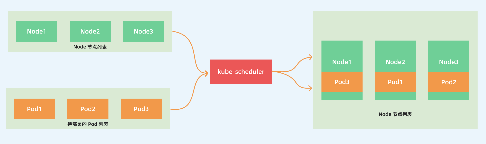
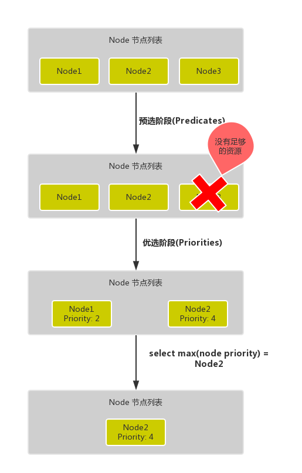

# 调度框架

`kube-scheduler` 是 kubernetes 的核心组件之一，主要负责整个集群资源的调度功能，根据特定的调度算法和策略，将 Pod 调度到最优的工作节点上面去，从而更加合理、更加充分的利用集群的资源。

## 1. 说明

默认情况下，`kube-scheduler` 提供的默认调度器能够满足我们绝大多数的要求，但是在实际的线上项目中，可能我们自己会比 kubernetes 更加了解我们自己的应用，比如我们希望一个 Pod 只能运行在特定的几个节点上，或者这几个节点只能用来运行特定类型的应用，这就需要我们的调度器能够可控。

在实际的生产环境中，需要考虑的问题就有很多了：

- 如何保证全部的节点调度的公平性？要知道并不是所有节点资源配置一定都是一样的
- 如何保证每个节点都能被分配资源？
- 集群资源如何能够被高效利用？
- 集群资源如何才能被最大化使用？
- 如何保证 Pod 调度的性能和效率？
- 用户是否可以根据自己的实际需求定制自己的调度策略？

也就是说需要`自定义调度器`。

## 2. 自定义调度器

一般来说，我们有4种扩展 Kubernetes 调度器的方法。

- 一种方法就是直接 clone 官方的 kube-scheduler 源代码，在合适的位置直接修改代码，然后重新编译运行修改后的程序，当然这种方法是最不建议使用的，也不实用，因为需要花费大量额外的精力来和上游的调度程序更改保持一致。
- 第二种方法就是和默认的调度程序一起运行独立的调度程序，默认的调度器和我们自定义的调度器可以通过 Pod 的 `spec.schedulerName` 来覆盖各自的 Pod，默认是使用 default 默认的调度器，但是多个调度程序共存的情况下也比较麻烦，比如当多个调度器将 Pod 调度到同一个节点的时候，可能会遇到一些问题，因为很有可能两个调度器都同时将两个 Pod 调度到同一个节点上去，但是很有可能其中一个 Pod 运行后其实资源就消耗完了，并且维护一个高质量的自定义调度程序也不是很容易的，因为我们需要全面了解默认的调度程序，整体 Kubernetes 的架构知识以及各种 Kubernetes API 对象的各种关系或限制。
- 第三种方法是[调度器扩展程序](https://github.com/kubernetes/community/blob/master/contributors/design-proposals/scheduling/scheduler_extender.md)，这个方案目前是一个可行的方案，可以和上游调度程序兼容，所谓的调度器扩展程序其实就是一个可配置的 Webhook 而已，里面包含 `过滤器` 和 `优先级` 两个端点，分别对应调度周期中的两个主要阶段（过滤和打分）。
- 第四种方法是通过调度框架（Scheduling Framework），Kubernetes v1.15 版本中引入了可插拔架构的调度框架，使得定制调度器这个任务变得更加的容易。调度框架向现有的调度器中添加了一组插件化的 API，该 API 在保持调度程序“核心”简单且易于维护的同时，使得大部分的调度功能以插件的形式存在，而在v1.16 版本中上面的 `调度器扩展程序` 也已经被废弃了，所以调度框架才是自定义调度器的核心方式。

未引入调度框架前的调度方式：

- 首先是**预选过程**，过滤掉不满足条件的节点，这个过程称为`Predicates`（过滤）
- 然后是**优选过程**，对通过的节点按照优先级排序，称之为`Priorities`（打分）
- 最后从中选择优先级最高的节点，如果中间任何一步骤有错误，就直接返回错误

`Predicates` 阶段首先遍历全部节点，过滤掉不满足条件的节点，属于`强制性`规则，这一阶段输出的所有满足要求的节点将被记录并作为第二阶段的输入，如果所有的节点都不满足条件，那么 Pod 将会一直处于 Pending 状态，直到有节点满足条件，在这期间调度器会不断的重试。

所以我们在部署应用的时候，如果发现有 Pod 一直处于 Pending 状态，那么就是没有满足调度条件的节点，这个时候可以去检查下节点资源是否可用。

`Priorities` 阶段即再次对节点进行筛选，如果有多个节点都满足条件的话，那么系统会按照节点的优先级(`priorites`)大小对节点进行排序，最后选择优先级最高的节点来部署 Pod 应用。

下面是调度过程的简单示意图：

更详细的流程是这样的：

- 首先，客户端通过 API Server 的 REST API 或者 kubectl 工具创建 Pod 资源
- API Server 收到用户请求后，存储相关数据到 etcd 数据库中
- 调度器监听 API Server 查看到还未被调度(bind)的 Pod 列表，循环遍历地为每个 Pod 尝试分配节点，这个分配过程就是我们上面提到的两个阶段：
  - 预选阶段(Predicates)，过滤节点，调度器用一组规则过滤掉不符合要求的 Node 节点，比如 Pod 设置了资源的 request，那么可用资源比 Pod 需要的资源少的主机显然就会被过滤掉
  - 优选阶段(Priorities)，为节点的优先级打分，将上一阶段过滤出来的 Node 列表进行打分，调度器会考虑一些整体的优化策略，比如把 Deployment 控制的多个 Pod 副本尽量分布到不同的主机上，使用最低负载的主机等等策略
- 经过上面的阶段过滤后选择打分最高的 Node 节点和 Pod 进行 `binding` 操作，然后将结果存储到 etcd 中 最后被选择出来的 Node 节点对应的 kubelet 去执行创建 Pod 的相关操作（当然也是 watch APIServer 发现的）。

> 预选和优选都有多种算法支持。

预选算法：

* `NoDiskConflict`:  检查在此主机上是否存在卷冲突。如果这个主机已经挂载了卷，其它使用这个卷的Pod不能调度到这个主机上。GCE 、Amazon EBS 和 Ceph RBD 使用的规则如下:
  * GCE 允许同时挂载多个卷，只要这些卷都是只读的。
  * Amazon EBS 不允许不同的 Pod 挂载同一个卷。
  * Ceph RBD 不允许任何两个 pods 分享相同的 monitor，match pool 和 image。
* `NoVolumeZoneConflict`: 检测 Pod 请求的 Volumes 在节点上是否可用，因为某些存储卷存在区域调度约束
* `PodFitsResources`: 节点上剩余的资源（如 CPU 和内存）是否满足 Pod 请求的资源
* `PodFitsHostPorts`: 如果 Pod 中定义了 spec.hostPort 属性，那么需要先检查这个指定端口是否已经被节点上其他服务占用了
* `HostName`: 如果pod对象拥有spec.hostname属性，则检查节点名称字符串是否与该属性匹配
* `MatchNodeSelector`: 检查 Node 的标签是否能匹配 Pod 的 nodeSelector 的标签值，前提是定义了spec.nodeSelector
* `MaxEBSVolumeCount`: 检查节点已挂载的EBS（亚马逊弹性存储）存储数量是否超过了设置的最大值，默认是39
* `MaxGCEPDVolumeCount`: 检查已挂载的GCE PD（谷歌云存储）存储数量是否已经达到最大，默认是16
* `CheckNodeMemoryPressure`: 检查节点内存是否够用
* `CheckNodeDiskPressure`:  检查节点磁盘空间是否符合要求

优选算法：

* `LeastRequestedPriority`: 如果新的 pod 要分配一个节点，这个节点的优先级就由节点空闲的那部分与总容量的比值(（总容量-节点上pod的容量总和-新pod的容量）/总容量）来决定。CPU 和 memory 权重相当，比值最大的节点的得分最高。需要注意的是，这个优先级函数起到了按照资源消耗来跨节点分配 pods 的作用。计算公式如下：
  * cpu((capacity – sum(requested)) 10 / capacity) memory((capacity – sum(requested)) 10 / capacity) / 2
* `BalancedResourceAllocation`: 尽量选择在部署 Pod 后各项资源更均衡的机器。BalancedResourceAllocation 不能单独使用，而且必须和 LeastRequestedPriority 同时使用，它分别计算主机上的 cpu 和 memory 的比重，主机的分值由 cpu 比重和 memory 比重的“距离”决定。计算公式如下：score = 10 – abs(cpuFraction-memoryFraction)*10
* `SelectorSpreadPriority`: 对于属于同一个 service、replication controller 的 Pod，尽量分散在不同的主机上。如果指定了区域，则会尽量把 Pod 分散在不同区域的不同主机上。调度一个 Pod 的时候，先查找 Pod 对于的 service或者 replication controller，然后查找 service 或 replication controller 中已存在的 Pod，主机上运行的已存在的 Pod 越少，主机的打分越高。
* `CalculateAntiAffinityPriority`: 尽量使属于同一Service 的Pod 在某个节点上的数量最少。
* `ImageLocalityPriority`: 据主机上是否已具备 Pod 运行的环境来打分。ImageLocalityPriority 会判断主机上是否已存在 Pod 运行所需的镜像，根据已有镜像的大小返回一个0-10的打分。如果主机上不存在 Pod 所需的镜像，返回0；如果主机上存在部分所需镜像，则根据这些镜像的大小来决定分值，镜像越大，打分就越高。
* `NodeAffinityPriority`: Kubernetes 调度中的亲和性机制。

> 我们目前使用的1.23版本，已经是全面使用了调度框架

## 3. 调度框架分析

官方文档：https://github.com/kubernetes/enhancements/tree/master/keps/sig-scheduling/624-scheduling-framework

1. `QueueSort` 扩展用于对 Pod 的待调度队列进行排序，以决定先调度哪个 Pod，`QueueSort` 扩展本质上只需要实现一个方法 `Less(Pod1, Pod2)` 用于比较两个 Pod 谁更优先获得调度即可，同一时间点只能有一个 `QueueSort` 插件生效。
2. `Pre-filter` 扩展用于对 Pod 的信息进行预处理，或者检查一些集群或 Pod 必须满足的前提条件，如果 `pre-filter` 返回了 error，则调度过程终止。
3. `Filter` 扩展用于排除那些不能运行该 Pod 的节点，对于每一个节点，调度器将按顺序执行 `filter` 扩展；如果任何一个 `filter` 将节点标记为不可选，则余下的 `filter` 扩展将不会被执行。调度器可以同时对多个节点执行 `filter` 扩展。
4. `Post-filter` 是一个通知类型的扩展点，调用该扩展的参数是 `filter` 阶段结束后被筛选为**可选节点**的节点列表，可以在扩展中使用这些信息更新内部状态，或者产生日志或 metrics 信息。
5. `PreScore`扩展用于对打分做预处理工作，插件将带有通过过滤阶段的节点列表。插件可以利用此数据更新内部状态或者生成日志/指标。
6. `Scoring` 扩展分为两个阶段
   1. 第一个阶段为Score，用于对已经通过过滤阶段的节点进行排名，调度程序将为每个节点调用每个Score插件的分数，评分结果是一个范围内的整数。
   2. 第二个阶段叫 `normalize scoring` 阶段，调度器将会把每个 `scoring` 扩展对具体某个节点的评分结果和该扩展的权重合并起来，作为最终评分结果。
7. `Normalize scoring` 扩展在调度器对节点进行最终排序之前修改每个节点的评分结果，注册到该扩展点的扩展在被调用时，将获得同一个插件中的 `scoring` 扩展的评分结果作为参数，调度框架每执行一次调度，都将调用所有插件中的一个 `normalize scoring` 扩展一次。
8. `Reserve` 是一个通知性质的扩展点，有状态的插件可以使用该扩展点来获得节点上为 Pod 预留的资源，该事件发生在调度器将 Pod 绑定到节点之前，目的是避免调度器在等待 Pod 与节点绑定的过程中调度新的 Pod 到节点上时，发生实际使用资源超出可用资源的情况。（因为绑定 Pod 到节点上是异步发生的）。这是调度过程的最后一个步骤，Pod 进入 reserved 状态以后，要么在绑定失败时触发 Unreserve 扩展，要么在绑定成功时，由 Post-bind 扩展结束绑定过程。
9. `Permit` 扩展用于阻止或者延迟 Pod 与节点的绑定。Permit 扩展可以做下面三件事中的一项：
   - approve（批准）：当所有的 permit 扩展都 approve 了 Pod 与节点的绑定，调度器将继续执行绑定过程
   - deny（拒绝）：如果任何一个 permit 扩展 deny 了 Pod 与节点的绑定，Pod 将被放回到待调度队列，此时将触发 `Unreserve` 扩展
   - wait（等待）：如果一个 permit 扩展返回了 wait，则 Pod 将保持在 permit 阶段，直到被其他扩展 approve，如果超时事件发生，wait 状态变成 deny，Pod 将被放回到待调度队列，此时将触发 Unreserve 扩展
10. `Pre-bind` 扩展用于在 Pod 绑定之前执行某些逻辑。例如，pre-bind 扩展可以将一个基于网络的数据卷挂载到节点上，以便 Pod 可以使用。如果任何一个 `pre-bind` 扩展返回错误，Pod 将被放回到待调度队列，此时将触发 Unreserve 扩展。
11. `Bind` 扩展用于将 Pod 绑定到节点上：
    - 只有所有的 pre-bind 扩展都成功执行了，bind 扩展才会执行
    - 调度框架按照 bind 扩展注册的顺序逐个调用 bind 扩展
    - 具体某个 bind 扩展可以选择处理或者不处理该 Pod
    - 如果某个 bind 扩展处理了该 Pod 与节点的绑定，余下的 bind 扩展将被忽略
12. `Post-bind` 是一个通知性质的扩展：
    - Post-bind 扩展在 Pod 成功绑定到节点上之后被动调用
    - Post-bind 扩展是绑定过程的最后一个步骤，可以用来执行资源清理的动作
13. `Unreserve` 是一个通知性质的扩展，如果为 Pod 预留了资源，Pod 又在被绑定过程中被拒绝绑定，则 unreserve 扩展将被调用。Unreserve 扩展应该释放已经为 Pod 预留的节点上的计算资源。在一个插件中，reserve 扩展和 unreserve 扩展应该成对出现。

整个过程可以分为两个周期：调度周期（scheduling cycle）、绑定周期（Binding Cycle），这两个周期的区别不仅仅是包含插件，还有每个周期的上下文（Cycle Context），这个上下文将贯穿各自的周期使周期内的每个插件之间能够进行数据的交流。`Sort`插件是不属于两个周期任何一个，它的职责就是对调度队列中的Pod进行排序。

一个pod的调度过程在调度插件里是线性执行下去的，但是绑定周期的执行是异步的，也就是说scheduler在执行A Pod的绑定周期时，其实也同时开始了B Pod的调度周期。这也是比较合理的，毕竟`Bind`插件是需要和`APIServer`进行通信来更新调度pod的`nodeName`，这个网络IO过程存在着不可确定性。

### 3.1 调度周期

`Filter`插件的功能类似之前的谓词（Predicates）调度（预选），这个过程就是根据调度策略函数（在调度框架里就是多个Filter插件函数）进行node筛选，筛选的原理就是将被筛选的node和待调度的pod以及周期上下文等作为参数一并传入这些函数，最后收集通过了所有筛选函数的node进入下一阶段，在这个阶段将会以node为单位进行并发处理。

`PostFilter`插件虽说是发生在`Filter`之后，但是确只能在`Filter`插件没有返回合适的node才执行。在scheduler里默认的`PostFilter`插件只有一个功能，进行抢占调度。抢占调度的原理：首先会将node上低于待调度pod的优先级的Pod全部剔除，当然这个只是模拟过程并不是真正将Pod干掉，然后再次执行`Filter`插件，如果失败了那就是抢占调度失败，成功了则将前面剔除的pod一个一个加回来，每一次都执行`Filter`插件从而找出调度该Pod所需要剔除的最少的低优先级Pod。

`Score`插件的功能类比以前的优先级调度，这个过程是对前一阶段得出的node列表进行再筛选，得出最终要调度的node。`NormalizeScore`再调度框架里也不能算是一个单独扩展点，它往往是配合着`score`插件一起出现，为了统一插件打分的分数。在调度框架里是作为`Score`插件可选的实现接口，同样的`Score`插件的也是会并发的在每个node上执行。

`Reserve`插件有两种函数，`reserve`函数在绑定前为Pod做准备动作，`Unreserve`函数则在绑定周期间发生错误的时候做恢复。默认的`Reserve`插件使用情况是处理pod关联里pvc与pv的绑定和解绑。

### 3.2 绑定周期

整个绑定周期都是在一个异步的协程中，在执行进入绑定周期前会执行Pod的`assume(假定)`过程，这个过程做的主要是假设Pod已经绑定到目标node上，所以会更新scheduler的node缓存信息，这样当调度下一个pod到前一个pod真正在node上创建的过程中，能够用真正的node信息进行调度。

## 4.  KubeSchedulerConfiguration

可以通过编写配置文件，并将其路径传给 `kube-scheduler` 的命令行参数，定制 `kube-scheduler` 的行为。

调度模板（Profile）允许配置 [kube-scheduler](https://kubernetes.io/zh-cn/docs/reference/command-line-tools-reference/kube-scheduler/) 中的不同调度阶段。每个阶段都暴露于某个扩展点中。插件通过实现一个或多个扩展点来提供调度行为。

通过使用 KubeSchedulerConfiguration，运行 `kube-scheduler --config <filename>` 来设置调度模板。

最简单的配置如下：

~~~yaml
apiVersion: kubescheduler.config.k8s.io/v1
kind: KubeSchedulerConfiguration
clientConnection:
  kubeconfig: /etc/kubernetes
~~~

对每个扩展点，你可以禁用默认插件或者是启用自己的插件，例如：

~~~yaml
apiVersion: kubescheduler.config.k8s.io/v1
kind: KubeSchedulerConfiguration
profiles:
  - plugins:
      score:
        disabled:
        - name: PodTopologySpread
        enabled:
        - name: MyCustomPluginA
          weight: 2
        - name: MyCustomPluginB
          weight: 1
~~~

可以在 `disabled` 数组中使用 `*` 禁用该扩展点的所有默认插件。 如果需要，这个字段也可以用来对插件排序。

假设默认插件 foo 实现了 `reserve` 扩展点，此时我们要添加一个插件 bar，想要在 foo 之前被调用，则应该先禁用 foo 再按照 bar foo 的顺序激活。示例配置如下所示：

~~~yaml
apiVersion: kubescheduler.config.k8s.io/v1
kind: KubeSchedulerConfiguration

...

plugins:
  reserve:
    enabled:
    - name: bar
    - name: foo
    disabled:
    - name: foo 
~~~

下面默认启用的插件实现了一个或多个扩展点：

- `ImageLocality`：选择已经存在 Pod 运行所需容器镜像的节点。

  实现的扩展点：`score`。

- `TaintToleration`：实现了污点和容忍。

  实现的扩展点：`filter`、`preScore`、`score`。

- `NodeName`：检查 Pod 指定的节点名称与当前节点是否匹配。

  实现的扩展点：`filter`。

- `NodePorts`：检查 Pod 请求的端口在节点上是否可用。

  实现的扩展点：`preFilter`、`filter`。

- `NodeAffinity`：实现了节点选择器 和节点亲和性。

  实现的扩展点：`filter`、`score`。

- `PodTopologySpread`：实现了 Pod 拓扑分布。

  实现的扩展点：`preFilter`、`filter`、`preScore`、`score`。

- `NodeUnschedulable`：过滤 `.spec.unschedulable` 值为 true 的节点。

  实现的扩展点：`filter`。

- `NodeResourcesFit`：检查节点是否拥有 Pod 请求的所有资源。 得分可以使用以下三种策略之一：`LeastAllocated`（默认）、`MostAllocated` 和 `RequestedToCapacityRatio`。

  实现的扩展点：`preFilter`、`filter`、`score`。

- `NodeResourcesBalancedAllocation`：调度 Pod 时，选择资源使用更为均衡的节点。

  实现的扩展点：`score`。

- `VolumeBinding`：检查节点是否有请求的卷，或是否可以绑定请求的卷。 实现的扩展点：`preFilter`、`filter`、`reserve`、`preBind` 和 `score`。

- `VolumeRestrictions`：检查挂载到节点上的卷是否满足卷提供程序的限制。

  实现的扩展点：`filter`。

- `VolumeZone`：检查请求的卷是否在任何区域都满足。

  实现的扩展点：`filter`。

- `NodeVolumeLimits`：检查该节点是否满足 CSI 卷限制。

  实现的扩展点：`filter`。

- `EBSLimits`：检查节点是否满足 AWS EBS 卷限制。

  实现的扩展点：`filter`。

- `GCEPDLimits`：检查该节点是否满足 GCP-PD 卷限制。

  实现的扩展点：`filter`。

- `AzureDiskLimits`：检查该节点是否满足 Azure 卷限制。

  实现的扩展点：`filter`。

- `InterPodAffinity`：实现 Pod 间亲和性与反亲和性。

  实现的扩展点：`preFilter`、`filter`、`preScore`、`score`。

- `PrioritySort`：提供默认的基于优先级的排序。

  实现的扩展点：`queueSort`。

- `DefaultBinder`：提供默认的绑定机制。

  实现的扩展点：`bind`。

- `DefaultPreemption`：提供默认的抢占机制。

  实现的扩展点：`postFilter`。

**多配置文件**

可以配置 `kube-scheduler` 运行多个配置文件。 每个配置文件都有一个关联的调度器名称，并且可以在其扩展点中配置一组不同的插件。

使用下面的配置样例，调度器将运行两个配置文件：一个使用默认插件，另一个禁用所有打分插件。

~~~yaml
apiVersion: kubescheduler.config.k8s.io/v1
kind: KubeSchedulerConfiguration
profiles:
  - schedulerName: default-scheduler
  - schedulerName: no-scoring-scheduler
    plugins:
      preScore:
        disabled:
        - name: '*'
      score:
        disabled:
        - name: '*'
~~~

默认情况下，将创建一个调度器名为 `default-scheduler` 的配置文件。 这个配置文件包括上面描述的所有默认插件。 声明多个配置文件时，每个配置文件中调度器名称必须唯一。

如果 Pod 未指定调度器名称，kube-apiserver 将会把调度器名设置为 `default-scheduler`。 因此，应该存在一个调度器名为 `default-scheduler` 的配置文件来调度这些 Pod，如果想要指定，可以在`spec.schedulerName` 字段指定相应的调度器名称。

**多个扩展点插件**

从 `kubescheduler.config.k8s.io/v1beta3` 开始，配置文件配置中有一个附加字段 `multiPoint`，它允许跨多个扩展点轻松启用或禁用插件。 `multiPoint` 配置的目的是简化用户和管理员在使用自定义配置文件时所需的配置。

例如：一个插件，`MyPlugin`，它实现了 `preScore`、`score`、`preFilter` 和 `filter` 扩展点。 要为其所有可用的扩展点启用 `MyPlugin`，配置文件配置如下所示：

~~~yaml
apiVersion: kubescheduler.config.k8s.io/v1
kind: KubeSchedulerConfiguration
profiles:
  - schedulerName: multipoint-scheduler
    plugins:
      multiPoint:
        enabled:
        - name: MyPlugin
~~~

这相当于为所有扩展点手动启用 `MyPlugin`，如下所示：

~~~yaml
apiVersion: kubescheduler.config.k8s.io/v1
kind: KubeSchedulerConfiguration
profiles:
  - schedulerName: non-multipoint-scheduler
    plugins:
      preScore:
        enabled:
        - name: MyPlugin
      score:
        enabled:
        - name: MyPlugin
      preFilter:
        enabled:
        - name: MyPlugin
      filter:
        enabled:
        - name: MyPlugin
~~~

使用 `multiPoint` 的一个好处是，如果 `MyPlugin` 将来实现另一个扩展点，`multiPoint` 配置将自动为新扩展启用它。

可以使用该扩展点的 `disabled` 字段将特定扩展点从 `MultiPoint` 扩展中排除。 这适用于禁用默认插件、非默认插件或使用通配符 (`'*'`) 来禁用所有插件。 禁用 `Score` 和 `PreScore` 的一个例子是：

~~~yaml
apiVersion: kubescheduler.config.k8s.io/v1
kind: KubeSchedulerConfiguration
profiles:
  - schedulerName: non-multipoint-scheduler
    plugins:
      multiPoint:
        enabled:
        - name: 'MyPlugin'
      preScore:
        disabled:
        - name: '*'
      score:
        disabled:
        - name: '*'
~~~

配置 `MultiPoint` 插件时优先级的一般层次结构如下：

1. 特定的扩展点首先运行，它们的设置会覆盖其他地方的设置
2. 通过 `MultiPoint` 手动配置的插件及其设置
3. 默认插件及其默认设置

