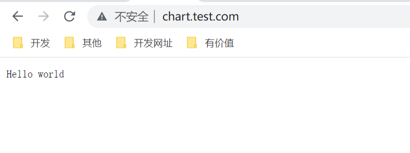

# 创建一个Helm Chart

## 1. 应用准备

准备一个简单的golang http服务：

main.go

~~~go
package main

import (
	"fmt"
	"log"
	"net/http"
	"os"
)

func main() {
	port := os.Getenv("PORT")
	if port == "" {
		port = "8080"
	}
	username := os.Getenv("USERNAME")
	if username == "" {
		username = "world"
	}
	http.HandleFunc("/", func(w http.ResponseWriter, r *http.Request) {
		fmt.Fprintf(w, "Hello %s\n", username)
	})
	log.Println("go hello world starting...")
	err := http.ListenAndServe(":"+port, nil)
	if err != nil {
		panic(err)
	}
}

~~~

Dockerfile：

~~~dockerfile
FROM golang:1.17.1 as builder
WORKDIR /app
COPY main.go .
ENV CGO_ENABLED=0
RUN go build -o hello-world main.go

FROM alpine:latest
WORKDIR /app
COPY --from=builder /app/hello-world /app/hello-world
ENTRYPOINT ["/app/hello-world"]
EXPOSE 8080
~~~

~~~shell
[root@master test]# docker build -t ms/go-hello-world:1.0 .
~~~

上传到docker仓库中：

~~~shell
[root@master test]# docker tag ms/go-hello-world:1.0 mszlu/go-hello-world:1.0
[root@master test]# docker push mszlu/go-hello-world:1.0
The push refers to repository [docker.io/mszlu/go-hello-world]
05feaa071f42: Pushed 
6b42f5d48464: Pushed 
9fb3aa2f8b80: Mounted from library/alpine 
1.0: digest: sha256:26a7e9362e1a8fab51d38b0cc5ec1d36723850ab57aa15802d489843ae2cb2ec size: 946
~~~

## 2. 创建Chart

~~~shell
[root@master test]# helm create hello-world
Creating hello-world
~~~

### 2.1 Chart.yaml

~~~yaml
apiVersion: v2
name: hello-world
description: ms go hello world chart
type: application
version: 0.1.0
appVersion: "1.16.0"
~~~

### 2.2 values.yaml

~~~yaml
replicas: 2
image:
  repository: mszlu/go-hello-world
  pullPolicy: IfNotPresent
  tag: "1.0"
service:
  type: ClusterIP
  port: 80
  targetport: 8080
ingress:
  enabled: true
  annotations: {}
  hosts:
    - host: chart.test.com
      paths: / 
  tls: []
resources:
  limits:
    cpu: 200m
    memory: 256Mi
  requests:
    cpu: 100m
    memory: 128Mi
autoscaling:
  enabled: false
  minReplicas: 1
  maxReplicas: 100
  targetCPUUtilizationPercentage: 80
  targetMemoryUtilizationPercentage: 80
nodeSelector: {}
~~~

### 2.3 模板简单修改：

_helpers.tpl 

~~~go
{{/*
资源名称
*/}}
{{- define "hello-world.fullname" -}}
{{- default .Chart.Name .Values.nameOverride | trunc 63 | trimSuffix "-" }}
{{- end }}
{{/*
公共标签选择器
*/}}
{{- define "hello-world.labels" -}}
app: {{ template "hello-world.fullname" . }}
release: {{ .Release.Name }}
chart: {{ .Chart.Name }}
{{- end }}
{{/*
标签选择器
*/}}
{{- define "hello-world.selectorLabels" -}}
app: {{ template "hello-world.fullname" . }}
release: {{ .Release.Name }}
{{- end }}
~~~

### 2.4 deployment.yaml

~~~yaml
apiVersion: apps/v1
kind: Deployment
metadata:
  name: {{ include "hello-world.fullname" . }}
  labels:
    {{- include "hello-world.labels" . | nindent 4 }}
spec:
{{- if not .Values.autoscaling.enabled }}
  replicas: {{ .Values.replicaCount }}
{{- end }}
  selector:
    matchLabels:
      {{- include "hello-world.selectorLabels" . | nindent 6 }}
  template:
    metadata:
      labels:
        {{- include "hello-world.selectorLabels" . | nindent 8 }}
    spec:
      containers:
        - name: {{ .Chart.Name }}
          image: "{{ .Values.image.repository }}:{{ .Values.image.tag | default .Chart.AppVersion }}"
          imagePullPolicy: {{ .Values.image.pullPolicy }}
          {{- if .Values.resources }}
          resources:
            {{- toYaml .Values.resources | nindent 12 }}
          {{- else }}
         resources: {}
          {{- end }}
~~~

### 2.5 ingress.yaml 

~~~yaml
{{- if .Values.ingress.enabled -}}
{{- $fullName := include "hello-world.fullname" . -}}
{{- $svcPort := .Values.service.port -}}
{{- $paths := .Values.ingress.paths -}}
apiVersion: networking.k8s.io/v1
kind: Ingress
metadata:
  name: {{ $fullName }}
  labels:
    {{- include "hello-world.labels" . | nindent 4 }}
  {{- with .Values.ingress.annotations }}
  annotations:
    {{- toYaml . | nindent 4 }}
  {{- end }}
spec:
  ingressClassName: nginx
  {{- if .Values.ingress.tls }}
  tls:
    {{- range .Values.ingress.tls }}
    - hosts:
        {{- range .hosts }}
        - {{ . | quote }}
        {{- end }}
      secretName: {{ .secretName }}
    {{- end }}
  {{- end }}
  rules:
    {{- range .Values.ingress.hosts }}
    - host: {{ .host | quote }}
      http:
        paths:
          - path: {{ .paths }}
            pathType: Prefix
            backend:
              service:
                name: {{ $fullName }}
                port: 
                  number: {{ $svcPort }}
    {{- end }}
  {{- end }}
~~~

### 2.6 service.yaml

~~~yaml
apiVersion: v1
kind: Service
metadata:
  name: {{ include "hello-world.fullname" . }}
  labels:
    {{- include "hello-world.labels" . | nindent 4 }}
spec:
  type: {{ .Values.service.type }}
  ports:
    - port: {{ .Values.service.port }}
      targetPort: {{ .Values.service.targetport }}
      protocol: TCP
      name: http
  selector:
    {{- include "hello-world.selectorLabels" . | nindent 4 }}
~~~

### 2.7 NOTES.txt

~~~txt
1. Get the application URL by running these commands:
{{- if .Values.ingress.enabled }}
  http{{ if $.Values.ingress.tls }}s{{ end }}://{{- range .Values.ingress.hosts }}{{ .host }}{{.paths}}{{end}} 
{{- else if contains "NodePort" .Values.service.type }}
  export NODE_PORT=$(kubectl get --namespace {{ .Release.Namespace }} -o jsonpath="{.spec.ports[0].nodePort}" services {{ include "hello-world.fullname" . }})
  export NODE_IP=$(kubectl get nodes --namespace {{ .Release.Namespace }} -o jsonpath="{.items[0].status.addresses[0].address}")
  echo http://$NODE_IP:$NODE_PORT
{{- else if contains "LoadBalancer" .Values.service.type }}
     NOTE: It may take a few minutes for the LoadBalancer IP to be available.
           You can watch the status of by running 'kubectl get --namespace {{ .Release.Namespace }} svc -w {{ include "hello-world.fullname" . }}'
  export SERVICE_IP=$(kubectl get svc --namespace {{ .Release.Namespace }} {{ include "demo.fullname" . }} --template "{{"{{ range (index .status.loadBalancer.ingress 0) }}{{.}}{{ end }}"}}")
  echo http://$SERVICE_IP:{{ .Values.service.port }}
{{- else if contains "ClusterIP" .Values.service.type }}
  export POD_NAME=$(kubectl get pods --namespace {{ .Release.Namespace }} -l "app.kubernetes.io/name={{ include "hello-world.fullname" . }},app.kubernetes.io/instance={{ .Release.Name }}" -o jsonpath="{.items[0].metadata.name}")
  echo "Visit http://127.0.0.1:8080 to use your application"
  kubectl --namespace {{ .Release.Namespace }} port-forward $POD_NAME 8080:80
{{- end }}
~~~

## 3. 试运行

~~~shell
[root@master test]# helm install web hello-world/ --dry-run
NAME: web
LAST DEPLOYED: Tue Sep 20 15:25:28 2022
NAMESPACE: default
STATUS: pending-install
REVISION: 1
TEST SUITE: None
HOOKS:
MANIFEST:
---
# Source: hello-world/templates/service.yaml
apiVersion: v1
kind: Service
metadata:
  name: hello-world
  labels:
    app: hello-world
    release: web
    chart: hello-world
spec:
  type: ClusterIP
  ports:
    - port: 80
      targetPort: 8080
      protocol: TCP
      name: http
  selector:
    app: hello-world
    release: web
---
# Source: hello-world/templates/deployment.yaml
~~~

## 4. 安装

~~~shell
[root@master test]# helm install web hello-world/ -n dev
NAME: web
LAST DEPLOYED: Tue Sep 20 15:27:35 2022
NAMESPACE: dev
STATUS: deployed
REVISION: 1
TEST SUITE: None
NOTES:
1. Get the application URL by running these commands:
  http://chart.test.com/
~~~

~~~shell
[root@master test]# helm list -n dev
NAME    NAMESPACE       REVISION        UPDATED                                 STATUS          CHART                   APP VERSION
web     dev             1               2022-09-20 15:27:35.425054994 +0800 CST deployed        hello-world-0.1.0       1.16.0  
[root@master test]# kubectl get pods -n dev
NAME                           READY   STATUS    RESTARTS   AGE
hello-world-5f58b77b87-cm2fp   1/1     Running   0          43s
[root@master test]# kubectl get ingress -n dev
NAME          CLASS   HOSTS            ADDRESS   PORTS   AGE
hello-world   nginx   chart.test.com             80      96s
[root@master test]# kubectl get svc -n dev
NAME          TYPE        CLUSTER-IP      EXTERNAL-IP   PORT(S)   AGE
hello-world   ClusterIP   10.96.220.214   <none>        80/TCP    114s
~~~

访问浏览器：http://chart.test.com/ 验证是否正常

> 一定要记得安装ingress环境，在入门教程中，我们已经安装过

注意遇到网络问题：

~~~shell
#删除对应节点的cnio
[root@node2 ~]# ifconfig cni0 down    
[root@node2 ~]# ip link delete cni0
#删除coredns的pod 让其重建 原因是网络未配置正确 coredns 应该运行在工作节点才对
[root@master test]# kubectl delete pod coredns-6d8c4cb4d-wphbn -n kube-system
pod "coredns-6d8c4cb4d-wphbn" deleted
~~~

