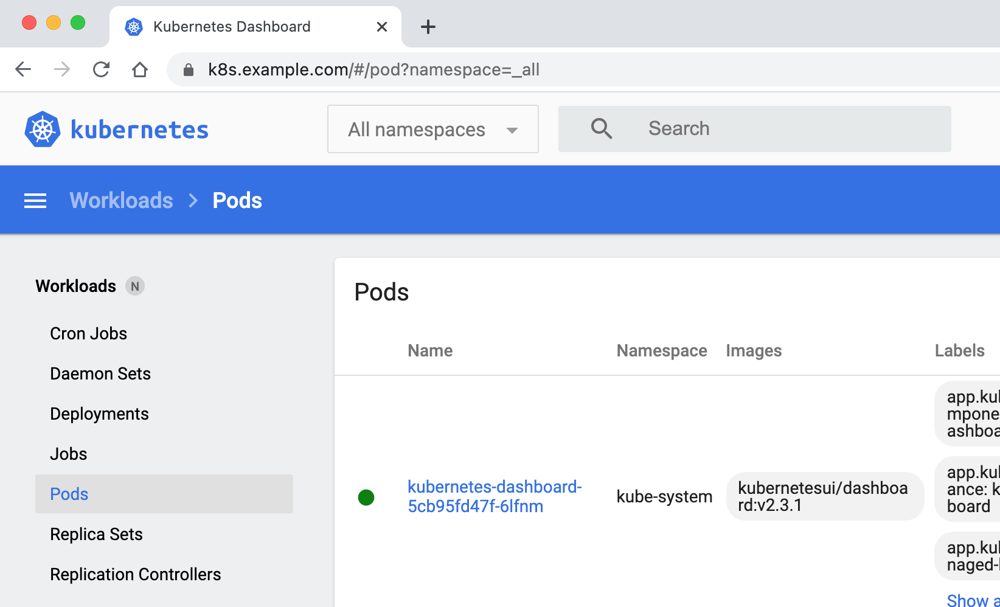

# Helm 部署 k8s 1.24

容器运行时 docker ，1.24版本以后 移除docker，CRI容器运行时接口 ，docker-cri

## 1.准备

### 1.1 系统配置

在安装之前，需要先做好如下准备。3台CentOS 7.9主机如下：

~~~shell
[root@master /]# cat /etc/hosts
192.168.200.101 master
192.168.200.102 node1
192.168.200.103 node2
~~~

在各个主机上完成下面的系统配置。

如果各个主机启用了防火墙策略，需要开放Kubernetes各个组件所需要的端口，可以查看[Ports and Protocols](https://kubernetes.io/docs/reference/ports-and-protocols/)中的内容, 开放相关端口或者关闭主机的防火墙。

禁用SELINUX：

~~~shell
[root@master /]# setenforce 0 
setenforce: SELinux is disable
~~~

~~~shell
[root@master /]# vim /etc/selinux/config

# This file controls the state of SELinux on the system.
# SELINUX= can take one of these three values:
#     enforcing - SELinux security policy is enforced.
#     permissive - SELinux prints warnings instead of enforcing.
#     disabled - No SELinux policy is loaded.
SELINUX=disabled
~~~

创建/etc/modules-load.d/containerd.conf配置文件:

~~~shell
cat << EOF > /etc/modules-load.d/containerd.conf
overlay
br_netfilter
EOF
~~~

执行以下命令使配置生效:

~~~shell
[root@master /]# modprobe overlay
[root@master /]# modprobe br_netfilter
~~~

创建/etc/sysctl.d/99-kubernetes-cri.conf配置文件：

~~~shell
cat << EOF > /etc/sysctl.d/99-kubernetes-cri.conf
net.bridge.bridge-nf-call-ip6tables = 1
net.bridge.bridge-nf-call-iptables = 1
net.ipv4.ip_forward = 1
user.max_user_namespaces=28633
EOF
~~~

执行以下命令使配置生效:

~~~shell
sysctl -p /etc/sysctl.d/99-kubernetes-cri.conf
~~~

### 1.2 配置服务器支持开启ipvs的前提条件

由于ipvs已经加入到了内核的主干，所以为kube-proxy开启ipvs的前提需要加载以下的内核模块：

~~~shell
ip_vs
ip_vs_rr
ip_vs_wrr
ip_vs_sh
nf_conntrack_ipv4
~~~

在各个服务器节点上执行以下脚本:

~~~shell
cat > /etc/sysconfig/modules/ipvs.modules <<EOF
#!/bin/bash
modprobe -- ip_vs
modprobe -- ip_vs_rr
modprobe -- ip_vs_wrr
modprobe -- ip_vs_sh
modprobe -- nf_conntrack_ipv4
EOF
# 注意 低内核版本用 nf_conntrack_ipv4
chmod 755 /etc/sysconfig/modules/ipvs.modules && bash /etc/sysconfig/modules/ipvs.modules && lsmod | grep -e ip_vs -e nf_conntrack
~~~

上面脚本创建了的`/etc/sysconfig/modules/ipvs.modules`文件，保证在节点重启后能自动加载所需模块。 使用`lsmod | grep -e ip_vs -e nf_conntrack_ipv4`命令查看是否已经正确加载所需的内核模块。

~~~shell
[root@master ~]# lsmod | grep -e ip_vs -e nf_conntrack_ipv4
ip_vs_sh               16384  0 
ip_vs_wrr              16384  0 
ip_vs_rr               16384  0 
ip_vs                 163840  6 ip_vs_rr,ip_vs_sh,ip_vs_wrr
nf_conntrack          163840  1 ip_vs
nf_defrag_ipv6         24576  2 nf_conntrack,ip_vs
nf_defrag_ipv4         16384  1 nf_conntrack
libcrc32c              16384  3 nf_conntrack,xfs,ip_vs
~~~

接下来还需要确保各个节点上已经安装了ipset软件包，为了便于查看ipvs的代理规则，最好安装一下管理工具ipvsadm。

~~~shell
[root@master ~]# yum install -y ipset ipvsadm
~~~

如果不满足以上前提条件，则即使kube-proxy的配置开启了ipvs模式，也会退回到iptables模式。

### 1.3 部署容器运行时Containerd

在各个服务器节点上安装容器运行时Containerd。

下载Containerd的二进制包:

~~~shell
wget https://github.com/containerd/containerd/releases/download/v1.6.4/cri-containerd-cni-1.6.4-linux-amd64.tar.gz
~~~

`cri-containerd-cni-1.6.4-linux-amd64.tar.gz`压缩包中已经按照官方二进制部署推荐的目录结构布局好。 里面包含了systemd配置文件，containerd以及cni的部署文件。 将解压缩到系统的根目录`/`中:

~~~shell
[root@master k8s]# tar -zxvf cri-containerd-cni-1.6.4-linux-amd64.tar.gz -C /
~~~

注意经测试cri-containerd-cni-1.6.4-linux-amd64.tar.gz包中包含的runc在CentOS 7下的动态链接有问题，这里从runc的github上单独下载runc，并替换上面安装的containerd中的runc:

~~~shell
[root@master k8s]# wget https://github.com/opencontainers/runc/releases/download/v1.1.2/runc.amd64
[root@master k8s]# cp runc.amd64 /usr/local/sbin/runc
cp：是否覆盖"/usr/local/sbin/runc"？ y
~~~

接下来生成containerd的配置文件:

~~~shell
[root@master k8s]# mkdir -p /etc/containerd
[root@master k8s]# containerd config default > /etc/containerd/config.toml
~~~

根据文档[Container runtimes ](https://kubernetes.io/docs/setup/production-environment/container-runtimes/)中的内容，对于使用systemd作为init system的Linux的发行版，使用systemd作为容器的cgroup driver可以确保服务器节点在资源紧张的情况更加稳定，因此这里配置各个节点上containerd的cgroup driver为systemd。

修改前面生成的配置文件`/etc/containerd/config.toml`：

~~~shell
[plugins."io.containerd.grpc.v1.cri".containerd.runtimes.runc]
  ...
  [plugins."io.containerd.grpc.v1.cri".containerd.runtimes.runc.options]
    SystemdCgroup = true
~~~

再修改`/etc/containerd/config.toml`中的

~~~shell
[plugins."io.containerd.grpc.v1.cri"]
  ...
  # sandbox_image = "k8s.gcr.io/pause:3.6"
  sandbox_image = "registry.aliyuncs.com/google_containers/pause:3.7"
~~~

配置containerd开机启动，并启动containerd

~~~shell
systemctl enable containerd --now
~~~

使用crictl测试一下，确保可以打印出版本信息并且没有错误信息输出:

~~~shell
[root@master k8s]# systemctl restart containerd
[root@master k8s]# crictl version              
Version:  0.1.0
RuntimeName:  containerd
RuntimeVersion:  v1.6.4
RuntimeApiVersion:  v1alpha2
~~~

## 2.使用kubeadm部署Kubernetes

### 2.1 安装kubeadm和kubelet

下面在各节点安装kubeadm和kubelet：

~~~shell
cat <<EOF > /etc/yum.repos.d/kubernetes.repo
[kubernetes]
name=Kubernetes
baseurl=http://mirrors.aliyun.com/kubernetes/yum/repos/kubernetes-el7-x86_64
enabled=1
gpgcheck=1
repo_gpgcheck=0
gpgkey=http://mirrors.aliyun.com/kubernetes/yum/doc/yum-key.gpg
        http://mirrors.aliyun.com/kubernetes/yum/doc/rpm-package-key.gpg
EOF
~~~

~~~shell
yum makecache fast
yum -y install kubelet-1.24.0 kubeadm-1.24.0 kubectl-1.24.0
~~~

运行`kubelet --help`可以看到原来kubelet的绝大多数命令行flag参数都被`DEPRECATED`了，官方推荐我们使用`--config`指定配置文件，并在配置文件中指定原来这些flag所配置的内容。具体内容可以查看这里[Set Kubelet parameters via a config file](https://kubernetes.io/docs/tasks/administer-cluster/kubelet-config-file/)。**最初Kubernetes这么做是为了支持动态Kubelet配置（Dynamic Kubelet Configuration），但动态Kubelet配置特性从k8s 1.22中已弃用，并在1.24中被移除。如果需要调整集群汇总所有节点kubelet的配置，还是推荐使用ansible等工具将配置分发到各个节点**。

kubelet的配置文件必须是json或yaml格式。

Kubernetes 1.8开始要求关闭系统的Swap，如果不关闭，默认配置下kubelet将无法启动。 关闭系统的Swap方法如下:

~~~shell
swapoff -a
~~~

修改 /etc/fstab 文件，注释掉 SWAP 的自动挂载，使用`free -m`确认swap已经关闭。

~~~shell
[root@master k8s]# vim /etc/fstab

#
# /etc/fstab
# Created by anaconda on Fri Mar 11 19:06:01 2022
#
# Accessible filesystems, by reference, are maintained under '/dev/disk'
# See man pages fstab(5), findfs(8), mount(8) and/or blkid(8) for more info
#
/dev/mapper/centos-root /                       xfs     defaults        0 0
#UUID=cfe586e4-74bf-4670-b28c-85110dbcb55b /boot                   xfs     defaults        0 0
#/dev/mapper/centos-swap swap                    swap    defaults        0 0
~                                                                                            
~~~

~~~shell
[root@master k8s]# free -m
              total        used        free      shared  buff/cache   available
Mem:           1819         277         200           9        1341        1373
Swap:             0           0           0
~~~

swappiness参数调整，修改/etc/sysctl.d/99-kubernetes-cri.conf添加下面一行：

~~~shell
vm.swappiness=0
~~~

执行`sysctl -p /etc/sysctl.d/99-kubernetes-cri.conf`使修改生效。

### 2.2 使用kubeadm init初始化集群

在各节点开机启动kubelet服务：

~~~shell
[root@master k8s]# systemctl enable kubelet.service
~~~

使用`kubeadm config print init-defaults --component-configs KubeletConfiguration`可以打印集群初始化默认的使用的配置：

~~~shell
[root@master k8s]# kubeadm config print init-defaults --component-configs KubeletConfiguration
apiVersion: kubeadm.k8s.io/v1beta3
bootstrapTokens:
- groups:
  - system:bootstrappers:kubeadm:default-node-token
  token: abcdef.0123456789abcdef
  ttl: 24h0m0s
  usages:
  - signing
  - authentication
kind: InitConfiguration
localAPIEndpoint:
  advertiseAddress: 1.2.3.4
  bindPort: 6443
nodeRegistration:
  criSocket: unix:///var/run/containerd/containerd.sock
  imagePullPolicy: IfNotPresent
  name: node
  taints: null
---
apiServer:
  timeoutForControlPlane: 4m0s
apiVersion: kubeadm.k8s.io/v1beta3
certificatesDir: /etc/kubernetes/pki
clusterName: kubernetes
controllerManager: {}
dns: {}
etcd:
  local:
    dataDir: /var/lib/etcd
imageRepository: registry.k8s.io
kind: ClusterConfiguration
kubernetesVersion: 1.25.0
networking:
  dnsDomain: cluster.local
  serviceSubnet: 10.96.0.0/12
scheduler: {}
---
apiVersion: kubelet.config.k8s.io/v1beta1
authentication:
  anonymous:
    enabled: false
  webhook:
    cacheTTL: 0s
    enabled: true
  x509:
    clientCAFile: /etc/kubernetes/pki/ca.crt
authorization:
  mode: Webhook
  webhook:
    cacheAuthorizedTTL: 0s
    cacheUnauthorizedTTL: 0s
cgroupDriver: systemd
clusterDNS:
- 10.96.0.10
clusterDomain: cluster.local
cpuManagerReconcilePeriod: 0s
evictionPressureTransitionPeriod: 0s
fileCheckFrequency: 0s
healthzBindAddress: 127.0.0.1
healthzPort: 10248
httpCheckFrequency: 0s
imageMinimumGCAge: 0s
kind: KubeletConfiguration
logging:
  flushFrequency: 0
  options:
    json:
      infoBufferSize: "0"
  verbosity: 0
memorySwap: {}
nodeStatusReportFrequency: 0s
nodeStatusUpdateFrequency: 0s
rotateCertificates: true
runtimeRequestTimeout: 0s
shutdownGracePeriod: 0s
shutdownGracePeriodCriticalPods: 0s
staticPodPath: /etc/kubernetes/manifests
streamingConnectionIdleTimeout: 0s
syncFrequency: 0s
volumeStatsAggPeriod: 0s
~~~

从默认的配置中可以看到，可以使用`imageRepository`定制在集群初始化时拉取k8s所需镜像的地址。基于默认配置定制出本次使用kubeadm初始化集群所需的配置文件kubeadm.yaml：

~~~yaml
apiVersion: kubeadm.k8s.io/v1beta3
kind: InitConfiguration
localAPIEndpoint:
  advertiseAddress: 192.168.200.101
  bindPort: 6443
nodeRegistration:
  criSocket: unix:///run/containerd/containerd.sock
  taints:
  - effect: PreferNoSchedule
    key: node-role.kubernetes.io/master
---
apiVersion: kubeadm.k8s.io/v1beta2
kind: ClusterConfiguration
kubernetesVersion: v1.24.0
imageRepository: registry.aliyuncs.com/google_containers
networking:
  podSubnet: 10.244.0.0/16
---
apiVersion: kubelet.config.k8s.io/v1beta1
kind: KubeletConfiguration
cgroupDriver: systemd
failSwapOn: false
---
apiVersion: kubeproxy.config.k8s.io/v1alpha1
kind: KubeProxyConfiguration
mode: ipvs
~~~

这里定制了`imageRepository`为阿里云的registry，避免因gcr被墙，无法直接拉取镜像。`criSocket`设置了容器运行时为containerd。 同时设置kubelet的`cgroupDriver`为systemd，设置kube-proxy代理模式为ipvs。

在开始初始化集群之前可以使用`kubeadm config images pull --config kubeadm.yaml`预先在各个服务器节点上拉取所k8s需要的容器镜像。

~~~shell
[root@master 1.24]# kubeadm config images pull --config kubeadm.yaml
W0922 11:42:09.431462   62205 common.go:84] your configuration file uses a deprecated API spec: "kubeadm.k8s.io/v1beta2". Please use 'kubeadm config migrate --old-config old.yaml --new-config new.yaml', which will write the new, similar spec using a newer API version.
[config/images] Pulled registry.aliyuncs.com/google_containers/kube-apiserver:v1.24.0
[config/images] Pulled registry.aliyuncs.com/google_containers/kube-controller-manager:v1.24.0
[config/images] Pulled registry.aliyuncs.com/google_containers/kube-scheduler:v1.24.0
[config/images] Pulled registry.aliyuncs.com/google_containers/kube-proxy:v1.24.0
[config/images] Pulled registry.aliyuncs.com/google_containers/pause:3.8
[config/images] Pulled registry.aliyuncs.com/google_containers/etcd:3.5.4-0
[config/images] Pulled registry.aliyuncs.com/google_containers/coredns:v1.9.3
~~~

接下来使用kubeadm初始化集群，选择Master Node，在master上执行下面的命令：

~~~shell
[root@master 1.24]# kubeadm init --config kubeadm.yaml

~~~

注意：

可能会报如下错误：

~~~shell
[root@master 1.24]# kubeadm init --config kubeadm.yaml                      
W0922 11:59:08.319766   62278 common.go:83] your configuration file uses a deprecated API spec: "kubeadm.k8s.io/v1beta2". Please use 'kubeadm config migrate --old-config old.yaml --new-config new.yaml', which will write the new, similar spec using a newer API version.
[init] Using Kubernetes version: v1.24.0
[preflight] Running pre-flight checks
[preflight] The system verification failed. Printing the output from the verification:
KERNEL_VERSION: 3.10.0-1127.el7.x86_64
OS: Linux
CGROUPS_CPU: enabled
CGROUPS_CPUACCT: enabled
CGROUPS_CPUSET: enabled
CGROUPS_DEVICES: enabled
CGROUPS_FREEZER: enabled
CGROUPS_MEMORY: enabled
CGROUPS_PIDS: enabled
CGROUPS_HUGETLB: enabled
CGROUPS_BLKIO: enabled
error execution phase preflight: [preflight] Some fatal errors occurred:
        [ERROR SystemVerification]: failed to parse kernel config: unable to load kernel module: "configs", output: "modprobe: FATAL: Module configs not found.\n", err: exit status 1
[preflight] If you know what you are doing, you can make a check non-fatal with `--ignore-preflight-errors=...`
To see the stack trace of this error execute with --v=5 or higher
~~~

这种错误，是内核版本问题，可以忽略该问题 安装时加上 `--ignore-preflight-errors=SystemVerification`，这是在做系统检查时发现的问题，可以暂时忽略。

还有一种解决办法就是升级内核版本。

kubadm init完成后会输出一些内容，根据输出的内容基本上可以看出手动初始化安装一个Kubernetes集群所需要的关键步骤。 其中有以下关键内容：

- `[certs]`生成相关的各种证书

- `[kubeconfig]`生成相关的kubeconfig文件

- `[kubelet-start]` 生成kubelet的配置文件"/var/lib/kubelet/config.yaml"

- `[control-plane]`使用`/etc/kubernetes/manifests`目录中的yaml文件创建apiserver、controller-manager、scheduler的静态pod

- `[bootstraptoken]`生成token记录下来，后边使用`kubeadm join`往集群中添加节点时会用到

- 下面的命令是配置常规用户如何使用kubectl访问集群：、

  ~~~shell
  mkdir -p $HOME/.kube
  sudo cp -i /etc/kubernetes/admin.conf $HOME/.kube/config
  sudo chown $(id -u):$(id -g) $HOME/.kube/config
  ~~~

  

- 最后给出了将节点加入集群的命令`kubeadm join`

查看一下集群状态，确认个组件都处于healthy状态:

~~~shell
kubectl get cs
~~~

集群初始化如果遇到问题，可以使用`kubeadm reset`命令进行清理。

### 2.3 安装包管理器helm 3

Helm是Kubernetes的包管理器，后续流程也将使用Helm安装Kubernetes的常用组件。 这里先在master节点上安装helm。

~~~shell
wget https://get.helm.sh/helm-v3.9.0-linux-amd64.tar.gz
tar -zxvf helm-v3.9.0-linux-amd64.tar.gz
mv linux-amd64/helm  /usr/local/bin/
~~~

执行`helm list`确认没有错误输出。

### 2.4 部署Pod Network组件Calico

选择calico作为k8s的Pod网络组件，下面使用helm在k8s集群中安装calico。

下载`tigera-operator`的helm chart:

~~~shell
wget https://github.com/projectcalico/calico/releases/download/v3.23.1/tigera-operator-v3.23.1.tgz
~~~

查看这个chart的中可定制的配置:

~~~shell
helm show values tigera-operator-v3.23.1.tgz

imagePullSecrets: {}

installation:
  enabled: true
  kubernetesProvider: ""

apiServer:
  enabled: true

certs:
  node:
    key:
    cert:
    commonName:
  typha:
    key:
    cert:
    commonName:
    caBundle:

resources: {}

# Configuration for the tigera operator
tigeraOperator:
  image: tigera/operator
  version: v1.27.1
  registry: quay.io
calicoctl:
  image: docker.io/calico/ctl
  tag: v3.23.1
~~~

定制的`values.yaml`如下:

~~~shell
# 可针对上面的配置进行定制,例如calico的镜像改成从私有库拉取。
# 这里只是个人本地环境测试k8s新版本，因此保留value.yaml为空即可
~~~

使用helm安装calico：

~~~shell
helm install calico tigera-operator-v3.23.1.tgz -n kube-system  --create-namespace -f values.yaml
~~~

等待并确认所有pod处于Running状态:

~~~shell
# kubectl get pod -n kube-system | grep tigera-operator
tigera-operator-5fb55776df-wxbph   1/1     Running   0             5m10s

kubectl get pods -n calico-system
NAME                                       READY   STATUS    RESTARTS   AGE
calico-kube-controllers-68884f975d-5d7p9   1/1     Running   0          5m24s
calico-node-twbdh                          1/1     Running   0          5m24s
calico-typha-7b4bdd99c5-ssdn2              1/1     Running   0          5m24s
~~~

查看一下calico向k8s中添加的api资源:

~~~shell
# kubectl api-resources | grep calico
bgpconfigurations                                                                 crd.projectcalico.org/v1               false        BGPConfiguration
bgppeers                                                                          crd.projectcalico.org/v1               false        BGPPeer
blockaffinities                        
....
~~~

这些api资源是属于calico的，因此不建议使用kubectl来管理，推荐按照calicoctl来管理这些api资源。 将calicoctl安装为kubectl的插件:

~~~shell
# cd /usr/local/bin
# curl -o kubectl-calico -O -L  "https://github.com/projectcalico/calicoctl/releases/download/v3.21.5/calicoctl-linux-amd64" 
# chmod +x kubectl-calico
~~~

验证插件正常工作:

~~~shell
# kubectl calico -h
~~~

### 2.5 验证k8s DNS是否可用

~~~shell
# kubectl run curl --image=radial/busyboxplus:curl -it
~~~

进入后执行`nslookup kubernetes.default`确认解析正常:

~~~shell
[ root@curl:/ ]$ nslookup kubernetes.default
Server:    10.96.0.10
Address 1: 10.96.0.10 kube-dns.kube-system.svc.cluster.local

Name:      kubernetes.default
Address 1: 10.96.0.1 kubernetes.default.svc.cluster.local
~~~

### 2.6 向Kubernetes集群中添加Node节点

下面将node1, node2添加到Kubernetes集群中，分别在node1, node2上执行:

~~~shell
# kubeadm join 192.168.200.101:6443 --token ftj2qv.ablclorkmxvdyl2q \
>         --discovery-token-ca-cert-hash sha256:b97f28d3727a203678d623b6b1c72d036c053362f23f0242b614c4bfe6dd6f8c
~~~

node1和node2加入集群很是顺利，在master节点上执行命令查看集群中的节点：

~~~shell
# kubectl get node
NAME    STATUS   ROLES                  AGE     VERSION
node1   Ready    control-plane,master   29m     v1.24.0
node2   Ready    <none>                 70s     v1.24.0
node3   Ready    <none>                 58s     v1.24.0
~~~

## 3.Kubernetes常用组件部署

### 3.1 使用Helm部署ingress-nginx

为了便于将集群中的服务暴露到集群外部，需要使用Ingress。接下来使用Helm将ingress-nginx部署到Kubernetes上。 Nginx Ingress Controller被部署在Kubernetes的边缘节点上。

这里将master作为边缘节点，打上Label：

~~~shell
# kubectl label node master node-role.kubernetes.io/edge=
~~~

下载ingress-nginx的helm chart:

~~~shell
wget https://github.com/kubernetes/ingress-nginx/releases/download/helm-chart-4.1.2/ingress-nginx-4.1.2.tgz
~~~

查看`ingress-nginx-4.1.2.tgz`这个chart的可定制配置:

~~~shell
helm show values ingress-nginx-4.1.2.tgz
~~~

对values.yaml配置定制如下:

~~~shell
controller:
  ingressClassResource:
    name: nginx
    enabled: true
    default: true
    controllerValue: "k8s.io/ingress-nginx"
  admissionWebhooks:
    enabled: false
  replicaCount: 1
  image:
    registry: docker.io
    image: unreachableg/k8s.gcr.io_ingress-nginx_controller
    tag: "v1.2.0"
    digest: sha256:314435f9465a7b2973e3aa4f2edad7465cc7bcdc8304be5d146d70e4da136e51
  hostNetwork: true
  nodeSelector:
    node-role.kubernetes.io/edge: ''
  affinity:
    podAntiAffinity:
        requiredDuringSchedulingIgnoredDuringExecution:
        - labelSelector:
            matchExpressions:
            - key: app
              operator: In
              values:
              - nginx-ingress
            - key: component
              operator: In
              values:
              - controller
          topologyKey: kubernetes.io/hostname
  tolerations:
      - key: node-role.kubernetes.io/master
        operator: Exists
        effect: NoSchedule
      - key: node-role.kubernetes.io/master
        operator: Exists
        effect: PreferNoSchedule
~~~

nginx ingress controller的副本数replicaCount为1，将被调度到master这个边缘节点上。这里并没有指定nginx ingress controller service的externalIPs，而是通过`hostNetwork: true`设置nginx ingress controller使用宿主机网络。 因为k8s.gcr.io被墙，这里替换成unreachableg/k8s.gcr.io_ingress-nginx_controller提前拉取一下镜像:

~~~shell
# crictl pull unreachableg/k8s.gcr.io_ingress-nginx_controller:v1.2.0
~~~

~~~shell
# helm install ingress-nginx ingress-nginx-4.1.2.tgz --create-namespace -n ingress-nginx -f values.yaml
~~~

~~~shell
# kubectl get pod -n ingress-nginx
NAME                                        READY   STATUS    RESTARTS   AGE
ingress-nginx-controller-7f574989bc-xwbf4   1/1     Running   0          117s
~~~

测试访问`http://192.168.200.101`返回默认的nginx页，则部署完成。

### 3.2 使用Helm部署dashboard

先部署metrics-server：

~~~shell
wget https://github.com/kubernetes-sigs/metrics-server/releases/download/metrics-server-helm-chart-3.8.2/components.yaml
~~~

修改components.yaml中的image为`docker.io/unreachableg/k8s.gcr.io_metrics-server_metrics-server:v0.5.2`。 修改components.yaml中容器的启动参数，加入`--kubelet-insecure-tls=true`，在clusterrole里添加 nodes/stats。

~~~shell
kubectl apply -f components.yaml

~~~

metrics-server的pod正常启动后，等一段时间就可以使用`kubectl top`查看集群和pod的metrics信息:

~~~shell
# kubectl top node
NAME    CPU(cores)   CPU%   MEMORY(bytes)   MEMORY%
master   509m         12%    3654Mi          47%
node1   133m         3%     1786Mi          23%
node2   117m         2%     1810Mi          23%
~~~

~~~shell
# kubectl top pod -n kube-system
NAME                               CPU(cores)   MEMORY(bytes)
coredns-74586cf9b6-575nl           6m           16Mi
coredns-74586cf9b6-mbn8s           5m           17Mi
etcd-node1                         49m          91Mi
kube-apiserver-node1               142m         490Mi
kube-controller-manager-node1      38m          54Mi
kube-proxy-k5lzs                   26m          19Mi
kube-proxy-rb5pf                   9m           15Mi
kube-proxy-w5zpk                   27m          16Mi
kube-scheduler-node1               7m           18Mi
metrics-server-8dfd488f5-r8pbh     8m           21Mi
tigera-operator-5fb55776df-wxbph   10m          38Mi
~~~

接下来使用helm部署k8s的dashboard，添加chart repo:

~~~shell
# helm repo add kubernetes-dashboard https://kubernetes.github.io/dashboard/
# helm repo update
~~~

查看chart的可定制配置:

~~~shell
# helm show values kubernetes-dashboard/kubernetes-dashboard
~~~

对values.yaml定制配置如下:

~~~yaml
image:
  repository: kubernetesui/dashboard
  tag: v2.5.1
ingress:
  enabled: true
  annotations:
    nginx.ingress.kubernetes.io/ssl-redirect: "true"
    nginx.ingress.kubernetes.io/backend-protocol: "HTTPS"
  hosts:
  - k8s.example.com
  tls:
    - secretName: example-com-tls-secret
      hosts:
      - k8s.example.com
metricsScraper:
  enabled: true
~~~

先创建存放`k8s.example.com`ssl证书的secret:

~~~shell
[root@master dashboard]# mkdir crt
[root@master dashboard]# cd crt/
[root@master crt]# ll
total 0
[root@master crt]# openssl genrsa -out ca.key 4096
Generating RSA private key, 4096 bit long modulus
..............................................................................................................................................................................................................................................................................................................................................++
........................................................................................................................................................................++
e is 65537 (0x10001)
[root@master crt]# openssl req -x509 -new -nodes -sha512 -days 3650 \
  -subj "/C=CN/ST=Beijing/L=Beijing/O=example/OU=Personal/CN=k8s.example.com" \
  -key ca.key \
  -out ca.crt

~~~

~~~shell
kubectl create secret tls example-com-tls-secret \
  --cert=ca.crt \
  --key=ca.key \
  -n kube-system
~~~

使用helm部署dashboard:

~~~shell
helm install kubernetes-dashboard kubernetes-dashboard/kubernetes-dashboard \
-n kube-system \
-f values.yaml
~~~

确认上面的命令部署成功。

创建管理员sa:

~~~shell
# kubectl create serviceaccount kube-dashboard-admin-sa -n kube-system
~~~

~~~shell
# kubectl create clusterrolebinding kube-dashboard-admin-sa \
--clusterrole=cluster-admin --serviceaccount=kube-system:kube-dashboard-admin-sa
~~~

创建集群管理员登录dashboard所需token:

~~~shell
kubectl create token kube-dashboard-admin-sa -n kube-system --duration=87600h
~~~

使用上面的token登录k8s dashboard。

[