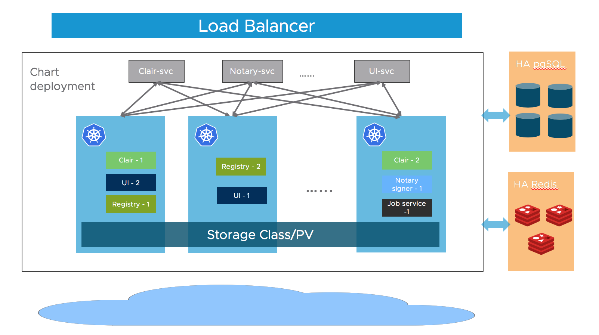

# Harbo

Harbor是由VMware公司开源的企业级的Docker Registry管理项目，它包括权限管理(RBAC)、LDAP、日志审核、管理界面、自我注册、镜像复制和中文支持等功能，具有web管理功能，有了它之后能够很方便的管理容器镜像，搭配Jenkins使用很是方便。

同时Harbor也支持做为Helm的仓库。

官网地址：https://goharbor.io/

github地址：https://github.com/goharbor/harbor

## 1. 架构

大多数的Harbor组件都是无状态的，这意味着我们可以部署多个工作节点来提供其性能和效率，k8s提供了这样的动态扩缩容能力。

存储层需要部署高可用的PostgreSQL, Redis集群。

Notary：负责镜像认证。

Registry：负责存储镜像文件。

Job Sevice：负责镜像复制工作的，他和registry通信，从一个registry pull镜像然后push到另一个registry，并记录job_log。

UI: 图形化界面，提供管理功能。

Clair：CoreOS发布的一个工具，用于容器镜像安全，比如扫描漏洞等

## 2. Helm安装Harbo

~~~shell
[root@master ~]# cd /mnt/k8s/
[root@master k8s]# mkdir harbor
[root@master k8s]# cd harbor/
[root@master harbor]# helm repo add harbor https://helm.goharbor.io
"harbor" has been added to your repositories
[root@master harbor]# helm fetch harbor/harbor --untar
[root@master harbor]# ll
总用量 0
drwxr-xr-x 5 root root 135 9月  21 10:11 harbor
[root@master harbor]# cd harbor/
[root@master harbor]# ll
总用量 252
drwxr-xr-x  2 root root     36 9月  21 10:11 cert
-rw-r--r--  1 root root    567 9月  21 10:11 Chart.yaml
drwxr-xr-x  2 root root     58 9月  21 10:11 conf
-rw-r--r--  1 root root  11357 9月  21 10:11 LICENSE
-rw-r--r--  1 root root 201545 9月  21 10:11 README.md
drwxr-xr-x 16 root root    253 9月  21 10:11 templates
-rw-r--r--  1 root root  33624 9月  21 10:11 values.yaml
~~~

### 2.1 配置

修改values.yaml:

~~~yaml
#这里我只给出修改的参数，未修改的按照应用默认参数即可
expose:
  type: ingress
  tls:
    ### 是否启用 https 协议
    enabled: true
    secret:  "testharbor.com"
  ingress:
    hosts:
      ### 配置 Harbor 的访问域名，需要注意的是配置 notary 域名要和 core 处第一个单词外，其余保持一致
      core: testharbor.com
      notary: notary.testharbor.com
    controller: default
    annotations:
      ingress.kubernetes.io/ssl-redirect: "true"
      ingress.kubernetes.io/proxy-body-size: "1024m"
      #### 如果是 nginx ingress，则按下面配置：
      nginx.ingress.kubernetes.io/ssl-redirect: "true"
      nginx.ingress.kubernetes.io/proxy-body-size: "1024m"
      nginx.org/client-max-body-size: "1024m"

## 如果Harbor部署在代理后，将其设置为代理的URL，这个值一般要和上面的 Ingress 配置的地址保存一致
externalURL: https://testharbor.com

### Harbor 各个组件的持久化配置，这里仍旧使用nfs
### nfs-storage需要提前创建nfs和storageClass
persistence:
  enabled: true
  ### 存储保留策略，当PVC、PV删除后，是否保留存储数据
  resourcePolicy: "keep"
  persistentVolumeClaim:
    registry:
      existingClaim: ""
      storageClass: "nfs-storage"
      size: 20Gi
    chartmuseum:
      existingClaim: ""
      storageClass: "nfs-storage"
      size: 5Gi
    jobservice:
      jobLog:
        existingClaim: ""
        storageClass: "nfs-storage"
        size: 1Gi
      scanDataExports:
        existingClaim: ""
        storageClass: "nfs-storage"
        size: 1Gi
    database:
      existingClaim: ""
      storageClass: "nfs-storage"
      size: 1Gi
    redis:
      existingClaim: ""
      storageClass: "nfs-storage"
      size: 1Gi
    trivy:
      existingClaim: ""
      storageClass: "nfs-storage"
      size: 5Gi

~~~

### 2.2 安装nfs

前面的课程已经安装过。

~~~shell
yum install -y nfs-utils #这条命令所有节点master、worker都执行

[root@master harbor]# echo "/data/harbor *(insecure,rw,sync,no_root_squash)" > /etc/exports
[root@master harbor]# mkdir -p /data/harbor/{chartmuseum,jobservice,registry,database,redis,trivy}
# 在master执行
[root@master harbor]# chmod -R 777 /data/harbor
#使配置生效
[root@master harbor]# exportfs -r
[root@master harbor]# systemctl start nfs
~~~

### 2.3 配置StorageClass

~~~shell
[root@master harbor]# kubectl create ns harbor
namespace/harbor created
~~~

vim harbor-storage.yaml

~~~yaml
apiVersion: storage.k8s.io/v1 ## 创建了一个存储类
kind: StorageClass
metadata:
  name: nfs-storage
  annotations:
    storageclass.kubernetes.io/is-default-class: "true"
  namespace: harbor
provisioner: harbor-data  #Deployment中spec.template.spec.containers.env.name.PROVISIONER_NAME 保持一致
parameters:
  archiveOnDelete: "true"  ## 删除pv的时候，pv的内容是否要备份

---
apiVersion: apps/v1
kind: Deployment
metadata:
  name: nfs-client-provisioner
  labels:
    app: nfs-client-provisioner
  namespace: harbor
spec:
  replicas: 1
  strategy:
    type: Recreate
  selector:
    matchLabels:
      app: nfs-client-provisioner
  template:
    metadata:
      labels:
        app: nfs-client-provisioner
    spec:
      serviceAccountName: nfs-client-provisioner
      containers:
        - name: nfs-client-provisioner
          image: registry.cn-hangzhou.aliyuncs.com/lfy_k8s_images/nfs-subdir-external-provisioner:v4.0.2
          volumeMounts:
            - name: nfs-client-root
              mountPath: /persistentvolumes
          env:
            - name: PROVISIONER_NAME
              value: harbor-data
            - name: NFS_SERVER
              value: 192.168.200.101 ## 指定自己nfs服务器地址
            - name: NFS_PATH  
              value: /data/harbor  ## nfs服务器共享的目录
      volumes:
        - name: nfs-client-root
          nfs:
            server: 192.168.200.101
            path: /data/harbor
---
apiVersion: v1
kind: ServiceAccount
metadata:
  name: nfs-client-provisioner
  namespace: harbor
---
kind: ClusterRole
apiVersion: rbac.authorization.k8s.io/v1
metadata:
  name: nfs-client-provisioner-runner
rules:
  - apiGroups: [""]
    resources: ["nodes"]
    verbs: ["get", "list", "watch"]
  - apiGroups: [""]
    resources: ["persistentvolumes"]
    verbs: ["get", "list", "watch", "create", "delete"]
  - apiGroups: [""]
    resources: ["persistentvolumeclaims"]
    verbs: ["get", "list", "watch", "update"]
  - apiGroups: ["storage.k8s.io"]
    resources: ["storageclasses"]
    verbs: ["get", "list", "watch"]
  - apiGroups: [""]
    resources: ["events"]
    verbs: ["create", "update", "patch"]
---
kind: ClusterRoleBinding
apiVersion: rbac.authorization.k8s.io/v1
metadata:
  name: run-nfs-client-provisioner
subjects:
  - kind: ServiceAccount
    name: nfs-client-provisioner
    namespace: harbor
roleRef:
  kind: ClusterRole
  name: nfs-client-provisioner-runner
  apiGroup: rbac.authorization.k8s.io
---
kind: Role
apiVersion: rbac.authorization.k8s.io/v1
metadata:
  name: leader-locking-nfs-client-provisioner
  namespace: harbor
rules:
  - apiGroups: [""]
    resources: ["endpoints"]
    verbs: ["get", "list", "watch", "create", "update", "patch"]
---
kind: RoleBinding
apiVersion: rbac.authorization.k8s.io/v1
metadata:
  name: leader-locking-nfs-client-provisioner
  namespace: harbor
subjects:
  - kind: ServiceAccount
    name: nfs-client-provisioner
    namespace: harbor
roleRef:
  kind: Role
  name: leader-locking-nfs-client-provisioner
  apiGroup: rbac.authorization.k8s.io

~~~

~~~shell
[root@master harbor]# kubectl apply -f harbor-storage.yaml
storageclass.storage.k8s.io/nfs-storage created
deployment.apps/nfs-client-provisioner created
serviceaccount/nfs-client-provisioner created
clusterrole.rbac.authorization.k8s.io/nfs-client-provisioner-runner created
clusterrolebinding.rbac.authorization.k8s.io/run-nfs-client-provisioner created
role.rbac.authorization.k8s.io/leader-locking-nfs-client-provisioner created
rolebinding.rbac.authorization.k8s.io/leader-locking-nfs-client-provisioner created
~~~

### 2.4 生成证书

1. 创建ca证书

   ~~~shell
   [root@master harbor]# mkdir crt
   [root@master harbor]# cd crt/
   # 生成 CA 证书私钥
   [root@master crt]# openssl genrsa -out ca.key 4096
   Generating RSA private key, 4096 bit long modulus
   ..++
   ..++
   e is 65537 (0x10001)
   # 生成 CA 证书
   [root@master crt]# openssl req -x509 -new -nodes -sha512 -days 3650 \
     -subj "/C=CN/ST=Beijing/L=Beijing/O=example/OU=Personal/CN=testharbor.com" \
     -key ca.key \
     -out ca.crt
   [root@master crt]# ll
   总用量 8
   -rw-r--r-- 1 root root 2033 9月  21 11:09 ca.crt
   -rw-r--r-- 1 root root 3243 9月  21 11:09 ca.key
   ~~~

2. 创建域名证书

   * 生成私钥

     ~~~shell
     [root@master crt]# openssl genrsa -out testharbor.com.key 4096
     Generating RSA private key, 4096 bit long modulus
     .......++
     ................................++
     e is 65537 (0x10001)
     ~~~

   * 生成证书签名请求CSR

     ~~~shell
     openssl req -sha512 -new \
         -subj "/C=CN/ST=Beijing/L=Beijing/O=example/OU=Personal/CN=*.testharbor.com" \
         -key testharbor.com.key \
         -out testharbor.com.csr
     ~~~

   * 生成 x509 v3 扩展

     ~~~shell
     cat > v3.ext <<-EOF
     authorityKeyIdentifier=keyid,issuer
     basicConstraints=CA:FALSE
     keyUsage = digitalSignature, nonRepudiation, keyEncipherment, dataEncipherment
     extendedKeyUsage = serverAuth
     subjectAltName = @alt_names
     
     [alt_names]
     DNS.1=testharbor.com
     DNS.2=*.testharbor.com
     DNS.3=hostname
     EOF
     ~~~

   * 创建 Harbor 访问证书

     ~~~shell
     openssl x509 -req -sha512 -days 3650 \
         -extfile v3.ext \
         -CA ca.crt -CAkey ca.key -CAcreateserial \
         -in testharbor.com.csr \
         -out testharbor.com.crt
     
     ~~~

     

   * 将 crt 转换为 cert ，以供 Docker 使用

     ~~~shell
     openssl x509 -inform PEM -in testharbor.com.crt -out testharbor.com.cert
     ~~~

3. 最终目录

   ~~~shell
   [root@master crt]# ll
   总用量 32
   -rw-r--r-- 1 root root 2033 9月  21 11:09 ca.crt
   -rw-r--r-- 1 root root 3243 9月  21 11:09 ca.key
   -rw-r--r-- 1 root root   17 9月  21 11:15 ca.srl
   -rw-r--r-- 1 root root 2114 9月  21 11:15 testharbor.com.cert
   -rw-r--r-- 1 root root 2114 9月  21 11:15 testharbor.com.crt
   -rw-r--r-- 1 root root 1712 9月  21 11:11 testharbor.com.csr
   -rw-r--r-- 1 root root 3243 9月  21 11:11 testharbor.com.key
   -rw-r--r-- 1 root root  271 9月  21 11:14 v3.ext
   ~~~

### 2.5 部署

- 创建证书秘钥

  ~~~shell
  [root@master crt]# kubectl create secret tls testharbor.com --key testharbor.com.key --cert testharbor.com.cert -n harbor
  secret/testharbor.com created
  [root@master crt]# kubectl get secret testharbor.com -n harbor
  NAME             TYPE                DATA   AGE
  testharbor.com   kubernetes.io/tls   2      5s
  ~~~

  

- 安装

  ~~~shell
  [root@master harbor]# helm install myharbor --namespace harbor ./harbor
  NAME: myharbor
  LAST DEPLOYED: Wed Sep 21 11:19:18 2022
  NAMESPACE: harbor
  STATUS: deployed
  REVISION: 1
  TEST SUITE: None
  NOTES:
  Please wait for several minutes for Harbor deployment to complete.
  Then you should be able to visit the Harbor portal at https://testharbor.com
  For more details, please visit https://github.com/goharbor/harbor
  ~~~

- 测试

  ~~~shell
  [root@master harbor]# kubectl get pods -n harbor
  ~~~

  ~~~shell
  [root@master harbor]# kubectl get po -n ingress-nginx -o wide
  [root@master harbor]# kubectl get node master -o wide 
  [root@master harbor]# kubectl get ingress -n harbor
  ~~~

  