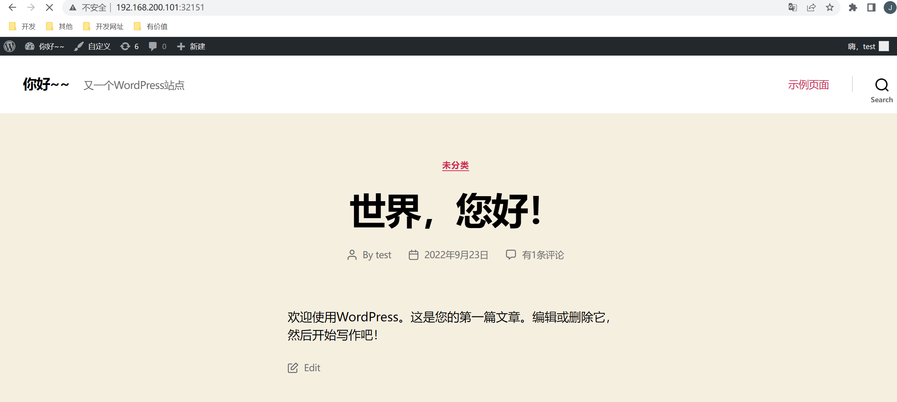
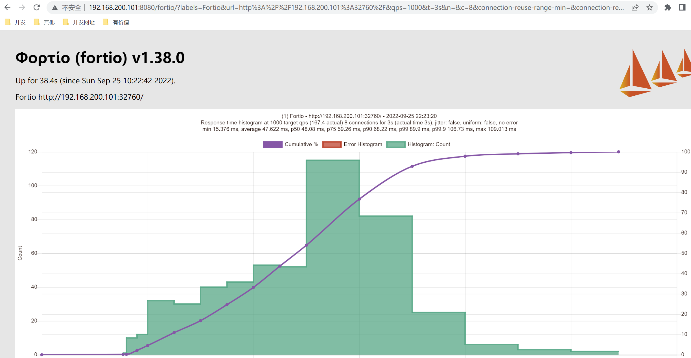
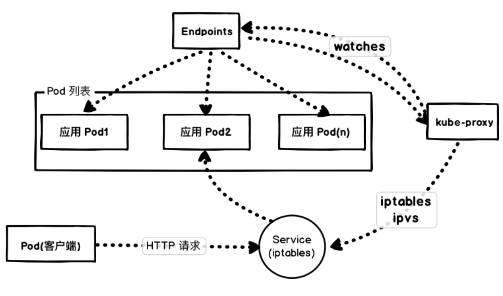

# wordpress实战部署

wordpress是php实现的一个CMS系统，被广泛用来做为博客，网站等，应用度非常高，比较适合拿来做例子。

我们需要达到的目的是让 Wordpress 应用具有高可用、滚动更新的过程中不能中断服务、数据要持久化不能丢失、当应用负载太高的时候能够自动进行扩容等等，这些是我们的应用部署到线上环境基本上要具备的一些能力，接下来我们就来一步一步完成这些需求。

## 1. 原理

有部署worpress首先要了解其原理，wordpress运行需要一个能够解析 PHP 的程序，和 MySQL 数据库就可以了。

Wordpress 应用本身会频繁的和 MySQL 数据库进行交互，这种情况下如果将二者用容器部署在同一个 Pod 下面会高效很多，因为一个 Pod 下面的所有容器是共享同一个 network namespace 的，下面我们就来部署我们的应用，将我们的应用都部署到 kube-example 这个命名空间下面，所以首先创建一个命名空间：(namespace.yaml)

```yaml
apiVersion: v1
kind: Namespace
metadata:
  name: kube-example
```


然后编写部署到 Kubernetes 下面的资源清单：(deployment.yaml)

```yaml
apiVersion: apps/v1
kind: Deployment
metadata:
  name: wordpress
  namespace: kube-example
  labels:
    app: wordpress
spec:
  selector:
    matchLabels:
      app: wordpress
  template:
    metadata:
      labels:
        app: wordpress
    spec:
      containers:
      - name: wordpress
        image: wordpress:5.3.2-apache
        ports:
        - containerPort: 80
          name: wdport
        env:
        - name: WORDPRESS_DB_HOST
          value: 127.0.0.1:3306
        - name: WORDPRESS_DB_USER
          value: wordpress
        - name: WORDPRESS_DB_PASSWORD
          value: wordpress
      - name: mysql
        image: mysql:5.7
        imagePullPolicy: IfNotPresent
        args:  # 新版本镜像有更新，需要使用下面的认证插件环境变量配置才会生效
        - --default_authentication_plugin=mysql_native_password
        - --character-set-server=utf8mb4
        - --collation-server=utf8mb4_unicode_ci
        ports:
        - containerPort: 3306
          name: dbport
        env:
        - name: MYSQL_ROOT_PASSWORD
          value: rootPassW0rd
        - name: MYSQL_DATABASE
          value: wordpress
        - name: MYSQL_USER
          value: wordpress
        - name: MYSQL_PASSWORD
          value: wordpress
```


由于我们这里 MySQL 和 Wordpress 在同一个 Pod 下面，所以在 Wordpress 中我们指定数据库地址的时候是用的 `127.0.0.1:3306`，因为这两个容器已经共享同一个 network namespace 了，这点很重要，然后如果我们要想把这个服务暴露给外部用户还得创建一个 Service 或者 Ingress 对象，这里我们一步一步来，暂时先创建一个 NodePort 类型的 Service：(service.yaml)

```yaml
apiVersion: v1
kind: Service
metadata:
  name: wordpress
  namespace: kube-example
spec:
  selector:
    app: wordpress
  type: NodePort
  ports:
  - name: web
    port: 80
    targetPort: wdport
```


因为只需要暴露 Wordpress 这个应用，所以只匹配了一个名为 `wdport` 的端口，现在我们来创建上面的几个资源对象：

```shell
$ kubectl apply -f namespace.yaml
$ kubectl apply -f deployment.yaml
$ kubectl apply -f service.yaml
```


接下来就是等待拉取镜像，启动 Pod:

```shell
[root@master wordpress]# kubectl get pods -n kube-example                                        
NAME                        READY   STATUS    RESTARTS   AGE
wordpress-5786b67ff-8wvhs   2/2     Running   0          7s
[root@master wordpress]# kubectl get service -n kube-example         
NAME        TYPE       CLUSTER-IP       EXTERNAL-IP   PORT(S)        AGE
wordpress   NodePort   10.106.115.145   <none>        80:32179/TCP   31s
```


当 Pod 启动完成后，我们就可以通过上面的 `http://<节点IP>:32179` 这个 NodePort 端口来访问应用了。

我们仔细想一想这一种方式有什么问题？首先一个 Pod 中的所有容器并没有启动的先后顺序，所以很有可能当 wordpress 这个容器启动起来去连接 mysql 这个容器的时候，mysql 还没有启动起来；

另外一个问题是现在我们的应用是不是只有一个副本？会有单点问题，应用的性能也是一个问题，由于 Wordpress 应用本身是无状态应用，所以这种情况下一般我们只需要多部署几个副本即可，比如这里我们在 Deployment 的 YAML 文件中加上 `replicas:3` 这个属性。

这个时候有一个什么问题呢？由于 MySQL 是有状态应用，每一个 Pod 里面的数据库的数据都是独立的，他们并没有共享，也就是说这3个 Pod 相当于是独立的3个 Wordpress 实例，所以应该怎么办呢？拆分，把 Wordpress 和 MySQL 这两个容器部署成独立的 Pod 就可以了，这样我们只需要对 Wordpress 应用增加副本，而数据库 MySQL 还是一个实例，所有的应用都连接到这一个数据库上面，是不是就可以解决这个问题了。

## 2. 高可用

现在我们将 Pod 中的两个容器进行拆分，将 Wordpress 和 MySQL 分别部署，然后 Wordpress 用多个副本进行部署就可以实现应用的高可用了，由于 MySQL 是有状态应用，一般来说需要用 StatefulSet 来进行管理，但是我们这里部署的 MySQL 并不是集群模式，而是单副本的，所以用 Deployment 也是没有问题的，当然如果要真正用于生产环境还是需要集群模式的：（mysql.yaml）

```yaml
apiVersion: v1
kind: Service
metadata:
  name: wordpress-mysql
  namespace: kube-example
  labels:
    app: wordpress
spec:
  ports:
  - port: 3306
    targetPort: dbport
  selector:
    app: wordpress
    tier: mysql
---
apiVersion: apps/v1
kind: Deployment
metadata:
  name: wordpress-mysql
  namespace: kube-example
  labels:
    app: wordpress
    tier: mysql
spec:
  selector:
    matchLabels:
      app: wordpress
      tier: mysql
  template:
    metadata:
      labels:
        app: wordpress
        tier: mysql
    spec:
      containers:
      - name: mysql
        image: mysql:5.7
        imagePullPolicy: IfNotPresent
        args:  # 新版本镜像有更新，需要使用下面的认证插件环境变量配置才会生效
        - --default_authentication_plugin=mysql_native_password
        - --character-set-server=utf8mb4
        - --collation-server=utf8mb4_unicode_ci
        ports:
        - containerPort: 3306
          name: dbport
        env:
        - name: MYSQL_ROOT_PASSWORD
          value: rootPassW0rd
        - name: MYSQL_DATABASE
          value: wordpress
        - name: MYSQL_USER
          value: wordpress
        - name: MYSQL_PASSWORD
          value: wordpress
```


我们这里给 MySQL 应用添加了一个 Service 对象，是因为 Wordpress 应用需要来连接数据库，之前在同一个 Pod 中用 `localhost` 即可，现在需要通过 Service 的 DNS 形式的域名进行连接。直接创建上面资源对象：

```shell
[root@master wordpress]# kubectl apply -f mysql.yaml 
service/wordpress-mysql created
deployment.apps/wordpress-mysql created
```


接下来创建独立的 Wordpress 服务，对应的资源对象如下：（wordpress.yaml）

```yaml
apiVersion: v1
kind: Service
metadata:
  name: wordpress
  namespace: kube-example
  labels:
    app: wordpress
spec:
  selector:
    app: wordpress
    tier: frontend
  type: NodePort
  ports:
  - name: web
    port: 80
    targetPort: wdport
---
apiVersion: apps/v1
kind: Deployment
metadata:
  name: wordpress
  namespace: kube-example
  labels:
    app: wordpress
    tier: frontend
spec:
  replicas: 3
  selector:
    matchLabels:
      app: wordpress
      tier: frontend
  template:
    metadata:
      labels:
        app: wordpress
        tier: frontend
    spec:
      containers:
      - name: wordpress
        image: wordpress:5.3.2-apache
        ports:
        - containerPort: 80
          name: wdport
        env:
        - name: WORDPRESS_DB_HOST
          value: wordpress-mysql:3306
        - name: WORDPRESS_DB_USER
          value: wordpress
        - name: WORDPRESS_DB_PASSWORD
          value: wordpress
```


注意这里的环境变量 `WORDPRESS_DB_HOST` 的值将之前的 `localhost` 地址更改成了上面 MySQL 服务的 DNS 地址，完整的域名应该是 `wordpress-mysql.kube-example.svc.cluster.local:3306`，由于这两个应该都处于同一个命名空间，所以直接简写成 `wordpress-mysql:3306` 也是可以的。创建上面资源对象：

```shell
[root@master wordpress]# kubectl apply -f wordpress.yaml
service/wordpress created
deployment.apps/wordpress created
[root@master wordpress]# kubectl get pods -l app=wordpress -n kube-example
NAME                               READY   STATUS    RESTARTS   AGE
wordpress-85b946ff8b-2mw87         1/1     Running   0          5m2s
wordpress-85b946ff8b-72lnv         1/1     Running   0          5m2s
wordpress-85b946ff8b-kfn88         1/1     Running   0          5m2s
wordpress-mysql-5d7dccb894-l9mnt   1/1     Running   0          6m8s
```


可以看到都已经是 `Running` 状态了，然后我们需要怎么来验证呢？是不是我们能想到的就是去访问下我们的 Wordpress 服务就可以了，我们这里还是使用的一个 NodePort 类型的 Service 来暴露服务：

```shell
[root@master wordpress]# kubectl get svc -l app=wordpress -n kube-example
NAME              TYPE        CLUSTER-IP       EXTERNAL-IP   PORT(S)        AGE
wordpress         NodePort    10.102.253.21    <none>        80:32151/TCP   37s
wordpress-mysql   ClusterIP   10.105.179.202   <none>        3306/TCP       103s
```


可以看到 wordpress 服务产生了一个 32151 的端口，现在我们就可以通过 `http://<节点的NodeIP>:32151` 访问我们的应用了，在浏览器中打开，如果看到 wordpress 跳转到了安装页面，证明我们的安装是正确的，如果没有出现预期的效果，那么就需要去查看下 Pod 的日志来排查问题了，根据页面提示，填上对应的信息，点击`“安装”`即可，最终安装成功后，我们就可以看到熟悉的首页界面了：



## 3. 稳定性

现在 Wodpress 应用已经部署成功了，那么就万事大吉了吗？如果我们的网站访问量突然变大了怎么办，如果我们要更新我们的镜像该怎么办？所以要保证我们的网站能够非常稳定的提供服务，我们做得还不够，我们可以通过做些什么事情来提高网站的稳定性呢？

### 3.1 避免单点故障

为什么会有单点故障的问题呢？我们不是部署了多个副本的 Wordpress 应用吗？当我们设置 `replicas=1` 的时候肯定会存在单点故障问题，如果大于 1 但是所有副本都调度到了同一个节点的是不是同样就会存在单点问题了，这个节点挂了所有副本就都挂了，所以我们不仅需要设置多个副本数量，还需要让这些副本调度到不同的节点上，来打散避免单点故障，这个利用 Pod 反亲和性来实现了，我们可以加上如下所示的配置：

```yaml
apiVersion: v1
kind: Service
metadata:
  name: wordpress
  namespace: kube-example
  labels:
    app: wordpress
spec:
  selector:
    app: wordpress
    tier: frontend
  type: NodePort
  ports:
  - name: web
    port: 80
    targetPort: wdport
---
apiVersion: apps/v1
kind: Deployment
metadata:
  name: wordpress
  namespace: kube-example
  labels:
    app: wordpress
    tier: frontend
spec:
  replicas: 3
  selector:
    matchLabels:
      app: wordpress
      tier: frontend
  template:
    metadata:
      labels:
        app: wordpress
        tier: frontend
    spec:
      containers:
      - name: wordpress
        image: wordpress:5.3.2-apache
        ports:
        - containerPort: 80
          name: wdport
        env:
        - name: WORDPRESS_DB_HOST
          value: wordpress-mysql:3306
        - name: WORDPRESS_DB_USER
          value: wordpress
        - name: WORDPRESS_DB_PASSWORD
          value: wordpress
      affinity:
        podAntiAffinity:
          preferredDuringSchedulingIgnoredDuringExecution:  # 软策略
          - weight: 1
            podAffinityTerm:
              topologyKey: kubernetes.io/hostname
              labelSelector:
                matchExpressions:
                - key: app
                  operator: In
                  values:
                  - wordpress 
```


这里的意思就是如果一个节点上面有 `app=wordpress` 这样的 Pod 的话，那么我们的 Pod 就尽可能别调度到这个节点上面来，因为我们这里的节点并不多，所以我使用的是软策略，因为如果使用硬策略的话，如果应用副本数超过了节点数就必然会有 Pod 调度不成功，如果你线上节点非常多的话（节点数大于 Pod 副本数），建议使用硬策略，更新后我们可以查看下 3 个副本被分散在了不同的节点上。

### 3.2 使用 PDB

有些时候线上的某些节点需要做一些维护操作，比如要升级内核，这个时候我们就需要将要维护的节点进行驱逐操作，驱逐节点首先是将节点设置为不可调度，这样可以避免有新的 Pod 调度上来，然后将该节点上的 Pod 全部删除，ReplicaSet 控制器检测到 Pod 数量减少了就会重新创建一个新的 Pod，调度到其他节点上面，这个过程是先删除，再创建，并非是滚动更新，因此更新过程中，如果一个服务的所有副本都在被驱逐的节点上，则可能导致该服务不可用。

如果服务本身存在单点故障，所有副本都在同一个节点，驱逐的时候肯定就会造成服务不可用了，这种情况我们使用上面的反亲和性和多副本就可以解决这个问题。但是如果我们的服务本身就被打散在多个节点上，这些节点如果都被同时驱逐的话，那么这个服务的所有实例都会被同时删除，这个时候也会造成服务不可用了，这种情况下我们可以通过配置 PDB（PodDisruptionBudget）对象来避免所有副本同时被删除，比如我们可以设置在驱逐的时候 wordpress 应用最多只有一个副本不可用，其实就相当于逐个删除并在其它节点上重建：（pdb.yaml）

```yaml
apiVersion: policy/v1beta1
kind: PodDisruptionBudget
metadata:
  name: wordpress-pdb
  namespace: kube-example
spec:
  maxUnavailable: 1
  selector:
    matchLabels:
      app: wordpress
      tier: frontend
```


直接创建这个资源对象即可：

```shell
[root@master wordpress]# kubectl apply -f pdb.yaml 
Warning: policy/v1beta1 PodDisruptionBudget is deprecated in v1.21+, unavailable in v1.25+; use policy/v1 PodDisruptionBudget
poddisruptionbudget.policy/wordpress-pdb created
[root@master wordpress]# kubectl get pdb -n kube-example
NAME            MIN AVAILABLE   MAX UNAVAILABLE   ALLOWED DISRUPTIONS   AGE
wordpress-pdb   N/A             1                 1                     11s
```


关于 PDB 的更多详细信息可以查看官方文档：https://kubernetes.io/docs/tasks/run-application/configure-pdb/。

### 3.3 健康检查

我们的应用现在还有一个非常重要的功能没有提供，那就是健康检查，我们知道健康检查是提高应用健壮性非常重要的手段，当我们检测到应用不健康的时候我们希望可以自动重启容器，当应用还没有准备好的时候我们也希望暂时不要对外提供服务，所以我们需要 `liveness probe` 和 `rediness probe` 两个健康检测探针，检查探针的方式有很多，我们这里当然可以认为如果容器的 80 端口可以成功访问那么就是健康的，对于一般的应用提供一个健康检查的 URL 会更好，这里我们添加一个如下所示的可读性探针，为什么不添加存活性探针呢？这里其实是考虑到线上错误排查的一个问题，如果当我们的应用出现了问题，然后就自动重启去掩盖错误的话，可能这个错误就会被永远忽略掉了，所以其实这是一个折衷的做法，不使用存活性探针，而是结合监控报警，保留错误现场，方便错误排查，但是可读写探针是一定需要添加的：

```yaml
apiVersion: v1
kind: Service
metadata:
  name: wordpress
  namespace: kube-example
  labels:
    app: wordpress
spec:
  selector:
    app: wordpress
    tier: frontend
  type: NodePort
  ports:
  - name: web
    port: 80
    targetPort: wdport
---
apiVersion: apps/v1
kind: Deployment
metadata:
  name: wordpress
  namespace: kube-example
  labels:
    app: wordpress
    tier: frontend
spec:
  replicas: 3
  selector:
    matchLabels:
      app: wordpress
      tier: frontend
  template:
    metadata:
      labels:
        app: wordpress
        tier: frontend
    spec:
      containers:
      - name: wordpress
        image: wordpress:5.3.2-apache
        ports:
        - containerPort: 80
          name: wdport
        env:
        - name: WORDPRESS_DB_HOST
          value: wordpress-mysql:3306
        - name: WORDPRESS_DB_USER
          value: wordpress
        - name: WORDPRESS_DB_PASSWORD
          value: wordpress
        readinessProbe:
          tcpSocket:
            port: 80
          initialDelaySeconds: 5
          periodSeconds: 5
      affinity:
        podAntiAffinity:
          preferredDuringSchedulingIgnoredDuringExecution:  # 软策略
          - weight: 1
            podAffinityTerm:
              topologyKey: kubernetes.io/hostname
              labelSelector:
                matchExpressions:
                - key: app
                  operator: In
                  values:
                  - wordpress 
```


增加上面的探针，每 5s 检测一次应用是否可读，这样只有当 `readinessProbe` 探针检测成功后才表示准备好接收流量了，这个时候才会更新 Service 的 Endpoints 对象。

### 3.4 服务质量 QoS

`QoS` 是 `Quality of Service` 的缩写，即服务质量。为了实现资源被有效调度和分配的同时提高资源利用率，Kubernetes 针对不同服务质量的预期，通过 `QoS` 来对 Pod 进行服务质量管理。对于一个 Pod 来说，服务质量体现在两个具体的指标：CPU 和内存。当节点上内存资源紧张时，Kubernetes 会根据预先设置的不同 `QoS` 类别进行相应处理。

`QoS` 主要分为 `Guaranteed`、`Burstable` 和 `Best-Effort`三类，优先级从高到低。我们先分别来介绍下这三种服务类型的定义。

#### 3.4.1 Guaranteed(有保证的)

属于该级别的 Pod 有以下两种：

- Pod 中的所有容器都且仅设置了 CPU 和内存的 **limits**
- Pod 中的所有容器都设置了 CPU 和内存的 requests 和 limits ，且单个容器内的`requests==limits`（requests不等于0）

Pod 中的所有容器都且仅设置了 limits，如下所示：

```yaml
containers:
  - name: foo
    resources:
      limits:
        cpu: 10m
        memory: 1Gi
  - name: bar
    resources:
      limits:
        cpu: 100m
        memory: 100Mi
```


Pod 中的所有容器都设置了 requests 和 limits，且单个容器内的 requests==limits 的情况：

```yaml
containers:
  - name: foo
    resources:
      limits:
        cpu: 10m
        memory: 1Gi
      requests:
        cpu: 10m
        memory: 1Gi
  - name: bar
    resources:
      limits:
        cpu: 100m
        memory: 100Mi
      requests:
        cpu: 100m
        memory: 100Mi
```


容器 foo 和 bar 内 `resources` 的 `requests` 和 `limits` 均相等，该 Pod 的 `QoS` 级别属于 `Guaranteed`。

#### 3.4.2 Burstable(不稳定的)

Pod 中只要有一个容器的 requests 和 limits 的设置不相同，那么该 Pod 的 QoS 即为 Burstable。如下所示容器 foo 指定了 resource，而容器 bar 未指定：

```yaml
containers:
  - name: foo
    resources:
      limits:
        cpu: 10m
        memory: 1Gi
      requests:
        cpu: 10m
        memory: 1Gi
  - name: bar
```


容器 foo 设置了内存 limits，而容器 bar 设置了CPU limits：

```yaml
containers:
  - name: foo
    resources:
      limits:
        memory: 1Gi
  - name: bar
    resources:
      limits:
        cpu: 100m
```


需要注意的是如果容器指定了 requests 而未指定 limits，则 limits 的值等于节点资源的最大值，如果容器指定了 limits 而未指定 requests，则 requests 的值等于 limits。

#### 3.4.3 Best-Effort(尽最大努力)

如果 Pod 中所有容器的 resources 均未设置 requests 与 limits，该 Pod 的 QoS 即为 Best-Effort。如下所示容器 foo 和容器 bar 均未设置requests 和 limits：

```yaml
containers:
  - name: foo
    resources:
  - name: bar
    resources:
```


#### 3.4.4 资源回收策略

Kubernetes 通过 CGroup 给 Pod设置 QoS 级别，当资源不足时会优先 kill 掉优先级低的 Pod，在实际使用过程中，通过 `OOM` 分数值来实现，OOM 分数值范围为 0-1000，OOM 分数值根据 `OOM_ADJ`参数计算得出。

对于 `Guaranteed` 级别的 Pod，OOM_ADJ 参数设置成了`-998`，对于 `Best-Effort` 级别的 Pod，OOM_ADJ 参数设置成了`1000`，对于 `Burstable` 级别的 Pod，OOM_ADJ 参数取值从 2 到 999。

QoS Pods 被 kill 掉的场景和顺序如下所示：

- Best-Effort Pods：系统用完了全部内存时，该类型 Pods 会最先被 kill 掉
- Burstable Pods：系统用完了全部内存，且没有 Best-Effort 类型的容器可以被 kill 时，该类型的 Pods 会被 kill 掉
- Guaranteed Pods：系统用完了全部内存，且没有 Burstable 与 Best-Effort 类型的容器可以被 kill 时，该类型的 pods 会被 kill 掉

所以如果资源充足，可将 QoS Pods 类型设置为 Guaranteed，用计算资源换业务性能和稳定性，减少排查问题时间和成本。如果想更好的提高资源利用率，业务服务可以设置为 Guaranteed，而其他服务根据重要程度可分别设置为 Burstable 或 Best-Effort，这就要看具体的场景了。

比如我们这里如果想要尽可能提高 Wordpress 应用的稳定性，我们可以将其设置为 `Guaranteed` 类型的 Pod，我们现在没有设置 resources 资源，所以现在是 `Best-Effort` 类型的 Pod。

现在如果要想给应用设置资源大小，就又有一个问题了，应该如何设置合适的资源大小呢？其实这就需要我们对自己的应用非常了解才行了，一般情况下我们可以先不设置资源，然后可以根据我们的应用的并发和访问量来进行压力测试，基本上可以大概计算出应用的资源使用量，我们这里可以使用 [Apache Bench（AB Test）](http://httpd.apache.org/docs/current/programs/ab.html) 或者 [Fortio（Istio 测试工具）](https://fortio.org/) 这样的测试工具来测试，我们这里使用 Fortio 这个测试工具，比如每秒 1000 个请求和 8 个并发的连接的测试命令如下所示：

```shell
[root@master ~]# rpm -i https://github.com/fortio/fortio/releases/download/v1.38.0/fortio-1.38.0-1.x86_64.rpm

[root@master ~]# 
[root@master ~]# fortio load -a -c 8 -qps 1000 -t 60s "http://192.168.200.101:32760"
# range, mid point, percentile, count
>= 0.000217831 <= 0.001 , 0.000608915 , 92.38, 97
> 0.001 <= 0.00166491 , 0.00133245 , 100.00, 8
# target 50% 0.000637432
# target 75% 0.000851306
# target 90% 0.000979631
# target 99% 0.00157764
# target 99.9% 0.00165618
Sockets used: 105 (for perfect keepalive, would be 8)
Uniform: false, Jitter: false
IP addresses distribution:
192.168.200.101:32760: 105
Code 200 : 10162 (100.0 %)
Response Header Sizes : count 10162 avg 278.18136 +/- 1.847 min 278 max 297 sum 2826879
Response Body/Total Sizes : count 10162 avg 26274.52 +/- 2.994 min 26271 max 26295 sum 267001670
All done 10162 calls (plus 8 warmup) 47.235 ms avg, 169.3 qps
Successfully wrote 5572 bytes of Json data to 2022-09-25-102015_192_168_200_101_32760_master.json
```


也可以通过浏览器查看到最终测试结果：

~~~shell
[root@master ~]# fortio server
10:22:42 Fortio 1.38.0 tcp-echo server listening on tcp [::]:8078
10:22:42 Fortio 1.38.0 udp-echo server listening on udp [::]:8078
10:22:42 Fortio 1.38.0 grpc 'ping' server listening on tcp [::]:8079
10:22:42 Fortio 1.38.0 https redirector server listening on tcp [::]:8081
10:22:42 Fortio 1.38.0 http-echo server listening on tcp [::]:8080
10:22:42 Data directory is /root
10:22:42 REST API on /fortio/rest/run, /fortio/rest/status, /fortio/rest/stop
         UI started - visit:
                http://localhost:8080/fortio/
         (or any host/ip reachable on this server)
~~~




在测试期间我们可以用如下所示的命令查看应用的资源使用情况：

```shell
[root@master ~]# kubectl top pods -l app=wordpress -n kube-example
NAME                               CPU(cores)   MEMORY(bytes)   
wordpress-bff866b4d-6wkrk          727m         91Mi            
wordpress-bff866b4d-hsbw6          749m         66Mi            
wordpress-bff866b4d-ks7hd          772m         90Mi            
wordpress-mysql-5d8c9c4d88-bpdqd   694m         204Mi
```


我们可以看到内存基本上都是处于 100Mi 以内，而 CPU 消耗就非常大了，但是由于 CPU 是可压缩资源，也就是说超过了限制应用也不会挂掉的，只是会变慢而已。所以我们这里可以给 Wordpress 应用添加如下所示的资源配置，如果你集群资源足够的话可以适当多分配一些资源：

```yaml
resources:
  limits:
    cpu: 200m
    memory: 100Mi
  requests:
    cpu: 200m
    memory: 100Mi
```

~~~yaml
apiVersion: v1
kind: Service
metadata:
  name: wordpress
  namespace: kube-example
  labels:
    app: wordpress
spec:
  selector:
    app: wordpress
    tier: frontend
  type: NodePort
  ports:
  - name: web
    port: 80
    targetPort: wdport
---
apiVersion: apps/v1
kind: Deployment
metadata:
  name: wordpress
  namespace: kube-example
  labels:
    app: wordpress
    tier: frontend
spec:
  replicas: 3
  selector:
    matchLabels:
      app: wordpress
      tier: frontend
  template:
    metadata:
      labels:
        app: wordpress
        tier: frontend
    spec:
      containers:
      - name: wordpress
        image: wordpress:5.3.2-apache
        ports:
        - containerPort: 80
          name: wdport
        env:
        - name: WORDPRESS_DB_HOST
          value: wordpress-mysql:3306
        - name: WORDPRESS_DB_USER
          value: wordpress
        - name: WORDPRESS_DB_PASSWORD
          value: wordpress
        readinessProbe:
          tcpSocket:
            port: 80
          initialDelaySeconds: 5
          periodSeconds: 5
        resources:
          limits:
            cpu: 200m
            memory: 100Mi
          requests:
            cpu: 200m
            memory: 100Mi
      affinity:
        podAntiAffinity:
          preferredDuringSchedulingIgnoredDuringExecution:  # 软策略
          - weight: 1
            podAffinityTerm:
              topologyKey: kubernetes.io/hostname
              labelSelector:
                matchExpressions:
                - key: app
                  operator: In
                  values:
                  - wordpress 
~~~

## 4. 滚动更新

Deployment 控制器默认的就是滚动更新的更新策略，该策略可以在任何时间点更新应用的时候保证某些实例依然可以正常运行来防止应用 down 掉，当新部署的 Pod 启动并可以处理流量之后，才会去杀掉旧的 Pod。在使用过程中我们还可以指定 Kubernetes 在更新期间如何处理多个副本的切换方式，比如我们有一个3副本的应用，在更新的过程中是否应该立即创建这3个新的 Pod 并等待他们全部启动，或者杀掉一个之外的所有旧的 Pod，或者还是要一个一个的 Pod 进行替换？

如果我们从旧版本到新版本进行滚动更新，只是简单的通过输出显示来判断哪些 Pod 是存活并准备就绪的，那么这个滚动更新的行为看上去肯定就是有效的，但是往往实际情况就是从旧版本到新版本的切换的过程并不总是十分顺畅的，应用程序很有可能会丢弃掉某些客户端的请求。比如我们在 Wordpress 应用中添加上如下的滚动更新策略，随便更改以下 Pod Template 中的参数，比如容器名更改为 blog：

```yaml
apiVersion: v1
kind: Service
metadata:
  name: wordpress
  namespace: kube-example
  labels:
    app: wordpress
spec:
  selector:
    app: wordpress
    tier: frontend
  type: NodePort
  ports:
  - name: web
    port: 80
    targetPort: wdport
---
apiVersion: apps/v1
kind: Deployment
metadata:
  name: wordpress
  namespace: kube-example
  labels:
    app: wordpress
    tier: frontend
spec:
  strategy:
    type: RollingUpdate
    rollingUpdate:
      maxSurge: 1
      maxUnavailable: 0
  replicas: 3
  selector:
    matchLabels:
      app: wordpress
      tier: frontend
  template:
    metadata:
      labels:
        app: wordpress
        tier: frontend
    spec:
      containers:
      - name: blog
        image: wordpress:5.3.2-apache
        ports:
        - containerPort: 80
          name: wdport
        env:
        - name: WORDPRESS_DB_HOST
          value: wordpress-mysql:3306
        - name: WORDPRESS_DB_USER
          value: wordpress
        - name: WORDPRESS_DB_PASSWORD
          value: wordpress
        readinessProbe:
          tcpSocket:
            port: 80
          initialDelaySeconds: 5
          periodSeconds: 5
        resources:
          limits:
            cpu: 200m
            memory: 100Mi
          requests:
            cpu: 200m
            memory: 100Mi
      affinity:
        podAntiAffinity:
          preferredDuringSchedulingIgnoredDuringExecution:  # 软策略
          - weight: 1
            podAffinityTerm:
              topologyKey: kubernetes.io/hostname
              labelSelector:
                matchExpressions:
                - key: app
                  operator: In
                  values:
                  - wordpress 

```


然后更新应用，同时用 Fortio 工具在滚动更新过程中来测试应用是否可用：

```shell
[root@master ~]# fortio load -a -c 8 -qps 1000 -t 60s "http://192.168.200.101:30490"
Fortio 1.38.0 running at 1000 queries per second, 2->2 procs, for 1m0s: http://192.168.200.101:32760
10:44:14 I httprunner.go:102> Starting http test for http://192.168.200.101:32760 with 8 threads at 1000.0 qps and parallel warmup
Starting at 1000 qps with 8 thread(s) [gomax 2] for 1m0s : 7500 calls each (total 60000)
10:44:21 I http_client.go:890> [0] Closing dead socket 192.168.200.101:32760 (err EOF at first read)
10:44:21 I http_client.go:890> [2] Closing dead socket 192.168.200.101:32760 (err EOF at first read)
10:44:21 E http_client.go:903> [2] Read error for 192.168.200.101:32760 0 : read tcp 192.168.200.101:36882->192.168.200.101:32760: read: connection reset by peer
```


从上面的输出可以看出有部分请求处理失败了，要弄清楚失败的原因就需要弄明白当应用在滚动更新期间重新路由流量时，从旧的 Pod 实例到新的实例究竟会发生什么，首先让我们先看看 Kubernetes 是如何管理工作负载连接的。

### 4.1 失败原因

我们这里通过 NodePort 去访问应用，实际上也是通过每个节点上面的 `kube-proxy` 通过更新 iptables 规则来实现的。



Kubernetes 会根据 Pods 的状态去更新 Endpoints 对象，这样就可以保证 Endpoints 中包含的都是准备好处理请求的 Pod。一旦新的 Pod 处于活动状态并准备就绪后，Kubernetes 就将会停止旧的 Pod，从而将 Pod 的状态更新为 `“Terminating”`，然后从 Endpoints 对象中移除，并且发送一个 `SIGTERM` 信号给 Pod 的主进程。`SIGTERM` 信号就会让容器以正常的方式关闭，并且不接受任何新的连接。Pod 从 Endpoints 对象中被移除后，前面的负载均衡器就会将流量路由到其他（新的）Pod 中去。因为在负载均衡器注意到变更并更新其配置之前，终止信号就会去停用 Pod，而这个重新配置过程又是**异步**发生的，并不能保证正确的顺序，所以就可能导致很少的请求会被路由到已经终止的 Pod 上去了，也就出现了上面我们说的情况。

### 4.2 零宕机

那么如何增强我们的应用程序以实现真正的零宕机迁移更新呢？

首先，要实现这个目标的先决条件是我们的容器要正确处理终止信号，在 `SIGTERM` 信号上实现优雅关闭。下一步需要添加 `readiness` 可读探针，来检查我们的应用程序是否已经准备好来处理流量了。为了解决 Pod 停止的时候不会阻塞并等到负载均衡器重新配置的问题，我们还需要使用 `preStop` 这个生命周期的钩子，在容器终止之前调用该钩子。

生命周期钩子函数是**同步**的，所以必须在将最终停止信号发送到容器之前完成，在我们的示例中，我们使用该钩子简单的等待，然后 `SIGTERM` 信号将停止应用程序进程。同时，Kubernetes 将从 Endpoints 对象中删除该 Pod，所以该 Pod 将会从我们的负载均衡器中排除，基本上来说我们的生命周期钩子函数等待的时间可以确保在应用程序停止之前重新配置负载均衡器：

```yaml
readinessProbe:
  # ...
lifecycle:
  preStop:
    exec:
      command: ["/bin/bash", "-c", "sleep 20"]
```

~~~yaml
apiVersion: v1
kind: Service
metadata:
  name: wordpress
  namespace: kube-example
  labels:
    app: wordpress
spec:
  selector:
    app: wordpress
    tier: frontend
  type: NodePort
  ports:
  - name: web
    port: 80
    targetPort: wdport
---
apiVersion: apps/v1
kind: Deployment
metadata:
  name: wordpress
  namespace: kube-example
  labels:
    app: wordpress
    tier: frontend
spec:
  strategy:
    type: RollingUpdate
    rollingUpdate:
      maxSurge: 1
      maxUnavailable: 0
  replicas: 3
  selector:
    matchLabels:
      app: wordpress
      tier: frontend
  template:
    metadata:
      labels:
        app: wordpress
        tier: frontend
    spec:
      containers:
      - name: blog
        image: wordpress:5.3.2-apache
        ports:
        - containerPort: 80
          name: wdport
        env:
        - name: WORDPRESS_DB_HOST
          value: wordpress-mysql:3306
        - name: WORDPRESS_DB_USER
          value: wordpress
        - name: WORDPRESS_DB_PASSWORD
          value: wordpress
        readinessProbe:
          tcpSocket:
            port: 80
          initialDelaySeconds: 5
          periodSeconds: 5
        lifecycle:
          preStop:
            exec:
              command: ["/bin/bash", "-c", "sleep 20"]
        resources:
          limits:
            cpu: 200m
            memory: 100Mi
          requests:
            cpu: 200m
            memory: 100Mi
      affinity:
        podAntiAffinity:
          preferredDuringSchedulingIgnoredDuringExecution:  # 软策略
          - weight: 1
            podAffinityTerm:
              topologyKey: kubernetes.io/hostname
              labelSelector:
                matchExpressions:
                - key: app
                  operator: In
                  values:
                  - wordpress 

~~~


我们这里使用 `preStop` 设置了一个 20s 的宽限期，Pod 在真正销毁前会先 sleep 等待 20s，这就相当于留了时间给 Endpoints 控制器和 kube-proxy 更新去 Endpoints 对象和转发规则，这段时间 Pod 虽然处于 Terminating 状态，即便在转发规则更新完全之前有请求被转发到这个 Terminating 的 Pod，依然可以被正常处理，因为它还在 sleep，没有被真正销毁。

现在，当我们去查看滚动更新期间的 Pod 行为时，我们将看到正在终止的 Pod 处于 `Terminating` 状态，但是在等待时间结束之前不会关闭的，如果我们使用 `Fortio` 重新测试下，则会看到零失败请求的理想状态。

## 5. HPA

现在应用是固定的3个副本，但是往往在生产环境流量是不可控的，很有可能一次活动就会有大量的流量，3个副本很有可能抗不住大量的用户请求，这个时候我们就希望能够自动对 Pod 进行伸缩，直接使用前面我们学习的 HPA 这个资源对象就可以满足我们的需求了。

直接使用`kubectl autoscale`命令来创建一个 `HPA` 对象

```shell
[root@master wordpress]# kubectl autoscale deployment wordpress --namespace kube-example --cpu-percent=20 --min=3 --max=6
horizontalpodautoscaler.autoscaling/wordpress autoscaled
[root@master wordpress]# kubectl get hpa -n kube-example
NAME        REFERENCE              TARGETS         MINPODS   MAXPODS   REPLICAS   AGE
wordpress   Deployment/wordpress   <unknown>/20%   3         6         0          6s
```


此命令创建了一个关联资源 wordpress 的 HPA，最小的 Pod 副本数为3，最大为6。HPA 会根据设定的 cpu 使用率（20%）动态的增加或者减少 Pod 数量。同样，使用上面的 Fortio 工具来进行压测一次，看下能否进行自动的扩缩容：

```shell
[root@master wordpress]# fortio load -a -c 8 -qps 1000 -t 60s "http://192.168.200.101:30696"
```


在压测的过程中我们可以看到 HPA 的状态变化以及 Pod 数量也变成了6个：

```shell
[root@master ~]# kubectl get hpa -n kube-example
NAME        REFERENCE              TARGETS   MINPODS   MAXPODS   REPLICAS   AGE
wordpress   Deployment/wordpress   71%/20%   3         6         6          108s
[root@master ~]# kubectl get pods -n kube-example
NAME                               READY   STATUS    RESTARTS      AGE
wordpress-6ffcfb68b6-bmmgd         0/1     Running   0             19s
wordpress-6ffcfb68b6-mgkqm         1/1     Running   1 (17m ago)   13h
wordpress-6ffcfb68b6-pcxrm         1/1     Running   0             19s
wordpress-6ffcfb68b6-q94jx         1/1     Running   0             34s
wordpress-6ffcfb68b6-rghbj         1/1     Running   1 (17m ago)   13h
wordpress-6ffcfb68b6-rxtwg         1/1     Running   1 (17m ago)   13h
wordpress-mysql-5d8c9c4d88-22cqd   1/1     Running   1 (17m ago)   13h
```


当压测停止以后正常5分钟后就会自动进行缩容，变成最小的3个 Pod 副本。

## 6. 安全性

安全性这个和具体的业务应用有关系，比如我们这里的 Wordpress 也就是数据库的密码属于比较私密的信息，我们可以使用 Kubernetes 中的 Secret 资源对象来存储比较私密的信息：

```shell
[root@master ~]# kubectl create secret generic wordpress-db-pwd --from-literal=dbpwd=wordpress -n kube-example
secret/wordpress-db-pwd created
```


然后将 Deployment 资源对象中的数据库密码环境变量通过 Secret 对象读取：

```yaml
env:
- name: WORDPRESS_DB_HOST
  value: wordpress-mysql:3306
- name: WORDPRESS_DB_USER
  value: wordpress
- name: WORDPRESS_DB_PASSWORD
  valueFrom:
    secretKeyRef:
      name: wordpress-db-pwd
      key: dbpwd
```


这样我们就不会在 YAML 文件中看到明文的数据库密码了，当然安全性都是相对的，Secret 资源对象也只是简单的将密码做了一次 Base64 编码而已，对于一些特殊场景安全性要求非常高的应用，就需要使用其他功能更加强大的密码系统来进行管理了，比如 [Vault](https://www.vaultproject.io/)。

## 7. 持久化

现在还有一个比较大的问题就是我们的数据还没有做持久化，MySQL 数据库没有做，Wordpress 应用本身也没有做，这显然不是一个合格的线上应用。这里我们使用StorageClass 来创建我们的数据库存储后端：

我们这里仍旧使用nfs：

~~~shell
#每个节点 都要安装
[root@master ~]# yum install -y nfs-utils
[root@master wordpress]# vim /etc/exports
/data/mysql *(insecure,rw,sync,no_root_squash)
/data/wordpress *(insecure,rw,sync,no_root_squash)     
[root@master ~]# mkdir -p /data/wordpress
[root@master ~]# chmod -R 777 /data/wordpress      
[root@master ~]# mkdir -p /data/mysql
[root@master ~]# chmod -R 777 /data/mysql  
[root@master ~]# exportfs -r
[root@master ~]# systemctl start nfs
~~~


storageClass.yaml

~~~yaml
apiVersion: storage.k8s.io/v1 ## 创建了一个存储类
kind: StorageClass
metadata:
  name: wordpress-storage
  annotations:
    storageclass.kubernetes.io/is-default-class: "true"
  namespace: kube-example
provisioner: wordpress-data  #Deployment中spec.template.spec.containers.env.name.PROVISIONER_NAME 保持一致
parameters:
  archiveOnDelete: "true"  ## 删除pv的时候，pv的内容是否要备份

---
apiVersion: storage.k8s.io/v1 ## 创建了一个存储类
kind: StorageClass
metadata:
  name: mysql-storage
  annotations:
    storageclass.kubernetes.io/is-default-class: "true"
  namespace: kube-example
provisioner: mysql-data  #Deployment中spec.template.spec.containers.env.name.PROVISIONER_NAME 保持一致
parameters:
  archiveOnDelete: "true"  ## 删除pv的时候，pv的内容是否要备份
---
apiVersion: apps/v1
kind: Deployment
metadata:
  name: wordpress-nfs-client-provisioner
  labels:
    app: wordpress-nfs-client-provisioner
  namespace: kube-example
spec:
  replicas: 1
  strategy:
    type: Recreate
  selector:
    matchLabels:
      app: wordpress-nfs-client-provisioner
  template:
    metadata:
      labels:
        app: wordpress-nfs-client-provisioner
    spec:
      serviceAccountName: nfs-client-provisioner
      containers:
        - name: wordpress-nfs-client-provisioner
          image: registry.cn-hangzhou.aliyuncs.com/lfy_k8s_images/nfs-subdir-external-provisioner:v4.0.2
          volumeMounts:
            - name: nfs-client-root
              mountPath: /persistentvolumes
          env:
            - name: PROVISIONER_NAME
              value: wordpress-data
            - name: NFS_SERVER
              value: 192.168.200.101 ## 指定自己nfs服务器地址
            - name: NFS_PATH  
              value: /data/wordpress  ## nfs服务器共享的目录
      volumes:
        - name: nfs-client-root
          nfs:
            server: 192.168.200.101
            path: /data/wordpress
---
apiVersion: apps/v1
kind: Deployment
metadata:
  name: mysql-nfs-client-provisioner
  labels:
    app: mysql-nfs-client-provisioner
  namespace: kube-example
spec:
  replicas: 1
  strategy:
    type: Recreate
  selector:
    matchLabels:
      app: mysql-nfs-client-provisioner
  template:
    metadata:
      labels:
        app: mysql-nfs-client-provisioner
    spec:
      serviceAccountName: nfs-client-provisioner
      containers:
        - name: mysql-nfs-client-provisioner
          image: registry.cn-hangzhou.aliyuncs.com/lfy_k8s_images/nfs-subdir-external-provisioner:v4.0.2
          volumeMounts:
            - name: nfs-client-root
              mountPath: /persistentvolumes
          env:
            - name: PROVISIONER_NAME
              value: mysql-data
            - name: NFS_SERVER
              value: 192.168.200.101 ## 指定自己nfs服务器地址
            - name: NFS_PATH  
              value: /data/mysql  ## nfs服务器共享的目录
      volumes:
        - name: nfs-client-root
          nfs:
            server: 192.168.200.101
            path: /data/mysql
---
apiVersion: v1
kind: ServiceAccount
metadata:
  name: nfs-client-provisioner
  namespace: kube-example
---
kind: ClusterRole
apiVersion: rbac.authorization.k8s.io/v1
metadata:
  name: nfs-client-provisioner-runner
rules:
  - apiGroups: [""]
    resources: ["nodes"]
    verbs: ["get", "list", "watch"]
  - apiGroups: [""]
    resources: ["persistentvolumes"]
    verbs: ["get", "list", "watch", "create", "delete"]
  - apiGroups: [""]
    resources: ["persistentvolumeclaims"]
    verbs: ["get", "list", "watch", "update"]
  - apiGroups: ["storage.k8s.io"]
    resources: ["storageclasses"]
    verbs: ["get", "list", "watch"]
  - apiGroups: [""]
    resources: ["events"]
    verbs: ["create", "update", "patch"]
---
kind: ClusterRoleBinding
apiVersion: rbac.authorization.k8s.io/v1
metadata:
  name: run-nfs-client-provisioner
subjects:
  - kind: ServiceAccount
    name: nfs-client-provisioner
    namespace: kube-example
roleRef:
  kind: ClusterRole
  name: nfs-client-provisioner-runner
  apiGroup: rbac.authorization.k8s.io
---
kind: Role
apiVersion: rbac.authorization.k8s.io/v1
metadata:
  name: leader-locking-nfs-client-provisioner
  namespace: kube-example
rules:
  - apiGroups: [""]
    resources: ["endpoints"]
    verbs: ["get", "list", "watch", "create", "update", "patch"]
---
kind: RoleBinding
apiVersion: rbac.authorization.k8s.io/v1
metadata:
  name: leader-locking-nfs-client-provisioner
  namespace: kube-example
subjects:
  - kind: ServiceAccount
    name: nfs-client-provisioner
    namespace:  kube-example
roleRef:
  kind: Role
  name: leader-locking-nfs-client-provisioner
  apiGroup: rbac.authorization.k8s.io

~~~


mysql-pvc.yaml

```yaml
apiVersion: v1
kind: PersistentVolumeClaim
metadata:
  name: mysql-pvc
  namespace: kube-example
  labels:
    app: wordpress
spec:
  storageClassName: mysql-storage
  accessModes:
  - ReadWriteOnce
  resources:
    requests:
      storage: 20Gi
```

wordpress-pvc.yaml

~~~yaml
apiVersion: v1
kind: PersistentVolumeClaim
metadata:
  name: wordpress-pvc
  namespace: kube-example
  labels:
    app: wordpress
spec:
  storageClassName: wordpress-storage
  accessModes:
  - ReadWriteMany
  resources:
    requests:
      storage: 2Gi
~~~


但是由于 Wordpress 应用是多个副本，所以需要同时在多个节点进行读写，也就是 `accessModes` 需要 `ReadWriteMany` 模式。


直接创建上面的资源对象：

```shell
[root@master wordpress]# kubectl apply -f storageclass.yaml
[root@master wordpress]# kubectl apply -f mysql-pvc.yaml 
persistentvolumeclaim/mysql-pvc created
[root@master wordpress]# kubectl apply -f wordpress-pvc.yaml      
persistentvolumeclaim/wordpress-pvc created
[root@master wordpress]# kubectl get pvc -n kube-example                    
NAME            STATUS   VOLUME                                     CAPACITY   ACCESS MODES   STORAGECLASS        AGE
mysql-pvc       Bound    pvc-fd2fb917-0464-4d80-87a0-da55b1fa7a15   20Gi       RWO            mysql-storage       5m49s
wordpress-pvc   Bound    pvc-ec7db925-74a5-4fd7-a005-d8bb3540e004   2Gi        RWX            wordpress-storage   106s
```


在 Wordpress 应用上添加对 `/var/www/html` 目录的挂载声明：

```yaml
  volumeMounts:
  - name: wordpress-data
    mountPath: /var/www/html
volumes:
- name: wordpress-data
  persistentVolumeClaim:
    claimName: wordpress-pvc
```


在 MySQL 应用上添加对 `/var/lib/mysql` 目录的挂载声明：

```yaml
  volumeMounts:
  - name: mysql-data
    mountPath: /var/lib/mysql
volumes:
- name: mysql-data
  persistentVolumeClaim:
    claimName: mysql-pvc
```

~~~shell

[root@master data]# cd wordpress/
[root@master wordpress]# ll
total 4
drwxrwxrwx 5 33 tape 4096 Sep 26 01:11 kube-example-wordpress-pvc-pvc-ec7db925-74a5-4fd7-a005-d8bb3540e004
[root@master wordpress]# cd kube-example-wordpress-pvc-pvc-ec7db925-74a5-4fd7-a005-d8bb3540e004/
[root@master kube-example-wordpress-pvc-pvc-ec7db925-74a5-4fd7-a005-d8bb3540e004]# ll
total 208
-rw-r--r--  1 33 tape   420 Nov 30  2017 index.php
-rw-r--r--  1 33 tape 19935 Jan  1  2019 license.txt
-rw-r--r--  1 33 tape  7368 Sep 26 01:11 readme.html
-rw-r--r--  1 33 tape  6939 Sep  2  2019 wp-activate.php
drwxr-xr-x  9 33 tape  4096 Dec 18  2019 wp-admin
-rw-r--r--  1 33 tape   369 Nov 30  2017 wp-blog-header.php
-rw-r--r--  1 33 tape  2340 Sep 26 01:11 wp-comments-post.php
-rw-r--r--  1 33 tape  3197 Sep 26 01:09 wp-config.php
-rw-r--r--  1 33 tape  2808 Sep 26 01:09 wp-config-sample.php
drwxr-xr-x  7 33 tape    99 Sep 26 01:11 wp-content
-rw-r--r--  1 33 tape  3955 Oct 10  2019 wp-cron.php
drwxr-xr-x 20 33 tape  8192 Dec 18  2019 wp-includes
-rw-r--r--  1 33 tape  2504 Sep  2  2019 wp-links-opml.php
-rw-r--r--  1 33 tape  3326 Sep  2  2019 wp-load.php
-rw-r--r--  1 33 tape 47597 Dec  9  2019 wp-login.php
-rw-r--r--  1 33 tape  8483 Sep  2  2019 wp-mail.php
-rw-r--r--  1 33 tape 19120 Oct 15  2019 wp-settings.php
-rw-r--r--  1 33 tape 31112 Sep  2  2019 wp-signup.php
-rw-r--r--  1 33 tape  4764 Nov 30  2017 wp-trackback.php
-rw-r--r--  1 33 tape  3150 Jul  1  2019 xmlrpc.php
[root@master kube-example-wordpress-pvc-pvc-ec7db925-74a5-4fd7-a005-d8bb3540e004]# 

[root@master data]# cd mysql/
[root@master mysql]# ll
total 4
drwxrwxrwx 6 polkitd root 4096 Sep 26 01:10 kube-example-mysql-pvc-pvc-fd2fb917-0464-4d80-87a0-da55b1fa7a15
[root@master mysql]# cd kube-example-mysql-pvc-pvc-fd2fb917-0464-4d80-87a0-da55b1fa7a15/
[root@master kube-example-mysql-pvc-pvc-fd2fb917-0464-4d80-87a0-da55b1fa7a15]# ll
total 188488
-rw-r----- 1 polkitd input       56 Sep 26 01:10 auto.cnf
-rw------- 1 polkitd input     1676 Sep 26 01:10 ca-key.pem
-rw-r--r-- 1 polkitd input     1112 Sep 26 01:10 ca.pem
-rw-r--r-- 1 polkitd input     1112 Sep 26 01:10 client-cert.pem
-rw------- 1 polkitd input     1676 Sep 26 01:10 client-key.pem
-rw-r----- 1 polkitd input     1316 Sep 26 01:10 ib_buffer_pool
-rw-r----- 1 polkitd input 79691776 Sep 26 01:11 ibdata1
-rw-r----- 1 polkitd input 50331648 Sep 26 01:11 ib_logfile0
-rw-r----- 1 polkitd input 50331648 Sep 26 01:10 ib_logfile1
-rw-r----- 1 polkitd input 12582912 Sep 26 01:11 ibtmp1
drwxr-x--- 2 polkitd input     4096 Sep 26 01:10 mysql
lrwxrwxrwx 1 polkitd input       27 Sep 26 01:10 mysql.sock -> /var/run/mysqld/mysqld.sock
drwxr-x--- 2 polkitd input     8192 Sep 26 01:10 performance_schema
-rw------- 1 polkitd input     1676 Sep 26 01:10 private_key.pem
-rw-r--r-- 1 polkitd input      452 Sep 26 01:10 public_key.pem
-rw-r--r-- 1 polkitd input     1112 Sep 26 01:10 server-cert.pem
-rw------- 1 polkitd input     1676 Sep 26 01:10 server-key.pem
drwxr-x--- 2 polkitd input     8192 Sep 26 01:10 sys
drwxr-x--- 2 polkitd input     4096 Sep 26 01:11 wordpress
~~~


## 8. Ingress

对于一个线上的应用对外暴露服务用一个域名显然是更加合适的，上面我们使用的 NodePort 类型的服务不适合用于线上生产环境，这里我们通过 Ingress 对象来暴露服务。

wordpress-ingress.yaml

```yaml
apiVersion: networking.k8s.io/v1
kind: Ingress
metadata:
  name: wordpress-ingress
  annotations:
    nginx.ingress.kubernetes.io/rewrite-target: /
  namespace: kube-example
spec:
  rules:
  - host: wp.example.com  #ingress 将域名映射到你的服务
    http:
      paths:
      - path: /
        pathType: Prefix
        backend:
          service:   
            name: wordpress #将所有请求发送到wordpress服务的80端口
            port:
              number: 80
```


直接创建上面的资源对象即可：

```shell
[root@master wordpress]# kubectl apply -f wordpress-ingress.yaml 
ingress.networking.k8s.io/wordpress-ingress created
```


然后对域名 `wp.example.com` 加上对应的 DNS 解析即可正常访问了，到这里就完成了我们一个生产级别应用的部署，虽然应用本身很简单，但是如果真的要部署到生产环境我们需要关注的内容就比较多了，当然对于线上应用除了上面我们提到的还有很多值得我们关注的地方，比如监控报警、日志收集等方面都是我们关注的层面。