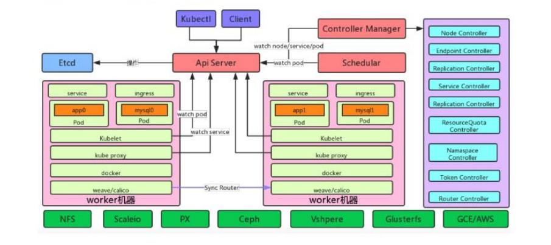
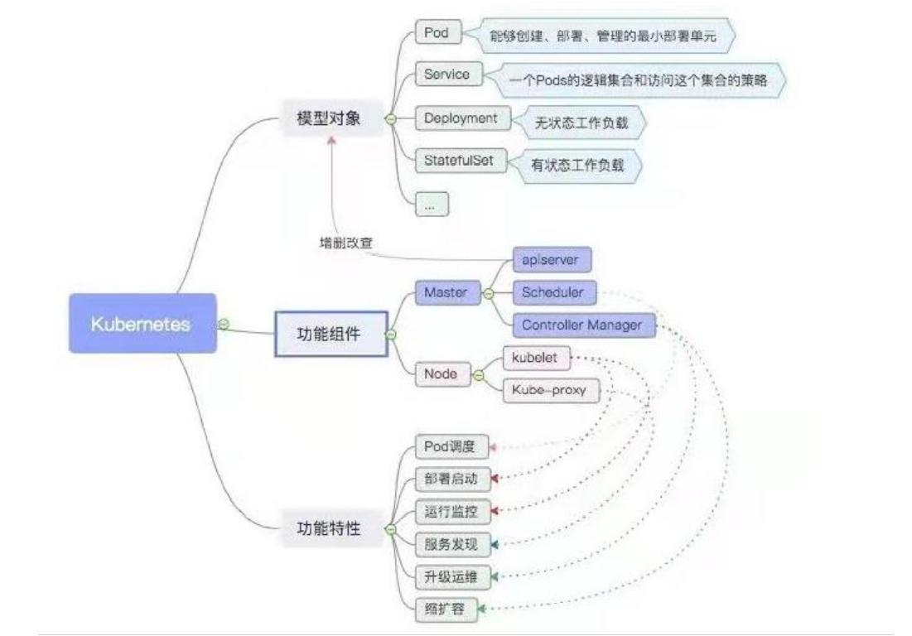

# 介绍
## 它是什么
多宿主机编排管理容器的工具。
## 能力
- 服务发现和负载均衡
- 自动部署和回滚： 
- 自动装箱计算： 做出更好的决策来管理容器的资源
- 自我修复：  会不断拉起期望的pod数量，在准备好服务之前不将其通告给客户端
- 密钥与配置管理： 无需在堆栈配置中暴露
- 弹性扩展：定义期待的容器状态与资源数量
- 存储编排：可以是本地存储、公共云提供商
## 竞品
docker Swarm、mesos、Rancher
## [架构及其术语](https://www.kubernetes.org.cn/kuberneteskubernetes设计架构)


控制平面组件： (只是管理)
- apiserver： 入口，以RESTFul接口方式提供给外部客户和内部组件调用(可以非常方便的做定制化开发)
- scheduler： 资源调度，为新建和重启的pod分配机器。
- controller-manager: 执行各种控制器，如：定期关联 service 和 pod

Node 组件 ： (具体工作)
- kubelet: 负责管控docker容器。它会定期从 etcd获取分配到本机的 pod，并根据 pod 信息启动或停止相应的容器。同时，它也会接收 apiserver 的 HTTP 请求，汇报 pod 的运行状态。
- proxy:  为pod 提供代理。当某个客户 pod 要访问其他 pod 时，访问请求会经过本机proxy做转发。
- Container Runtime ： 容器运行时。 为真正的docker。

插件（Addons）： 
- CoreDNS
- Network Plugin
- Web 界面
- 容器资源监控： Metrics-server
 
 
重要概念：
- Pod：最基本的部署调度单元，可以包含多个Container，逻辑上表示某种应用的一个实例。 
- Service： 用户操作的基本单元，是真实应用服务的抽象，对应多个pod。通过 Proxy 的 port 和服务 selector 决定服务请求传递给后端提供服务的容器。
- ReplicationController ： 复制集抽象， 保证实际运行Pod数量总是与该复制数量相等
- Label: 为pod加上一组标签，Service和RC通过Label和Pod进行关键。




# 安装和基本使用
## 安装
- 环境准备：关闭Swap、禁用SELINUX、加载ipvs模块、安装Docker
- 安装kubeadm（能够快速安装 kubernetes 集群） `yum install kubeadm-1.21.5 kubectl-1.21.5 kubelet-1.21.5 -y`
- kubeadm init 集群初始化；
- 配置kubectl访问集群
- 安装 POD network Flannel网络插件
- 配置Master node 参与工作负载(否则主节点没有pod，浪费资源)
- Node Join： 使用kubeadm join 把其他节点加入（Join 证书过期的坑，重新生成，kubeadm证书续期）。
- HA 集群：这里没做ha，一主多node模式。
> 注意: docker 3个核心技术 namespace   => cgroup 和k8s一致才行。版本要一致。
> 集群中的3个ip端要互相独立，最好别设公网的地址。
> kubadm只是安装工具。之后可以卸载。
- 有些需要开放UDP的端口。

## 概念
### node
节点，都安装了Kubeadm, Kubelet, Kubectl,kube-proxy等等组件
### Namespace
命名空间，适用于存在很多跨多个团队或项目的用户的场景。
不同版本应该使用标签 来区分同一名字空间中的不同资源。
4个初始命名空间： default、kube-system、kube-public、kube-node-lease


# kubectl使用
客户端命令行工具(可以随意安装再一台机器中)，用于部署和管理Kubernetes应用程序。
可以检查群集资源; 创建，删除和更新组件; 
## Kubectl 配置
- 默认配置在 $HOME/.kube 目录
- 设置集群参数、客户端认证参数、设置上下文参数、默认上下文
>  上下文: 将配置中的多集群【clusters】和多用户【users】 绑定。
- 配置自动补全： 默认是没有自动补全的，需要自己配置。
## 常用命令
- kubectl create： 通过 yaml/json 文件或者标准输入创建一个资源对象。
- kubectl run 创建并运行一个或多个容器镜像
- kubectl explain 查看资源对象的详细信息
- kubectl get 获取一个或多个资源对象的信息
- kubectl get pod -o wide 查看pod资源
- kubectl describe 显示一个或多个资源对象的详细信息
- kubectl logs 输出 pod 资源对象中一个容器的日志
- kubectl attach 连接到一个运行的容器
- kubectl exec 在指定容器内执行命令
- kubectl label 增删改资源的标签
- kubectl get pod -w 监听pod节点变化
- watch -n 1 kubectl get pod  每隔1s执行 kubectl get pod指令。
- get sa   查看service account安全证书的内容。
- kubectl get ep 查看ip和端口，也叫端点
- kubectl get svc 查看服务和对应的CLUSTER-IP、EXTERNAL-IP 
- kubectl api resouce  查看简写。
- kubectl apply/delete  .  当前目录下所有的yaml文件都执行。
- kubectl rollout 暂停/继续/回滚/历史记录  ：   支持版本滚动升级和版本回退； 
# dashboard(仪表板)
web的客户端，将通用的基于Web的监控和操作界面。
可以创建 pod,service,deployment,application。
可以完全替换命令行工具，监控和故障排除。
## 安装
- 下载安装文件和 image。
- kubectl apply -f kubernetes-dashboard.yaml
- 坑:配置外网访问（不配置的话默认只能集群内访问）
## 访问 dashboard
- 获取登陆 token
- 使用kubeconf 登陆

# Pod
在 k8s 中我们不会直接操作容器，而是把容器包装成 Pod 再进行管理。
每启动一个Pod都会附加启动基础容器（pause），它只做网络和等待挂起。
一个 Pod 中的应用容器共享同一组资源：PID 命名空间、网络命名空间、IPC 命名空间、共享一个主机名、共享存储卷
- 最小操作单元
- pod内容器共享资源
- 生命周期管理: 挂起、运行、成功、失败、未知
- 容器探测
- 容器限额
## Pod 的设计
- 无状态和有状态分开。
- 一个pod内多个子应用，来实现一个功能。
- 负载采用多个pod，而不是再一个pod里面设置多个容器。
## pod 创建与删除
- kubectl 创建 pod
- kubectl的 Yaml 文件创建 pod 
> k run nginx --image=nginx:1.9 --port=80 --dry-run=client -o yaml>nginx.yaml
- dashboard 的  Yaml 文件创建 pod
## 生命周期管理
`kubectl get pod XXX`
- Pending: 正在构建中，如拉取镜像
- Running: 主容器至少有一个正在运行中 (ready标识代表真正能提供服务的数量。)
- Succeeded: 都正常运行完毕，并且已经退出了
- Failed: 以不正常的状态（非 0 的返回码）退出。
- Unknown ： 异常状态
## 重启策略 
Always(默认策略，总是重启), OnFailure(失败重启), Never（决不重启）

## Pod 资源的配额和限制
```yaml
 limits: # 最多不超过,防止某个Pod无限制地使用资源，导致其他Pod崩溃
	 cpu: 700m
	 memory: 200Mi
 requests: # 需要以下,能够保证Pod有足够的资源来运行
	 cpu: 700m
	 memory: 200Mi
```
当节点的资源不够时，先删除没有指定、再删除设置的不一致、最后再删除参数一致的。

## 静态Pod
由于静态Pod只受所在节点的kubelet控制，可以有效预防通过kubectl、或管理工具操作的误删除，可以用来部署核心组件应用。

## 初始化容器
- init 容器必须先于 应用容器启动
- 仅当 init 容器完成后，才能运行应用容器
- 当一个 Pod 有多个 init 容器时，这些 init 容器是顺序运行的.
- 当初始化容器执行失败时,视为pod失败触发重启策略。
- 同一个pod，共享资源: 磁盘和挂载的内容。
- 执行过程中是pending状态状态。
应用场景: 
- 初始化容器可以包含不能随普通容器一起发布出去的敏感信息。
- 初始化容器可以包含用户自定义的代码、工具，如sed、awk、python等方便完成初始化、设置工作。
- 因为初始化逻辑与主体业务逻辑分布在不同的image中，因此image构建者与主体业务逻辑开发者可以各自独立的工作。
- 初始化容器使用Linux namespace，不同于普通应用容器，具有不同的文件系统视图，并且对于低层的操作系统有更在的访问权限。
- 应用启动的前置条件不具备时，初始化容器可以阻止普通应用容器启动，避免在条件不具备时反复启动注定会失败的容器而浪费系统资源。
如:  Web 服务,查看数据库服务是否启动成功。   初始化一些配置项

## Pod 的健康检查
通过探针实现，探针是由kubelet 对容器执行的定期诊断。

探测方式： 
- Exec 探针：执行进程的地方，容器的状态由进程的退出状态代码0确认；
- Http get 探针：向容器发送 HTTP GET 请求，通过响应的 HTTP 状态代码判断容器是否准备好；如果响应的状态码大于等于 200 且小于 400，则诊断被认为是成功的
- Tcp socket 探针：它打开一个 TCP 连接到容器的指定端口，如果连接己建立，则认为容器己准备就绪。
- gRPC 探针 ： 需要配置开启gRPC功能。
探测结果：
- 成功：容器通过了诊断。
- 失败：容器未通过诊断。 若未通过检查，则根据不同的探测类型,不同的处理方式。
- 未知：表示说当前这次检查操作没有完整执行，可能是因为超时或一些脚本没有及时返回。此时Readiness-probe或Liveness-probe不做任何操作，会等待下一次的机制来进行检验。

探测类型： 通过不同的探针实现不同的检测功能。
- livenessProbe/存活探针 ：  判断容器是否正在运行,是否需要重启。整个生命周期内运行在容器上，以周期的探测。若liveness探测到Pod不健康时，会通过kubelet杀掉该pod，并根据重启策略来判断是否重启这个pod。
> 背景: 许多长时间运行的应用程序最终会转变为损坏状态，除非重新启动，否则无法恢复。
> 查看RESTARTS字段知道重启的时间。
- readinessProbe/就绪探针 ： 判断容器是否准备好接受请求。整个生命周期内运行在容器上，以周期的探测。如果探测失败，端点控制器将从与 Pod 匹配的所有 service endpoints 中 剔除删除该 Pod 的 IP 地址。
> 有时应用程序暂时无法提供流量，您不想杀死应用程序，但也不想向它发送请求。
- startupProbe/启动探针 ： 
> 您必须处理在首次初始化时可能需要额外启动时间的遗留应用程序。
> failureThreshold * periodSeconds 为等待最大的时间，超过则认为失败。
> 只在启动时执行，在 startupProbe 状态为 Success 之前，其他所有探针都处于无效状态，直到它成功后其他探针才起作用。如果 startupProbe 失败，kubelet 将杀死容器，容器将根据 restartPolicy 来重启。

## pod设计原则
[多种模式容器](https://www.51cto.com/article/710490.html): 
- 边车容器 ： 是将辅助功能从主业务容器独立或解耦出来，做成一个辅助容器，这个容器也可以被重用
- 代理容器 
- 适配器容器


## Pod 调度
### 调度原理: 
- 预选策略,强制性规则，遍历所有的Node节点，按照具体的预选策略筛选出符合要求的Node列表，如没有Node符合Predicates策略规则，那该Pod就会被挂起，直到有Node能够满足。
- 优选策略,第一步筛选的基础上，按照优选策略为待选Node打分排序，获取最优者；

### 调度过程: 
1. 用户提交 pod，APIServer 记录到 etcd 中；
2. scheduler 监听到etcd变化，再查询APIServer，以获取未绑定的 pod，尝试为 pod 分配节点；
3. scheduler 调度：首先过滤不符合 pod 资源要求的主机。然后考虑整体优化策略对主机打分，比如使用最低负载，使用分散主机等。最后选择最高分的主机存储绑定信息到 etcd 中；
4. kubelet 监听到etcd变化 ，查询绑定对象，获取需要在本机启动的 pod 并通过 docker 启动。

### 调度类型: 
#### 自动调度
运行在哪个Node节点上完全由Scheduler经过一系列的算法计算得出。   
默认所有节点都不过载，使用率最小的节点。

#### 定向调度
- NodeName :  调度到指定的name的Node节点
- NodeSelector :  调度到添加了指定标签的Node节点上。  如有硬盘，放mysql等等其他的作用。 

#### 亲和性调度
亲和性：提高性能；如果两个应用频繁交互，那么就有必要利用亲和性让两个应用尽可能的靠近，这样可以较少因网络通信而带来的性能损耗。
反亲和性：高可用；当应用采用多副本部署的时候，那么就有必要利用反亲和性让各个应用实例打散分布在各个Node上，这样可以提高服务的高可用性。
- NodeAffinity:  以Node为目标，解决Pod可以调度到那些Node的问题。 
> 和nodeSelector的区别: 
> 如果一个Pod所在的Node在Pod运行期间其标签发生了改变，不再符合该Pod的nodeAffinity的要求，则系统将忽略此变化。
> 比nodeSelector更加灵活，有关系符、权重、硬限制、软限制。
- PodAffinity:   以Pod为目标，解决Pod可以和那些已存在的Pod部署在同一个拓扑域中的问题。
- PodAntiAffinity: 以Pod为目标，解决Pod不能和那些已经存在的Pod部署在同一拓扑域中的问题。

#### 污点（容忍）调度
都是针对node的操作。
- Taints :   使用kubeadm搭建的集群，默认就会给Master节点添加一个污点标记，所以Pod就不会调度到Master节点上
> 污点3种类型: 
> PreferNoSchedule(不再优先调度): 将尽量避免把Pod调度到具有该污点的Node上，除非没有其他节点可以调度。
> NoSchedule(不再调度):  将不会把Pod调度到具有该污点的Node上，但是不会影响当前Node上已经存在的Pod。
> NoExecute(不执行) : 将不会把Pod调度到具有该污点的Node上，同时也会将Node上已经存在的Pod驱逐。
- Toleration :  污点就是拒绝，容忍就是忽略，Node通过污点拒绝Pod调度上去，Pod通过容忍忽略拒绝。
> 添加容忍的规则，这里必须和标记的污点规则相同。


# 工作负载：Pod 控制器
- ReplicationController：比较原始的pod控制器，已经被废弃，由ReplicaSet替代
- ReplicaSet：使 Pod 拥有自愈，多副本，扩缩容的能力
- Deployment：通过ReplicaSet来控制pod，并支持滚动升级、版本回退
- Horizontal Pod Autoscaler：可以根据集群负载自动调整Pod的数量，实现削峰填谷
- DaemonSet：在集群中的指定Node上都运行一个副本，一般用于守护进程类的任务
- Job：它创建出来的pod只要完成任务就立即退出，用于执行一次性任务
- Cronjob：它创建的pod会周期性的执行，用于执行周期性任务
- StatefulSet：管理有状态应用
## ReplicaSet
保证一定数量的pod能够正常运行，它会持续监听这些pod运行状态，一旦pod发生故障，就会重启或重建。同时它还支持对pod数量的扩缩容和版本镜像的升降级。
- yaml定义内容:  副本数replicas、Label Selector、Pod 模板
- 多副本： 多个同样的pod，–replicas=2，注意名字的变化
- 自愈能力:  doerk/pod删了，laber删了，多余的pod，都会重新调度到期待的副本数量。
- 扩缩容能力 : 可以再运行过程中，修改replicas数量； 2种方法: 直接编辑yaml(kubectl edit rs)， 命令(kubectl scale rs)
- 镜像版本升降级 : 删除pod后再重新部署，不建议使用； 同上直接编辑yaml
> RC和RS的区别??  rs 基于集合、rc基于等式 （一开始只有rc） rs更加灵活。 其他都相同。
## Deployment
通过管理ReplicaSet来间接管理Pod,比ReplicaSet功能更强大。 
rs的功能上层封装抽象，更有利于滚动升级，解决了rs的升级困难。
- 原理: 都是先生成一个新的rs再删除旧的rs。
- yaml定义内容,同RS，控制器定义和模板。多一个type，默认RollingUpdate（滚动更新）
- 滚动更新可以配置:  新创建几个maxSurge，删除几个maxUnavailable
- 所以一般用Deployment，而不使用ReplicaSet
功能: 
- 支持ReplicaSet的所有功能
- 支持版本滚动升级和版本回退； kubectl rollout 暂停/继续/回滚/历史记录
- 支持发布的停止、继续； 用于实现金丝雀发布
- 还有故障转移: 节点挂了，会自动迁移。
>  label就只能改yaml文件的。 会先创建rs的label再创建自己的label


## DaemonSet
可以保证集群中每一台（或指定）节点上都运行一个副本，一般适合于日志收集、节点监控等常见。
也就是说，如果一个pod提供的功能是节点级别的（每个节点都需要且仅需要一个），那么这类Pod就适合使用DaemonSet类型的控制器创建。
- 内置有: kuble-proxy，csi-nfs动态存储，calico网络的Pod
- 污点调度的配置，会影响node节点。 
- yaml定义同RS

## Job
Job主要用于负责批量处理（一次处理多个任务）、短暂的、一次性任务。
有以下2个特点：
- 当job创建的pod执行成功结束时，job将记录成功结束后的pod数量
- 当成功结束的pod达到指定的数量时，job将完成执行
由于默认job不会删除Pod，所以一般要配置一个ttl的删除的参数。
## CronJob
定时job，每次都会重新生成一个pod，默认保留最近的3个。

## StatefulSet(sts)
yaml定义: 
- 用于定义网络标志（DNS domain）的 Headless Service
- 用于创建 PersistentVolumes 的 volumeClaimTemplates
- 其他的和RS一样。

适用于具有以下特点的应用：
- 具有固定的网络标记（主机名）
- 具有持久化存储
- 需要按顺序部署和扩展
- 需要按顺序终止及删除
- 需要按顺序滚动更新


网络标识：
- 要求: StatefulSet 当前需要无头服务 来负责 Pod 的网络标识。
- 每个pod都有固定的主机名,格式为$(StatefulSet 名称)-$(序号) ; DNS名: $(pod 名称).$(所属服务的 DNS 域名)
- 再搭建集群时可以使用 redis-0、redis-1这种模式来使用。
- 尽量用DNS全域名，防止跨namespace也能使用。 (主机名用于局域网中；域名用于公网中。)
Deployment的区别: 
有状态的服务， 有序的启动并发能力不强，这也是deploy的部署无状态的优势。


## 总结
- Deployment : 无状态应用部署；如微服务，提供多副本。
- StatefulSet ： 有状态应用部署；如数据库，提供稳定的存储或网络等
- DaemonSet ： 守护型应用部署；如日志收集，在每个node都要运行一份。
- job/Cronjob : 定时任务；如垃圾清理


# 服务（Service）
## 定义:  微服务的概念
无需修改应用程序即可使用不熟悉的服务发现机制。 Kubernetes 为Pods 提供自己的 IP 地址，并为一组 Pod 提供相同的 DNS 名， 并且可以在它们之间进行负载均衡。
- ipvs 就是负载均衡。
## 使用: 
- 与pod绑定: 服务的连接对所有的后端pod是负载均衡的，至于哪些 pod 被属于哪个服务，通过在定义服务的时候设置标签选择器；
- 没有选择算符的 Service： 可以自定义（kind : Endpoints） 绑定的外部ip:prot。
- 创建方式:  1. 命令行: kubectl create svc  或者 kubectl expose  2. yaml中定义 kind : Service
- 两个端口: port 服务提供的端口 ； targetPort指定 pod 中进程监听的端口
- 同一个 deployment 暴露多次显示多个服务名称
- 使用命名的端口

## 常用指令
- kubectl get svc


## Headless Services
没头的 Service： 有时不需要或不想要负载均衡，以及单独的 Service IP。遇到这种情况，可以通过指定 Cluster IP（spec.clusterIP）的值为 “None” 来创建 Headless Service。
dns 查询会如实的返回 2 个真实的endpoint

使用场景： 
第一种：自主选择权，有时候client想自己来决定使用哪个Real Server，可以通过查询DNS来获取Real Server的信息。
第二种：Headless Service对应的每一个Endpoints，即每一个Pod，都会有对应的DNS域名；这样Pod之间就可以互相访问。【结合statefulset有状态服务使用，如Web、MySQL集群】

区别: 
有头IP : 客户所在的宿主机来做负载。  
无头IP :  给了所有的pod的ip列表。     这是DNS来做负载。

## 服务注册和域名发现
- 两级域名访问:  Coredns 、 Host 。 coredns和宿主机的dns是2个不同的。
发现服务方式: 
1. 通过环境变量发现服务: 如果创建的服务早于客户端 pod 的创建，pod 上的进程可以根据环境变量获得服务的 IP 地址和端口号； 否则不能
2. CoreDNS 域名解析过程 ：  pod访问其他的pod  ->  coreDns  -> api service -> etcd  获得service name和 ip 。
> 在部署 CoreDNS 应用前，至少需要创建一个 ConfigMap(存配置)、一个 Deployment 和一个 Service共 3 个资源对象。
> 域名解析过程分析 :  resolv.conf 文件分析 -> nameserver -> search 域 -> options -> pod 之间的通信、通过 svc 访问 


访问使用: 
- service名字在宿主机不生效。
- 在pod里可以用service name 访问；也可以用service ip访问。
- 查找同命名空间的服务 : 直接name访问
- 查找不同命名空间的服务 : 垮namespace 访问需要 `name.Namespace`

Pod 级别的 DNS 配置说明: 
dnsPolicy 项目 设置默认配置为'Default'
-  Default：继承 Pod 所在宿主机的 DNS 设置。
- ClusterFirst：优先使用 Kubernetes 环境的 DNS 服务（如 CoreDNS 提供的域名解析服务），将无法解析的域名转发到从宿主机继承的 DNS 服务器。
- ClusterFirstWithHostNet：与 ClusterFirst 相同，对于以 hostNetwork 模式运行的 Pod，应明确指定使用该策略。
-  None：忽略 Kubernetes 环境的 DNS 配置，通过 spec.dnsConfig 自定义 DNS 配置。这个选项从 Kubernetes 1.9 版本开始引入

## 负载均衡的实现
4种访问:  externlIp:port     clusterIP:port   NodeIp:port    podip:targetPort   
### ClusterIP(别名service ip)
默认类型，自动分配一个仅Cluster内部可以访问的虚拟IP。 它只有在svc变化时ip才变。
他和podIp的关系，是由kubctl-proxy + ipvs（别用iptables）来做。 他的负载也是由宿主机来做的。   
### NodePort
通过每个 Node 上的 IP 和静态端口（NodePort）暴露服务。以ClusterIP为基础，NodePort 服务会路由到 ClusterIP 服务。通过请求 <NodeIP>:<NodePort>，可以从集群的外部访问一个集群内部的 NodePort 服务。
外部可以直接访问pod服务。  肯定会有Cluster-ip生成。 一般所有节点都要开port，危险。  网关可以使用他，建议用loadbance。
### LoadBalancer
使用云提供商的负载均衡器，可以向外部暴露服务。外部的负载均衡器可以路由到 NodePort 服务和 ClusterIP 服务。
它拥有自己独一无二的可公开访问的 IP 地址；
LoadBalance 其实是 NodePort 的一种扩展，使得服务可以通过一个专用的负载均衡器来访问:

他可以通过使用 NodePort 的方式来访问服务（节点 IP+节点端口）；同时也可以通过 EXTERNAL-IP 来访问
过程: externlIp:port   -> clusterIP:port  -> podIP: targetPort


[kubernetes/k8s接合阿里云LoadBalancer/负载均衡](https://blog.csdn.net/cleverfoxloving/article/details/79186574)
matelab : 
为裸机集群提供网络负载平衡器的实现,如果未在受支持的 IaaS 平台上运行，将无限期保持 pending 状态
一个domanset  、一个DeployMent

优点： 是它的通用性  ,MetalLB 提供了故障转移功能
缺点： Layer 2 模式下存在单节点瓶颈，服务所有流量都经过一个 Node 节点。


防止不必要的网络跳数（一个优化点）:  
当外部客户端通过节点端口连接到服务时，随机选择的 pod 并不一定在接收连接的同一节
点上运行；可以通过将服务配置为仅将外部通信重定向到接收连接的节点上运行的 pod 来
阻止此额外跳数； 
设置externalTrafficPolicy: Local 。  也就是直接用local而尽量不重定向。

# Ingress and 网络
外部访问有nodeport   ，loadbance 2种方式。 但是比较麻烦/不安全，所以有ingress。

该对象允许外部访问 k8s 服务， 通过创建规则集合来配置访问权限，这些规则定义了哪些入站连接可以访问哪些服务；
Ingress 仅支持 HTTP 和 HTTPS 协议； 公开 HTTP 和 HTTPS 以外的服务通常使用 Service.Type=NodePort 或 Service.Type=LoadBalancer 类型的服务。
ingress 可配置用于提供外部可访问的服务 url、负载均衡流量、SSL终端和提供虚拟主机名配置。

过程:  ingress(类似于网关) -> 路由多个service -> pod 

它相当于是部署在某个node的nodeport的服务。公网域名就可以直接解析到这个node了。
> 所以一般就定义一台服务器，打上标签专门用来部署ingress。

安装组成:  
- Nginx Controller ：  （Namespace, Deployment, Service, RBAC ,Secret information）
- Ingress Rule ：  创建 Ingress 资源 ，设置路由的一些规则和目的地。
- Default-Backend ： 没有 rules 的 Ingress 将所有流量发送到同一个默认后端。
Ingress-nginx 的高可用 : Ingress + LoadBalancer

使用：
- 基于名称的虚拟托管 -根据域名访问 ： 让后台负载均衡器基于 host 头部字段 来路由请求。
- 简单扇出 ： 通过uri路由到多个Service
- 暴露多个服务 :   rules 和 paths 是数组，可以配置多个，映射同样服务 ; 
- 路径重写： 
- 限流 ： 
- 处理https的TLS 传输


pod的网络类型 :  bridge/host

Network policy  : 
- 相当于 Access controller list 网络安全。
- 规范包含在给定命名空间中定义特定网络策略所需的所有信息


# 存储
## 核心概念
### Volume 
> 属于 Pod 内部共享资源存储，生命周期和 Pod 相同，与 Container 无关，即使 Pod 上的容
> 器停止或者重启，Volume 不会受到影响，但是如果 Pod 终止，那么这个 Volume 的生命周
> 期也将结束。
### PersistentVolume（PV） 
> PV 持久卷和普通的 Volume 一样，也是使用 卷插件来实现的，只是它们拥有独立于任何使用 PV 的 Pod 的生命周期。
> 简单的说就是持久化的，pod删除后还存在

阶段状态:
- Available – 资源尚未被 claim 使用
- Bound – 卷已经被绑定到 claim 了
- Released – claim 被删除，卷处于释放状态，但未被集群回收。
- Failed – 卷自动回收失败

访问模式 (VolumeMode) ：
ReadWriteOnce(RWO)
卷可以被一个节点以读写方式挂载。 ReadWriteOnce 访问模式也允许运行在同一节点上的多个 Pod 访问卷。
ReadOnlyMany(ROM)
卷可以被多个节点以只读方式挂载。
ReadWriteMany(RWM)
卷可以被多个节点以读写方式挂载。
ReadWriteOncePod(RWOP)
卷可以被单个 Pod 以读写方式挂载。 如果你想确保整个集群中只有一个 Pod 可以读取或写入该 PVC， 请使用ReadWriteOncePod 访问模式。这只支持 CSI 卷以及需要 Kubernetes 1.22 以上版本。


注意: 
- pv不分namespace，所有的共享。
- 还有快照的功能。

###  PersistentVolumeClaim (PVC)
对PV资源的请求抽象。


生命周期：
Provisioning ——-> Binding ——–>Using——>Releasing——>Recycling
- 供应准备 Provisioning--- 通过集群外的存储系统或者云平台来提供存储持久化支持。 有静态提供和动态提供。
- 绑定 Binding---用户创建 pvc 并指定需要的资源和访问模式。在找到可用 pv 之前，pvc 会保持未绑定状态。
- 使用 Using---用户可在 pod 中像 volume 一样使用 pvc。
- 释放 Releasing---用户删除 pvc 来回收存储资源，pv 将变成“released”状态。由于还保留着之前的数据，这些数据需要根据不同的策略来处理，否则这些存储资源无法被其他 pvc 使用。
- 回收Recycling---pv可以设置三种回收策略：保留（Retain），回收（Recycle）和删除（Delete）。
> 保留策略：允许人工处理保留的数据。
> 删除策略：将删除 pv 和外部关联的存储资源，需要插件支持。
> 回收策略：将执行清除操作，之后可以被新的 pvc 使用，需要插件支持。


使用方法：
PVC 只有绑定了 PV 之后才能被 Pod 使用，而 PVC 绑定 PV 的过程即是消费 PV 的过程，这个过程是系统自动实现的、且有有一定规则的，
他们的关系绑定是自己维护的。 当然也可以指定name做强制绑定。  
下面规则都满足的 PV 才能被 PVC 绑定：
- VolumeMode：被消费 PV 的 VolumeMode 需要和 PVC 一致；
- AccessMode：被消费 PV 的 AccessMode 需要和 PVC 一致；
- StorageClassName：如果 PVC 定义了此参数，PV 必须有相关的参数定义才能进行绑定；
- LabelSelector：通过 label 匹配的方式从 PV 列表中选择合适的 PV 绑定；
- storage：被消费 PV 的 capacity 必须大于或者等于 PVC 的存储容量需求才能被绑定。


注意: 
- PVC 和 PV 是一一对应的。
- PV 和 PVC 中的 spec 关键字段要匹配，比如存储（storage）大小、访问模式。
- PV 和 PVC 中的 storageClassName 字段必须一致。
- 必须先删pvc再删pv
- 应用必须用 绑定好的pvc和pv 的内容。
- 回收策略，在删除pvc时才触发
- 设置了非空 selector 的 PVC 对象无法让集群为其动态供应 PV 卷。


### StorageClass
PV 和 PVC 都只是抽象的概念。StorageClass 相当于实现类，实现不同的功能。
为管理员提供了一种描述他们提供的存储的“类”的方法。
不同的类可能映射到服务质量级别，或备份策略，或者由群集管理员确定的任意策略。
- 支持的实现: 目前包含有 NFS、ceph、iSCSI 和云提供商指定的存储系统

### Dynamic Provisioning 动态供给
背景: 
> PV 是运维人员来创建的，开发操作 PVC，可是大规模集群中可能会有很多 PV，如果这些 PV 都需要运维手动来处理这也是一件很繁琐的事情

它的作用就是创建 PV 模板，并且直接绑定到应用。
所以它直接建pvc就行了，pv会动态创建出来。  

## 驱动 Plugin实现方法
- In Tree ： 默认的，它们与核心 kubernetes 二进制文件链接，编译，构建和一起发布。
- FlexVolume ： 解决了 In-Tree 方式的强耦合，不过还是有好多问题。
- CSI ： 接口的目标是为 CO 建立标准化机制，以将任意存储系统暴露给其容器化工作负载，各个云产商可以提供。
> csi  2大优势，  百度一下：存储多路径，跟快，冗余备份。不需要root权限。


## 使用
3种访问存储资源方式:
### 直接访问
把Volume的基本信息完全暴露给用户，有严重的安全隐患，同时需要协调不同users对Volume的访问
volumeMounts.mountPath 设置目录。
### 静态provision
需要先创建PV
NFS存储demo步骤: 
- 创建一个 NFS 服务器作为 K8s 的存储系统。
- 创建PV ： 
- 创建PVC
- 创建pod ： spec.volumes.persistentVolumeClaim.claimName 指定pvc

### 动态provision
PV由PVC模板创建了。
- 安装插件
- 创建StorageClass
- 创建PVC ：  storageClassName要保持一致。
- 创建POD


StatefulSet动态存储的编写。
StatefulSet 使用 volumeClaimTemplates来选择存储
statefluset，不需要写pvc了，就定义一个name。   其中的一个pod删除了，重启后的pvc还是一样的。
删除sts后他是不删除pvc的。
```
  volumeClaimTemplates:
  - metadata:
      name: test
      annotations:
        volume.beta.kubernetes.io/storage-class: "nfs-csi" # nfs-csi的动态存储。
```

注意: nfs 默认不支持动态存储，需要第三方插件。


# Configmap
使用场景:
- 用来存储配置文件的 kubernetes 资源对象，配置内容都存储在 etcd 中
- 相当于配置中心，存配置的。 
- 在一个namespace中公用。

定义: 
- 通过直接在命令行中指定 configmap 参数创建，即--from-literal
- 通过指定文件创建，即将一个配置文件创建为一个 ConfigMap --from-file=<文件>
- 通过指定目录创建，即将一个目录下的所有配置文件创建为一个 ConfigMap，--from-file=<目录>
- 事先写好标准的 configmap 的 yaml 文件，然后 kubectl create -f 创建
使用: 
第一种是通过环境变量的方式，直接传递给 pod 
> 使用 configmap 中指定的 key ; 使用 configmap 中所有的 key
>  spec.containers.name.env.valueFromonfigMapKeyRef   指定要用的 key
>  spec.containers.name.env.configMapRef   使得 configmap 中的所有 key/value 对都自动变成环境变量
第二种是通过在 pod 的命令行下运行的方式(启动命令中)
> 通过环境变量，再命令中使用环境变量。

第三种是作为 volume 的方式挂载到 pod 内
> 更新 ConfigMap 后：
>使用该 ConfigMap 挂载的 Env 不会同步更新
>使用该 ConfigMap 挂载的 Volume 中的数据需要一段时间（实测大概 10 秒）才能同步更新
> spec.volumes.configMap 定义卷的内容形式，使用就和使用卷一样。


区别: 
env 可以一个一个的改。
envform 是文件所有的都加进入，后来的值会有覆盖前面的key内容。 key value 也都是完全一样的。


# Secrets
使用场景:
Secret 解决了密码、token、密钥等敏感数据的配置问题，
而不需要把这些敏感数据暴露到镜像或者 Pod Spec 中。
Secret 可以以 Volume 或者环境变量的方式使用。
三种类型:
- Opaque：base64 编码格式的 Secret，用来存储密码、密钥等；但数据也通过 base64 –decode=解码得到原始数据
- kubernetes.io/dockerconfigjson：用来存储私有 docker registry 的认证信息。
- kubernetes.io/service-account-token： 用于被 serviceaccount 引用。
定义方法: 
- Yaml 文件
- 从文件中产生
使用同Configmap：

注意: 
- env是解密之后的真实内容。
- Yaml定义时需要自己用base64加密.
- 命令行直接是明文。

# [保护机制 PodDisruptionBudget](https://www.jianshu.com/p/ac43a0876a5b)
为了保证业务不中断或业务SLA不降级，需要将应用进行集群化部署。
通过PodDisruptionBudget 控制器可以设置应用POD集群处于运行状态最低个数，也可以设置应用POD集群处于运行状态的最低百分比。
这样可以保证在主动销毁应用POD的时候，不会一次性销毁太多的应用POD，从而保证业务不中断或业务SLA不降级。

应用场景： 
- 节点维护或升级时
- zk、kafka等等的集群一定保证有对应的节点


# 应用自动弹性伸缩 HPA
Horizontal Pod Autoscaler 根据观察到的 CPU 利用率（或者，在自定义指标 支持下，根据其他一些应用程序提供的指标）
自动扩展复制控制器、部署、副本集或有状态集中的 Pod 数量。
原理： 
监控当前cpu和预期cpu对比，操作repalce副本实现扩缩容。
其他再DeployMent等等基础上的抽象封装。
底层还是通过scalable/sclar指令扩容。

使用: 
- 部署metrics-server(用于监控cpu等等)  可以用kubectl top node 验证安装成功。
- rs/rc/deployment定义中，必须有 resources.requests 的请求，用于计算需要分配的基础。
- 部署HPA，2种方式、命令行 和 yaml创建。  需要定义min/max副本、目标期望的利用率设置


注意： 
- HPA不适用于无法缩放的对象，例如 DaemonSet。
- 自动扩缩容，云通过namespace来区分，可以设置限制。
- Vertical Pod Autoscaler（VPA) 是解决资源配额（Pod的CPU、内存的limit/request）评估不准的问题。
- Horizontal Pod Autoscaler（HPA）则要解决的是业务负载压力波动很大，需要人工根据监控报警来不断调整副本数的问题。
- min 新版本可以设置0。
- 扩的比较快，缩的比较慢（默认360秒才开始伸缩）


# yaml编写注意:
- 不同资源用---区分。


# [Wordpress部署](https://kubernetes.io/zh-cn/docs/tutorials/stateful-application/mysql-wordpress-persistent-volume/)
Wordpress ： 
deployment(记得加resources.requests)、service采用NodePort、PVC(存静态文件且被多个pod共享、nfs、12G、RWM)、

configMap、Secret： 配置host、username、password等等内容、用于mysql和Wordpress 共享

Mysql 部署: StatefulSet、无头service(内部连接使用、且更快)、PVC(nfs、10G、RWO)、configMap（my.cnf配置文件）

Ingress : 定义wp的访问入口。

HPA的创建：  `kubectl autoscale deployment wordpress --min=1 --max=40 --cpu-percent=3`


# 参考资料
- [【Kubernetes】k8s多集群切换【含上下文作用详解】【含6443端口不可达处理方法】](https://blog.csdn.net/cuichongxin/article/details/118544112)
- [指令操作指南](https://kubernetes.io/docs/reference/kubectl/cheatsheet/)
- [kubernetes如何对kubectl做用户权限管理](https://www.jianshu.com/p/a1a0d64f1245)
> Subject 权限类型有3种，ServiceAccount用于管理 Secret （秘钥）资源
> user不是k8s的对象，serviceaccuont是k8s的用户
- [Kubernetes的服务质量（QoS）](https://blog.csdn.net/heian_99/article/details/114490830)
- [静态Pod](https://www.cnblogs.com/h-gallop/p/11774752.html)
> k8s内置的一些pod，如etcd、控制器pod都是这样实现的。
- [图解 K8S（04）：吃透 Pod 中的第三类容器 -- init 容器;过程比较详细](https://blog.csdn.net/weixin_36338224/article/details/122930460)
- [kubernetes之初始化容器; 用途，定义](https://blog.csdn.net/dkfajsldfsdfsd/article/details/81094883)
- [Pod 健康检查（探针）](https://blog.csdn.net/duanbaoke/article/details/119815870)
- [kubernets pod调度原理](https://www.jianshu.com/p/0f084259a04e)
- [pod调度策略，一篇就够](https://blog.csdn.net/qq_34857250/article/details/90259693)
- [Pod的调度的例子](https://www.cnblogs.com/huiyichanmian/p/15701778.html)
- [Pod控制器详解](https://www.cnblogs.com/zackstang/p/14528477.html)
- [K8S学习之Statefulset](https://blog.csdn.net/weixin_60092693/article/details/123537647)
- [pod设计原则? 3种模式](https://blog.csdn.net/qq_19676401/article/details/119996434)
- [k8s operator 理解](https://zhuanlan.zhihu.com/p/353230313)
> 开发自己的控制器，自动化“pod崩溃恢复的逻辑”
- [Kubernetes K8S之Service服务详解与示例](https://www.cnblogs.com/zhanglianghhh/p/13682265.html)
- [详解k8s 4种类型Service](https://zhuanlan.zhihu.com/p/157565821)
> 各类的网络处理流程详细，
- [Kubernetes 容器中获取Pod信息: Downward API](https://blog.csdn.net/lsx_3/article/details/124399768)
- [官网: 通过环境变量将 Pod 信息呈现给容器](https://kubernetes.io/zh-cn/docs/tasks/inject-data-application/environment-variable-expose-pod-information/)
- [API聚合机制扩展API资源](https://blog.csdn.net/qq_31136839/article/details/100183026)
> 再API-service上面，封装一层，解耦提高性能和可扩展第三方。

- [HPA 还是 KEDA，如何在 Kubernetes 中更有效的使用弹性扩缩容？](https://zhuanlan.zhihu.com/p/476208338)
> HPA 只基于 CPU、内存或任何外部指标源执行自动缩放。
> 向 HPA 添加新指标很困难。 比如: 挂起的消息队列大小等等业务的指标。
> KEDA是事件驱动自动扩缩器，我们可以使用 Prometheus 作为扩展部署的度量源。 
> 业务只要操作Prometheus的监控就行了。 这是不是又和监控系统做了优秀的整合。

- [镜像拉取策略](https://www.jianshu.com/p/d14be0c0e0eb)
> IfNotPresent(默认，只有当镜像在本地不存在时才会拉取) ； Always (总是) ； Never（不从仓库获得）


# 疑问
- docker 3个核心技术?
- isto  => AB测试、蓝绿测试.
- vnc是啥？ 远程登录图形桌面系统客户端。
- 东西 南北流量。

- k8s用于nodeport暴露在外面。  

- > k8s 定义3大接口 CSI、CRI、CNI

- 对外会生成一个ip。   这样如果公网怎么做域名解析？

- 3大组件趋势:  docker k8s   ，servicemesh isto（微服务的功能）   ，service less fass函数型编程。