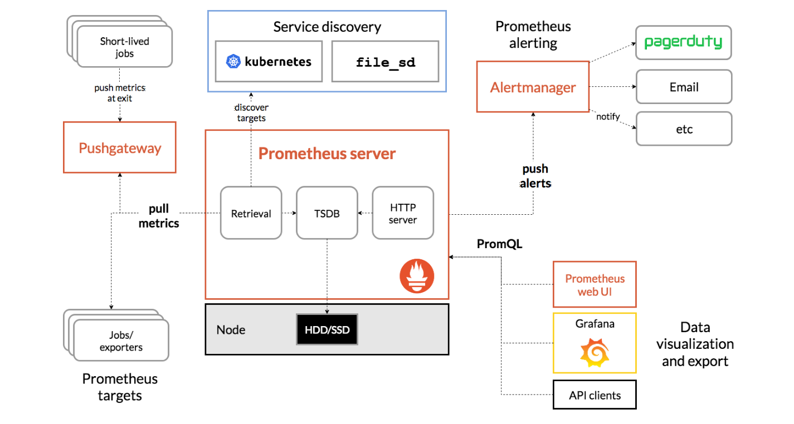
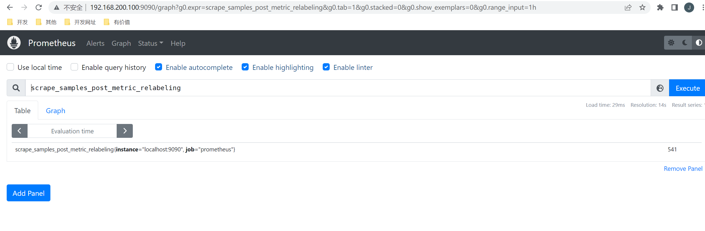
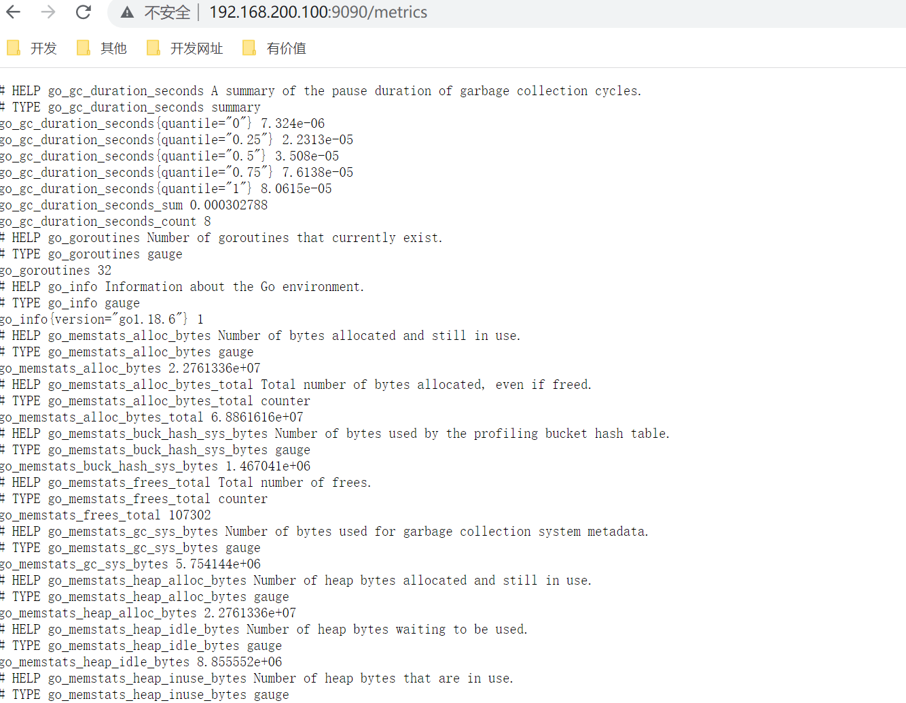
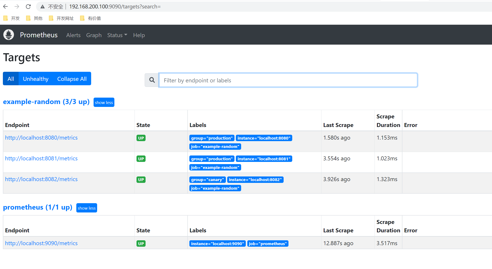
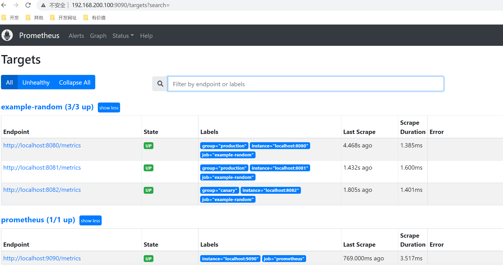
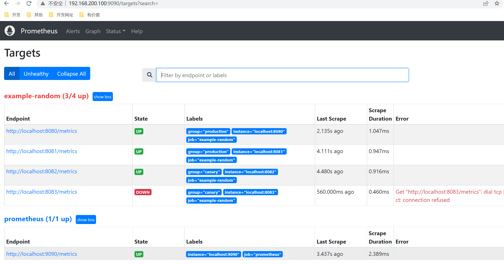
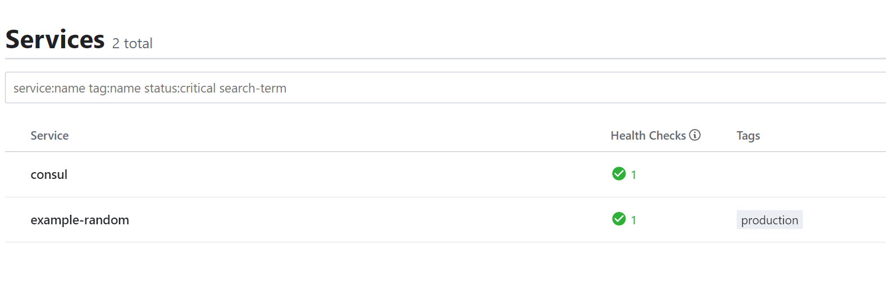
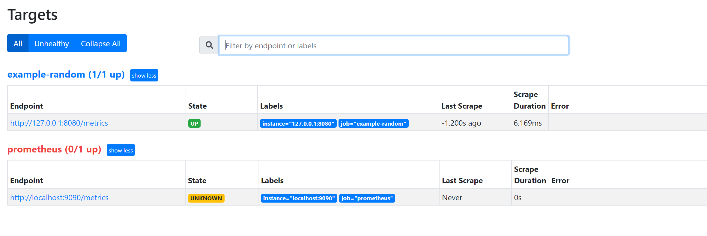
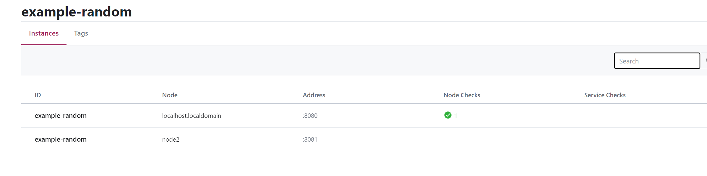
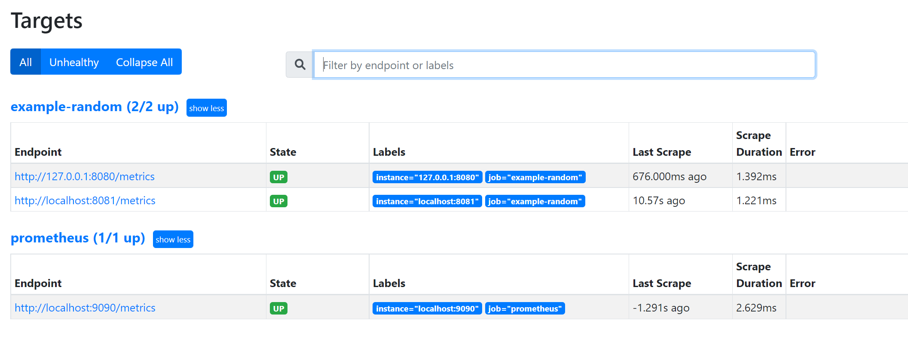

# Prometheus介绍+安装

prometheus受启发于Google的Brogmon监控系统（相似kubernetes是从Brog系统演变而来）。 2016年5月继kubernetes之后成为第二个加入CNCF基金会的项目，同年6月正式发布1.0版本。2017年底发布基于全新存储层的2.0版本，能更好地与容器平台、云平台配合。
官方网站：[https://prometheus.io](https://prometheus.io/)
项目托管：https://github.com/prometheus

## 1. 介绍

### 1.1 优势

prometheus是基于一个开源的完整监控方案，其对传统监控系统的测试和告警模型进行了彻底的颠覆，形成了基于中央化的规则计算、统一分析和告警的新模型。 相对传统的监控系统有如下几个优点。

- 易于管理： 部署使用的是go编译的二进制文件，不存在任何第三方依赖问题，可以使用服务发现动态管理监控目标。
- 监控服务内部运行状态： 我们可以使用prometheus提供的常用开发语言提供的client库完成应用层面暴露数据， 采集应用内部运行信息。
- 强大的查询语言promQL: prometheus内置一个强大的数据查询语言PromQL,通过PromQL可以实现对监控数据的查询、聚合。同时PromQL也被应用于数据可视化（如grafana）以及告警中的。
- 高效： 对于监控系统而言，大量的监控任务必然导致有大量的数据产生。 而Prometheus可以高效地处理这些数据。
- 可扩展： prometheus配置比较简单， 可以在每个数据中心运行独立的prometheus server, 也可以使用联邦集群，让多个prometheus实例产生一个逻辑集群，还可以在单个prometheus server处理的任务量过大的时候，通过使用功能分区和联邦集群对其扩展。
- 易于集成： 目前官方提供多种语言的客户端sdk,基于这些sdk可以快速让应用程序纳入到监控系统中，同时还可以支持与其他的监控系统集成。
- 可视化： prometheus server自带一个ui, 通过这个ui可以方便对数据进行查询和图形化展示，可以对接grafana可视化工具展示精美监控指标。

### 1.2 架构

 prometheus负责从pushgateway和Jobs中采集数据， 存储到后端Storatge中，可以通过PromQL进行查询， 推送alerts信息到AlertManager。 AlertManager根据不同的路由规则进行报警通知。

`prometheus server`是Prometheus组件中的核心部分，负责实现对监控数据的获取，存储以及查询。

`exporter`简单说是采集端，通过http服务的形式保留一个url地址，prometheus server 通过访问该exporter提供的endpoint端点，即可获取到需要采集的监控数据。exporter分为2大类。

* 直接采集：这一类exporter直接内置了对Prometheus监控的支持，比如cAdvisor,Kubernetes等。
* 间接采集： 原有监控目标不支持prometheus，需要通过prometheus提供的客户端库编写监控采集程序，例如Mysql Exporter, JMX Exporter等。

`AlertManager` ，在prometheus中，支持基于PromQL创建告警规则，如果满足定义的规则，则会产生一条告警信息，进入AlertManager进行处理。可以集成邮件，Slack或者通过webhook自定义报警。

`PushGateway` 由于Prometheus数据采集采用pull方式进行设置的， 内置必须保证prometheus server 和对应的exporter必须通信，当网络情况无法直接满足时，可以使用pushgateway来进行中转，可以通过pushgateway将内部网络数据主动push到gateway里面去，而prometheus采用pull方式拉取pushgateway中数据。

`web ui` Prometheus内置一个简单的Web控制台，可以查询指标，查看配置信息或者Service Discovery等，实际工作中，查看指标或者创建仪表盘通常使用Grafana，Prometheus作为Grafana的数据源

### 1.3 数据模型

Prometheus将所有数据存储为时间序列，具有相同度量名称以及标签属于同一个指标。
每个时间序列都由度量名称和一组键值对（也称为标签）组成。

格式：

~~~xml
# 表示一个度量指标和一组键值对标签
<metric name>{<label name>=<label value>, ...}
~~~

度量指标名称是`api_http_requests_total`， 标签为`method="POST"`, `handler="/messages"` 的示例如下所示：

~~~shell
api_http_requests_total{method="POST", handler="/messages"}
~~~

### 1.4 指标类型

prometheus的指标有四种类型，分别是Counter，Gauge，Histogram，Summary。

* Counter
  只增不减的计数器，用于描述某个指标的累计状态，比如请求量统计，http_requests_total
* Gauge
  可增可减的计量器，用于描述某个指标当前的状态，比如系统内存余量，node_memory_MemFree_bytes
* Histogram
  直方图指标用于描述指标的分布情况，比如对于请求响应时间，总共10w个请求，小于10ms的有5w个，小于50ms的有9w个，小于100ms的有9.9w个
* Summary
  和直方图类似，summary也是用于描述指标分布情况，不过表现形式不同，比如还是对于请求响应时间，summary描述则是，总共10w个请求，50%小于10ms，90%小于50ms，99%小于100ms

## 2. 安装

大致了解了Prometheus后，我们将其先安装起来。

Prometheus也是go语言开发的，所以只需要下载其二进制包进行安装即可。

前往地址：https://prometheus.io/download 下载最新版本即可。

~~~shell
[root@localhost prometheus]# tar -zxvf prometheus-2.37.1.linux-amd64.tar.gz 
prometheus-2.37.1.linux-amd64/
prometheus-2.37.1.linux-amd64/consoles/
prometheus-2.37.1.linux-amd64/consoles/index.html.example
prometheus-2.37.1.linux-amd64/consoles/node-cpu.html
prometheus-2.37.1.linux-amd64/consoles/node-disk.html
prometheus-2.37.1.linux-amd64/consoles/node-overview.html
prometheus-2.37.1.linux-amd64/consoles/node.html
prometheus-2.37.1.linux-amd64/consoles/prometheus-overview.html
prometheus-2.37.1.linux-amd64/consoles/prometheus.html
prometheus-2.37.1.linux-amd64/console_libraries/
prometheus-2.37.1.linux-amd64/console_libraries/menu.lib
prometheus-2.37.1.linux-amd64/console_libraries/prom.lib
prometheus-2.37.1.linux-amd64/prometheus.yml
prometheus-2.37.1.linux-amd64/LICENSE
prometheus-2.37.1.linux-amd64/NOTICE
prometheus-2.37.1.linux-amd64/prometheus
prometheus-2.37.1.linux-amd64/promtool
[root@localhost prometheus]# cd prometheus-2.37.1.linux-amd64
[root@localhost prometheus-2.37.1.linux-amd64]# ll
total 206252
drwxr-xr-x. 2 3434 3434        38 Sep 12 09:04 console_libraries
drwxr-xr-x. 2 3434 3434       173 Sep 12 09:04 consoles
-rw-r--r--. 1 3434 3434     11357 Sep 12 09:04 LICENSE
-rw-r--r--. 1 3434 3434      3773 Sep 12 09:04 NOTICE
-rwxr-xr-x. 1 3434 3434 109681846 Sep 12 08:46 prometheus
-rw-r--r--. 1 3434 3434       934 Sep 12 09:04 prometheus.yml
-rwxr-xr-x. 1 3434 3434 101497637 Sep 12 08:49 promtool
[root@localhost prometheus-2.37.1.linux-amd64]# ./prometheus --help
usage: prometheus [<flags>]

The Prometheus monitoring server

Flags:
  -h, --help                     Show context-sensitive help (also try --help-long and --help-man).
      --version                  Show application version.
~~~

Prometheus 是通过一个 YAML 配置文件来进行启动的，如果我们使用二进制的方式来启动的话，可以使用下面的命令：

~~~shell
./prometheus --config.file=prometheus.yml
~~~

其中 `prometheus.yml` 文件的基本配置如下：

~~~yaml
global:
  scrape_interval:     15s
  evaluation_interval: 15s
rule_files:
  # - "first.rules"
  # - "second.rules"
scrape_configs:
  - job_name: prometheus
    static_configs:
      - targets: ['localhost:9090']
~~~

上面这个配置文件中包含了3个模块：`global`、`rule_files` 和 `scrape_configs`。

- `global` 模块控制 `Prometheus Server` 的全局配置：
  - `scrape_interval`：表示 prometheus 抓取指标数据的频率，默认是15s，我们可以覆盖这个值
  - `evaluation_interval`：用来控制评估规则的频率，prometheus 使用规则产生新的时间序列数据或者产生警报
- `rule_files`：指定了报警规则所在的位置，prometheus 可以根据这个配置加载规则，用于生成新的时间序列数据或者报警信息，当前我们没有配置任何报警规则。
- `scrape_configs` 用于控制 prometheus 监控哪些资源。

由于 prometheus 通过 HTTP 的方式来暴露的它本身的监控数据，prometheus 也能够监控本身的健康情况。在默认的配置里有一个单独的 job，叫做 prometheus，它采集 prometheus 服务本身的时间序列数据。这个 job 包含了一个单独的、静态配置的目标：监听 localhost 上的 9090 端口。prometheus 默认会通过目标的 `/metrics` 路径采集 metrics。所以，默认的 job 通过 URL：`http://localhost:9090/metrics` 采集 metrics。收集到的时间序列包含 prometheus 服务本身的状态和性能。如果我们还有其他的资源需要监控的话，直接配置在 `scrape_configs` 模块下面就可以了。

~~~shell
[root@localhost prometheus-2.37.1.linux-amd64]# ./prometheus --config.file=prometheus.yml
~~~

测试访问：

查看暴露的指标：

### 2.1 示例

Prometheus 提供了go的一个客户端示例。

~~~cmd
D:\git\github\go> git clone https://github.com/prometheus/client_golang
D:\git\github\go\client_golang\examples\random>go env -w GOOS=linux
D:\git\github\go\client_golang\examples\random>go env -w GOARCH=amd64
D:\git\github\go\client_golang\examples\random>go build
~~~

~~~shell
[root@localhost prometheus]# chmod +x random 
[root@localhost prometheus]# ./random -listen-address=:8080
[root@localhost prometheus]# ./random -listen-address=:8081
[root@localhost prometheus]# ./random -listen-address=:8082
~~~

这个时候我们可以得到3个不同的监控接口：http://localhost:8080/metrics、http://localhost:8081/metrics 和 http://localhost:8082/metrics （这是示例代码中提供的）

~~~go
// Expose the registered metrics via HTTP.
	http.Handle("/metrics", promhttp.HandlerFor(
		prometheus.DefaultGatherer,
		promhttp.HandlerOpts{
			// Opt into OpenMetrics to support exemplars.
			EnableOpenMetrics: true,
		},
	))
~~~

现在我们配置 Prometheus 来采集这些新的目标，让我们将这三个目标分组到一个名为 example-random 的任务。假设前两个端点（即：http://localhost:8080/metrics、http://localhost:8081/metrics ）都是生产级目标应用，第三个端点（即：http://localhost:8082/metrics ）为金丝雀实例。要在 Prometheus 中对此进行建模，我们可以将多组端点添加到单个任务中，为每组目标添加额外的标签。 在此示例中，我们将 `group =“production”` 标签添加到第一组目标，同时将 `group=“canary”`添加到第二组。将以下配置添加到 `prometheus.yml` 中的 `scrape_configs` 部分，然后重新启动 Prometheus 实例：

~~~yaml
scrape_configs:
  - job_name: 'example-random'
    scrape_interval: 5s # Override the global default and scrape targets from this job every 5 seconds.
    static_configs:
      - targets: ['localhost:8080', 'localhost:8081']
        labels:
          group: 'production'
      - targets: ['localhost:8082']
        labels:
          group: 'canary'
~~~

添加配置后，重新启动

## 3. 配置文件详解

~~~yaml
# my global config
global:
  scrape_interval:     15s # Set the scrape interval to every 15 seconds. Default is every 1 minute.
  evaluation_interval: 15s # Evaluate rules every 15 seconds. The default is every 1 minute.
  # scrape_timeout is set to the global default (10s).

# Alertmanager configuration
alerting:
  alertmanagers:
  - static_configs:
    - targets:
      # - alertmanager:9093

# Load rules once and periodically evaluate them according to the global 'evaluation_interval'.
rule_files:
  # - "first_rules.yml"
  # - "second_rules.yml"

# A scrape configuration containing exactly one endpoint to scrape:
# Here it's Prometheus itself.
scrape_configs:
  # The job name is added as a label `job=<job_name>` to any timeseries scraped from this config.
  - job_name: 'prometheus'

    # metrics_path defaults to '/metrics'
    # scheme defaults to 'http'.

    static_configs:
    - targets: ['localhost:9090']
~~~

- global： 此片段指定的是prometheus的全局配置， 比如采集间隔，抓取超时时间等。
- rule_files： 此片段指定报警规则文件， prometheus根据这些规则信息，会推送报警信息到alertmanager中。
- scrape_configs: 此片段指定抓取配置，prometheus的数据采集通过此片段配置。
- alerting: 此片段指定报警配置， 这里主要是指定prometheus将报警规则推送到指定的alertmanager实例地址。
- remote_write: 指定后端的存储的写入api地址。
- remote_read: 指定后端的存储的读取api地址。

### 3.1 global

~~~yaml
  # How frequently to scrape targets by default.
  [ scrape_interval: <duration> | default = 1m ]      # 抓取间隔

  # How long until a scrape request times out.
  [ scrape_timeout: <duration> | default = 10s ]     # 抓取超时时间

  # How frequently to evaluate rules.
  [ evaluation_interval: <duration> | default = 1m ]   # 评估规则间隔

  # The labels to add to any time series or alerts when communicating with
  # external systems (federation, remote storage, Alertmanager).
  external_labels:                                                  # 外部一些标签设置
    [ <labelname>: <labelvalue> ... ]
~~~

### 3.2 scrapy_config

一个scrape_config 片段指定一组目标和参数， 目标就是实例，指定采集的端点， 参数描述如何采集这些实例， 主要参数如下

- scrape_interval: 抓取间隔,默认继承global值。
- scrape_timeout: 抓取超时时间,默认继承global值。
- metric_path: 抓取路径， 默认是/metrics
- scheme: 指定采集使用的协议，http或者https。
- params: 指定url参数。
- basic_auth: 指定认证信息。
- *_sd_configs: 指定服务发现配置
- static_configs: 静态指定服务job。
- relabel_config: relabel设置。

#### 3.2.1 普通

~~~yaml
scrape_configs:
  # The job name is added as a label `job=<job_name>` to any timeseries scraped from this config.
  - job_name: 'prometheus'

    # metrics_path defaults to '/metrics'
    # scheme defaults to 'http'.

    static_configs:
    - targets: ['localhost:9090']
  - job_name: "node"
    static_configs:
    - targets:
      - "192.168.100.10:20001"
      - "192.168.100.11:20001
      - "192.168.100.12:20001"
~~~

#### 3.2.2 file_sd_configs方式

文件形式的服务发现

~~~yaml
scrape_configs:
  # The job name is added as a label `job=<job_name>` to any timeseries scraped from this config.
  - job_name: 'prometheus'

    # metrics_path defaults to '/metrics'
    # scheme defaults to 'http'.

    static_configs:
    - targets: ['localhost:9090']
  - job_name: "node"
    file_sd_configs:
    - refresh_interval: 10s
      files: 
      - "/usr/local/prometheus/prometheus/conf/node*.yaml"

# 独立文件配置如下
cat node-dis.yaml
- targets:
  - "192.168.100.10:20001"
  labels:
    hostname: node00
- targets:
  - "192.168.100.11:20001"
  labels:
    hostname: node01
- targets:
  - "192.168.100.12:20001"
  labels:
    hostname: node02
~~~

通过file_fd_files 配置后我们可以在不重启prometheus的前提下， 修改对应的采集文件（node_dis.yml）， 在特定的时间内（refresh_interval），prometheus会完成配置信息的载入工作。

修改前面的示例：

~~~yaml
scrape_configs:
  - job_name: 'example-random'
    scrape_interval: 5s # Override the global default and scrape targets from this job every 5 seconds.
    file_sd_configs:
    - refresh_interval: 10s
      files: 
      - "/mnt/prometheus/prometheus-2.37.1.linux-amd64/conf/node*.yaml"
~~~

node-random.yaml

~~~yaml
- targets: 
  - 'localhost:8080'
  - 'localhost:8081'
  labels:
    group: 'production'
- targets: 
  - 'localhost:8082'
  labels:
    group: 'canary'
~~~

重新启动，正常显示

修改node-random.yaml

~~~yaml
- targets: 
  - 'localhost:8080'
  - 'localhost:8081'
  labels:
    group: 'production'
- targets: 
  - 'localhost:8082'
  - 'localhost:8083'
  labels:
    group: 'canary'
~~~

不重启，等待10s

#### 3.2.3 consul_sd_file

consul是一个服务发现工具。

先部署启动一个consul

~~~shell
[root@localhost consul]# wget https://releases.hashicorp.com/consul/1.6.1/consul_1.6.1_linux_amd64.zip
[root@localhost consul]# unzip consul_1.6.1_linux_amd64.zip
[root@localhost consul]# mv consul /usr/local/bin/
#运行测试
[root@localhost consul]# consul agent -dev
~~~

创建配置文件：

node1.json

~~~json
{
  "addresses": {
                        "http": "0.0.0.0",
                        "https": "0.0.0.0"
           },
  "services": [{ 
                "name": "example-random",
                "tags": ["production"],
                "port": 8080
             }]

}
~~~

~~~shell
[root@localhost consul]# cd /etc/consul.d/
[root@localhost consul.d]# ll
total 0
[root@localhost consul.d]# vim node1.json
{
  "addresses": {
                        "http": "0.0.0.0",
                        "https": "0.0.0.0"
           },
  "services": [{
                "name": "example-random",
                "tags": ["production"],
                "port": 8080
             }]

}
~~~

运行

~~~shell
consul  agent -dev -config-dir=/etc/consul.d
~~~

修改prometheus配置：

~~~yaml
- job_name: "example-random"
    consul_sd_configs:
    - server: localhost:8500
      services: 
      - example-random
~~~

添加一个新的节点：

node2.json

~~~shell
[root@localhost consul.d]# vim node2.json
{
        "Node": "node2",
        "Address": "localhost",
        "Service":
                {
                        "Port": 8081,
                        "ID": "example-random",
                        "Service": "example-random"
                }
}
~~~

~~~shell
[root@localhost consul.d]# curl -XPUT -d@node2.json  127.0.0.1:8500/v1/catalog/register
true
~~~

