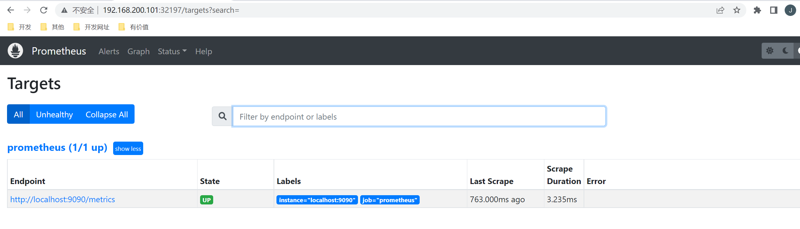
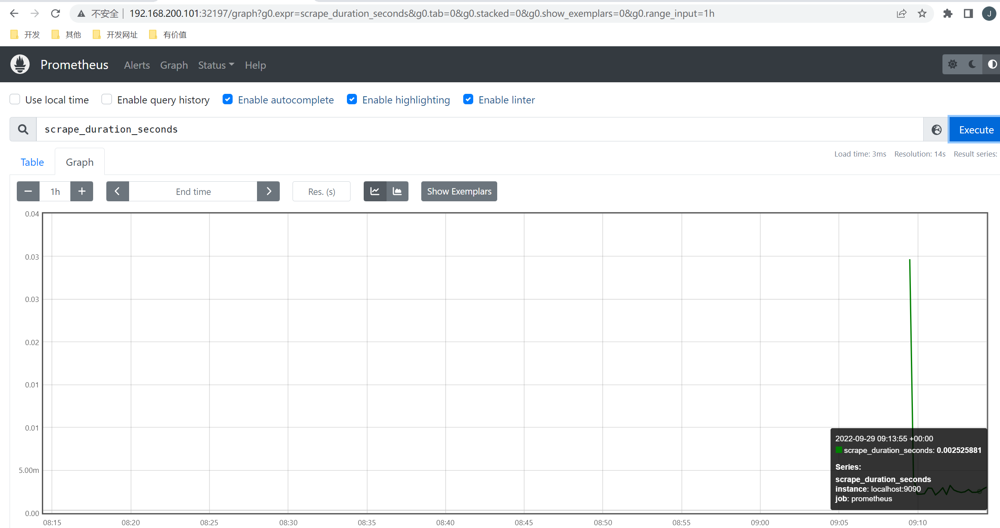
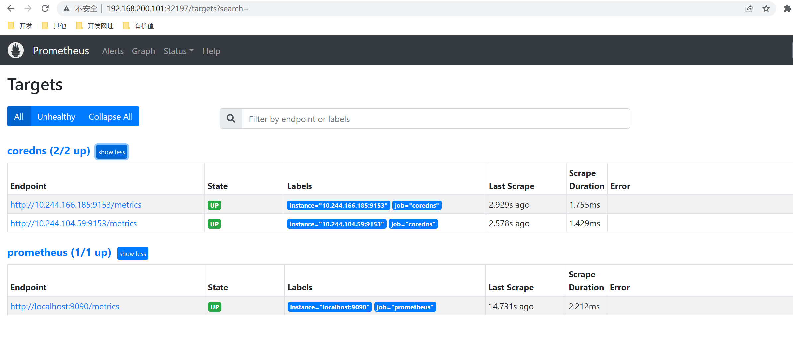
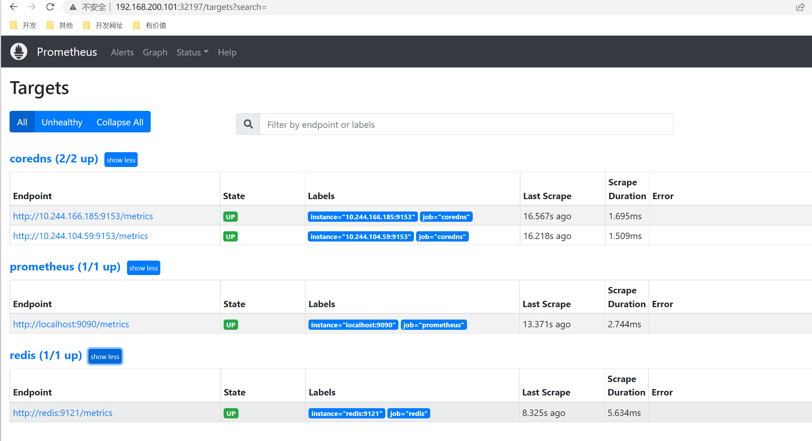

# k8s运行Prometheus

为了方便管理，我们需要将Prometheus部署在k8s中

## 1. 部署

创建命名空间：

~~~shell
[root@master ~]# kubectl create ns prom    
namespace/prom created
~~~

将 `prometheus.yml` 文件用 ConfigMap 的形式进行管理：（prometheus-cm.yaml）

~~~yaml
apiVersion: v1
kind: ConfigMap
metadata:
  name: prometheus-config
  namespace: prom
data:
  prometheus.yml: |
    global:
      scrape_interval: 15s
      scrape_timeout: 15s
    scrape_configs:
    - job_name: 'prometheus'
      static_configs:
      - targets: ['localhost:9090']
~~~

~~~shell
[root@master prom]# kubectl apply -f prometheus-cm.yaml
configmap/prometheus-config created
~~~

以后如果我们有新的资源需要被监控，我们只需要将上面的 ConfigMap 对象更新即可。

创建 prometheus 的 Pod 资源：(prometheus-deploy.yaml)

~~~yaml
apiVersion: apps/v1
kind: Deployment
metadata:
  name: prometheus
  namespace: prom
  labels:
    app: prometheus
spec:
  selector:
    matchLabels:
      app: prometheus
  template:
    metadata:
      labels:
        app: prometheus
    spec:
      serviceAccountName: prometheus
      nodeSelector:
        monitor: prometheus
      containers:
      - image: prom/prometheus:v2.37.1
        name: prometheus
        args:
        - "--config.file=/etc/prometheus/prometheus.yml"
        - "--storage.tsdb.path=/prometheus"  # 指定tsdb数据路径,Prometheus的本地存储为Promethazine TSDB
        - "--storage.tsdb.retention.time=24h"
        - "--web.enable-admin-api"  # 控制对admin HTTP API的访问，其中包括删除时间序列等功能
        - "--web.enable-lifecycle"  # 支持热更新，直接执行localhost:9090/-/reload立即生效
        - "--web.console.libraries=/usr/share/prometheus/console_libraries"
        - "--web.console.templates=/usr/share/prometheus/consoles"
        ports:
        - containerPort: 9090
          name: http
        volumeMounts:
        - mountPath: "/etc/prometheus"
          name: config-volume
        - mountPath: "/prometheus"
          name: data
        resources:
          requests:
            cpu: 100m
            memory: 512Mi
          limits:
            cpu: 100m
            memory: 512Mi
      securityContext:
        runAsUser: 0  # root用户权限
      volumes:
      - name: data
        hostPath:
          path: /data/prometheus/
      - configMap:
          name: prometheus-config
        name: config-volume
~~~

通过 `--storage.tsdb.path=/prometheus` 指定数据目录，然后将该目录声明挂载到 `/data/prometheus` 这个主机目录下面。

使用 `nodeSelector` 将 Pod 固定到了一个具有 `monitor=prometheus` 标签的节点上，所以需要为目标节点打上这个标签：

~~~shell
[root@master prom]# kubectl label node node2 monitor=prometheus
node/node2 labeled
~~~

 prometheus 可以访问 Kubernetes 的一些资源对象，所以需要配置 rbac 相关认证，这里我们使用了一个名为 prometheus 的 serviceAccount 对象：(prometheus-rbac.yaml)

~~~yaml
apiVersion: v1
kind: ServiceAccount
metadata:
  name: prometheus
  namespace: prom
---
apiVersion: rbac.authorization.k8s.io/v1
kind: ClusterRole
metadata:
  name: prometheus
rules:
- apiGroups:
  - ""
  resources:
  - nodes
  - services
  - endpoints
  - pods
  - nodes/proxy
  verbs:
  - get
  - list
  - watch
- apiGroups:
  - "extensions"
  resources:
    - ingresses
  verbs:
  - get
  - list
  - watch
- apiGroups:
  - ""
  resources:
  - configmaps
  - nodes/metrics
  verbs:
  - get
- nonResourceURLs:
  - /metrics
  verbs:
  - get
---
apiVersion: rbac.authorization.k8s.io/v1
kind: ClusterRoleBinding
metadata:
  name: prometheus
roleRef:
  apiGroup: rbac.authorization.k8s.io
  kind: ClusterRole
  name: prometheus
subjects:
- kind: ServiceAccount
  name: prometheus
  namespace: prom
~~~

权限规则声明中有一个 `nonResourceURLs` 的属性，是用来对非资源型 metrics 进行操作的权限声明。

~~~shell
[root@master prom]# kubectl apply -f prometheus-rbac.yaml  
serviceaccount/prometheus created
clusterrole.rbac.authorization.k8s.io/prometheus created
clusterrolebinding.rbac.authorization.k8s.io/prometheus created
[root@master prom]# kubectl apply -f prometheus-deploy.yaml 
deployment.apps/prometheus created
~~~

~~~shell
[root@master prom]# kubectl get pods -n prom -o wide
NAME                        READY   STATUS    RESTARTS   AGE   IP              NODE    NOMINATED NODE   READINESS GATES
prometheus-cfc6c98f-dshdt   1/1     Running   0          33s   10.244.104.61   node2   <none>           <none>
~~~

创建service，以便外部访问：

prometheus-svc.yaml

~~~yaml
apiVersion: v1
kind: Service
metadata:
  name: prometheus
  namespace: prom
  labels:
    app: prometheus
spec:
  selector:
    app: prometheus
  type: NodePort
  ports:
    - name: web
      port: 9090
      targetPort: http
~~~

~~~shell
[root@master prom]# kubectl apply -f prometheus-svc.yaml
service/prometheus created
[root@master prom]# kubectl get svc -n prom
NAME         TYPE       CLUSTER-IP    EXTERNAL-IP   PORT(S)          AGE
prometheus   NodePort   10.98.38.77   <none>        9090:32197/TCP   24s
~~~

隔一会， 可以去`Graph` 菜单下面查看我们抓取的 prometheus 本身的一些监控数据

比如我们这里就选择 `scrape_duration_seconds` 这个指标，然后点击 `Execute`，就可以看到类似于下面的图表数据了：

## 2. 应用监控

对于普通的HTTP服务，我们只需要暴露 `/metrics`接口给Prometheus即可，Prometheus会定期拉取数据。

对于没有`/metrics`接口的，可以使用`exporter`来获取监控数据，exporter就是运行在被监控目标的机器上，收集监控目标的指标数据，提供给Prometheus。

 Kubernetes 的各个组件都直接提供了数据指标接口`/metrics`。

### 2.1 coreDNS监控

对`/metrics`的示例，我们使用k8s中的coreDNS来说明。

coreDNS就默认开启了 `/metrics` 接口：

~~~shell
[root@master ~]# kubectl get pods -n kube-system -o wide
NAME                                    READY   STATUS    RESTARTS        AGE     IP                NODE     NOMINATED NODE   READINESS GATES
coredns-74586cf9b6-7wj84                1/1     Running   5 (110m ago)    4d18h   10.244.166.185    node1    <none>           <none>
coredns-74586cf9b6-m968n                1/1     Running   5 (110m ago)    4d18h   10.244.104.59     node2    <none>           <none>
~~~

~~~shell
[root@master ~]# kubectl get cm coredns -n kube-system -o yaml
apiVersion: v1
data:
  Corefile: |
    .:53 {
        errors
        health {
           lameduck 5s
        }
        ready
        kubernetes cluster.local in-addr.arpa ip6.arpa {
           pods insecure
           fallthrough in-addr.arpa ip6.arpa
           ttl 30
        }
        prometheus :9153
        forward . /etc/resolv.conf {
           max_concurrent 1000
        }
        cache 30
        loop
        reload
        loadbalance
    }
kind: ConfigMap
metadata:
  creationTimestamp: "2022-09-23T03:57:42Z"
  name: coredns
  namespace: kube-system
  resourceVersion: "222"
  uid: d9e139d3-872f-4d14-a504-bad88bb2840b
~~~

ConfigMap 中 `prometheus :9153` 就是开启 prometheus 的插件。

访问一下`metrics`接口

~~~shell
  uid: d9e139d3-872f-4d14-a504-bad88bb2840b
[root@master ~]# curl http://10.244.104.59:9153/metrics
# HELP coredns_build_info A metric with a constant '1' value labeled by version, revision, and goversion from which CoreDNS was built.
# TYPE coredns_build_info gauge
coredns_build_info{goversion="go1.17.1",revision="13a9191",version="1.8.6"} 1
# HELP coredns_cache_entries The number of elements in the cache.
# TYPE coredns_cache_entries gauge
coredns_cache_entries{server="dns://:53",type="denial"} 1
coredns_cache_entries{server="dns://:53",type="success"} 0
# HELP coredns_cache_hits_total The count of cache hits.
# TYPE coredns_cache_hits_total counter
coredns_cache_hits_total{server="dns://:53",type="denial"} 1
# HELP coredns_cache_misses_total The count of cache misses. Deprecated, derive misses from cache hits/requests counters.
# TYPE coredns_cache_misses_total counter
coredns_cache_misses_total{server="dns://:53"} 3
# HELP coredns_cache_requests_total The count of cache requests.
# TYPE coredns_cache_requests_total counter
coredns_cache_requests_total{server="dns://:53"} 4
# HELP coredns_dns_request_duration_seconds Histogram of the time (in seconds) each request took per zone.
# TYPE coredns_dns_request_duration_seconds histogram
coredns_dns_request_duration_seconds_bucket{server="dns://:53",zone=".",le="0.00025"} 1
~~~

我们可以将这个 `/metrics` 接口配置到 `prometheus.yml` 中去了：

~~~yaml
apiVersion: v1
kind: ConfigMap
metadata:
  name: prometheus-config
  namespace: prom
data:
  prometheus.yml: |
    global:
      scrape_interval: 15s
      scrape_timeout: 15s

    scrape_configs:
    - job_name: 'prometheus'
      static_configs:
        - targets: ['localhost:9090']
    - job_name: 'coredns'
      static_configs:
        - targets: ['10.244.166.185:9153', '10.244.104.59:9153']
~~~

更新：

~~~shell
[root@master prom]# kubectl apply -f prometheus-cm.yaml
configmap/prometheus-config configured
~~~

由于 ConfigMap 通过 Volume 的形式挂载到 Pod 中去的热更新需要一定的间隔时间才会生效，所以需要稍微等一小会儿。

之前我们加了`--web.enable-lifecycle`，用`reload`重新载入，就可以看到新的内容。

~~~shell
[root@master prom]# kubectl get service -n prom
NAME         TYPE       CLUSTER-IP    EXTERNAL-IP   PORT(S)          AGE
prometheus   NodePort   10.98.38.77   <none>        9090:32197/TCP   19h
[root@master prom]# curl -X POST "http://10.98.38.77:9090/-/reload" 
~~~

### 2.2 exporter 

我们通过一个 [redis-exporter](https://github.com/oliver006/redis_exporter) 的服务来监控 redis 服务。

部署一个 redis 应用，并用 redis-exporter 的方式来采集监控数据供 Prometheus 使用，如下资源清单文件：（prome-redis.yaml）

~~~yaml
apiVersion: apps/v1
kind: Deployment
metadata:
  name: redis
  namespace: prom
spec:
  selector:
    matchLabels:
      app: redis
  template:
    metadata:
      annotations:
        prometheus.io/scrape: "true"
        prometheus.io/port: "9121"
      labels:
        app: redis
    spec:
      containers:
      - name: redis
        image: redis:4
        resources:
          requests:
            cpu: 100m
            memory: 100Mi
        ports:
        - containerPort: 6379
      - name: redis-exporter
        image: oliver006/redis_exporter:latest
        resources:
          requests:
            cpu: 100m
            memory: 100Mi
        ports:
        - containerPort: 9121
---
kind: Service
apiVersion: v1
metadata:
  name: redis
  namespace: prom
spec:
  selector:
    app: redis
  ports:
  - name: redis
    port: 6379
    targetPort: 6379
  - name: prom
    port: 9121
    targetPort: 9121
~~~

redis 这个 Pod 中包含了两个容器，一个就是 redis 本身的主应用，另外一个容器就是 redis_exporter。

~~~shell
[root@master prom]# kubectl apply -f prome-redis.yaml
deployment.apps/redis created
service/redis created
~~~

~~~shell
[root@master prom]# kubectl get pods -n prom
NAME                        READY   STATUS    RESTARTS       AGE
prometheus-cfc6c98f-dshdt   1/1     Running   1 (152m ago)   20h
redis-65c96d4bb4-fz55l      2/2     Running   0              39s
[root@master prom]# kubectl get svc -n prom 
NAME         TYPE        CLUSTER-IP      EXTERNAL-IP   PORT(S)             AGE
prometheus   NodePort    10.98.38.77     <none>        9090:32197/TCP      20h
redis        ClusterIP   10.111.11.242   <none>        6379/TCP,9121/TCP   41s
~~~

可以通过 9121 端口来校验是否能够采集到数据：

~~~shell
[root@master prom]# curl 10.111.11.242:9121/metrics
# HELP go_gc_duration_seconds A summary of the pause duration of garbage collection cycles.
# TYPE go_gc_duration_seconds summary
go_gc_duration_seconds{quantile="0"} 0
go_gc_duration_seconds{quantile="0.25"} 0
go_gc_duration_seconds{quantile="0.5"} 0
go_gc_duration_seconds{quantile="0.75"} 0
go_gc_duration_seconds{quantile="1"} 0
go_gc_duration_seconds_sum 0
go_gc_duration_seconds_count 0
# HELP go_goroutines Number of goroutines that currently exist.
# TYPE go_goroutines gauge
go_goroutines 6
~~~

更新 Prometheus 的配置文件：

~~~yaml
apiVersion: v1
kind: ConfigMap
metadata:
  name: prometheus-config
  namespace: prom
data:
  prometheus.yml: |
    global:
      scrape_interval: 15s
      scrape_timeout: 15s

    scrape_configs:
    - job_name: 'prometheus'
      static_configs:
        - targets: ['localhost:9090']

    - job_name: 'coredns'
      static_configs:
        - targets: ['10.244.166.185:9153', '10.244.104.59:9153']
    - job_name: 'redis'
      static_configs:
        - targets: ['redis:9121']
~~~

我们这里是通过 Service 去配置的 redis 服务。

~~~shell
[root@master prom]# kubectl apply -f prometheus-cm.yaml
configmap/prometheus-config configured
[root@master prom]# curl -X POST "http://10.98.38.77:9090/-/reload" 
~~~

