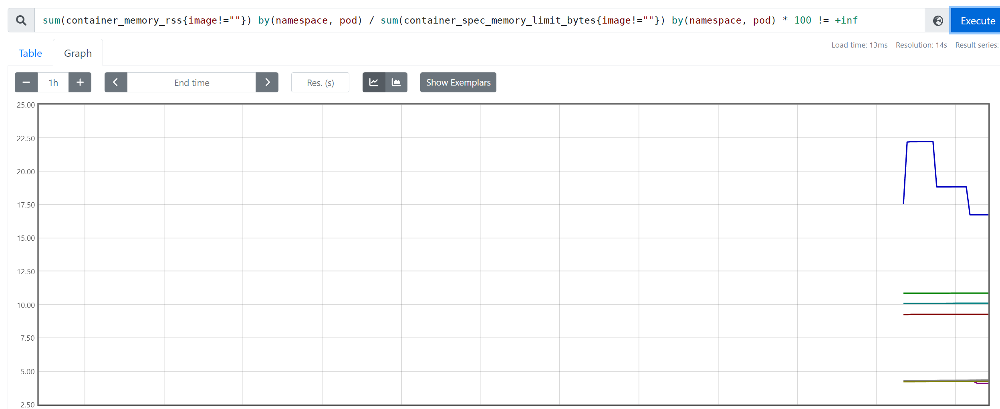

# 监控

## 1. 集群监控

对于 Kubernetes 集群本身的监控也是非常重要的，我们需要时时刻刻了解集群的运行状态。

对于集群的监控一般我们需要考虑以下几个方面：

- Kubernetes 节点的监控：比如节点的 cpu、load、disk、memory 等指标
- 内部系统组件的状态：比如 kube-scheduler、kube-controller-manager、kubedns/coredns 等组件的详细运行状态
- 编排级的 metrics：比如 Deployment 的状态、资源请求、调度和 API 延迟等数据指标

Kubernetes 集群的监控方案目前主要有以下几种方案：

- Heapster：Heapster 是一个集群范围的监控和数据聚合工具，以 Pod 的形式运行在集群中。 heapster 除了 Kubelet/cAdvisor 之外，我们还可以向 Heapster 添加其他指标源数据，比如 kube-state-metrics，需要注意的是 Heapster 已经被废弃了，后续版本中会使用 metrics-server 代替。
- cAdvisor：[cAdvisor](https://github.com/google/cadvisor) 是 Google 开源的容器资源监控和性能分析工具，它是专门为容器而生，本身也支持 Docker 容器。
- kube-state-metrics：[kube-state-metrics](https://github.com/kubernetes/kube-state-metrics) 通过监听 API Server 生成有关资源对象的状态指标，比如 Deployment、Node、Pod，需要注意的是 kube-state-metrics 只是简单提供一个 metrics 数据，并不会存储这些指标数据，所以我们可以使用 Prometheus 来抓取这些数据然后存储。
- metrics-server：metrics-server 也是一个集群范围内的资源数据聚合工具，是 Heapster 的替代品，同样的，metrics-server 也只是显示数据，并不提供数据存储服务。

不过 kube-state-metrics 和 metrics-server 之间还是有很大不同的，二者的主要区别如下：

- kube-state-metrics 主要关注的是业务相关的一些元数据，比如 Deployment、Pod、副本状态等
- metrics-server 主要关注的是[资源度量 API](https://github.com/kubernetes/community/blob/master/contributors/design-proposals/instrumentation/resource-metrics-api.md) 的实现，比如 CPU、文件描述符、内存、请求延时等指标。

### 1.1 节点监控

通过 Prometheus 来采集节点的监控指标数据，可以通过 [node_exporter](https://github.com/prometheus/node_exporter) 来获取，顾名思义，`node_exporter` 就是抓取用于采集服务器节点的各种运行指标，目前 `node_exporter` 支持几乎所有常见的监控点，比如 conntrack，cpu，diskstats，filesystem，loadavg，meminfo，netstat 等，详细的监控点列表可以参考其 [Github 仓库](https://github.com/prometheus/node_exporter)。

我们可以通过 DaemonSet 控制器来部署该服务，这样每一个节点都会自动运行一个这样的 Pod，如果我们从集群中删除或者添加节点后，也会进行自动扩展。

prome-node-exporter.yaml

~~~yaml
apiVersion: apps/v1
kind: DaemonSet
metadata:
  name: node-exporter
  namespace: prom
  labels:
    app: node-exporter
spec:
  selector:
    matchLabels:
      app: node-exporter
  template:
    metadata:
      labels:
        app: node-exporter
    spec:
      hostPID: true
      hostIPC: true
      hostNetwork: true
      nodeSelector:
        kubernetes.io/os: linux
      containers:
      - name: node-exporter
        image: prom/node-exporter:v0.18.1
        args:
        - --web.listen-address=$(HOSTIP):9100
        - --path.procfs=/host/proc
        - --path.sysfs=/host/sys
        - --path.rootfs=/host/root
        - --collector.filesystem.ignored-mount-points=^/(dev|proc|sys|var/lib/docker/.+)($|/)
        - --collector.filesystem.ignored-fs-types=^(autofs|binfmt_misc|cgroup|configfs|debugfs|devpts|devtmpfs|fusectl|hugetlbfs|mqueue|overlay|proc|procfs|pstore|rpc_pipefs|securityfs|sysfs|tracefs)$
        ports:
        - containerPort: 9100
        env:
        - name: HOSTIP
          valueFrom:
            fieldRef:
              fieldPath: status.hostIP
        resources:
          requests:
            cpu: 150m
            memory: 180Mi
          limits:
            cpu: 150m
            memory: 180Mi
        securityContext:
          runAsNonRoot: true
          runAsUser: 65534
        volumeMounts:
        - name: proc
          mountPath: /host/proc
        - name: sys
          mountPath: /host/sys
        - name: root
          mountPath: /host/root
          mountPropagation: HostToContainer
          readOnly: true
      tolerations:
      - operator: "Exists"
      volumes:
      - name: proc
        hostPath:
          path: /proc
      - name: dev
        hostPath:
          path: /dev
      - name: sys
        hostPath:
          path: /sys
      - name: root
        hostPath:
          path: /
~~~

由于我们要获取到的数据是主机的监控指标数据，而我们的 `node-exporter` 是运行在容器中的，所以我们在 Pod 中需要配置一些 Pod 的安全策略，这里我们就添加了 `hostPID: true`、`hostIPC: true`、`hostNetwork: true` 3个策略，用来使用主机的 `PID namespace`、`IPC namespace` 以及主机网络，这些 namespace 就是用于容器隔离的关键技术。

另外我们还将主机的 `/dev`、`/proc`、`/sys`这些目录挂载到容器中，这些因为我们采集的很多节点数据都是通过这些文件夹下面的文件来获取到的，比如我们在使用 `top` 命令可以查看当前 cpu 使用情况，数据就来源于文件 `/proc/stat`，使用 `free` 命令可以查看当前内存使用情况，其数据来源是来自 `/proc/meminfo` 文件。

~~~shell
[root@master prom]# kubectl apply -f prome-node-exporter.yaml
daemonset.apps/node-exporter created
[root@master prom]# kubectl get pods -n prom -l app=node-exporter -o wide
NAME                  READY   STATUS    RESTARTS   AGE   IP                NODE     NOMINATED NODE   READINESS GATES
node-exporter-4j2tj   1/1     Running   0          18s   192.168.200.102   node1    <none>           <none>
node-exporter-chwqc   1/1     Running   0          18s   192.168.200.103   node2    <none>           <none>
node-exporter-mmrzf   1/1     Running   0          18s   192.168.200.101   master   <none>           <none>
~~~

部署完成后，我们可以看到在3个节点上都运行了一个 Pod，由于我们指定了 `hostNetwork=true`，所以在每个节点上就会绑定一个端口 9100，我们可以通过这个端口去获取到监控指标数据：

~~~shell
[root@master prom]# curl 192.168.200.101:9100/metrics
~~~

也可以使用 Helm 的方式来安装：

~~~shell
helm upgrade --install node-exporter --namespace prom stable/prometheus-node-exporter
~~~

### 1.2 服务发现

部署完成后，我们需要将其加入到Prometheus中去，但是如果使用service的方式，Prometheus中只能显示一条数据，这样就没法更好的区分每个节点。

如果按照静态ip的方式进行配置，每次增减节点，都需要去修改配置，稍显麻烦。

这时候就用到服务发现了，让 Prometheus 去自动发现我们节点的 `node-exporter` 程序。

在 Kubernetes 下，Promethues 通过与 Kubernetes API 集成，主要支持5种服务发现模式，分别是：`Node`、`Service`、`Pod`、`Endpoints`、`Ingress`。

要让 Prometheus 能够获取到当前集群中的所有节点信息的话，我们就需要利用 Node 的服务发现模式，同样的，在 `prometheus.yml` 文件中配置如下的 job 任务即可：

~~~yaml
- job_name: 'kubernetes-nodes'
  kubernetes_sd_configs:
  - role: node
~~~

通过指定 `kubernetes_sd_configs` 的模式为`node`，Prometheus 就会自动从 Kubernetes 中发现所有的 node 节点并作为当前 job 监控的目标实例，发现的节点 `/metrics` 接口是默认的 kubelet 的 HTTP 接口。

~~~shell
[root@master prom]# kubectl get service -n prom
NAME         TYPE        CLUSTER-IP      EXTERNAL-IP   PORT(S)             AGE
prometheus   NodePort    10.98.38.77     <none>        9090:32197/TCP      21h
redis        ClusterIP   10.111.11.242   <none>        6379/TCP,9121/TCP   74m
[root@master prom]# curl -X POST "http://10.98.38.77:9090/-/reload" 
~~~


上面的报错是因为 prometheus 去发现 Node 模式的服务的时候，访问的端口默认是10250，而默认是需要认证的 https 协议才有权访问的，但实际上我们并不是希望让去访问10250端口的 `/metrics` 接口，而是 `node-exporter` 绑定到节点的 9100 端口，所以我们应该将这里的 `10250` 替换成 `9100`。

#### 1.2.1 relabel_configs

Prometheus的Target都是有Label的，比如说，我们让Prometheus只监控自己，即配置文件如下：

```yaml
scrape_configs:
- job_name: prometheus
  static_configs:
  - targets: [localhost:9090]
```

那么我们在页面上可以看到这个Target的有两个Label：`job="prometheus"`及`instance="localhost:9090"`


Target可以是静态配置的，也可以是通过服务发现的。但是，它们有一些公共的配置，比如`job_name`、`scheme`、`metrics_path`等，如下：

```yaml
scrape_configs:
- job_name: xxx
  scheme: http        # http或https，默认http
  metrics_path: /metrics       # 默认/metrics
  ...
  static_configs:
    ...
  kubernetes_sd_configs:
    ...
```

对于静态配置的Target，最开始的时候，Target固定会有这几个标签：

- `job`
- `__scheme__`、
- `__metrics_path__`
- `__address__`

如果还有一些其他的配置不为空，比如说公共配置`params`或私有配置`labels`，那么这些配置中的key-value也会被加入到初始标签中。

比如说Promtheus有如下的配置

```yaml
scrape_configs:
- job_name: prometheus
  metrics_path: /metrics
  static_configs:
  - targets: ['localhost:9090']
    labels:
      label1: xxxx
```

那么最开始的时候，该Target会有如下的初始标签：

```yaml
job="prometheus"
__address__="localhost:9090"
__scheme__="http"
__metrics_path__="/metrics"
label1="xxxx"
```


我们通过服务发现的方式，去监控kubelet的指标，比如上面的案例。

~~~yaml
- job_name: 'kubernetes-nodes'
  kubernetes_sd_configs:
  - role: node
~~~


我们在`Service Discovery`中查看其中一个节点的初始标签集，如下：

公共配置中的`job`、`__scheme__`、`__metrics_path__` 这些标签依然存在，有以下几点不同：

- `__address__`也存在，值默认为node的IP加10250端口
- 初始标签集中多了`instance`标签，值为node的名字
- 多了很多以`__meta_`开头的标签

**Relabel流程**

在得到Target的初始Label集后，Relabel模块就会对初始Label集进行操作，操作如下：

- 如果初始Label集中没有key为`instance`的标签，则添加key为`instance`的标签，值为`__address__`的值
- 执行`relabel_configs`中的操作
- 去掉以`__`开头的标签

一般来说，对于静态Target，我们很少配置`relabel_configs`，主要是用在服务发现当中。

**`relabel_configs`的操作**

`relabel_configs`的位置如下：

```yaml
scrape_configs:
- job_name: xxxx
  relabel_configs:
    ...
  kubernetes_sd_configs:
    ...
```

Relabel操作的配置语法如下：

```yaml
# Action to perform based on regex matching.
[ action: <relabel_action> | default = replace ]

# The source labels select values from existing labels. Their content is concatenated
# using the configured separator and matched against the configured regular expression
# for the replace, keep, and drop actions.
[ source_labels: '[' <labelname> [, ...] ']' ]

# Separator placed between concatenated source label values.
[ separator: <string> | default = ; ]

# Label to which the resulting value is written in a replace action.
# It is mandatory for replace actions. Regex capture groups are available.
[ target_label: <labelname> ]

# Regular expression against which the extracted value is matched.
[ regex: <regex> | default = (.*) ]

# Modulus to take of the hash of the source label values.
[ modulus: <int> ]

# Replacement value against which a regex replace is performed if the
# regular expression matches. Regex capture groups are available.
[ replacement: <string> | default = $1 ]
```

接下来，我们对（`<relabel_action>`）replace讲解一下，解决上述的问题。

##### 1.2.1.1 replace

replace的语法如下：

```yaml
- action: replace
  source_labels: [ <oldlabelname>, ... ]
  regex: <regex>    # 默认为 (.*)
  separator：string    # regex的分隔符，默认为 ;
  target_label: <newlabelname>
  replacement: xxxx  # 默认为${1}
```

接下来举一个例子，比如说上面我们监控k8s的node，如果没有做任何配置，我们发现每个Target都报400的错误 。我们把`__address__`的值设置成 `ip:9100`端口即可。配置如下：

~~~yaml
- job_name: 'kubernetes-nodes'
  kubernetes_sd_configs:
  - role: node
  relabel_configs:
  - source_labels: [__address__]
    regex: '(.*):10250'
    replacement: '${1}:9100'
    target_label: __address__
    action: replace
~~~


```yaml
apiVersion: v1
kind: ConfigMap
metadata:
  name: prometheus-config
  namespace: prom
data:
  prometheus.yml: |
    global:
      scrape_interval: 15s
      scrape_timeout: 15s

    scrape_configs:
    - job_name: 'prometheus'
      static_configs:
        - targets: ['localhost:9090']

    - job_name: 'coredns'
      static_configs:
        - targets: ['10.244.166.185:9153', '10.244.104.59:9153']
    - job_name: 'redis'
      static_configs:
        - targets: ['redis:9121']
    - job_name: 'kubernetes-nodes'
      kubernetes_sd_configs:
      - role: node
      relabel_configs:
      - source_labels: [__address__]
        regex: '(.*):10250'
        replacement: '${1}:9100'
        target_label: __address__
        action: replace
```

解释一下上面的配置：

- `target_label`：我们需要增加或重置的标签，这里我们需要重置`__address__`标签
- `source_labels`：`__address__`标签的目标值是`nodeip:9100`，`nodeip`需要从初始标签中的`__meta_kubernetes_node_address_InternalIP`获取；如果目标标签的值需要从多个初始标签中获取，则这里应该设置多个
- `regex`：匹配规则，只有`source_labels`的值匹配这个正则表达式的Target，才会执行这个操作；比如说，如果把`regex`的值设置为`192.168.2.101`，那么只有`192.168.2.101:10250`这个Target的`__address__`才会被重置为9100端口；默认值为`(.*)`，表示匹配所有
- `replacement`：`target_label`的目标值；在这里，`${1}`就是表示`source_labels[1]`，即`__meta_kubernetes_node_address_InternalIP`的值

~~~shell
[root@master prom]# kubectl apply -f prometheus-cm.yaml 
configmap/prometheus-config configured
[root@master prom]# curl -X POST "http://10.98.38.77:9090/-/reload"
~~~


我们演示一下多个source_labels的情况：

~~~yaml
apiVersion: v1
kind: ConfigMap
metadata:
  name: prometheus-config
  namespace: prom
data:
  prometheus.yml: |
    global:
      scrape_interval: 15s
      scrape_timeout: 15s

    scrape_configs:
    - job_name: 'prometheus'
      static_configs:
        - targets: ['localhost:9090']

    - job_name: 'coredns'
      static_configs:
        - targets: ['10.244.166.185:9153', '10.244.104.59:9153']
    - job_name: 'redis'
      static_configs:
        - targets: ['redis:9121']
    - job_name: 'kubernetes-nodes'
      kubernetes_sd_configs:
      - role: node
      relabel_configs:
      - source_labels: ["__meta_kubernetes_node_address_InternalIP", "__meta_kubernetes_node_name"]
        regex: (.*);node1
        separator: ;
        replacement: '${1}:9100'
        target_label: __address__
        action: replace
~~~

- `separator`：`regex`的分隔符，这里设置为分号
- `regex`：分号前面为`(.*)，表示`__meta_kubernetes_node_address_InternalIP`的值的匹配规则； 分号后面为`node1`，表示`__meta_kubernetes_node_name`的值的匹配规则

整个配置的意思就是：只有`node1`这个Target的`__address__`才会被替换。效果如下：

~~~shell
[root@master prom]# kubectl apply -f prometheus-cm.yaml            
configmap/prometheus-config configured
[root@master prom]# curl -X POST "http://10.98.38.77:9090/-/reload"
~~~


##### 1.2.1.2 labelmap

我们采集的指标数据 Label 标签就只有一个节点的 hostname，这对于我们在进行监控分组分类查询的时候带来了很多不方便的地方，要是我们能够将集群中 Node 节点的 Label 标签也能获取到就很好了。这里我们可以通过 `labelmap` 这个属性来将 Kubernetes 的 Label 标签添加为 Prometheus 的指标数据的标签：

~~~yaml
- job_name: 'kubernetes-nodes'
  kubernetes_sd_configs:
  - role: node
  relabel_configs:
  - source_labels: [__address__]
    regex: '(.*):10250'
    replacement: '${1}:9100'
    target_label: __address__
    action: replace
  - action: labelmap
    regex: __meta_kubernetes_node_label_(.+)
~~~

添加了一个 action 为 `labelmap`，正则表达式是 `__meta_kubernetes_node_label_(.+)` 的配置，这里的意思就是表达式中匹配都的数据也添加到指标数据的 Label 标签中去。

对于 `kubernetes_sd_configs` 下面可用的元信息标签如下：

- `__meta_kubernetes_node_name`：节点对象的名称
- `__meta_kubernetes_node_label`：节点对象中的每个标签
- `__meta_kubernetes_node_annotation`：来自节点对象的每个注释
- `__meta_kubernetes_node_address`：每个节点地址类型的第一个地址（如果存在）

关于 kubernets_sd_configs 更多信息可以查看官方文档：[kubernetes_sd_config](https://prometheus.io/docs/prometheus/latest/configuration/configuration/#)

完整的：

~~~yaml
apiVersion: v1
kind: ConfigMap
metadata:
  name: prometheus-config
  namespace: prom
data:
  prometheus.yml: |
    global:
      scrape_interval: 15s
      scrape_timeout: 15s

    scrape_configs:
    - job_name: 'prometheus'
      static_configs:
        - targets: ['localhost:9090']

    - job_name: 'coredns'
      static_configs:
        - targets: ['10.244.166.185:9153', '10.244.104.59:9153']
    - job_name: 'redis'
      static_configs:
        - targets: ['redis:9121']
    - job_name: 'kubernetes-nodes'
      kubernetes_sd_configs:
      - role: node
      relabel_configs:
      - source_labels: [__address__]
        regex: '(.*):10250'
        replacement: '${1}:9100'
        target_label: __address__
        action: replace
      - action: labelmap
        regex: __meta_kubernetes_node_label_(.+)
~~~


kubelet 也自带了一些监控指标数据，所以我们这里也把 kubelet 的监控任务也一并配置上：

注意 ： 10250端口是https的方式，需要认证，10255是http的方式（但目前k8s已经默认禁用）。

~~~yaml
- job_name: 'kubernetes-kubelet'
  kubernetes_sd_configs:
  - role: node
  scheme: https
  tls_config:
    ca_file: /var/run/secrets/kubernetes.io/serviceaccount/ca.crt
    insecure_skip_verify: true
  bearer_token_file: /var/run/secrets/kubernetes.io/serviceaccount/token
  relabel_configs:
  - action: labelmap
    regex: __meta_kubernetes_node_label_(.+)
~~~

完整：

~~~yaml
apiVersion: v1
kind: ConfigMap
metadata:
  name: prometheus-config
  namespace: prom
data:
  prometheus.yml: |
    global:
      scrape_interval: 15s
      scrape_timeout: 15s

    scrape_configs:
    - job_name: 'prometheus'
      static_configs:
        - targets: ['localhost:9090']

    - job_name: 'coredns'
      static_configs:
        - targets: ['10.244.166.185:9153', '10.244.104.59:9153']
    - job_name: 'redis'
      static_configs:
        - targets: ['redis:9121']
    - job_name: 'kubernetes-nodes'
      kubernetes_sd_configs:
      - role: node
      relabel_configs:
      - source_labels: [__address__]
        regex: '(.*):10250'
        replacement: '${1}:9100'
        target_label: __address__
        action: replace
      - action: labelmap
        regex: __meta_kubernetes_node_label_(.+)
    - job_name: 'kubernetes-kubelet'
      kubernetes_sd_configs:
      - role: node
      scheme: https
      tls_config:
        ca_file: /var/run/secrets/kubernetes.io/serviceaccount/ca.crt
        insecure_skip_verify: true
      bearer_token_file: /var/run/secrets/kubernetes.io/serviceaccount/token
      relabel_configs:
      - action: labelmap
        regex: __meta_kubernetes_node_label_(.+)
~~~


## 2. 容器监控

容器监控我们使用 `cAdvisor`，cAdvisor已经内置在了 kubelet 组件之中，所以我们不需要单独去安装，`cAdvisor` 的数据路径为 `/api/v1/nodes/<node>/proxy/metrics`，同样我们这里使用 node 的服务发现模式，因为每一个节点下面都有 kubelet，自然都有 `cAdvisor` 采集到的数据指标，配置如下：

~~~yaml
- job_name: 'kubernetes-cadvisor'
  kubernetes_sd_configs:
  - role: node
  scheme: https
  tls_config:
    ca_file: /var/run/secrets/kubernetes.io/serviceaccount/ca.crt
  bearer_token_file: /var/run/secrets/kubernetes.io/serviceaccount/token
  relabel_configs:
  - action: labelmap
    regex: __meta_kubernetes_node_label_(.+)
  - target_label: __address__
    replacement: kubernetes.default.svc:443
  - source_labels: [__meta_kubernetes_node_name]
    regex: (.+)
    target_label: __metrics_path__
    replacement: /api/v1/nodes/${1}/proxy/metrics/cadvisor
~~~

和我们之前配置 `node-exporter` 的时候几乎是一样的，区别是我们这里使用了 https 的协议，另外需要注意的是配置了 ca.cart 和 token 这两个文件，这两个文件是 Pod 启动后自动注入进来的，通过这两个文件我们可以在 Pod 中访问 apiserver，比如我们这里的 `__address__` 不再是 nodeip 了，而是 kubernetes 在集群中的服务地址，然后加上`__metrics_path__` 的访问路径 `/api/v1/nodes/${1}/proxy/metrics/cadvisor`，因为我们现在是通过 kubernetes 的 apiserver 地址去进行访问的。


完整：

~~~yaml
apiVersion: v1
kind: ConfigMap
metadata:
  name: prometheus-config
  namespace: prom
data:
  prometheus.yml: |
    global:
      scrape_interval: 15s
      scrape_timeout: 15s

    scrape_configs:
    - job_name: 'prometheus'
      static_configs:
        - targets: ['localhost:9090']

    - job_name: 'coredns'
      static_configs:
        - targets: ['10.244.166.185:9153', '10.244.104.59:9153']
    - job_name: 'redis'
      static_configs:
        - targets: ['redis:9121']
    - job_name: 'kubernetes-nodes'
      kubernetes_sd_configs:
      - role: node
      relabel_configs:
      - source_labels: [__address__]
        regex: '(.*):10250'
        replacement: '${1}:9100'
        target_label: __address__
        action: replace
      - action: labelmap
        regex: __meta_kubernetes_node_label_(.+)
    - job_name: 'kubernetes-kubelet'
      kubernetes_sd_configs:
      - role: node
      scheme: https
      tls_config:
        ca_file: /var/run/secrets/kubernetes.io/serviceaccount/ca.crt
        insecure_skip_verify: true
      bearer_token_file: /var/run/secrets/kubernetes.io/serviceaccount/token
      relabel_configs:
      - action: labelmap
        regex: __meta_kubernetes_node_label_(.+)
    - job_name: 'kubernetes-cadvisor'
      kubernetes_sd_configs:
      - role: node
      scheme: https
      tls_config:
        ca_file: /var/run/secrets/kubernetes.io/serviceaccount/ca.crt
      bearer_token_file: /var/run/secrets/kubernetes.io/serviceaccount/token
      relabel_configs:
      - action: labelmap
        regex: __meta_kubernetes_node_label_(.+)
      - target_label: __address__
        replacement: kubernetes.default.svc:443
      - source_labels: [__meta_kubernetes_node_name]
        regex: (.+)
        target_label: __metrics_path__
        replacement: /api/v1/nodes/${1}/proxy/metrics/cadvisor
~~~


~~~shell
[root@master prom]# kubectl apply -f prometheus-cm.yaml            
configmap/prometheus-config configured
[root@master prom]# curl -X POST "http://10.98.38.77:9090/-/reload"
~~~


我们可以切换到 Graph 路径下面查询容器相关数据，比如我们这里来查询集群中所有 Pod 的 CPU 使用情况，kubelet 中的 cAdvisor 采集的指标和含义，可以查看 [Monitoring cAdvisor with Prometheus](https://github.com/google/cadvisor/blob/master/docs/storage/prometheus.md) 说明，其中有一项：

| `container_cpu_usage_seconds_total` | Counter | Cumulative cpu time consumed | seconds | cpu  |
| ----------------------------------- | ------- | ---------------------------- | ------- | ---- |


`container_cpu_usage_seconds_total` 是容器累计使用的 CPU 时间，用它除以 CPU 的总时间，就可以得到容器的 CPU 使用率了：

首先计算容器的 CPU 占用时间，由于节点上的 CPU 有多个，所以需要将容器在每个 CPU 上占用的时间累加起来，Pod 在 1m 内累积使用的 CPU 时间为：(根据 pod 和 namespace 进行分组查询)

~~~shell
sum(rate(container_cpu_usage_seconds_total{image!="",pod!=""}[1m])) by (namespace, pod)
~~~

然后计算 CPU 的总时间，这里的 CPU 数量是容器分配到的 CPU 数量，`container_spec_cpu_quota` 是容器的 CPU 配额，它的值是容器指定的 `CPU 个数 * 100000`，所以 Pod 在 1s 内 CPU 的总时间为：Pod 的 CPU 核数 * 1s：

~~~shell
sum(container_spec_cpu_quota{image!="", pod!=""}) by(namespace, pod) / 100000
~~~

> 由于 `container_spec_cpu_quota` 是容器的 CPU 配额，所以只有配置了 resource-limit CPU 的 Pod 才可以获得该指标数据。

将上面这两个语句的结果相除，就得到了容器的 CPU 使用率：

~~~shell
(sum(rate(container_cpu_usage_seconds_total{image!="",pod!=""}[1m])) by (namespace, pod))
/
(sum(container_spec_cpu_quota{image!="", pod!=""}) by(namespace, pod) / 100000) * 100
~~~

在 promethues 里面执行上面的 promQL 语句可以得到下面的结果：


Pod 内存使用率的计算就简单多了，直接用内存实际使用量除以内存限制使用量即可：

~~~shell
sum(container_memory_rss{image!=""}) by(namespace, pod) / sum(container_spec_memory_limit_bytes{image!=""}) by(namespace, pod) * 100 != +inf
~~~



## 3. 监控 apiserver

apiserver 作为 Kubernetes 最核心的组件，当然他的监控也是非常有必要的，对于 apiserver 的监控我们可以直接通过 kubernetes 的 Service 来获取：

~~~shell
[root@master prom]# kubectl get svc
NAME         TYPE        CLUSTER-IP   EXTERNAL-IP   PORT(S)   AGE
kubernetes   ClusterIP   10.96.0.1    <none>        443/TCP   7d4h
~~~

上面这个 Service 就是我们集群的 apiserver 在集群内部的 Service 地址，要自动发现 Service 类型的服务，我们就需要用到 role 为 Endpoints 的 `kubernetes_sd_configs`，我们可以在 ConfigMap 对象中添加上一个 Endpoints 类型的服务的监控任务：

~~~yaml
- job_name: 'kubernetes-apiservers'
  kubernetes_sd_configs:
  - role: endpoints
~~~

上面这个任务是定义的一个类型为 endpoints 的 kubernetes_sd_configs ，添加到 Prometheus 的 ConfigMap 的配置文件中，然后更新配置：

完整版：

~~~yaml
apiVersion: v1
kind: ConfigMap
metadata:
  name: prometheus-config
  namespace: prom
data:
  prometheus.yml: |
    global:
      scrape_interval: 15s
      scrape_timeout: 15s

    scrape_configs:
    - job_name: 'prometheus'
      static_configs:
        - targets: ['localhost:9090']

    - job_name: 'coredns'
      static_configs:
        - targets: ['10.244.166.185:9153', '10.244.104.59:9153']
    - job_name: 'redis'
      static_configs:
        - targets: ['redis:9121']
    - job_name: 'kubernetes-nodes'
      kubernetes_sd_configs:
      - role: node
      relabel_configs:
      - source_labels: [__address__]
        regex: '(.*):10250'
        replacement: '${1}:9100'
        target_label: __address__
        action: replace
      - action: labelmap
        regex: __meta_kubernetes_node_label_(.+)
    - job_name: 'kubernetes-kubelet'
      kubernetes_sd_configs:
      - role: node
      scheme: https
      tls_config:
        ca_file: /var/run/secrets/kubernetes.io/serviceaccount/ca.crt
        insecure_skip_verify: true
      bearer_token_file: /var/run/secrets/kubernetes.io/serviceaccount/token
      relabel_configs:
      - action: labelmap
        regex: __meta_kubernetes_node_label_(.+)
    - job_name: 'kubernetes-cadvisor'
      kubernetes_sd_configs:
      - role: node
      scheme: https
      tls_config:
        ca_file: /var/run/secrets/kubernetes.io/serviceaccount/ca.crt
      bearer_token_file: /var/run/secrets/kubernetes.io/serviceaccount/token
      relabel_configs:
      - action: labelmap
        regex: __meta_kubernetes_node_label_(.+)
      - target_label: __address__
        replacement: kubernetes.default.svc:443
      - source_labels: [__meta_kubernetes_node_name]
        regex: (.+)
        target_label: __metrics_path__
        replacement: /api/v1/nodes/${1}/proxy/metrics/cadvisor
    - job_name: 'kubernetes-apiservers'
      kubernetes_sd_configs:
      - role: endpoints
~~~

~~~shell
[root@master prom]# kubectl apply -f prometheus-cm.yaml            
configmap/prometheus-config configured
[root@master prom]# curl -X POST "http://10.98.38.77:9090/-/reload"
~~~


 kubernetes-apiservers 下面有很多实例，因为这里我们使用的是 Endpoints 类型的服务发现，所以 Prometheus 把所有的 Endpoints 服务都抓取过来了，我们将apiserver这个实例过滤出来，同样用到了`relabel_configs`

~~~yaml
- job_name: 'kubernetes-apiservers'
  kubernetes_sd_configs:
  - role: endpoints
  scheme: https
  tls_config:
    ca_file: /var/run/secrets/kubernetes.io/serviceaccount/ca.crt
  bearer_token_file: /var/run/secrets/kubernetes.io/serviceaccount/token
  relabel_configs:
  - source_labels: [__meta_kubernetes_namespace, __meta_kubernetes_service_name, __meta_kubernetes_endpoint_port_name]
    action: keep
    regex: default;kubernetes;https
~~~

我们要过滤的服务是 `default` 这个 namespace 下面，服务名为 `kubernetes` 的元数据，所以这里我们就可以根据对应的 `__meta_kubernetes_namespace` 和 `__meta_kubernetes_service_name` 这两个元数据来 relabel（可以把鼠标放置在任意一个 target 上，可以查看到`Before relabeling`里面所有的元数据），另外由于 kubernetes 这个服务对应的端口是 443，需要使用 https 协议，所以这里我们需要使用 https 的协议。

重新更新配置文件、重新加载 Prometheus

~~~yaml
apiVersion: v1
kind: ConfigMap
metadata:
  name: prometheus-config
  namespace: prom
data:
  prometheus.yml: |
    global:
      scrape_interval: 15s
      scrape_timeout: 15s

    scrape_configs:
    - job_name: 'prometheus'
      static_configs:
        - targets: ['localhost:9090']

    - job_name: 'coredns'
      static_configs:
        - targets: ['10.244.166.185:9153', '10.244.104.59:9153']
    - job_name: 'redis'
      static_configs:
        - targets: ['redis:9121']
    - job_name: 'kubernetes-nodes'
      kubernetes_sd_configs:
      - role: node
      relabel_configs:
      - source_labels: [__address__]
        regex: '(.*):10250'
        replacement: '${1}:9100'
        target_label: __address__
        action: replace
      - action: labelmap
        regex: __meta_kubernetes_node_label_(.+)
    - job_name: 'kubernetes-kubelet'
      kubernetes_sd_configs:
      - role: node
      scheme: https
      tls_config:
        ca_file: /var/run/secrets/kubernetes.io/serviceaccount/ca.crt
        insecure_skip_verify: true
      bearer_token_file: /var/run/secrets/kubernetes.io/serviceaccount/token
      relabel_configs:
      - action: labelmap
        regex: __meta_kubernetes_node_label_(.+)
    - job_name: 'kubernetes-cadvisor'
      kubernetes_sd_configs:
      - role: node
      scheme: https
      tls_config:
        ca_file: /var/run/secrets/kubernetes.io/serviceaccount/ca.crt
      bearer_token_file: /var/run/secrets/kubernetes.io/serviceaccount/token
      relabel_configs:
      - action: labelmap
        regex: __meta_kubernetes_node_label_(.+)
      - target_label: __address__
        replacement: kubernetes.default.svc:443
      - source_labels: [__meta_kubernetes_node_name]
        regex: (.+)
        target_label: __metrics_path__
        replacement: /api/v1/nodes/${1}/proxy/metrics/cadvisor
    - job_name: 'kubernetes-apiservers'
      kubernetes_sd_configs:
      - role: endpoints
      scheme: https
      tls_config:
        ca_file: /var/run/secrets/kubernetes.io/serviceaccount/ca.crt
      bearer_token_file: /var/run/secrets/kubernetes.io/serviceaccount/token
      relabel_configs:
      - source_labels: [__meta_kubernetes_namespace, __meta_kubernetes_service_name, __meta_kubernetes_endpoint_port_name]
        action: keep
        regex: default;kubernetes;https
~~~


~~~shell
[root@master prom]# kubectl apply -f prometheus-cm.yaml            
configmap/prometheus-config configured
[root@master prom]# curl -X POST "http://10.98.38.77:9090/-/reload"
~~~


查询apiserver的总请求数：

~~~shell
sum(rate(apiserver_request_total[1m]))
~~~


## 4. Pod监控

~~~shell
[root@master ~]# kubectl get svc kube-dns -n kube-system -o yaml
apiVersion: v1
kind: Service
metadata:
  annotations:
    prometheus.io/port: "9153" # metrics 接口的端口 
    prometheus.io/scrape: "true" # 这个注解可以让prometheus自动发现
  creationTimestamp: "2022-09-23T03:57:42Z"
  labels:
    k8s-app: kube-dns
    kubernetes.io/cluster-service: "true"
    kubernetes.io/name: CoreDNS
  name: kube-dns
  namespace: kube-system
  resourceVersion: "228"
  uid: 6a56e697-4ad8-4a73-9492-8ece7ada32e8
spec:
  clusterIP: 10.96.0.10
  clusterIPs:
  - 10.96.0.10
  internalTrafficPolicy: Cluster
  ipFamilies:
  - IPv4
  ipFamilyPolicy: SingleStack
  ports:
  - name: dns
    port: 53
    protocol: UDP
    targetPort: 53
  - name: dns-tcp
    port: 53
    protocol: TCP
    targetPort: 53
  - name: metrics
    port: 9153
    protocol: TCP
    targetPort: 9153
  selector:
    k8s-app: kube-dns
  sessionAffinity: None
  type: ClusterIP
status:
  loadBalancer: {}
~~~

我们做一个监控，自动发现集群中的Endpoint，就是发现Service中的Pod

~~~yaml
- job_name: 'kubernetes-endpoints'
  kubernetes_sd_configs:
  - role: endpoints
  relabel_configs:
  - source_labels: [__meta_kubernetes_service_annotation_prometheus_io_scrape]
    action: keep
    regex: true
  - source_labels: [__meta_kubernetes_service_annotation_prometheus_io_scheme]
    action: replace
    target_label: __scheme__
    regex: (https?)
  - source_labels: [__meta_kubernetes_service_annotation_prometheus_io_path]
    action: replace
    target_label: __metrics_path__
    regex: (.+)
  - source_labels: [__address__, __meta_kubernetes_service_annotation_prometheus_io_port]
    action: replace
    target_label: __address__
    regex: ([^:]+)(?::\d+)?;(\d+)
    replacement: $1:$2
  - action: labelmap
    regex: __meta_kubernetes_service_label_(.+)
  - source_labels: [__meta_kubernetes_namespace]
    action: replace
    target_label: kubernetes_namespace
  - source_labels: [__meta_kubernetes_service_name]
    action: replace
    target_label: kubernetes_name
  - source_labels: [__meta_kubernetes_pod_name]
    action: replace
    target_label: kubernetes_pod_name
~~~

在 Service 的 `annotation` 区域添加 `prometheus.io/scrape=true` 的声明，就将其保留下来。

完整：

~~~yaml
apiVersion: v1
kind: ConfigMap
metadata:
  name: prometheus-config
  namespace: prom
data:
  prometheus.yml: |
    global:
      scrape_interval: 15s
      scrape_timeout: 15s

    scrape_configs:
    - job_name: 'prometheus'
      static_configs:
        - targets: ['localhost:9090']

    - job_name: 'coredns'
      static_configs:
        - targets: ['10.244.166.185:9153', '10.244.104.59:9153']
    - job_name: 'redis'
      static_configs:
        - targets: ['redis:9121']
    - job_name: 'kubernetes-nodes'
      kubernetes_sd_configs:
      - role: node
      relabel_configs:
      - source_labels: [__address__]
        regex: '(.*):10250'
        replacement: '${1}:9100'
        target_label: __address__
        action: replace
      - action: labelmap
        regex: __meta_kubernetes_node_label_(.+)
    - job_name: 'kubernetes-kubelet'
      kubernetes_sd_configs:
      - role: node
      scheme: https
      tls_config:
        ca_file: /var/run/secrets/kubernetes.io/serviceaccount/ca.crt
        insecure_skip_verify: true
      bearer_token_file: /var/run/secrets/kubernetes.io/serviceaccount/token
      relabel_configs:
      - action: labelmap
        regex: __meta_kubernetes_node_label_(.+)
    - job_name: 'kubernetes-cadvisor'
      kubernetes_sd_configs:
      - role: node
      scheme: https
      tls_config:
        ca_file: /var/run/secrets/kubernetes.io/serviceaccount/ca.crt
      bearer_token_file: /var/run/secrets/kubernetes.io/serviceaccount/token
      relabel_configs:
      - action: labelmap
        regex: __meta_kubernetes_node_label_(.+)
      - target_label: __address__
        replacement: kubernetes.default.svc:443
      - source_labels: [__meta_kubernetes_node_name]
        regex: (.+)
        target_label: __metrics_path__
        replacement: /api/v1/nodes/${1}/proxy/metrics/cadvisor
    - job_name: 'kubernetes-apiservers'
      kubernetes_sd_configs:
      - role: endpoints
      scheme: https
      tls_config:
        ca_file: /var/run/secrets/kubernetes.io/serviceaccount/ca.crt
      bearer_token_file: /var/run/secrets/kubernetes.io/serviceaccount/token
      relabel_configs:
      - source_labels: [__meta_kubernetes_namespace, __meta_kubernetes_service_name, __meta_kubernetes_endpoint_port_name]
        action: keep
        regex: default;kubernetes;https
    - job_name: 'kubernetes-endpoints'
      kubernetes_sd_configs:
      - role: endpoints
      relabel_configs:
      - source_labels: [__meta_kubernetes_service_annotation_prometheus_io_scrape]
        action: keep
        regex: true
      - source_labels: [__meta_kubernetes_service_annotation_prometheus_io_scheme]
        action: replace
        target_label: __scheme__
        regex: (https?)
      - source_labels: [__meta_kubernetes_service_annotation_prometheus_io_path]
        action: replace
        target_label: __metrics_path__
        regex: (.+)
      - source_labels: [__address__, __meta_kubernetes_service_annotation_prometheus_io_port]
        action: replace
        target_label: __address__
        regex: ([^:]+)(?::\d+)?;(\d+)
        replacement: $1:$2
      - action: labelmap
        regex: __meta_kubernetes_service_label_(.+)
      - source_labels: [__meta_kubernetes_namespace]
        action: replace
        target_label: kubernetes_namespace
      - source_labels: [__meta_kubernetes_service_name]
        action: replace
        target_label: kubernetes_name
      - source_labels: [__meta_kubernetes_pod_name]
        action: replace
        target_label: kubernetes_pod_name
~~~

~~~shell
[root@master prom]# kubectl apply -f prometheus-cm.yaml            
configmap/prometheus-config configured
[root@master prom]# curl -X POST "http://10.98.38.77:9090/-/reload"
~~~


只有两个是因为只有`kube-dns` 服务符合要求。

~~~shell
[root@master prom]# kubectl get pod -n kube-system --show-labels
NAME                                    READY   STATUS    RESTARTS       AGE     LABELS
coredns-74586cf9b6-7wj84                1/1     Running   6 (52m ago)    6d17h   k8s-app=kube-dns,pod-template-hash=74586cf9b6
coredns-74586cf9b6-m968n                1/1     Running   6 (52m ago)    6d17h   k8s-app=kube-dns,pod-template-hash=74586cf9b6
~~~

如果在之前的prome-redis.yaml中的Service也加上`prometheus.io/scrape=true` 这个 annotation呢？

当然，redis 服务的 metrics 接口在 9121 这个 redis-exporter 服务上面，所以我们还需要添加一个 `prometheus.io/port=9121`

~~~yaml
apiVersion: apps/v1
kind: Deployment
metadata:
  name: redis
  namespace: prom
spec:
  selector:
    matchLabels:
      app: redis
  template:
    metadata:
      annotations:
        prometheus.io/scrape: "true"
        prometheus.io/port: "9121"
      labels:
        app: redis
    spec:
      containers:
      - name: redis
        image: redis:4
        resources:
          requests:
            cpu: 100m
            memory: 100Mi
        ports:
        - containerPort: 6379
      - name: redis-exporter
        image: oliver006/redis_exporter:latest
        resources:
          requests:
            cpu: 100m
            memory: 100Mi
        ports:
        - containerPort: 9121
---
kind: Service
apiVersion: v1
metadata:
  name: redis
  namespace: prom
  annotations:
    prometheus.io/scrape: "true"
    prometheus.io/port: "9121"
spec:
  selector:
    app: redis
  ports:
  - name: redis
    port: 6379
    targetPort: 6379
  - name: prom
    port: 9121
    targetPort: 9121
~~~

~~~shell
[root@master prom]# kubectl apply -f prome-redis.yaml 
deployment.apps/redis unchanged
service/redis configured
~~~

刷新页面：


我们可以将之前配置的 redis 的静态配置去掉了。