# PromQL

PromQL（Prometheus Query Language）是 Prometheus 内置的数据查询语言，它能实现对事件序列数据的查询、聚合、逻辑运算等。它并且被广泛应用在 Prometheus 的日常应用当中，包括对数据查询、可视化、告警处理当中。

简单地说，PromQL 广泛存在于以 Prometheus 为核心的监控体系中。所有需要用到数据筛选的地方，就会用到 PromQL。例如：监控指标的设置、报警指标的设置等等。

## 1. 基础用法

 访问Prometheus ，选择Graph，在查询框中，我们输入：`prometheus_http_requests_total` 并点击执行。

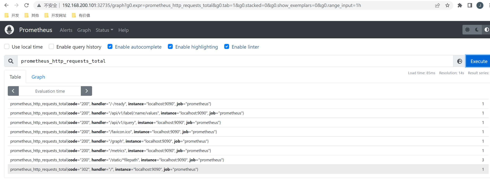

我们查询出了所有指标名称为 `prometheus_http_requests_total` 的数据。

PromQL 支持户根据时间序列的标签匹配模式来对时间序列进行过滤。

### 1.1 时间序列

~~~shell
# HELP node_cpu_seconds_total Seconds the cpus spent in each mode.
# TYPE node_cpu_seconds_total counter
node_cpu_seconds_total{cpu="0",mode="idle"} 6.62885731e+06
# HELP node_load1 1m load average.
# TYPE node_load1 gauge
node_load1 2.29
~~~

`node_cpu_seconds_total` 和 `node_load1` 表明了当前指标的名称、大括号中的标签则反映了当前样本的一些特征和维度、浮点数则是该监控样本的具体值。

Prometheus 会将所有采集到的样本数据以时间序列的方式保存在**内存数据库**中，并且定时保存到硬盘上。时间序列是按照时间戳和值的序列顺序存放的，我们称之为向量(vector)，每条时间序列通过指标名称(metrics name)和一组标签集(labelset)命名。

在时间序列中的每一个点称为一个样本（sample），样本由以下三部分组成：

- 指标(metric)：metric name 和描述当前样本特征的 labelsets
- 时间戳(timestamp)：一个精确到毫秒的时间戳
- 样本值(value)： 一个 float64 的浮点型数据表示当前样本的值

~~~shell
<--------------- metric ---------------------><-timestamp -><-value->
http_request_total{status="200", method="GET"}@1434417560938 => 94355
http_request_total{status="200", method="GET"}@1434417561287 => 94334

http_request_total{status="404", method="GET"}@1434417560938 => 38473
http_request_total{status="404", method="GET"}@1434417561287 => 38544

http_request_total{status="200", method="POST"}@1434417560938 => 4748
http_request_total{status="200", method="POST"}@1434417561287 => 4785
~~~

在形式上，所有的指标(Metric)都通过如下格式表示：

~~~shell
<metric name>{<label name> = <label value>, ...}
~~~

- 指标的名称(metric name)可以反映被监控样本的含义（比如，http_request_total - 表示当前系统接收到的 HTTP 请求总量）。指标名称只能由 ASCII 字符、数字、下划线以及冒号组成并必须符合正则表达式`[a-zA-Z_:][a-zA-Z0-9_:]*`。
- 标签(label)反映了当前样本的特征维度，通过这些维度 Prometheus 可以对样本数据进行过滤，聚合等。标签的名称只能由 ASCII 字符、数字以及下划线组成并满足正则表达式 `[a-zA-Z_][a-zA-Z0-9_]*`。

每个不同的 `metric_name`和 `label` 组合都称为**时间序列**，在 Prometheus 的表达式语言中，表达式或子表达式包括以下四种类型之一：

- 瞬时向量（Instant vector）：一组时间序列，每个时间序列包含单个样本，它们共享相同的时间戳。也就是说，表达式的返回值中只会包含该时间序列中的最新的一个样本值。而相应的这样的表达式称之为瞬时向量表达式。
- 区间向量（Range vector）：一组时间序列，每个时间序列包含一段时间范围内的样本数据，这些是通过将时间选择器附加到方括号中的瞬时向量（例如[5m]5分钟）而生成的。
- 标量（Scalar）：一个简单的数字浮点值。
- 字符串（String）：一个简单的字符串值。

所有这些指标都是 Prometheus 定期从 metrics 接口那里采集过来的。采集的间隔时间的设置由 `prometheus.yaml` 配置中的 `scrape_interval` 指定。最多抓取间隔为30秒，这意味着至少每30秒就会有一个带有新时间戳记录的新数据点，这个值可能会更改，也可能不会更改，但是每隔 `scrape_interval` 都会产生一个新的数据点。

### 1.2 指标类型

在 Node Exporter 返回的样本中指标 `node_load1` 反应的是当前系统的负载状态，随着时间的变化这个指标返回的样本数据是在不断变化的。而指标 `node_cpu_seconds_total` 所获取到的样本数据却不同，它是一个持续增大的值，因为其反应的是 CPU 的累计使用时间，从理论上讲只要系统不关机，这个值是会一直变大。

为了能够帮助用户理解和区分这些不同监控指标之间的差异，Prometheus 定义了4种不同的指标类型：Counter（计数器）、Gauge（仪表盘）、Histogram（直方图）、Summary（摘要）。

**Counter**

`Counter` 计数器，只增不减。

`Counter` 是一个简单但又强大的工具，例如我们可以在应用程序中记录某些事件发生的次数，通过以时间序列的形式存储这些数据，我们可以轻松的了解该事件产生的速率变化。`PromQL` 内置的聚合操作和函数可以让用户对这些数据进行进一步的分析，例如，通过 `rate()` 函数获取 HTTP 请求量的增长率：

```
rate(http_requests_total[5m])
```

查询当前系统中，访问量前 10 的 HTTP 请求：

```
topk(10, http_requests_total)
```

**Gauge**

`Gauge`（仪表盘）类型的指标侧重于反应系统的当前状态。因此这类指标的样本数据可增可减。

常见指标如：`node_memory_MemFree_bytes`（主机当前空闲的内存大小）、`node_memory_MemAvailable_bytes`（可用内存大小）都是 `Gauge` 类型的监控指标。

对于 `Gauge` 类型的监控指标，通过 `PromQL` 内置函数 `delta()` 可以获取样本在一段时间范围内的变化情况。例如，计算 CPU 温度在两个小时内的差异：

```
delta(cpu_temp_celsius{host="zeus"}[2h])
```

还可以直接使用 `predict_linear()` 对数据的变化趋势进行预测。例如，预测系统磁盘空间在4个小时之后的剩余情况：

```
predict_linear(node_filesystem_free_bytes[1h], 4 * 3600)
```

**Histogram 和 Summary**

`Histogram` 和 `Summary` 主用用于统计和分析样本的分布情况。

在大多数情况下人们都倾向于使用某些量化指标的平均值，例如 CPU 的平均使用率、页面的平均响应时间，这种方式也有很明显的问题，以系统 API 调用的平均响应时间为例：如果大多数 API 请求都维持在 100ms 的响应时间范围内，而个别请求的响应时间需要 5s，那么就会导致某些 WEB 页面的响应时间落到**中位数**上，而这种现象被称为**长尾问题**。

为了区分是平均的慢还是长尾的慢，最简单的方式就是按照请求延迟的范围进行分组。例如，统计延迟在 0~10ms 之间的请求数有多少而 10~20ms 之间的请求数又有多少。通过这种方式可以快速分析系统慢的原因。`Histogram` 和 `Summary` 都是为了能够解决这样的问题存在的，通过 `Histogram` 和`Summary` 类型的监控指标，我们可以快速了解监控样本的分布情况。

例如，指标 `prometheus_tsdb_wal_fsync_duration_seconds` 的指标类型为 Summary。它记录了 Prometheus Server 中 `wal_fsync` 的处理时间，通过访问 Prometheus Server 的 `/metrics` 地址，可以获取到以下监控样本数据：

```
# HELP prometheus_tsdb_wal_fsync_duration_seconds Duration of WAL fsync.
# TYPE prometheus_tsdb_wal_fsync_duration_seconds summary
prometheus_tsdb_wal_fsync_duration_seconds{quantile="0.5"} 0.012352463
prometheus_tsdb_wal_fsync_duration_seconds{quantile="0.9"} 0.014458005
prometheus_tsdb_wal_fsync_duration_seconds{quantile="0.99"} 0.017316173
prometheus_tsdb_wal_fsync_duration_seconds_sum 2.888716127000002
prometheus_tsdb_wal_fsync_duration_seconds_count 216
```


从上面的样本中可以得知当前 Prometheus Server 进行 `wal_fsync` 操作的总次数为216次，耗时2.888716127000002s。其中中位数（quantile=0.5）的耗时为0.012352463，9分位数（quantile=0.9）的耗时为0.014458005s。

在 Prometheus Server 自身返回的样本数据中，我们还能找到类型为 Histogram 的监控指标`prometheus_tsdb_compaction_chunk_range_seconds_bucket`：

```
# HELP prometheus_tsdb_compaction_chunk_range_seconds Final time range of chunks on their first compaction
# TYPE prometheus_tsdb_compaction_chunk_range_seconds histogram
prometheus_tsdb_compaction_chunk_range_seconds_bucket{le="100"} 71
prometheus_tsdb_compaction_chunk_range_seconds_bucket{le="400"} 71
prometheus_tsdb_compaction_chunk_range_seconds_bucket{le="1600"} 71
prometheus_tsdb_compaction_chunk_range_seconds_bucket{le="6400"} 71
prometheus_tsdb_compaction_chunk_range_seconds_bucket{le="25600"} 405
prometheus_tsdb_compaction_chunk_range_seconds_bucket{le="102400"} 25690
prometheus_tsdb_compaction_chunk_range_seconds_bucket{le="409600"} 71863
prometheus_tsdb_compaction_chunk_range_seconds_bucket{le="1.6384e+06"} 115928
prometheus_tsdb_compaction_chunk_range_seconds_bucket{le="6.5536e+06"} 2.5687892e+07
prometheus_tsdb_compaction_chunk_range_seconds_bucket{le="2.62144e+07"} 2.5687896e+07
prometheus_tsdb_compaction_chunk_range_seconds_bucket{le="+Inf"} 2.5687896e+07
prometheus_tsdb_compaction_chunk_range_seconds_sum 4.7728699529576e+13
prometheus_tsdb_compaction_chunk_range_seconds_count 2.5687896e+07
```


与 `Summary` 类型的指标相似之处在于 `Histogram` 类型的样本同样会反应当前指标的记录的总数(以 `_count` 作为后缀)以及其值的总量（以 `_sum` 作为后缀）。不同在于 `Histogram` 指标直接反应了在不同区间内样本的个数，区间通过标签 le 进行定义。

### 1.3 完全匹配

PromQL 支持户根据时间序列的标签匹配模式来对时间序列进行过滤，目前主要支持两种匹配模式：完全匹配和正则匹配。

PromQL 支持使用 = 和 != 两种完全匹配模式。

- 等于。通过使用 `label=value` 可以选择那些标签满足表达式定义的时间序列。
- 不等于。通过使用 `label!=value` 则可以根据标签匹配排除时间序列。

我们上面查询出了所有指标名称为 `prometheus_http_requests_total` 的数据。这时候我们希望只查看错误的请求，即过滤掉所有 code 标签不是 200 的数据。那么我们的 PromQL 表达式可以修改为：

~~~shell
prometheus_http_requests_total{code!="200"}
~~~


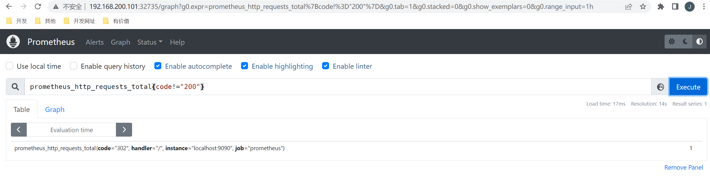

### 1.4 正则匹配

PromQL 还可以使用正则表达式作为匹配条件，并且可以使用多个匹配条件。

- 正向匹配。使用 `label=~regx` 表示选择那些标签符合正则表达式定义的时间序列。
- 反向匹配。使用 `label!~regx` 进行排除。

例如我想查询指标 prometheus_http_requests_total 中，所有 handler 标签以 `/api/v1` 开头的记录，那么我的表达式为：

~~~shell
prometheus_http_requests_total{handler=~"/api/v1/.*"}
~~~

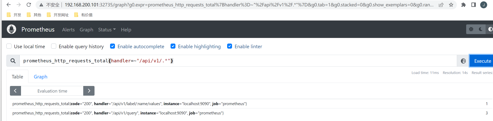

### 1.5 范围查询

上面直接通过类似 prometheus_http_requests_total 表达式查询时间序列时，同一个指标同一标签只会返回一条数据。这样的表达式我们称之为**瞬间向量表达式**，而返回的结果称之为**瞬间向量**。

如果我们想查询一段时间范围内的样本数据，那么我们就需要用到**区间向量表达式**，其查询出来的结果称之为**区间向量**。时间范围通过时间范围选择器 `[]` 进行定义。例如，通过以下表达式可以选择最近5分钟内的所有样本数据：

~~~shell
prometheus_http_requests_total{}[5m]
~~~

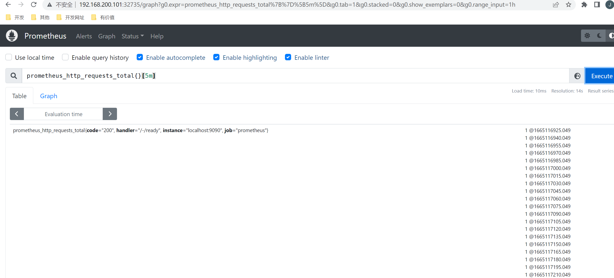

此时我们查询出了所有的样本数据，而不再是一个样本数据的统计值。

除了使用m表示分钟以外，PromQL的时间范围选择器支持其它时间单位：

- s - 秒
- m - 分钟
- h - 小时
- d - 天
- w - 周
- y - 年

### 1.6 时间位移操作

在瞬时向量表达式或者区间向量表达式中，都是以当前时间为基准：

~~~shell
# 瞬时向量表达式，选择当前最新的数据
prometheus_http_requests_total{} 
# 区间向量表达式，选择以当前时间为基准，5分钟内的数据
prometheus_http_requests_total{}[5m] 
~~~

如果我们想查询 5 分钟前的瞬时样本数据，或昨天一天的区间内的样本数据呢? 这个时候我们就可以使用位移操作，位移操作的关键字为 offset。

~~~shell
# 查询 5 分钟前的最新数据
prometheus_http_requests_total{} offset 5m
# 往前移动 1 天，查询 1 天前的数据
prometheus_http_requests_total{}[1d] offset 1d
~~~

### 1.7 聚合操作

一般情况下，我们通过 PromQL 查询到的数据都是很多的。PromQL 提供的聚合操作可以用来对这些时间序列进行处理，形成一条新的时间序列。

以我们的 prometheus_http_requests_total 指标为例，不加任何条件我们查询到的数据为：

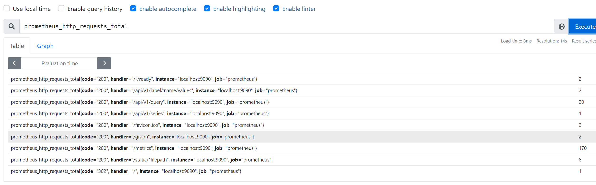

从上图查询结果可以知道，一共有 9 条数据，这 9 条数据的 value 总和为 206。那么我们使用下面两个聚合操作表达式来查询，看看结果对不对。

第一个表达式，计算一共有几条数据：

~~~shell
count(prometheus_http_requests_total)
~~~

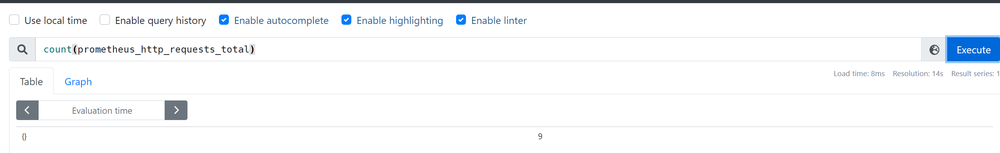

第二个表达式，计算所有数据的 value 总和：

~~~shell
sum(prometheus_http_requests_total)
~~~

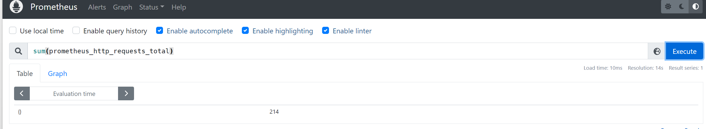

count 的数值是一致的，但是 sum 的数值有误差，这是因为我们两次查询的时间间隔内，某些记录的数值发生了变化。

### 1.8 标量

在 PromQL 中，标量是一个浮点型的数字值，没有时序。例如：`10`。

需要注意的是，当使用表达式`count(http_requests_total)`，返回的数据类型，依然是瞬时向量。用户可以通过内置函数scalar()将单个瞬时向量转换为标量

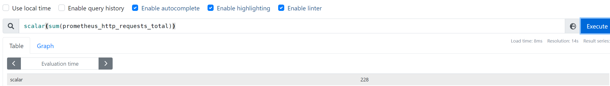

我们将 sum 操作的值用 scalar 转换了一下，最终的结果就是一个标量了

### 1.9 字符串

在 PromQL 中，字符串是一个简单的字符串值。直接使用字符串作为 PromQL 表达式，则会直接返回字符串。

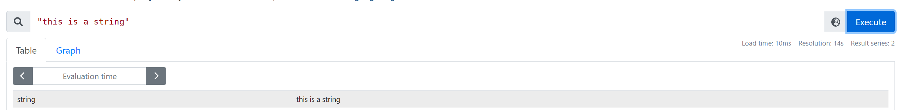

## 2. PromQL 操作符

PromQL 还支持丰富的操作符，用户可以使用这些操作符对进一步的对事件序列进行二次加工。这些操作符包括：数学运算符，逻辑运算符，布尔运算符等等。

### 2.1 数学运算符

数学运算符比较简单，就是简单的加减乘除等。

例如我们通过 `prometheus_http_response_size_bytes_sum` 可以查询到 Prometheus 这个应用的 HTTP 响应字节总和。但是这个单位是字节，我们希望用 MB 显示。那么我们可以这么设置：

~~~shell
prometheus_http_response_size_bytes_sum/8/1024
~~~

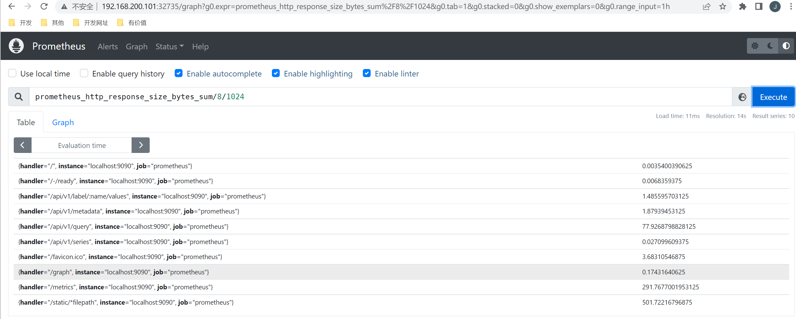

最终显示的数据就是以 MB 作为单位的数值。

PromQL支持的所有数学运算符如下所示：

- `+ (加法)`
- `- (减法)`
- `* (乘法)`
- / (除法)
- % (求余)
- ^ (幂运算)

### 2.2 布尔运算符

布尔运算符支持用户根据时间序列中样本的值，对时间序列进行过滤。例如我们可以通过 prometheus_http_requests_total 查询出每个接口的请求次数，但是如果我们想筛选出请求次数超过 20 次的接口呢？

此时我们可以用下面的 PromQL 表达式：

```
prometheus_http_requests_total > 20
```

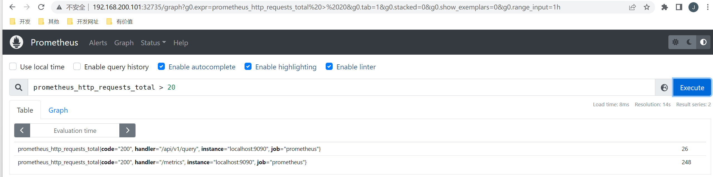

从上面的图中我们可以看到，value 的值还是具体的数值。但如果我们希望对符合条件的数据，value 变为 1。不符合条件的数据，value 变为 0。那么我们可以使用**bool修饰符。**

我们使用下面的 PromQL 表达式：

```
prometheus_http_requests_total > bool 20
```

从下面的执行结果可以看到，这时候并不过滤掉数据，而是将 value 的值变成了 1 或 0。

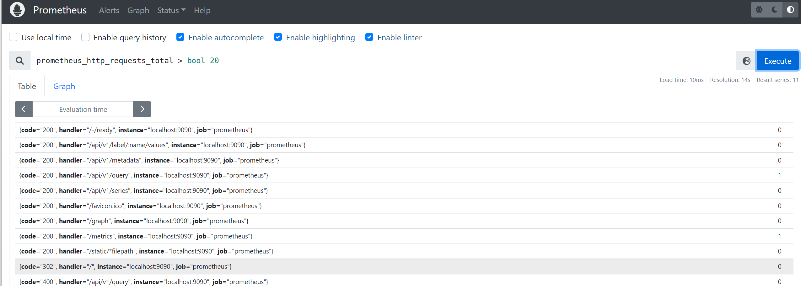

目前，Prometheus支持以下布尔运算符如下：

- ` == (相等)`
- `!= (不相等)`
- `> (大于)`
- `< (小于)`
- `>= (大于等于)`
- `<= (小于等于)`

### 2.3 集合运算符

通过集合运算，可以在两个瞬时向量与瞬时向量之间进行相应的集合操作。目前，Prometheus支持以下集合运算符：

- and 与操作
- or 或操作
- unless 排除操作

#### 2.3.1 and 与操作

vector1 and vector2 进行一个与操作，会产生一个新的集合。该集合中的元素同时在 vector1 和 vector2 中都存在。

例如我们有 vector1 为 A B C，vector2 为 B C D，那么 vector1 and vector2 的结果为：B C。

#### 2.3.2 or 或操作

vector1 and vector2 进行一个或操作，会产生一个新的集合。该集合中包含 vector1 和 vector2 中的所有元素。

例如我们有 vector1 为 A B C，vector2 为 B C D，那么 vector1 or vector2 的结果为：A B C D。

#### 2.3.3 unless 排除操作

vector1 and vector2 进行一个或操作，会产生一个新的集合。该集合首先取 vector1 集合的所有元素，然后排除掉所有在 vector2 中存在的元素。

例如我们有 vector1 为 A B C，vector2 为 B C D，那么 vector1 unless vector2 的结果为：A。

### 2.4 操作符优先级

在PromQL操作符中优先级由高到低依次为：

- `^`
- `*, /, %`
- `+, -`
- `==, !=, <=, <, >=, >`
- `and, unless`
- `or`

## 3. 聚合操作

Prometheus 还提供了聚合操作符，这些操作符作用于瞬时向量。可以将瞬时表达式返回的样本数据进行聚合，形成一个新的时间序列。目前支持的聚合函数有：

- sum (求和)
- min (最小值)
- max (最大值)
- avg (平均值)
- stddev (标准差)
- stdvar (标准方差)
- count (计数)
- count_values (对value进行计数)
- bottomk (后n条时序)
- topk (前n条时序)
- quantile (分位数)

### 3.1 sum 求和

用于对记录的 value 值进行求和。

例如：`sum(prometheus_http_requests_total)` 表示统计所有 HTTP 请求的次数。

### 3.2 min 最小值

返回所有记录的最小值。

当我们执行如下 PromQL 时，会筛选出最小的记录值。

```
min(prometheus_http_requests_total)
```

### 3.3 max 最大值

返回所有记录的最大值。

当我们执行如下 PromQL 时，会筛选出最大的记录值。

```
max(prometheus_http_requests_total)
```

### 3.4 avg 平均值

avg 函数返回所有记录的平均值。

当我们执行如下 PromQL 时，会筛选出平均值。

```
avg(prometheus_http_requests_total)
```

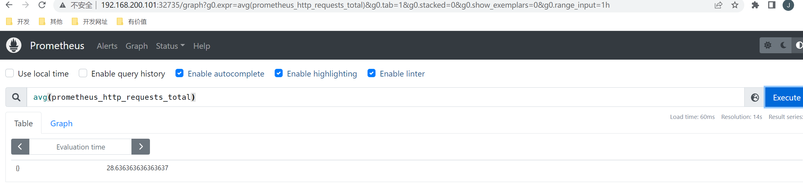

### 3.5 stddev 标准差

标准差（Standard Deviation）常用来描述数据的波动大小。例如我们统计篮球队员身高：

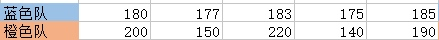

两支队伍平均身高都是 180，看起来似乎差不多。但如果画图的话，得到结果如下：

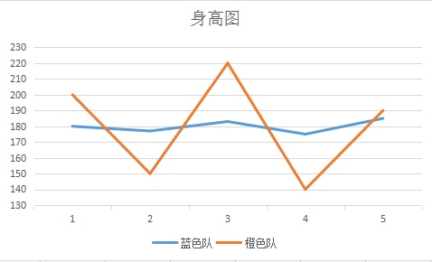

很显然，蓝色队队员身高更加整齐一些，橙色队身高显得参差不齐。为了反映一组数据，偏离平均值的程度，就有了「标准差 」这个概念。

如果数据量很大，比如几万人的身高，我们不容易从折线图看出来，可以直接用公式计算。上图的数据标准差计算结果为：

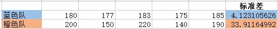

很明显，橙色队的标准差比蓝色队标准差大很多。这说明橙色队的身高波动更大。

当我们执行如下 PromQL 时，会计算出不同 HTTP 请求的数量波动情况。

```
stddev(prometheus_http_requests_total)
```

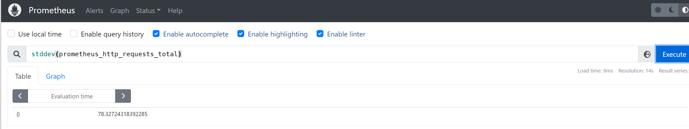

### 3.6 count 计数

count 函数返回所有记录的计数。

例如：`count(prometheus_http_requests_total)` 表示统计所有 HTTP 请求的次数。

### 3.7 bottomk 后几条

bottomk 用于对样本值进行排序，返回当前样本值后 N 位的时间序列。

例如获取 HTTP 请求量后 5 位的请求，可以使用表达式：

```
bottomk(5, prometheus_http_requests_total)
```

### 3.8 topk 前几条

topk 用于对样本值进行排序，返回当前样本值前 N 位的时间序列。

例如获取 HTTP 请求量前 5 位的请求，可以使用表达式：

```
topk(5, prometheus_http_requests_total)
```

## 4. PromQL 内置函数

PromQL 提供了大量的内置函数，可以对时序数据进行丰富的处理。例如 irate() 函数可以帮助我们计算监控指标的增长率，不需要我们去手动计算。

### 4.1 rate 增长率

我们知道 counter 类型指标的特点是只增不减，在没有发生重置的情况下，其样本值是不断增大的。为了能直观地观察期变化情况，需要计算样本的增长率。`increase(v range-vector)` 函数是 PromQL 中提供的众多内置函数之一。其中参数 v 是一个区间向量，increase 函数获取区间向量中的第一个和最后一个样本并返回其增长量。因此，可以通过以下表达式Counter类型指标的增长率：

```
increase(node_cpu[2m]) / 120
```

这里通过node_cpu[2m]获取时间序列最近两分钟的所有样本，increase计算出最近两分钟的增长量，最后除以时间120秒得到node_cpu样本在最近两分钟的平均增长率。并且这个值也近似于主机节点最近两分钟内的平均CPU使用率。

除了使用increase函数以外，PromQL中还直接内置了rate(v range-vector)函数，rate函数可以直接计算区间向量v在时间窗口内平均增长速率。因此，通过以下表达式可以得到与increase函数相同的结果：

```
rate(node_cpu[2m])
```

需要注意的是使用rate或者increase函数去计算样本的平均增长速率，容易陷入「长尾问题」当中，其无法反应在时间窗口内样本数据的突发变化。

例如，对于主机而言在 2 分钟的时间窗口内，可能在某一个由于访问量或者其它问题导致 CPU 占用 100% 的情况，但是通过计算在时间窗口内的平均增长率却无法反应出该问题。

为了解决该问题，PromQL提供了另外一个灵敏度更高的函数 `irate(v range-vector)`。irate 同样用于计算区间向量的增长速率，但是其反应出的是瞬时增长率。irate 函数是通过区间向量中最后两个样本数据来计算区间向量的增长速率。

这种方式可以避免在时间窗口范围内的「长尾问题」，并且体现出更好的灵敏度，通过 irate 函数绘制的图标能够更好的反应样本数据的瞬时变化状态。

```
irate(node_cpu[2m])
```

irate函数相比于rate函数提供了更高的灵敏度，不过当需要分析长期趋势或者在告警规则中，irate的这种灵敏度反而容易造成干扰。因此在长期趋势分析或者告警中更推荐使用rate函数。

### 4.2 predict_linear 增长预测

在一般情况下，系统管理员为了确保业务的持续可用运行，会针对服务器的资源设置相应的告警阈值。例如，当磁盘空间只剩512MB时向相关人员发送告警通知。 这种基于阈值的告警模式对于当资源用量是平滑增长的情况下是能够有效的工作的。

但是如果资源不是平滑变化的呢？ 比如有些某些业务增长，存储空间的增长速率提升了高几倍。这时，如果基于原有阈值去触发告警，当系统管理员接收到告警以后可能还没来得及去处理问题，系统就已经不可用了。

因此阈值通常来说不是固定的，需要定期进行调整才能保证该告警阈值能够发挥去作用。 那么还有没有更好的方法吗？

PromQL 中内置的 `predict_linear(v range-vector, t scalar)` 函数可以帮助系统管理员更好的处理此类情况，predict_linear 函数可以预测时间序列v在t秒后的值。

它基于简单线性回归的方式，对时间窗口内的样本数据进行统计，从而可以对时间序列的变化趋势做出预测。例如，基于2小时的样本数据，来预测主机可用磁盘空间的是否在4个小时候被占满，可以使用如下表达式：

```
predict_linear(node_filesystem_free{job="node"}[2h], 4 * 3600) < 0
```

