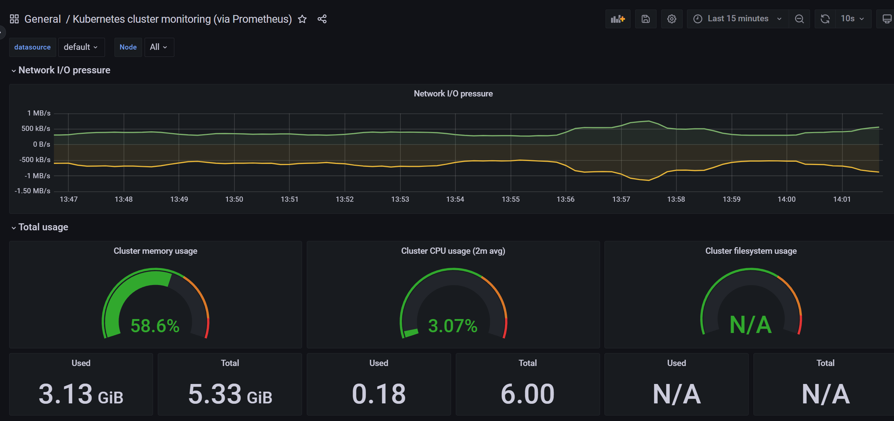

# Grafana

前面我们使用 Prometheus 采集了 Kubernetes 集群中的一些监控数据指标，也使用 promQL 语句查询出了一些数据，并且在 Prometheus 的 Dashboard 中进行了展示，但是 Prometheus 的图表功能相对较弱，所以一般情况下我们会一个第三方的工具来展示这些数据，这就是 [Grafana](http://grafana.com/)。

Grafana 是一个可视化面板，有着非常漂亮的图表和布局展示，功能齐全的度量仪表盘和图形编辑器，支持 Graphite、zabbix、InfluxDB、Prometheus、OpenTSDB、Elasticsearch 等作为数据源，比 Prometheus 自带的图表展示功能强大太多，更加灵活，有丰富的插件，功能更加强大。

## 1. 安装

同样的我们将 grafana 安装到 Kubernetes 集群中，github地址：https://github.com/grafana/grafana

grafana.yaml

```yaml
apiVersion: apps/v1
kind: Deployment
metadata:
  name: grafana
  namespace: prom
spec:
  selector:
    matchLabels:
      app: grafana
  template:
    metadata:
      labels:
        app: grafana
    spec:
      volumes:
      - name: storage
        hostPath:
          path: /data/grafana/
      nodeSelector:
        monitor: prometheus
      securityContext:
        runAsUser: 0
      containers:
      - name: grafana
        image: grafana/grafana:9.1.7
        imagePullPolicy: IfNotPresent
        ports:
        - containerPort: 3000
          name: grafana
        env:
        - name: GF_SECURITY_ADMIN_USER
          value: admin
        - name: GF_SECURITY_ADMIN_PASSWORD
          value: admin321
        readinessProbe:
          failureThreshold: 10
          httpGet:
            path: /api/health
            port: 3000
            scheme: HTTP
          initialDelaySeconds: 60
          periodSeconds: 10
          successThreshold: 1
          timeoutSeconds: 30
        livenessProbe:
          failureThreshold: 3
          httpGet:
            path: /api/health
            port: 3000
            scheme: HTTP
          periodSeconds: 10
          successThreshold: 1
          timeoutSeconds: 1
        resources:
          limits:
            cpu: 150m
            memory: 512Mi
          requests:
            cpu: 150m
            memory: 512Mi
        volumeMounts:
        - mountPath: /var/lib/grafana
          name: storage
---
apiVersion: v1
kind: Service
metadata:
  name: grafana
  namespace: prom
spec:
  type: NodePort
  ports:
    - port: 3000
  selector:
    app: grafana
```


我们使用了最新的镜像 `grafana/grafana:9.1.7`，然后添加了健康检查、资源声明，另外两个比较重要的环境变量`GF_SECURITY_ADMIN_USER` 和 `GF_SECURITY_ADMIN_PASSWORD`，用来配置 grafana 的管理员用户和密码的，由于 grafana 将 dashboard、插件这些数据保存在 `/var/lib/grafana` 这个目录下面的，所以我们这里如果需要做数据持久化的话，就需要针对这个目录进行 volume 挂载声明，和 Prometheus 一样，我们将 grafana 固定在一个具有 `monitor: prometheus` 标签的节点，我们这里增加一个 `securityContext` 的声明来进行声明使用 root 用户运行。最后，我们需要对外暴露 grafana 这个服务，所以我们需要一个对应的 Service 对象，当然用 NodePort 或者再建立一个 ingress 对象都是可行的。

现在我们直接创建上面的这些资源对象：

```shell
[root@master grafana]# kubectl apply -f grafana.yaml
deployment.apps/grafana created
service/grafana created
```


创建完成后，我们可以查看 grafana 对应的 Pod 是否正常：

```shell
# 等待一会 因为要拉取镜像速度会慢一些
[root@master grafana]# kubectl get pods -n prom -l app=grafana         
NAME                       READY   STATUS    RESTARTS   AGE
grafana-697665fdf5-bz7bv   1/1     Running   0          2m17s
```

查看 Service 对象：

```shell
[root@master grafana]# kubectl get svc -n prom
NAME         TYPE        CLUSTER-IP       EXTERNAL-IP   PORT(S)             AGE
grafana      NodePort    10.99.102.172    <none>        3000:31849/TCP      3m17s
prometheus   NodePort    10.108.130.123   <none>        9090:32735/TCP      4d1h
redis        ClusterIP   10.108.54.12     <none>        6379/TCP,9121/TCP   3d2h
```


现在我们就可以在浏览器中使用 `http://<任意节点IP:31849>` 来访问 grafana 这个服务了：


由于上面我们配置了管理员的，所以第一次打开的时候会跳转到登录界面，然后就可以用上面我们配置的两个环境变量的值来进行登录了，登录完成后就可以进入到下面 Grafana 的首页，然后点击`Add data source`进入添加数据源界面。


我们这个地方配置的数据源是 `Prometheus`，我们这里 Prometheus 和 Grafana 都处于 `prom` 这同一个 namespace 下面，所以我们这里的数据源地址：`http://prometheus:9090`（因为在同一个 namespace 下面所以直接用 Service 名也可以），然后其他的配置信息就根据实际情况了，比如 Auth 认证，我们这里没有，所以跳过即可，点击最下方的 `Save & Test` 提示成功证明我们的数据源配置正确：


## 2. 配置面板

在 Grafana 中有`Dashboard`和`Panel`的概念，Dashboard 可以理解成`看板`，而 Panel 可以理解成`图表`，一个看看板中包含了无数个图表。


添加一个新的面板，然后添加一个图表，我们创建一个图表来显示 CPU 的使用率变化情况


## 3. 模板中心

对于线上监控来讲，如果我们每个面板都需要自己从零开始，那么就太累了。事实上，我们用到的许多监控信息都是类似的。因此 [Grafana官网 - Dashboards 模块](https://grafana.com/grafana/dashboards) 提供了下载 Dashboard 模板的功能。


Dashboards 里有许多各种类型的 Dashboard 面板，例如 JVM 监控、MySQL 数据库监控等。你只需找到合适自己的监控面板，之后根据 ID 添加即可。

复制它的 ID 并使用 Grafana 的 import 功能导入即可，如下图所示：


k8s的集群监控，我们添加https://grafana.com/grafana/dashboards/3119-kubernetes-cluster-monitoring-via-prometheus/，3119这个即可。



当然，可以根据实际的应用场景，自行来创建面板即可。