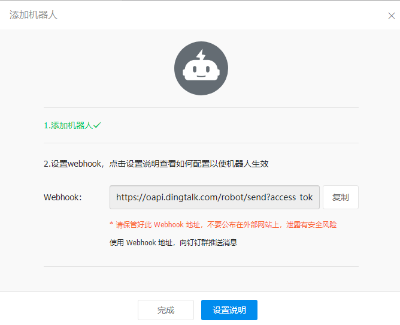

# Alertmanager

Prometheus 包含一个报警模块，就是 `AlertManager`，Alertmanager 主要用于接收 Prometheus 发送的告警信息，它支持丰富的告警通知渠道，而且很容易做到告警信息进行去重，降噪，分组等，是一款前卫的告警通知系统。

通过在 Prometheus 中定义告警规则，Prometheus会周期性的对告警规则进行计算，如果满足告警触发条件就会向Alertmanager 发送告警信息。

在 Prometheus 中一条告警规则主要由以下几部分组成：

- 告警名称：用户需要为告警规则命名，当然对于命名而言，需要能够直接表达出该告警的主要内容
- 告警规则：告警规则实际上主要由 `PromQL` 进行定义，其实际意义是当表达式（PromQL）查询结果持续多长时间（During）后出发告警

在 Prometheus 中，还可以通过 Group（告警组）对一组相关的告警进行统一定义。Alertmanager 作为一个独立的组件，负责接收并处理来自 Prometheus Server 的告警信息。Alertmanager 可以对这些告警信息进行进一步的处理，比如当接收到大量重复告警时能够消除重复的告警信息，同时对告警信息进行分组并且路由到正确的通知方，Prometheus 内置了对邮件、Slack 多种通知方式的支持，同时还支持与 Webhook 的集成，以支持更多定制化的场景。例如，目前 Alertmanager 还不支持钉钉，用户完全可以通过 Webhook 与钉钉机器人进行集成，从而通过钉钉接收告警信息。同时 AlertManager 还提供了静默和告警抑制机制来对告警通知行为进行优化。

## 1. 安装

从官方文档 https://prometheus.io/docs/alerting/configuration/ 中我们可以看到下载 AlertManager 二进制文件后，可以通过下面的命令运行：

```shell
$ ./alertmanager --config.file=simple.yml
```

其中 `-config.file` 参数是用来指定对应的配置文件的，由于我们这里同样要运行到 Kubernetes 集群中来，所以我们使用镜像的方式来安装，使用的镜像是：`prom/alertmanager:v0.24.0`。

首先，指定配置文件，同样的，我们这里使用一个 ConfigMap 资源对象：(alertmanager-config.yaml)

```yaml
apiVersion: v1
kind: ConfigMap
metadata:
  name: alert-config
  namespace: prom
data:
  config.yml: |-
    global:
      resolve_timeout: 5m # 当alertmanager持续多长时间未接收到告警后标记告警状态为 resolved
      smtp_smarthost: 'smtp.163.com:25' # 配置邮件发送信息
      smtp_from: 'huo9190@163.com'
      smtp_auth_username: 'huo9190@163.com'
      smtp_auth_password: '<邮箱密码>'
      smtp_hello: '163.com'
      smtp_require_tls: false
    route: # 路由 用来设置报警的分发策略
      group_by: ['alertname', 'cluster'] # 这里的标签列表是接收到报警信息后的重新分组标签，例如，接收到的报警信息里面有许多具有 cluster=A 和 alertname=LatncyHigh 这样的标签的报警信息将会批量被聚合到一个分组里面
      group_wait: 30s   # 当一个新的报警分组被创建后，需要等待至少 group_wait 时间来初始化通知，这种方式可以确保您能有足够的时间为同一分组来获取多个警报，然后一起触发这个报警信息。
      group_interval: 30s # 相同的group之间发送告警通知的时间间隔
      repeat_interval: 1h # 如果一个报警信息已经发送成功了，等待 repeat_interval 时间来重新发送他们，不同类型告警发送频率需要具体配置
      receiver: default # 默认的receiver：如果一个报警没有被一个route匹配，则发送给默认的接收器
      routes: # 上面所有的属性都由所有子路由继承，并且可以在每个子路由上进行覆盖。
      - receiver: email
        group_wait: 10s
        match:
          team: node
    receivers:
    - name: 'default'
      email_configs:
      - to: '130823919@qq.com'
        send_resolved: true  # 接受告警恢复的通知
    - name: 'email'
      email_configs:
      - to: '130823919@qq.com'
        send_resolved: true  # 接受告警恢复的通知
      wechat_configs:
      - corp_id: 'wwbc278da3ffe0a685'
    	send_resolved: true
    	to_party: '1'
    	agent_id: '1000004'
    	api_secret: 'kliNRXPj4IpBtQdUUxsv83Z0IYnvhHyKq_1F3Wt45as'
      webhook_configs:
 	  - url: "http://dingtalk.prom.svc.cluster.local:8060/dingtalk/webhook/send"
```

**分组**

分组机制可以将详细的告警信息合并成一个通知，在某些情况下，比如由于系统宕机导致大量的告警被同时触发，在这种情况下分组机制可以将这些被触发的告警合并为一个告警通知，避免一次性接受大量的告警通知，而无法对问题进行快速定位。

直接创建这个 ConfigMap 资源对象：

```shell
[root@master alert]# kubectl apply -f alertmanager-config.yaml
configmap/alert-config created
```


然后配置 AlertManager 的容器，直接使用一个 Deployment 来进行管理即可，对应的 YAML 资源声明如下：

```yaml
apiVersion: apps/v1
kind: Deployment
metadata:
  name: alertmanager
  namespace: prom
  labels:
    app: alertmanager
spec:
  selector:
    matchLabels:
      app: alertmanager
  template:
    metadata:
      labels:
        app: alertmanager
    spec:
      volumes:
      - name: alertcfg
        configMap:
          name: alert-config
      containers:
      - name: alertmanager
        image: prom/alertmanager:v0.24.0
        imagePullPolicy: IfNotPresent
        args:
        - "--config.file=/etc/alertmanager/config.yml"
        ports:
        - containerPort: 9093
          name: http
        volumeMounts:
        - mountPath: "/etc/alertmanager"
          name: alertcfg
        resources:
          requests:
            cpu: 100m
            memory: 256Mi
          limits:
            cpu: 100m
            memory: 256Mi
```


这里我们将上面创建的 `alert-config` 这个 ConfigMap 资源对象以 Volume 的形式挂载到 `/etc/alertmanager` 目录下去，然后在启动参数中指定了配置文件 `--config.file=/etc/alertmanager/config.yml`，然后我们可以来创建这个资源对象：

```shell
[root@master alert]# kubectl apply -f alertmanager.yaml       
deployment.apps/alertmanager created
```


为了可以访问到 AlertManager，同样需要我们创建一个对应的 Service 对象：(alertmanager-svc.yaml)

```yaml
apiVersion: v1
kind: Service
metadata:
  name: alertmanager
  namespace: prom
  labels:
    app: alertmanager
spec:
  selector:
    app: alertmanager
  type: NodePort
  ports:
    - name: web
      port: 9093
      targetPort: http
```


使用 NodePort 类型也是为了方便测试，创建上面的 Service 这个资源对象：

```shell
[root@master alert]# kubectl apply -f alertmanager-svc.yaml
service/alertmanager created
[root@master alert]# kubectl get pods -n prom                                
NAME                            READY   STATUS    RESTARTS        AGE
alertmanager-57c9f7c986-8wmxb   1/1     Running   0               3s
grafana-697665fdf5-pkktd        1/1     Running   0               5h29m
node-exporter-b8hhf             1/1     Running   3 (7h53m ago)   4d6h
node-exporter-fcl9d             1/1     Running   3               4d6h
node-exporter-rk9wb             1/1     Running   3 (7h53m ago)   4d6h
prometheus-cfc6c98f-mqh86       1/1     Running   3 (7h53m ago)   4d7h
redis-65c96d4bb4-jg74p          2/2     Running   4 (7h53m ago)   3d8h
[root@master alert]# kubectl get svc -n prom                                    
NAME           TYPE        CLUSTER-IP       EXTERNAL-IP   PORT(S)             AGE
alertmanager   NodePort    10.107.138.153   <none>        9093:30650/TCP      5m3s
```


AlertManager 的容器启动起来后，我们还需要在 Prometheus 中配置下 AlertManager 的地址，让 Prometheus 能够访问到 AlertManager，在 Prometheus 的 ConfigMap 资源清单中添加如下配置：

```yaml
alerting:
  alertmanagers:
  - static_configs:
    - targets: ["alertmanager:9093"]
```

更新这个资源对象后，稍等一小会儿，执行 reload 操作即可。

~~~shell
[root@master prom]# curl -X POST "http://10.108.130.123:9090/-/reload"
~~~

## 2. 配置文件详解

~~~yaml
global:
  # 经过此时间后，如果尚未更新告警，则将告警声明为已恢复。(即prometheus没有向alertmanager发送告警了)
  resolve_timeout: 5m
  # 配置发送邮件信息
  smtp_smarthost: 'smtp.qq.com:465'
  smtp_from: 'xx@qq.com'
  smtp_auth_username: 'xx@qq.com'
  smtp_auth_password: 'password'
  smtp_require_tls: false
 
# 读取告警通知模板的目录。
templates: 
- '/etc/alertmanager/template/*.tmpl'
 
# 所有报警都会进入到这个根路由下，可以根据根路由下的子路由设置报警分发策略
route:
  # 先解释一下分组，分组就是将多条告警信息聚合成一条发送，这样就不会收到连续的报警了。
  # 将传入的告警按标签分组(标签在prometheus中的rules中定义)，例如：
  # 接收到的告警信息里面有许多具有cluster=A 和 alertname=LatencyHigh的标签，这些个告警将被分为一个组。
  # 如果不想使用分组，可以这样写group_by: [...]
  group_by: ['alertname', 'cluster', 'service']
 
  # 第一组告警发送通知需要等待的时间，这种方式可以确保有足够的时间为同一分组获取多个告警，然后一起触发这个告警信息。
  group_wait: 30s
 
  # 发送第一个告警后，等待"group_interval"发送一组新告警。
  group_interval: 5m
 
  # 分组内发送相同告警的时间间隔。这里的配置是每3小时发送告警到分组中。举个例子：收到告警后，一个分组被创建，等待5分钟发送组内告警，如果后续组内的告警信息相同,这些告警会在3小时后发送，但是3小时内这些告警不会被发送。
  repeat_interval: 3h 
 
  # 这里先说一下，告警发送是需要指定接收器的，接收器在receivers中配置，接收器可以是email、webhook、pagerduty、wechat等等。一个接收器可以有多种发送方式。
  # 指定默认的接收器
  receiver: team-X-mails
  
  # 下面配置的是子路由，子路由的属性继承于根路由(即上面的配置)，在子路由中可以覆盖根路由的配置
 
  # 下面是子路由的配置
  routes:
  # 使用正则的方式匹配告警标签
  - match_re:
      # 这里可以匹配出标签含有service=foo1或service=foo2或service=baz的告警
      service: ^(foo1|foo2|baz)$
    # 指定接收器为team-X-mails
    receiver: team-X-mails
    # 这里配置的是子路由的子路由，当满足父路由的的匹配时，这条子路由会进一步匹配出severity=critical的告警，并使用team-X-pager接收器发送告警，没有匹配到的告警会由父路由进行处理。
    routes:
    - match:
        severity: critical
      receiver: team-X-pager
 
  # 这里也是一条子路由，会匹配出标签含有service=files的告警，并使用team-Y-mails接收器发送告警
  - match:
      service: files
    receiver: team-Y-mails
    # 这里配置的是子路由的子路由，当满足父路由的的匹配时，这条子路由会进一步匹配出severity=critical的告警，并使用team-Y-pager接收器发送告警，没有匹配到的会由父路由进行处理。
    routes:
    - match:
        severity: critical
      receiver: team-Y-pager
 
  # 该路由处理来自数据库服务的所有警报。如果没有团队来处理，则默认为数据库团队。
  - match:
      # 首先匹配标签service=database
      service: database
    # 指定接收器
    receiver: team-DB-pager
    # 根据受影响的数据库对告警进行分组
    group_by: [alertname, cluster, database]
    routes:
    - match:
        owner: team-X
      receiver: team-X-pager
      # 告警是否继续匹配后续的同级路由节点，默认false，下面如果也可以匹配成功，会向两种接收器都发送告警信息(猜测。。。)
      continue: true
    - match:
        owner: team-Y
      receiver: team-Y-pager
 
 
# 下面是关于inhibit(抑制)的配置，先说一下抑制是什么：抑制规则允许在另一个警报正在触发的情况下使一组告警静音。其实可以理解为告警依赖。比如一台数据库服务器掉电了，会导致db监控告警、网络告警等等，可以配置抑制规则如果服务器本身down了，那么其他的报警就不会被发送出来。
 
inhibit_rules:
#下面配置的含义：当有多条告警在告警组里时，并且他们的标签alertname,cluster,service都相等，如果severity: 'critical'的告警产生了，那么就会抑制severity: 'warning'的告警。
- source_match:  # 源告警(我理解是根据这个报警来抑制target_match中匹配的告警)
    severity: 'critical' # 标签匹配满足severity=critical的告警作为源告警
  target_match:  # 目标告警(被抑制的告警)
    severity: 'warning'  # 告警必须满足标签匹配severity=warning才会被抑制。
  equal: ['alertname', 'cluster', 'service']  # 必须在源告警和目标告警中具有相等值的标签才能使抑制生效。(即源告警和目标告警中这三个标签的值相等'alertname', 'cluster', 'service')
 
 
# 下面配置的是接收器
receivers:
# 接收器的名称、通过邮件的方式发送、
- name: 'team-X-mails'
  email_configs:
    # 发送给哪些人
  - to: 'team-X+alerts@example.org'
    # 是否通知已解决的警报
    send_resolved: true
 
# 接收器的名称、通过邮件和pagerduty的方式发送、发送给哪些人，指定pagerduty的service_key
- name: 'team-X-pager'
  email_configs:
  - to: 'team-X+alerts-critical@example.org'
  pagerduty_configs:
  - service_key: <team-X-key>
 
# 接收器的名称、通过邮件的方式发送、发送给哪些人
- name: 'team-Y-mails'
  email_configs:
  - to: 'team-Y+alerts@example.org'
 
# 接收器的名称、通过pagerduty的方式发送、指定pagerduty的service_key
- name: 'team-Y-pager'
  pagerduty_configs:
  - service_key: <team-Y-key>
 
# 一个接收器配置多种发送方式
- name: 'ops'
  webhook_configs:
  - url: 'http://prometheus-webhook-dingtalk.kube-ops.svc.cluster.local:8060/dingtalk/webhook1/send'
    send_resolved: true
  email_configs:
  - to: 'xx@qq.com'
    send_resolved: true
  - to: 'aa@test.cn'
    send_resolved: true
~~~

## 3. 报警规则

现在我们只是把 AlertManager 容器运行起来了，也和 Prometheus 进行了关联，但是现在我们并不知道要做什么报警，因为没有任何地方告诉我们要报警，所以我们还需要配置一些报警规则来告诉我们对哪些数据进行报警。

报警规则允许你基于 Prometheus 表达式语言的表达式来定义报警报条件，并在触发警报时发送通知给外部的接收者。

同样在 Prometheus 的配置文件中添加如下报警规则配置：

```yaml
rule_files:
- /etc/prometheus/rules.yml
```


其中 `rule_files` 就是用来指定报警规则的，这里我们同样将 `rules.yml` 文件用 ConfigMap 的形式挂载到 `/etc/prometheus` 目录下面即可，比如下面的规则：

```yaml
apiVersion: v1
kind: ConfigMap
metadata:
  name: prometheus-config
  namespace: prom
data:
  prometheus.yml: |
    global:
      scrape_interval: 15s
      scrape_timeout: 15s
      evaluation_interval: 30s  # 默认情况下每分钟对告警规则进行计算
    alerting:
      alertmanagers:
      - static_configs:
        - targets: ["alertmanager:9093"]
    rule_files:
    - /etc/prometheus/rules.yml
  ...... # 省略prometheus其他部分
  rules.yml: |
    groups:
    - name: test-node-mem
      rules:
      - alert: NodeMemoryUsage
        expr: (node_memory_MemTotal_bytes - (node_memory_MemFree_bytes + node_memory_Buffers_bytes + node_memory_Cached_bytes)) / node_memory_MemTotal_bytes * 100 > 20
        for: 2m
        labels:
          team: node
        annotations:
          summary: "{{$labels.instance}}: High Memory usage detected"
          description: "{{$labels.instance}}: Memory usage is above 20% (current value is: {{ $value }}"
```


上面我们定义了一个名为 `NodeMemoryUsage` 的报警规则，一条报警规则主要由以下几部分组成：

- `alert`：告警规则的名称
- `expr`：是用于进行报警规则 PromQL 查询语句
- `for`：评估等待时间（Pending Duration），用于表示只有当触发条件持续一段时间后才发送告警，在等待期间新产生的告警状态为`pending`
- `labels`：自定义标签，允许用户指定额外的标签列表，把它们附加在告警上
- `annotations`：指定了另一组标签，它们不被当做告警实例的身份标识，它们经常用于存储一些额外的信息，用于报警信息的展示之类的

**for 属性**

这个参数主要用于降噪，很多类似响应时间这样的指标都是有抖动的，通过指定 `Pending Duration`，我们可以过滤掉这些瞬时抖动，可以让我们能够把注意力放在真正有持续影响的问题上。

为了让告警信息具有更好的可读性，Prometheus 支持模板化 `label` 和 `annotations` 中的标签的值，通过 `$labels.变量` 可以访问当前告警实例中指定标签的值，`$value` 则可以获取当前 PromQL 表达式计算的样本值。

为了方便演示，我们将的表达式判断报警临界值设置为 20，重新更新 ConfigMap 资源对象，由于我们在 Prometheus 的 Pod 中已经通过 Volume 的形式将 prometheus-config 这个一个 ConfigMap 对象挂载到了 `/etc/prometheus` 目录下面，所以更新后，该目录下面也会出现 `rules.yml` 文件，所以前面配置的 `rule_files` 路径也是正常的，更新完成后，重新执行 reload 操作，这个时候我们去 Prometheus 的 Dashboard 中切换到 alerts 路径下面就可以看到有报警配置规则的数据了：

完整版：

~~~yaml
apiVersion: v1
kind: ConfigMap
metadata:
  name: prometheus-config
  namespace: prom
data:
  prometheus.yml: |
    global:
      scrape_interval: 15s
      scrape_timeout: 15s
    alerting:
      alertmanagers:
      - static_configs:
        - targets: ["alertmanager:9093"]
    rule_files:
    - /etc/prometheus/rules.yml
    scrape_configs:
    - job_name: 'prometheus'
      static_configs:
        - targets: ['localhost:9090']

    - job_name: 'coredns'
      static_configs:
        - targets: ['10.244.166.185:9153', '10.244.104.59:9153']
    - job_name: 'kubernetes-nodes'
      kubernetes_sd_configs:
      - role: node
      relabel_configs:
      - source_labels: [__address__]
        regex: '(.*):10250'
        replacement: '${1}:9100'
        target_label: __address__
        action: replace
      - action: labelmap
        regex: __meta_kubernetes_node_label_(.+)
    - job_name: 'kubernetes-kubelet'
      kubernetes_sd_configs:
      - role: node
      scheme: https
      tls_config:
        ca_file: /var/run/secrets/kubernetes.io/serviceaccount/ca.crt
        insecure_skip_verify: true
      bearer_token_file: /var/run/secrets/kubernetes.io/serviceaccount/token
      relabel_configs:
      - action: labelmap
        regex: __meta_kubernetes_node_label_(.+)
    - job_name: 'kubernetes-cadvisor'
      kubernetes_sd_configs:
      - role: node
      scheme: https
      tls_config:
        ca_file: /var/run/secrets/kubernetes.io/serviceaccount/ca.crt
      bearer_token_file: /var/run/secrets/kubernetes.io/serviceaccount/token
      relabel_configs:
      - action: labelmap
        regex: __meta_kubernetes_node_label_(.+)
      - target_label: __address__
        replacement: kubernetes.default.svc:443
      - source_labels: [__meta_kubernetes_node_name]
        regex: (.+)
        target_label: __metrics_path__
        replacement: /api/v1/nodes/${1}/proxy/metrics/cadvisor
    - job_name: 'kubernetes-apiservers'
      kubernetes_sd_configs:
      - role: endpoints
      scheme: https
      tls_config:
        ca_file: /var/run/secrets/kubernetes.io/serviceaccount/ca.crt
      bearer_token_file: /var/run/secrets/kubernetes.io/serviceaccount/token
      relabel_configs:
      - source_labels: [__meta_kubernetes_namespace, __meta_kubernetes_service_name, __meta_kubernetes_endpoint_port_name]
        action: keep
        regex: default;kubernetes;https
    - job_name: 'kubernetes-endpoints'
      kubernetes_sd_configs:
      - role: endpoints
      relabel_configs:
      - source_labels: [__meta_kubernetes_service_annotation_prometheus_io_scrape]
        action: keep
        regex: true
      - source_labels: [__meta_kubernetes_service_annotation_prometheus_io_scheme]
        action: replace
        target_label: __scheme__
        regex: (https?)
      - source_labels: [__meta_kubernetes_service_annotation_prometheus_io_path]
        action: replace
        target_label: __metrics_path__
        regex: (.+)
      - source_labels: [__address__, __meta_kubernetes_service_annotation_prometheus_io_port]
        action: replace
        target_label: __address__
        regex: ([^:]+)(?::\d+)?;(\d+)
        replacement: $1:$2
      - action: labelmap
        regex: __meta_kubernetes_service_label_(.+)
      - source_labels: [__meta_kubernetes_namespace]
        action: replace
        target_label: kubernetes_namespace
      - source_labels: [__meta_kubernetes_service_name]
        action: replace
        target_label: kubernetes_name
      - source_labels: [__meta_kubernetes_pod_name]
        action: replace
        target_label: kubernetes_pod_name
  rules.yml: |
    groups:
    - name: test-node-mem
      rules:
      - alert: NodeMemoryUsage
        expr: (node_memory_MemTotal_bytes - (node_memory_MemFree_bytes + node_memory_Buffers_bytes + node_memory_Cached_bytes)) / node_memory_MemTotal_bytes * 100 > 20
        for: 2m
        labels:
          team: node
        annotations:
          summary: "{{$labels.instance}}: High Memory usage detected"
          description: "{{$labels.instance}}: Memory usage is above 20% (current value is: {{ $value }}"
~~~


页面中出现了我们刚刚定义的报警规则信息，而且报警信息中还有状态显示，一个报警信息在生命周期内有下面3种状态：

- `pending`: 表示在设置的阈值时间范围内被激活了
- `firing`: 表示超过设置的阈值时间被激活了
- `inactive`: 表示当前报警信息处于非活动状态

同时对于已经 `pending` 或者 `firing` 的告警，Prometheus 也会将它们存储到时间序列`ALERTS{}`中。当然我们也可以通过表达式去查询告警实例：

```
ALERTS{alertname="<alert name>", alertstate="pending|firing", <additional alert labels>}
```

样本值为`1`表示当前告警处于活动状态（pending 或者 firing），当告警从活动状态转换为非活动状态时，样本值则为0。

报警信息有一个 `team=node` 这样的标签，而最上面我们配置 alertmanager 的时候就有如下的路由配置信息了：

```yaml
routes:
- receiver: email
  group_wait: 10s
  match:
    team: node
```


所以我们这里的报警信息会被 email 这个接收器来进行报警，我们上面配置的是邮箱，所以正常来说这个时候我们会收到一封如下的报警邮件：


我们可以看到收到的邮件内容中包含一个 `View In AlertManager` 的链接，我们可以通过 NodePort 的形式去访问到 AlertManager 的 Dashboard 页面：

```shell
[root@master prom]# kubectl get svc -n prom
NAME           TYPE        CLUSTER-IP       EXTERNAL-IP   PORT(S)             AGE
alertmanager   NodePort    10.107.138.153   <none>        9093:30650/TCP      58m
```


然后通过 `<任一Node节点>:30650` 进行访问，我们就可以查看到 AlertManager 的 Dashboard 页面，在这个页面中我们可以进行一些操作，比如过滤、分组等等，里面还有两个新的概念：`Inhibition(抑制)` 和 `Silences(静默)`。

- Inhibition：`　Inhibition` 是当某条警报已经发送，停止重复发送由此警报引发的其他异常或故障的警报机制。比如生产环境中，IDC托管机柜中，若每一个机柜接入层仅仅是单台交换机，那么该机柜接入交换机故障会造成机柜中服务器非 `up` 状态警报。再有服务器上部署的应用服务不可访问也会触发警报。这时候，可以通过在 **Alertmanager** 配置忽略由于交换机故障而造成的此机柜中的所有服务器及其应用不可达而产生的警报。
- Silences：`　Silences` 提供了一个简单的机制，根据标签快速对警报进行静默处理；对传进来的警报进行匹配检查，如果接受到警报符合静默的配置，**Alertmanager** 则不会发送警报通知。

由于全局配置中我们配置的 `repeat_interval: 1h`，所以正常来说，上面的测试报警如果一直满足报警条件(内存使用率大于20%)的话，那么每1小时我们就可以收到一条报警邮件。

一条告警产生后，还要经过 Alertmanager 的分组、抑制处理、静默处理、去重处理和降噪处理最后再发送给接收者。这个过程中可能会因为各种原因会导致告警产生了却最终没有进行通知，可以通过下图了解整个告警的生命周期：


### 2.1 企业微信

创建应用


这时候需要把 `AgentId` 和 `Secret` 记录下来。

企业微信配置：

(以下信息演示完会删除 不要使用)

~~~yaml
 wechat_configs:
  - corp_id: 'wwbc278da3ffe0a685'
    send_resolved: true
    to_party: '1'
    agent_id: '1000004'
    api_secret: 'kliNRXPj4IpBtQdUUxsv83Z0IYnvhHyKq_1F3Wt45as'
~~~

修改alertmanager-config.yaml配置

~~~shell
[root@master alert]# kubectl apply -f alertmanager-config.yaml 
configmap/alert-config configured
~~~

重启pod后，查看是否有报警信息。


> 企业微信需要注意，企业应该加入微信服务提供商上，在应用中配置IP白名单才行

## 4. Webhook（钉钉集成）

Webhook 是一个 API 概念，是微服务 API 的使用范式之一，也被称为反向 API，即前端不主动发送请求，完全由后端推送；举个常用例子，比如你的好友发了一条朋友圈，后端将这条消息推送给所有其他好友的客户端，就是 Webhook 的典型场景。

简单来说，Webhook 就是一个接收 HTTP POST（或GET，PUT，DELETE）的URL，一个实现了 Webhook 的 API 提供商就是在当事件发生的时候会向这个配置好的 URL 发送一条信息，与请求-响应式不同，使用 Webhook 你可以实时接受到变化。

Alertmanager并没有集成钉钉，但是我们可以通过webhook的方式，对钉钉进行集成。

这里需要用到钉钉的webhook机器人和https://github.com/timonwong/prometheus-webhook-dingtalk这个开源项目。



首先需要在钉钉群 添加一个机器人。

记录下这个地址：https://oapi.dingtalk.com/robot/send?access_token=272723e0a21be05e36fe1887c5b6da792d7977a58163d51c313c024b7f5e7dc8

1. 使用k8s部署钉钉报警插件，timonwong/prometheus-webhook-dingtalk

   dingtalk-config.yaml:

   ~~~yaml
   apiVersion: v1
   kind: ConfigMap
   metadata:
     name: dingtalk-config
     namespace: prom
   data:
     config.yml: |-
       targets:
         webhook:
           url: https://oapi.dingtalk.com/robot/send?access_token=272723e0a21be05e36fe1887c5b6da792d7977a58163d51c313c024b7f5e7dc8 #设置成钉钉机器人地址
           mention:
             all: true
   ~~~

   

   dingtalk-hook.yaml

   ~~~yaml
   apiVersion: apps/v1
   kind: Deployment
   metadata:
     name: dingtalk-hook
     namespace: prom
   spec:
     replicas: 1
     selector:
       matchLabels:
         app: dingtalk
     template:
       metadata:
         name: dingtalk
         labels:
           app: dingtalk
       spec:
         containers:
         - name: dingtalk
           image: timonwong/prometheus-webhook-dingtalk:latest
           imagePullPolicy: IfNotPresent
           ports:
           - containerPort: 8060
           volumeMounts:
           - name: config
             mountPath: /etc/prometheus-webhook-dingtalk
         volumes:
         - name: config
           configMap:
             name: dingtalk-config
   ---
   apiVersion: v1
   kind: Service
   metadata:
     name: dingtalk
     namespace: prom
     labels:
       app: dingtalk
     annotations:
       prometheus.io/scrape: 'false'
   spec:
     selector:
       app: dingtalk
     ports:
     - name: dingtalk
       port: 8060
       protocol: TCP
       targetPort: 8060
   ~~~

   

2. 修改alertmanager-config.yaml

   ~~~yaml
   - name: "Webhook"
     webhook_configs:
     - url: "http://dingtalk.prom.svc.cluster.local:8060/dingtalk/webhook/send"
   
   ~~~

3. 重启测试


