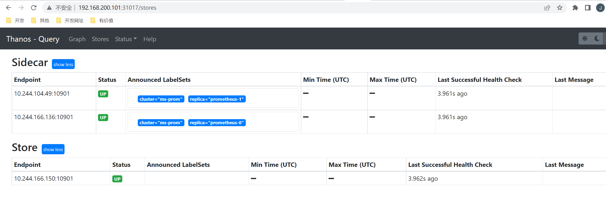

Prometheus 高可用

单台的 Prometheus 存在单点故障的风险，随着监控规模的扩大，Prometheus 产生的数据量也会非常大，性能和存储都会面临问题。

我们需要一套高可用的 Prometheus 集群。

官方给出了三种高可用的建议：

1. HA
2. HA+远程存储
3. 联邦集群

## 1. 高可用性（HA）

 Prometheus 是采用的 Pull 机制获取监控数据，为了确保 Prometheus 服务的可用性，我们只需要部署多个 Prometheus 实例，然后采集相同的 metrics 数据即可，如下图所示：


这个方式来满足服务的可用性应该是平时我们使用得最多的一种方式，当一个实例挂掉后从 LB 里面自动剔除掉，而且还有负载均衡的作用，可以降低一个 Prometheus 的压力，但这种模式缺点也是非常明显的，就是不满足数据一致性以及持久化问题，因为 Prometheus 是 Pull 的方式，即使多个实例抓取的是相同的监控指标，也不能保证抓取过来的值就是一致的，更何况在实际的使用过程中还会遇到一些网络延迟问题，所以会造成数据不一致的问题，不过对于监控报警这个场景来说，一般也不会要求数据强一致性，所以这种方式从业务上来说是可以接受的，因为这种数据不一致性影响基本上没什么影响。这种场景适合监控规模不大，只需要保存短周期监控数据的场景。

**但注意，Prometheus本地存储没有数据同步能力，保证数据一致性会有困难，查询请求LB到不同的实例，可能会引起问题**

## 2. 远程存储

使用上面的基本 HA 的模式基本上是可以满足监控这个场景，但是还有一个数据持久化的问题，如果其中一个实例数据丢了就没办法呢恢复回来了，这个时候我们就可以为 Prometheus 添加远程存储来保证数据持久化。


在给 Prometheus 配置上远程存储过后，我们就不用担心数据丢失的问题了，即使当一个 Prometheus 实例宕机或者数据丢失过后，也可以通过远程存储的数据进行恢复。

**这里一样会有问题，如果多个实例本身的本地存储数据不一致，推送远程后，无法决定到底采用哪一个实例的数据，在查询时可能会有问题**

## 3. 联邦集群

对监控来说，如果使用单实例去采集一个超大规模的集群监控数据，这显然是不合适的，我们可以使用基于 Prometheus 联邦集群的方式来将监控任务划分到不同的 Prometheus 实例中去。


我们将不同类型的采集任务划分到不同的 Prometheus 实例中去执行，进行功能分片，比如一个 Prometheus 负责采集节点的指标数据，另外一个 Prometheus 负责采集应用业务相关的监控指标数据，最后在上层通过一个 Prometheus 对数据进行汇总。

具体的采集任务如何去进行分区也没有固定的标准，需要结合实际的业务进行考虑，除了上面的方式之外，还有一种情况就是单个的采集数据量就非常非常大，比如我们要采集上万个节点的监控指标数据，这种情况即使我们已经进行了分区，但是对于单个 Prometheus 来说压力也是非常大的，这个时候我们就需要按照任务的不同实例进行划分，我们通过 Prometheus 的 `relabel` 功能，通过 hash 取模的方式可以确保当前 Prometheus 只采集当前任务的一部分实例的监控指标。

```yaml
# 省略其他配置......
relabel_configs:
- source_labels: [__address__]
  modulus: 4   # 将节点分片成 4 个组
  target_label: __tmp_hash
  action: hashmod
- source_labels: [__tmp_hash]
  regex: ^1$  # 只抓第2个组中节点的数据(序号0为第1个组)
  action: keep
```

到这里我们基本上就完成了 Prometheus 高可用的改造。对于小规模集群和大规模集群可以采用不同的方案，但是其中有一个非常重要的部分就是远程存储，我们需要保证数据的持久化就必须使用远程存储。

## 5. Thanos

[Thanos](https://thanos.io/) 是一个基于 Prometheus 实现的监控方案，其主要设计目的是解决原生 Prometheus 上的痛点，并且做进一步的提升，主要的特性有：**全局查询，高可用，动态拓展，长期存储**。下图是 Thanos 官方的架构图：

github地址：https://github.com/thanos-io/thanos

sidecar模式：


Receive模式：


Thanos 主要由如下几个特定功能的组件组成：

- 边车组件（Sidecar）：连接 Prometheus，并把 Prometheus 暴露给查询网关（Querier/Query），以供实时查询，并且可以上传 Prometheus 数据给云存储，以供长期保存
- 查询网关（Querier/Query）：实现了 Prometheus API，与汇集底层组件（如边车组件 Sidecar，或是存储网关 Store Gateway）的数据
- 存储网关（Store Gateway）：将云存储中的数据内容暴露出来
- 压缩器（Compactor）：将云存储中的数据进行压缩和下采样
- 接收器（Receiver）：从 Prometheus 的 remote-write WAL（Prometheus 远程预写式日志）获取数据，暴露出去或者上传到云存储
- 规则组件（Ruler）：针对监控数据进行评估和报警

### 5.1 架构设计剖析

首先，监控数据的查询肯定不能直接查 Prometheus 了，因为会存在许多个 Prometheus 实例，每个 Prometheus 实例只能感知它自己所采集的数据。

Thanos Query 实现了 Prometheus 的 HTTP API，能够 “看懂” PromQL。这样，查询 Prometheus 监控数据的 client 就不直接查询 Prometheus 本身了，而是去查询 Thanos Query，Thanos Query 再去下游多个存储了数据的地方查数据，最后将这些数据聚合去重后返回给 client，也就实现了分布式 Prometheus 的数据查询。

Thanos 为此抽象了一套叫 Store API 的内部 gRPC 接口，其它一些组件通过这个接口来暴露数据给 Thanos Query，它自身也就可以做到完全无状态部署，实现高可用与动态扩展。


> storeApi的实现有sidecar方式，每一个Prometheus实例都附带一个Sidecar，这个 Sidecar 实现 Thanos Store API，当 Thanos Query 对其发起查询时，Sidecar 就读取跟它绑定部署的 Prometheus 实例上的监控数据返回给 Thanos Query。
>
> 同样Receiver方式，也实现了Store API，将数据暴露出去。

Prometheus 存储监控数据的能力也是有限的，通常会给 Prometheus 设置一个数据过期时间（默认 15 天）或者最大数据量大小，不断清理旧数据以保证磁盘不被撑爆。因此，我们无法看到时间比较久远的监控数据，这时候我们需要将数据存入对象存储。

存入对象存储后，就需要Store Gateway了，Thanos Store Gateway 这个组件也实现了 Store API，向 Thanos Query 暴露对象存储的数据。Thanos Store Gateway 内部还做了一些加速数据获取的优化逻辑，一是缓存了 TSDB 索引，二是优化了对象存储的请求 (用尽可能少的请求量拿到所有需要的数据)。

> 有了对象存储后，我们可以存储长期的监控数据，便于问题排查与统计分析

Prometheus 不仅仅只支持将采集的数据进行存储和查询的功能，还可以配置一些 rules:

- 根据配置不断计算出新指标数据并存储，后续查询时直接使用计算好的新指标，这样可以减轻查询时的计算压力，加快查询速度。
- 不断计算和评估是否达到告警阀值，当达到阀值时就通知 AlertManager 来触发告警。

由于我们将 Prometheus 进行分布式部署，每个 Prometheus 实例本地并没有完整数据，有些有关联的数据可能存在多个 Prometheus 实例中，单机 Prometheus 看不到数据的全局视图，这种情况我们就不能依赖 Prometheus 来做这些工作

这时，Thanos Ruler 就能大显身手了。它通过查询 Thanos Query 获取全局数据，然后根据 rules 配置计算新指标并存储，同时也通过 Store API 将数据暴露给 Thanos Query，同样还可以将数据上传到对象存储以供长期保存（这里上传到对象存储中的数据一样也是通过 Thanos Store Gateway 暴露给 Thanos Query）。

Thanos Ruler 为 Thanos Query 提供计算出的新指标数据，而 Thanos Query 为 Thanos Ruler 提供计算新指标所需要的全局原始指标数据。

> 这就是Thanos的核心功能，完全兼容 Prometheus 情况下提供数据查询的全局视图、高可用以及数据的长期保存。

由于我们有数据长期存储的能力，也就可以实现查询较大时间范围的监控数据，当时间范围很大时，查询的数据量也会很大，这会导致查询速度非常慢。

通常在查看较大时间范围的监控数据时，我们并不需要那么详细的数据，只需要看到大致就行。这时我们可以用到 Thanos Compact，它可以读取对象存储的数据，对其进行压缩以及降采样再上传到对象存储，这样在查询大时间范围数据时就可以只读取压缩和降采样后的数据，极大地减少了查询的数据量，从而加速查询。

### 5.2 Sidecar模式和Receiver模式

为什么需要 Receiver？它跟 Sidecar 有什么区别？

它们都可以将数据上传到对象存储以供长期保存，区别在于最新数据的存储。

由于数据上传不可能实时，Sidecar 模式将最新的监控数据存到 Prometheus 本机，Query 通过调所有 Sidecar 的 Store API 来获取最新数据，这就成一个问题：如果 Sidecar 数量非常多或者 Sidecar 跟 Query 离的比较远，每次查询 Query 都调所有 Sidecar 会消耗很多资源，并且速度很慢，而我们查看监控大多数情况都是看的最新数据。

为了解决这个问题，Thanos Receiver 组件被提出，它适配了 Prometheus 的 remote write API，也就是所有 Prometheus 实例可以实时将数据 push 到 Thanos Receiver，最新数据也得以集中起来，然后 Thanos Query 也不用去所有 Sidecar 查最新数据了，直接查 Thanos Receiver 即可。

另外，Thanos Receiver 也将数据上传到对象存储以供长期保存，当然，对象存储中的数据同样由 Thanos Store Gateway 暴露给 Thanos Query。

如果规模很大，Receiver 压力会不会很大，成为性能瓶颈？当然，设计者在设计这个组件时肯定会考虑这个问题，Receiver 实现了一致性哈希，支持集群部署，所以即使规模很大也不会成为性能瓶颈。

### 5.3 Sidecar 组件

我们需要在 Prometheus 中去自动发现集群的一些资源对象，所以依然需要对应的 RBAC 权限声明：(rbac.yaml)

```yaml
apiVersion: v1
kind: ServiceAccount
metadata:
  name: prometheus
  namespace: prom
---
apiVersion: rbac.authorization.k8s.io/v1
kind: ClusterRole
metadata:
  name: prometheus
rules:
- apiGroups:
  - ""
  resources:
  - nodes
  - services
  - endpoints
  - pods
  - nodes/proxy
  verbs:
  - get
  - list
  - watch
- apiGroups:
  - "extensions"
  resources:
    - ingresses
  verbs:
  - get
  - list
  - watch
- apiGroups:
  - ""
  resources:
  - configmaps
  - nodes/metrics
  verbs:
  - get
- nonResourceURLs:
  - /metrics
  verbs:
  - get
---
apiVersion: rbac.authorization.k8s.io/v1
kind: ClusterRoleBinding
metadata:
  name: prometheus
roleRef:
  apiGroup: rbac.authorization.k8s.io
  kind: ClusterRole
  name: prometheus
subjects:
- kind: ServiceAccount
  name: prometheus
  namespace: prom
```

当部署了metrics-server、cadvisor(集成在kubelet内)监控指标基本都已经能拿到，但是这些都是在应用内部，需要在应用提供或者开启/metrics接口，或者部署exports来暴漏对应的指标，但是对于deployment，Pod、daemonset、cronjob等k8s资源对象并没有监控，比如：Pod当前状态（pending or running?），cadvisor并没有对具体的资源对象就行监控，因此就需引用新的exports来暴漏监控指标，kube-state-metrics。

**部署kube-state-metrics**

state-sa.yaml

~~~yaml
apiVersion: v1
kind: ServiceAccount
metadata:
  labels:
    app.kubernetes.io/name: kube-state-metrics
    app.kubernetes.io/version: 1.9.7
  name: kube-state-metrics
  namespace: prom
---
apiVersion: rbac.authorization.k8s.io/v1
kind: ClusterRole
metadata:
  labels:
    app.kubernetes.io/name: kube-state-metrics
    app.kubernetes.io/version: 1.9.7
  name: kube-state-metrics
rules:
- apiGroups:
  - ""
  resources:
  - configmaps
  - secrets
  - nodes
  - pods
  - services
  - resourcequotas
  - replicationcontrollers
  - limitranges
  - persistentvolumeclaims
  - persistentvolumes
  - namespaces
  - endpoints
  verbs:
  - list
  - watch
- apiGroups:
  - extensions
  resources:
  - daemonsets
  - deployments
  - replicasets
  - ingresses
  verbs:
  - list
  - watch
- apiGroups:
  - apps
  resources:
  - statefulsets
  - daemonsets
  - deployments
  - replicasets
  verbs:
  - list
  - watch
- apiGroups:
  - batch
  resources:
  - cronjobs
  - jobs
  verbs:
  - list
  - watch
- apiGroups:
  - autoscaling
  resources:
  - horizontalpodautoscalers
  verbs:
  - list
  - watch
- apiGroups:
  - authentication.k8s.io
  resources:
  - tokenreviews
  verbs:
  - create
- apiGroups:
  - authorization.k8s.io
  resources:
  - subjectaccessreviews
  verbs:
  - create
- apiGroups:
  - policy
  resources:
  - poddisruptionbudgets
  verbs:
  - list
  - watch
- apiGroups:
  - certificates.k8s.io
  resources:
  - certificatesigningrequests
  verbs:
  - list
  - watch
- apiGroups:
  - storage.k8s.io
  resources:
  - storageclasses
  - volumeattachments
  verbs:
  - list
  - watch
- apiGroups:
  - admissionregistration.k8s.io
  resources:
  - mutatingwebhookconfigurations
  - validatingwebhookconfigurations
  verbs:
  - list
  - watch
- apiGroups:
  - networking.k8s.io
  resources:
  - networkpolicies
  verbs:
  - list
  - watch
- apiGroups:
  - coordination.k8s.io
  resources:
  - leases
  verbs:
  - list
  - watch
---
apiVersion: rbac.authorization.k8s.io/v1
kind: ClusterRoleBinding
metadata:
  labels:
    app.kubernetes.io/name: kube-state-metrics
    app.kubernetes.io/version: 1.9.7
  name: kube-state-metrics
roleRef:
  apiGroup: rbac.authorization.k8s.io
  kind: ClusterRole
  name: kube-state-metrics
subjects:
- kind: ServiceAccount
  name: kube-state-metrics
  namespace: prom

~~~

state-deploy.yaml

~~~yaml
apiVersion: apps/v1
kind: Deployment
metadata:
  name: kube-state-metrics
  namespace: prom
spec:
  replicas: 1
  selector:
    matchLabels:
      app: kube-state-metrics
  template:
    metadata:
      labels:
        app: kube-state-metrics
    spec:
      serviceAccountName: kube-state-metrics
      containers:
      - name: kube-state-metrics
        image: quay.io/coreos/kube-state-metrics:v1.9.7
        ports:
        - containerPort: 8080
~~~

state-svc.yaml

~~~yaml
apiVersion: v1
kind: Service
metadata:
  annotations:
    prometheus.io/scrape: 'true'
  name: kube-state-metrics
  namespace: prom
  labels:
    app: kube-state-metrics
spec:
  ports:
  - name: kube-state-metrics
    port: 8080
    protocol: TCP
  selector:
    app: kube-state-metrics
~~~

~~~shell
[root@master thanos]# kubectl apply -f state-sa.yaml 
serviceaccount/kube-state-metrics created
[root@master thanos]# kubectl apply -f state-deploy.yaml 
deployment.apps/kube-state-metrics created
[root@master thanos]#  kubectl get pods -n prom -l app=kube-state-metrics           
NAME                                  READY   STATUS    RESTARTS   AGE
kube-state-metrics-55b86f45fd-gjcxf   1/1     Running   0          16s
[root@master thanos]# kubectl apply -f state-svc.yaml                          
service/kube-state-metrics created
[root@master thanos]# kubectl get svc -n prom
NAME                   TYPE        CLUSTER-IP      EXTERNAL-IP   PORT(S)          AGE
grafana                NodePort    10.100.123.29   <none>        3000:30334/TCP   4d7h
kube-state-metrics     ClusterIP   10.110.232.58   <none>        8080/TCP         5s
thanos-store-gateway   ClusterIP   None            <none>        10901/TCP        3h9m
~~~


然后需要部署 Prometheus 的配置文件，下面的资源对象是创建 Prometheus 配置文件的模板，该模板将由 Thanos sidecar 组件进行读取，最终会通过该模板生成实际的配置文件，在同一个 Pod 中的 Prometheus 容器将读取最终的配置文件，在配置文件中添加 `external_labels` 标签是非常重要的，以便让 `Queirer` 可以基于这些标签对数据进行去重处理：（configmap.yaml）

```yaml
apiVersion: v1
kind: ConfigMap
metadata:
  name: prometheus-config
  namespace: prom
data:
  prometheus.yaml.tmpl: |  # 注意这里的名称是 prometheus.yaml.tmpl 
    global:
      scrape_interval: 15s
      scrape_timeout: 15s
      external_labels:
        cluster: ms-prom
        replica: $(POD_NAME)  # 每个 Prometheus 有一个唯一的标签

    rule_files:  # 报警规则文件配置
    - /etc/prometheus/rules/*rules.yaml

    alerting:
      alert_relabel_configs:  # 我们希望告警从不同的副本中也是去重的
      - regex: replica
        action: labeldrop
      alertmanagers:
      - scheme: http
        path_prefix: /
        static_configs:
        - targets: ['alertmanager:9093']

    scrape_configs:
    - job_name: 'prometheus'
      static_configs:
        - targets: ['localhost:9090']
    - job_name: 'stat-metric'
      static_configs:
        - targets: ['kube-state-metrics:8080']
    - job_name: 'coredns'
      static_configs:
        - targets: ['10.244.166.159:9153', '10.244.104.50:9153']
    - job_name: 'kubernetes-nodes'
      kubernetes_sd_configs:
      - role: node
      relabel_configs:
      - source_labels: [__address__]
        regex: '(.*):10250'
        replacement: '${1}:9100'
        target_label: __address__
        action: replace
      - action: labelmap
        regex: __meta_kubernetes_node_label_(.+)
    - job_name: 'kubernetes-kubelet'
      kubernetes_sd_configs:
      - role: node
      scheme: https
      tls_config:
        ca_file: /var/run/secrets/kubernetes.io/serviceaccount/ca.crt
        insecure_skip_verify: true
      bearer_token_file: /var/run/secrets/kubernetes.io/serviceaccount/token
      relabel_configs:
      - action: labelmap
        regex: __meta_kubernetes_node_label_(.+)
    - job_name: 'kubernetes-cadvisor'
      kubernetes_sd_configs:
      - role: node
      scheme: https
      tls_config:
        ca_file: /var/run/secrets/kubernetes.io/serviceaccount/ca.crt
      bearer_token_file: /var/run/secrets/kubernetes.io/serviceaccount/token
      relabel_configs:
      - action: labelmap
        regex: __meta_kubernetes_node_label_(.+)
      - target_label: __address__
        replacement: kubernetes.default.svc:443
      - source_labels: [__meta_kubernetes_node_name]
        regex: (.+)
        target_label: __metrics_path__
        replacement: /api/v1/nodes/${1}/proxy/metrics/cadvisor
    - job_name: 'kubernetes-apiservers'
      kubernetes_sd_configs:
      - role: endpoints
      scheme: https
      tls_config:
        ca_file: /var/run/secrets/kubernetes.io/serviceaccount/ca.crt
      bearer_token_file: /var/run/secrets/kubernetes.io/serviceaccount/token
      relabel_configs:
      - source_labels: [__meta_kubernetes_namespace, __meta_kubernetes_service_name, __meta_kubernetes_endpoint_port_name]
        action: keep
        regex: default;kubernetes;https
    - job_name: 'kubernetes-endpoints'
      kubernetes_sd_configs:
      - role: endpoints
      relabel_configs:
      - source_labels: [__meta_kubernetes_service_annotation_prometheus_io_scrape]
        action: keep
        regex: true
      - source_labels: [__meta_kubernetes_service_annotation_prometheus_io_scheme]
        action: replace
        target_label: __scheme__
        regex: (https?)
      - source_labels: [__meta_kubernetes_service_annotation_prometheus_io_path]
        action: replace
        target_label: __metrics_path__
        regex: (.+)
      - source_labels: [__address__, __meta_kubernetes_service_annotation_prometheus_io_port]
        action: replace
        target_label: __address__
        regex: ([^:]+)(?::\d+)?;(\d+)
        replacement: $1:$2
      - action: labelmap
        regex: __meta_kubernetes_service_label_(.+)
      - source_labels: [__meta_kubernetes_namespace]
        action: replace
        target_label: kubernetes_namespace
      - source_labels: [__meta_kubernetes_service_name]
        action: replace
        target_label: kubernetes_name
      - source_labels: [__meta_kubernetes_pod_name]
        action: replace
        target_label: kubernetes_pod_name
```


上面配置了报警规则文件，由于这里配置文件太大了，所以为了更加清晰，我们将报警规则文件拆分到另外的 ConfigMap 对象中来，下面我们配置了两个报警规则：（rules-configmap.yaml）

* kube_deployment_status_replicas  Gauge类型，每个deployment的副本数
* kube_pod_container_status_restarts_total Gauge类型，每个容器的容器重新启动次数

```yaml
apiVersion: v1
kind: ConfigMap
metadata:
  name: prometheus-rules
  namespace: prom
data:
  alert-rules.yaml: |-
    groups:
      - name: Deployment
        rules:
        - alert: Deployment at 0 Replicas
          annotations:
            summary: Deployment {{$labels.deployment}} in {{$labels.namespace}} is currently having no pods running
          expr: |
            sum(kube_deployment_status_replicas) by (deployment,namespace)  < 1
          for: 1m
          labels:
            team: node
      - name: Pods
        rules:
        - alert: Container restarted
          annotations:
            summary: Container named {{$labels.container}} in {{$labels.pod}} in {{$labels.namespace}} was restarted
          expr: |
            sum(increase(kube_pod_container_status_restarts_total[1m])) by (pod,namespace,container) > 0
          for: 0m
          labels:
            team: node
```


Thanos 通过 Sidecar 和现有的 Prometheus 进行集成，将 Prometheus 的数据备份到对象存储中，所以首先我们需要将 Prometheus 和 Sidecar 部署在同一个 Pod 中，另外 Prometheus 中一定要开启下面两个参数：

- `--web.enable-admin-api` 允许 Thanos 的 Sidecar 从 Prometheus 获取元数据。
- `--web.enable-lifecycle` 允许 Thanos 的 Sidecar 重新加载 Promehtues 的配置和规则文件。

由于 Prometheus 默认每2h生成一个 TSDB 数据块，所以仍然并不意味着 Prometheus 可以是完全无状态的，因为如果它崩溃并重新启动，我们将丢失〜2个小时的指标，因此强烈建议依然对 Prometheus 做数据持久化，所以我们这里使用了 `StatefulSet` 来管理这个应用，添加 `volumeClaimTemplates` 来声明了数据持久化的 PVC 模板：(sidecar.yaml)

```yaml
apiVersion: apps/v1
kind: StatefulSet
metadata:
  name: prometheus
  namespace: prom
  labels:
    app: prometheus
spec:
  serviceName: "prometheus"
  replicas: 2
  selector:
    matchLabels:
      app: prometheus
      thanos-store-api: "true"
  template:
    metadata:
      labels: 
        app: prometheus
        thanos-store-api: "true"
    spec:
      serviceAccountName: prometheus
      volumes:
      - name: prometheus-config
        configMap:
          name: prometheus-config
      - name: prometheus-rules
        configMap:
          name: prometheus-rules
      - name: prometheus-config-shared
        emptyDir: {}
      containers:
      - name: prometheus
        image: prom/prometheus:v2.37.1
        imagePullPolicy: IfNotPresent
        args:
        - "--config.file=/etc/prometheus-shared/prometheus.yaml"
        - "--storage.tsdb.path=/prometheus"
        - "--storage.tsdb.retention.time=6h"
        - "--storage.tsdb.no-lockfile"
        - "--storage.tsdb.min-block-duration=2h"  # Thanos处理数据压缩
        - "--storage.tsdb.max-block-duration=2h"
        - "--web.enable-admin-api"  # 通过一些命令去管理数据
        - "--web.enable-lifecycle"  # 支持热更新  localhost:9090/-/reload 加载
        ports:
        - name: http
          containerPort: 9090
        volumeMounts:
        - name: prometheus-config-shared
          mountPath: /etc/prometheus-shared/
        - name: prometheus-rules
          mountPath: /etc/prometheus/rules
        - name: data
          mountPath: "/prometheus"
      - name: thanos
        image: thanosio/thanos:v0.28.0
        imagePullPolicy: IfNotPresent
        args:
        - sidecar
        - --log.level=debug
        - --tsdb.path=/prometheus
        - --prometheus.url=http://localhost:9090
        - --reloader.config-file=/etc/prometheus/prometheus.yaml.tmpl
        - --reloader.config-envsubst-file=/etc/prometheus-shared/prometheus.yaml
        - --reloader.rule-dir=/etc/prometheus/rules/
        ports:
        - name: http-sidecar
          containerPort: 10902
        - name: grpc
          containerPort: 10901
        env:
        - name: POD_NAME
          valueFrom:
            fieldRef:
              fieldPath: metadata.name
        volumeMounts:
        - name: prometheus-config-shared
          mountPath: /etc/prometheus-shared/
        - name: prometheus-config
          mountPath: /etc/prometheus
        - name: prometheus-rules
          mountPath: /etc/prometheus/rules
        - name: data
          mountPath: "/prometheus"
  volumeClaimTemplates:  # 由于prometheus每2h生成一个TSDB数据块，所以还是需要保存本地的数据
  - metadata:
      name: data
      labels:
        app: prometheus
    spec:
      storageClassName: thanos-storage
      accessModes:
      - ReadWriteOnce
      resources:
        requests:
          storage: 2Gi
```

这里要用到一个storageclass，前面我们使用过的storageclass定义修改一下即可：

~~~yaml
apiVersion: storage.k8s.io/v1 ## 创建了一个存储类
kind: StorageClass
metadata:
  name: thanos-storage
  annotations:
    storageclass.kubernetes.io/is-default-class: "true"
  namespace: prom
provisioner: thanos-data  #Deployment中spec.template.spec.containers.env.name.PROVISIONER_NAME 保持一致
parameters:
  archiveOnDelete: "true"  ## 删除pv的时候，pv的内容是否要备份
---
apiVersion: apps/v1
kind: Deployment
metadata:
  name: thanos-nfs-client-provisioner
  labels:
    app: thanos-nfs-client-provisioner
  namespace: prom
spec:
  replicas: 1
  strategy:
    type: Recreate
  selector:
    matchLabels:
      app: thanos-nfs-client-provisioner
  template:
    metadata:
      labels:
        app: thanos-nfs-client-provisioner
    spec:
      serviceAccountName: nfs-client-provisioner
      containers:
        - name: thanos-nfs-client-provisioner
          image: registry.cn-hangzhou.aliyuncs.com/lfy_k8s_images/nfs-subdir-external-provisioner:v4.0.2
          volumeMounts:
            - name: nfs-client-root
              mountPath: /persistentvolumes
          env:
            - name: PROVISIONER_NAME
              value: thanos-data
            - name: NFS_SERVER
              value: 192.168.200.101 ## 指定自己nfs服务器地址
            - name: NFS_PATH  
              value: /data/thanos  ## nfs服务器共享的目录
      volumes:
        - name: nfs-client-root
          nfs:
            server: 192.168.200.101
            path: /data/thanos
---
apiVersion: v1
kind: ServiceAccount
metadata:
  name: nfs-client-provisioner
  namespace: prom
---
kind: ClusterRole
apiVersion: rbac.authorization.k8s.io/v1
metadata:
  name: nfs-client-provisioner-runner
rules:
  - apiGroups: [""]
    resources: ["nodes"]
    verbs: ["get", "list", "watch"]
  - apiGroups: [""]
    resources: ["persistentvolumes"]
    verbs: ["get", "list", "watch", "create", "delete"]
  - apiGroups: [""]
    resources: ["persistentvolumeclaims"]
    verbs: ["get", "list", "watch", "update"]
  - apiGroups: ["storage.k8s.io"]
    resources: ["storageclasses"]
    verbs: ["get", "list", "watch"]
  - apiGroups: [""]
    resources: ["events"]
    verbs: ["create", "update", "patch"]
---
kind: ClusterRoleBinding
apiVersion: rbac.authorization.k8s.io/v1
metadata:
  name: run-nfs-client-provisioner
subjects:
  - kind: ServiceAccount
    name: nfs-client-provisioner
    namespace: prom
roleRef:
  kind: ClusterRole
  name: nfs-client-provisioner-runner
  apiGroup: rbac.authorization.k8s.io
---
kind: Role
apiVersion: rbac.authorization.k8s.io/v1
metadata:
  name: leader-locking-nfs-client-provisioner
  namespace: prom
rules:
  - apiGroups: [""]
    resources: ["endpoints"]
    verbs: ["get", "list", "watch", "create", "update", "patch"]
---
kind: RoleBinding
apiVersion: rbac.authorization.k8s.io/v1
metadata:
  name: leader-locking-nfs-client-provisioner
  namespace: prom
subjects:
  - kind: ServiceAccount
    name: nfs-client-provisioner
    namespace:  prom
roleRef:
  kind: Role
  name: leader-locking-nfs-client-provisioner
  apiGroup: rbac.authorization.k8s.io
~~~


由于 Prometheus 和 Thanos 的 Sidecar 在同一个 Pod 中了，所以我们完全可以用 `localhost` 就可以访问到了，然后将数据目录做了声明挂载，所以同样可以在两个容器中共享数据目录了，一定要注意几个配置文件的挂载方式。此外在上面的配置文件中我们通过 `POD_NAME` 这个环境变量作为 `external` 标签附加到了 Prometheus 实例上。

由于现在使用的是 `StatefulSet` 控制器，所以需要创建一个 Headless Service，而且后面的 Thanos Query 还将使用该Headless 服务来查询所有 Prometheus 实例中的数据：（headless.yaml）

```yaml
# 该服务为查 querier 创建 srv 记录，以便查找 store-api 的信息
apiVersion: v1
kind: Service
metadata:
  name: thanos-store-gateway
  namespace: prom
spec:
  type: ClusterIP
  clusterIP: None
  ports:
  - name: grpc
    port: 10901
    targetPort: grpc
  selector:
    thanos-store-api: "true"
```


然后我们就可以使用上面的这些资源对象来创建带有 Thanos Sidecar 容器的高可用 Prometheus 应用了：

```shell
[root@master thanos]# kubectl apply -f storageClass.yaml 
storageclass.storage.k8s.io/thanos-storage created
deployment.apps/thanos-nfs-client-provisioner created
serviceaccount/nfs-client-provisioner created
clusterrole.rbac.authorization.k8s.io/nfs-client-provisioner-runner created
clusterrolebinding.rbac.authorization.k8s.io/run-nfs-client-provisioner created
role.rbac.authorization.k8s.io/leader-locking-nfs-client-provisioner created
rolebinding.rbac.authorization.k8s.io/leader-locking-nfs-client-provisioner created
[root@master thanos]# kubectl apply -f configmap.yaml 
configmap/prometheus-config created
[root@master thanos]# kubectl apply -f rules-configmap.yaml 
configmap/prometheus-rules created
[root@master thanos]# kubectl apply -f headless.yaml 
service/thanos-store-gateway created
[root@master thanos]# kubectl apply -f sidecar.yaml 
statefulset.apps/prometheus created
[root@master thanos]# kubectl get pods -n prom
NAME                                             READY   STATUS    RESTARTS        AGE
grafana-697665fdf5-pkktd                         1/1     Running   4 (7h36m ago)   4d5h
prometheus-0                                     2/2     Running   3 (43m ago)     45m
prometheus-1                                     2/2     Running   1 (43m ago)     43m
thanos-nfs-client-provisioner-7c55657874-6s42v   1/1     Running   0               56m
[root@master thanos]# kubectl get svc -n prom
NAME                   TYPE        CLUSTER-IP      EXTERNAL-IP   PORT(S)          AGE
grafana                NodePort    10.100.123.29   <none>        3000:30334/TCP   4d5h
thanos-store-gateway   ClusterIP   None            <none>        10901/TCP        59m
```


### 5.4 Querier 组件

现在我们就创建成功了两个 Prometheus 实例，但是我们真正去使用的时候并不是像上面提到的在前面加一个负载均衡器去查询监控数据，而是使用 Thanos 的 `Querier` 组件来提供一个全局的统一查询入口。对于 `Quierier` 最重要的就是要配置上 Thanos 的 Sidecar 地址，我们这里完全可以直接使用 Headless Service 去自动发现：(querier.yaml)

```yaml
apiVersion: apps/v1
kind: Deployment
metadata:
  name: thanos-querier
  namespace: prom
  labels:
    app: thanos-querier
spec:
  selector:
    matchLabels:
      app: thanos-querier
  template:
    metadata:
      labels:
        app: thanos-querier
    spec:
      containers:
      - name: thanos
        image: thanosio/thanos:v0.28.0
        args:
        - query
        - --log.level=debug
        - --query.replica-label=replica
        - --store=dnssrv+thanos-store-gateway:10901 # Discover local store APIs using DNS SRV.
        ports:
        - name: http
          containerPort: 10902
        - name: grpc
          containerPort: 10901
        livenessProbe:
          httpGet:
            path: /-/healthy
            port: http
          initialDelaySeconds: 10
        readinessProbe:
          httpGet:
            path: /-/healthy
            port: http
          initialDelaySeconds: 15
---
apiVersion: v1
kind: Service
metadata:
  name: thanos-querier
  namespace: prom
  labels:
    app: thanos-querier
spec:
  ports:
  - port: 9090
    protocol: TCP
    targetPort: http
    name: http
  selector:
    app: thanos-querier
  type: NodePort
```


容器中的参数 `--store=dnssrv+thanos-store-gateway:10901` 可以帮助自动发现可以查询指标数据的所有组件；然后创建一个 `thanos-querier` 的 Serivce 对象可以来提供一个运行 `PromQL` 的 web 页面，也提供了一个是否对不同集群数据进行去重的入口。直接创建上面的对象：

```shell
[root@master thanos]# kubectl apply -f querier.yaml 
deployment.apps/thanos-querier created
service/thanos-querier created
[root@master thanos]# kubectl get pods -n prom -l app=thanos-querier        
NAME                              READY   STATUS    RESTARTS   AGE
thanos-querier-674f6f96c5-pcl62   0/1     Running   0          15s
[root@master thanos]# kubectl get svc -n prom -l app=thanos-querier
NAME             TYPE       CLUSTER-IP      EXTERNAL-IP   PORT(S)          AGE
thanos-querier   NodePort   10.108.157.29   <none>        9090:31017/TCP   33s
```


部署完成后我们就可以通过 `http://<任意节点IP>:31017` 去访问 `Querier` 了，在 `Stores` 页面下面就会显示通过服务发现获取到的 Sidecar 信息：


在 `Graph` 页面下同样可以去使用 `PromQL` 语句来查询监控信息，这个页面和 Prometheus 原生的页面几乎是一致的，比如我们查询 master 节点的节点信息：


如果将 `deduplication` 选中，结果会根据 `replica` 这个标签进行合并，如果两个副本都有对应的数据，`Querier` 会取 timestamp 更小的结果。

当然这个时候我们在前面章节中 Grafana 里面配置的 Prometheus 的数据源也就失效了，因为现在监控数据的来源是 `Thanos Querier`，所以我们需要重新配置 Prometheus 的数据源地址为 `http://thanos-querier:9090`：


### 5.6 Ruler 组件

现在我们可以测试下 Prometheus 里面配置的监控报警规则是否生效，比如对于 `Deployment at 0 Replicas` 这个报警规则，当集群中有 Deployment 的副本数变成0过后就会触发报警：

~~~yaml
apiVersion: apps/v1
kind: Deployment
metadata:
  name: test-deployment
spec:
  selector:
    matchLabels:
      app: nginx
  replicas: 2
  template:
    metadata:
      labels:
        app: nginx
    spec:
      containers:
      - name: nginx
        image: nginx:1.7.9
        ports:
        - containerPort: 80
~~~


```shell
[root@master thanos]# kubectl apply -f test-deployment.yaml 
deployment.apps/test-deployment created
[root@master thanos]# kubectl get deploy                    
NAME              READY   UP-TO-DATE   AVAILABLE   AGE
test-deployment   2/2     2            2           15m
```

我们可以手动将 Deployment 的副本数缩减为0：

```shell
[root@master thanos]# kubectl scale --replicas=0 deployment/test-deployment
deployment.apps/test-deployment scaled
[root@master thanos]# kubectl get deploy 
NAME              READY   UP-TO-DATE   AVAILABLE   AGE
test-deployment   0/0     0            0           16m
```

这个时候 Alertmanager 同样也会根据外部的 replica 标签对告警进行去重。


当然除了直接使用 Prometheus 做报警和记录规则之外，同样我们也可以使用 Thanos 的 Ruler 组件，该组件本身不会抓取 metrics 接口数据，而是通过 `query API` 从 query 组件定期地获取指标数据，如果配置了多个 query 地址，则会采用轮询方式获取。

Ruler 组件获取评估数据的路径为 `rule --> query --> sidecar --> prometheus` 需要经过一整个查询链条，这也提升了发生故障的风险，且评估原本就可以在 Prometheus 中进行，所以非必要的情况下还是更加推荐使用 Prometheus 来直接做 alerting 和 recording 评估，对于 Ruler 组件的具体使用方式感兴趣的也可以直接查看官方文档 https://thanos.io/v0.28/components/rule.md了解更多细节。

### 5.7 Store 组件

上面我们安装了 Thanos 的 Sidecar 和 Querier 组件，已经可以做到 Prometheus 的高可用，通过 Querier 提供一个统一的入口来查询监控数据，而且还可以对监控数据自动去重，但是还有一个非常重要的地方是还没有配置对象存储，如果想要查看历史监控数据就不行了，这个时候我们就需要去配置 Thanos Store 组件，将历史监控指标存储在对象存储中去。

目前 Thanos 支持的对象存储有：


要在生产环境使用最好使用 `Stable` 状态的，比如 S3 或者兼容 S3 的服务，比如 Ceph、Minio 等等。

对于国内用户当然最方便的还是直接使用阿里云 OSS 或者腾讯云 COS 这样的服务，很多时候可能我们的服务并不是跑在公有云上面的，所以这里我们用 Minio 来部署一个兼容 S3 协议的对象存储服务。

#### 5.7.1 安装 Minio

[Minio](https://min.io/) 是一个基于 Apache License v2.0 开源协议的对象存储服务。它兼容亚马逊 S3 云存储服务接口，非常适合于存储大容量非结构化的数据，例如图片、视频、日志文件、备份数据和容器/虚拟机镜像等，而一个对象文件可以是任意大小，从几 kb 到最大 5T 不等。

要安装 Minio 非常容易的，同样我们这里将 Minio 安装到 Kubernetes 集群中，可以直接参考官方文档 [使用Kubernetes部署MinIO](https://docs.min.io/cn/deploy-minio-on-kubernetes.html)，在 Kubernetes 集群下面可以部署独立、分布式或共享几种模式，可以根据实际情况部署，我们这里为了简单直接部署独立模式。

为了方便管理，将所有的资源对象都部署在一个名为 minio 的命名空间中，如果没有的话需要手动创建。直接使用 Deployment 来管理 Minio 的服务：（minio-deploy.yaml）

```yaml
apiVersion: apps/v1
kind: Deployment
metadata:
  name: minio
  namespace: minio
spec:
  selector:
    matchLabels:
      app: minio 
  strategy:
    type: Recreate
  template:
    metadata:
      labels:
        app: minio
    spec:
      volumes:
      - name: data
        persistentVolumeClaim:
          claimName: minio-pvc
      containers:
      - name: minio
        volumeMounts:
        - name: data 
          mountPath: "/data"
        image: minio/minio:RELEASE.2022-10-08T20-11-00Z
        command:
          - /bin/sh
          - -c
          - minio server /data --console-address ":5000"
        env:
        - name: MINIO_ACCESS_KEY
          value: "minio"
        - name: MINIO_SECRET_KEY
          value: "minio123"
        ports:
        - name: data
          containerPort: 9000
          protocol: "TCP"
        - name: console
          containerPort: 5000
          protocol: "TCP"
```


通过一个名为 `minio-pvc` 的 PVC 对象将数据持久化，当然我们可以使用静态的 PV 来提供存储，使用 `thanos-storage` 这个 StorageClass 对象来提供动态 PV：（minio-pvc.yaml）

```yaml
apiVersion: v1
kind: PersistentVolumeClaim
metadata:
  name: minio-pvc
  namespace: minio
spec:
  storageClassName: thanos-storage
  accessModes:
  - ReadWriteOnce
  resources:
    requests:
      storage: 5Gi
```


最后我们可以通过 Service 和 Ingress 对象将 Minio 暴露给外部用户使用：（minio-ingress.yaml）

```yaml
apiVersion: v1
kind: Service
metadata:
  name: minio
  namespace: minio
spec:
  ports:
  - name: data
    port: 9000
    targetPort: 9000
    protocol: TCP
  - name: console
    port: 5000
    targetPort: 5000
    protocol: TCP
  selector:
    app: minio
---
apiVersion: networking.k8s.io/v1
kind: Ingress
metadata:
  name: ingress-http
  namespace: minio
spec:
  ingressClassName: nginx
  rules:
  - host: minio.test.com
    http:
      paths:
      - path: /
        pathType: Prefix
        backend:
          service:
            name: minio
            port:
              number: 5000
```


然后直接创建上面的资源对象即可：

```shell
[root@master thanos]# kubectl create ns minio
namespace/minio created
[root@master thanos]# kubectl apply -f minio-deploy.yaml             
deployment.apps/minio created
[root@master thanos]#  kubectl apply -f minio-pvc.yaml
persistentvolumeclaim/minio-pvc created
[root@master thanos]# kubectl apply -f minio-ingress.yaml       
service/minio created
ingress.networking.k8s.io/ingress-http created
```


部署成功后，将域名 `minio.test.com` 解析到 Ingress 控制器所在的节点即可通过浏览器访问到 MinIO 服务了，通过上面定义的 `MINIO_ACCESS_KEY` 和 `MINIO_SECRET_KEY` 即可登录：


#### 5.7.2 安装 Thanos Store

现在对象存储准备好了，我们就可以来不是 Store 组件了，该组件会从对象存储到给 Querier 提供 metrics 数据。

首先登录 MinIO 创建一个 thanos 的 bucket。然后创建一个对象存储配置文件：（thanos-storage-minio.yaml）


```yaml
type: s3
config:
  bucket: thanos
  endpoint: minio.minio.svc.cluster.local:9000
  access_key: minio
  secret_key: minio123
  insecure: true
  signature_version2: false
```


使用上面的配置文件来创建一个 Secret 对象：

```shell
[root@master thanos]# kubectl create secret generic thanos-objectstorage --from-file=thanos.yaml=thanos-storage-minio.yaml -n prom
secret/thanos-objectstorage created
```


然后创建 Store 组件的资源清单文件，这里有一个需要注意的地方是需要添加一个 `thanos-store-api: "true"` 的标签，这样前面我们创建的 `thanos-store-gateway` 这个 Headless Service 就可以自动发现到这个服务，Querier 组件查询数据的时候除了可以通过 Sidecar 去获取数据也可以通过这个 Store 组件去对象存储里面获取数据了。将上面的 Secret 对象通过 Volume 形式挂载到容器中的 `/etc/secret` 目录下，通过 `objstore.config-file` 参数指定即可：（store.yaml）

```yaml
apiVersion: apps/v1
kind: StatefulSet
metadata:
  name: thanos-store-gateway
  namespace: prom
  labels:
    app: thanos-store-gateway
spec:
  replicas: 1
  selector:
    matchLabels:
      app: thanos-store-gateway
  serviceName: thanos-store-gateway
  template:
    metadata:
      labels:
        app: thanos-store-gateway
        thanos-store-api: "true"
    spec:
      containers:
        - name: thanos
          image: thanosio/thanos:v0.28.0
          args:
          - "store"
          - "--log.level=debug"
          - "--data-dir=/data"
          - "--objstore.config-file=/etc/secret/thanos.yaml"
          - "--index-cache-size=500MB"
          - "--chunk-pool-size=500MB"
          ports:
          - name: http
            containerPort: 10902
          - name: grpc
            containerPort: 10901
          livenessProbe:
            httpGet:
              port: 10902
              path: /-/healthy
          readinessProbe:
            httpGet:
              port: 10902
              path: /-/ready
          volumeMounts:
            - name: object-storage-config
              mountPath: /etc/secret
              readOnly: false
      volumes:
        - name: object-storage-config
          secret:
            secretName: thanos-objectstorage
```


直接创建上面的资源对象即可：

```shell
[root@master thanos]# kubectl apply -f store.yaml
statefulset.apps/thanos-store-gateway created
[root@master thanos]# kubectl get pods -n prom -l thanos-store-api=true 
NAME                     READY   STATUS    RESTARTS      AGE
prometheus-0             2/2     Running   1 (76m ago)   76m
prometheus-1             2/2     Running   1 (76m ago)   76m
thanos-store-gateway-0   1/1     Running   0             7s
```


部署成功后这个时候去 Thano 的 Querier 页面上查看 Store 信息就可以发现这里我们配置的 Store 组件了：



到这里证明我们的 Thanos 组件也配置成功了。但是还有一个明显的问题是这里我们只是配置去对象存储中查询数据的组件，那什么地方往对象存储中写入数据呢？当然还是在 Sidecar 组件里面了。所以同样我们需要把 `objstore.config-file` 参数和 Secret 对象也要配置到 Sidecar 组件中去：

```yaml
......
volumes:
- name: object-storage-config
  secret:
    secretName: thanos-objectstorage
......
args:
- sidecar
- --log.level=debug
- --tsdb.path=/prometheus
- --prometheus.url=http://localhost:9090
- --reloader.config-file=/etc/prometheus/prometheus.yaml.tmpl
- --reloader.config-envsubst-file=/etc/prometheus-shared/prometheus.yaml
- --reloader.rule-dir=/etc/prometheus/rules/
- --objstore.config-file=/etc/secret/thanos.yaml
......
volumeMounts:
- name: object-storage-config
  mountPath: /etc/secret
  readOnly: false
......
```


配置完成后重新更新 Sidecar 组件即可。配置生效过后正常的话就会有数据传入到 MinIO 里面去了，我们可以去 MinIO 的页面上查看验证：


### 5.8 Compactor 组件

现在历史监控数据已经上传到对象存储中去了，但是由于监控数据量非常庞大，所以一般情况下我们会去安装一个 Thanos 的 Compactor 组件，用来将对象存储中的数据进行压缩和下采样。Compactor 组件的部署和 Store 非常类似，指定对象存储的配置文件即可，如下所示的资源清单文件：（compactor.yaml）

```yaml
apiVersion: apps/v1
kind: StatefulSet
metadata:
  name: thanos-compactor
  namespace: prom
  labels:
    app: thanos-compactor
spec:
  replicas: 1
  selector:
    matchLabels:
      app: thanos-compactor
  serviceName: thanos-compactor
  template:
    metadata:
      labels:
        app: thanos-compactor
    spec:
      containers:
      - name: thanos
        image: thanosio/thanos:v0.28.0
        args:
        - "compact"
        - "--log.level=debug"
        - "--data-dir=/data"
        - "--objstore.config-file=/etc/secret/thanos.yaml"
        - "--wait"
        ports:
        - name: http
          containerPort: 10902
        livenessProbe:
          httpGet:
            port: 10902
            path: /-/healthy
          initialDelaySeconds: 10
        readinessProbe:
          httpGet:
            port: 10902
            path: /-/ready
          initialDelaySeconds: 15
        volumeMounts:
        - name: object-storage-config
          mountPath: /etc/secret
          readOnly: false
      volumes:
      - name: object-storage-config
        secret:
          secretName: thanos-objectstorage
```


最重要的还是提供对象存储的配置文件，然后直接创建上面的资源清单文件：

```shell
[root@master thanos]# kubectl apply -f compactor.yaml
statefulset.apps/thanos-compactor created
[root@master thanos]# kubectl get pods -n prom -l app=thanos-compactor
NAME                 READY   STATUS    RESTARTS   AGE
thanos-compactor-0   1/1     Running   0          20s
```


到这里我们就完成了使用 Thanos 来部署高可用的 Prometheus 集群，当然 Thanos 还有其他的一些组件，比如 Check、Bucket、Receiver 等，对于这些组件的使用感兴趣的可以查看官方文档 https://thanos.io/。

将 Thanos 与 Prometheus 集成可让我们对 Prometheus 进行水平伸缩。由于 `Thanos Querier` 可以从其他查询器实例中提取指标，因此我们也可以跨集群提取指标并在 Grafana 中可视化它们，Thanos 使我们可以将度量标准数据归档到对象存储中，该对象存储为我们的监控系统提供了无限的存储空间，而且它还可以从对象存储中提供指标，如果我们对这些对象存储设置一些适当的保留策略，还可以将费用降到更低。