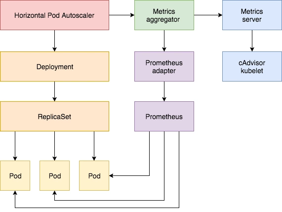
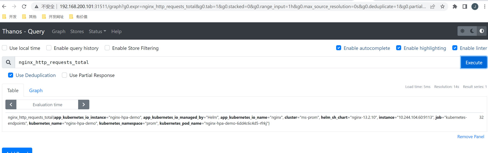
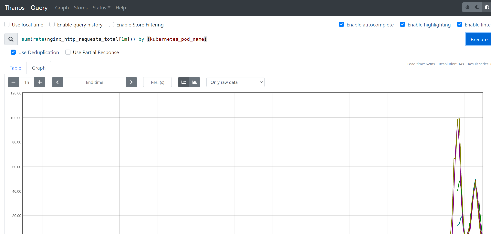

# 自定义指标扩缩容

使用 Kubernetes 进行容器编排的主要优点之一是，它可以非常轻松地对我们的应用程序进行水平扩展。Pod 水平自动缩放（HPA）可以根据 CPU 和内存使用量来扩展应用，在更复杂的情况下，我们可能还需要基于内存或者基于某些自定义的指标来进行扩缩容。

## 1. 内存

要使用基于内存或者自定义指标进行扩缩容，都必须依赖 metrics-server 这个项目，如果没有安装的需要提前安装该项目，而且还需要开启聚合 API 层。

现在我们用 Deployment 来创建一个 Nginx Pod，然后利用 HPA 来进行自动扩缩容。资源清单如下所示：（hpa-mem-demo.yaml）

```yaml
apiVersion: apps/v1
kind: Deployment
metadata:
  name: hpa-mem-demo
spec:
  selector:
    matchLabels:
      app: nginx
  template:
    metadata:
      labels:
        app: nginx
    spec:
      volumes:
      - name: increase-mem-script
        configMap:
          name: increase-mem-config
      containers:
      - name: nginx
        image: nginx
        ports:
        - containerPort: 80
        volumeMounts:
        - name: increase-mem-script
          mountPath: /etc/script
        resources:
          requests:
            memory: 50Mi
            cpu: 50m
        securityContext:
          privileged: true
```


这里和前面普通的应用有一些区别，我们将一个名为 `increase-mem-config` 的 ConfigMap 资源对象挂载到了容器中，该配置文件是用于后面增加容器内存占用的脚本，配置文件如下所示：（increase-mem-cm.yaml）

原理：借鉴虚拟内存的思想，创建虚拟内存文件系统，不断写入数据达到消耗内存的目的，需要清除内存时，删除创建的虚拟内存目录即可

```yaml
apiVersion: v1
kind: ConfigMap
metadata:
  name: increase-mem-config
data:
  increase-mem.sh: |
    #!/bin/bash  
    mkdir /tmp/memory  
    mount -t tmpfs -o size=40M tmpfs /tmp/memory  
    dd if=/dev/zero of=/tmp/memory/block  
    sleep 60 
    rm /tmp/memory/block  
    umount /tmp/memory  
    rmdir /tmp/memory
```


由于这里增加内存的脚本需要使用到 `mount` 命令，这需要声明为特权模式，所以我们添加了 `securityContext.privileged=true` 这个配置。现在我们直接创建上面的资源对象即可：

```shell
[root@master adpater]# kubectl apply -f increase-mem-cm.yaml
configmap/increase-mem-config created
[root@master adpater]# kubectl apply -f hpa-mem-demo.yaml 
deployment.apps/hpa-mem-demo created
[root@master adpater]# kubectl get pods -l app=nginx
NAME                            READY   STATUS              RESTARTS   AGE
hpa-mem-demo-5f689f9b7f-5ggv6   0/1     ContainerCreating   0          4s
```


然后需要创建一个基于内存的 HPA 资源对象：（hpa-mem.yaml）

```yaml
apiVersion: autoscaling/v2
kind: HorizontalPodAutoscaler
metadata:
  name: nginx-hpa
  nam
spec:
  scaleTargetRef:
    apiVersion: apps/v1
    kind: Deployment
    name: hpa-mem-demo
  minReplicas: 1
  maxReplicas: 5
  metrics:
  - type: Resource
    resource:
      name: memory
      target:
        type: Utilization
        averageUtilization: 60
```


在 `metrics` 属性里面指定的是内存的配置，直接创建上面的资源对象即可：

```shell
[root@master adpater]# kubectl apply -f hpa-mem.yaml 
horizontalpodautoscaler.autoscaling/nginx-hpa configured
[root@master adpater]# kubectl get hpa
NAME        REFERENCE                 TARGETS   MINPODS   MAXPODS   REPLICAS   AGE
nginx-hpa   Deployment/hpa-mem-demo   5%/60%    1         5         1          5h23m
```


到这里证明 HPA 资源对象已经部署成功了，接下来我们对应用进行压测，将内存压上去，直接执行上面我们挂载到容器中的 `increase-mem.sh` 脚本即可：

```shell
[root@master adpater]# kubectl exec -it hpa-mem-demo-5f689f9b7f-5ggv6 -- /bin/bash
root@hpa-mem-demo-5f689f9b7f-5ggv6:/# ls /etc/script/
increase-mem.sh
root@hpa-mem-demo-5f689f9b7f-5ggv6:/# source /etc/script/increase-mem.sh 
dd: writing to '/tmp/memory/block': No space left on device
81921+0 records in
81920+0 records out
41943040 bytes (42 MB, 40 MiB) copied, 0.0629556 s, 666 MB/s
```


然后打开另外一个终端观察 HPA 资源对象的变化情况：

```shell
[root@master ~]# kubectl get hpa
NAME        REFERENCE                 TARGETS   MINPODS   MAXPODS   REPLICAS   AGE
nginx-hpa   Deployment/hpa-mem-demo   87%/60%   1         5         1          5h26m
```


可以看到内存使用已经超过了我们设定的 60% 这个阈值了，HPA 资源对象也已经触发了自动扩容，变成了两个副本了：

```shell
[root@master ~]# kubectl get pods -l app=nginx
NAME                            READY   STATUS              RESTARTS   AGE
hpa-mem-demo-5f689f9b7f-5ggv6   1/1     Running             0          5h29m
hpa-mem-demo-5f689f9b7f-gch69   0/1     ContainerCreating   0          16s
```


当内存释放掉后，controller-manager 默认5分钟过后会进行缩放，到这里就完成了基于内存的 HPA 操作。

## 2. 自定义指标

除了基于 CPU 和内存来进行自动扩缩容之外，我们还可以根据自定义的监控指标来进行。这个我们就需要使用 `Prometheus Adapter`，Prometheus 用于监控应用的负载和集群本身的各种指标，`Prometheus Adapter` 可以帮我们使用 Prometheus 收集的指标并使用它们来制定扩展策略，这些指标都是通过 APIServer 暴露的，而且 HPA 资源对象也可以很轻易的直接使用。



使用helm安装nginx，并开启Prometheus监控。

values.yaml

~~~shell
metrics:
  enabled: true
~~~


~~~shell
[root@master helm-nginx]# helm repo add my-repo https://charts.bitnami.com/bitnami
[root@master helm-nginx]# helm install nginx-hpa-demo -n prom -f values.yaml my-repo/nginx
[root@master helm-nginx]# kubectl get svc --namespace prom -w nginx-hpa-demo
NAME             TYPE           CLUSTER-IP      EXTERNAL-IP   PORT(S)                       AGE
nginx-hpa-demo   LoadBalancer   10.103.160.81   <pending>     80:30533/TCP,9113:32756/TCP   6s
[root@master helm-nginx]# curl http://10.103.160.81:9113/metrics
~~~



接下来我们将 Prometheus-Adapter 安装到集群中，并添加一个规则来跟踪 Pod 的请求，我们可以将 Prometheus 中的任何一个指标都用于 HPA，但是前提是你得通过查询语句将它拿到。

这里我们定义一个如下所示的规则：

~~~yaml
rules:
- seriesQuery: 'nginx_http_requests_total'
  seriesFilters: []
  resources:
    overrides:
      kubernetes_namespace:
        resource: namespace
      kubernetes_pod_name:
        resource: pod
  name:
    matches: "^(.*)_total"
    as: "${1}_per_second"
  metricsQuery: (sum(rate(<<.Series>>{<<.LabelMatchers>>}[1m])) by (<<.GroupBy>>))
~~~

这是一个带参数的 Prometheus 查询，其中：

- `seriesQuery`：查询 Prometheus 的语句，通过这个查询语句查询到的所有指标都可以用于 HPA
- `seriesFilters`：查询到的指标可能会存在不需要的，可以通过它过滤掉。
- `resources`：通过 `seriesQuery` 查询到的只是指标，如果需要查询某个 Pod 的指标，肯定要将它的名称和所在的命名空间作为指标的标签进行查询，`resources` 就是将指标的标签和 k8s 的资源类型关联起来，最常用的就是 pod 和 namespace。有两种添加标签的方式，一种是 `overrides`，另一种是 `template`。
  - `overrides`：它会将指标中的标签和 k8s 资源关联起来。上面示例中就是将指标中的 pod 和 namespace 标签和 k8s 中的 pod 和 namespace 关联起来，因为 pod 和 namespace 都属于核心 api 组，所以不需要指定 api 组。当我们查询某个 pod 的指标时，它会自动将 pod 的名称和名称空间作为标签加入到查询条件中。比如 `nginx: {group: "apps", resource: "deployment"}` 这么写表示的就是将指标中 nginx 这个标签和 apps 这个 api 组中的 `deployment` 资源关联起来；
  - template：通过 go 模板的形式。比如`template: "kube_<<.Group>>_<<.Resource>>"` 这么写表示，假如 `<<.Group>>` 为 apps，`<<.Resource>>` 为 deployment，那么它就是将指标中 `kube_apps_deployment` 标签和 deployment 资源关联起来。
- `name`：用来给指标重命名的，之所以要给指标重命名是因为有些指标是只增的，比如以 total 结尾的指标。这些指标拿来做 HPA 是没有意义的，我们一般计算它的速率，以速率作为值，那么此时的名称就不能以 total 结尾了，所以要进行重命名。
  - `matches`：通过正则表达式来匹配指标名，可以进行分组
  - `as`：默认值为 `$1`，也就是第一个分组。`as` 为空就是使用默认值的意思。
- `metricsQuery`：这就是 Prometheus 的查询语句了，前面的 `seriesQuery` 查询是获得 HPA 指标。当我们要查某个指标的值时就要通过它指定的查询语句进行了。可以看到查询语句使用了速率和分组，这就是解决上面提到的只增指标的问题。
  - `Series`：表示指标名称
  - `LabelMatchers`：附加的标签，目前只有 `pod` 和 `namespace` 两种，因此我们要在之前使用 `resources` 进行关联
  - `GroupBy`：就是 pod 名称，同样需要使用 `resources` 进行关联。

接下来我们通过 Helm Chart 来部署 Prometheus Adapter，新建 `hpa-prome-adapter-values.yaml` 文件覆盖默认的 Values 值，内容如下所示：

~~~yaml
image:
  repository: willdockerhub/prometheus-adapter
  tag: v0.9.1
  pullPolicy: IfNotPresent
rules:
  default: false
  custom:
  - seriesQuery: 'nginx_http_requests_total'
    resources: 
      overrides:
        kubernetes_namespace:
          resource: namespace
        kubernetes_pod_name:
          resource: pod
    name:
      matches: "^(.*)_total"
      as: "${1}_per_second"
    metricsQuery: (sum(rate(<<.Series>>{<<.LabelMatchers>>}[1m])) by (<<.GroupBy>>))

prometheus:
  url: http://thanos-querier.prom.svc.cluster.local
~~~

这里我们添加了一条 rules 规则，然后指定了 Prometheus 的地址，我们这里是使用了 Thanos 部署的 Promethues 集群，所以用 Querier 的地址。使用下面的命令一键安装：

~~~shell
[root@master adpater]# helm repo add prometheus-community https://prometheus-community.github.io/helm-charts
"prometheus-community" has been added to your repositories
[root@master adpater]# helm install prometheus-adapter prometheus-community/prometheus-adapter -n prom -f hpa-prome-adapter-values.yaml 
NAME: prometheus-adapter
LAST DEPLOYED: Thu Oct 13 11:24:21 2022
NAMESPACE: prom
STATUS: deployed
REVISION: 1
TEST SUITE: None
NOTES:
prometheus-adapter has been deployed.
In a few minutes you should be able to list metrics using the following command(s):

  kubectl get --raw /apis/custom.metrics.k8s.io/v1beta1
  [root@master adpater]# kubectl get pods -n prom
NAME                                             READY   STATUS    RESTARTS      AGE
prometheus-adapter-6574d8dc49-llxxg              1/1     Running   0             39s
[root@master adpater]# kubectl get --raw /apis/custom.metrics.k8s.io/v1beta1
{"kind":"APIResourceList","apiVersion":"v1","groupVersion":"custom.metrics.k8s.io/v1beta1","resources":[{"name":"pods/nginx_http_requests_per_second","singularName":"","namespaced":true,"kind":"MetricValueList","verbs":["get"]},{"name":"namespaces/nginx_http_requests_per_second","singularName":"","namespaced":false,"kind":"MetricValueList","verbs":["get"]}]}
~~~

我们可以看到 `nginx_http_requests_per_second` 指标可用。 现在，让我们检查该指标的当前值：

~~~shell
[root@master adpater]# kubectl get --raw "/apis/custom.metrics.k8s.io/v1beta1/namespaces/default/pods/*/nginx_http_requests_per_second"
{"kind":"MetricValueList","apiVersion":"custom.metrics.k8s.io/v1beta1","metadata":{"selfLink":"/apis/custom.metrics.k8s.io/v1beta1/namespaces/default/pods/%2A/nginx_http_requests_per_second"},"items":[]}
~~~

接下来我们部署一个针对上面的自定义指标的 HAP 资源对象，如下所示：(hpa-prome.yaml)

~~~yaml
apiVersion: autoscaling/v2
kind: HorizontalPodAutoscaler
metadata:
  name: nginx-custom-hpa
  namespace: prom
spec:
  scaleTargetRef:
    apiVersion: apps/v1
    kind: Deployment
    name: nginx-hpa-demo
  minReplicas: 2
  maxReplicas: 5
  metrics:
  - type: Pods
    pods:
      metric:
        name: nginx_http_requests_per_second
      target:
        type: AverageValue
        averageValue: 10
~~~

如果请求数超过每秒10个，则将对应用进行扩容。直接创建上面的资源对象：

~~~shell
[root@master adpater]# kubectl apply -f hpa-prome.yaml 
horizontalpodautoscaler.autoscaling/nginx-custom-hpa created
[root@master adpater]# kubectl describe hpa nginx-custom-hpa -n prom
Warning: autoscaling/v2beta2 HorizontalPodAutoscaler is deprecated in v1.23+, unavailable in v1.26+; use autoscaling/v2 HorizontalPodAutoscaler
Name:                                        nginx-custom-hpa
Namespace:                                   prom
Labels:                                      <none>
Annotations:                                 <none>
CreationTimestamp:                           Thu, 13 Oct 2022 11:44:44 -0400
Reference:                                   Deployment/nginx-hpa-demo
Metrics:                                     ( current / target )
  "nginx_http_requests_per_second" on pods:  355m / 10
Min replicas:                                2
Max replicas:                                5
Deployment pods:                             2 current / 2 desired
Conditions:
  Type            Status  Reason            Message
  ----            ------  ------            -------
  AbleToScale     True    ReadyForNewScale  recommended size matches current size
  ScalingActive   True    ValidMetricFound  the HPA was able to successfully calculate a replica count from pods metric nginx_http_requests_per_second
  ScalingLimited  True    TooFewReplicas    the desired replica count is less than the minimum replica count
Events:
  Type    Reason             Age   From                       Message
  ----    ------             ----  ----                       -------
  Normal  SuccessfulRescale  42s   horizontal-pod-autoscaler  New size: 2; reason: Current number of replicas below Spec.MinReplicas
~~~

可以看到 HPA 对象已经生效了，会应用最小的副本数2，所以会新增一个 Pod 副本：

~~~yaml
[root@master adpater]# kubectl get pods  -n prom                   
NAME                                             READY   STATUS    RESTARTS      AGE
nginx-hpa-demo-6dd4c6c4d5-qkxxf                  2/2     Running   0             78s
nginx-hpa-demo-6dd4c6c4d5-rfrkj                  2/2     Running   0             42m
~~~

接下来我们对应用进行压测：

~~~shell
[root@master adpater]# kubectl get svc  -n prom    
NAME                   TYPE           CLUSTER-IP       EXTERNAL-IP   PORT(S)                       AGE
nginx-hpa-demo         LoadBalancer   10.103.160.81    <pending>     80:30533/TCP,9113:32756/TCP   43m

[root@master adpater]# while true; do wget -q -O- http://192.168.200.101:30533; done
~~~

打开另外一个终端观察 HPA 对象的变化：

~~~shell
[root@master ~]# kubectl get hpa -n prom                      
NAME               REFERENCE                   TARGETS     MINPODS   MAXPODS   REPLICAS   AGE
nginx-custom-hpa   Deployment/nginx-hpa-demo   62528m/10   2         5         4          4m6s
[root@master ~]# kubectl describe hpa nginx-custom-hpa -n prom
Warning: autoscaling/v2beta2 HorizontalPodAutoscaler is deprecated in v1.23+, unavailable in v1.26+; use autoscaling/v2 HorizontalPodAutoscaler
Name:                                        nginx-custom-hpa
Namespace:                                   prom
Labels:                                      <none>
Annotations:                                 <none>
CreationTimestamp:                           Thu, 13 Oct 2022 11:44:44 -0400
Reference:                                   Deployment/nginx-hpa-demo
Metrics:                                     ( current / target )
  "nginx_http_requests_per_second" on pods:  62528m / 10
Min replicas:                                2
Max replicas:                                5
Deployment pods:                             4 current / 5 desired
Conditions:
  Type            Status  Reason            Message
  ----            ------  ------            -------
  AbleToScale     True    SucceededRescale  the HPA controller was able to update the target scale to 5
  ScalingActive   True    ValidMetricFound  the HPA was able to successfully calculate a replica count from pods metric nginx_http_requests_per_second
  ScalingLimited  True    TooManyReplicas   the desired replica count is more than the maximum replica count
Events:
  Type    Reason             Age    From                       Message
  ----    ------             ----   ----                       -------
  Normal  SuccessfulRescale  3m47s  horizontal-pod-autoscaler  New size: 2; reason: Current number of replicas below Spec.MinReplicas
  Normal  SuccessfulRescale  16s    horizontal-pod-autoscaler  New size: 4; reason: pods metric nginx_http_requests_per_second above target
  Normal  SuccessfulRescale  1s     horizontal-pod-autoscaler  New size: 5; reason: pods metric nginx_http_requests_per_second above target
~~~

可以看到指标 `nginx_http_requests_per_second` 的数据已经超过阈值了，触发扩容动作了。



当我们中断测试后，默认5分钟过后就会自动缩容：

~~~shell
[root@master ~]# kubectl get hpa -n prom
NAME               REFERENCE                   TARGETS   MINPODS   MAXPODS   REPLICAS   AGE
nginx-custom-hpa   Deployment/nginx-hpa-demo   302m/10   2         5         2          15m
[root@master ~]# kubectl describe hpa nginx-custom-hpa -n prom
Warning: autoscaling/v2beta2 HorizontalPodAutoscaler is deprecated in v1.23+, unavailable in v1.26+; use autoscaling/v2 HorizontalPodAutoscaler
Name:                                        nginx-custom-hpa
Namespace:                                   prom
Labels:                                      <none>
Annotations:                                 <none>
CreationTimestamp:                           Thu, 13 Oct 2022 11:44:44 -0400
Reference:                                   Deployment/nginx-hpa-demo
Metrics:                                     ( current / target )
  "nginx_http_requests_per_second" on pods:  302m / 10
Min replicas:                                2
Max replicas:                                5
Deployment pods:                             2 current / 2 desired
Conditions:
  Type            Status  Reason            Message
  ----            ------  ------            -------
  AbleToScale     True    ReadyForNewScale  recommended size matches current size
  ScalingActive   True    ValidMetricFound  the HPA was able to successfully calculate a replica count from pods metric nginx_http_requests_per_second
  ScalingLimited  True    TooFewReplicas    the desired replica count is less than the minimum replica count
Events:
  Type    Reason             Age   From                       Message
  ----    ------             ----  ----                       -------
  Normal  SuccessfulRescale  15m   horizontal-pod-autoscaler  New size: 2; reason: Current number of replicas below Spec.MinReplicas
  Normal  SuccessfulRescale  11m   horizontal-pod-autoscaler  New size: 4; reason: pods metric nginx_http_requests_per_second above target
  Normal  SuccessfulRescale  11m   horizontal-pod-autoscaler  New size: 5; reason: pods metric nginx_http_requests_per_second above target
  Normal  SuccessfulRescale  74s   horizontal-pod-autoscaler  New size: 2; reason: All metrics below target
~~~

