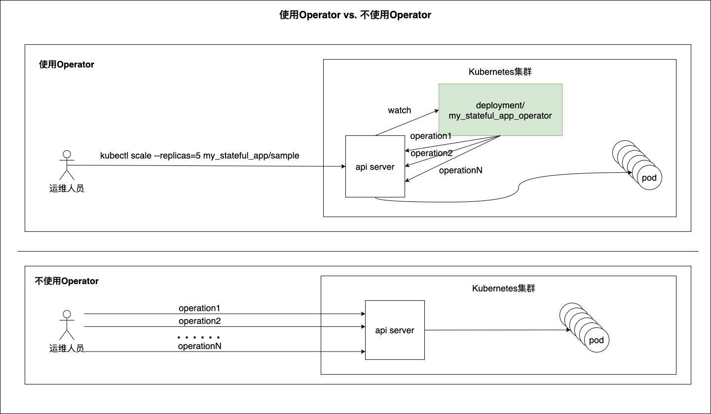

# CRD和Operator

## 1. CRD

`Custom Resource Define `简称 CRD，是 Kubernetes（v1.7+）为提高可扩展性，让开发者去自定义资源的一种方式。

CRD 资源可以动态注册到集群中，注册完毕后，用户可以通过 kubectl 来创建访问这个自定义的资源对象，类似于操作 Pod 一样。

诞生的背景：

k8s自定义的一些资源在有些时候是不能满足实际需求的，开发者需要自定义资源来满足自己实际的使用场景，k8s为了满足这样的需求，就开发了CRD，CRD也是一种资源类型，用户自定义资源后，CRD充当说明书的角色，让k8s能够识别开发者自定义的资源。

### 1.1 定义

CRD资源文件并不是随意书写的，需要符合一定的规范，CRD 是基于 [OpenAPI v3 schema](https://github.com/OAI/OpenAPI-Specification/blob/master/versions/3.0.0.md#schemaObject) 进行规范的。

案例：

~~~yaml
apiVersion: apiextensions.k8s.io/v1 # 固定的
kind: CustomResourceDefinition # 固定的
metadata:
  name: foos.crd.example.com  # name 必须匹配下面的spec字段：<plural>.<group>  
  annotations: # https://github.com/kubernetes/enhancements/blob/master/keps/sig-api-machinery/2337-k8s.io-group-protection/README.md
    "api-approved.kubernetes.io": "仅用于测试"
spec:
  group: crd.example.com  # group 名用于 REST API 中的定义： /apis/<group>/<version>
  versions:  # 列出自定义资源的所有 API 版本
    - name: v1  # 版本名称，比如v1，v1beta1
      served: true  # 是否开启通过 REST APIs访问 `/apis/<group>/<version>/...`
      storage: true # 必须将一个且只有一个版本标记为存储版本
      schema: # 定义自定义对象的声明规范
        openAPIV3Schema:  # schema used for validation
          type: object
          properties:
            spec:
              type: object
              properties:
                deploymentName:
                  type: string
                replicas:
                  type: integer
                  minimum: 1
                  maximum: 10
            status:
              type: object
              properties:
                availableReplicas:
                  type: integer
  names:
    kind: Foo  # kind 是 sigular 的一个驼峰形式的定义，在资源清单中会使用
    plural: foos # plural 名字用于 REST API 中的定义：/apis/<group>/<version>/<plural> 
    singular: foo  # singular 名称用于 CLI 操作或显示的一个别名   
    shortNames:  # shortNames 相当于缩写形式    
    - fo
  scope: Namespaced

~~~

当我们把上面的 CRD 文件提交给 Kubernetes 之后，Kubernetes 会对我们提交的声明文件进行校验。

~~~shell
[root@master crd]# kubectl apply -f foos.crd.example.com.yaml 
customresourcedefinition.apiextensions.k8s.io/foos.crd.example.com created
[root@master crd]# kubectl get crd 
NAME                                                  CREATED AT
foos.crd.example.com                                  2022-10-14T05:08:02Z
...
~~~

集群中已经有我们定义的这个CRD资源对象了。

~~~shell
[root@master crd]# kubectl api-versions
crd.example.com/v1
[root@master crd]# kubectl get apiservice
NAME                                   SERVICE                       AVAILABLE   AGE
v1.crd.example.com                     Local                         True        5m12s
[root@master crd]# kubectl api-resources
NAME                              SHORTNAMES                                      APIVERSION                             NAMESPACED   KIND
foos                              fo                                              crd.example.com/v1                     true         Foo
~~~

接下来，我们就可以根据这个自定义的资源对象来创建一个新的资源清单：

~~~yaml
apiVersion: crd.example.com/v1
kind: Foo
metadata:
  name: example-foo
spec:
  deploymentName: example-foo
  replicas: 1
~~~

注意：一定要符合我们上面定义的规范

~~~shell
[root@master crd]# kubectl apply -f example-foo.yaml 
foo.crd.example.com/example-foo created
[root@master crd]# kubectl get foo
NAME          AGE
example-foo   4s
[root@master crd]# kubectl get fo
NAME          AGE
example-foo   9s
~~~

> 当然上面创建的自定义资源，并没有什么作用，只是将其写入了etcd，k8s能识别而已，如果想要其真正起作用，就需要一个对应的控制器来处理

## 2. Operator

CoreOS Linux在2016年提出了`Operator`的概念，Operator是软件扩展程序，利用自定义资源来管理应用及其组件。

举个例子，Operator可以实现让在k8s上运行的程序自动实施一套流程，比如第一天安装配置，第二天升级，备份，故障转移等，其运行在k8s中，与k8s集成在一起。

Operator出现的初衷就是用来解放运维人员的，如今Operator也越来越受到云原生运维开发人员的青睐。

在使用operator的情况下，对有状态应用的伸缩操作（也可以是诸如升级版本等其他操作），运维人员仅需一个简单的命令即可，运维人员也无需知道k8s内部对有状态应用的伸缩操作的原理是什么。

在没有使用operator的情况下，运维人员需要对有状态应用的伸缩的操作步骤有深刻的认知，并按顺序逐个执行一个命令序列中的命令并检查命令响应，遇到失败的情况时还需要进行重试，直到伸缩成功。

operator就好比一个内置于k8s中的经验丰富运维人员，时刻监控目标对象的状态，把复杂性留给自己，给运维人员一个简洁的交互接口，同时operator也能降低运维人员因个人原因导致的操作失误的概率。

operator的开发过于复杂，是一门比较深奥的学问，属于k8s二次开发的范畴，有能力做到这件事的程序员比较稀少。

