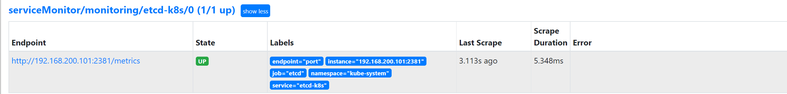

# Prometheus Operator 

Prometheus Operator 为监控 Kubernetes 资源和 Prometheus 实例的管理提供了简单的定义，简化在 Kubernetes 上部署、管理和运行 Prometheus 和 Alertmanager 集群。

## 1. 安装

### 1.1 介绍

首先我们先来了解下 Prometheus-Operator 的架构图：


上图是 Prometheus-Operator 官方提供的架构图，各组件以不同的方式运行在 Kubernetes 集群中，其中 Operator 是最核心的部分，作为一个控制器，他会去创建Prometheus、ServiceMonitor、AlertManager 以及 PrometheusRule 4个 CRD 资源对象，然后会一直监控并维持这4个资源对象的状态。

- `Operator`：根据自定义资源来部署和管理 Prometheus Server，同时监控这些自定义资源事件的变化来做相应的处理，是整个系统的控制中心。
- `Prometheus`：声明 Prometheus 资源对象期望的状态，Operator 确保这个资源对象运行时一直与定义保持一致。
- `Prometheus Server`：Operator 根据自定义资源 Prometheus 类型中定义的内容而部署的 Prometheus Server 集群，这些自定义资源可以看作是用来管理 Prometheus Server 集群的 StatefulSets 资源。
- `ServiceMonitor`：声明指定监控的服务，描述了一组被 Prometheus 监控的目标列表，就是 exporter 的抽象，用来提供 metrics 数据接口的工具。该资源通过 Labels 来选取对应的 Service Endpoint，让 Prometheus Server 通过选取的 Service 来获取 Metrics 信息。
- `Service`：简单的说就是 Prometheus 监控的对象。
- `Alertmanager`：定义 AlertManager 资源对象期望的状态，Operator 确保这个资源对象运行时一直与定义保持一致。

这样我们要在集群中监控什么数据，就变成了直接去操作 Kubernetes 集群的资源对象了，是不是方便很多了。

### 1.2 安装

我们可以使用 Helm 来快速安装 Prometheus Operator，也可以通过 [https://github.com/coreos/kube-prometheus](https://github.com/coreos/kube-prometheus) 项目来手动安装，我们这里采用手动安装的方式可以去了解更多的实现细节。

首先 clone 项目代码：

```shell
[root@master operator]# git clone https://github.com/coreos/kube-prometheus.git
[root@master operator]# ll
total 4
drwxr-xr-x 12 root root 4096 Oct 14 07:52 kube-prometheus
[root@master operator]# cd kube-prometheus/
[root@master kube-prometheus]# cd manifests/
```


进入到 `manifests` 目录下面，首先我们需要安装 `setup` 目录下面的 CRD 和 Operator 资源对象：

```shell
[root@master manifests]# kubectl create -f setup/      
customresourcedefinition.apiextensions.k8s.io/alertmanagerconfigs.monitoring.coreos.com created
customresourcedefinition.apiextensions.k8s.io/alertmanagers.monitoring.coreos.com created
customresourcedefinition.apiextensions.k8s.io/podmonitors.monitoring.coreos.com created
customresourcedefinition.apiextensions.k8s.io/probes.monitoring.coreos.com created
customresourcedefinition.apiextensions.k8s.io/prometheuses.monitoring.coreos.com created
customresourcedefinition.apiextensions.k8s.io/prometheusrules.monitoring.coreos.com created
customresourcedefinition.apiextensions.k8s.io/servicemonitors.monitoring.coreos.com created
customresourcedefinition.apiextensions.k8s.io/thanosrulers.monitoring.coreos.com created
namespace/monitoring created
[root@master manifests]# kubectl get ns
NAME               STATUS   AGE
monitoring         Active   2m14s
[root@master manifests]# kubectl get crd |grep coreos
alertmanagerconfigs.monitoring.coreos.com             2022-10-14T15:23:48Z
alertmanagers.monitoring.coreos.com                   2022-10-14T15:23:48Z
podmonitors.monitoring.coreos.com                     2022-10-14T15:23:48Z
probes.monitoring.coreos.com                          2022-10-14T15:23:48Z
prometheuses.monitoring.coreos.com                    2022-10-14T15:23:48Z
prometheusrules.monitoring.coreos.com                 2022-10-14T15:23:48Z
servicemonitors.monitoring.coreos.com                 2022-10-14T15:23:48Z
thanosrulers.monitoring.coreos.com                    2022-10-14T15:23:49Z
```

这会创建一个名为 `monitoring` 的命名空间，以及相关的 CRD 资源对象声明。

在 `manifests` 目录下面的就是我们要去创建的 Prometheus、Alertmanager 以及各种监控对象的资源清单。

没有特殊的定制需求我们可以直接一键安装：

```shell
[root@master manifests]# kubectl apply -f .
alertmanager.monitoring.coreos.com/main created
networkpolicy.networking.k8s.io/alertmanager-main created
poddisruptionbudget.policy/alertmanager-main created
prometheusrule.monitoring.coreos.com/alertmanager-main-rules created
secret/alertmanager-main created
service/alertmanager-main created
serviceaccount/alertmanager-main created
servicemonitor.monitoring.coreos.com/alertmanager-main created
clusterrole.rbac.authorization.k8s.io/blackbox-exporter created
clusterrolebinding.rbac.authorization.k8s.io/blackbox-exporter created
configmap/blackbox-exporter-configuration created
...
```

这会自动安装 node-exporter、kube-state-metrics、grafana、prometheus-adapter 以及 prometheus 和 alertmanager ,operator,blackbox_exporter 组件，而且 prometheus 和 alertmanager 还是多副本的。

blackbox exporter 可以实现对 `http`，`https`，`tcp(可以实现服务器接口是否在线)`，`icmp(实现主机探活)`，`dns`的探测。

```shell
[root@master manifests]# kubectl get pods -n monitoring
NAME                                  READY   STATUS              RESTARTS   AGE
alertmanager-main-0                   0/2     ContainerCreating   0          24s
alertmanager-main-1                   0/2     ContainerCreating   0          24s
alertmanager-main-2                   0/2     ContainerCreating   0          24s
blackbox-exporter-c5547b8bb-5h5gb     0/3     ContainerCreating   0          37s
grafana-7c4645d965-ffzqg              0/1     ContainerCreating   0          37s
kube-state-metrics-8658546b69-v728r   0/3     ContainerCreating   0          37s
node-exporter-62sm7                   0/2     ContainerCreating   0          36s
node-exporter-g57tr                   2/2     Running             0          36s
node-exporter-p5kqx                   0/2     ContainerCreating   0          36s
prometheus-adapter-678b454b8b-n4kz6   0/1     ErrImagePull        0          36s
prometheus-adapter-678b454b8b-t2w8r   0/1     ContainerCreating   0          36s
prometheus-k8s-0                      0/2     PodInitializing     0          23s
prometheus-k8s-1                      0/2     PodInitializing     0          23s
prometheus-operator-5ddfd64d6-87m7h   0/2     ContainerCreating   0          36s
[root@master manifests]# kubectl get svc -n monitoring
NAME                    TYPE        CLUSTER-IP       EXTERNAL-IP   PORT(S)                      AGE
alertmanager-main       ClusterIP   10.107.154.95    <none>        9093/TCP,8080/TCP            2m7s
alertmanager-operated   ClusterIP   None             <none>        9093/TCP,9094/TCP,9094/UDP   114s
blackbox-exporter       ClusterIP   10.106.242.209   <none>        9115/TCP,19115/TCP           2m7s
grafana                 ClusterIP   10.103.252.136   <none>        3000/TCP                     2m7s
kube-state-metrics      ClusterIP   None             <none>        8443/TCP,9443/TCP            2m7s
node-exporter           ClusterIP   None             <none>        9100/TCP                     2m6s
prometheus-adapter      ClusterIP   10.100.17.155    <none>        443/TCP                      2m6s
prometheus-k8s          ClusterIP   10.111.69.230    <none>        9090/TCP,8080/TCP            2m6s
prometheus-operated     ClusterIP   None             <none>        9090/TCP                     114s
prometheus-operator     ClusterIP   None             <none>        8443/TCP                     2m6s
```

注意：有些服务启动会有问题，还是镜像翻墙问题，可以做一些修改

~~~shell
[root@master manifests]# kubectl edit deploy kube-state-metrics -n monitoring
image: bitnami/kube-state-metrics:2.6.0
[root@master manifests]# kubectl edit deploy prometheus-adapter -n monitoring
willdockerhub/prometheus-adapter:v0.9.1
~~~


可以看到上面针对 grafana、alertmanager 和 prometheus 都创建了一个类型为 ClusterIP 的 Service，当然如果我们想要在外网访问这两个服务的话可以通过创建对应的 Ingress 对象或者使用 NodePort 类型的 Service，我们这里为了简单，直接使用 NodePort 类型的服务即可，编辑 grafana、alertmanager-main 和 prometheus-k8s 这3个 Service，将服务类型更改为 NodePort:

```shell
# 将 type: ClusterIP 更改为 type: NodePort
[root@master manifests]# kubectl edit svc grafana -n monitoring 
[root@master manifests]# kubectl edit svc alertmanager-main -n monitoring
[root@master manifests]# kubectl edit svc prometheus-k8s -n monitoring
[root@master manifests]# kubectl get svc -n monitoring
NAME                    TYPE        CLUSTER-IP       EXTERNAL-IP   PORT(S)                         AGE
alertmanager-main       NodePort    10.107.154.95    <none>        9093:30353/TCP,8080:30764/TCP   4m12s
alertmanager-operated   ClusterIP   None             <none>        9093/TCP,9094/TCP,9094/UDP      3m59s
blackbox-exporter       ClusterIP   10.106.242.209   <none>        9115/TCP,19115/TCP              4m12s
grafana                 NodePort    10.103.252.136   <none>        3000:30674/TCP                  4m12s
kube-state-metrics      ClusterIP   None             <none>        8443/TCP,9443/TCP               4m12s
node-exporter           ClusterIP   None             <none>        9100/TCP                        4m11s
prometheus-adapter      ClusterIP   10.100.17.155    <none>        443/TCP                         4m11s
prometheus-k8s          NodePort    10.111.69.230    <none>        9090:32687/TCP,8080:31305/TCP   4m11s
prometheus-operated     ClusterIP   None             <none>        9090/TCP                        3m59s
prometheus-operator     ClusterIP   None             <none>        8443/TCP                        4m11s
```


更改完成后，我们就可以通过上面的 NodePort 去访问对应的服务了，比如查看 prometheus 的服务发现页面：

~~~shell
# 网络策略相关的 删除 影响访问
[root@master manifests]# kubectl delete -f prometheus-networkPolicy.yaml 
networkpolicy.networking.k8s.io "prometheus-k8s" deleted
[root@master manifests]# kubectl delete -f grafana-networkPolicy.yaml 
networkpolicy.networking.k8s.io "grafana" deleted
[root@master manifests]# kubectl delete -f alertmanager-networkPolicy.yaml 
networkpolicy.networking.k8s.io "alertmanager-main" deleted
~~~


可以看到已经监控上了很多指标数据了，上面我们可以看到 Prometheus 是两个副本，我们这里通过 Service 去访问， Service 在创建的时候添加了 `sessionAffinity: ClientIP` 这样的属性，会根据 `ClientIP` 来做 session 亲和性，所以我们不用担心请求会到不同的副本上去：

```yaml
apiVersion: v1
kind: Service
metadata:
  labels:
    app.kubernetes.io/component: prometheus
    app.kubernetes.io/instance: k8s
    app.kubernetes.io/name: prometheus
    app.kubernetes.io/part-of: kube-prometheus
    app.kubernetes.io/version: 2.39.1
  name: prometheus-k8s
  namespace: monitoring
spec:
  ports:
  - name: web
    port: 9090
    targetPort: web
  - name: reloader-web
    port: 8080
    targetPort: reloader-web
  selector:
    app.kubernetes.io/component: prometheus
    app.kubernetes.io/instance: k8s
    app.kubernetes.io/name: prometheus
    app.kubernetes.io/part-of: kube-prometheus
  sessionAffinity: ClientIP
  type: NodePort
```

### 1.3 配置


在监控中我们并没有发现kube-scheduler和KubeControllerManager的监控

~~~shell
[root@master manifests]# cat kubernetesControlPlane-serviceMonitorKubeScheduler.yaml
apiVersion: monitoring.coreos.com/v1
kind: ServiceMonitor
metadata:
  labels:
    app.kubernetes.io/name: kube-scheduler
    app.kubernetes.io/part-of: kube-prometheus
  name: kube-scheduler
  namespace: monitoring
spec:
  endpoints:
  - bearerTokenFile: /var/run/secrets/kubernetes.io/serviceaccount/token
    interval: 30s
    port: https-metrics
    scheme: https
    tlsConfig:
      insecureSkipVerify: true
  jobLabel: app.kubernetes.io/name
  namespaceSelector:
    matchNames:
    - kube-system
  selector:
    matchLabels:
      app.kubernetes.io/name: kube-scheduler
~~~


我们需要去创建一个对应的 Service 对象,和上方的 `ServiceMonitor` 进行关联：(prometheus-kubeSchedulerService.yaml)

```yaml
apiVersion: v1
kind: Service
metadata:
  namespace: kube-system
  name: kube-scheduler
  labels:
    app.kubernetes.io/name: kube-scheduler
spec:
  selector:
    component: kube-scheduler
  ports:
  - name: https-metrics
    port: 10259
    targetPort: 10259
```


其中最重要的是上面 labels 和 selector 部分，labels 区域的配置必须和我们上面的 ServiceMonitor 对象中的 selector 保持一致，selector 下面配置的是 `component=kube-scheduler`，为什么会是这个 label 标签呢，我们可以去 describe 下 kube-scheduler 这个 Pod：

```shell
[root@master manifests]# kubectl describe pod kube-scheduler-master -n kube-system  
Name:                 kube-scheduler-master
Namespace:            kube-system
Priority:             2000001000
Priority Class Name:  system-node-critical
Node:                 master/192.168.200.101
Start Time:           Fri, 14 Oct 2022 12:09:42 -0400
Labels:               component=kube-scheduler
                      tier=control-plane
```

我们可以看到这个 Pod 具有 `component=kube-scheduler` 和 `tier=control-plane` 这两个标签，而前面这个标签具有更唯一的特性，所以使用前面这个标签较好，这样上面创建的 Service 就可以和我们的 Pod 进行关联了，直接创建即可：

```shell
[root@master manifests]# kubectl apply -f prometheus-kubeSchedulerService.yaml 
service/kube-scheduler created
```

kube-scheduler使用了--secure-port绑定到127.0.0.1而不是0.0.0.0，所以会出现连接不上的情况，还需要修改：

~~~shell
[root@master manifests]# vim /etc/kubernetes/manifests/kube-scheduler.yaml 
- --bind-address=0.0.0.0
~~~

创建完成后，隔一小会儿后去 Prometheus 页面上查看 targets 下面 kube-scheduler 已经可以采集到指标数据了。


可以用同样的方式来修复下 kube-controller-manager 组件的监控。

~~~shell
[root@master manifests]# cat kubernetesControlPlane-serviceMonitorKubeControllerManager.yaml 
apiVersion: monitoring.coreos.com/v1
kind: ServiceMonitor
metadata:
  labels:
    app.kubernetes.io/name: kube-controller-manager
    app.kubernetes.io/part-of: kube-prometheus
  name: kube-controller-manager
  namespace: monitoring
spec:
  endpoints:
  - bearerTokenFile: /var/run/secrets/kubernetes.io/serviceaccount/token
    interval: 30s
    metricRelabelings:
    - action: drop
      regex: kubelet_(pod_worker_latency_microseconds|pod_start_latency_microseconds|cgroup_manager_latency_microseconds|pod_worker_start_latency_microseconds|pleg_relist_latency_microseconds|pleg_relist_interval_microseconds|runtime_operations|runtime_operations_latency_microseconds|runtime_operations_errors|eviction_stats_age_microseconds|device_plugin_registration_count|device_plugin_alloc_latency_microseconds|network_plugin_operations_latency_microseconds)
      sourceLabels:
      - __name__
    - action: drop
      regex: scheduler_(e2e_scheduling_latency_microseconds|scheduling_algorithm_predicate_evaluation|scheduling_algorithm_priority_evaluation|scheduling_algorithm_preemption_evaluation|scheduling_algorithm_latency_microseconds|binding_latency_microseconds|scheduling_latency_seconds)
      sourceLabels:
      - __name__
    - action: drop
      regex: apiserver_(request_count|request_latencies|request_latencies_summary|dropped_requests|storage_data_key_generation_latencies_microseconds|storage_transformation_failures_total|storage_transformation_latencies_microseconds|proxy_tunnel_sync_latency_secs|longrunning_gauge|registered_watchers)
      sourceLabels:
      - __name__
    - action: drop
      regex: kubelet_docker_(operations|operations_latency_microseconds|operations_errors|operations_timeout)
      sourceLabels:
      - __name__
    - action: drop
      regex: reflector_(items_per_list|items_per_watch|list_duration_seconds|lists_total|short_watches_total|watch_duration_seconds|watches_total)
      sourceLabels:
      - __name__
    - action: drop
      regex: etcd_(helper_cache_hit_count|helper_cache_miss_count|helper_cache_entry_count|object_counts|request_cache_get_latencies_summary|request_cache_add_latencies_summary|request_latencies_summary)
      sourceLabels:
      - __name__
    - action: drop
      regex: transformation_(transformation_latencies_microseconds|failures_total)
      sourceLabels:
      - __name__
    - action: drop
      regex: (admission_quota_controller_adds|admission_quota_controller_depth|admission_quota_controller_longest_running_processor_microseconds|admission_quota_controller_queue_latency|admission_quota_controller_unfinished_work_seconds|admission_quota_controller_work_duration|APIServiceOpenAPIAggregationControllerQueue1_adds|APIServiceOpenAPIAggregationControllerQueue1_depth|APIServiceOpenAPIAggregationControllerQueue1_longest_running_processor_microseconds|APIServiceOpenAPIAggregationControllerQueue1_queue_latency|APIServiceOpenAPIAggregationControllerQueue1_retries|APIServiceOpenAPIAggregationControllerQueue1_unfinished_work_seconds|APIServiceOpenAPIAggregationControllerQueue1_work_duration|APIServiceRegistrationController_adds|APIServiceRegistrationController_depth|APIServiceRegistrationController_longest_running_processor_microseconds|APIServiceRegistrationController_queue_latency|APIServiceRegistrationController_retries|APIServiceRegistrationController_unfinished_work_seconds|APIServiceRegistrationController_work_duration|autoregister_adds|autoregister_depth|autoregister_longest_running_processor_microseconds|autoregister_queue_latency|autoregister_retries|autoregister_unfinished_work_seconds|autoregister_work_duration|AvailableConditionController_adds|AvailableConditionController_depth|AvailableConditionController_longest_running_processor_microseconds|AvailableConditionController_queue_latency|AvailableConditionController_retries|AvailableConditionController_unfinished_work_seconds|AvailableConditionController_work_duration|crd_autoregistration_controller_adds|crd_autoregistration_controller_depth|crd_autoregistration_controller_longest_running_processor_microseconds|crd_autoregistration_controller_queue_latency|crd_autoregistration_controller_retries|crd_autoregistration_controller_unfinished_work_seconds|crd_autoregistration_controller_work_duration|crdEstablishing_adds|crdEstablishing_depth|crdEstablishing_longest_running_processor_microseconds|crdEstablishing_queue_latency|crdEstablishing_retries|crdEstablishing_unfinished_work_seconds|crdEstablishing_work_duration|crd_finalizer_adds|crd_finalizer_depth|crd_finalizer_longest_running_processor_microseconds|crd_finalizer_queue_latency|crd_finalizer_retries|crd_finalizer_unfinished_work_seconds|crd_finalizer_work_duration|crd_naming_condition_controller_adds|crd_naming_condition_controller_depth|crd_naming_condition_controller_longest_running_processor_microseconds|crd_naming_condition_controller_queue_latency|crd_naming_condition_controller_retries|crd_naming_condition_controller_unfinished_work_seconds|crd_naming_condition_controller_work_duration|crd_openapi_controller_adds|crd_openapi_controller_depth|crd_openapi_controller_longest_running_processor_microseconds|crd_openapi_controller_queue_latency|crd_openapi_controller_retries|crd_openapi_controller_unfinished_work_seconds|crd_openapi_controller_work_duration|DiscoveryController_adds|DiscoveryController_depth|DiscoveryController_longest_running_processor_microseconds|DiscoveryController_queue_latency|DiscoveryController_retries|DiscoveryController_unfinished_work_seconds|DiscoveryController_work_duration|kubeproxy_sync_proxy_rules_latency_microseconds|non_structural_schema_condition_controller_adds|non_structural_schema_condition_controller_depth|non_structural_schema_condition_controller_longest_running_processor_microseconds|non_structural_schema_condition_controller_queue_latency|non_structural_schema_condition_controller_retries|non_structural_schema_condition_controller_unfinished_work_seconds|non_structural_schema_condition_controller_work_duration|rest_client_request_latency_seconds|storage_operation_errors_total|storage_operation_status_count)
      sourceLabels:
      - __name__
    - action: drop
      regex: etcd_(debugging|disk|request|server).*
      sourceLabels:
      - __name__
    port: https-metrics
    scheme: https
    tlsConfig:
      insecureSkipVerify: true
  jobLabel: app.kubernetes.io/name
  namespaceSelector:
    matchNames:
    - kube-system
  selector:
    matchLabels:
      app.kubernetes.io/name: kube-controller-manager
~~~


创建一个如下所示的 Service 对象：(prometheus-kubeControllerManagerService.yaml)

```yaml
apiVersion: v1
kind: Service
metadata:
  namespace: kube-system
  name: kube-controller-manager
  labels:
    app.kubernetes.io/name: kube-controller-manager
spec:
  selector:
    component: kube-controller-manager
  ports:
  - name: https-metrics
    port: 10257
    targetPort: 10257
```

~~~shell
[root@master manifests]# vim /etc/kubernetes/manifests/kube-controller-manager.yaml
~~~


上面的监控数据配置完成后，我们就可以去查看下 Grafana 下面的监控图表了，同样使用上面的 NodePort 访问即可，第一次登录使用 `admin:admin` 登录即可，进入首页后，我们可以发现其实 Grafana 已经有很多配置好的监控图表了。


我们可以随便选择一个 Dashboard 查看监控图表信息。


接下来我们再来学习如何完全自定义一个 `ServiceMonitor` 以及 AlertManager 相关的配置

## 2. 自定义监控报警

除了 Kubernetes 集群中的一些资源对象、节点以及组件需要监控，有的时候我们可能还需要根据实际的业务需求去添加自定义的监控项，添加一个自定义监控的步骤也是非常简单的。

- 第一步建立一个 ServiceMonitor 对象，用于 Prometheus 添加监控项
- 第二步为 ServiceMonitor 对象关联 metrics 数据接口的一个 Service 对象
- 第三步确保 Service 对象可以正确获取到 metrics 数据

接下来我们就来为大家演示如何添加 `etcd` 集群的监控。无论是 Kubernetes 集群外的还是使用 Kubeadm 安装在集群内部的 etcd 集群，我们这里都将其视作集群外的独立集群，因为对于二者的使用方法没什么特殊之处。

### 2.1 etcd 监控

由于我们这里的环境使用的是 Kubeadm 搭建的集群，我们可以使用 kubectl 工具去获取 etcd 启动的相关参数：

```shell
[root@master manifests]# kubectl get pods -n kube-system -l component=etcd
NAME          READY   STATUS    RESTARTS       AGE
etcd-master   1/1     Running   17 (61m ago)   21d
[root@master manifests]# kubectl get pods etcd-master -n kube-system -o yaml
......
spec:
  containers:
  - command:
    - etcd
    - --advertise-client-urls=https://192.168.200.101:2379
    - --cert-file=/etc/kubernetes/pki/etcd/server.crt
    - --client-cert-auth=true
    - --data-dir=/var/lib/etcd
    - --experimental-initial-corrupt-check=true
    - --initial-advertise-peer-urls=https://192.168.200.101:2380
    - --initial-cluster=master=https://192.168.200.101:2380
    - --key-file=/etc/kubernetes/pki/etcd/server.key
    - --listen-client-urls=https://127.0.0.1:2379,https://192.168.200.101:2379
    - --listen-metrics-urls=http://127.0.0.1:2381
    - --listen-peer-urls=https://192.168.200.101:2380
    - --name=master
    - --peer-cert-file=/etc/kubernetes/pki/etcd/peer.crt
    - --peer-client-cert-auth=true
    - --peer-key-file=/etc/kubernetes/pki/etcd/peer.key
    - --peer-trusted-ca-file=/etc/kubernetes/pki/etcd/ca.crt
    - --snapshot-count=10000
    - --trusted-ca-file=/etc/kubernetes/pki/etcd/ca.crt
    image: registry.aliyuncs.com/google_containers/etcd:3.5.3-0
    imagePullPolicy: IfNotPresent
......
    volumeMounts:
    - mountPath: /var/lib/etcd
      name: etcd-data
    - mountPath: /etc/kubernetes/pki/etcd
      name: etcd-certs
......
  volumes:
  - hostPath:
      path: /etc/kubernetes/pki/etcd
      type: DirectoryOrCreate
    name: etcd-certs
  - hostPath:
      path: /var/lib/etcd
      type: DirectoryOrCreate
    name: etcd-data
......
```

我们可以看到启动参数里面有一个 `--listen-metrics-urls=http://127.0.0.1:2381` 的配置，该参数就是来指定 metrics 接口运行在 2381 端口下面的，而且是 http 的协议，所以也不需要什么证书配置。

接下来我们直接创建对应的 ServiceMonitor 对象即可（prometheus-serviceMonitorEtcd.yaml）:

```yaml
apiVersion: monitoring.coreos.com/v1
kind: ServiceMonitor
metadata:
  name: etcd-k8s
  namespace: monitoring
  labels:
    k8s-app: etcd-k8s
spec:
  jobLabel: k8s-app
  endpoints:
  - port: port
    interval: 15s
  selector:
    matchLabels:
      k8s-app: etcd
  namespaceSelector:
    matchNames:
    - kube-system
```

上面我们在 monitoring 命名空间下面创建了名为 etcd-k8s 的 ServiceMonitor 对象，匹配 kube-system 这个命名空间下面的具有 `k8s-app=etcd` 这个 label 标签的 Service，`jobLabel` 表示用于检索 job 任务名称的标签，由于 etcd 的 metrics 接口在 2381 端口下面，不需要 https 安全认证，所以用默认的配置即可。关于 ServiceMonitor 更多的配置属性，可以参考[官方的 API 文档](https://github.com/coreos/prometheus-operator/blob/master/Documentation/api.md#servicemonitorspec)的描述。

然后我们直接创建这个 ServiceMonitor 对象即可：

```shell
[root@master manifests]# kubectl apply -f prometheus-serviceMonitorEtcd.yaml
servicemonitor.monitoring.coreos.com/etcd-k8s created
```

但实际上现在并不能监控到 etcd 集群，因为并没有一个满足 ServiceMonitor 条件的 Service 对象与之关联：

```shell
[root@master manifests]# kubectl get svc -n kube-system -l k8s-app=etcd
No resources found in kube-system namespace.
```

所以接下来我们需要创建一个满足上面条件的 Service 对象，由于我们把 etcd 当成是集群外部的服务，所以要引入到集群中来我们就需要自定义 Endpoints 对象来创建 Service 对象了：(etcd-service.yaml)

```yaml
apiVersion: v1
kind: Service
metadata:
  name: etcd-k8s
  namespace: kube-system
  labels:
    k8s-app: etcd
spec:
  type: ClusterIP
  clusterIP: None  # 一定要设置 clusterIP:None
  ports:
  - name: port
    port: 2381
---
apiVersion: v1
kind: Endpoints
metadata:
  name: etcd-k8s
  namespace: kube-system
  labels:
    k8s-app: etcd
subsets:
- addresses:
  - ip: 192.168.200.101  # 指定etcd节点地址，如果是集群则继续向下添加
    nodeName: etc-master
  ports:
  - name: port
    port: 2381
```


我们这里创建的 Service 没有采用前面通过 label 标签的形式去匹配 Pod 的做法，因为前面我们说过很多时候我们创建的 etcd 集群是独立于集群之外的，这种情况下面我们就需要自定义一个 Endpoints，要注意 `metadata` 区域的内容要和 Service 保持一致，Service 的 clusterIP 设置为 None，新版本的 etcd 将 metrics 接口数据放置到了 2381 端口。直接创建该资源对象即可：

```shell
[root@master manifests]# kubectl apply -f etcd-service.yaml
service/etcd-k8s created
endpoints/etcd-k8s created
[root@master manifests]# kubectl get svc -n kube-system -l k8s-app=etcd
NAME       TYPE        CLUSTER-IP   EXTERNAL-IP   PORT(S)    AGE
etcd-k8s   ClusterIP   None         <none>        2381/TCP   4s
```


创建完成后，隔一会儿去 Prometheus 的 Dashboard 中查看 targets，便会有 etcd 的监控项了：


可以看到有一个明显的错误，2381 端口链接被拒绝，这是因为我们这里的 etcd 的 metrics 接口是监听在 `127.0.0.1` 这个 IP 上面的，所以访问会拒绝：

```shell
--listen-metrics-urls=http://127.0.0.1:2381
```


我们只需要在 `/etc/kubernetes/manifest/` 目录下面（静态 Pod 默认的目录）的 `etcd.yaml` 文件中将上面的`listen-metrics-urls` 更改成节点 IP 即可：

```shell
--listen-metrics-urls=http://0.0.0.0:2381
```


当 etcd 重启生效后，查看 etcd 这个监控任务就正常了：



数据采集到后，可以在 grafana 中导入编号为 `10323` 的 dashboard，就可以获取到 etcd 的监控图表：


### 2.2 配置 PrometheusRule

现在我们知道怎么自定义一个 `ServiceMonitor` 对象了，但是如果需要自定义一个报警规则的话呢？我们去查看 Prometheus Dashboard 的 Alert 页面下面就已经有很多报警规则了，这一系列的规则其实都来自于项目 https://github.com/kubernetes-monitoring/kubernetes-mixin，我们都通过 Prometheus Operator 安装配置上了。

但是这些报警信息是哪里来的呢？他们应该用怎样的方式通知我们呢？我们知道之前我们使用自定义的方式可以在 Prometheus 的配置文件之中指定 AlertManager 实例和 报警的 rules 文件，现在我们通过 Operator 部署的呢？我们可以在 Prometheus Dashboard 的 Config 页面下面查看关于 AlertManager 的配置：

```yaml
alerting:
  alert_relabel_configs:
  - separator: ;
    regex: prometheus_replica
    replacement: $1
    action: labeldrop
  alertmanagers:
  - follow_redirects: true
    enable_http2: true
    scheme: http
    path_prefix: /
    timeout: 10s
    api_version: v2
    relabel_configs:
    - source_labels: [__meta_kubernetes_service_name]
      separator: ;
      regex: alertmanager-main
      replacement: $1
      action: keep
    - source_labels: [__meta_kubernetes_endpoint_port_name]
      separator: ;
      regex: web
      replacement: $1
      action: keep
    kubernetes_sd_configs:
    - role: endpoints
      kubeconfig_file: ""
      follow_redirects: true
      enable_http2: true
      namespaces:
        own_namespace: false
        names:
        - monitoring
rule_files:
- /etc/prometheus/rules/prometheus-k8s-rulefiles-0/*.yaml
```


上面 `alertmanagers` 的配置我们可以看到是通过 role 为 `endpoints` 的 kubernetes 的自动发现机制获取的，匹配的是服务名为 `alertmanager-main`，端口名为 web 的 Service 服务，我们可以查看下 alertmanager-main 这个 Service：

```shell
[root@master manifests]# kubectl describe svc alertmanager-main -n monitoring
Name:                     alertmanager-main
Namespace:                monitoring
Labels:                   app.kubernetes.io/component=alert-router
                          app.kubernetes.io/instance=main
                          app.kubernetes.io/name=alertmanager
                          app.kubernetes.io/part-of=kube-prometheus
                          app.kubernetes.io/version=0.24.0
Annotations:              <none>
Selector:                 app.kubernetes.io/component=alert-router,app.kubernetes.io/instance=main,app.kubernetes.io/name=alertmanager,app.kubernetes.io/part-of=kube-prometheus
Type:                     NodePort
IP Family Policy:         SingleStack
IP Families:              IPv4
IP:                       10.101.111.78
IPs:                      10.101.111.78
Port:                     web  9093/TCP
TargetPort:               web/TCP
NodePort:                 web  31999/TCP
Endpoints:                10.244.104.29:9093,10.244.166.148:9093,10.244.166.150:9093
Port:                     reloader-web  8080/TCP
TargetPort:               reloader-web/TCP
NodePort:                 reloader-web  32208/TCP
Endpoints:                10.244.104.29:8080,10.244.166.148:8080,10.244.166.150:8080
Session Affinity:         ClientIP
External Traffic Policy:  Cluster
Events:                   <none>
```

可以看到服务名正是 `alertmanager-main`，Port 定义的名称也是 `web`，符合上面的规则，所以 Prometheus 和 AlertManager 组件就正确关联上了。而对应的报警规则文件位于：`/etc/prometheus/rules/prometheus-k8s-rulefiles-0/`目录下面所有的 YAML 文件。我们可以进入 Prometheus 的 Pod 中验证下该目录下面是否有 YAML 文件：

```shell
[root@master manifests]# kubectl exec -it prometheus-k8s-0  -n monitoring -- /bin/sh
/prometheus $ ls /etc/prometheus/rules/prometheus-k8s-rulefiles-0/
monitoring-alertmanager-main-rules-65684fa0-2ac2-44cb-8285-c600ef0337d9.yaml
monitoring-grafana-rules-94dbedc4-7498-4acb-942d-aac98fd61a0d.yaml
monitoring-kube-prometheus-rules-00aef2e2-2f47-4274-9c64-80e786f52959.yaml
monitoring-kube-state-metrics-rules-570164d9-a73a-4103-b1ca-32d2a0870ac1.yaml
monitoring-kubernetes-monitoring-rules-e6ac08d1-8378-4de7-add7-93532af0690f.yaml
monitoring-node-exporter-rules-5ebbb7d5-2e8b-44b7-bf88-b7de3916ac1e.yaml
monitoring-prometheus-k8s-prometheus-rules-26d84cbb-baf7-4654-b00d-05f66b4ddef0.yaml
monitoring-prometheus-operator-rules-cf0a2d8b-f9c8-48ff-87f2-664a1f95a34f.yaml
```

~~~shell
[root@master manifests]# cat prometheus-prometheusRule.yaml 
apiVersion: monitoring.coreos.com/v1
kind: PrometheusRule
metadata:
  labels:
    app.kubernetes.io/component: prometheus
    app.kubernetes.io/instance: k8s
    app.kubernetes.io/name: prometheus
    app.kubernetes.io/part-of: kube-prometheus
    app.kubernetes.io/version: 2.39.1
    prometheus: k8s
    role: alert-rules
  name: prometheus-k8s-prometheus-rules
  namespace: monitoring
~~~


我们这里的 `PrometheusRule` 的 name 为 `prometheus-k8s-prometheus-rules`，namespace 为 `monitoring`，我们可以猜想到我们创建一个 PrometheusRule 资源对象后，会自动在上面的 `prometheus-k8s-rulefiles-0` 目录下面生成一个对应的 `<namespace>-<name>.yaml` 文件，所以如果以后我们需要自定义一个报警选项的话，只需要定义一个 `PrometheusRule` 资源对象即可。至于为什么 Prometheus 能够识别这个 PrometheusRule 资源对象呢？只要具有 `prometheus=k8s` 和 `role=alert-rules` 标签的 `PrometheusRule` 资源对象，就能够被识别。

所以我们要想自定义一个报警规则，只需要创建一个具有 `prometheus=k8s` 和 `role=alert-rules` 标签的 `PrometheusRule` 对象就行了，比如现在我们添加一个 etcd 是否可用的报警，我们知道 etcd 整个集群有一半以上的节点可用的话集群就是可用的，所以我们判断如果不可用的 etcd 数量超过了一半那么就触发报警，创建文件 `prometheus-etcdRules.yaml`：

```yaml
apiVersion: monitoring.coreos.com/v1
kind: PrometheusRule
metadata:
  labels:
    prometheus: k8s
    role: alert-rules
  name: etcd-rules
  namespace: monitoring
spec:
  groups:
  - name: etcd
    rules:
    - alert: EtcdClusterUnavailable
      annotations:
        summary: etcd cluster small
        description: If one more etcd peer goes down the cluster will be unavailable
      expr: |
        count(up{job="etcd"} == 0) > (count(up{job="etcd"}) / 2 - 1)
      for: 3m
      labels:
        severity: critical
```


注意 label 标签一定至少要有 `prometheus=k8s` 和 `role=alert-rules`，创建完成后，隔一会儿再去容器中查看下 rules 文件夹：

```shell
[root@master manifests]# kubectl apply -f prometheus-etcdRules.yaml
prometheusrule.monitoring.coreos.com/etcd-rules created
[root@master manifests]# kubectl exec -it prometheus-k8s-0 -n monitoring -- /bin/sh
/prometheus $ ls /etc/prometheus/rules/prometheus-k8s-rulefiles-0/
monitoring-alertmanager-main-rules-65684fa0-2ac2-44cb-8285-c600ef0337d9.yaml
monitoring-etcd-rules-e3dfc19b-5c7e-4671-b899-024400697208.yaml
monitoring-grafana-rules-94dbedc4-7498-4acb-942d-aac98fd61a0d.yaml
monitoring-kube-prometheus-rules-00aef2e2-2f47-4274-9c64-80e786f52959.yaml
monitoring-kube-state-metrics-rules-570164d9-a73a-4103-b1ca-32d2a0870ac1.yaml
monitoring-kubernetes-monitoring-rules-e6ac08d1-8378-4de7-add7-93532af0690f.yaml
monitoring-node-exporter-rules-5ebbb7d5-2e8b-44b7-bf88-b7de3916ac1e.yaml
monitoring-prometheus-k8s-prometheus-rules-26d84cbb-baf7-4654-b00d-05f66b4ddef0.yaml
monitoring-prometheus-operator-rules-cf0a2d8b-f9c8-48ff-87f2-664a1f95a34f.yaml
```

可以看到我们创建的 rule 文件已经被注入到了对应的 `rulefiles` 文件夹下面了，证明我们上面的设想是正确的。然后再去 Prometheus Dashboard 的 Alert 页面下面就可以查看到上面我们新建的报警规则了：


### 2.3 配置报警

我们知道了如何去添加一个报警规则配置项，但是这些报警信息用怎样的方式去发送呢？前面的课程中我们知道我们可以通过 AlertManager 的配置文件去配置各种报警接收器，现在我们是通过 Operator 提供的 alertmanager 资源对象创建的组件，应该怎样去修改配置呢？

首先我们去 Alertmanager 的页面上 `status` 路径下面查看 AlertManager 的配置信息:

~~~shell
[root@master manifests]# kubectl get svc -n monitoring
NAME                    TYPE        CLUSTER-IP       EXTERNAL-IP   PORT(S)                         AGE
alertmanager-main       NodePort    10.101.111.78    <none>        9093:31999/TCP,8080:32208/TCP   94m
~~~


这些配置信息实际上是来自于前面创建的 `alertmanager-secret.yaml` 文件：

```yaml
[root@master manifests]# cat alertmanager-secret.yaml 
apiVersion: v1
kind: Secret
metadata:
  labels:
    app.kubernetes.io/component: alert-router
    app.kubernetes.io/instance: main
    app.kubernetes.io/name: alertmanager
    app.kubernetes.io/part-of: kube-prometheus
    app.kubernetes.io/version: 0.24.0
  name: alertmanager-main
  namespace: monitoring
stringData:
  alertmanager.yaml: |-
    "global":
      "resolve_timeout": "5m"
    "inhibit_rules":
    - "equal":
      - "namespace"
      - "alertname"
      "source_matchers":
      - "severity = critical"
      "target_matchers":
      - "severity =~ warning|info"
    - "equal":
      - "namespace"
      - "alertname"
      "source_matchers":
      - "severity = warning"
      "target_matchers":
      - "severity = info"
    - "equal":
      - "namespace"
      "source_matchers":
      - "alertname = InfoInhibitor"
      "target_matchers":
      - "severity = info"
    "receivers":
    - "name": "Default"
    - "name": "Watchdog"
    - "name": "Critical"
    - "name": "null"
    "route":
      "group_by":
      - "namespace"
      "group_interval": "5m"
      "group_wait": "30s"
      "receiver": "Default"
      "repeat_interval": "12h"
      "routes":
      - "matchers":
        - "alertname = Watchdog"
        "receiver": "Watchdog"
      - "matchers":
        - "alertname = InfoInhibitor"
        "receiver": "null"
      - "matchers":
        - "severity = critical"
        "receiver": "Critical"
type: Opaque
```


我们可以看到内容和上面查看的配置信息是一致的，所以如果我们想要添加自己的接收器，我们就可以直接更改这个文件，比如我们将 `Critical` 这个接收器的报警信息都发送到邮件进行报警。

修改报警配置文件 `alertmanager-secret.yaml`：

```yaml
"global":
      "smtp_smarthost": "smtp.163.com:25"
      "smtp_from": "huo9190@163.com"
      "smtp_auth_username": "huo9190@163.com"
      "smtp_auth_password": "xx"
      "smtp_hello": "163.com"
      "smtp_require_tls": false
      "resolve_timeout": "5m"
- "name": "Critical"
      "email_configs":
      - "to": '130823919@qq.com'
        "send_resolved": true
"route":
  "group_by":
  - "namespace"
```

修改完成后，重新更新这个资源对象：

```shell
[root@master manifests]# kubectl delete -f alertmanager-secret.yaml
secret "alertmanager-main" deleted
[root@master manifests]# kubectl apply -f alertmanager-secret.yaml
secret/alertmanager-main created
[root@master manifests]# kubectl delete -f alertmanager-alertmanager.yaml
alertmanager.monitoring.coreos.com "main" deleted
[root@master manifests]# kubectl apply -f alertmanager-alertmanager.yaml      
alertmanager.monitoring.coreos.com/main created
```

更新完成后，很快我们就会收到的报警消息了，而且 AlertManager 页面的 status 页面的配置信息可以看到也已经变成上面我们的配置信息了：


到这里我们就完成了 Prometheus Operator 的自定义监控和报警。

## 3. 高级配置

如果在我们的 Kubernetes 集群中有了很多的 Service/Pod，那么我们都需要一个一个的去建立一个对应的 `ServiceMonitor` 对象来进行监控吗？这样岂不是又变得麻烦起来了？

### 3.1 自动发现配置

为解决上面的问题，Prometheus Operator 为我们提供了一个额外的抓取配置的来解决这个问题，我们可以通过添加额外的配置来进行服务发现进行自动监控。和前面自定义的方式一样，我们可以在 Prometheus Operator 当中去自动发现并监控具有`prometheus.io/scrape=true` 这个 `annotations` 的 Service，之前我们定义的 Prometheus 的配置如下：

```yaml
- job_name: 'kubernetes-endpoints'
  kubernetes_sd_configs:
  - role: endpoints
  relabel_configs:
  - source_labels: [__meta_kubernetes_service_annotation_prometheus_io_scrape]
    action: keep
    regex: true
  - source_labels: [__meta_kubernetes_service_annotation_prometheus_io_scheme]
    action: replace
    target_label: __scheme__
    regex: (https?)
  - source_labels: [__meta_kubernetes_service_annotation_prometheus_io_path]
    action: replace
    target_label: __metrics_path__
    regex: (.+)
  - source_labels: [__address__, __meta_kubernetes_service_annotation_prometheus_io_port]
    action: replace
    target_label: __address__
    regex: ([^:]+)(?::\d+)?;(\d+)
    replacement: $1:$2
  - action: labelmap
    regex: __meta_kubernetes_service_label_(.+)
  - source_labels: [__meta_kubernetes_namespace]
    action: replace
    target_label: kubernetes_namespace
  - source_labels: [__meta_kubernetes_service_name]
    action: replace
    target_label: kubernetes_name
  - source_labels: [__meta_kubernetes_pod_name]
    action: replace
    target_label: kubernetes_pod_name
```


要想自动发现集群中的 Service，就需要我们在 Service 的 annotation 区域添加 `prometheus.io/scrape=true` 的声明，将上面文件直接保存为 `prometheus-additional.yaml`，然后通过这个文件创建一个对应的 Secret 对象：

```shell
$ kubectl create secret generic additional-configs --from-file=prometheus-additional.yaml -n monitoring
secret "additional-configs" created
```


然后我们需要在声明 prometheus 的资源对象文件中通过 `additionalScrapeConfigs` 属性添加上这个额外的配置：(prometheus-prometheus.yaml)

```yaml
apiVersion: monitoring.coreos.com/v1
kind: Prometheus
metadata:
  labels:
    app.kubernetes.io/component: prometheus
    app.kubernetes.io/instance: k8s
    app.kubernetes.io/name: prometheus
    app.kubernetes.io/part-of: kube-prometheus
    app.kubernetes.io/version: 2.39.1
  name: k8s
  namespace: monitoring
spec:
  alerting:
    alertmanagers:
    - apiVersion: v2
      name: alertmanager-main
      namespace: monitoring
      port: web
  enableFeatures: []
  externalLabels: {}
  image: quay.io/prometheus/prometheus:v2.39.1
  nodeSelector:
    kubernetes.io/os: linux
  podMetadata:
    labels:
      app.kubernetes.io/component: prometheus
      app.kubernetes.io/instance: k8s
      app.kubernetes.io/name: prometheus
      app.kubernetes.io/part-of: kube-prometheus
      app.kubernetes.io/version: 2.39.1
  podMonitorNamespaceSelector: {}
  podMonitorSelector: {}
  probeNamespaceSelector: {}
  probeSelector: {}
  replicas: 2
  resources:
    requests:
      memory: 400Mi
  ruleNamespaceSelector: {}
  ruleSelector: {}
  securityContext:
    fsGroup: 2000
    runAsNonRoot: true
    runAsUser: 1000
  serviceAccountName: prometheus-k8s
  serviceMonitorNamespaceSelector: {}
  serviceMonitorSelector: {}
  version: 2.39.1
  additionalScrapeConfigs:
    name: additional-configs
    key: prometheus-additional.yaml
```


关于 `additionalScrapeConfigs` 属性的具体介绍，我们可以使用 `kubectl explain` 命令来了解详细信息：

```shell
[root@master manifests]# kubectl explain prometheus.spec.additionalScrapeConfigs
KIND:     Prometheus
VERSION:  monitoring.coreos.com/v1

RESOURCE: additionalScrapeConfigs <Object>

DESCRIPTION:
     AdditionalScrapeConfigs allows specifying a key of a Secret containing
     additional Prometheus scrape configurations. Scrape configurations
     specified are appended to the configurations generated by the Prometheus
     Operator. Job configurations specified must have the form as specified in
     the official Prometheus documentation:
     https://prometheus.io/docs/prometheus/latest/configuration/configuration/#scrape_config.
     As scrape configs are appended, the user is responsible to make sure it is
     valid. Note that using this feature may expose the possibility to break
     upgrades of Prometheus. It is advised to review Prometheus release notes to
     ensure that no incompatible scrape configs are going to break Prometheus
     after the upgrade.

FIELDS:
   key  <string> -required-
     The key of the secret to select from. Must be a valid secret key.

   name <string>
     Name of the referent. More info:
     https://kubernetes.io/docs/concepts/overview/working-with-objects/names/#names
     TODO: Add other useful fields. apiVersion, kind, uid?

   optional     <boolean>
     Specify whether the Secret or its key must be defined
```


添加完成后，直接更新 prometheus 这个 CRD 资源对象即可：

```shell
[root@master manifests]# kubectl apply -f prometheus-prometheus.yaml
prometheus.monitoring.coreos.com/k8s configured
```


隔一小会儿，可以前往 Prometheus 的 Dashboard 中查看配置已经生效了： 


但是我们切换到 targets 页面下面却并没有发现对应的监控任务，查看 Prometheus 的 Pod 日志：

```shell
[root@master manifests]# kubectl logs -f prometheus-k8s-0 prometheus -n monitoring
......
ts=2022-10-14T18:19:45.430Z caller=klog.go:116 level=error component=k8s_client_runtime func=ErrorDepth msg="pkg/mod/k8s.io/client-go@v0.25.1/tools/cache/reflector.go:169: Failed to watch *v1.Pod: failed to list *v1.Pod: pods is forbidden: User \"system:serviceaccount:monitoring:prometheus-k8s\" cannot list resource \"pods\" in API group \"\" at the cluster scope"
ts=2022-10-14T18:19:50.307Z caller=klog.go:108 level=warn component=k8s_client_runtime func=Warningf msg="pkg/mod/k8s.io/client-go@v0.25.1/tools/cache/reflector.go:169: failed to list *v1.Service: services is forbidden: User \"system:serviceaccount:monitoring:prometheus-k8s\" cannot list resource \"services\" in API group \"\" at the cluster scope"
```


可以看到有很多错误日志出现，都是 `xxx is forbidden`，这说明是 RBAC 权限的问题，通过 prometheus 资源对象的配置可以知道 Prometheus 绑定了一个名为 `prometheus-k8s` 的 ServiceAccount 对象，而这个对象绑定的是一个名为 `prometheus-k8s` 的 ClusterRole：（prometheus-clusterRole.yaml）

```yaml
apiVersion: rbac.authorization.k8s.io/v1
kind: ClusterRole
metadata:
  labels:
    app.kubernetes.io/component: prometheus
    app.kubernetes.io/instance: k8s
    app.kubernetes.io/name: prometheus
    app.kubernetes.io/part-of: kube-prometheus
    app.kubernetes.io/version: 2.39.1
  name: prometheus-k8s
rules:
- apiGroups:
  - ""
  resources:
  - nodes/metrics
  verbs:
  - get
- nonResourceURLs:
  - /metrics
  verbs:
  - get
```


上面的权限规则中我们可以看到明显没有对 Service 或者 Pod 的 `list` 权限，所以报错了，要解决这个问题，我们只需要添加上需要的权限即可：

```yaml
apiVersion: rbac.authorization.k8s.io/v1
kind: ClusterRole
metadata:
  labels:
    app.kubernetes.io/component: prometheus
    app.kubernetes.io/instance: k8s
    app.kubernetes.io/name: prometheus
    app.kubernetes.io/part-of: kube-prometheus
    app.kubernetes.io/version: 2.39.1
  name: prometheus-k8s
rules:
- apiGroups:
  - ""
  resources:
  - nodes
  - services
  - endpoints
  - pods
  - nodes/proxy
  verbs:
  - get
  - list
  - watch
- apiGroups:
  - ""
  resources:
  - configmaps
  - nodes/metrics
  verbs:
  - get
- nonResourceURLs:
  - /metrics
  verbs:
  - get
```

~~~shell
[root@master manifests]# kubectl apply -f prometheus-clusterRole.yaml
clusterrole.rbac.authorization.k8s.io/prometheus-k8s configured
[root@master manifests]# kubectl delete pod prometheus-k8s-0 -n monitoring
pod "prometheus-k8s-0" deleted
[root@master manifests]# kubectl delete pod prometheus-k8s-1 -n monitoring 
pod "prometheus-k8s-1" deleted
[root@master manifests]# kubectl get pods -n monitoring  
~~~


更新上面的 `ClusterRole` 这个资源对象，然后重建下 Prometheus 的所有 Pod，正常就可以看到 targets 页面下面有 `kubernetes-endpoints` 这个监控任务了： 


这里发现的几个抓取目标是因为 Service 中都有 `prometheus.io/scrape=true` 这个 annotation。：


到这里 Prometheus Operator 的一些基本配置就算完成了，对于大型的监控集群还需要做一些其他配置，比如前面我们学习的使用 `Thanos` 来做 Prometheus 集群的高可用以及数据远程存储，关于 prometheus operator 中如何配置 thanos，可以查看官方文档的介绍：https://github.com/coreos/prometheus-operator/blob/master/Documentation/thanos.md，配置和前面学的Thanos一样。


