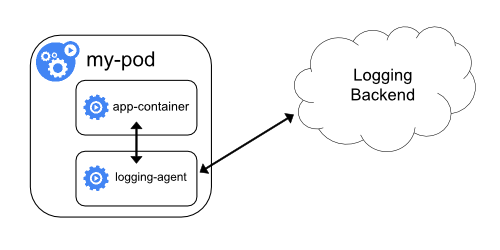
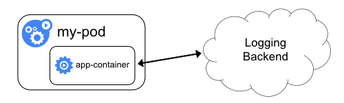
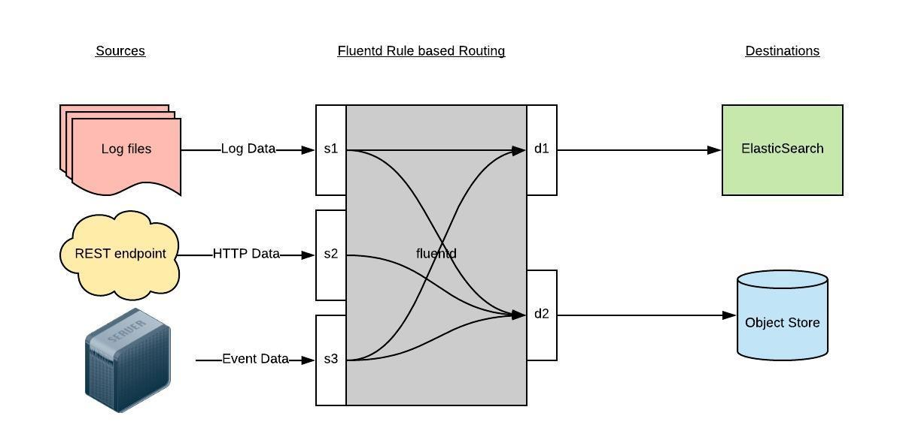

# 日志

前面我们学习了 Kubernetes 集群中监控系统的搭建，除了对集群的监控报警之外，还有一项运维工作是非常重要的，那就是日志的收集。

日志可以帮助我们了解集群内部的运行情况，日志对于我们调试问题和监视集群情况也是非常有用的。而且大部分的应用都会有日志记录，对于传统的应用大部分都会写入到本地的日志文件之中。对于容器化应用程序来说则更简单，只需要将日志信息写入到 stdout 和 stderr 即可，容器默认情况下就会把这些日志输出到宿主机上的一个 JSON 文件之中，同样我们也可以通过  `kubectl logs` 来查看到对应的日志信息。

但是，通常来说容器引擎或运行时提供的功能不足以记录完整的日志信息，比如，如果容器崩溃了、Pod 被驱逐了或者节点挂掉了，我们仍然也希望访问应用程序的日志。所以，日志应该独立于节点、Pod 或容器的生命周期，这种设计方式被称为 `cluster-level-logging`，即完全独立于 Kubernetes 系统，需要自己提供单独的日志后端存储、分析和查询工具。

## 1. 日志收集架构

官方文档地址：https://kubernetes.io/zh-cn/docs/concepts/cluster-administration/logging/

Kubernetes 没有为集群级日志记录提供原生的解决方案，但你可以考虑几种常见的方法。 以下是一些选项：

- 使用在每个节点上运行的节点级日志记录代理。
- 在应用程序的 Pod 中，包含专门记录日志的边车（Sidecar）容器。
- 将日志直接从应用程序中推送到日志记录后端。

### 1.1 使用节点级日志代理


你可以通过在每个节点上使用 **节点级的日志记录代理** 来实现集群级日志记录。 日志记录代理是一种用于暴露日志或将日志推送到后端的专用工具。 通常，日志记录代理程序是一个容器，它可以访问包含该节点上所有应用程序容器的日志文件的目录。

由于日志记录代理必须在每个节点上运行，推荐以 `DaemonSet` 的形式运行该代理。

节点级日志在每个节点上仅创建一个代理，不需要对节点上的应用做修改。

容器向标准输出和标准错误输出写出数据，但在格式上并不统一。 节点级代理收集这些日志并将其进行转发以完成汇总。

~~~yaml
apiVersion: v1
kind: Pod
metadata:
  name: counter
spec:
  containers:
  - name: count
    image: busybox:1.28
    args: [/bin/sh, -c,
            'i=0; while true; do echo "$i: $(date)"; i=$((i+1)); sleep 1; done']
~~~


### 1.2 使用边车容器运行日志代理

你可以通过以下方式之一使用边车（Sidecar）容器：

- 边车容器将应用程序日志传送到自己的标准输出。
- 边车容器运行一个日志代理，配置该日志代理以便从应用容器收集日志。

**传输数据流的边车容器**


利用边车容器，写入到自己的 `stdout` 和 `stderr` 传输流， 你就可以利用每个节点上的 kubelet 和日志代理来处理日志。 边车容器从文件、套接字或 journald 读取日志。 每个边车容器向自己的 `stdout` 和 `stderr` 流中输出日志。

这种方法允许你将日志流从应用程序的不同部分分离开，其中一些可能缺乏对写入 `stdout` 或 `stderr` 的支持。重定向日志背后的逻辑是最小的，因此它的开销不大。 另外，因为 `stdout` 和 `stderr` 由 kubelet 处理，所以你可以使用内置的工具 `kubectl logs`。

案例：

~~~yaml
apiVersion: v1
kind: Pod
metadata:
  name: counter
spec:
  containers:
  - name: count
    image: busybox:1.28
    args:
    - /bin/sh
    - -c
    - >
      i=0;
      while true;
      do
        echo "$i: $(date)" >> /var/log/1.log;
        echo "$(date) INFO $i" >> /var/log/2.log;
        i=$((i+1));
        sleep 1;
      done      
    volumeMounts:
    - name: varlog
      mountPath: /var/log
  volumes:
  - name: varlog
    emptyDir: {}
~~~

上面的案例，将日志输入到两个文件，这样日志代理agent就无法读取到日志，可以通过sidecar容器进行转换。

~~~yaml
apiVersion: v1
kind: Pod
metadata:
  name: counter
spec:
  containers:
  - name: count
    image: busybox:1.28
    args:
    - /bin/sh
    - -c
    - >
      i=0;
      while true;
      do
        echo "$i: $(date)" >> /var/log/1.log;
        echo "$(date) INFO $i" >> /var/log/2.log;
        i=$((i+1));
        sleep 1;
      done      
    volumeMounts:
    - name: varlog
      mountPath: /var/log
  - name: count-log-1
    image: busybox:1.28
    args: [/bin/sh, -c, 'tail -n+1 -F /var/log/1.log']
    volumeMounts:
    - name: varlog
      mountPath: /var/log
  - name: count-log-2
    image: busybox:1.28
    args: [/bin/sh, -c, 'tail -n+1 -F /var/log/2.log']
    volumeMounts:
    - name: varlog
      mountPath: /var/log
  volumes:
  - name: varlog
    emptyDir: {}
~~~

这样就将日志转为了stdout，agent就能读取到了。

**具有日志代理功能的边车容器**




如果节点级日志记录代理程序对于你的场景来说不够灵活， 你可以创建一个带有单独日志记录代理的边车容器，将代理程序专门配置为与你的应用程序一起运行。

> 在边车容器中使用日志代理会带来严重的资源损耗。 此外，你不能使用 `kubectl logs` 访问日志，因为日志并没有被 kubelet 管理。

比如：

包含fluentd（通用日志采集和分发系统）配置的一个configMap

~~~yaml
apiVersion: v1
kind: ConfigMap
metadata:
  name: fluentd-config
data:
  fluentd.conf: |
    <source>
      type tail
      format none
      path /var/log/1.log
      pos_file /var/log/1.log.pos
      tag count.format1
    </source>

    <source>
      type tail
      format none
      path /var/log/2.log
      pos_file /var/log/2.log.pos
      tag count.format2
    </source>

    <match **>
      type google_cloud
    </match>    
~~~

一个运行 fluentd 边车容器的 Pod。 该 Pod 挂载一个卷，flutend 可以从这个卷上拣选其配置数据。

~~~yaml
apiVersion: v1
kind: Pod
metadata:
  name: counter
spec:
  containers:
  - name: count
    image: busybox:1.28
    args:
    - /bin/sh
    - -c
    - >
      i=0;
      while true;
      do
        echo "$i: $(date)" >> /var/log/1.log;
        echo "$(date) INFO $i" >> /var/log/2.log;
        i=$((i+1));
        sleep 1;
      done      
    volumeMounts:
    - name: varlog
      mountPath: /var/log
  - name: count-agent
    image: registry.k8s.io/fluentd-gcp:1.30
    env:
    - name: FLUENTD_ARGS
      value: -c /etc/fluentd-config/fluentd.conf
    volumeMounts:
    - name: varlog
      mountPath: /var/log
    - name: config-volume
      mountPath: /etc/fluentd-config
  volumes:
  - name: varlog
    emptyDir: {}
  - name: config-volume
    configMap:
      name: fluentd-config
~~~

### 1.3 从应用中直接暴露日志目录



从各个应用中直接暴露和推送日志数据的集群日志机制已超出 Kubernetes 的范围。

## 2. EFK

Kubernetes 中比较流行的日志收集解决方案是 Elasticsearch、Fluentd 和 Kibana（EFK）技术栈，也是官方现在比较推荐的一种方案。

`Elasticsearch` 是一个实时的、分布式的可扩展的搜索引擎，允许进行全文、结构化搜索，它通常用于索引和搜索大量日志数据，也可用于搜索许多不同类型的文档。

Elasticsearch 通常与 `Kibana` 一起部署，Kibana 是 Elasticsearch 的一个功能强大的数据可视化 Dashboard，Kibana 允许你通过 web 界面来浏览 Elasticsearch 日志数据。

`Fluentd`是一个流行的开源数据收集器，我们将在 Kubernetes 集群节点上安装 Fluentd，通过获取容器日志文件、过滤和转换日志数据，然后将数据传递到 Elasticsearch 集群，在该集群中对其进行索引和存储。

我们先来配置启动一个可扩展的 Elasticsearch 集群，然后在 Kubernetes 集群中创建一个 Kibana 应用，最后通过 DaemonSet 来运行 Fluentd，以便它在每个 Kubernetes 工作节点上都可以运行一个 Pod。

### 2.1 创建 Elasticsearch 集群

在创建 Elasticsearch 集群之前，我们先创建一个命名空间，我们将在其中安装所有日志相关的资源对象。

新建一个 kube-logging.yaml 文件：

```yaml
apiVersion: v1
kind: Namespace
metadata:
  name: logging
```

然后通过 kubectl 创建该资源清单，创建一个名为 logging 的 namespace：

```shell
[root@master log]# kubectl create -f kube-logging.yaml
namespace/logging created
[root@master log]# kubectl get ns
NAME           STATUS    AGE
logging            Active   4s
```

现在创建了一个命名空间来存放我们的日志相关资源，接下来可以部署 EFK 相关组件，首先开始部署一个3节点的 Elasticsearch 集群。

这里我们使用3个 Elasticsearch Pod 来避免高可用下多节点集群中出现的“脑裂”问题，当一个或多个节点无法与其他节点通信时会产生“脑裂”，可能会出现几个主节点。

> 了解更多 Elasticsearch 集群脑裂问题，可以查看文档https://www.elastic.co/guide/en/elasticsearch/reference/current/modules-node.html#split-brain

一个关键点是您应该设置参数`discover.zen.minimum_master_nodes=N/2+1`，其中`N`是 Elasticsearch 集群中符合主节点的节点数，比如我们这里3个节点，意味着`discover.zen.minimum_master_nodes`应该设置为2。这样，如果一个节点暂时与集群断开连接，则另外两个节点可以选择一个新的主节点，并且集群可以在最后一个节点尝试重新加入时继续运行，在扩展 Elasticsearch 集群时，一定要记住这个参数。

首先创建一个名为 elasticsearch 的Headless Service，新建文件 elasticsearch-svc.yaml，文件内容如下：

```yaml
kind: Service
apiVersion: v1
metadata:
  name: elasticsearch
  namespace: logging
  labels:
    app: elasticsearch
spec:
  selector:
    app: elasticsearch
  clusterIP: None
  ports:
    - port: 9200
      name: rest
    - port: 9300
      name: inter-node
```

定义了一个名为 elasticsearch 的 Service，指定标签 `app=elasticsearch`，分别定义端口9200、9300，分别用于与 REST API 交互，以及用于节点间通信。

使用 kubectl 直接创建上面的服务资源对象：

```shell
[root@master log]# kubectl create -f elasticsearch-svc.yaml
service/elasticsearch created
[root@master log]# kubectl get services --namespace=logging
NAME            TYPE        CLUSTER-IP   EXTERNAL-IP   PORT(S)             AGE
elasticsearch   ClusterIP   None         <none>        9200/TCP,9300/TCP   4s
```


现在我们已经为 Pod 设置了Headless Service和一个稳定的域名`.elasticsearch.logging.svc.cluster.local`，接下来我们通过 StatefulSet 来创建具体的 Elasticsearch 的 Pod 应用。

Kubernetes StatefulSet 允许我们为 Pod 分配一个稳定的标识和持久化存储，Elasticsearch 需要稳定的存储来保证 Pod 在重新调度或者重启后的数据依然不变，所以需要使用 StatefulSet 来管理 Pod。

> 要了解更多关于 StaefulSet 的信息，可以查看官网关于 StatefulSet 的相关文档：https://kubernetes.io/docs/concepts/workloads/controllers/statefulset/。

新建名为 elasticsearch-statefulset.yaml 的资源清单文件，首先粘贴下面内容：

```yaml
apiVersion: apps/v1
kind: StatefulSet
metadata:
  name: es
  namespace: logging
spec:
  serviceName: elasticsearch
  replicas: 3
  selector:
    matchLabels:
      app: elasticsearch
  template:
    metadata:
      labels:
        app: elasticsearch
```


该内容中，我们定义了一个名为 es 的 StatefulSet 对象，然后定义`serviceName=elasticsearch`和前面创建的 Service 相关联，这可以确保使用以下 DNS 地址访问 StatefulSet 中的每一个 Pod：`es-[0,1,2].elasticsearch.logging.svc.cluster.local`，其中[0,1,2]对应于已分配的 Pod 序号。

然后指定3个副本，将 matchLabels 设置为`app=elasticsearch`，所以 Pod 的模板部分`.spec.template.metadata.lables`也必须包含`app=elasticsearch`标签。

然后定义 Pod 模板部分内容：

```yaml
...
  spec:
    containers:
    - name: elasticsearch
      image: docker.elastic.co/elasticsearch/elasticsearch:7.6.2
      resources:
        limits:
          cpu: 1000m
        requests:
          cpu: 100m
      ports:
      - containerPort: 9200
        name: rest
        protocol: TCP
      - containerPort: 9300
        name: inter-node
        protocol: TCP
      volumeMounts:
      - name: data
        mountPath: /usr/share/elasticsearch/data
      env:
        - name: cluster.name
          value: k8s-logs
        - name: node.name
          valueFrom:
            fieldRef:
              fieldPath: metadata.name
        - name: cluster.initial_master_nodes
          value: "es-0,es-1,es-2"
        - name: discovery.zen.minimum_master_nodes
          value: "2"
        - name: discovery.seed_hosts
          value: "elasticsearch"
        - name: ES_JAVA_OPTS
          value: "-Xms512m -Xmx512m"
        - name: network.host
          value: "0.0.0.0"
```

该部分是定义 StatefulSet 中的 Pod，暴露了9200和9300两个端口，注意名称要和上面定义的 Service 保持一致。然后通过 volumeMount 声明了数据持久化目录，下面我们再来定义 VolumeClaims。最后就是我们在容器中设置的一些环境变量了：

- cluster.name：Elasticsearch 集群的名称，我们这里命名成 k8s-logs。
- node.name：节点的名称，通过 `metadata.name` 来获取。这将解析为 es-[0,1,2]，取决于节点的指定顺序。
- discovery.seed_hosts：此字段用于设置在 Elasticsearch 集群中节点相互连接的发现方法。由于我们之前配置的无头服务，我们的 Pod 具有唯一的 DNS 域`es-[0,1,2].elasticsearch.logging.svc.cluster.local`，因此我们相应地设置此变量。要了解有关 Elasticsearch 发现的更多信息，请参阅 Elasticsearch 官方文档：https://www.elastic.co/guide/en/elasticsearch/reference/current/modules-discovery.html。
- discovery.zen.minimum_master_nodes：我们将其设置为`(N/2) + 1`，`N`是我们的群集中符合主节点的节点的数量。我们有3个 Elasticsearch 节点，因此我们将此值设置为2（向下舍入到最接近的整数）。要了解有关此参数的更多信息，请参阅官方 Elasticsearch 文档：https://www.elastic.co/guide/en/elasticsearch/reference/current/modules-node.html#split-brain。
- ES_JAVA_OPTS：这里我们设置为`-Xms512m -Xmx512m`，告诉`JVM`使用`512 MB`的最小和最大堆。您应该根据群集的资源可用性和需求调整这些参数。要了解更多信息，请参阅设置堆大小的相关文档：https://www.elastic.co/guide/en/elasticsearch/reference/current/heap-size.html。

接下来添加关于 initContainer 的内容：

```yaml
...
    initContainers:
    - name: increase-vm-max-map
      image: busybox
      command: ["sysctl", "-w", "vm.max_map_count=262144"]
      securityContext:
        privileged: true
    - name: increase-fd-ulimit
      image: busybox
      command: ["sh", "-c", "ulimit -n 65536"]
      securityContext:
        privileged: true
```


这里我们定义了几个在主应用程序之前运行的 Init 容器，这些初始容器按照定义的顺序依次执行，执行完成后才会启动主应用容器。

第一个名为 increase-vm-max-map 的容器用来增加操作系统对`mmap`计数的限制，默认情况下该值可能太低，导致内存不足的错误，要了解更多关于该设置的信息，可以查看 Elasticsearch 官方文档说明：https://www.elastic.co/guide/en/elasticsearch/reference/current/vm-max-map-count.html。

最后一个初始化容器是用来执行`ulimit`命令增加打开文件描述符的最大数量的。

> 此外 [Elastisearch Notes for Production Use](https://www.elastic.co/guide/en/elasticsearch/reference/current/docker.html#_notes_for_production_use_and_defaults) 文档还提到了由于性能原因最好禁用 swap，当然对于 Kubernetes 集群而言，最好也是禁用 swap 分区的。

现在我们已经定义了主应用容器和它之前运行的 Init Containers 来调整一些必要的系统参数，接下来我们可以添加数据目录的持久化相关的配置，在 StatefulSet 中，使用 volumeClaimTemplates 来定义 volume 模板即可：

```yaml
...
  volumeClaimTemplates:
  - metadata:
      name: data
      labels:
        app: elasticsearch
    spec:
      accessModes: [ "ReadWriteOnce" ]
      storageClassName: log-storage
      resources:
        requests:
          storage: 5Gi
```

log-storage.yaml

~~~yaml
apiVersion: storage.k8s.io/v1 ## 创建了一个存储类
kind: StorageClass
metadata:
  name: log-storage
  annotations:
    storageclass.kubernetes.io/is-default-class: "true"
  namespace: logging
provisioner: log-data  #Deployment中spec.template.spec.containers.env.name.PROVISIONER_NAME 保持一致
parameters:
  archiveOnDelete: "true"  ## 删除pv的时候，pv的内容是否要备份
---
apiVersion: apps/v1
kind: Deployment
metadata:
  name: log-nfs-client-provisioner
  labels:
    app: log-nfs-client-provisioner
  namespace: logging
spec:
  replicas: 1
  strategy:
    type: Recreate
  selector:
    matchLabels:
      app: log-nfs-client-provisioner
  template:
    metadata:
      labels:
        app: log-nfs-client-provisioner
    spec:
      serviceAccountName: log-nfs-client-provisioner
      containers:
        - name: log-nfs-client-provisioner
          image: registry.cn-hangzhou.aliyuncs.com/lfy_k8s_images/nfs-subdir-external-provisioner:v4.0.2
          volumeMounts:
            - name: nfs-client-root
              mountPath: /persistentvolumes
          env:
            - name: PROVISIONER_NAME
              value: log-data
            - name: NFS_SERVER
              value: 192.168.200.101 ## 指定自己nfs服务器地址
            - name: NFS_PATH  
              value: /data/log  ## nfs服务器共享的目录
      volumes:
        - name: nfs-client-root
          nfs:
            server: 192.168.200.101
            path: /data/log
---
apiVersion: v1
kind: ServiceAccount
metadata:
  name: log-nfs-client-provisioner
  namespace: logging
---
kind: ClusterRole
apiVersion: rbac.authorization.k8s.io/v1
metadata:
  name: log-nfs-client-provisioner-runner
rules:
  - apiGroups: [""]
    resources: ["nodes"]
    verbs: ["get", "list", "watch"]
  - apiGroups: [""]
    resources: ["persistentvolumes"]
    verbs: ["get", "list", "watch", "create", "delete"]
  - apiGroups: [""]
    resources: ["persistentvolumeclaims"]
    verbs: ["get", "list", "watch", "update"]
  - apiGroups: ["storage.k8s.io"]
    resources: ["storageclasses"]
    verbs: ["get", "list", "watch"]
  - apiGroups: [""]
    resources: ["events"]
    verbs: ["create", "update", "patch"]
---
kind: ClusterRoleBinding
apiVersion: rbac.authorization.k8s.io/v1
metadata:
  name: log-run-nfs-client-provisioner
subjects:
  - kind: ServiceAccount
    name: log-nfs-client-provisioner
    namespace: logging
roleRef:
  kind: ClusterRole
  name: log-nfs-client-provisioner-runner
  apiGroup: rbac.authorization.k8s.io
---
kind: Role
apiVersion: rbac.authorization.k8s.io/v1
metadata:
  name: log-leader-locking-nfs-client-provisioner
  namespace: logging
rules:
  - apiGroups: [""]
    resources: ["endpoints"]
    verbs: ["get", "list", "watch", "create", "update", "patch"]
---
kind: RoleBinding
apiVersion: rbac.authorization.k8s.io/v1
metadata:
  name: log-leader-locking-nfs-client-provisioner
  namespace: logging
subjects:
  - kind: ServiceAccount
    name: log-nfs-client-provisioner
    namespace:  logging
roleRef:
  kind: Role
  name: log-leader-locking-nfs-client-provisioner
  apiGroup: rbac.authorization.k8s.io
~~~


我们这里使用 volumeClaimTemplates 来定义持久化模板，Kubernetes 会使用它为 Pod 创建 PersistentVolume，设置访问模式为`ReadWriteOnce`，这意味着它只能被 mount 到单个节点上进行读写，然后最重要的是使用了一个 StorageClass 对象。最后，我们指定了每个 PersistentVolume 的大小为 5GB，我们可以根据自己的实际需要进行调整该值。

完整的 Elasticsearch StatefulSet 资源清单文件内容如下：

```yaml
apiVersion: apps/v1
kind: StatefulSet
metadata:
  name: es
  namespace: logging
spec:
  serviceName: elasticsearch
  replicas: 3
  selector:
    matchLabels:
      app: elasticsearch
  template:
    metadata:
      labels: 
        app: elasticsearch
    spec:
      nodeSelector:
        es: log
      initContainers:
      - name: increase-vm-max-map
        image: busybox
        command: ["sysctl", "-w", "vm.max_map_count=262144"]
        securityContext:
          privileged: true
      - name: increase-fd-ulimit
        image: busybox
        command: ["sh", "-c", "ulimit -n 65536"]
        securityContext:
          privileged: true
      containers:
      - name: elasticsearch
        image: docker.elastic.co/elasticsearch/elasticsearch:7.6.2
        ports:
        - name: rest
          containerPort: 9200
        - name: inter
          containerPort: 9300
        resources:
          limits:
            cpu: 1000m
          requests:
            cpu: 1000m
        volumeMounts:
        - name: data
          mountPath: /usr/share/elasticsearch/data
        env:
        - name: cluster.name
          value: k8s-logs
        - name: node.name
          valueFrom:
            fieldRef:
              fieldPath: metadata.name
        - name: cluster.initial_master_nodes
          value: "es-0,es-1,es-2"
        - name: discovery.zen.minimum_master_nodes
          value: "2"
        - name: discovery.seed_hosts
          value: "elasticsearch"
        - name: ES_JAVA_OPTS
          value: "-Xms512m -Xmx512m"
        - name: network.host
          value: "0.0.0.0"
  volumeClaimTemplates:
  - metadata:
      name: data
      labels:
        app: elasticsearch
    spec:
      accessModes: [ "ReadWriteOnce" ]
      storageClassName: log-storage
      resources:
        requests:
          storage: 5Gi    
```


现在直接使用 kubectl 工具部署即可：

```shell
[root@master log]# kubectl apply -f log-storage.yaml 
storageclass.storage.k8s.io/log-storage created
deployment.apps/log-nfs-client-provisioner created
serviceaccount/nfs-client-provisioner created
clusterrole.rbac.authorization.k8s.io/nfs-client-provisioner-runner created
clusterrolebinding.rbac.authorization.k8s.io/run-nfs-client-provisioner created
role.rbac.authorization.k8s.io/leader-locking-nfs-client-provisioner created
rolebinding.rbac.authorization.k8s.io/leader-locking-nfs-client-provisioner created
[root@master log]# kubectl apply -f elasticsearch-statefulset.yaml 
statefulset.apps/es created
# 不要忘记给节点打标签
[root@master log]# kubectl label nodes node1 es=log 
node/node1 labeled
[root@master log]# kubectl label nodes node2 es=log
node/node2 labeled
[root@master log]# kubectl label nodes master es=log
node/master labeled
```

添加成功后，可以看到 logging 命名空间下面的所有的资源对象：

```shell
[root@master log]# kubectl get sts -n logging
NAME   READY   AGE
es     3/3     9s
[root@master log]# kubectl get pods -n logging
NAME                                          READY   STATUS    RESTARTS   AGE
es-0                                          1/1     Running   0          5m31s
es-1                                          1/1     Running   0          84s
es-2                                          1/1     Running   0          18s
[root@master log]# kubectl get svc -n logging
NAME            TYPE        CLUSTER-IP   EXTERNAL-IP   PORT(S)             AGE
elasticsearch   ClusterIP   None         <none>        9200/TCP,9300/TCP   23m
```


Pods 部署完成后，我们可以通过请求一个 REST API 来检查 Elasticsearch 集群是否正常运行。使用下面的命令将本地端口9200 转发到 Elasticsearch 节点（如es-0）对应的端口：

```shell
[root@master log]# kubectl port-forward es-0 9200:9200 --namespace=logging
Forwarding from 127.0.0.1:9200 -> 9200
Forwarding from [::1]:9200 -> 9200
```


然后，在另外的终端窗口中，执行如下请求：

```shell
[root@master ~]# curl http://localhost:9200/_cluster/state?pretty
```

能访问通，就是没问题。

~~~shell
[root@master ~]# curl http://localhost:9200/
{
  "name" : "es-0",
  "cluster_name" : "k8s-logs",
  "cluster_uuid" : "rJxg9-bIS4SP5YAcBOl4tw",
  "version" : {
    "number" : "7.6.2",
    "build_flavor" : "default",
    "build_type" : "docker",
    "build_hash" : "ef48eb35cf30adf4db14086e8aabd07ef6fb113f",
    "build_date" : "2020-03-26T06:34:37.794943Z",
    "build_snapshot" : false,
    "lucene_version" : "8.4.0",
    "minimum_wire_compatibility_version" : "6.8.0",
    "minimum_index_compatibility_version" : "6.0.0-beta1"
  },
  "tagline" : "You Know, for Search"
}
~~~


### 2.2 创建 Kibana 服务

Elasticsearch 集群启动成功了，接下来我们可以来部署 Kibana 服务，新建一个名为 kibana.yaml 的文件，对应的文件内容如下：

```yaml
apiVersion: v1
kind: Service
metadata:
  name: kibana
  namespace: logging
  labels:
    app: kibana
spec:
  ports:
  - port: 5601
  type: NodePort
  selector:
    app: kibana

---
apiVersion: apps/v1
kind: Deployment
metadata:
  name: kibana
  namespace: logging
  labels:
    app: kibana
spec:
  selector:
    matchLabels:
      app: kibana
  template:
    metadata:
      labels:
        app: kibana
    spec:
      nodeSelector:
        es: log
      containers:
      - name: kibana
        image: docker.elastic.co/kibana/kibana:7.6.2
        resources:
          limits:
            cpu: 1000m
          requests:
            cpu: 1000m
        env:
        - name: ELASTICSEARCH_HOSTS
          value: http://elasticsearch:9200
        ports:
        - containerPort: 5601
```


上面我们定义了两个资源对象，一个 Service 和 Deployment，为了测试方便，我们将 Service 设置为了 NodePort 类型，Kibana Pod 中配置都比较简单，唯一需要注意的是我们使用 `ELASTICSEARCH_HOSTS` 这个环境变量来设置Elasticsearch 集群的端点和端口，直接使用 Kubernetes DNS 即可，此端点对应服务名称为 elasticsearch，由于是一个 headless service，所以该域将解析为3个 Elasticsearch Pod 的 IP 地址列表。

配置完成后，直接使用 kubectl 工具创建：

```shell
[root@master log]# kubectl create -f kibana.yaml
service/kibana created
deployment.apps/kibana created
```

创建完成后，可以查看 Kibana Pod 的运行状态：

```shell
[root@master log]# kubectl get pods --namespace=logging
NAME                                          READY   STATUS            RESTARTS   AGE
es-0                                          1/1     Running           0          147m
es-1                                          1/1     Running           0          143m
es-2                                          1/1     Running   0          141m
kibana-58655cb469-2mltn                       1/1     Running           0          2m51s
[root@master log]# kubectl get svc -n logging
NAME            TYPE        CLUSTER-IP       EXTERNAL-IP   PORT(S)             AGE
elasticsearch   ClusterIP   None             <none>        9200/TCP,9300/TCP   165m
kibana          NodePort    10.105.223.115   <none>        5601:31198/TCP      3m6s
```


如果 Pod 已经是 Running 状态了，证明应用已经部署成功了，然后可以通过 NodePort 来访问 Kibana 这个服务，在浏览器中打开`http://<任意节点IP>:31198`即可，如果看到如下欢迎界面证明 Kibana 已经成功部署到了 Kubernetes集群之中。


### 2.3 部署 Fluentd

`Fluentd` 是一个高效的日志聚合器，是用 Ruby 编写的，并且可以很好地扩展。对于大部分企业来说，Fluentd 足够高效并且消耗的资源相对较少，另外一个工具`Fluent-bit`更轻量级，占用资源更少，但是插件相对 Fluentd 来说不够丰富，所以整体来说，Fluentd 更加成熟，使用更加广泛，所以我们这里也同样使用 Fluentd 来作为日志收集工具。

#### 2.3.1 工作原理

Fluentd 通过一组给定的数据源抓取日志数据，处理后（转换成结构化的数据格式）将它们转发给其他服务，比如 Elasticsearch、对象存储等等。Fluentd 支持超过300个日志存储和分析服务，所以在这方面是非常灵活的。主要运行步骤如下：

- 首先 Fluentd 从多个日志源获取数据
- 结构化并且标记这些数据
- 然后根据匹配的标签将数据发送到多个目标服务去



#### 2.3.2 配置

一般来说我们是通过一个配置文件来告诉 Fluentd 如何采集、处理数据的，下面简单和大家介绍下 Fluentd 的配置方法。

##### 2.3.2.1 日志源配置

比如我们这里为了收集 Kubernetes 节点上的所有容器日志，就需要做如下的日志源配置：

```ruby
<source>
  @id fluentd-containers.log
  @type tail                             # Fluentd 内置的输入方式，其原理是不停地从源文件中获取新的日志。
  path /var/log/containers/*.log         # 挂载的服务器容器日志地址
  pos_file /var/log/es-containers.log.pos
  tag raw.kubernetes.*                   # 设置日志标签
  read_from_head true
  <parse>                                # 多行格式化成JSON
    @type multi_format                   # 使用 multi-format-parser 解析器插件
    <pattern>
      format json                        # JSON 解析器
      time_key time                      # 指定事件时间的时间字段
      time_format %Y-%m-%dT%H:%M:%S.%NZ  # 时间格式
    </pattern>
    <pattern>
      format /^(?<time>.+) (?<stream>stdout|stderr) [^ ]* (?<log>.*)$/
      time_format %Y-%m-%dT%H:%M:%S.%N%:z
    </pattern>
  </parse>
</source>
```


上面配置部分参数说明如下：

- id：表示引用该日志源的唯一标识符，该标识可用于进一步过滤和路由结构化日志数据
- type：Fluentd 内置的指令，`tail` 表示 Fluentd 从上次读取的位置通过 tail 不断获取数据，另外一个是 `http` 表示通过一个 GET 请求来收集数据。
- path：`tail` 类型下的特定参数，告诉 Fluentd 采集 `/var/log/containers` 目录下的所有日志，这是 Kubernetes 节点上用来存储运行容器 stdout 输出日志数据的目录。
- pos_file：检查点，如果 Fluentd 程序重新启动了，它将使用此文件中的位置来恢复日志数据收集。
- tag：用来将日志源与目标或者过滤器匹配的自定义字符串，Fluentd 匹配源/目标标签来路由日志数据。

##### 2.3.2.2 路由配置

上面是日志源的配置，接下来看看如何将日志数据发送到 Elasticsearch：

```ruby
<match **>

@id elasticsearch

@type elasticsearch

@log_level info

include_tag_key true

type_name fluentd

host "#{ENV['OUTPUT_HOST']}"

port "#{ENV['OUTPUT_PORT']}"

logstash_format true

<buffer>

@type file

path /var/log/fluentd-buffers/kubernetes.system.buffer

flush_mode interval

retry_type exponential_backoff

flush_thread_count 2

flush_interval 5s

retry_forever

retry_max_interval 30

chunk_limit_size "#{ENV['OUTPUT_BUFFER_CHUNK_LIMIT']}"

queue_limit_length "#{ENV['OUTPUT_BUFFER_QUEUE_LIMIT']}"

overflow_action block

</buffer>
```


- match：标识一个目标标签，后面是一个匹配日志源的正则表达式，我们这里想要捕获所有的日志并将它们发送给 Elasticsearch，所以需要配置成`**`。
- id：目标的一个唯一标识符。
- type：支持的输出插件标识符，我们这里要输出到 Elasticsearch，所以配置成 elasticsearch，这是 Fluentd 的一个内置插件。
- log_level：指定要捕获的日志级别，我们这里配置成 `info`，表示任何该级别或者该级别以上（INFO、WARNING、ERROR）的日志都将被路由到 Elsasticsearch。
- host/port：定义 Elasticsearch 的地址，也可以配置认证信息，我们的 Elasticsearch 不需要认证，所以这里直接指定 host 和 port 即可。
- logstash_format：Elasticsearch 服务对日志数据构建反向索引进行搜索，将 logstash_format 设置为 `true`，Fluentd 将会以 logstash 格式来转发结构化的日志数据。
- Buffer： Fluentd 允许在目标不可用时进行缓存，比如，如果网络出现故障或者 Elasticsearch 不可用的时候。缓冲区配置也有助于降低磁盘的 IO。

##### 2.3.2.3 过滤

由于 Kubernetes 集群中应用太多，也还有很多历史数据，所以我们可以只将某些应用的日志进行收集，比如我们只采集具有 `logging=true` 这个 Label 标签的 Pod 日志，这个时候就需要使用 filter，如下所示：

```ruby
# 删除无用的属性
<filter kubernetes.**>
  @type record_transformer
  remove_keys $.docker.container_id,$.kubernetes.container_image_id,$.kubernetes.pod_id,$.kubernetes.namespace_id,$.kubernetes.master_url,$.kubernetes.labels.pod-template-hash
</filter>
# 只保留具有logging=true标签的Pod日志
<filter kubernetes.**>
  @id filter_log
  @type grep
  <regexp>
    key $.kubernetes.labels.logging
    pattern ^true$
  </regexp>
</filter>
```

### 2.4 安装

要收集 Kubernetes 集群的日志，直接用 DasemonSet 控制器来部署 Fluentd 应用，这样，它就可以从 Kubernetes 节点上采集日志，确保在集群中的每个节点上始终运行一个 Fluentd 容器。当然可以直接使用 Helm 来进行一键安装，为了能够了解更多实现细节，我们这里还是采用手动方法来进行安装。

首先，我们通过 ConfigMap 对象来指定 Fluentd 配置文件，新建 fluentd-configmap.yaml 文件，文件内容如下：

```yaml
kind: ConfigMap
apiVersion: v1
metadata:
  name: fluentd-config
  namespace: logging
data:
  system.conf: |-
    <system>
      root_dir /tmp/fluentd-buffers/
    </system>
  containers.input.conf: |-
    <source>
      @id fluentd-containers.log
      @type tail                              # Fluentd 内置的输入方式，其原理是不停地从源文件中获取新的日志。
      path /var/log/containers/*.log          # 挂载的服务器容器日志地址
      pos_file /var/log/es-containers.log.pos
      tag raw.kubernetes.*                    # 设置日志标签
      read_from_head true
      <parse>                                 # 多行格式化成JSON
        @type multi_format                    # 使用 multi-format-parser 解析器插件
        <pattern>
          format json                         # JSON解析器
          time_key time                       # 指定事件时间的时间字段
          time_format %Y-%m-%dT%H:%M:%S.%NZ   # 时间格式
        </pattern>
        <pattern>
          format /^(?<time>.+) (?<stream>stdout|stderr) [^ ]* (?<log>.*)$/
          time_format %Y-%m-%dT%H:%M:%S.%N%:z
        </pattern>
      </parse>
    </source> # 在日志输出中检测异常，并将其作为一条日志转发  https://github.com/GoogleCloudPlatform/fluent-plugin-detect-exceptions
    <match raw.kubernetes.**>           # 匹配tag为raw.kubernetes.**日志信息
      @id raw.kubernetes
      @type detect_exceptions           # 使用detect-exceptions插件处理异常栈信息
      remove_tag_prefix raw             # 移除 raw 前缀
      message log                       
      stream stream                     
      multiline_flush_interval 5
      max_bytes 500000
      max_lines 1000
    </match>

    <filter **>  # 拼接日志
      @id filter_concat
      @type concat                # Fluentd Filter 插件，用于连接多个事件中分隔的多行日志。
      key message
      multiline_end_regexp /\n$/  # 以换行符“\n”拼接
      separator ""
    </filter> 

    <filter kubernetes.**> # 添加 Kubernetes metadata 数据
      @id filter_kubernetes_metadata
      @type kubernetes_metadata
    </filter>

    
    <filter kubernetes.**> # 修复 ES 中的 JSON 字段  插件地址：https://github.com/repeatedly/fluent-plugin-multi-format-parser
      @id filter_parser
      @type parser                # multi-format-parser多格式解析器插件
      key_name log                # 在要解析的记录中指定字段名称。
      reserve_data true           # 在解析结果中保留原始键值对。
      remove_key_name_field true  # key_name 解析成功后删除字段。
      <parse>
        @type multi_format
        <pattern>
          format json
        </pattern>
        <pattern>
          format none
        </pattern>
      </parse>
    </filter>

   
    <filter kubernetes.**>  # 删除一些多余的属性
      @type record_transformer
      remove_keys $.docker.container_id,$.kubernetes.container_image_id,$.kubernetes.pod_id,$.kubernetes.namespace_id,$.kubernetes.master_url,$.kubernetes.labels.pod-template-hash
    </filter>

    
    <filter kubernetes.**> # 只保留具有logging=true标签的Pod日志
      @id filter_log
      @type grep
      <regexp>
        key $.kubernetes.labels.logging
        pattern ^true$
      </regexp>
    </filter>

 
  forward.input.conf: |-  ###### 监听配置，一般用于日志聚合用 ######
   
    <source>  # 监听通过TCP发送的消息
      @id forward
      @type forward
    </source>

  output.conf: |-
    <match **>
      @id elasticsearch
      @type elasticsearch
      @log_level info
      include_tag_key true
      host elasticsearch
      port 9200
      logstash_format true
      logstash_prefix k8s  # 设置 index 前缀为 k8s
      request_timeout    30s
      <buffer>
        @type file
        path /var/log/fluentd-buffers/kubernetes.system.buffer
        flush_mode interval
        retry_type exponential_backoff
        flush_thread_count 2
        flush_interval 5s
        retry_forever
        retry_max_interval 30
        chunk_limit_size 2M
        queue_limit_length 8
        overflow_action block
      </buffer>
    </match>
```


上面配置文件中我们只配置了容器日志目录，收集到数据经过处理后发送到 `elasticsearch:9200` 服务。

然后新建一个 fluentd-daemonset.yaml 的文件，文件内容如下：

```yaml
apiVersion: v1
kind: ServiceAccount
metadata:
  name: fluentd-es
  namespace: logging
  labels:
    k8s-app: fluentd-es
    kubernetes.io/cluster-service: "true"
    addonmanager.kubernetes.io/mode: Reconcile
---
kind: ClusterRole
apiVersion: rbac.authorization.k8s.io/v1
metadata:
  name: fluentd-es
  labels:
    k8s-app: fluentd-es
    kubernetes.io/cluster-service: "true"
    addonmanager.kubernetes.io/mode: Reconcile
rules:
- apiGroups:
  - ""
  resources:
  - "namespaces"
  - "pods"
  verbs:
  - "get"
  - "watch"
  - "list"
---
kind: ClusterRoleBinding
apiVersion: rbac.authorization.k8s.io/v1
metadata:
  name: fluentd-es
  labels:
    k8s-app: fluentd-es
    kubernetes.io/cluster-service: "true"
    addonmanager.kubernetes.io/mode: Reconcile
subjects:
- kind: ServiceAccount
  name: fluentd-es
  namespace: logging
  apiGroup: ""
roleRef:
  kind: ClusterRole
  name: fluentd-es
  apiGroup: ""
---
apiVersion: apps/v1
kind: DaemonSet
metadata:
  name: fluentd-es
  namespace: logging
  labels:
    k8s-app: fluentd-es
    kubernetes.io/cluster-service: "true"
    addonmanager.kubernetes.io/mode: Reconcile
spec:
  selector:
    matchLabels:
      k8s-app: fluentd-es
  template:
    metadata:
      labels:
        k8s-app: fluentd-es
        kubernetes.io/cluster-service: "true"
      annotations:   # 此注释确保如果节点被驱逐，fluentd不会被驱逐，支持关键的基于 pod 注释的优先级方案。
        priorityClassName: ''
    spec:
      serviceAccountName: fluentd-es
      containers:
      - name: fluentd-es
        image: quay.io/fluentd_elasticsearch/fluentd:v3.0.1
        env:
        - name: FLUENTD_ARGS
          value: --no-supervisor -q
        resources:
          limits:
            memory: 500Mi
          requests:
            cpu: 100m
            memory: 200Mi
        volumeMounts:
        - name: varlog
          mountPath: /var/log
        - name: varlibcontainers
          mountPath: /var/lib/containerd
          readOnly: true
        - name: config-volume
          mountPath: /etc/fluent/config.d
      nodeSelector:
        beta.kubernetes.io/fluentd-ds-ready: "true"
      tolerations:
      - operator: Exists
      terminationGracePeriodSeconds: 30
      volumes:
      - name: varlog
        hostPath:
          path: /var/log
      - name: varlibcontainers
        hostPath:
          path: /var/lib/containerd
      - name: config-volume
        configMap:
          name: fluentd-config
```


我们将上面创建的 fluentd-config 这个 ConfigMap 对象通过 volumes 挂载到了 Fluentd 容器中，另外为了能够灵活控制哪些节点的日志可以被收集，所以我们这里还添加了一个 nodeSelector 属性：

```yaml
nodeSelector:
  beta.kubernetes.io/fluentd-ds-ready: "true"
```

意思就是要想采集节点的日志，那么我们就需要给节点打上上面的标签，比如我们这里只给节点1和节点2打上了该标签：

```shell
[root@master log]# kubectl label node node1 beta.kubernetes.io/fluentd-ds-ready=true
node/node1 labeled
[root@master log]# kubectl label node node2 beta.kubernetes.io/fluentd-ds-ready=true
node/node2 labeled
```


如果你需要在其他节点上采集日志，则需要给对应节点打上标签，使用如下命令：`kubectl label nodes node名 beta.kubernetes.io/fluentd-ds-ready=true`。

另外由于我们的集群使用的是 kubeadm 搭建的，默认情况下 master 节点有污点，所以如果要想也收集 master 节点的日志，则需要添加上容忍：

```yaml
tolerations:
- operator: Exists
```

分别创建上面的 ConfigMap 对象和 DaemonSet：

```shell
[root@master log]# kubectl create -f fluentd-configmap.yaml
configmap/fluentd-config created
[root@master log]# kubectl create -f fluentd-daemonset.yaml
serviceaccount/fluentd-es created
clusterrole.rbac.authorization.k8s.io/fluentd-es created
clusterrolebinding.rbac.authorization.k8s.io/fluentd-es created
daemonset.apps/fluentd-es created
```

创建完成后，查看对应的 Pods 列表，检查是否部署成功：

```shell
[root@master log]# kubectl get pod -n logging
NAME                                          READY   STATUS              RESTARTS       AGE
es-0                                          1/1     Running             0              3h39m
es-1                                          1/1     Running             0              3h35m
es-2                                          1/1     Running             0              3h34m
fluentd-es-2qgrn                              1/1     Running   0              2m
fluentd-es-wd9vq                              1/1     Running             0              119s
kibana-58655cb469-2mltn                       1/1     Running             0              74m
log-nfs-client-provisioner-765b6bc95c-7475g   1/1     Running             14 (82s ago)   3h42m
```


Fluentd 启动成功后，这个时候就可以发送日志到 ES 了，但是我们这里是过滤了只采集具有 `logging=true` 标签的 Pod 日志，所以现在还没有任何数据会被采集。

下面我们部署一个简单的测试应用， 新建 counter.yaml 文件，文件内容如下：

```yaml
apiVersion: v1
kind: Pod
metadata:
  name: counter
  labels:
    logging: "true"  # 一定要具有该标签才会被采集
spec:
  containers:
  - name: count
    image: busybox
    args: [/bin/sh, -c,
            'i=0; while true; do echo "$i: $(date)"; i=$((i+1)); sleep 1; done']
```


该 Pod 只是简单将日志信息打印到 `stdout`，所以正常来说 Fluentd 会收集到这个日志数据，在 Kibana 中也就可以找到对应的日志数据了，使用 kubectl 工具创建该 Pod：

```shell
[root@master log]# kubectl create -f counter.yaml
pod/counter created
[root@master log]# kubectl get pods
NAME                            READY   STATUS    RESTARTS      AGE
counter                         1/1     Running   0             4s
```


Pod 创建并运行后，回到 Kibana Dashboard 页面，点击左侧最下面的 `management` 图标，然后点击 Kibana 下面的 `Index Patterns` 开始导入索引数据：


在这里可以配置我们需要的 Elasticsearch 索引，前面 Fluentd 配置文件中我们采集的日志使用的是 logstash 格式，定义了一个 `k8s` 的前缀，所以这里只需要在文本框中输入`k8s-*`即可匹配到 Elasticsearch 集群中采集的 Kubernetes 集群日志数据，然后点击下一步，进入以下页面：


在该页面中配置使用哪个字段按时间过滤日志数据，在下拉列表中，选择`@timestamp`字段，然后点击`Create index pattern`，创建完成后，点击左侧导航菜单中的`Discover`，然后就可以看到一些直方图和最近采集到的日志数据了：


现在的数据就是上面 Counter 应用的日志，如果还有其他的应用，我们也可以筛选过滤：


我们也可以通过其他元数据来过滤日志数据，比如您可以单击任何日志条目以查看其他元数据，如容器名称，Kubernetes 节点，命名空间等。
