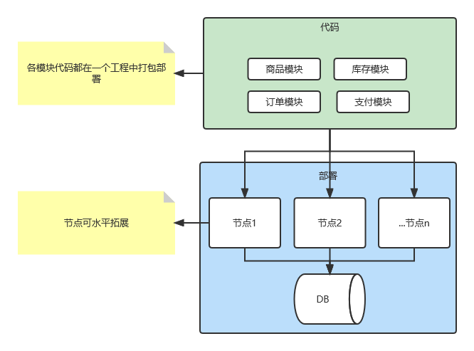
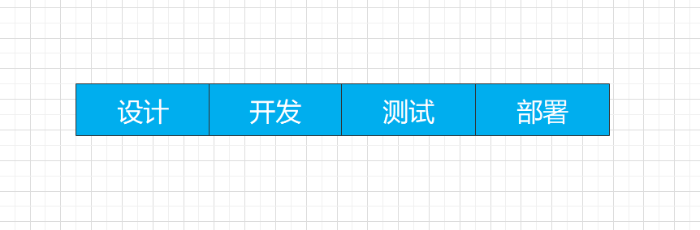
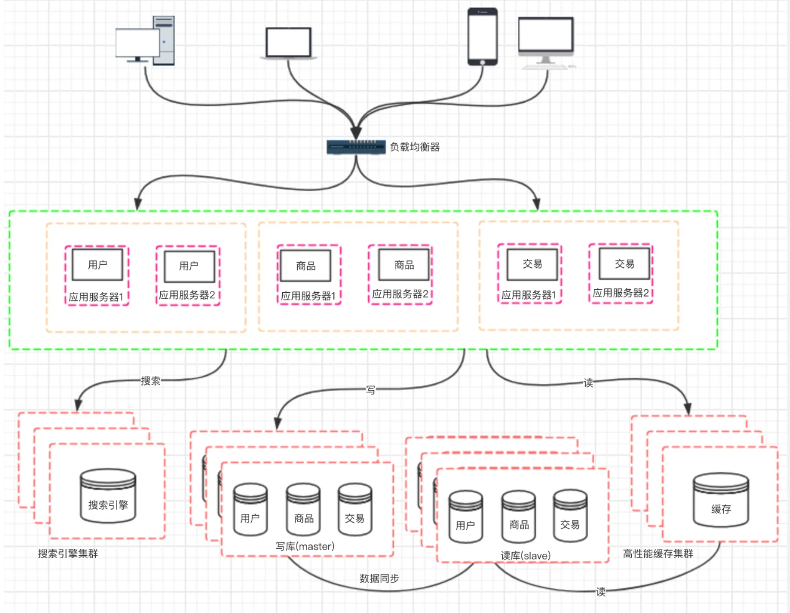
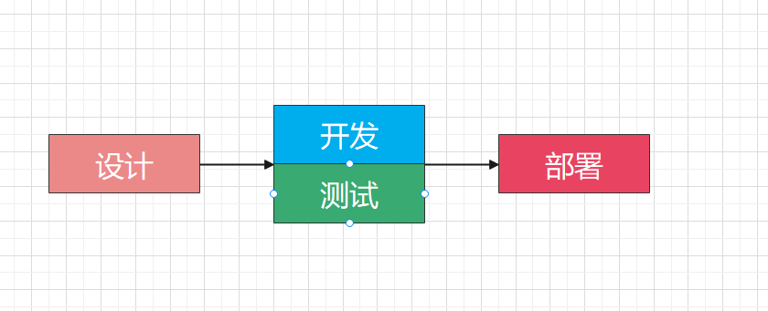
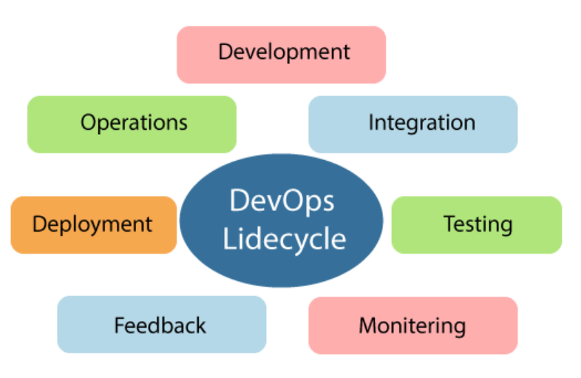
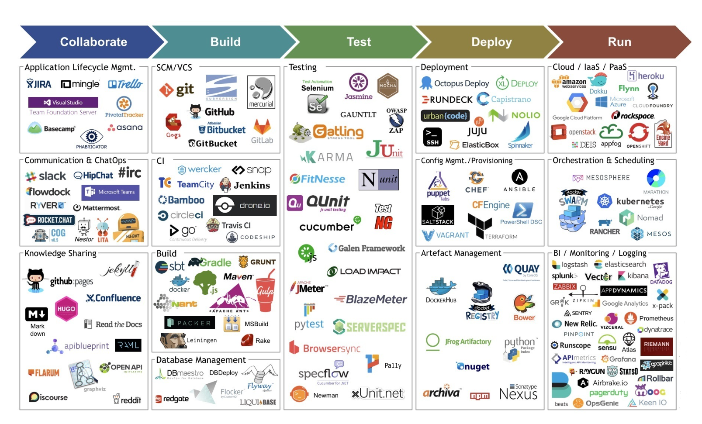

# DevOps

DevOps 中的 Dev 是 Devlopment(开发)，Ops 是 Operations(运维)。

DevOps 就是打通开发运维的壁垒，实现开发运维一体化。

## 1. 演进之路

DevOps是一个概念，比较抽象，要想理解DevOps，需要从开发和运维的演进讲起。

### 1.1 开发承担运维

在软件发展初期，各个公司的软件开发工作都是由第三方软件开发公司来完成，随着软件技术的普及，普通公司开始成立IT技术部门，来自行承担软件开发工作。

在这个阶段，只有Dev，即开发人员。

企业级开发涉及到的并不仅仅只有编写软件，还有基础设施的搭建，比如网络设备搭建维护，网络管理，服务器搭建维护，服务器管理，还有其他相关的设备管理等等。

这就诞生了一个新的职业，IT运维，IT 运维（ IT operation ）的职能是为内部和外部客户的应用部署提供平滑的基础设施和操作环境，包括网络基础设施、服务器和设备管理，计算机操作， ITIL 管理，以及作为组织的 IT 帮助中心。

IT部门的使命不仅仅只是开发，还需要维护计算机和网络设备，还要维护运行在这些设备上的软件系统。

这时候就产生了一个矛盾，即Dev为代表的开发和Ops为代表的运维，在软件交付的质量标准上要求不一致。

在单体架构阶段，一般公司只会配备开发人员和网络管理人员，由于架构简单，部署发布流程都由开发人员完成，不需要专业运维参与，开发承担了运维的活。

整个开发流程比较简单

> 这个阶段，开发人员比较舒服，代码改动后，自行测试或者由测试人员测试通过后，可以立马进行上线

### 1.2 开发运维分割

随着公司的发展，软件架构升级，往往一个项目会划分为多个模块，每个模块又需要多人开发，模块和模块之间也有着联系，一个模块出现问题，就往往导致整个项目都会受到影响。

这个时候部署的权力就不能下放到开发了，否则会造成灾难性的后果。

况且随着规模的扩大，对基础服务的依赖也会增强，开发人员不可能兼顾，需要专业人士帮忙，比如数据库有专门的DBA来管理和保证质量。

这个阶段专业运维就会介入进来，当然介入进来的还有QA，QA是质量保证，比如做黑盒测试，自动化测试，白盒测试，性能测试，缺陷管理，流程追踪改进，配置管理等等

目的就是让应用顺利部署上线，并且平稳运行。

> 这个阶段，同样会采用敏捷开发的方式

多人协作开发，如果项目周期太长，无法保证交付，所以会实施敏捷开发，通过迭代的方式进行交付，持续开发，所以部署的动作会频繁很多。

这时候Ops的主要职责就是：硬件维护、网络设备维护、DBA 、基础服务维护、数据监控等，同时需要写各种脚本，减少重复工作，同时QA介入，开发模式采用敏捷开发方式。

> Dev和Ops这时候各自为战，有着不可调和的矛盾，因为Ops希望维稳，Dev则是需要不断的推代码上线。
>
> ps：每次上线都是开发和运维的一次大考，但几乎每次都鸡飞狗跳，上线，出bug，回退版本，改bug，上线周而复始，一不小心就熬了夜

### 1.3 开发运维一体化

在2009年，DevOps的概念被提了出来，慢慢的逐渐流行起来。

Dev和Ops的各自为战，让公司的开发流程变的极为复杂，无法适应现在高速迭代的过程，尤其是微服务普及开来后。

微服务将服务拆分的更细，所以服务部署很有可能是成百上千，每一个服务又都是集群，涉及到的机器数量也变的非常庞大，资源也需要更加合理的利用，而且服务也不是固定的，随时可能会出现新的服务，同时需要将一些基础公用的服务拆分出来，做为基础设施（中台）。

这给运维人员带来了极大的复杂性，如果还按照之前的运维方式，比如手动脚本部署等，这样运维人员可就太累了，估计开发人员求爷爷告奶奶，运维都不一定给你部署。

> DevOps的实施势在必行

要解决上述问题，最主要的就是`自动化`，将运维人员从手动的方式中解放出来。

比如使用代码仓库，开发人员上传代码，按照既定的上线规则，自动发布上线。

比如将监控平台化，自动监控各个服务，运维开发都可以查看各自关心的指标。

比如构建自动化的弹性扩缩容，灰度发布。

比如QA自动化。

> 在自动化的基础上去定义规则，形成了开发，测试，部署交付整个过程中的自动化管理，开发参与到部署过程中（毕竟开发最了解其开发的模块），运维则将精力放在相关流程，工具的管理开发，基础设施的维护等（深入开发了解流程，运维工具的研发，转变为运维开发的角色）

这就是所谓的开发运维一体化。

当然实现上述的事情，需要一系列的工具和软件，以及一些思想流程上的转变。

**这就是DevOps要解决的**

DevOps的流程包括计划（plan）、编码(code)、编译(build)、测试(test)、发布(release)、部署(deploy)、运维(operate)、监控（monitor），这是一个循环的过程。

敏捷帮助我们解决了开发域从计划到测试的问题 

持续集成帮助解决了从计划到测试完成的过程 

持续发布解决了从计划到待发布的过程 

持续部署解决了从计划到部署的过程 

DevOps解决了从计划到部署再到运维监控的过程！ 

DevOps覆盖了用户提出价值到用户使用并且监控维护的`端到端`过程。

## 2. 定义

DevOps 对团队意味着什么? 通过 DevOps，以前孤立的角色(开发、IT 运维、QA)可以协调和协作，以生产更好、更可靠的产品。通过采用 DevOps 文化、做法和工具，团队能够更好地响应客户需求、增强对所构建应用程序的信心，并更快地实现业务目标。

DevOps的生命周期包含七个阶段：

* 持续开发

  此阶段涉及软件的计划和编码。在规划阶段确定项目的远景。开发人员开始为应用开发代码。

* 持续集成

  此阶段是整个DevOps生命周期的核心。

  开发人员需要更加频繁地对源代码进行更改。可能是每天或每周提交，然后会构建每个提交，如果存在问题则可以尽早发现问题。构建代码不仅涉及编译，而且还包括**单元测试**、**集成测试**、**代码审查**和**打包**。

* 持续测试

  在此阶段，开发好的软件被持续测试，以发现错误。持续测试中可以使用自动化测试工具

* 持续监控

  监控阶段涉及整个DevOps流程的所有操作因素，在此阶段将记录并仔细处理有关软件使用的重要信息，以发现趋势并确定问题域。

* 持续反馈

  通过分析软件操作的结果，持续改进应用开发。

* 持续部署

  在此阶段，将代码部署到生产服务器。同样，必须确保在所有服务器上正确使用该代码。

* 持续运维

  持续运维的目的是使发布的应用程序和后续更新的过程自动化

## 3. 工具

要想实施DevOps，要用到一些工具。

* 代码托管

  github，gitlab，svn等

* 持续集成（CI）

  Jenkins，Gitlab CI，Drone，代码扫描 SonarQube、代码审查 Codacy、代码搜索 Sourcegraph等

* 持续交付（CD）

  Gitlab CD，Tekton等

* 容器

  docker，containerd

* 容器编排

  k8s

* 监控

  Prometheus，Grafana等

* 项目管理

  Jira

* 镜像仓库

  nexus，harbor

* 日志管理

  ELK

* 产品UI

  蓝湖

* 文档管理

  Confluence

* 中间件

  mysql，redis，mongodb，网关Kong，服务发现Consul，消息队列，对象存储MinIO，Zipkin等

* 测试

  Postman，Python自动化测试，JMeter，JUnit等

* 配置管理

  Terraform，Chef，Puppet，Ansible等

* 云平台

  阿里云，腾讯云等

* 通讯工具

  钉钉，企业微信，Slack，Zoom等

> 上述列举了一些，实际上相关的工具非常多，每个公司的选择也不一样，但大体上的运作流程是没有区别的

