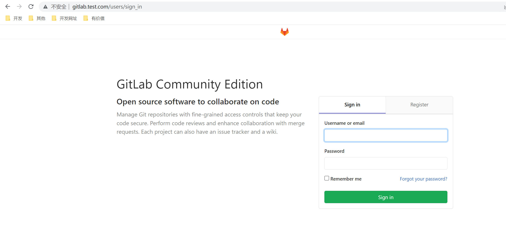
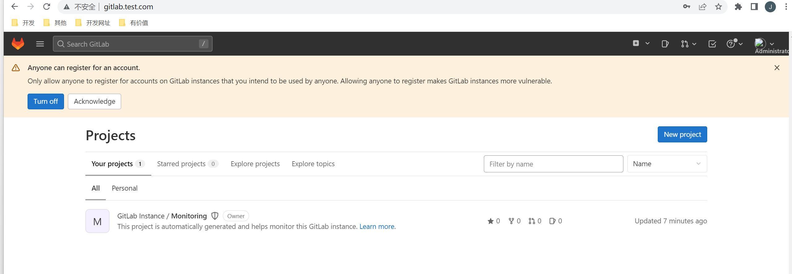
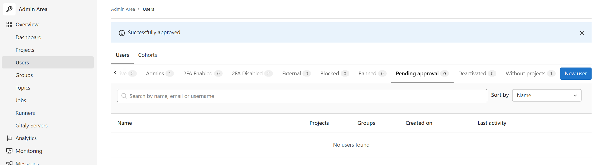
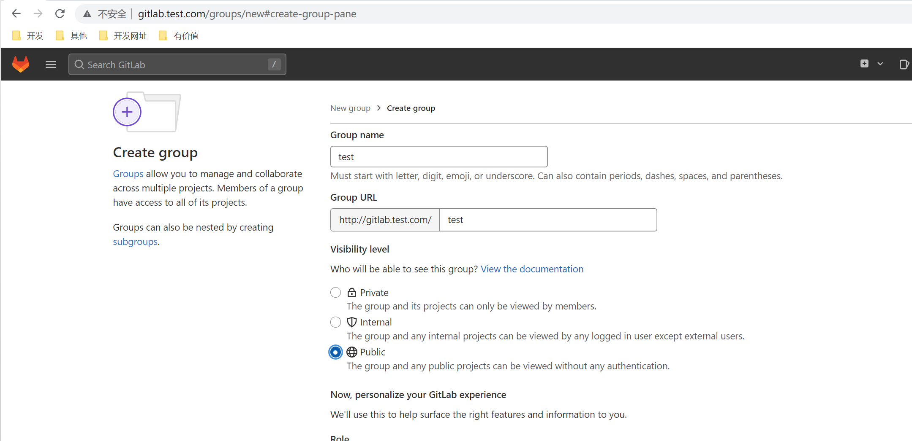
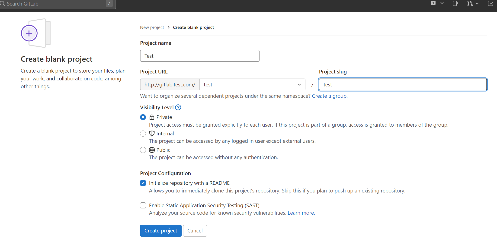
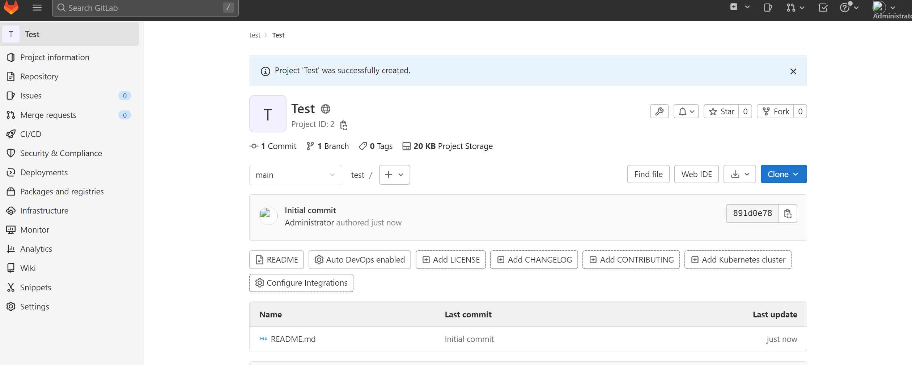
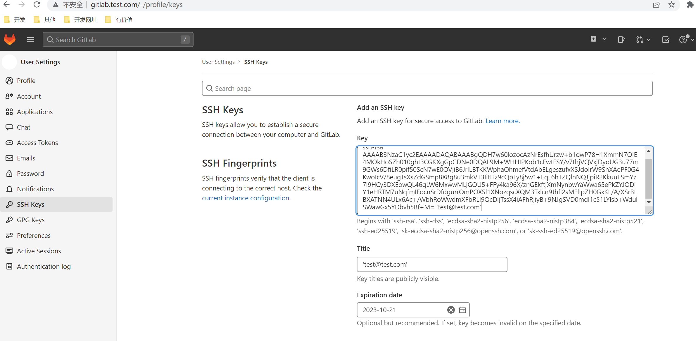

# Gitlab

GitLab 是一个用于仓库管理系统的开源项目，使用Git（开源的分布式版本控制系统）作为代码管理工具，并在此基础上搭建起来的Web服务。

在DevOps中，要实现自动化，第一步首先要做的就是能有效的管理代码，检出代码。

Gitlab非常适合做为公司的私有代码仓库，GitLab 是可以部署到自己的服务器上，GITLAB 免费且开源(基于 MIT 协议)，与 Github 类似， 可以注册用户，任意提交你的代码，添加 SSHKey 等等。

地址：https://gitlab.com/

## 1. 安装

官方提供了云原生的安装方式：https://docs.gitlab.com/，提供了Helm的方式和Operator的方式。

Operator不适合生产环境部署，Helm方式默认配置也不适合生产环境部署，想要适合生产环境，必须做大量的配置。

这里我们还是自定义安装。

### 1.1 环境准备

* k8s环境（前面课程已经安装）
* redis
* Postgresql
* nfs
* gitlab （https://github.com/sameersbn/docker-gitlab）

### 1.2 nfs

nfs在前面我们已经安装完成，使用nfs达到持久化的目的。

新创建一个目录：

~~~shell
[root@master ~]# mkdir /data/gitlab
[root@master ~]# mkdir /data/gitlab/config
[root@master ~]# mkdir /data/gitlab/logs
[root@master ~]# mkdir /data/gitlab/data
[root@master ~]# mkdir /data/gitlab/redis
[root@master ~]# mkdir /data/gitlab/postgresql
[root@master ~]# vim /etc/exports
/data/mysql *(insecure,rw,sync,no_root_squash)
/data/wordpress *(insecure,rw,sync,no_root_squash)
/data/thanos *(insecure,rw,sync,no_root_squash)
/data/log *(insecure,rw,sync,no_root_squash)
/data/gitlab/config *(insecure,rw,sync,no_root_squash)
/data/gitlab/logs *(insecure,rw,sync,no_root_squash)
/data/gitlab/data *(insecure,rw,sync,no_root_squash)
/data/gitlab/redis *(insecure,rw,sync,no_root_squash)
/data/gitlab/postgresql *(insecure,rw,sync,no_root_squash)
[root@master ~]# systemctl restart nfs
~~~

### 1.3 redis

gitlab-redis.yaml

~~~yaml
apiVersion: apps/v1
kind: Deployment
metadata:
  name: redis
  namespace: gitlab
  labels:
    name: redis
spec:
  selector:
    matchLabels:
      name: redis
  template:
    metadata:
      name: redis
      labels:
        name: redis
    spec:
      containers:
      - name: redis
        image: redis:6.2
        imagePullPolicy: IfNotPresent
        ports:
        - name: redis
          containerPort: 6379
        volumeMounts:
        - mountPath: /var/lib/redis
          name: gitlab-redis-data
        livenessProbe:
          exec:
            command:
            - redis-cli
            - ping
          initialDelaySeconds: 30
          timeoutSeconds: 5
        readinessProbe:
          exec:
            command:
            - redis-cli
            - ping
          initialDelaySeconds: 30
          timeoutSeconds: 1
      volumes:
      - name: gitlab-redis-data
        nfs: 
          server: 192.168.200.101
          path: /data/gitlab/redis
---
apiVersion: v1
kind: Service
metadata:
  name: redis
  namespace: gitlab
  labels:
    name: redis
spec:
  ports:
    - name: redis
      port: 6379
      targetPort: redis
  selector:
    name: redis
~~~

### 1.4 Postgresql

gitlab-postgresql.yaml:

~~~yaml
apiVersion: apps/v1
kind: Deployment
metadata:
  name: postgresql
  namespace: gitlab
  labels:
    name: postgresql
spec:
  selector:
    matchLabels:
      name: postgresql
  template:
    metadata:
      name: postgresql
      labels:
        name: postgresql
    spec:
      containers:
      - name: postgresql
        image: sameersbn/postgresql:12-20200524
        imagePullPolicy: IfNotPresent
        env:
        - name: DB_USER
          value: gitlab
        - name: DB_PASS
          value: gitlab
        - name: DB_NAME
          value: gitlab_production
        - name: DB_EXTENSION
          value: pg_trgm,btree_gist
        ports:
        - name: postgres
          containerPort: 5432
        volumeMounts:
        - mountPath: /var/lib/postgresql
          name: gitlab-postgresql-data
        readinessProbe:
          exec:
            command:
            - pg_isready
            - -h
            - localhost
            - -U
            - postgres
          initialDelaySeconds: 30
          timeoutSeconds: 1
      volumes:
      - name: gitlab-postgresql-data
        nfs: 
          server: 192.168.200.101
          path: /data/gitlab/postgresql
---
apiVersion: v1
kind: Service
metadata:
  name: postgresql
  namespace: gitlab
  labels:
    name: postgresql
spec:
  ports:
    - name: postgres
      port: 5432
      targetPort: postgres
  selector:
    name: postgresql
~~~

### 1.5 gitlab

gitlab.yaml

~~~yaml
apiVersion: apps/v1
kind: Deployment
metadata:
  name: gitlab
  namespace: gitlab
  annotations:
    nginx.ingress.kubernetes.io/proxy-body-size: "50m"
  labels:
    name: gitlab
spec:
  selector:
    matchLabels:
      name: gitlab
  template:
    metadata:
      name: gitlab
      labels:
        name: gitlab
    spec:
      initContainers:
      - name: fix-permissions
        image: busybox
        command: ["sh", "-c", "chown -R 1000:1000 /home/git/data"]
        securityContext:
          privileged: true
        volumeMounts:
        - name: gitlab-data
          mountPath: /home/git/data
      containers:
      - name: gitlab
        image: sameersbn/gitlab:15.4.2
        imagePullPolicy: IfNotPresent
        env:
        - name: TZ
          value: Asia/Shanghai
        - name: GITLAB_TIMEZONE
          value: Beijing
        - name: GITLAB_SECRETS_DB_KEY_BASE
          value: "long-and-random-alpha-numeric-string"
        - name: GITLAB_SECRETS_SECRET_KEY_BASE
          value: "long-and-random-alpha-numeric-string"
        - name: GITLAB_SECRETS_OTP_KEY_BASE
          value: "long-and-random-alpha-numeric-string"
        - name: GITLAB_ROOT_PASSWORD
          value: admin123456789
        - name: GITLAB_ROOT_EMAIL
          value: admin@test.com
        - name: GITLAB_HOST
          value: gitlab.test.com
        - name: GITLAB_PORT
          value: "80"
        - name: GITLAB_SSH_PORT
          value: "22"
        - name: GITLAB_NOTIFY_ON_BROKEN_BUILDS
          value: "true"
        - name: GITLAB_NOTIFY_PUSHER
          value: "false"
        - name: GITLAB_BACKUP_SCHEDULE
          value: daily
        - name: GITLAB_BACKUP_TIME
          value: 01:00
        - name: DB_TYPE
          value: postgres
        - name: DB_HOST
          value: postgresql
        - name: DB_PORT
          value: "5432"
        - name: DB_USER
          value: gitlab
        - name: DB_PASS
          value: gitlab
        - name: DB_NAME
          value: gitlab_production
        - name: REDIS_HOST
          value: redis
        - name: REDIS_PORT
          value: "6379"
        ports:
        - name: http
          containerPort: 80
        - name: ssh
          containerPort: 22
        volumeMounts:
        - mountPath: /home/git/data
          name: gitlab-data
        readinessProbe:
          httpGet:
            path: /
            port: 80
          initialDelaySeconds: 60
          timeoutSeconds: 1
      volumes:
      - name: gitlab-data
        nfs: 
          server: 192.168.200.101
          path: /data/gitlab/data
---
apiVersion: v1
kind: Service
metadata:
  name: gitlab
  namespace: gitlab
  labels:
    name: gitlab
spec:
  ports:
    - name: http
      port: 80
      targetPort: http
    - name: ssh
      port: 22
      targetPort: ssh
      nodePort: 30022
  type: NodePort
  selector:
    name: gitlab
---
apiVersion: networking.k8s.io/v1
kind: Ingress
metadata:
  name: gitlab
  namespace: gitlab
  labels:
    name: gitlab
spec:
  ingressClassName: nginx # ingress控制器的名称
  rules:
  - host: gitlab.test.com
    http:
      paths:
      - path: /
        pathType: Prefix
        backend:
          service:
            name: gitlab
            port:
              number: 80
~~~

### 1.6 部署

~~~shell
[root@master gitlab]# kubectl create ns gitlab
namespace/gitlab created
[root@master gitlab]# kubectl apply -f gitlab-redis.yaml 
deployment.apps/redis created
service/redis created
[root@master gitlab]# kubectl apply -f gitlab-postgresql.yaml           
deployment.apps/postgresql created
service/postgresql created
[root@master gitlab]# kubectl apply -f gitlab.yaml            
deployment.apps/gitlab created
service/gitlab created
ingress.networking.k8s.io/gitlab created
~~~

~~~shell
[root@master gitlab]# kubectl get pods -n gitlab
NAME                          READY   STATUS    RESTARTS   AGE
gitlab-f48856fcb-pf85t        1/1     Running   0          17m
postgresql-78986d6cbf-hfgvh   1/1     Running   0          17m
redis-6d8f96b655-gkfpl        1/1     Running   0          17m
[root@master gitlab]# kubectl get svc -n gitlab    
NAME         TYPE        CLUSTER-IP       EXTERNAL-IP   PORT(S)                     AGE
gitlab       NodePort    10.106.214.118   <none>        80:31823/TCP,22:30022/TCP   9h
postgresql   ClusterIP   10.108.250.62    <none>        5432/TCP                    8h
redis        ClusterIP   10.102.6.162     <none>        6379/TCP                    22h
[root@master gitlab]# kubectl get ingress -n gitlab   
NAME     CLASS           HOSTS             ADDRESS   PORTS   AGE
gitlab   ingress-nginx   gitlab.test.com             80      9h
~~~

设置hosts，然后浏览器访问gitlab.test.com

## 2. 简单使用

注册新用户需要管理员审核：

新建组：

新建工程：

生成ssh公钥：

~~~shell
D:\git\test>git config --global user.name 'test123'

D:\git\test>git config --global user.email  'test@test.com'

D:\git\test>ssh-keygen -t rsa -C 'test@test.com'

~~~

获取id_rsa.pub内容：

~~~shell
ssh-rsa AAAAB3NzaC1yc2EAAAADAQABAAABgQDH7w60lozocAzNrEsfhUrzw+b1owP78H1XmmN7OIE4MOkHoSZh010ght3CGKXgGpCDNe0DQAL9M+WHHIPKob1cFwtFSY/v7thjVQVxjDyoUG3u77m9GWs6DfiLR0pif50ScN7wE0OVjiB6JrILBTKKWphaOhmefVtdAbELgeszufxXSJdoIrW9ShXAePF0G4KwoIcV/8eugTsXsZdGSmp8X8g8u3mkVT3IitHz9cQpTy8j5w1+EqL6hTZQlnNQJjpiR2KkuuFSmYz7i9HCy3DXEowQL46qLW6MxwwMLjGOU5+FFy4ka96X/znGEkftjXmNynbwYaWwa65ePkZYJODiY1eHRTM7uNqfmIFocnSrDfdgurrOmPOXSl1XNozqscXQM3Txlcn9Jhfl2sMElIpZH0GxKL/A/XSrBLBXATNN4ULx6Ac+/WbhRoWwdmXFbRLl9QcDIjTssX4iAFhRjiyB+9NJgSVD0mdI1c51LYlsb+WdulSWawGx5YDbvh5Bf+M= 'test@test.com'
~~~

克隆代码：

~~~shell
# 22端口对外映射的是30022 所以这要加上端口号
git clone ssh://git@gitlab.test.com:30022/gitlab/test.git
~~~

