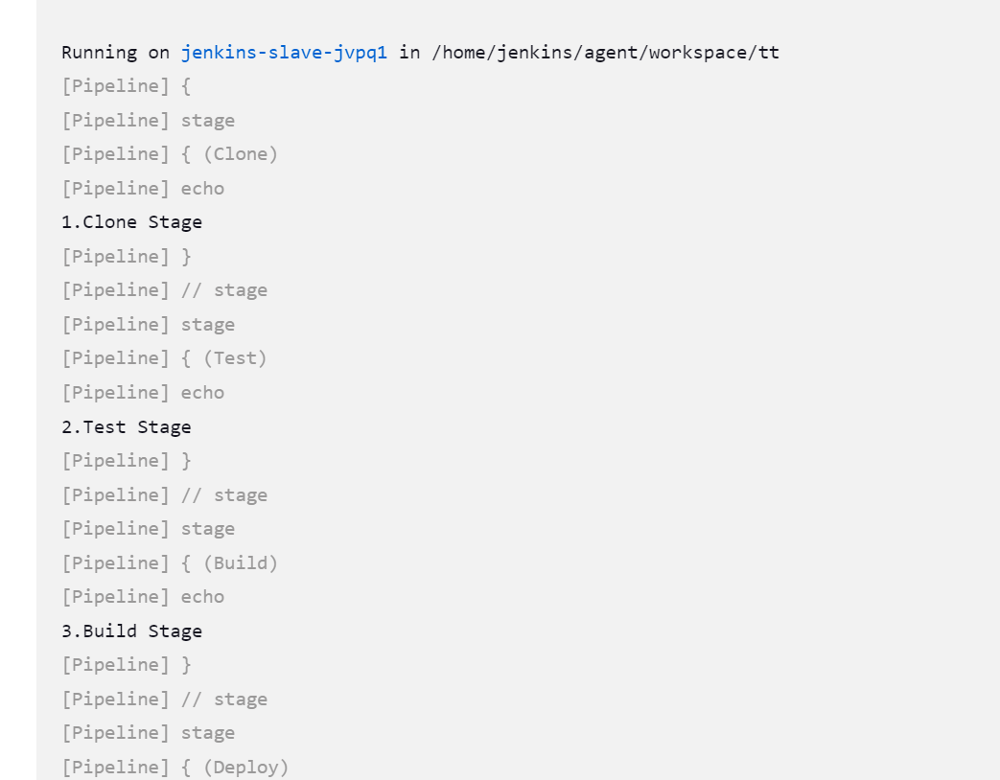
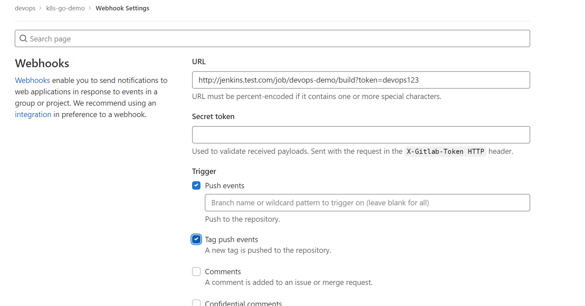
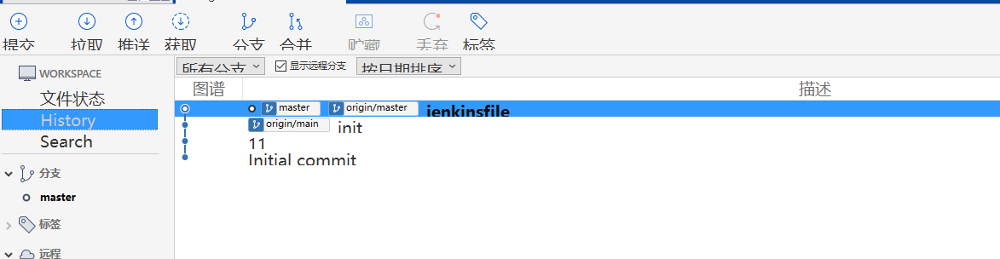
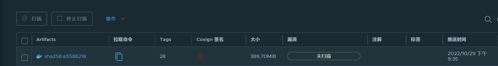

# Jenkins Pipeline

要实现在 Jenkins 中的构建工作，可以有多种方式，我们这里采用比较常用的 Pipeline 这种方式。Pipeline，简单来说，就是一套运行在 Jenkins 上的工作流框架，将原来独立运行于单个或者多个节点的任务连接起来，实现单个任务难以完成的复杂流程编排和可视化的工作。

Jenkins Pipeline 有几个核心概念：

- Node：节点，一个 Node 就是一个 Jenkins 节点，Master 或者 Agent，是执行 Step 的具体运行环境，比如我们之前动态运行的 Jenkins Slave 就是一个 Node 节点
- Stage：阶段，一个 Pipeline 可以划分为若干个 Stage，每个 Stage 代表一组操作，比如：Build、Test、Deploy，Stage 是一个逻辑分组的概念，可以跨多个 Node
- Step：步骤，Step 是最基本的操作单元，可以是打印一句话，也可以是构建一个 Docker 镜像，由各类 Jenkins 插件提供，比如命令：sh 'make'，就相当于我们平时 shell 终端中执行 make 命令一样。

那么我们如何创建 Jenkins Pipline 呢？

- Pipeline 脚本是由 Groovy 语言实现的，但是我们没必要单独去学习 Groovy，当然你会的话最好
- Pipeline 支持两种语法：Declarative(声明式)和 Scripted Pipeline(脚本式)语法
- Pipeline 也有两种创建方法：可以直接在 Jenkins 的 Web UI 界面中输入脚本；也可以通过创建一个 Jenkinsfile 脚本文件放入项目源码库中

我们这里来给大家快速创建一个简单的 Pipeline，直接在 Jenkins 的 Web UI 界面中输入脚本运行。

- 新建 Job：在 Web UI 中点击 New Item -> 输入名称：pipeline-demo -> 选择下面的 Pipeline -> 点击 OK

- 配置：在最下方的 Pipeline 区域输入如下 Script 脚本，然后点击保存。

  ```groovy
  node {
  stage('Clone') {
      echo "1.Clone Stage"
  }
  stage('Test') {
      echo "2.Test Stage"
  }
  stage('Build') {
      echo "3.Build Stage"
  }
  stage('Deploy') {
      echo "4. Deploy Stage"
  }
  }
  ```

- 构建：点击左侧区域的 `Build Now`，可以看到 Job 开始构建了

隔一会儿，构建完成，可以点击左侧区域的 ·Console Output·，我们就可以看到如下输出信息：

console output 我们可以看到上面我们 Pipeline 脚本中的4条输出语句都打印出来了，证明是符合我们的预期的。

如果大家对 Pipeline 语法不是特别熟悉的，可以前往输入脚本的下面的链接 `Pipeline Syntax` 中进行查看，这里有很多关于 Pipeline 语法的介绍，也可以自动帮我们生成一些脚本。

官方文档地址：https://www.jenkins.io/doc/book/pipeline/

## 1. 在 Slave 中构建任务

上面我们创建了一个简单的 Pipeline 任务，但是我们可以看到这个任务并没有在 Jenkins 的 Slave 中运行，那么如何让我们的任务跑在 Slave 中呢？一定要添加对应的label才行，我们重新编辑上面创建的 Pipeline 脚本，给 node 添加一个 label 属性，如下：

```groovy
node('ms-jenkins') {
  stage('Clone') {
    echo "1.Clone Stage"
  }
  stage('Test') {
    echo "2.Test Stage"
  }
  stage('Build') {
    echo "3.Build Stage"
  }
  stage('Deploy') {
    echo "4. Deploy Stage"
  }
}
```


我们这里给 node 添加了一个 `ms-jenkins` 这样的一个label，然后我们保存，构建之前查看下 kubernetes 集群中的 Pod：

```shell
[root@master jekines]# kubectl get pods -n devops
NAME                       READY   STATUS    RESTARTS      AGE
jenkins-675cc9b744-69c8q   2/2     Running   1 (28m ago)   92m
```


然后重新触发立刻构建：

```shell
[root@master jekines]# kubectl get pods -n devops
NAME                       READY   STATUS    RESTARTS      AGE
jenkins-675cc9b744-69c8q   2/2     Running   1 (28m ago)   92m
jenkins-slave-jvpq1        1/1     Running   0          23s
```

我们发现多了一个名叫jenkins-slave-jvpq1的 Pod 正在运行，隔一会儿这个 Pod 就不再了。


这也证明我们的 Job 构建完成了，同样回到 Jenkins 的 Web UI 界面中查看 Console Output，可以看到如下的信息：



我们回到 Job 的主界面，也可以看到大家可能比较熟悉的 Stage View 界面：


## 2. 部署 Kubernetes 应用

上面我们已经知道了如何在 Jenkins Slave 中构建任务了，那么如何来部署一个原生的 Kubernetes 应用呢？ 要部署 Kubernetes 应用，我们就得对我们部署应用的流程要非常熟悉才行，流程一般是这样的：

- 编写代码
- 测试
- 编写 Dockerfile
- 构建打包 Docker 镜像
- 推送 Docker 镜像到仓库
- 编写 Kubernetes YAML 文件
- 更改 YAML 文件中 Docker 镜像 TAG
- 利用 kubectl 工具部署应用

现在我们就需要把上面这些流程放入 Jenkins 中来自动帮我们完成(当然编码除外)，从测试到更新 YAML 文件属于 CI 流程，后面部署属于 CD 的流程。如果按照我们上面的示例，我们现在要来编写一个 Pipeline 的脚本，应该怎么编写呢？

```groovy
node('ms-jenkins') {
    stage('Clone') {
      echo "1.Clone Stage"
    }
    stage('Test') {
      echo "2.Test Stage"
    }
    stage('Build') {
      echo "3.Build Docker Image Stage"
    }
    stage('Push') {
      echo "4.Push Docker Image Stage"
    }
    stage('YAML') {
      echo "5.Change YAML File Stage"
    }
    stage('Deploy') {
      echo "6.Deploy Stage"
    }
}
```


现在我们创建一个流水线的作业，直接使用上面的脚本来构建，同样可以得到正确的结果：


这里我们来将一个简单 golang 程序，部署到 kubernetes 环境中。

~~~go
package main

import (
	"github.com/gin-gonic/gin"
	"log"
	"net/http"
)

func main() {
	e := gin.Default()

	e.GET("/", func(c *gin.Context) {
		c.JSON(http.StatusOK, gin.H{
			"msg": "Hello k8s",
		})
	})

	e.GET("/health", func(c *gin.Context) {
		c.JSON(http.StatusOK, gin.H{
			"health": true,
		})
	})

	if err := e.Run(":8080"); err != nil {
		log.Fatalln(err)
	}
}

~~~


我们将代码推送到我们自己的 GitLab 仓库上去，地址：http://gitlab.test.com/devops/k8s-go-demo，这样让 Jenkins 和 Gitlab 连接进行 CI/CD。


如果按照之前的示例，我们应该这样来编写 Pipeline 脚本：

* 第一步，clone 代码 

* 第二步，进行测试，如果测试通过了才继续下面的任务 
* 第三步，构建 Docker 镜像了 
* 第四步，镜像打包完成，就应该推送到镜像仓库中
* 第五步，镜像推送完成，更改 YAML 文件中的镜像 TAG 为这次镜像的 TAG 
* 第六步，使用 kubectl 命令行工具进行部署了

### 2.1 gitlab

~~~shell
[root@master harbor]# kubectl get ingress -n gitlab
NAME     CLASS   HOSTS             ADDRESS   PORTS   AGE
gitlab   nginx   gitlab.test.com             80      4d21h
~~~

将上述代码上传到仓库


### 2.2 harbor

~~~shell
[root@master harbor]# kubectl get ingress -n harbor
NAME                      CLASS   HOSTS                   ADDRESS   PORTS     AGE
myharbor-ingress          nginx   testharbor.com                    80, 443   13s
myharbor-ingress-notary   nginx   notary.testharbor.com             80, 443   13s
~~~

将上述项目打包上传到harbor仓库中，项目镜像从harbor仓库中拉取。


创建用户：


用户名/密码： devops/DevOps123

给devops项目分配成员：


**开发人员：对于指定项目拥有读写权限**

以新用户重新进行登录：


制作镜像：

Dockerfile

~~~dockerfile
#源镜像
FROM golang:1.18 as build
#作者
MAINTAINER devops "msdevops@test.com"
## 在docker的根目录下创建相应的使用目录
RUN mkdir -p /www/webapp
## 设置工作目录
WORKDIR /www/webapp
## 把当前（宿主机上）目录下的文件都复制到docker上刚创建的目录下
COPY . /www/webapp
#go构建可执行文件
RUN GOPROXY="https://goproxy.io"  go build -o main main.go
#暴露端口
EXPOSE 8080

RUN chmod +x main
ENTRYPOINT ["./main"]
~~~

> 当前的k8s集群无docker环境，新开一个虚拟机安装docker，制作镜像

~~~shell
[root@localhost k8s-go-demo]# git clone http://192.168.200.101:30513/devops/k8s-go-demo.git
Cloning into 'k8s-go-demo'...
remote: Enumerating objects: 11, done.
remote: Counting objects: 100% (11/11), done.
remote: Compressing objects: 100% (9/9), done.
remote: Total 11 (delta 2), reused 0 (delta 0), pack-reused 0
Unpacking objects: 100% (11/11), done.

[root@localhost k8s-go-demo]# ll
total 28
-rw-r--r--. 1 root root  428 Oct 27 13:24 Dockerfile
-rw-r--r--. 1 root root 1053 Oct 27 13:23 go.mod
-rw-r--r--. 1 root root 6962 Oct 27 13:23 go.sum
-rw-r--r--. 1 root root  372 Oct 27 13:23 main.go
-rw-r--r--. 1 root root 6208 Oct 27 13:23 README.md
[root@localhost k8s-go-demo]# docker build -t k8s-go-demo:v1.0 .
Sending build context to Docker daemon  84.48kB
Step 1/9 : FROM golang:1.18 as build
 ---> 385d98c8996f
Step 2/9 : MAINTAINER devops "msdevops@test.com"
 ---> Using cache
 ---> dacf2b3b5bb2
Step 3/9 : RUN mkdir -p /www/webapp
 ---> Using cache
 ---> 34db9c0fc3ef
Step 4/9 : WORKDIR /www/webapp
 ---> Using cache
 ---> 9687306052d6
Step 5/9 : COPY . /www/webapp
 ---> 93a917bea6cf
Step 6/9 : RUN GOPROXY="https://goproxy.io"  go build -o main main.go
 ---> Running in 41e4995a61f4
go: downloading github.com/gin-gonic/gin v1.8.1
go: downloading github.com/gin-contrib/sse v0.1.0
go: downloading github.com/mattn/go-isatty v0.0.14
go: downloading golang.org/x/net v0.0.0-20210226172049-e18ecbb05110
go: downloading github.com/go-playground/validator/v10 v10.10.0
go: downloading github.com/pelletier/go-toml/v2 v2.0.1
go: downloading github.com/ugorji/go/codec v1.2.7
go: downloading google.golang.org/protobuf v1.28.0
go: downloading gopkg.in/yaml.v2 v2.4.0
go: downloading golang.org/x/sys v0.0.0-20210806184541-e5e7981a1069
go: downloading github.com/go-playground/universal-translator v0.18.0
go: downloading github.com/leodido/go-urn v1.2.1
go: downloading golang.org/x/crypto v0.0.0-20210711020723-a769d52b0f97
go: downloading golang.org/x/text v0.3.6
go: downloading github.com/go-playground/locales v0.14.0
Removing intermediate container 41e4995a61f4
 ---> 35a6250584b8
Step 7/9 : EXPOSE 8080
 ---> Running in 9e1559735b91
Removing intermediate container 9e1559735b91
 ---> e6abfc5d76a6
Step 8/9 : RUN chmod +x main
 ---> Running in 58cdf237701c
Removing intermediate container 58cdf237701c
 ---> d810bc4970b6
Step 9/9 : ENTRYPOINT ["./main"]
 ---> Running in ed450c66e55c
Removing intermediate container ed450c66e55c
 ---> 70f9abf89f54
Successfully built 70f9abf89f54
Successfully tagged k8s-go-demo:v1.0
~~~

最好是配置一下hosts

~~~shell
[root@localhost ~]# vim /etc/hosts
192.168.200.101 testharbor.com
192.168.200.101 gitlab.test.com
~~~

打tag：

~~~shell
[root@localhost k8s-go-demo]# docker tag k8s-go-demo:v1.0 testharbor.com/devops/k8s-go-demo:v1.0
~~~

harbor地址添加到docker中：

~~~shell
[root@localhost k8s-go-demo]# vim /etc/docker/daemon.json 
{
  "registry-mirrors": ["https://hub-mirror.c.163.com/"],
  "insecure-registries": ["testharbor.com"]
}
[root@localhost k8s-go-demo]# systemctl daemon-reload     
[root@localhost k8s-go-demo]# systemctl restart docker 
~~~

登录harbor：

~~~shell
[root@localhost k8s-go-demo]# docker login -u devops -p DevOps123 testharbor.com
WARNING! Using --password via the CLI is insecure. Use --password-stdin.
WARNING! Your password will be stored unencrypted in /root/.docker/config.json.
Configure a credential helper to remove this warning. See
https://docs.docker.com/engine/reference/commandline/login/#credentials-store

Login Succeeded

~~~

推送：

~~~shell
[root@localhost k8s-go-demo]# docker push testharbor.com/devops/k8s-go-demo:v1.0
The push refers to repository [testharbor.com/devops/k8s-go-demo]
e413d9914a02: Pushed 
41837602cc97: Pushed 
da0358c4f9e8: Pushed 
9505e8901b34: Pushed 
fc0b1497525e: Pushed 
3f2cb4afd8f2: Pushed 
3a8d602e51a3: Pushed 
d1dec9917839: Pushed 
d38adf39e1dd: Pushed 
4ed121b04368: Pushed 
d9d07d703dd5: Pushed 
v1.0: digest: sha256:4a2487f19625b6e93f1d17556f3fd13a98796159564bab351c7e84bb9681412b size: 2635
~~~


### 2.3 CI/CD

jenkins账号密码 admin/admin

熟悉了gitlab和harbor的流程后，我们来通过Jenkins Pipeline构建整个CI/D流程。

新建流水线任务：


同时记录**http://jenkins.test.com/job/devops-demo/build?token=devops123** 这个地址，后面要用


这里需要从我们的gitlab仓库进行构建，但是gitlab.test.com不识别，需要在 CoreDNS 中添加自定义域名解析：

~~~shell
[root@master harbor]# kubectl edit cm coredns -n kube-system
# Please edit the object below. Lines beginning with a '#' will be ignored,
# and an empty file will abort the edit. If an error occurs while saving this file will be
# reopened with the relevant failures.
#
apiVersion: v1
data:
  Corefile: |
    .:53 {
        errors
        health {
           lameduck 5s
        }
        ready
        hosts {
          192.168.200.101 gitlab.test.com
          192.168.200.101 jenkins.test.com
          192.168.200.101 testharbor.com
          192.168.200.101 master
          192.168.200.101 node1
          192.168.200.101 node2
          fallthrough
        }
        kubernetes cluster.local in-addr.arpa ip6.arpa {
           pods insecure
           fallthrough in-addr.arpa ip6.arpa
           ttl 30
        }
        prometheus :9153
        forward . /etc/resolv.conf {
           max_concurrent 1000
        }
        cache 30
        loop
        reload
        loadbalance
    }
kind: ConfigMap
metadata:
  creationTimestamp: "2022-09-23T03:57:42Z"
  name: coredns
  namespace: kube-system
"/tmp/kubectl-edit-3730817610.yaml" 39L, 994C written
configmap/coredns edited
~~~

添加认证：


配置gitlab的webhook：




出现上面的问题，使用root账号登录，在admin的设置Network设置


同时在Jenkins中，配置安全策略：


在脚本命令行执行以下脚本，关闭跨域保护：

~~~shell
import jenkins.model.Jenkins

def jenkins = Jenkins.instance

jenkins.setCrumbIssuer(null)
~~~

或者：

~~~shell
hudson.security.csrf.GlobalCrumbIssuerConfiguration.DISABLE_CSRF_PROTECTION=true
~~~


测试：


## 3. Jenkinsfile

Jenkinsfile 有两种写法：

* 脚本式（Scripted Pipeline）：将流水线定义在 node{} 中，内容为可执行的 Groovy 脚本。
* 声明式（Declarative Pipeline）：将流水线定义在 pipeline{} 中，内容为声明式的语句。

前面我们示例中使用的是脚本式，现在普遍是推荐使用声明式，所以我们来学习声明式的语法。

### 3.1 示例

~~~groovy
pipeline {
    agent {                     // 声明使用的节点
        label 'master'
    }
    environment {               // 定义环境变量
        GIT_REPO = 'https://github.com/xx'
    }
    options {
        timestamps()
        timeout(time: 10, unit: 'MINUTES')
    }
    stages {
        stage('拉取代码') {      // 开始一个阶段
            environment {       // 定义该阶段的环境变量
                BRANCH = 'master'
            }
            steps {             // 该阶段需要执行一些步骤
                sh """
                    git clone $GIT_REPO
                    git checkout $BRANCH"
                """
            }
        }
        stage('构建镜像') {
            steps {
                sh '''
                    IMAGE=${image_hub}/${image_project}/${image_name}:${image_tag}
                    docker build . -t $IMAGE
                    docker push $IMAGE
                    docker image rm $IMAGE
                '''
            }
        }
    }
    post {
        always {            // 任务结束时总是执行以下操作
            deleteDir()     // 递归地删除当前目录。这里是作用于当前 agent 的 ${env.WORKSPACE} 目录
        }
    }
}
~~~

* 用 // 声明单行注释。
* 每个 {} 的内容不能为空。

### 3.2 变量

~~~groovy
script {
    ID = "1"            // 创建变量
    NAME = "man" + ID   // 拼接字符串
    echo NAME           // 直接打印 Groovy 的变量
    echo "$ID"          // 字符串定界符为双引号时，支持用 $ 插入变量或表达式的值
    echo '$ID'          // 字符串定界符为单引号时，不支持用 $ 取值
    sh "echo $ID"       // 执行 sh 语句，字符串定界符为双引号时，会先在 Groovy 解释器中获取 $ 变量的值，再将字符串作为 Shell 命令执行
    sh 'echo $ID'       // 执行 sh 语句，字符串定界符为单引号时，会直接作为 Shell 命令执行，因此 $ 会读取 Shell 变量
}
~~~

* Groovy 语言支持在字符串中用 `$` 插入变量的值，用 `${} `插入表达式的值。
  * Jenkins 在执行 Jenkinsfile 之前，会先渲染以双引号作为定界符的字符串，如果其中存在 $ 符号，则尝试对 Groovy 解释器中的变量进行取值。
    * 如果通过 $ 读取的变量不存在，则会抛出 Groovy 的语法异常：`groovy.lang.MissingPropertyException: No such property`
    * 如果通过 `${env.A} `方式读取的变量不存在，则会返回 null ，不会报错。
* 如果想让 Groovy 将字符串中的 $ 当作普通字符处理，则需要使用单引号作为定界符，或者使用转义字符 \$ 
* Jenkinsfile script{} 中创建的 Groovy 变量名区分大小写，但 parameters、environment 变量名不区分大小写，不过它们加入 shell 环境变量时会区分大小写。

#### 3.2.1 环境变量

在 environment{} 中可以定义环境变量，它们会保存为 Groovy 变量和 Shell 环境变量。如下：

~~~groovy
stage('测试') {
    environment {
        ID = 1
    }
    steps {
        sh "echo $ID"
        sh 'echo $ID'
    }
}
~~~

* 如果给环境变量赋值为空，则会删除该变量。
* 定义在 pipeline.environment{} 中的环境变量会作用于该 pipeline 全局，而定义在 stage.environment{} 中的只作用于该阶段。
* 还可以在 Jenkins 系统配置页面，定义作用于所有 Job 的环境变量。或者通过 Folder Properties 插件，在文件夹中定义环境变量。

在 environment{} 中可以导入 Jenkins 的凭据作为环境变量：

~~~groovy
environment {
    ACCOUNT1 = credentials('account1')
}
~~~

假设该凭据是 `Username With Password `类型，值为 `admin:123456` ，则 Jenkins 会在 Shell 中加入三个环境变量：

~~~shell
ACCOUNT1=admin:123456
ACCOUNT1_USR=admin
ACCOUNT1_PSW=123456
~~~

* 读取其它类型的凭据时，建议打印出 Shell 的所有环境变量，从而发现 Jenkins 加入的环境变量的名字。
* 为了保密，如果直接将上述变量打印到 stdout 上，Jenkins 会将它们的值显示成` ****` 。

#### 3.2.2 构建参数

* 可以给 Job 声明构建参数，它们会保存为 Groovy 变量和 Shell 环境变量。

  * 用户在启动 Job 时，必须传入构建参数，除非它们有默认值。

* Pipeline Job 可以在 pipeline.parameters{} 中以代码的形式定义构建参数，而其它类型的 Job 只能在 Jenkins Web 页面中定义构建参数。如下：

  ~~~groovy
  pipeline {
      agent any
      parameters {
          booleanParam(name: 'A', defaultValue: true, description: '')   // 布尔参数
          choice(name: 'E', choices: ['A', 'B', 'C'], description: '')   // 单选参数，输入时会显示成下拉框
          string(name: 'B', defaultValue: 'Hello', description: '')      // 字符串参数，在 Web 页面上输入时不能换行
          text(name: 'C', defaultValue: 'Hello\nWorld', description: '') // 文本参数，输入时可以换行
          password(name: 'D', defaultValue: '123456', description: '')   // 密文参数，输入时会显示成密文
          file(name: 'f1', description: '')                              // 文件参数，输入时会显示文件上传按钮
      }
      stages {
          stage('Test') {
              steps {
                  echo "$A"   // 也可通过 $params.A 的格式读取构建参数，避免与环境变量重名
              }
          }
      }
  }
  ~~~

  * 如果定义了 parameters{} ，则会移除在 Jenkins Web 页面中定义的、在上游 Job 中定义的构建参数。
  * 每次修改了 parameters{} 之后，要执行一次 Job 才会在 Jenkins Web 页面上生效。
  * password 类型的参数虽然在输入时显示成密文，但打印到终端上时会显示成明文，不如 Jenkins 的 credentials 安全。
  * file 类型的参数上传的文件会存储到` ${workspace}/${job_name}/f1` 路径处，而用 `$f1 `可获得上传的文件名。
    * pipeline job 的文件参数功能无效，不能上传文件。可采用以下两种替代方案：
      * 创建一个普通类型的 job ，供用户上传文件，保存到主机的 /tmp 目录下。然后让其它 job 从这里拷贝文件。
      * 在 Jenkins 之外搭建一个文件服务器，供用户上传文件。然后让其它 job 从这里下载文件。这样上传文件时麻烦些，但方便跨主机拷贝文件。

* 在 shell 命令中调用构建参数时，可能被注入攻击。

  * 比如脚本执行 `ls $file` ，而用户输入构建参数` file=a;rm -rf * `就会注入攻击。
  * 如果让用户输入 booleanParam、choice 类型的构建参数，则在 Web 页面上只能选择有限的值。
    * 即使用户通过 HTTP API 输入构建参数，Jenkins 也会自动检查参数的值是否合法。如果不合法，则采用该参数的默认值。
  * 如果让用户输入 string、text 类型的构建参数，则应该过滤之后再调用。如下：

  ~~~groovy
  parameters {
      string(name: 'file')
  }
  environment {
      file = file.replaceAll('[^\\w /:,.*_-]', '_').trim()    // 将构建参数赋值给一个环境变量，替换特殊字符
  }
  ~~~

#### 3.2.3 内置变量

可以通过 params 字典读取 Pipeline 的构建参数。如下：

~~~groovy
params.A
params.B
~~~

可以通过 env 字典读取 Pipeline 的环境变量。除了用户添加的环境变量，还有 Jenkins 内置的环境变量，比如：

~~~shell
env.JENKINS_HOME    # Jenkins 部署的主目录
env.NODE_NAME       # 节点名
env.WORKSPACE       # 在当前节点上的工作目录

env.JOB_NAME        # 任务名
env.JOB_URL         # 任务链接
env.BUILD_NUMBER    # 构建编号
env.BUILD_URL       # 构建链接

env.BRANCH_NAME     # 分支名
env.CHANGE_AUTHOR   # 版本的提交者
env.CHANGE_URL      # 版本的链接
~~~

这些变量的值都是 String 类型。

这些变量可以按以下格式读取：

~~~groovy
script {
    echo env.NODE_NAME              // 在 Groovy 代码中，通过 env 字典读取
    echo "${env.NODE_NAME}"         // 在字符串中，通过 $ 取值

    sh "echo ${env.NODE_NAME}"
    sh 'echo $NODE_NAME'            // env 字典的内容会导入 Shell 的环境变量，因此可以在 shell 中直接读取
}
~~~

可以通过 currentBuild 字典获取当前的构建信息。如下：

~~~shell
currentBuild.buildCauses       # Build 的执行原因，返回一个字典，包括 userId、userName 等
currentBuild.displayName       # Build 的名称，格式为 #number
currentBuild.fullDisplayName   # Build 的全名，格式为 JOB_NAME #number
currentBuild.description       # Build 的描述，默认为 null
currentBuild.duration          # Build 的持续时长，单位 ms
currentBuild.result            # Build 的结果。如果构建尚未结束，则返回值为 null
currentBuild.currentResult     # Build 的当前状态。开始执行时为 SUCCESS ，受每个 stage 影响，不会变为 null
~~~

只有 displayName、description 变量支持修改。修改其它变量时会报错：RejectedAccessException: No such field

~~~groovy
script {
    jenkins_user = "${currentBuild.buildCauses}".findAll('userName:([^,\\]]+)')[0].replaceAll('userName:', '')
    currentBuild.displayName = "#${env.BUILD_NUMBER}    $jenkins_user"
    currentBuild.description = "BRANCH=${env.BRANCH}"
}
~~~

### 2.3 agent{}

用于控制在哪个 Jenkins 代理上执行流水线。

可用范围：

* 在 pipeline{} 中必须定义 agent{} ，作为所有 stage{} 的默认代理。
* 在单个 stage{} 中可选定义 agent{} ，只作用于该阶段。

agent 常见的几种定义格式：

~~~groovy
agent none          // 不设置全局的 agent ，此时要在每个 stage{} 中单独定义 agent{}
~~~

~~~groovy
agent any           // 让 Jenkins 选择任一代理
~~~

~~~groovy
agent {
    label 'master'  // 选择指定名字的代理
}
~~~

~~~groovy
agent {
    node {          // 选择指定名字的代理，并指定工作目录
        label 'master'
        customWorkspace '/opt/jenkins_home/workspace/test1'
    }
}
~~~

### 2.4 docker

可以创建临时的 docker 容器作为 agent ：

~~~groovy
agent {
    docker {
        // label 'master'
        // customWorkspace "/opt/jenkins_home/workspace/test1"
        image 'centos:7'
        // args  '-v /tmp:/tmp'
    }
}
~~~

这会在指定节点上创建一个 docker 容器，执行 pipeline ，然后自动删除该容器。

该容器默认的启动命令如下：

~~~shell
docker run -t -d \
    -u 0:0 \                                    # 默认会设置容器内用户为 root
    -w /opt/jenkins/workspace/test_pipeline \   # 默认会自动挂载 workspace 目录，并将其设置为容器的工作目录
    -v /opt/jenkins/workspace/test_pipeline:/opt/jenkins/workspace/test_pipeline:rw,z \
    -e ******** -e ******** -e ******** \       # 默认会传入 Jenkins 的环境变量
    centos:7 cat
~~~

也可以在 script{} 中运行容器：

~~~groovy
script{
    // 运行一个容器，在 Groovy 中保存为 container1 对象
    docker.image('mysql:5.7').withRun('-p 3306:3306') { container1 ->
        // 等待服务启动
        sh """
            while ! curl 127.0.0.1:3306
            do
                echo 'Wait until service is up...'
                sleep 1
            done
        """

        // 支持嵌套，从而同时运行多个容器
        docker.image('centos:7').inside("--link ${container1.id}:db") {
            sh """
                sh test.sh
            """
        }
    }
}
~~~

* withRun() 方法执行完之后会自动删除容器。
* inside() 方法启动容器时，会加上像 agent.docker 的默认配置。

### 2.5 stages{}

pipeline{} 流水线的主要内容写在 stages{} 中，其中可以定义一个或多个 stage{} ，表示执行的各个阶段。

* Jenkins 会按先后顺序执行各个 stage{} ，并在 Web 页面上显示执行进度。
* 每个 stage{} 的名称不能重复。
* 每个 stage{} 中有且必须定义一个以下类型的语句块：

~~~shell
stages{}
steps{}
matrix{}
parallel{}
~~~

例子：

~~~groovy
stages {
    stage('测试 1') {
        steps {...}
    }
    stage('测试 2') {
        stages('嵌套阶段') {
            stage('单元测试 1') {
                steps {...}
            }
            stage('单元测试 2') {
                steps {...}
            }
        }
    }
}
~~~

### 2.6 steps{}

在 steps{} 中可以使用多种 DSL 语句。

官方文档地址：https://www.jenkins.io/doc/pipeline/steps/

#### 2.6.1 archiveArtifacts

用于将指定路径的文件归档。

* 归档文件会被保存到 master 节点的 `$JENKINS_HOME/jobs/$JOB_NAME/builds/$BUILD_ID/archive/ `目录下。

* 可以在 Jenkins 的 job 页面查看、下载归档文件。

  ~~~groovy
  archiveArtifacts artifacts: 'dist.zip'
  ~~~

* 目标文件的路径可以使用通配符：

  ~~~groovy
  target/*.jar
  **/*.log
  ~~~

#### 2.6.2 bat

用于在 Windows 系统上执行 CMD 命令。

#### 2.6.3 build

用于执行一个 Job 。

* 在流水线上，被执行的 job 位于当前 job 的下游。

  ~~~groovy
  build (
      job: 'job1',
      parameters: [
          string(name: 'AGENT', value: 'master'),  // 这里的 string 是指输入值的类型，可输入给大部分类型的 parameters
      ]
      // wait: true,        // 是否等待下游 job 执行完毕，才继续执行当前 job
      // propagate: true,   // 是否让下游 job 的构建结果影响当前 job 。需要启用 wait 才生效
      // quietPeriod: 5,    // 设置静默期，默认为 5 秒
  )
  ~~~

* 如果给下游 job 传入未定义的 parameters ，则后者并不会接收。

#### 2.6.4 checkout

用于拉取代码仓库。

例：拉取 Git 仓库

~~~groovy
checkout([
    $class: 'GitSCM',
    branches: [[name: "$BRANCH"]],    // 切换到指定的分支，也可以填 tag 或 commit ID 。不过该插件最终会切换到具体的 commit ID
    extensions: [
      [$class: 'CleanBeforeCheckout'],  // 清理项目文件，默认启用。相当于 git clean -dfx 加 git reset --hard
      // [$class: 'RelativeTargetDirectory', relativeTargetDir: '.'], // 本地仓库的保存目录，默认为 .
      // [$class: 'CloneOption', shallow: true, depth: 1],            // 浅克隆，只下载最近 1 个版本的文件
      // [$class: 'SubmoduleOption', recursiveSubmodules: true, parentCredentials: true, shallow: true, depth: 1], // 递归克隆 submodule ，采用父 Git 项目的凭据，并采用浅克隆
    ],
    userRemoteConfigs: [[
      credentialsId: 'account_for_git', // 登录 git 服务器的凭据，为 Username With Password 类型
      url: "$repository_url"            // git 远程仓库的地址
    ]]
])
~~~

也可直接执行 git 命令：

~~~groovy
withCredentials([gitUsernamePassword(credentialsId:'account_for_git')]){  // 这会自动绑定 git 账号密码到环境变量 GIT_USERNAME、GIT_PASSWORD
    sh """
        git clone $repository_url
    """
}
~~~

与直接使用 git 命令相比，使用 checkout 语句会将 git commit、diff 等信息收集到 Jenkins 中并显示。

例：拉取 SVN 仓库

~~~groovy
checkout([
    $class: 'SubversionSCM',
    locations: [[
        remote: "$repository_url"
        credentialsId: 'account_for_svn',
        local: '.',                               // 本地仓库的保存目录，默认是创建一个与 SVN 最后一段路径同名的子目录
        // depthOption: 'infinity',               // 拉取的目录深度，默认是无限深
    ]],
    quietOperation: true,                         // 不显示拉取代码的过程
    workspaceUpdater: [$class: 'UpdateUpdater']   // 使本地目录更新到最新版本
])
~~~

#### 2.6.5 dir

用于暂时切换工作目录，执行一些指令之后又回到 WORKSPACE 。

~~~groovy
steps {
  dir("/tmp") {
      sh "pwd"
  }
  sh "pwd"
}
~~~

#### 2.6.6 echo

用于显示字符串。

~~~groovy
steps {
    echo 'Hello'
}
~~~

* echo 语句只能显示 String 类型的值，而使用 println 可以显示任意类型的值。
* 打印字符串时，要加上双引号` “ `或单引号 `‘ `作为定界符（除非是纯数字组成的字符串），否则会被当作 Groovy 的变量名。
  * 例如：`echo ID` 会被当作 `echo "$ID"` 执行
  * 使用三引号 `“””` 或 `‘’’` 包住时，可以输入换行的字符串。


#### 2.6.7 emailext

用于发送邮件。

需要先在 Jenkins 系统配置中配置 SMTP 服务器。

~~~groovy
emailext (
    subject: "[${currentBuild.fullDisplayName}]的构建结果为${currentBuild.currentResult}",
    from: "123456@email.com",
    to: '123456@email.com',
    body: """
        任务名：${env.JOB_NAME}
        任务链接：${env.JOB_URL}
        构建编号：${env.BUILD_NUMBER}
        构建链接：${env.BUILD_URL}
        构建耗时：${currentBuild.duration} ms
    """
)
~~~

#### 2.6.8 error

用于让 Job 立即终止，变为 Failure 状态，并显示一行提示文本。

~~~groovy
error '任务执行出错'
~~~

#### 2.6.9 lock

用于获取一个全局锁，可避免并发任务同时执行时冲突。

* 可用范围：steps{}、options{}
* 该功能由插件 Lockable Resources 提供。

~~~groovy
lock('resource_1') {    // 锁定一个名为 resource-1 的资源。如果该资源不存在则自动创建（任务结束之后会删除）。如果该资源已经被锁定，则一直等待获取
    sleep 10            // 获取锁之后，执行一些语句
    echo 'done'
}                       // 执行完之后，会自动释放锁定的资源
~~~

lock 函数的可用参数如下：

~~~groovy
lock(resource: 'resource_1',        // 要锁定的资源名
      // label: 'my_resource',      // 通过标签筛选锁定多个资源
      // quantity: 0,               // 至少要锁定的资源数量、默认为 0 ，表示锁定所有
      // variable: 'LOCK',          // 将资源名赋值给一个变量
      // inversePrecedence: false,  // 如果有多个任务在等待获取锁，是否插队到第一个
      // skipIfLocked: false        // 如果需要等待获取锁，是否跳过执行
      ) {
    ...
}
~~~

#### 2.6.10 retry

用于当任务执行失败时（不包括语法错误），自动重试。

~~~groovy
retry(3) {       // 最多尝试执行 3 次（包括第一次执行）
    sh 'ls /tmp/f1'
}
~~~

#### 2.6.11 script

用于执行 Groovy 代码。

可以用赋值号 = 直接创建变量。如下：

~~~groovy
steps {
    script {
        A = 1
    }
    echo "$A"
}
~~~

在 script{} 中创建的变量会在 Groovy 解释器中一直存在，因此在该 script{} 甚至该 stage{} 结束之后依然可以读取，但并不会被 Jenkins 加入到 shell 的环境变量中。

例：将 shell 命令执行后的 stdout 或返回码赋值给变量

~~~groovy
script {
    STDOUT = sh(script: 'echo hello', returnStdout: true).trim()
    EXIT_CODE = sh(script: 'echo hello', returnStatus: true)
    echo "$STDOUT"
    echo "$EXIT_CODE"
}
~~~

例：从 shell 中获得数组并遍历它

~~~groovy
script {
    FILE_LIST = sh(script: "ls /", returnStdout: true)
    for (f in FILE_LIST.tokenize("\n")){
        sh "echo $f"
    }
}
~~~

tokenize() 方法用于将字符串分割成多个字段的数组，并忽略内容为空的字段。

例：捕捉异常

~~~groovy
script {
    try {
        sh 'exit 1'
    } catch (err) {     // 将异常捕捉之后，构建状态就会依然为 SUCCESS
        echo "${err}"
    } finally {
        echo "finished"
    }
}
~~~

也可以用 post{} 语句块实现异常处理。

例：修改 Job 的描述

~~~groovy
script {
    currentBuild.rawBuild.project.description = 'Hello'
}
~~~

执行时可能报错：`RejectedAccessException: Scripts not permitted to use method xxx`
需要到 Jenkins 管理页面，点击 Script Approval ，批准该方法被脚本调用。

#### 2.6.12 sh

用于执行 shell 命令。

~~~groovy
steps {
    sh "echo Hello"
    sh 'echo World'
    sh """
        A=1
        echo $A     // 这会读取 Groovy 解释器中的变量 A
    """
    sh '''
        A=1
        echo $A     // 这会读取 shell 中的变量 A
    '''
}
~~~

每个 sh 语句会被 Jenkins 保存为一个临时的 x.sh 文件，用 /bin/bash -ex x.sh 的方式执行，且切换到该 Job 的工作目录。

 * 因此各个 sh 语句之间比较独立、解耦。

 * 因此会记录下执行的每条 shell 命令及其输出。例如执行以下 sh 语句：

   ~~~groovy
   sh """
       echo Hello 你好         # 建议不要在 sh 语句中通过 echo 命令添加注释，因为该注释会打印一次，执行命令时又会记录一次，而且命令中包含中文时还会转码
       : 测试开始               # 可通过 : 命令加入注释
       comment=( 测试开始 )     # 可通过数组加入注释，此时数组内的中文不会转码
   """
   ~~~

   执行后的 Console Output 为：

   ~~~shell
   + echo Hello $'\344\275\240\345\245\275'
   Hello 你好
   + : 测试开始
   + comment=( 测试开始 )
   ~~~

 * 每次执行 sh 语句需要耗时 300ms ，因此建议将多个 sh 语句合并。

#### 2.6.13 timeout

用于设置超时时间。

* 超时之后则立即终止 Job ，变为 ABORTED 状态。

~~~groovy
timeout(time: 3, unit: 'SECONDS') {     // 时间单位可以是 SECONDS、MINUTES、HOURS
    sh 'ping baidu.com'
}
~~~

#### 2.6.14 waitUntil

用于暂停执行任务，直到满足特定的条件。

~~~groovy
waitUntil {
    fileExists '/tmp/f1'
}
~~~

#### 2.6.15 withCredentials

用于调用 Jenkins 的凭据。

~~~groovy
withCredentials([
    usernamePassword(
        credentialsId: 'credential_1',
        usernameVariable: 'USERNAME',   // 将凭据的值存到变量中（如果在终端显示该变量的值，Jenkins 会自动隐藏）
        passwordVariable: 'PASSWORD'
    )]) {
    sh '''                              // 此时 sh 语句需要用单引号，避免票据变量被导入 shell 的环境变量
        docker login -u ${USERNAME} -p ${PASSWORD} ${image_hub}
    '''
}
~~~

#### 2.6.16 withEnv

用于给 sh 语句添加环境变量。

~~~groovy
withEnv(['A=Hello', 'B=World']) {
      sh 'echo $A $B'
}
~~~

执行 pipeline 时，默认会将环境变量、params 字典、env 字典等变量，通过 withEnv 添加到 sh 语句的环境变量中。

### 2.6 matrix{}

包含一个 axes{} 和 stages{} ，用于将一个 stages{} 在不同场景下并行执行一次，相当于执行多个实例。

* 可用范围：stage{}
* 每个并行任务称为一个 Branch 。
  * 只要有一个并行执行的任务失败了，最终结果就是 Failure 。

~~~groovy
matrix {
    axes {
        axis {
            name 'PLATFORM'
            values 'linux', 'darwin', 'windows'
        }
        axis {
            name 'PYTHON_VERSION'
            values '3.5', '3.6', '3.7', '3.8'
        }
    }
    stages {
        stage('单元测试') {
            steps {
                echo PLATFORM
                echo PYTHON_VERSION
            }
        }
    }
}
~~~

axes{} 用于定义并发任务的矩阵，可以包含多个 axis{} 。

* 每个 axis{} 用于定义一个矩阵变量。
* 上例中定义了两个 axis{} ，矩阵变量 `PLATFORM`、`PYTHON_VERSION` 分别有 3、4 种取值，因此会执行 3*4=12 个并发任务。

### 2.7 parallel{}

包含多个 stage{} ，用于并行执行多个任务。

* 可用范围：stage{}

~~~groovy
stage('单元测试') {
    parallel {
        stage('单元测试 1') {
            steps {
                echo '测试完成'
            }
        }
        stage('单元测试 2') {
            steps {
                echo '测试完成'
            }
        }
    }
}
~~~

### 2.8 options{}

用于给 Pipeline 添加一些可选配置。

* 可用范围：pipeline{}、stage{}

~~~groovy
options {
    buildDiscarder logRotator(daysToKeepStr: '30',          // 限制 build 记录的保留天数
                              numToKeepStr: '100',          // 限制 build 记录的保留数量
                              artifactDaysToKeepStr: '10',  // 限制 build 归档文件的保留天数。删除一次 build 记录时，也会删除其包含的 archive
                              artifactNumToKeepStr: '10')   // 限制 build 归档文件的保留数量

    disableConcurrentBuilds()           // 不允许同时执行该 job ，会排队执行
    lock('resource-1')                  // 获取全局锁（此时不支持附加语句块）
    parallelsAlwaysFailFast()           // 用 matrix{}、parallel{} 执行并发任务时，如果有某个任务失败，则立即放弃执行其它任务
    quietPeriod(5)                      // 设置静默期，默认为 5 秒
    retry(3)
    timeout(time: 60, unit: 'SECONDS')
    timestamps()                        // 输出内容到终端时，加上时间戳
}
~~~

### 2.9 triggers{}

用于在满足条件时自动触发 Pipeline 。

* 可用范围：pipeline{}

~~~groovy
triggers {
    cron('H */4 * * 1-5')       // 定期触发。其中 H 表示一个随机值，用于分散执行多个同时触发的任务
    pollSCM('H */4 * * 1-5')    // 定期检查 SCM 仓库，如果提交了新版本代码则构建一次
}
~~~

### 2.10 when{}

用于在满足条件时才执行某个 stage 。

* 可用范围：stage{}
* 不满足 when{} 的条件时，会跳过执行该 stage ，但并不会导致执行状态变为 Failure 。

~~~groovy
when {
    environment name: 'A', value: '1'  // 当环境变量等于指定值时
}
~~~

~~~groovy
when {
    expression {            // 当 Groovy 表达式为 true 时
        currentBuild.currentResult == 'SUCCESS'
    }
}
~~~

~~~groovy
when {
    not {                   // 当子条件为 false 时
        environment name: 'A', value: '1'
    }
}
~~~

~~~groovy
when {
    allOf {                 // 当子条件都为 true 时
        environment name: 'A', value: '1'
        environment name: 'B', value: '2'
    }
    anyOf {                 // 当任一子条件为 true 时
        environment name: 'A', value: '1'
        environment name: 'B', value: '2'
    }
    // when{} 子句中的多个条件默认为 allOf{} 的关系
}
~~~

environment 表达式只能处理环境变量，而 expression{} 能处理环境变量、普通变量。

### 2.11 input{}

用于暂停某个阶段的执行，等待用户输入某些参数

* 可用范围：stage{}

~~~groovy
input {
    message '等待输入...'
    ok '确定'
    submitter 'admin, ops'  // 限制有输入权限的用户
    parameters {            // 等待用户输入以下参数
        string(name: 'NODE', defaultValue: 'master', description: '部署到哪个节点？')
    }
}
~~~

### 2.12 post{}

用于当构建状态满足某些条件时，才执行操作。

* 可用范围：pipeline{}、stage{}
* pipeline 出现语法错误时，Jenkins 会直接报错，而不会执行 post 部分。

~~~shell
success       # 状态为成功
failure       # 失败
unstable      # 不稳定
aborted       # 放弃执行

unsuccessful  # 不成功，包括 failure、unstable、aborted
always        # 匹配任何状态
cleanup       # 匹配任何状态，且放在其它所有 post 条件之后执行，通常用于清理
changed       # 与上一次执行的状态不同
regression    # 状态为 failure、unstable 或 aborted ，且上一次执行的状态为 success
fixed         # 状态为 success ，且上一次执行的状态为 failure 或 unstable
~~~

例子：

~~~groovy
pipeline {
    agent any
    stages {
        stage('Test') {
            steps {
                echo 'testing ...'
            }
        }
    }
    post {
        success {
            echo '执行成功'
        }
        failure {
            echo '执行失败'
        }
        unstable {
            echo '执行状态不稳定'
        }
        aborted {
            echo '放弃执行'
        }
    }
}
~~~

## 4. 编写 Jenkinsfile

重新编写一个slave pod template：

~~~dockerfile
FROM jenkins/inbound-agent
ARG KUBECTL_VERSION=v1.24.0
USER root
RUN apt-get update && \
  apt-get install -y curl && \
  apt-get clean
RUN apt-get install sudo
RUN curl -OL https://storage.googleapis.com/kubernetes-release/release/${KUBECTL_VERSION}/bin/linux/amd64/kubectl && \
  chmod +x ./kubectl && \
  mv ./kubectl /usr/local/bin/kubectl && \
  ln -snf /usr/share/zoneinfo/$TZ /etc/localtime && \
  echo $TZ > /etc/timezone
VOLUME [ "/home/jenkins/.m2" ]
USER root
ENTRYPOINT ["/usr/local/bin/jenkins-agent"]
~~~

上传到docker hub，备用，改一下pod template中container的版本。


第一步，指明要选择的代理

~~~groovy
pipeline {
    agent none // 这里先不指定
}
~~~

第二步，开始定义阶段

~~~groovy
stages {
        stage('Clone Code') {
            agent {
                label 'ms-jenkins'
            }
            steps{
                echo "克隆代码"
            }
        }
        stage('Image Build') {
            agent {
                label 'ms-jenkins'
            }
            steps{
                echo "dockerfile 构建镜像并打tag"
            }
            
        }
        stage('Push') {
            agent {
                label 'ms-jenkins'
            }
            steps{
                echo "上传镜像到harbor仓库"
            }
            
        }
    }
~~~

可以先测试一下


上传仓库




可以在`Console Output` 看到对应的输出日志

第三步，补全上述步骤，先将上传harbor仓库这几个步骤跑通


> 这里有一个问题，k8s1.24没有docker了，containerd又不能构建镜像，所以需要做一些额外的操作

* 首先安装**[nerdctl](https://github.com/containerd/nerdctl)**

  每个节点都需要安装（资料中有提供包）

  ~~~shell
  [root@node1 devops]# wget https://github.com/containerd/nerdctl/releases/download/v0.20.0/nerdctl-0.20.0-linux-amd64.tar.gz
  [root@node1 devops]# tar -zxvf nerdctl-0.20.0-linux-amd64.tar.gz 
  nerdctl
  containerd-rootless-setuptool.sh
  containerd-rootless.sh
  [root@node1 devops]# ll
  total 36100
  -rwxr-xr-x 1 root root    21562 May 17 04:12 containerd-rootless-setuptool.sh
  -rwxr-xr-x 1 root root     7032 May 17 04:12 containerd-rootless.sh
  -rwxr-xr-x 1 root root 26677248 May 17 04:13 nerdctl
  -rw-r--r-- 1 root root 10253491 Oct 28 14:01 nerdctl-0.20.0-linux-amd64.tar.gz
  [root@node1 devops]# cp nerdctl /usr/bin
  [root@node1 devops]# chmod +x /usr/bin/nerdctl
  ~~~

  

* 安装buildkt

  每个节点都需要安装（资料中有提供包）

  ~~~shell
  [root@node1 buildkit]# wget https://github.com/moby/buildkit/releases/download/v0.10.3/buildkit-v0.10.3.linux-amd64.tar.gz
  [root@node1 buildkit]# tar -zxvf buildkit-v0.10.3.linux-amd64.tar.gz 
  bin/
  bin/buildctl
  bin/buildkit-qemu-aarch64
  bin/buildkit-qemu-arm
  bin/buildkit-qemu-i386
  bin/buildkit-qemu-mips64
  bin/buildkit-qemu-mips64el
  bin/buildkit-qemu-ppc64le
  bin/buildkit-qemu-riscv64
  bin/buildkit-qemu-s390x
  bin/buildkit-runc
  bin/buildkitd
  [root@node1 buildkit]# ll
  total 46348
  drwxr-xr-x 2 root root      283 Oct 20  2015 bin
  -rw-r--r-- 1 root root 47457160 Oct 28 14:06 buildkit-v0.10.3.linux-amd64.tar.gz
  [root@node1 buildkit]# cp bin/* /usr/bin
  ~~~

  启动：

  ~~~shell
  [root@node2 devops]# vim /etc/systemd/system/buildkitd.service
  [Unit]
  Description=BuildKit
  Documentation=https://github.com/moby/buildkit
  [Service]
  ExecStart=/usr/bin/buildkitd --oci-worker=false --containerd-worker=true
  [Install]
  WantedBy=multi-user.target
  
  [root@node2 devops]# systemctl  start buildkitd
  [root@node2 devops]# systemctl  enable buildkitd
  Created symlink from /etc/systemd/system/multi-user.target.wants/buildkitd.service to /etc/systemd/system/buildkitd.service.
  [root@node2 devops]# systemctl  status buildkitd
  ~~~

  

* 重新配置Jenkins slave pod template，将上述这些映射到容器内


~~~groovy
pipeline {
    agent none // 这里先不指定
    environment{
        XDG_RUNTIME_DIR = "/run/user/0"
    }
    stages {
            stage('Clone Code') {
                   agent {
                       label 'ms-jenkins'
                   }
                   steps{
                       echo "克隆代码"
                       withCredentials([gitUsernamePassword(credentialsId:'gitlab-auth')]){  // 这会自动绑定 git 账号密码到环境变量 GIT_USERNAME、GIT_PASSWORD
                           sh """
                               git clone -b main http://gitlab.test.com/devops/k8s-go-demo.git
                           """
                       }
                   }
            }
            stage('Image Build') {
                agent {
                    label 'ms-jenkins'
                }
                steps{
                    echo "dockerfile 构建镜像并打tag"
                    sh 'ls -l'
                    sh 'nerdctl  build -f Dockerfile  -t k8s-go-demo:${BUILD_ID} . '
                    sh 'nerdctl  tag  k8s-go-demo:${BUILD_ID} testharbor.com/devops/k8s-go-demo:${BUILD_ID}'
                }

            }
            stage('Push') {
                agent {
                    label 'ms-jenkins'
                }
                steps{
                    echo "上传镜像到harbor仓库"
                    sh "nerdctl login --insecure-registry --username=devops testharbor.com -p DevOps123"
                    sh "nerdctl push --insecure-registry testharbor.com/devops/k8s-go-demo:${BUILD_ID}"
                }

            }
        }
}
~~~


构建成功



成功将镜像推送上去。


### 4.1 编写yaml

接下来要做的就是编写k8s的yaml资源清单，将上传到harbor的镜像部署在k8s集群中。

k8s-go-demo.yaml

~~~yaml
apiVersion: apps/v1
kind: Deployment
metadata:
  name: k8s-go-demo-deployment
  labels:
    app: k8s-go-demo
spec:
  selector:
    matchLabels:
      app: k8s-go-demo
  replicas: 3
  minReadySeconds: 5
  strategy:
    type: RollingUpdate
    rollingUpdate:
      maxSurge: 1
      maxUnavailable: 1
  template:
    metadata:
      labels:
        app: k8s-go-demo
    spec:
      containers:
        - image: testharbor.com/devops/k8s-go-demo:{VERSION}
          name: k8s-go-demo
          imagePullPolicy: IfNotPresent
          command: ["./main"]
          ports:
            - containerPort: 8080
              protocol: TCP
---
apiVersion: v1
kind: Service
metadata:
  name: k8s-go-demo-service
  labels:
    app: k8s-go-demo
spec:
  selector:
    app: k8s-go-demo
  ports:
    - name: go-port
      protocol: TCP
      port: 8080
      targetPort: 8080
      nodePort: 31080
  type: NodePort
~~~

补全步骤：

第四步：kubectl apply

~~~groovy
pipeline {
    stages {
          
            stage('Deploy') {
                agent {
                    label 'ms-jenkins'
                }
                steps{
                    echo "部署新版本"
                    sh 'sed -i "s#{VERSION}#${BUILD_ID}#g" ./k8s-go-demo.yaml'
                    sh 'kubectl apply -f ./k8s-go-demo.yaml -n default'
                }

            }
        }
}
~~~

完整：

~~~groovy
pipeline {
    agent none // 这里先不指定
    environment{
        XDG_RUNTIME_DIR = "/run/user/0"
    }
    stages {
            stage('Clone Code') {
                   agent {
                       label 'ms-jenkins'
                   }
                   steps{
                       echo "克隆代码"
                       withCredentials([gitUsernamePassword(credentialsId:'gitlab-auth')]){  // 这会自动绑定 git 账号密码到环境变量 GIT_USERNAME、GIT_PASSWORD
                           sh """
                               git clone -b main http://gitlab.test.com/devops/k8s-go-demo.git
                           """
                       }
                   }
            }
            stage('Image Build') {
                agent {
                    label 'ms-jenkins'
                }
                steps{
                    echo "dockerfile 构建镜像并打tag"
                    sh 'ls -l'
                    sh 'nerdctl  build -f Dockerfile  -t k8s-go-demo:${BUILD_ID} . '
                    sh 'nerdctl  tag  k8s-go-demo:${BUILD_ID} testharbor.com/devops/k8s-go-demo:${BUILD_ID}'
                }

            }
            stage('Push') {
                agent {
                    label 'ms-jenkins'
                }
                steps{
                    echo "上传镜像到harbor仓库"
                    sh "nerdctl login --insecure-registry --username=devops testharbor.com -p DevOps123"
                    sh "nerdctl push --insecure-registry testharbor.com/devops/k8s-go-demo:${BUILD_ID}"
                }

            }
            stage('Deploy') {
                agent {
                    label 'ms-jenkins'
                }
                steps{
                    echo "部署新版本"
                    sh 'sed -i "s#{VERSION}#${BUILD_ID}#g" ./k8s-go-demo.yaml'
                    sh 'kubectl apply -f ./k8s-go-demo.yaml -n default'
                }

            }
        }
}
~~~


同时由于我们是私有仓库，所以需要在containerd中加入认证，要不然镜像无法拉取。

~~~shell
#所有节点
[root@node1 k8s-go-demo]# vim /etc/containerd/config.toml
[plugins."io.containerd.grpc.v1.cri".registry]
      config_path = ""

      [plugins."io.containerd.grpc.v1.cri".registry.auths]

      [plugins."io.containerd.grpc.v1.cri".registry.configs]
        [plugins."io.containerd.grpc.v1.cri".registry.configs."testharbor.com".tls]
          insecure_skip_verify = true
        [plugins."io.containerd.grpc.v1.cri".registry.configs."testharbor.com".auth]
          username = "devops"
          password = "DevOps123"

      [plugins."io.containerd.grpc.v1.cri".registry.headers]

      [plugins."io.containerd.grpc.v1.cri".registry.mirrors]
        [plugins."io.containerd.grpc.v1.cri".registry.mirrors."testharbor.com"]
          endpoint = ["https://testharbor.com"]
    [plugins."io.containerd.grpc.v1.cri".x509_key_pair_streaming]
      tls_cert_file = ""
      tls_key_file = ""
[root@node1 k8s-go-demo]# systemctl daemon-reload     
[root@node1 k8s-go-demo]# systemctl  restart containerd 
~~~


上传gitlab仓库，Jenkins会自动构建，等待结果


