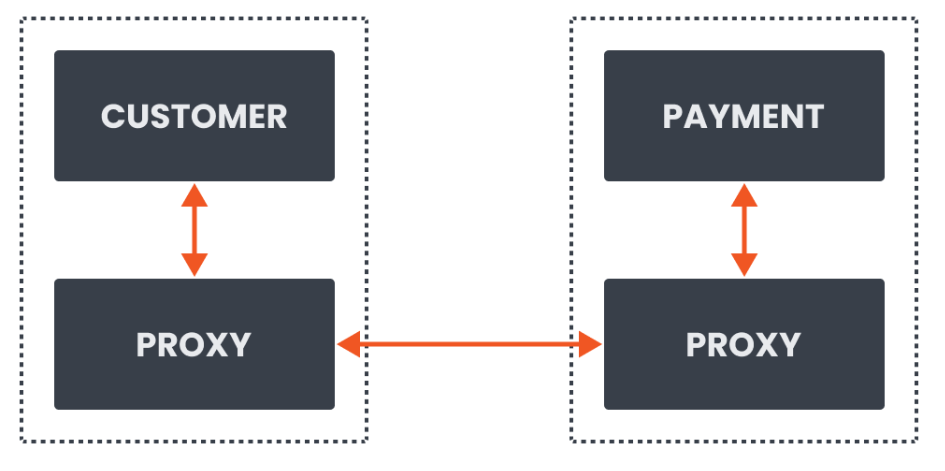
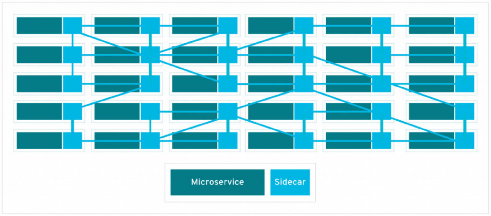
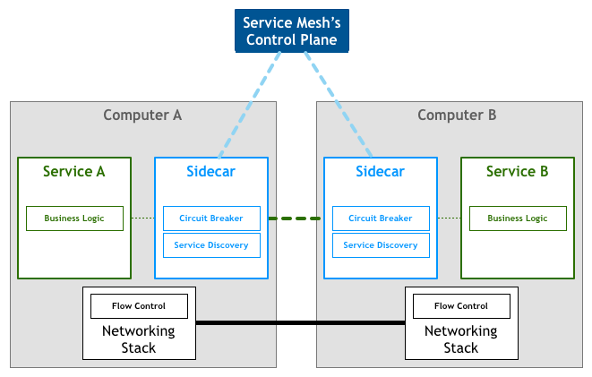

# Istio概述

## 1. 服务网格

`服务网格（Service Mesh）`是处理服务间通信的基础设施层。它负责构成现代云原生应用程序的复杂服务拓扑来可靠地交付请求。在实践中，Service Mesh 通常以轻量级网络代理阵列的形式实现，这些代理与应用程序代码部署在一起，对应用程序来说无需感知代理的存在。

用一句话来解释什么是 Service Mesh？

**应用程序或者说微服务间的 TCP/IP**

> 服务网格就是解决服务间通信问题的。

在我们编写应用程序的时候，通常是不需要关心TCP/IP这一层的，比如使用http协议的restful应用。

服务网格解决的是应用开发者无需关心原本通过服务框架实现的事情，比如Spring Cloud框架，服务网格来帮助处理网络调用，限流，熔断，负载均衡等等。

服务网格通过一个代理来实现，一般代理与服务是部署在一起的，所以我们一般称代理为sidecar边车。

前面CUSTOMER服务和PAYMENT服务直接通信，现在我们通过CUSTOMER代理和PAYMENT代理进行通信，通过代理来拦截所有的入站和出站请求。

> 服务网格做到了，让开发专注于业务，让网格运维专注于网格配置

## 2. 为什么需要服务网格呢？

主要是两点原因：

* 微服务有大量的服务，服务和服务之间通信需要处理大量的无关业务的逻辑，比如超时，重试，熔断，降级，监控，限流等等，虽然这些可以抽取出来形成公共库，但如果服务并不是单一的一门语言，那么这个库需要多次编写，有额外的工作量以及开发效率低下，如果这个服务并不由你控制，那么都无法去控制其通信。
* 开发的时候，不管是应用程序本身还是通信本身，都需要大量的配置，如果调整某些服务，那么就需要对这些服务单独进行配置，极其繁琐。

> 服务网格为我们提供了一种方式，能更好的连接，保护以及观察服务，因为其捕获了网格内的所有通信请求。

服务网格并没有带来新的功能，只是解决了微服务下的一些痛点，之前服务网格一直停留在概念层面，直到容器以及k8s的出现，在云原生的生态下得以快速发展。

代表就是Istio和linkerd。

## 3. Istio介绍

Istio 是一个服务网格的开源实现。官方教程地址：https://istio.io/latest/zh/docs/concepts/what-is-istio/

随着服务网格的规模和复杂性不断的增长，它将会变得越来越难以理解和管理。它的需求包括服务发现、负载均衡、故障恢复、度量和监控等。服务网格通常还有更复杂的运维需求，比如 A/B 测试、金丝雀发布、速率限制、访问控制和端到端认证。

Istio 提供了对整个服务网格的行为洞察和操作控制的能力，以及一个完整的满足微服务应用各种需求的解决方案。

通过负载均衡、服务间的身份验证、监控等方法，Istio 可以轻松地创建一个已经部署了服务的网络，而服务的代码只需很少更改甚至无需更改。通过在整个环境中部署一个特殊的 sidecar 代理为服务添加 Istio 的支持，而代理会拦截微服务之间的所有网络通信，然后使用其控制平面的功能来配置和管理 Istio，这包括：

- 为 HTTP、gRPC、WebSocket 和 TCP 流量自动负载均衡。
- 通过丰富的路由规则、重试、故障转移和故障注入对流量行为进行细粒度控制。
- 可插拔的策略层和配置 API，支持访问控制、速率限制和配额。
- 集群内（包括集群的入口和出口）所有流量的自动化度量、日志记录和追踪。
- 在具有强大的基于身份验证和授权的集群中实现安全的服务间通信。

Istio 为可扩展性而设计，可以满足不同的部署需求。

### 3.1 核心特性

**流量管理**

Istio 简单的规则配置和流量路由允许您控制服务之间的流量和 API 调用过程。Istio 简化了服务级属性（如熔断器、超时和重试）的配置，并且让它轻而易举的执行重要的任务（如 A/B 测试、金丝雀发布和按流量百分比划分的分阶段发布）。

有了更好的对流量的可视性和开箱即用的故障恢复特性，您就可以在问题产生之前捕获它们，无论面对什么情况都可以使调用更可靠，网络更健壮。

**安全**

Istio 的安全特性解放了开发人员，使其只需要专注于应用程序级别的安全。Istio 提供了底层的安全通信通道，并为大规模的服务通信管理认证、授权和加密。有了 Istio，服务通信在默认情况下就是受保护的，可以让您在跨不同协议和运行时的情况下实施一致的策略——而所有这些都只需要很少甚至不需要修改应用程序。

Istio 是独立于平台的，可以与 Kubernetes（或基础设施）的网络策略一起使用。但它更强大，能够在网络和应用层面保护pod到 pod 或者服务到服务之间的通信。

**可观察性**

Istio 健壮的追踪、监控和日志特性让您能够深入的了解服务网格部署。通过 Istio 的监控能力，可以真正的了解到服务的性能是如何影响上游和下游的；而它的定制 Dashboard 提供了对所有服务性能的可视化能力，并让您看到它如何影响其他进程。

Istio 的 Mixer 组件负责策略控制和遥测数据收集。它提供了后端抽象和中介，将一部分 Istio 与后端的基础设施实现细节隔离开来，并为运维人员提供了对网格与后端基础实施之间交互的细粒度控制。

### 3.2 平台支持

Istio 独立于平台，被设计为可以在各种环境中运行，包括跨云、内部环境、Kubernetes、Mesos 等等。您可以在 Kubernetes 或是装有 Consul 的 Nomad 环境上部署 Istio。Istio 目前支持：

- Kubernetes 上的服务部署
- 基于 Consul 的服务注册
- 服务运行在独立的虚拟机上

### 3.3 整合和定制

Istio 的策略实施组件可以扩展和定制，与现有的 ACL、日志、监控、配额、审查等解决方案集成。

### 3.4 Istio组件

Istio 服务网格从逻辑上分为**数据平面**和**控制平面**。

- **数据平面** 由一组智能代理（[Envoy](https://www.envoyproxy.io/)）组成，被部署为 Sidecar。这些代理负责协调和控制微服务之间的所有网络通信。它们还收集和报告所有网格流量的遥测数据。
- **控制平面** 管理并配置代理来进行流量路由。

#### 3.4.1 Envoy

Istio 使用 Envoy 代理的扩展版本。Envoy 是用 C++ 开发的高性能代理，用于协调服务网格中所有服务的入站和出站流量。Envoy 代理是唯一与数据平面流量交互的 Istio 组件。

Envoy 代理被部署为服务的 Sidecar，在逻辑上为服务增加了 Envoy 的许多内置特性，例如：

- 动态服务发现
- 负载均衡
- TLS 终端
- HTTP/2 与 gRPC 代理
- 熔断器
- 健康检查
- 基于百分比流量分割的分阶段发布
- 故障注入
- 丰富的指标

这种 Sidecar 部署允许 Istio 可以执行策略决策，并提取丰富的遥测数据，接着将这些数据发送到监视系统以提供有关整个网格行为的信息。

Sidecar 代理模型还允许您向现有的部署添加 Istio 功能，而不需要重新设计架构或重写代码。

由 Envoy 代理启用的一些 Istio 的功能和任务包括：

- 流量控制功能：通过丰富的 HTTP、gRPC、WebSocket 和 TCP 流量路由规则来执行细粒度的流量控制。
- 网络弹性特性：重试设置、故障转移、熔断器和故障注入。
- 安全性和身份认证特性：执行安全性策略，并强制实行通过配置 API 定义的访问控制和速率限制。
- 基于 WebAssembly 的可插拔扩展模型，允许通过自定义策略执行和生成网格流量的遥测。

#### 3.4.2 Istiod

Istiod 提供服务发现、配置和证书管理。

Istiod 将控制流量行为的高级路由规则转换为 Envoy 特定的配置，并在运行时将其传播给 Sidecar。Pilot 提取了特定平台的服务发现机制，并将其综合为一种标准格式，任何符合 [Envoy API](https://www.envoyproxy.io/docs/envoy/latest/api/api) 的 Sidecar 都可以使用。

Istio 可以支持发现多种环境，如 Kubernetes 或 VM。

您可以使用 Istio [流量管理 API](https://istio.io/latest/zh/docs/concepts/traffic-management/#introducing-istio-traffic-management) 让 Istiod 重新构造 Envoy 的配置，以便对服务网格中的流量进行更精细的控制。

Istiod [安全](https://istio.io/latest/zh/docs/concepts/security/)通过内置的身份和凭证管理，实现了强大的服务对服务和终端用户认证。您可以使用 Istio 来升级服务网格中未加密的流量。使用 Istio，运营商可以基于服务身份而不是相对不稳定的第 3 层或第 4 层网络标识符来执行策略。此外，您可以使用 [Istio 的授权功能](https://istio.io/latest/zh/docs/concepts/security/#authorization)控制谁可以访问您的服务。

Istiod 充当证书授权（CA），并生成证书以允许在数据平面中进行安全的 mTLS 通信。