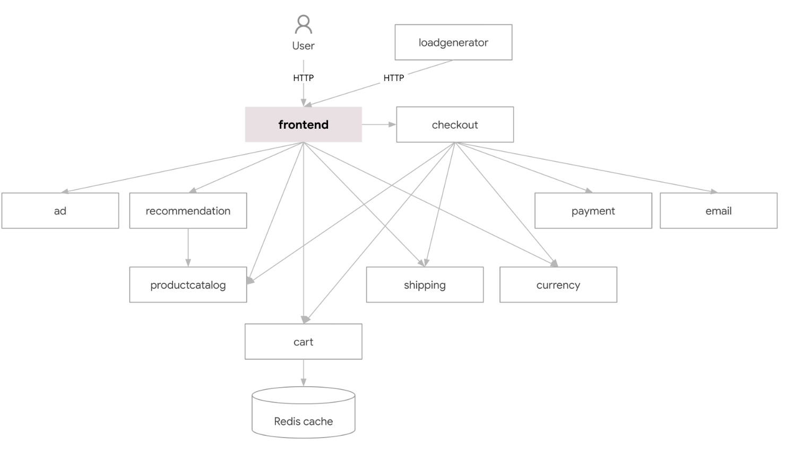

# Istio安装

Istio的安装官方提供了多种方式

* [使用 Istioctl 安装](https://istio.io/latest/zh/docs/setup/install/istioctl/)
* [使用 Helm 安装](https://istio.io/latest/zh/docs/setup/install/helm/)
* [使用 Istio Operator 安装](https://istio.io/latest/zh/docs/setup/install/operator/)

> 三种方式中，Istioctl是社区推荐的方式。Operator方式新特性不会优先考虑，也就是说如果想使用最新版本，不能使用Operator方式。Helm方式符合公共标准，不管是Istioctl，helm，operator方式底层都是使用相同的chart，缺点是Helm方式相对比较复杂

## 1. Istioctl安装

官方文档地址：https://istio.io/latest/zh/docs/setup/install/istioctl/

### 1.1 下载Istio

~~~shell
# 指定版本下载
curl -L https://istio.io/downloadIstio | ISTIO_VERSION=1.15.3 sh -
~~~

目前1.15.3是最新版本，当然在实际生产部署中，不推荐使用最新版本，建议是选择相对稳定的版本

~~~shell
# 设置代理进行下载
[root@master istio]# export https_proxy=http://192.168.124.4:10809
[root@master istio]# curl -L https://istio.io/downloadIstio | ISTIO_VERSION=1.15.3 sh -
  % Total    % Received % Xferd  Average Speed   Time    Time     Time  Current
                                 Dload  Upload   Total   Spent    Left  Speed
100   101  100   101    0     0     57      0  0:00:01  0:00:01 --:--:--    57
100  4856  100  4856    0     0   1540      0  0:00:03  0:00:03 --:--:--  8415

Downloading istio-1.15.3 from https://github.com/istio/istio/releases/download/1.15.3/istio-1.15.3-linux-amd64.tar.gz ...

Istio 1.15.3 Download Complete!
~~~

~~~shell
[root@master istio]# cd istio-1.15.3/
[root@master istio-1.15.3]# ll
total 28
drwxr-x---  2 root root    22 Oct 19 16:36 bin
-rw-r--r--  1 root root 11348 Oct 19 16:36 LICENSE
drwxr-xr-x  5 root root    52 Oct 19 16:36 manifests
-rw-r-----  1 root root   925 Oct 19 16:36 manifest.yaml
-rw-r--r--  1 root root  6016 Oct 19 16:36 README.md
drwxr-xr-x 24 root root  4096 Oct 19 16:36 samples
drwxr-xr-x  3 root root    57 Oct 19 16:36 tools
~~~

- `bin` : 存放 `istioctl` 二进制文件
- `manifests` : istio 的内置 `chart` 目录，默认使用这些内置 chart 生成安装清单，安装过程也可以自行设置 `--manifests=other_manifests/` 参数来指定外部 chart
- `samples` : istio 提供的一些示例应用程序
- `tools` : 一些工具，如 `certs` 用于生成证书

为了方便使用 `istioctl` ，将 `bin` 目录添加到我们的环境变量中：

~~~shell
[root@master istio-1.15.3]#  export PATH=$PWD/bin:$PATH
[root@master istio-1.15.3]# istioctl version
no running Istio pods in "istio-system"
1.15.3
~~~

加入`/etc/profile`永久生效

~~~shell
[root@master istio-1.15.3]# vim /etc/profile
export PATH=/mnt/k8s/istio/istio-1.15.3/bin:$PATH
[root@master istio-1.15.3]# source /etc/profile
~~~

### 1.2 执行安装

~~~shell
## istio提供的几种内置配置，这些配置文件提供了对 Istio 控制平面和 Istio 数据平面 Sidecar 的定制内容。
[root@master istio-1.15.3]# istioctl profile list
Istio configuration profiles:
    default
    demo
    empty
    external
    minimal
    openshift
    preview
~~~

1. **default**：根据 `IstioOperator` API 的默认设置启动组件。 建议用于生产部署和 [Multicluster Mesh](https://istio.io/latest/zh/docs/ops/deployment/deployment-models/#multiple-clusters) 中的 Primary Cluster。

   您可以运行 `istioctl profile dump` 命令来查看默认设置。

2. **demo**：这一配置具有适度的资源需求，旨在展示 Istio 的功能。 它适合运行 [Bookinfo](https://istio.io/latest/zh/docs/examples/bookinfo/) 应用程序和相关任务。 

   此配置文件启用了高级别的追踪和访问日志，因此不适合进行性能测试。

3. **minimal**：与默认配置文件相同，但只安装了控制平面组件。 它允许您使用 [Separate Profile](https://istio.io/latest/zh/docs/setup/upgrade/gateways/#installation-with-istioctl) 配置控制平面和数据平面组件(例如 Gateway)。

4. **remote**：配置 [Multicluster Mesh](https://istio.io/latest/zh/docs/ops/deployment/deployment-models/#multiple-clusters) 的 Remote Cluster。

5. **empty**：不部署任何东西。可以作为自定义配置的基本配置文件。

6. **preview**：预览文件包含的功能都是实验性。这是为了探索 Istio 的新功能。不确保稳定性、安全性和性能（使用风险需自负）。

标注 ✔ 的组件安装在每个配置文件中：

|                        | default | demo | minimal | remote | empty | preview |
| ---------------------- | ------- | ---- | ------- | ------ | ----- | ------- |
| 核心组件               |         |      |         |        |       |         |
| `istio-egressgateway`  |         | ✔    |         |        |       |         |
| `istio-ingressgateway` | ✔       | ✔    |         |        |       | ✔       |
| `istiod`               | ✔       | ✔    | ✔       |        |       | ✔       |

> 这里我们使用demo

~~~shell
[root@master istio-1.15.3]# istioctl profile dump demo
apiVersion: install.istio.io/v1alpha1
kind: IstioOperator
spec:
  components:
    base:
      enabled: true
    cni:
      enabled: false
    egressGateways:
    - enabled: true
      k8s:
        resources:
          requests:
            cpu: 10m
            memory: 40Mi
      name: istio-egressgateway
    ingressGateways:
    - enabled: true
      k8s:
        resources:
          requests:
            cpu: 10m
            memory: 40Mi
        service:
          ports:
          - name: status-port
            port: 15021
            targetPort: 15021
          - name: http2
            port: 80
            targetPort: 8080
          - name: https
            port: 443
            targetPort: 8443
          - name: tcp
            port: 31400
            targetPort: 31400
          - name: tls
            port: 15443
            targetPort: 15443
      name: istio-ingressgateway
    istiodRemote:
      enabled: false
    pilot:
      enabled: true
      k8s:
        env:
        - name: PILOT_TRACE_SAMPLING
          value: "100"
        resources:
          requests:
            cpu: 10m
            memory: 100Mi
  hub: docker.io/istio
  meshConfig:
    accessLogFile: /dev/stdout
    defaultConfig:
      proxyMetadata: {}
    enablePrometheusMerge: true
    extensionProviders:
    - envoyOtelAls:
        port: 4317
        service: opentelemetry-collector.istio-system.svc.cluster.local
      name: otel
  profile: demo
  tag: 1.15.3
  values:
    base:
      enableCRDTemplates: false
      validationURL: ""
    defaultRevision: ""
    gateways:
      istio-egressgateway:
        autoscaleEnabled: false
        env: {}
        name: istio-egressgateway
        secretVolumes:
        - mountPath: /etc/istio/egressgateway-certs
          name: egressgateway-certs
          secretName: istio-egressgateway-certs
        - mountPath: /etc/istio/egressgateway-ca-certs
          name: egressgateway-ca-certs
          secretName: istio-egressgateway-ca-certs
        type: ClusterIP
      istio-ingressgateway:
        autoscaleEnabled: false
        env: {}
        name: istio-ingressgateway
        secretVolumes:
        - mountPath: /etc/istio/ingressgateway-certs
          name: ingressgateway-certs
          secretName: istio-ingressgateway-certs
        - mountPath: /etc/istio/ingressgateway-ca-certs
          name: ingressgateway-ca-certs
          secretName: istio-ingressgateway-ca-certs
        type: LoadBalancer
    global:
      configValidation: true
      defaultNodeSelector: {}
      defaultPodDisruptionBudget:
        enabled: true
      defaultResources:
        requests:
          cpu: 10m
      imagePullPolicy: ""
      imagePullSecrets: []
      istioNamespace: istio-system
      istiod:
        enableAnalysis: false
      jwtPolicy: third-party-jwt
      logAsJson: false
      logging:
        level: default:info
      meshNetworks: {}
      mountMtlsCerts: false
      multiCluster:
        clusterName: ""
        enabled: false
      network: ""
      omitSidecarInjectorConfigMap: false
      oneNamespace: false
      operatorManageWebhooks: false
      pilotCertProvider: istiod
      priorityClassName: ""
      proxy:
        autoInject: enabled
        clusterDomain: cluster.local
        componentLogLevel: misc:error
        enableCoreDump: false
        excludeIPRanges: ""
        excludeInboundPorts: ""
        excludeOutboundPorts: ""
        image: proxyv2
        includeIPRanges: '*'
        logLevel: warning
        privileged: false
        readinessFailureThreshold: 30
        readinessInitialDelaySeconds: 1
        readinessPeriodSeconds: 2
        resources:
          limits:
            cpu: 2000m
            memory: 1024Mi
          requests:
            cpu: 10m
            memory: 40Mi
        statusPort: 15020
        tracer: zipkin
      proxy_init:
        image: proxyv2
        resources:
          limits:
            cpu: 2000m
            memory: 1024Mi
          requests:
            cpu: 10m
            memory: 10Mi
      sds:
        token:
          aud: istio-ca
      sts:
        servicePort: 0
      tracer:
        datadog: {}
        lightstep: {}
        stackdriver: {}
        zipkin: {}
      useMCP: false
    istiodRemote:
      injectionURL: ""
    pilot:
      autoscaleEnabled: false
      autoscaleMax: 5
      autoscaleMin: 1
      configMap: true
      cpu:
        targetAverageUtilization: 80
      enableProtocolSniffingForInbound: true
      enableProtocolSniffingForOutbound: true
      env: {}
      image: pilot
      keepaliveMaxServerConnectionAge: 30m
      nodeSelector: {}
      podLabels: {}
      replicaCount: 1
      traceSampling: 1
    telemetry:
      enabled: true
      v2:
        enabled: true
        metadataExchange:
          wasmEnabled: false
        prometheus:
          enabled: true
          wasmEnabled: false
        stackdriver:
          configOverride: {}
          enabled: false
          logging: false
          monitoring: false
          topology: false
~~~

编写配置清单文件istio-demo-config.yaml

~~~shell
[root@master istio]# vim istio-demo-config.yaml
apiVersion: install.istio.io/v1alpha1
kind: IstioOperator
spec:
  profile: demo
~~~

~~~shell
[root@master istio]# istioctl install -f istio-demo-config.yaml
~~~

等待一段时间，完成安装：

~~~shell
[root@master istio]# istioctl install -f istio-demo-config.yaml 
This will install the Istio 1.15.3 demo profile with ["Istio core" "Istiod" "Ingress gateways" "Egress gateways"] components into the cluster. Proceed? (y/N) y
✔ Istio core installed                                                                                                             
✔ Istiod installed                                                                                                                 
✔ Ingress gateways installed                                                                                                       
✔ Egress gateways installed                                                                                                        
✔ Installation complete                                                                                                            Making this installation the default for injection and validation.

Thank you for installing Istio 1.15.  Please take a few minutes to tell us about your install/upgrade experience!  https://forms.gle/SWHFBmwJspusK1hv6
[root@master istio]# istioctl version
client version: 1.15.3
control plane version: 1.15.3
data plane version: 1.15.3 (2 proxies)
~~~

> 安装完成

~~~shell
[root@master ~]# kubectl -n istio-system get deploy
NAME                   READY   UP-TO-DATE   AVAILABLE   AGE
istio-egressgateway    1/1     1            1           5h18m
istio-ingressgateway   1/1     1            1           5h18m
istiod                 1/1     1            1           5h18m
~~~

~~~shell
[root@master ~]# kubectl -n istio-system get pods
NAME                                   READY   STATUS    RESTARTS   AGE
istio-egressgateway-df6f6d597-qjjrg    1/1     Running   0          5h19m
istio-ingressgateway-577d9994f-8cbgm   1/1     Running   0          5h19m
istiod-64775594cd-x5mx6                1/1     Running   0          5h19m
~~~

### 1.3 启用sidecar注入

如果我们用 `istio-injection=enabled` 标记命名空间，Istio 会自动为我们在该命名空间中创建的所有 Kubernetes Pod 注入 sidecar。

~~~shell
[root@master ~]# kubectl create ns microservice
namespace/microservice created
[root@master ~]# kubectl label namespace microservice istio-injection=enabled
namespace/microservice labeled
~~~

查看是否标记成功：

~~~shell
[root@master ~]# kubectl get namespace -L istio-injection
NAME               STATUS   AGE     ISTIO-INJECTION
calico-apiserver   Active   3d1h    
calico-system      Active   3d20h   
default            Active   3d20h   
devops             Active   2d22h   
gitlab             Active   3d      
harbor             Active   3d1h    
ingress-nginx      Active   3d1h    
istio-system       Active   9h      
kube-node-lease    Active   3d20h   
kube-public        Active   3d20h   
kube-system        Active   3d20h   
microservice       Active   37s     enabled
[root@master ~]# kubectl get namespace -l istio-injection=enabled
NAME           STATUS   AGE
microservice   Active   64s
~~~

在`microservice`命名空间下，创建一个Deployment：

~~~shell
[root@master ~]# kubectl create deployment mynginx --image=hub.c.163.com/library/nginx:latest -n microservice
deployment.apps/mynginx created
~~~

观察创建的pod：

~~~shell
[root@master ~]# kubectl get pods -n microservice
NAME                       READY   STATUS    RESTARTS   AGE
mynginx-86cdf9b547-8vps4   2/2     Running   0          42s
~~~

这里，你会发现有两个容器，一个 `nginx` 容器和一个 `istio-proxy` 容器

~~~shell
[root@master ~]# kubectl describe pod mynginx-86cdf9b547-8vps4 -n microservice
 Normal  Scheduled  85s   default-scheduler  Successfully assigned microservice/mynginx-86cdf9b547-8vps4 to node1
  Normal  Pulled     84s   kubelet            Container image "docker.io/istio/proxyv2:1.15.3" already present on machine
  Normal  Created    84s   kubelet            Created container istio-init
  Normal  Started    84s   kubelet            Started container istio-init
  Normal  Pulling    83s   kubelet            Pulling image "hub.c.163.com/library/nginx:latest"
  Normal  Pulled     58s   kubelet            Successfully pulled image "hub.c.163.com/library/nginx:latest" in 25.722633996s
  Normal  Created    58s   kubelet            Created container nginx
  Normal  Started    57s   kubelet            Started container nginx
  Normal  Pulled     57s   kubelet            Container image "docker.io/istio/proxyv2:1.15.3" already present on machine
  Normal  Created    57s   kubelet            Created container istio-proxy
  Normal  Started    57s   kubelet            Started container istio-proxy
~~~

删除后，其都会删除

~~~shell
[root@master ~]# kubectl delete deployment mynginx -n microservice 
deployment.apps "mynginx" deleted
[root@master ~]# kubectl get pods -n microservice
No resources found in microservice namespace.
~~~

## 2. 实例应用

使用github的这个实例应用：https://github.com/GoogleCloudPlatform/microservices-demo

在线地址：https://onlineboutique.dev/

这是一个云原生微服务架构的商城示例项目。

由 11 个用不同语言编写的微服务组成，服务间通过 gRPC 相互通信。

| 服务                  | 语言          | 说明                                                         |
| :-------------------- | :------------ | :----------------------------------------------------------- |
| frontend              | Go            | 提供一个 HTTP 服务。实现不需要注册/登录并自动为所有用户生成会话 ID |
| cartservice           | C#            | 将用户购物车中的商品存储在 Redis 中并进行检索                |
| productcatalogservice | Go            | 产品列表（来自 JSON 文件）、搜索产品以及获取单个产品         |
| currencyservice       | Node.js       | 将一种货币金额转换为另一种货币。 使用从欧洲中央银行获取的真实值。 这是最高的 QPS 服务 |
| paymentservice        | Node.js       | 用给定的金额向给定的信用卡信息（模拟）收取费用并返回交易 ID  |
| shippingservice       | Go            | 根据购物车提供运费估算。 将物品运送到给定地址（模拟）        |
| emailservice          | Python        | 向用户发送订单确认电子邮件（模拟）                           |
| checkoutservice       | Go            | 检索用户购物车、准备订单并协调付款、运输和电子邮件通知       |
| recommendationservice | Python        | 根据购物车中给出的内容推荐其他产品                           |
| adservice             | Java          | 根据给定的上下文词提供文字广告                               |
| loadgenerator         | Python/Locust | 不断向前端发送模仿真实用户购物流程的请求                     |

下载部署文件，进行k8s部署：

~~~shell
[root@master microservice-demo]# wget https://raw.githubusercontent.com/GoogleCloudPlatform/microservices-demo/main/release/kubernetes-manifests.yaml
[root@master microservice-demo]# ll
total 416
-rw-r--r-- 1 root root 423389 Nov  4 09:29 kubernetes-manifests.yaml
~~~

~~~shell
[root@master microservice-demo]# kubectl create ns microservices-demo
[root@master microservice-demo]# kubectl apply -n microservices-demo -f kubernetes-manifests.yaml
deployment.apps/emailservice created
service/emailservice created
deployment.apps/checkoutservice created
service/checkoutservice created
deployment.apps/recommendationservice created
service/recommendationservice created
deployment.apps/frontend created
service/frontend created
service/frontend-external created
deployment.apps/paymentservice created
service/paymentservice created
deployment.apps/productcatalogservice created
service/productcatalogservice created
deployment.apps/cartservice created
service/cartservice created
deployment.apps/loadgenerator created
deployment.apps/currencyservice created
service/currencyservice created
deployment.apps/shippingservice created
service/shippingservice created
deployment.apps/redis-cart created
service/redis-cart created
deployment.apps/adservice created
service/adservice created
~~~

~~~shell
[root@master microservice-demo]# kubectl get pod -n microservices-demo
NAME                                     READY   STATUS    RESTARTS   AGE
adservice-6fbf9d7bb5-hl2lk               1/1     Running   0          14m
cartservice-85b7fbf97c-p4pkt             1/1     Running   0          14m
checkoutservice-c59c64549-7dhkn          1/1     Running   0          14m
currencyservice-9c56df89f-xw9ln          1/1     Running   0          14m
emailservice-94d448b97-96fvs             1/1     Running   0          14m
frontend-5cd6fb7c77-zxhll                1/1     Running   0          14m
loadgenerator-c46f99f5f-8g7wz            1/1     Running   0          14m
paymentservice-654b4b98d9-smps4          1/1     Running   0          14m
productcatalogservice-697c6cd9c7-mqtg4   1/1     Running   0          14m
recommendationservice-685b8b7c79-m7pmm   1/1     Running   0          14m
redis-cart-799c85c644-pqt5v              1/1     Running   0          14m
shippingservice-d7495c9f-9smnj           1/1     Running   0          14m
[root@master microservice-demo]# kubectl get svc -n microservices-demo   
NAME                    TYPE           CLUSTER-IP       EXTERNAL-IP   PORT(S)        AGE
adservice               ClusterIP      10.98.135.191    <none>        9555/TCP       36s
cartservice             ClusterIP      10.99.27.83      <none>        7070/TCP       36s
checkoutservice         ClusterIP      10.99.236.38     <none>        5050/TCP       36s
currencyservice         ClusterIP      10.103.7.4       <none>        7000/TCP       36s
emailservice            ClusterIP      10.106.218.15    <none>        5000/TCP       36s
frontend                ClusterIP      10.107.175.199   <none>        80/TCP         36s
frontend-external       LoadBalancer   10.105.175.139   <pending>     80:32671/TCP   36s
paymentservice          ClusterIP      10.109.28.210    <none>        50051/TCP      36s
productcatalogservice   ClusterIP      10.109.255.58    <none>        3550/TCP       36s
recommendationservice   ClusterIP      10.102.9.169     <none>        8080/TCP       36s
redis-cart              ClusterIP      10.111.152.83    <none>        6379/TCP       36s
shippingservice         ClusterIP      10.98.18.33      <none>        50051/TCP      36s
~~~

等待所有的pod启动完成，然后通过frontend-external的svc进行访问

### 2.1 启用Istio

将上述微服务升级为服务网格架构，为微服务启用 Istio 支持。

要启用 Istio 支持，只要为 POD 额外注入一个 SideCar 应用。

我们在上面给命名空间`microservice`添加了label `istio-injection=enabled`，所以当我们将pod运行在microservice命名空间下时，就会自动注入sidecar。

将上述的服务删除，重新将其部署在microservice命名空间下

~~~shell
[root@master microservice-demo]# kubectl delete -n microservices-demo -f kubernetes-manifests.yaml     
deployment.apps "emailservice" deleted
service "emailservice" deleted
deployment.apps "checkoutservice" deleted
service "checkoutservice" deleted
deployment.apps "recommendationservice" deleted
service "recommendationservice" deleted
deployment.apps "frontend" deleted
service "frontend" deleted
service "frontend-external" deleted
deployment.apps "paymentservice" deleted
service "paymentservice" deleted
deployment.apps "productcatalogservice" deleted
service "productcatalogservice" deleted
deployment.apps "cartservice" deleted
service "cartservice" deleted
deployment.apps "loadgenerator" deleted
deployment.apps "currencyservice" deleted
service "currencyservice" deleted
deployment.apps "shippingservice" deleted
service "shippingservice" deleted
deployment.apps "redis-cart" deleted
service "redis-cart" deleted
deployment.apps "adservice" deleted
service "adservice" deleted
[root@master microservice-demo]# kubectl apply -n microservice -f kubernetes-manifests.yaml            
deployment.apps/emailservice created
service/emailservice created
deployment.apps/checkoutservice created
service/checkoutservice created
deployment.apps/recommendationservice created
service/recommendationservice created
deployment.apps/frontend created
service/frontend created
service/frontend-external created
deployment.apps/paymentservice created
service/paymentservice created
deployment.apps/productcatalogservice created
service/productcatalogservice created
deployment.apps/cartservice created
service/cartservice created
deployment.apps/loadgenerator created
deployment.apps/currencyservice created
service/currencyservice created
deployment.apps/shippingservice created
service/shippingservice created
deployment.apps/redis-cart created
service/redis-cart created
deployment.apps/adservice created
service/adservice created
~~~

和之前不同的是，我们应该使用 Istio 的入口网关来访问应用，不再需要 `frontend-external` 服务了。

~~~shell
[root@master microservice-demo]# kubectl delete svc frontend-external -n microservice
service "frontend-external" deleted
~~~

~~~shell
[root@master microservice-demo]# kubectl get svc -n istio-system
NAME                   TYPE           CLUSTER-IP      EXTERNAL-IP   PORT(S)                                                                      AGE
istio-egressgateway    ClusterIP      10.111.99.6     <none>        80/TCP,443/TCP                                                               10h
istio-ingressgateway   LoadBalancer   10.97.199.159   <pending>     15021:32040/TCP,80:32376/TCP,443:30965/TCP,31400:31694/TCP,15443:31464/TCP   10h
istiod                 ClusterIP      10.99.214.71    <none>        15010/TCP,15012/TCP,443/TCP,15014/TCP 
~~~

需要为 Istio 声明一些配置，让其可以正确路由到 Online Boutique 应用：

~~~shell
[root@master microservice-demo]# wget https://raw.githubusercontent.com/GoogleCloudPlatform/microservices-demo/main/release/istio-manifests.yaml
[root@master microservice-demo]# kubectl apply -n microservice -f istio-manifests.yaml 
gateway.networking.istio.io/frontend-gateway created
virtualservice.networking.istio.io/frontend-ingress created
serviceentry.networking.istio.io/allow-egress-googleapis created
serviceentry.networking.istio.io/allow-egress-google-metadata created
virtualservice.networking.istio.io/frontend created
~~~

访问效果是一样的，只不过是通过istio访问的。
