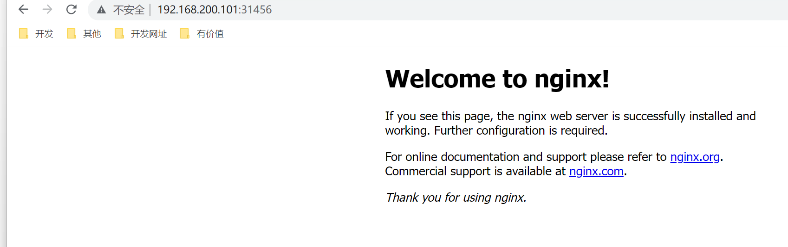

# 可观测性

Istio 为网格内所有的服务通信生成详细的遥测数据。这种遥测技术提供了服务行为的**可观测性**，使运维人员能够排查故障、维护和优化应用程序，而不会给服务的开发人员带来任何额外的负担。通过 Istio，运维人员可以全面了解到受监控的服务如何与其他服务以及 Istio 组件进行交互。

Istio 生成以下类型的遥测数据，以提供对整个服务网格的可观测性：

- [**指标**](https://istio.io/latest/zh/docs/concepts/observability/#metrics)。Istio 基于 4 个监控的黄金标识（延迟、流量、错误、饱和）生成了一系列服务指标。Istio 还为[网格控制平面](https://istio.io/latest/zh/docs/ops/deployment/architecture/)提供了更详细的指标。除此以外还提供了一组默认的基于这些指标的网格监控仪表板。
  - 延迟表示服务一个请求所需的时间。这个指标应该分成成功请求（如 HTTP 200）和失败请求（如 HTTP 500）的延迟。
  - 流量是衡量对系统的需求有多大，它是以系统的具体指标来衡量的。例如，每秒的 HTTP 请求，或并发会话，每秒的检索量，等等。
  - 错误用来衡量请求失败的比率（例如 HTTP 500）。
  - 饱和度衡量一个服务中最紧张的资源有多满。例如，线程池的利用率。
- [**分布式追踪**](https://istio.io/latest/zh/docs/concepts/observability/#distributed-traces)。Istio 为每个服务生成分布式追踪 span，运维人员可以理解网格内服务的依赖和调用流程。
- [**访问日志**](https://istio.io/latest/zh/docs/concepts/observability/#access-logs)。当流量流入网格中的服务时，Istio 可以生成每个请求的完整记录，包括源和目标的元数据。此信息使运维人员能够将服务行为的审查控制到单个[工作负载实例](https://istio.io/latest/zh/docs/reference/glossary/#workload-instance)的级别。


## 1. 指标

指标（Metric）提供了一种以聚合的方式监控和理解行为的方法。

为了监控服务行为，Istio 为服务网格中所有出入网格，以及网格内部的服务流量都生成了指标。这些指标提供了关于行为的信息，例如总流量数、错误率和请求响应时间。

除了监控网格中服务的行为外，监控网格本身的行为也很重要。Istio 组件可以导出自身内部行为的指标，以提供对网格控制平面的功能和健康情况的洞察能力。

### 1.1 代理层面

Istio 指标收集从 sidecar 代理（Envoy）开始。每个代理为通过它的所有流量（入站和出站）生成一组丰富的指标。代理还提供关于它本身管理功能的详细统计信息，包括配置信息和健康信息。

Envoy 生成的指标提供了资源（例如监听器和集群）粒度上的网格监控。因此，为了监控 Envoy 指标，需要了解网格服务和 Envoy 资源之间的连接。

Istio 允许运维人员在每个工作负载实例上选择生成和收集哪个 Envoy 指标。默认情况下，Istio 只支持 Envoy 生成的统计数据的一小部分，以避免依赖过多的后端服务，还可以减少与指标收集相关的 CPU 开销。然而，运维人员可以在需要时轻松地扩展收集到的代理指标集。这支持有针对性地调试网络行为，同时降低了跨网格监控的总体成本。

下面是几个代理级指标的例子。

```shell
envoy_cluster_internal_upstream_rq{response_code_class="2xx",cluster_name="xds-grpc"} 7163

envoy_cluster_upstream_rq_completed{cluster_name="xds-grpc"} 7164

envoy_cluster_ssl_connection_error{cluster_name="xds-grpc"} 0

envoy_cluster_lb_subsets_removed{cluster_name="xds-grpc"} 0

envoy_cluster_internal_upstream_rq{response_code="503",cluster_name="xds-grpc"} 1
```

> 注意你可以从每个 Envoy 代理实例的 `/stats` 端点查看代理级指标。

### 1.2 服务层面

除了代理级别指标之外，Istio 还提供了一组用于监控服务通信的面向服务的指标。这些指标涵盖了四个基本的服务监控需求：延迟、流量、错误和饱和情况。Istio 带有一组默认的[仪表板](https://istio.io/latest/zh/docs/tasks/observability/metrics/using-istio-dashboard/)，用于监控基于这些指标的服务行为。

默认情况下，[标准 Istio 指标](https://istio.io/latest/zh/docs/concepts/observability/(/zh/docs/reference/config/metrics/))会导出到 [Prometheus](https://istio.io/latest/zh/docs/ops/integrations/prometheus/)。

服务级别指标的使用完全是可选的。运维人员可以选择关闭指标的生成和收集来满足自身需要。

~~~shell
 istio_requests_total{
   connection_security_policy="mutual_tls",
   destination_app="hello-world",
   destination_canonical_service="hello-world",
   destination_canonical_revision="v1",
   destination_principal="cluster.local/ns/default/sa/default",
   destination_service="hello-world.default.svc.cluster.local",
   destination_service_name="hello-world",
   destination_service_namespace="default",
   destination_version="v1",
   destination_workload="hello-world-v1",
   destination_workload_namespace="default",
   reporter="destination",
   request_protocol="http",
   response_code="200",
   response_flags="-",
   source_app="hello-web",
   source_canonical_service="hello-web",
   source_canonical_revision="v1",
   source_principal="cluster.local/ns/default/sa/default",
   source_version="v1",
   source_workload="hello-web-v1",
   source_workload_namespace="default"
 } 981

~~~

### 1.3 控制层面

Istio 控制平面还提供了一组自我监控指标。这些指标容许监控 Istio 自己的行为（这与网格内的服务有所不同）。

主要包括pilot，galley等组件指标。

完整指标：https://istio.io/latest/docs/reference/commands/pilot-discovery/#metrics

## 2. 分布式追踪

分布式追踪通过监控流经网格的单个请求，提供了一种监控和理解行为的方法。追踪使网格的运维人员能够理解服务的依赖关系以及在服务网格中的延迟源。

Istio 支持通过 Envoy 代理进行分布式追踪。代理自动为其应用程序生成追踪 span，只需要应用程序转发适当的请求上下文即可。

Istio 支持很多追踪系统，包括 [Zipkin](https://istio.io/latest/zh/docs/tasks/observability/distributed-tracing/zipkin/)、[Jaeger](https://istio.io/latest/zh/docs/tasks/observability/distributed-tracing/jaeger/)、[LightStep](https://istio.io/latest/zh/docs/tasks/observability/distributed-tracing/lightstep/)、[Datadog](https://www.datadoghq.com/blog/monitor-istio-with-datadog/)。运维人员控制生成追踪的采样率（每个请求生成跟踪数据的速率）。这允许运维人员控制网格生成追踪数据的数量和速率。

## 3. 访问日志

访问日志提供了一种从单个工作负载实例的角度监控和理解行为的方法。

Istio 能够以一组可配置的格式为服务流量生成访问日志，使操作员可以完全控制日志记录的方式、内容、时间和地点。

~~~shell
[2019-03-06T09:31:27.360Z] "GET /status/418 HTTP/1.1" 418 - "-" 0 135 5 2 "-" "curl/7.60.0" "d209e46f-9ed5-9b61-bbdd-43e22662702a" "httpbin:8000" "127.0.0.1:80" inbound|8000|http|httpbin.default.svc.cluster.local - 172.30.146.73:80 172.30.146.82:38618 outbound_.8000_._.httpbin.default.svc.cluster.local

~~~

## 4. Prometheus

**Istio 使用 Prometheus 来记录指标，跟踪 Istio 和网格中的应用程序的健康状况**。

要安装 Prometheus，我们可以使用 Istio 安装包中 `/samples/addons` 文件夹中的示例安装。

~~~shell
[root@master istio-1.15.3]# ll
total 28
drwxr-x---  2 root root    22 Oct 19 16:36 bin
-rw-r--r--  1 root root 11348 Oct 19 16:36 LICENSE
drwxr-xr-x  5 root root    52 Oct 19 16:36 manifests
-rw-r-----  1 root root   925 Oct 19 16:36 manifest.yaml
-rw-r--r--  1 root root  6016 Oct 19 16:36 README.md
drwxr-xr-x 24 root root  4096 Oct 19 16:36 samples
drwxr-xr-x  3 root root    57 Oct 19 16:36 tools
[root@master istio-1.15.3]# cd samples/
[root@master samples]# ls
addons    cicd              external      helloworld  kind-lb          open-telemetry  README.md  tcp-echo
bookinfo  custom-bootstrap  grpc-echo     httpbin     kubernetes-blog  operator        security   websockets
certs     extauthz          health-check  jwt-server  multicluster     ratelimit       sleep
[root@master samples]# cd addons/
[root@master addons]# ls
extras  grafana.yaml  jaeger.yaml  kiali.yaml  prometheus.yaml  README.md
~~~

prometheus.yaml是安装prometheus的yaml文件


命名空间是`istio-system`

~~~shell
[root@master addons]# kubectl apply -f prometheus.yaml 
serviceaccount/prometheus created
configmap/prometheus created
clusterrole.rbac.authorization.k8s.io/prometheus created
clusterrolebinding.rbac.authorization.k8s.io/prometheus created
service/prometheus created
deployment.apps/prometheus created
[root@master addons]# kubectl get deploy -n istio-system 
NAME                   READY   UP-TO-DATE   AVAILABLE   AGE
istio-egressgateway    1/1     1            1           22h
istio-ingressgateway   1/1     1            1           22h
istiod                 1/1     1            1           22h
prometheus             1/1     1            1           3h27m
[root@master addons]# kubectl get pod -n istio-system -o wide 
NAME                                   READY   STATUS    RESTARTS      AGE     IP               NODE    NOMINATED NODE   READINESS GATES
istio-egressgateway-df6f6d597-dcfdq    1/1     Running   1 (11h ago)   22h     10.244.166.181   node1   <none>           <none>
istio-ingressgateway-577d9994f-jh2gz   1/1     Running   1 (11h ago)   22h     10.244.166.188   node1   <none>           <none>
istiod-64775594cd-zd7vk                1/1     Running   1 (11h ago)   22h     10.244.166.159   node1   <none>           <none>
prometheus-6549d6bdcc-fcbn5            2/2     Running   0             3h27m   10.244.166.184   node1   <none>           <none>
~~~


可以看到prometheus运行起来了

访问，需求修改svc为NodePort：

~~~shell
[root@master addons]# kubectl get service -n istio-system -o wide 
NAME                   TYPE           CLUSTER-IP       EXTERNAL-IP   PORT(S)                                                                      AGE     SELECTOR
prometheus             ClusterIP      10.104.23.188    <none>        9090/TCP                                                                     3h28m   app=prometheus,component=server,release=prometheus
[root@master addons]# kubectl edit service prometheus -n istio-system
...
  type: NodePort
...
[root@master addons]# kubectl get service -n istio-system -o wide        
NAME                   TYPE           CLUSTER-IP       EXTERNAL-IP   PORT(S)                                                                      AGE     SELECTOR
prometheus             NodePort       10.104.23.188    <none>        9090:31244/TCP                                                               3h30m   app=prometheus,component=server,release=prometheus
~~~

访问：http://192.168.200.101:31244/


> 又看到熟悉的Prometheus的界面了

我们部署一个测试应用，来去观察Prometheus中的指标

~~~shell
[root@master addons]# kubectl create deployment nginx --image=hub.c.163.com/library/nginx:latest -n microservice
deployment.apps/nginx created
[root@master addons]# kubectl expose deployment nginx --type=NodePort --name=nginxsvc --port=80 -n microservice
service/nginxsvc exposed
[root@master addons]# kubectl get pods -n microservice
NAME                     READY   STATUS    RESTARTS   AGE
nginx-84bf5c6c49-fxbzw   2/2     Running   0          23s
[root@master addons]# kubectl get svc -n microservice    
NAME       TYPE       CLUSTER-IP   EXTERNAL-IP   PORT(S)        AGE
nginxsvc   NodePort   10.98.2.27   <none>        80:31456/TCP   12s
~~~

访问：http://192.168.200.101:31456/



在Prometheus中输入`istio_requests_total`


## 5. Grafana

通过 Grafana，我们可以**监控 Istio 和服务网格中运行的应用程序的健康状况**。

可以使用 `grafana.yaml` 来部署带有预配置仪表盘的 Grafana 示例安装。该 YAML 文件在 Istio 安装包的 `/samples/addons` 下。

~~~shell
[root@master addons]# kubectl apply -f grafana.yaml 
serviceaccount/grafana created
configmap/grafana created
service/grafana created
deployment.apps/grafana created
configmap/istio-grafana-dashboards created
configmap/istio-services-grafana-dashboards created
[root@master addons]# kubectl get pod -n istio-system
NAME                                   READY   STATUS    RESTARTS      AGE
grafana-96dd4774d-d2fr9                1/1     Running   0             29s
~~~

Kubernetes 将 Grafana 部署在 `istio-system` 命名空间

~~~shell
# 需要修改其为NodePort来外部访问
[root@master addons]#  kubectl get service -n istio-system 
NAME                   TYPE           CLUSTER-IP       EXTERNAL-IP   PORT(S)                                                                      AGE
grafana                ClusterIP      10.107.229.157   <none>        3000/TCP 
[root@master addons]# kubectl edit service grafana -n istio-system
[root@master addons]#  kubectl get service -n istio-system         
NAME                   TYPE           CLUSTER-IP       EXTERNAL-IP   PORT(S)                                                                      AGE
grafana                NodePort       10.107.229.157   <none>        3000:32393/TCP 
~~~

访问http://192.168.200.101:32393/


Istio Control Plane Dashboard 仪表盘向我们展示控制平面的资源使用情况（内存、CPU、磁盘、Go routines），以及关于 Pilot、Envoy 和 Webhook 的信息。


**Istio 网格仪表盘**（Istio Mesh Dashboard）为我们提供了在网格中运行的所有服务的概览。仪表盘包括全局请求量、成功率以及 4xx 和 5xx 响应的数量。


**Istio 性能仪表盘**（Istio Performance Dashboard）向我们展示了 Istio 主要组件在稳定负载下的资源利用率。


**Istio 服务仪表盘**（Istio Service Dashboard）允许我们在网格中查看服务的细节。

我们可以获得关于请求量、成功率、持续时间的信息，以及显示按来源和响应代码、持续时间和大小的传入请求的详细图表。


**Istio Wasm 扩展仪表盘**（Istio Wasm Extension Dashboard）显示与 WebAssembly 模块有关的指标。从这个仪表盘，我们可以监控活动的和创建的 Wasm 虚拟机，关于获取删除 Wasm 模块和代理资源使用的数据


**Istio 工作负载仪表盘**（Istio Workload Dashboard）为我们提供了一个工作负载的详细指标分类


## 6. Zipkin

[Zipkin](http://zipkin.io/) 是一个分布式追踪系统。

分布式追踪，也称为分布式请求追踪，是一种用于分析和监视应用程序的方法，特别是那些使用微服务体系结构构建的应用程序。

分布式追踪有助于查明故障发生的位置以及导致性能低下的原因，开发人员可以使用分布式跟踪来帮助调试和优化他们的代码。

**每当一个请求进入服务网格时，Envoy 都会生成一个唯一的请求 ID 和追踪信息，并将其作为 HTTP 头的一部分来存储**。任何应用程序都可以将这些头信息转发给它所调用的其他服务，以便在系统中创建一个完整的追踪。

> 尽管所有的请求都要经过 Istio sidecar，但 Istio 没有办法将出站请求与产生这些请求的入站请求联系起来。通过在应用程序中传播相关的头信息可以帮助 Zipkin 将这些跟踪信息拼接起来。

Istio 依赖于 B3 跟踪头（以 `x-b3` 开头的 header）和 Envoy 生成的请求 ID（`x-request-id`）。B3 头信息用于跨服务边界的跟踪上下文传播。

以下是我们需要在我们的应用程序中对每个发出的请求进行传播的特定头文件名称：

~~~shell
 x-request-id
 x-b3-traceid
 x-b3-spanid
 x-b3-parentspanid
 x-b3-sampled
 x-b3-flags
 b3
~~~

安装Zipkin，可以使用 addons 文件夹中的 `zipkin.yaml` 文件。

~~~shell
[root@master addons]# cd extras/
[root@master extras]# ls
prometheus-operator.yaml  prometheus_vm_tls.yaml  prometheus_vm.yaml  zipkin.yaml
[root@master extras]# kubectl apply -f zipkin.yaml 
deployment.apps/zipkin created
service/tracing created
service/zipkin created
[root@master extras]# kubectl get pod -n istio-system 
NAME                                   READY   STATUS    RESTARTS      AGE
zipkin-69c6898b88-l2c84                1/1     Running   0             31s
~~~

同样，将svc的类型改为NodePort访问

~~~shell
[root@master extras]# kubectl edit service zipkin -n istio-system 
[root@master extras]# kubectl get svc -n istio-system
NAME                   TYPE           CLUSTER-IP       EXTERNAL-IP   PORT(S)                                                                      AGE
grafana                NodePort       10.107.229.157   <none>        3000:32393/TCP                                                               21m
istio-egressgateway    ClusterIP      10.107.223.169   <none>        80/TCP,443/TCP                                                               23h
istio-ingressgateway   LoadBalancer   10.106.242.96    <pending>     15021:32522/TCP,80:30539/TCP,443:31132/TCP,31400:30377/TCP,15443:30383/TCP   23h
istiod                 ClusterIP      10.96.227.243    <none>        15010/TCP,15012/TCP,443/TCP,15014/TCP                                        23h
prometheus             NodePort       10.104.23.188    <none>        9090:31244/TCP                                                               4h1m
tracing                ClusterIP      10.107.234.18    <none>        80/TCP                                                                       116s
zipkin                 NodePort       10.109.25.63     <none>        9411:31326/TCP  
~~~

访问：http://192.168.200.101:31326/


## 7. Kiali

[Kiali](https://www.kiali.io/)  是一款 istio 服务网格可视化工具，提供了服务拓补图、全链路跟踪、指标遥测、配置校验、健康检查等功能。

安装 Kiali，使用 addons 文件夹中的 `kiali.yaml` 文件：

~~~shell
[root@master addons]# ls
extras  grafana.yaml  jaeger.yaml  kiali.yaml  prometheus.yaml  README.md
[root@master addons]# kubectl apply -f kiali.yaml 
serviceaccount/kiali created
configmap/kiali created
clusterrole.rbac.authorization.k8s.io/kiali-viewer created
clusterrole.rbac.authorization.k8s.io/kiali created
clusterrolebinding.rbac.authorization.k8s.io/kiali created
role.rbac.authorization.k8s.io/kiali-controlplane created
rolebinding.rbac.authorization.k8s.io/kiali-controlplane created
service/kiali created
deployment.apps/kiali created
[root@master addons]# kubectl get pod -n istio-system 
NAME                                   READY   STATUS    RESTARTS      AGE
kiali-575f548888-kkrgn                 1/1     Running   0             30s
[root@master addons]# kubectl get svc -n istio-system    
NAME                   TYPE           CLUSTER-IP       EXTERNAL-IP   PORT(S)                                               23h
kiali                  ClusterIP      10.103.120.89    <none>        20001/TCP,9090/TCP 
~~~

同样，将其修改为NodePort来进行外部访问

~~~shell
[root@master addons]# kubectl edit service kiali -n istio-system
[root@master addons]# kubectl get svc -n istio-system            
NAME                   TYPE           CLUSTER-IP       EXTERNAL-IP   PORT(S)                                                                      AGE
kiali                  NodePort       10.103.120.89    <none>        20001:30045/TCP,9090:31042/TCP                                               106s
~~~

访问：http://192.168.200.101:30045/


