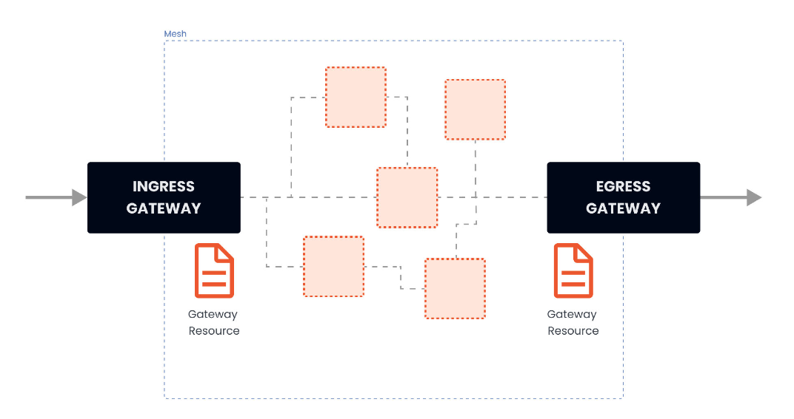

# 流量管理

## 1. Gateway

在安装 Istio 的时候，安装了入口和出口网关。**这两个网关实际都运行了一个 Envoy 代理实例，它们在网格的边缘作为负载均衡器运行。入口网关接收入站连接，而出口网关接收从集群出去的连接**。

使用入口网关，我们可以对进入集群的流量应用路由规则。

我们可以有一个指向入口网关的单一外部 IP 地址，并根据Header将流量路由到集群内的不同服务。

使用 Gateway 资源来配置网关。

下面是一个网关资源的例子：

~~~yaml
 apiVersion: networking.istio.io/v1alpha3
 kind: Gateway
 metadata:
   name: my-gateway
   namespace: default
 spec:
   selector:
     istio: ingressgateway
   servers:
   - port:
       number: 80
       name: http
       protocol: HTTP
     hosts:
     - dev.example.com
     - test.example.com

~~~

网关资源描述了负载均衡器的`暴露端口`、`协议`、`SNI`配置等。

| GateWay字段名称                    | 字段含义                                                     |
| ---------------------------------- | ------------------------------------------------------------ |
| metadata.name                      | Gateway 名称                                                 |
| metadata.namespace                 | Gateway 命名空间                                             |
| spec.selector                      | Gateway 使用填写的标签键值对匹配配置下发的边缘代理网关实例   |
| spec.servers.port.number           | 端口                                                         |
| spec.servers.port.protocol         | 通信协议，支持：HTTP, HTTPS, GRPC, HTTP2, MONGO, TCP, TLS，请注意同一网关同一端口的协议配置需要保持一致。 |
| spec.servers.port.name             | 端口名称                                                     |
| spec.severs.hosts                  | 域名，支持通配符 *                                           |
| spec.servers.tls.httpsRedirect     | 值为 true 时，边缘代理网关会对所有 http 请求返回 301 重定向，要求客户端发起 https 请求 |
| spec.servers.tls.mode              | 配置当前端口的 TLS 安全认证模式，如需要开启当前端口的安全认证则需要填写。支持：PASSTHROUGH, SIMPLE, MUTUAL, AUTO_PASSTHROUGH, ISTIO_MUTUAL |
| spec.servers.tls.credentialName    | 配置发现 TLS 证书密钥的 secret 的名称                        |
| spec.servers.tls.serverCertificate | 设置端口的 TLS 证书密钥通过 file mount 形式（不推荐，推荐采用填写 credentialName 字段加载证书私钥）挂载时需要填写的证书路径字段，Istio 默认使用网关所在命名空间下 istio-ingressgateway-certs secret 加载证书至路径 /etc/istio/ingressgateway-certs |
| spec.servers.tls.privateKey        | 设置端口的 TLS 证书密钥通过 file mount 形式（不推荐，推荐采用填写 credentialName 字段加载证书私钥）挂载时需要填写的私钥路径字段，Istio 默认使用网关所在命名空间下 istio-ingressgateway-certs secret 加载私钥至路径 /etc/istio/ingressgateway-certs |
| spec.servers.tls.caCertificates    | 设置端口的 TLS 证书密钥通过 file mount 形式（不推荐，推荐采用填写 credentialName 字段加载证书私钥）挂载时需要填写的跟证书路径字段，Istio 默认使用网关所在命名空间下 istio-ingressgateway-ca-certs 加载根证书至路径 /etc/istio/ingressgateway-ca-certs，双向认证时需要配置根证书 |

> SNI，即服务器名称指示，是TLS协议的扩展。它指示在“握手”过程开始时浏览器正在联系哪个主机名；允许服务器为多个站点安全地托管多个SSL证书，多个网站存在于同一IP地址上。

上述配置文件的解释：

* 配置了一个代理，做为负载均衡器
* 为入口暴露80端口
* 配置应用于istio入口网关代理
* `hosts` 字段作为一个过滤器，只有以 `dev.example.com` 和 `test.example.com` 为目的地的流量会被允许通过。

**为了控制和转发流量到集群内运行的实际 Kubernetes 服务，我们必须用特定的主机名（例如 `dev.example.com` 和 `test.example.com`）配置一个VirtualService，然后将网关连接到它**。

### 1.1 简单路由实例

部署一个tomcat，并通过istio网关进行访问。

tomcatdeploy.yaml ：

~~~yaml
apiVersion: apps/v1
kind: Deployment
metadata:
  creationTimestamp: null
  labels:
    app: tomcat
  name: tomcat
  namespace: microservice
spec:
  replicas: 1
  selector:
    matchLabels:
      app: tomcat
  strategy: {}
  template:
    metadata:
      creationTimestamp: null
      labels:
        app: tomcat
    spec:
      containers:
      - image: hub.c.163.com/library/tomcat:latest
        imagePullPolicy: IfNotPresent
        name: tomcat
        ports:
          - containerPort: 8080
        resources: {}
~~~

创建一个tomcat service，tomcatsvc.yaml ：

~~~yaml
apiVersion: v1
kind: Service
metadata:
  creationTimestamp: null
  labels:
    app: tomcat
  name: tomcat
  namespace: microservice
spec:
  ports:
  - port: 80
    name: tcp
    protocol: TCP
    targetPort: 8080
  selector:
    app: tomcat
status:
  loadBalancer: {}
~~~

部署一个Gateway资源：

ingressgateway80.yaml

~~~yaml
apiVersion: networking.istio.io/v1alpha3
kind: Gateway
metadata:
  name: ingressgateway80
spec:
  selector:
    istio: ingressgateway
  servers:
    - port:
        number: 80
        name: http
        protocol: HTTP
      hosts:
        - '*'
~~~

> 这设置*，可以使用ip地址来访问入口网关，如果配置为具体域名，需要修改hosts文件（真实域名需要修改A记录）

现在还没有绑定**VirtualService**，所以网关还不知道将流量路由到哪里，为 `tomcat` 服务创建一个 VirtualService，并将其绑定到 Gateway 资源上：

tomcat-virtualservice.yaml：

~~~yaml
apiVersion: networking.istio.io/v1alpha3
kind: VirtualService
metadata:
  name: tomcat-virtualservice
spec:
  hosts:
    - "*"  
  gateways: #把VirtualService绑定到ingressgateway80这个网关
    - ingressgateway80
  http:
    - route: #表示路由到tomcat这个service，microservice表示命名空间
        - destination:
            host: tomcat.microservice.svc.cluster.local
            port:
              number: 80
~~~

访问：curl -v 网关外部ip:80

> 注意其中的header，其中有一个server=istio-envoy，这表明请求经过了envoy代理

## 2. VirtualService详解

使用 VirtualService 资源在 Istio 服务网格中进行流量路由。通过 VirtualService，我们可以定义流量路由规则，并在客户端试图连接到服务时应用这些规则。

具体的配置含义：

| VirtualService字段名称  | 字段说明                                                     |
| :---------------------: | :----------------------------------------------------------- |
|       spec.hosts        | 定义路由规则关联一组的 hosts，可以是带有通配符的 DNS 名称或者 IP 地址（IP 地址仅能应用于来源流量为边缘代理网关）。该字段能应用于 HTTP 和 TCP 流量。在 Kubernetes 环境中，可以使用 service 的名称作为缩写，Istio 会按照 VirtualService所在 namespace 补齐缩写，例如在 default namespace 的 VirtualService 包含 host 缩写 reviews 会被补齐为 reviews.default.svc.cluster.local。为避免误配置，推荐填写 host 全称 |
|      spec.gateways      | 定义应用路由规则的来源流量，可以是一个或多个网关，或网格内部的 sidecar，指定方式为 <gateway namespace>/<gateway name>，保留字段 mesh 表示网格内部所有的 sidecar，当该参数缺省时，会默认填写 mesh，即该路由规则的来源流量为网格内部所有 sidecar |
|        spec.http        | 定义一组有序的（优先匹配靠前的路由规则）应用于 HTTP 流量的路由规则，HTTP 路由规则会应用于网格内部的 service 端口命名为 http-, http2-, grpc- 开头的流量以及来自 gateway 的协议为 HTTP, HTTP2, GRPC, TLS-Terminated-HTTPS 的流量 |
|     spec.http.match     | 定义路由的匹配规则列表，单个匹配规则项内所有条件是且关系，列表中多个匹配规则之间为或关系 |
|     spec.http.route     | 定义路由转发目的地列表，一条 HTTP 路由可以是重定向或转发（默认），转发的目的地可以是一个或多个服务（服务版本）。同时也可以配置权重、header 操作等行为 |
|   spec.http.redirect    | 定义路由重定向，一条 HTTP 路由可以是重定向或转发（默认），如规则中指定了 passthrough 选项，route、redirect 均会被忽略。可将 HTTP 301 重定向到另外的 URL 或 Authority |
|    spec.http.rewrite    | 定义重写 HTTP URL 或 Authority headers，不能与重定向同时配置，重写操作会在转发前执行 |
|    spec.http.timeout    | 定义 HTTP 请求的超时时间                                     |
|    spec.http.retries    | 定义 HTTP 请求的重试策略                                     |
|     spec.http.fault     | 定义 HTTP 流量的故障注入策略，开启时超时和重试策略不会开启   |
|    spec.http.mirror     | 定义将 HTTP 流量复制到另一个指定的目的端，被复制的流量按照“best effort”原则，sidecar/网关不会等待复制流量的响应结果就会从源目的端返回响应。镜像流量的目的服务端会产生监控指标。 |
| spec.http.mirrorPercent | 定义流量镜像的复制百分比，缺省时复制100%的流量。最大值为100  |
|  spec.http.corsPolicy   | 定义 CORS 策略（跨域资源共享，Cross-Origin Resource Sharing，CORS） |
|    spec.http.headers    | 定义 header 操作规则，包括 request 和 response header 的更新，增加，移除操作 |
|        spec.tcp         | 定义一组有序的（优先匹配靠前的路由规则）应用于 TCP 流量的路由规则，该路由规则会应用于任何非 HTTP 和 TLS 的端口 |
|     spec.tcp.match      | 定义 TCP 流量路由的匹配规则列表，单个匹配规则项内所有条件是且关系，列表中多个匹配规则之间为或关系 |
|     spec.tcp.route      | 定义 TCP 连接转发的目的端                                    |
|        spec.tls         | 定义一组有序的（优先匹配靠前的路由规则）应用于未终止的 TLS 或 HTTPS 流量的路由规则，该路由规则会应用于网格内部的 service 端口命名为 https-，tls- 开头的流量，来自 gateway 的端口协议为 HTTPS, TLS 的未终止加密流量，Service Entry 使用 HTTPS, TLS 协议的端口。当 https-, tls- 端口未关联 VirtualService 规则时将会被视为 TCP 流量 |
|     spec.tls.match      | 定义 TLS 流量路由的匹配规则列表，单个匹配规则项内所有条件是且关系，列表中多个匹配规则之间为或关系 |
|     spec.tls.route      | 定义连接转发的目的端                                         |

### 2.1 route详解

HTTPRoute规则的功能是：满足HTTPMatchRequest条件的流量都被路由到`HTTPRouteDestination`，执行`重定向（HTTPRedirect`）、`重写（HTTPRewrite）`、`重试（HTTPRetry`）、`故障注入（HTTPFaultInjection）`、`跨站（CorsPolicy）策略`等。HTTPRoute不仅可以做路由匹配，还可以做一些写操作来修改请求本身。

### 2.2 match

match是进行路由的匹配条件。

其支持以下一些字段的定义：

* uri、scheme、method、authority：这四个字段都是StringMatch类型，匹配请求时都支持exact、prefix和regex三种模式的匹配。、

  ~~~yaml
  - match:
    # 代表匹配uri以advertisment开头的请求
    - uri:
        prefix: "/advertisment"  
  ~~~

* headers：匹配请求中的Header，是一个map类型。map的key是字符串类型，value是StringMatch类型。即对于每一个Header的值，都可以使用精确、前缀和正则三种方式进行匹配。

  ~~~yaml
  - match:
  # 匹配header key为source value为north
    - headers:
      source:
        exact: north
  ~~~

* port：表示请求服务的端口。大部分服务只开放一个端口，这也是在微服务中推荐的做法，在这种场景下可以不指定port；

* sourceLabels：是一个map类型的键值对，表示请求来源负载匹配标签。这在很多情况有用，可以对一组服务都打一个相同的标签，然后使用sourceLabels字段对这些服务实施相同的流量规则。在Kubernetes平台上，这里的Label就是Pod上的标签。

  ~~~yaml
  http:
  - match:    
    - sourceLabels:
        app: testA
        version: v2   
  ~~~

* gateway：表示规则应用的Gateway名称，语义同VirtualService 上面的gateway定义，是一个更细的Match条件，会覆盖在VirtualService上配置的gateway。

> 在VirtualService中match字段都是数组类型。HTTPMatchRequest中的诸多属性如uri、header、method等都是“与”逻辑，而数组中几个元素间关系是“或”逻辑。

例子：

~~~yaml
- match:
  - heraders:
      source:
        exact: north
    uri:
      prefix: "/advertisment"
  - uri:
      prefix: "/forecast"    
~~~

match包含两个HTTPMatchRequest元素，其条件的语义是：headers中的source取值为“north”，且uri以“/advertisment”开头的请求，或者uri以“/forecast”开头的请求。

### 2.3 路由目标(RouteDestination)

route字段是一个HTTPRouteDestination类型的数组，表示满足条件的流量目标。

在HTTPRouteDestination中主要有三个字段：`destination`（请求目标）、`weight`（权重）、和`headers`（HTTP头操作），destination是必选字段。

* destination: 这个字段是一个Destination类型结构，通过host、subset和port三个属性来描述。表示最终将流量路由到此目标。`host`是Destination必选字段，表示在Istio中注册的服务名，建议写全域名。`subset`表示在host上定义的一个子集。例如，在灰度发布中将版本定义为subset，配置路由策略会将流量转发到不同版本的subset上。

  ~~~yaml
  .....
  spec:
    hosts:
    - forecast
    http:
    - route:
      - destination:
          host: forecast
          subset: v2
      - destination:
          host: forecast
          subset: v1
  
  ~~~

* weight: 表示流量分配的比例，在一个route下多个destination的weight总和要求是100。默认100，必填字段。

  示例：从原有的v1版本中切分20%的流量到v2版本，这也是灰度发布常用的一个流量策略，即不区分内容，平等的从总流量中切出一部分流量给新版本。

  ~~~yaml
  .....
  spec:
    hosts:
    - forecast
    http:
    - route:
      - destination:
          host: forecast
          subset: v2
        weight: 20
      - destination:
          host: forecast
          subset: v1
        weight: 80    
  
  ~~~

* headers：提供了对HTTP header的一种操作机制，可以修改一次HTTP请求中的Request或Response的值，包含request和response两个字段。

  * request：表示在发请求给目标地址时修改Request的header。
  * response：表示在返回应答时修改Response的header
  * 对应的类型都是HeaderOperations类型，使用set、add、remove字段来定义对Header的操作。
    * set：使用map上的key和value覆盖Request和Response中对应的Header
    * add：追加map上的key和value到原有的Header
    * remove：删除在列表中华指定的Header

### 2.4 HTTP重定向（HTTPRedirect）

Istio对于HTTP除了做流量路由，还可以做适当的其他操作，很多原来需要在代码中进行的HTTP操作，在使用Istio后通过这些配置都可以达到同样的效果。

通过HTTPRedirect可以发送一个301重定向的应答给服务调用方，简单讲就是从一个URL到另外一个URL的永久重定向。用户输入一个URL，通过HTTPRedirect可以将其跳转到另一个URL。比较常见的场景：有一个在线网站，网址变了，通过这样的重定向，可以在用户输入老地址时跳转到新地址。
比如：

* 用户请求老地址：http://forecast/advertisement
* 服务端返回301重定向新地址 http://new-forecast/recommendation/activity
* 用户请求新地址http://new-forecast/recommendation/activity
* 得到新地址
  

HTTPRedirect包括两个重要的字段来表示重定向的目标。

* uri：替换URL中的uri部分
* authority：替换URL中的Authority部分

示例：

~~~yaml
apiVersion:networking.istio.io/v1alpha3
kind: VirtualService
metadata:
  name: forecast
  namespace: weather
spec:
  hosts:
  - forecast
  http:
  - match:
    - uri: 
        prefix: /advertisement
    redirect:
      uri: /recommendation/activity
      authority: new-forecast    

~~~

对forecast服务所有前缀是`/advertisement`的请求都会被重定向到new-forecast的`/recommendation/activity`地址。

### 2.5 HTTP重写（HTTPRewrite）

通过HTTP重写可以在将请求转发给目标服务前修改HTTP请求中指定部分的内容，不同于重定向，用户是可见，HTTP重写对用户是不可见的，因为是在服务端进行的。

和重定向配置类似，重写HTTP也包括uri和authority这两个字段。

- uri：重写URL中的Path部分
- authority：重写URL中的Authority

和HTTPRedirect规则稍有不同的是，HTTPRedirect的uri只能替换全部的Path，HTTPRewrite的uri是可以重写前缀的，即如果原来匹配条件是前缀匹配，则修改后只修改匹配到的前缀。

示例：

~~~yaml
apiVersion: networking.istio.io/v1alpha3
kind: VirtualService
metadata:
  name: forecast
  namespace: weather
spec:
  hosts:
  - forecast
  http:
  - match:
    - uri:
        prefix: /advertisement
    rewrite:
      uri: /recommendation/activity
    route:
    - destination:
        host: forecast   

~~~

前缀匹配`/advertisement`的请求，其请求uri中的这部分前缀会被`/recommendation/activity`替换

### 2.6 HTTP重试（HTTPRetry）

HTTP重试是解决很多请求异常最直接、简单的方法，尤其是在工作环境比较复杂的场景下，可提高总体的服务质量。

但是重试使用不当也会有问题，最糟糕的情况是重试一直不成功，反而增加延迟和性能开销。所以，根据系统运行环境、服务自身特点，配置适当的重试规则显得尤为重要。

HTTPRetry可以定义请求失败时的重试策略，重试策略包括重试次数、超时、重试条件等，这里分别描述相应的三个字段。

- attempts：必选字段，定义重试的次数
- perTryTimeout：每次重试超时的时间，单位可以是ms、s、m和h
- retryOn：进行重试的条件，可以是多个条件，以逗号分隔

其中重试条件retryOn的取值可以包括以下几种:

- 5xx：在上游服务返回5xx应答码，或者在没有返回时重试
- gateway-error：类似于5xx异常，只对502、503和504应答码进行重试。
- connect-failure：在链接上游服务失败时重试 
- retriable-4xx：在上游服务返回可重试的4xx应答码时执行重试。
- refused-stream：在上游服务使用REFUSED_STREAM错误码重置时执行重试。
- cancelled：gRPC应答的Header中状态码是cancelled时执行重试。
- deadline-exceeded：在gRPC应答的Header中状态码是deadline-exceeded时执行重试
- internal：在gRPC应答的Header中状态码是internal时执行重试
- resource-exhausted：在gRPC应答的Header中状态码是resource-exhausted时执行重试
- unavailable：在gRPC应答的Header中状态码是unavailable时执行重试。

示例：

配置了一个重试策略，在`5xx,connect-failure`条件下进行最多5次重试，每次重试超时为3秒

~~~yaml
apiVersion: networking.istio.io/v1alpha3
kind: VirtualService
medata:
  name: forecast
  namespace: weather
spec:
  hosts:
  - forecast
  http:
  - route:
    - destination:
        host: forecast
    retries:
      attempts: 5
      perTryTimeout: 3s
      retryOn: 5xx,connect-failure    
~~~

### 2.7 HTTP流量镜像（Mirror）

HTTP流量镜像指的是将流量转发到原目标地址的同时将流量给另外一个目标地址镜像一份。把生产环境中的实际流量镜像一份到另外一个系统上，完全不会对生产系统产生影响，这里只是镜像了一份流量，数据面代理只需要关注原来转发的流量就可以，不用等待镜像目标地址的返回。

~~~yaml
apiVersion: networking.istio.io:v1alpha3
kind: VirtualService
metadata:
  name: forecast
  namespace: weather
spec:
  hosts:
    - forecast
  http:
  - route:
    - destination:
      host: forecast
      subset: v1
    mirror:
      host: forecast
      subset: v2 
~~~

### 2.8 HTTP故障注入（HTTPFaultInjection）

HTTPFaultInjection通过delay和abort两个字段设置延时和中止两种故障，分别表示Proxy延迟转发HTTP请求和中止HTTP请求。

* 延迟故障注入

  HTTPFaultInjection中的延迟故障使用HTTPFaultInjection.Delay 类型描述延时故障，表示在发送请求前进行一段延时，模拟网络、远端服务负载均衡等各种原因导致的失败，主要是如下两个字段：

  * fixedDelay：一个必选字段，表示延迟时间，单位可以是毫秒、秒、分钟和小时，要求至少大于1毫秒
  * percentage：配置的延迟故障作用在多少的比例的请求上，通过这种方式可以只让部分请求发生故障。

  示例：

  forecast服务v1版本上的1.5%的请求产生10秒的延时

  ~~~yaml
  ......
  route:
  - destination:
      host: forecast
      subset: v1
  fault:
    delay:
      percenttage:
        value: 1.5
      fixedDelay: 10s     
  ~~~

* 请求中止故障注入

  HTTPFaultInjection 使用HTTPFaultInjection.Abort 描述中止故障，模拟服务端异常，给调用的客户端返回预先定义的错误状态码，主要有以下两个字段：

  * httpStatus：是一个必选字段，表示中止的HTTP状态码
  * percentage：配置中止故障作用在多少比例的请求上，通过这种方式可以只让部分请求发生故障，用法通延迟故障

  示例：

  让forecast服务v1版本上1.5%的请求返回“500”代码

  ~~~yaml
  ......
  route:
  - destination:
      host: forecast
      subset: v1
  fault:
    abort:
      percnetage: 
        value: 1.5
      httpStatus: 500    
  ~~~

### 2.9 HTTP跨域资源共享（CorsPolicy）

当一个资源向该资源所在服务器的不同的域发起请求时，就会产生一个跨域的HTTP请求。出于安全考虑，浏览器会限制从脚本发起的跨域HTTP请求。通过跨域资源共享CORS（Cross Origin Resource Sharing）机制可允许web应用服务器进行跨域访问控制，使跨域数据传递安全进行。在实现上是在HTTP Header中追加一些额外的信息来通知浏览器准许以上访问。

在 VirtualService 中可以对满足条件的请求配置跨域资源共享。有allowOrigin、allowMethods、allowHeader、exposeHeader、maxAge、allowCredentials，其实都是被转化为 Access-Control-* 的Header。 如下所示，允许源自news.com的GET方法的请求的访问:

~~~yaml
......
http:
- route:
  - destination:
      host: forecast
    corsPolicy:
      allowOrigin:
      - news.com
      allowMethods:
      - GET
      maxAge: "2d"    

~~~

## 3. DestinationRule

在讲解virtualService中，路由目标对象destination中会包含Service子集的subset字段，这个服务子集就是通过DestinationRule定义的。

比如：

~~~yaml
 apiVersion: networking.istio.io/v1alpha3
 kind: DestinationRule
 metadata:
   name: customers-destination
 spec:
   host: customers.default.svc.cluster.local
   subsets:
   - name: v1
     labels:
       version: v1
   - name: v2
     labels:
       version: v2
~~~

上述定义了两个子集，v1和v2，同时根据标签来决定哪个Pod需要包含在子集中。

| **DestinationRule字段名称**          | **字段含义**                                                 |
| ------------------------------------ | ------------------------------------------------------------ |
| spec.host                            | 关联 DestinationRule 配置的服务名称，可以是自动发现的服务（例如 Kubernetes service name），或通过 ServiceEntry 声明的 hosts。如填写的服务名无法在上述源中找到，则该 DestinationRule 中定义的规则无效 |
| spec.subsets                         | 定义服务的版本（subsets），版本可通过标签键值对匹配匹配服务中的endpoints。可以在 subsets 级覆盖流量策略配置 |
| spec.trafficPolicy                   | 定义流量策略，包括负载均衡、连接池、健康检查、TLS 策略       |
| spec.trafficPolicy.loadBalancer      | 配置负载均衡算法，可配置：简单负载均衡算法（round robin, least conn, random...），一致性哈希（会话保持，支持按 header name，cookie，IP，query parameter 哈希），地域感知负载均衡算法 |
| spec.trafficPolicy.connectionPool    | 配置与上游服务的连接量，可设置 TCP/HTTP 的连接池             |
| spec.trafficPolicy.outlierDetection  | 配置从负载均衡池中驱逐不健康的 hosts                         |
| spec.trafficPolicy.tls               | 连接上游服务的 client 端 TLS 相关配置，与 PeerAuthentication 策略（server 端 TLS 模式配置）配合使用 |
| spec.trafficPolicy.portLevelSettings | 配置端口级别的流量策略，端口级别的流量策略会覆盖服务 / subsets 级别的流量策略配置 |

**通过 DestinationRule，我们可以定义设置，如负载均衡配置、连接池大小、局部异常检测等，在路由发生后应用于流量。我们可以在 `trafficPolicy` 字段下设置流量策略**。以下是这些设置：

- 负载均衡器设置
- 连接池设置
- 局部异常点检测
- 客户端 TLS 设置
- 端口流量策略

### 3.1 负载均衡器设置

通过负载均衡器设置，我们可以控制目的地使用哪种负载均衡算法。

示例：

~~~yaml
 apiVersion: networking.istio.io/v1alpha3
 kind: DestinationRule
 metadata:
   name: customers-destination
 spec:
   host: customers.default.svc.cluster.local
   trafficPolicy:
     loadBalancer:
       simple: ROUND_ROBIN #将负载均衡算法设置为轮询方式
   subsets:
   - name: v1
     labels:
       version: v1
   - name: v2
     labels:
       version: v2
~~~

* simple字段：

  提供的负载均衡算法如下：

  * ROUND_ROBIN:轮询算法，如果未指定，则默认采用这种算法。
  * LEAST_CONN:最少连接算法，算法实现是从两个随机选择的服务后端选择一个活动请求数较少 的后端实例。
  * RANDOM:从可用的健康实例中随机选择一个。
  * PASSTHROUGH:直接转发连接到客户端连接的目标地址，即没有做负载均衡。

* consistentHash字段：

  一致性hash，并根据 HTTP 头、cookies 或其他请求属性提供会话亲和性。

  * httpHeaderName: 基于Header。
  * httpCookie: 基于Cookie。
  * useSourceIp:基于源IP计算哈希值。
  * minimumRingSize:哈希环上虚拟节点数的最小值，节点数越多则负载均衡越精细。

  ~~~yaml
   trafficPolicy:
     loadBalancer:
       consistentHash:
         httpCookie:
           name: location
           ttl: 4s
  ~~~

### 3.2 连接池配置

可以在 TCP 和 HTTP 层面应用于上游服务的每个主机，我们可以用它们来控制连接量

* TCP连接池配置

  * maxConnections:上游服务的所有实例建立的最大连接数，默认是 1024，属于 TCP层的配
    置，对于 HTTP，只用于 HTTP/1.1，因为 HTTP/2对每个主机都使用单个连接。
  * connectTimeout:TCP连接超时，表示主机网络连接超时，可以改善因调用服务变慢导致整个链路
    变慢的情况。
  * tcpKeepalive:设置TCP keepalives，是Istio1.1新支持的配置，定期给对端发送一个keepalive的探测包，判断连接是否可用。

  ~~~yaml
   spec:
     host: myredissrv.prod.svc.cluster.local
     trafficPolicy:
       connectionPool:
         tcp:
           maxConnections: 50
           connectTimeout: 25ms
           tcpKeepalive:
             probes: 5
             time: 3600
             interval: 60s
  ~~~

* http连接池配置

  * http1MaxPendingRequests: 最大等待 HTTP 请求数，默认值是 1024，只适用于HTTP/1.1 的服务，因为 HTTP/2 协议的请求在到来时会立即复用连接，不会在连接池等待。

  * http2MaxRequests:最大请求数，默认是1024。只适用于HTTP/2服务，因为HTTP/1.1使用最大连
    接数maxConnections即可，表示上游服务的所有实例处理的最大请求数

  * maxRequestsPerConnection:每个连接的最大请求数。HTTP/1.1和HTTP/2连接池都遵循此参数。如果没有设置，则没有限制。设置为1时表示每个连接只处理一个请求，也就是禁用了Keep-alive

  * maxRetries:最大重试次数，默认是3，表示服务可以执行的最大重试次数。

    如果调用端因为偶尔抖动导致请求直接失败，则可能会带来业务损失，一般建议配置重试，若重试成功则可正常返回数据， 只不过比原来响应得慢一点，但重试次数太多会影响性能，要谨慎使用。

  * idleTimeout:空闲超时，定义在多长时间内没有活动请求则关闭连接。

http可以和tcp配置使用，示例：

~~~yaml
 spec:
   host: myredissrv.prod.svc.cluster.local
   trafficPolicy:
     connectionPool:
       tcp:
         maxConnections: 80
         connectTimeout: 25ms
       http:
         http2MaxRequests: 800
         maxRequestsPerConnection: 10
~~~

配置最大80个连接，只允许最多有800个并发请求，每个连接 的请求数不超过10个，连接超时是25毫秒。

### 3.3 异常点检测

异常点检测是一个断路器的实现，它跟踪上游服务中每个主机（Pod）的状态。如果一个主机开始返回 5xx HTTP 错误，它就会在预定的时间内被从负载均衡池中弹出。对于 TCP 服务，Envoy 将连接超时或失败计算为错误。

两种健康检查：

* 主动型的健康检查：定期探测目标服务实例，根据应答来判断服务实例的健康状态。如负载均衡器中的健康检查
* 被动型的健康检查：通过实际的访问情况来找出不健康的实例，如isito中的异常点检查。

异常实例检查相关的配置：

* consecutiveErrors:实例被驱逐前的连续错误次数，默认是 5。对于 HTTP 服务，返回 502、503 和 504 的请求会被认为异常;对于 TCP 服务，连接超时或者连接错误事件会被认为异常。
* interval:驱逐的时间间隔，默认值为10秒，要求大于1毫秒，单位可以是时、分、毫秒。
* baseEjectionTime:最小驱逐时间。一个实例被驱逐的时间等于这个最小驱逐时间乘以驱逐的次数。这样一个因多次异常被驱逐的实例，被驱逐的时间会越来越长。默认值为30秒，要求大于1毫秒，单 位可以是时、分、毫秒。
* maxEjectionPercent:指负载均衡池中可以被驱逐的故障实例的最大比例，默认是10%，设置这个值是为了避免太多的服务实例被驱逐导致服务整体能力下降。
* minHealthPercent:最小健康实例比例，是Istio 1.1新增的配置。当负载均衡池中的健康实例数的 例大于这个比例时，异常点检查机制可用;当可用实例数的比例小于这个比例时，异常点检查功能将被禁用，所有服务实例不管被认定为健康还是不健康，都可以接收请求。参数的默认值为50%。

下面是一个例子，它设置了 500 个并发的 HTTP2 请求（`http2MaxRequests`）的限制，每个连接不超过 10 个请求（`maxRequestsPerConnection`）到该服务。每 5 分钟扫描一次上游主机（Pod）（`interval`），如果其中任何一个主机连续失败 10 次（`contracticalErrors`），Envoy 会将其弹出 10 分钟（`baseEjectionTime`）。

~~~yaml
trafficPolicy:
   connectionPool:
     http:
       http2MaxRequests: 500
       maxRequestsPerConnection: 10
   outlierDetection:
     consecutiveErrors: 10
     interval: 5m
     baseEjectionTime: 10m
~~~

### 3.4 TLS 设置

包含任何与上游服务连接的 TLS 相关设置。下面是一个使用提供的证书配置 mTLS 的例子:

~~~yaml
 trafficPolicy:
   tls:
     mode: MUTUAL
     clientCertificate: /etc/certs/cert.pem
     privateKey: /etc/certs/key.pem
     caCertificates: /etc/certs/ca.pem

~~~

> mtls : 双向认证,客户机和服务器都通过证书颁发机构彼此验证身份。
>
> 由同一个 root ca 生成两套证书，即客户端证书和服务端证书。客户端使用 https 访问服务端时，双方会交换证书，并进行认证，认证通过方可通信。

其他支持的 TLS 模式有 `DISABLE`（**没有 TLS 连接**），`SIMPLE`（**在上游端点发起 TLS 连接**），以及 `ISTIO_MUTUAL`（与 `MUTUAL` 类似，**使用 Istio 的 mTLS 证书**）。

### 3.5 端口流量策略

在端口上配置流量策略，且端口上流量策略会覆盖全局的流量策略。
关于配置方法与TrafficPolicy没有大差别，一个关键的差别字段就是 `port`。

示例：

~~~yaml
 trafficPolicy:
   connectionPool:
     tcp:
       maxConnections: 80
   portLevelSettings:
   - port:
       number: 80
     loadBalancer:
       simple: LEAST_CONN
     connectionPool:
       tcp:
         maxConnections: 100
   - port:
       number: 8000
     loadBalancer:
       simple: ROUND_ROBIN
~~~

### 3.6 服务子集

Subset，定义服务的子集。

属性：

* name: Subset的名字，为必选字段。通过VirtualService引用的就是这个名字。
* labels:Subset上的标签，通过一组标签定义了属于这个Subset的服务实例。比如最常用的标识服
  务版本的Version标签。
*  trafficPolicy:应用到这个Subset上的流量策略。

示例：

~~~yaml
.....
spec:
  hosts: forecast
  subsets:
  - name: v2
    labels:
      version: v2
    trafficPolicy:
     connectionPool:
       tcp:
         maxConnections: 80    # 给一个特定的Subset配置最大连接数
~~~

## 4. 实战

> 使用权重在不同的服务版本之间路由流量

* 先部署一个Gateway

  ~~~yaml
  apiVersion: networking.istio.io/v1alpha3
  kind: Gateway
  metadata:
    name: gateway
  spec:
    selector:
      istio: ingressgateway
    servers:
      - port:
          number: 80
          name: http
          protocol: HTTP
        hosts:
           - '*'
  
  ~~~

  ~~~shell
  [root@master weight]# kubectl apply -f gateway.yaml
  #将default加入istio中
  [root@master weight]# kubectl label namespace default istio-injection=enabled
  ~~~

  

* 部署一个应用（deploy和service）

  

  ~~~yaml
   apiVersion: apps/v1
   kind: Deployment
   metadata:
     name: web-frontend
     labels:
       app: web-frontend
   spec:
     replicas: 1
     selector:
       matchLabels:
         app: web-frontend
     template:
       metadata:
         labels:
           app: web-frontend
           version: v1
       spec:
         containers:
           - image: mszlu/web-frontend:1.0.0
             imagePullPolicy: IfNotPresent
             name: web
             ports:
               - containerPort: 8080
             env:
               - name: CUSTOMER_SERVICE_URL
                 value: 'http://customers.default.svc.cluster.local'
  ---
   kind: Service
   apiVersion: v1
   metadata:
     name: web-frontend
     labels:
       app: web-frontend
   spec:
     selector:
       app: web-frontend
     ports:
       - port: 80
         name: http
         targetPort: 8080
  ~~~

  ~~~shell
  kubectl apply -f web-frontend.yaml
  ~~~

  CUSTOMER_SERVICE_URL是说上述的web-frontend服务需要访问一个customers的服务，所以我们需要部署一个customer的服务

* 部署 Customers 服务的 v1版本

  ~~~yaml
   apiVersion: apps/v1
   kind: Deployment             
   metadata:
     name: customers-v1
     labels:
       app: customers
       version: v1
   spec:
     replicas: 1
     selector:
       matchLabels:
         app: customers
         version: v1
     template:
       metadata:
         labels:
           app: customers
           version: v1
       spec:
         containers:
           - image: mszlu/customers:1.0.0
             imagePullPolicy: IfNotPresent
             name: svc
             ports:
               - containerPort: 3000
  ---
   kind: Service
   apiVersion: v1
   metadata:
     name: customers
     labels:
       app: customers
   spec:
     selector:
       app: customers
     ports:
       - port: 80
         name: http
         targetPort: 3000
  
  ~~~
  ~~~shell
  kubectl apply -f customers-v1.yaml
  ~~~
  
  
  
* 为 `web-frontend` 创建一个 VirtualService，并将其绑定到 Gateway 资源上

  ~~~yaml
   apiVersion: networking.istio.io/v1alpha3
   kind: VirtualService
   metadata:
     name: web-frontend
   spec:
     hosts:
       - '*'
     gateways:
       - gateway
     http:
       - route:
           - destination:
               host: web-frontend.default.svc.cluster.local
               port:
                 number: 80
  ~~~

   ~~~shell
   kubectl apply -f web-frontend-vs.yaml
   ~~~

  访问gateway

  

* 创建 DestinationRule，并定义两个子集，代表 v1 和 v2 版本

  ~~~yaml
   apiVersion: networking.istio.io/v1alpha3
   kind: DestinationRule
   metadata:
     name: customers
   spec:
     host: customers.default.svc.cluster.local
     subsets:
       - name: v1
         labels:
           version: v1
       - name: v2
         labels:
           version: v2
  
  ~~~

  ~~~shell
  kubectl apply -f customers-dr.yaml 
  ~~~

  

* 创建 VirtualService 并在目标中指定 v1子集

  ~~~yaml
   apiVersion: networking.istio.io/v1alpha3
   kind: VirtualService
   metadata:
     name: customers
   spec:
     hosts:
       - 'customers.default.svc.cluster.local'
     http:
       - route:
           - destination:
               host: customers.default.svc.cluster.local
               port:
                 number: 80
               subset: v1
  ~~~

  每当有请求被发送到 Kubernetes Customers 服务时，它将被路由到同一服务的 v1子集

  ~~~shell
  kubectl apply -f customers-vs.yaml
  ~~~

  

  

* 部署 v2 版的 Customers 服务

  ~~~yaml
   apiVersion: apps/v1
   kind: Deployment
   metadata:
     name: customers-v2
     labels:
       app: customers
       version: v2
   spec:
     replicas: 1
     selector:
       matchLabels:
         app: customers
         version: v2
     template:
       metadata:
         labels:
           app: customers
           version: v2
       spec:
         containers:
           - image: mszlu/customers:2.0.0
             imagePullPolicy: IfNotPresent
             name: svc
             ports:
               - containerPort: 3000
  
  ~~~

  ~~~shell
  kubectl apply -f customers-v2.yaml
  ~~~

  

* 使用 `weight` 字段并修改 VirtualService，使 50% 的流量被发送到 v1 子集，另 50% 发送到 v2 子集

  ~~~yaml
   apiVersion: networking.istio.io/v1alpha3
   kind: VirtualService
   metadata:
     name: customers
   spec:
     hosts:
       - 'customers.default.svc.cluster.local'
     http:
       - route:
           - destination:
               host: customers.default.svc.cluster.local
               port:
                 number: 80
               subset: v1
             weight: 50
           - destination:
               host: customers.default.svc.cluster.local
               port:
                 number: 80
               subset: v2
             weight: 50
  
  ~~~

  ~~~shell
  kubectl apply -f customers-50-50.yaml
  ~~~

  

* 测试

  刷新页面，在v1和v2版本之间切换，更改权重 刷新页面观察

  

> 使用请求属性在多个服务版本之间路由流量

* 部署 Gateway

  ~~~yaml
   apiVersion: networking.istio.io/v1alpha3
   kind: Gateway
   metadata:
     name: gateway
   spec:
     selector:
       istio: ingressgateway
     servers:
       - port:
           number: 80
           name: http
           protocol: HTTP
         hosts:
           - '*'
  
  ~~~

  ~~~shell
  kubectl apply -f gateway.yaml 
  ~~~

  

* 部署Web前端、Customers v1、Customers v2，以及相应的 VirtualServices 和 DestinationRule。一旦一切部署完毕，所有流量将被路由到 Customers v1。

  ~~~yaml
   apiVersion: apps/v1
   kind: Deployment
   metadata:
     name: web-frontend
     labels:
       app: web-frontend
   spec:
     replicas: 1
     selector:
       matchLabels:
         app: web-frontend
     template:
       metadata:
         labels:
           app: web-frontend
           version: v1
       spec:
         containers:
           - image: mszlu/web-frontend:1.0.0
             imagePullPolicy: IfNotPresent
             name: web
             ports:
               - containerPort: 8080
             env:
               - name: CUSTOMER_SERVICE_URL
                 value: 'http://customers.default.svc.cluster.local'
  ---
   kind: Service
   apiVersion: v1
   metadata:
     name: web-frontend
     labels:
       app: web-frontend
   spec:
     selector:
       app: web-frontend
     ports:
       - port: 80
         name: http
         targetPort: 8080
  ---
   apiVersion: networking.istio.io/v1alpha3
   kind: VirtualService
   metadata:
     name: web-frontend
   spec:
     hosts:
       - '*'
     gateways:
       - gateway
     http:
       - route:
           - destination:
               host: web-frontend.default.svc.cluster.local
               port:
                 number: 80
  ~~~

  ~~~shell
  kubectl apply -f web-frontend.yaml
  ~~~

  ~~~yaml
   apiVersion: apps/v1
   kind: Deployment
   metadata:
     name: customers-v1
     labels:
       app: customers
       version: v1
   spec:
     replicas: 1
     selector:
       matchLabels:
         app: customers
         version: v1
     template:
       metadata:
         labels:
           app: customers
           version: v1
       spec:
         containers:
           - image: mszlu/customers:1.0.0
             imagePullPolicy: IfNotPresent
             name: svc
             ports:
               - containerPort: 3000
  ---
   apiVersion: apps/v1
   kind: Deployment
   metadata:
     name: customers-v2
     labels:
       app: customers
       version: v2
   spec:
     replicas: 1
     selector:
       matchLabels:
         app: customers
         version: v2
     template:
       metadata:
         labels:
           app: customers
           version: v2
       spec:
         containers:
           - image: mszlu/customers:2.0.0
             imagePullPolicy: IfNotPresent
             name: svc
             ports:
               - containerPort: 3000
  ---
   kind: Service
   apiVersion: v1
   metadata:
     name: customers
     labels:
       app: customers
   spec:
     selector:
       app: customers
     ports:
       - port: 80
         name: http
         targetPort: 3000
  ---
   apiVersion: networking.istio.io/v1alpha3
   kind: VirtualService
   metadata:
     name: customers
   spec:
     hosts:
       - 'customers.default.svc.cluster.local'
     http:
       - route:
           - destination:
               host: customers.default.svc.cluster.local
               port:
                 number: 80
               subset: v1
  ---
   apiVersion: networking.istio.io/v1alpha3
   kind: DestinationRule
   metadata:
     name: customers
   spec:
     host: customers.default.svc.cluster.local
     subsets:
       - name: v1
         labels:
           version: v1
       - name: v2
         labels:
           version: v2
  
  ~~~

  ~~~shell
  kubectl apply -f customers.yaml
  ~~~

  此时测试，流量都来自于v1.

  

* 更新VirtualService，如果请求中包含一个 header `user: debug`，就把流量路由到 Customers v2，没有就路由到v1

  ~~~yaml
   apiVersion: networking.istio.io/v1alpha3
   kind: VirtualService
   metadata:
     name: customers
   spec:
     hosts:
       - 'customers.default.svc.cluster.local'
     http:
     - match:
       - headers:
           user:
             exact: debug
       route:
       - destination:
           host: customers.default.svc.cluster.local
           port:
             number: 80
           subset: v2
     - route:
         - destination:
             host: customers.default.svc.cluster.local
             port:
               number: 80
             subset: v1
  
  ~~~

  ~~~shell
  kubectl apply -f customers-vs.yaml
  ~~~

  

* 测试 

  ~~~shell
  curl -H "user: debug" http://GATEWAY_URL/
  ~~~

## 5. 实战：观察故障注入

 

>  部署 Web 前端和 Customer V1 服务。然后，我们将在 Zipkin、Kiali 和 Grafana 中注入故障和延迟，并观察它们

* 部署Gateway

  ~~~yaml
  apiVersion: networking.istio.io/v1alpha3
  kind: Gateway
  metadata:
    name: ingressgateway80
  spec:
    selector:
      istio: ingressgateway
    servers:
      - port:
          number: 80
          name: http
          protocol: HTTP
        hosts:
          - '*'
  ~~~

  ~~~shell
  kubectl apply -f ingressgateway80.yaml 
  ~~~

* 部署 Web Frontend、Service 和 VirtualService。

  ~~~yaml
    apiVersion: apps/v1
    kind: Deployment
    metadata:
      name: web-frontend
      labels:
        app: web-frontend
    spec:
      replicas: 1
      selector:
        matchLabels:
          app: web-frontend
      template:
        metadata:
          labels:
            app: web-frontend
            version: v1
        spec:
          containers:
            - image: mszlu/web-frontend:1.0.0
              imagePullPolicy: Always
              name: web
              ports:
                - containerPort: 8080
              env:
                - name: CUSTOMER_SERVICE_URL
                  value: 'http://customers.default.svc.cluster.local'
  ---
    kind: Service
    apiVersion: v1
    metadata:
      name: web-frontend
      labels:
        app: web-frontend
    spec:
      selector:
        app: web-frontend
      ports:
        - port: 80
          name: http
          targetPort: 8080
  ---
    apiVersion: networking.istio.io/v1alpha3
    kind: VirtualService
    metadata:
      name: web-frontend
    spec:
      hosts:
        - '*'
      gateways:
        - ingressgateway80
      http:
        - route:
            - destination:
                host: web-frontend.default.svc.cluster.local
                port:
                  number: 80
  ~~~

  ~~~shell
  kubectl apply -f web-frontend.yaml
  ~~~

  

* 部署 Customers v1 和相应的资源

  ~~~yaml
    apiVersion: apps/v1
    kind: Deployment
    metadata:
      name: customers-v1
      labels:
        app: customers
        version: v1
    spec:
      replicas: 1
      selector:
        matchLabels:
          app: customers
          version: v1
      template:
        metadata:
          labels:
            app: customers
            version: v1
        spec:
          containers:
            - image: mszlu/customers:1.0.0
              imagePullPolicy: Always
              name: svc
              ports:
                - containerPort: 3000
  ---
    kind: Service
    apiVersion: v1
    metadata:
      name: customers
      labels:
        app: customers
    spec:
      selector:
        app: customers
      ports:
        - port: 80
          name: http
          targetPort: 3000
  ---
    apiVersion: networking.istio.io/v1alpha3
    kind: DestinationRule
    metadata:
      name: customers
    spec:
      host: customers.default.svc.cluster.local
      subsets:
        - name: v1
          labels:
            version: v1
  ---
    apiVersion: networking.istio.io/v1alpha3
    kind: VirtualService
    metadata:
      name: customers
    spec:
      hosts:
        - 'customers.default.svc.cluster.local'
      http:
        - route:
            - destination:
                host: customers.default.svc.cluster.local
                port:
                  number: 80
                subset: v1
          fault:
            delay:
              percent: 50
              fixedDelay: 5s
  
  ~~~

  ~~~shell
  kubectl apply -f customers-delay.yaml
  ~~~

  

* 测试

  另开一个窗口，循环请求

  ~~~shell
  while true; do curl http://$GATEWAY_URL/; done
  ~~~

  打开Grafana ，进入Istio Service Dashboard，你会发现客户端请求持续时间图上的持续时间增加了

  

  

  打开zipkin，选择 `serviceName` 和 `web-frontend.default`，然后添加`minDuration` 条件，输入 5s，点击搜索按钮，找到 trace。

  点击其中一个 trace，打开详细信息页面。在详情页上，我们会发现持续时间是 5 秒。

  

  单个 trace 有 4 个 span——点击 第3 个span，代表从 `web-frontend` 到客户服务的请求。

  你会注意到在细节中，`response_flags` 标签设置为 `DI`。"DI" 代表 "延迟注入"，表示该请求被延迟了。

* 再次更新 VirtualService，这一次，我们将注入一个故障，对 50% 的请求返回 HTTP 500

  ~~~yaml
    apiVersion: networking.istio.io/v1alpha3
    kind: VirtualService
    metadata:
      name: customers
    spec:
      hosts:
        - 'customers.default.svc.cluster.local'
      http:
        - route:
            - destination:
                host: customers.default.svc.cluster.local
                port:
                  number: 80
                subset: v1
          fault:
            abort:
              httpStatus: 500
              percentage: 
                value: 50
  ~~~

  ~~~shell
  kubectl apply -f customers-fault.yaml
  ~~~

  回到 Grafana 并打开 Istio Service Dashboard，我们会注意到客户端的成功率在下降。

  

  在 Zipkin 中也有类似的情况。如果我们再次搜索 trace（我们可以删除最小持续时间），我们会发现有错误的 trace 会以红色显示

  
  
  打开 Kiali，通过点击 Graph 项查看服务图。你会注意到 `web-frontend` 服务有一个红色的边框
  
  
  
  点击 `web-frontend` 服务，看看右边的侧边栏，你会发现 HTTP 请求的细节。图中显示了成功和失败的百分比，这两个数字都在 50% 左右，这与我们在 VirtualService 中设置的百分比值相一致。

