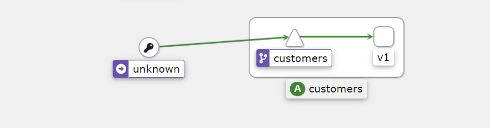

# 安全

安全涉及到认证和授权这两个概念。

## 1. Isito认证

对于网格中的每个工作负载，Istio 提供一个 X.509 证书。一个名为 `pilot-agent` 的代理在每个 Envoy 代理旁边运行，并与控制平面（`istiod`）一起工作，自动进行密钥和证书的轮转。

> 在实现层面，`istio-agent` 是指 sidecar 容器中的 `pilot-agent` 进程


Istio Agent 与 Envoy sidecar 一起工作，通过安全地传递配置和Secret，帮助它们连接到服务网格。

Istio 的身份和证书管理是通过 `SDS（安全发现服务）`来实现的。

如果没有 SDS，证书必须作为Secret创建，然后装入代理容器的文件系统中。当证书过期时，需要更新Secret，并重新部署代理，因为 Envoy 不会从磁盘动态重新加载证书。

当使用 SDS 时，SDS 服务器将证书推送给 Envoy 实例。每当证书过期时，SDS 会推送更新的证书，Envoy 可以立即使用它们。不需要重新部署代理服务器，也不需要中断流量。在 Istio 中，Istio Agent 作为 SDS 服务器，实现了SDS接口。

其执行的流程如下所示：

- 首先 Istio 提供一个 gRPC 服务来接受证书签名请求（CSRs）
- Envoy 通过 SDS API 发送证书和密钥请求
- 在收到 SDS 请求后，`istio-agent` 创建私钥和 CSR，然后将 CSR 及其凭据发送到 Istiod 中的 CA 服务进行签名
- CA 验证 CSR 中携带的凭据并签署 CSR 以生成证书
- `istio-agent` 通过 Envoy SDS API 将私钥与从 Istio CA 收到的证书发送给 Envoy
- 上述 CSR 过程会周期性地重复，以处理证书和密钥轮转


**Istio 提供两种类型的认证**：对等认证和请求认证。

### 1.1 对等认证

**对等认证用于服务间的认证，以验证建立连接的客户端**。

当两个服务试图进行通信时，双向 TLS 要求它们都向对方提供证书，因此双方都知道它们在与谁交谈。如果我们想在服务之间启用严格的双向 TLS，我们可以**使用 PeerAuthentication 资源，将 mTLS 模式设置为 STRICT**。

使用 PeerAuthentication 资源，我们可以打开整个服务网格的双向 TLS（mTLS），而不需要做任何代码修改。

然而，**Istio 也支持一种优雅的模式，我们可以选择在一个工作负载或命名空间内进入双向 TLS。这种模式被称为许可模式**。

当你安装 Istio 时，许可模式是默认启用的。启用许可模式后，如果客户端试图通过双向TLS 连接，Istio 将提供双向TLS。如果客户端不使用双向 TLS，Istio 也可以用纯文本响应。你可以允许客户端做或不做 mTLS。

### 1.2 请求认证

**请求认证（RequestAuthentication 资源）验证了附加在请求上的凭证，它被用于终端用户认证**。

请求级认证是通过 [JSON Web Tokens（JWT）](https://jwt.io/) 验证完成的。Istio 支持任何 OpenID Connect 提供商，如 Auth0、Firebase 或 Google Auth、Keycloak、ORY Hydra。我们可以使用 JWT 令牌来验证用户。

### 1.3 mTLS

**服务中的工作负载之间的通信是通过 Envoy 代理进行的。当一个工作负载使用 mTLS 向另一个工作负载发送请求时，Istio 会将流量重新路由到 sidecar 代理（Envoy）**。

然后，sidecar Envoy 开始与服务器端的 Envoy 进行 mTLS 握手。在握手过程中，调用者会进行安全命名检查，以验证服务器证书中的服务账户是否被授权运行目标服务。一旦 mTLS 连接建立，Istio 就会将请求从客户端的 Envoy 代理转发到服务器端的 Envoy 代理。在服务器端的授权后，sidecar 将流量转发到工作负载。

我们可以在服务的目标规则中改变 mTLS 行为。支持的 TLS 模式有：`DISABLE`（无 TLS 连接）、`SIMPLE`（向上游端点发起 TLS 连接）、`MUTUAL`（通过出示客户端证书进行认证来使用 mTLS）和 `ISTIO_MUTUAL`（与 `MUTUAL` 类似，但使用 Istio 自动生成的证书进行 mTLS）。


**许可模式（Permissive Mode）是一个特殊的选项**，**它允许一个服务同时接受纯文本流量和 mTLS 流量。这个功能的目的是为了改善 mTLS 的用户体验**。

**默认情况下，Istio 使用许可模式配置目标工作负载。Istio 跟踪使用 Istio 代理的工作负载，并自动向其发送 mTLS 流量。如果工作负载没有代理，Istio 将发送纯文本流量**。

当使用许可模式时，服务器接受纯文本流量和 mTLS 流量，不会破坏任何东西。许可模式给了我们时间来安装和配置 sidecar，以逐步发送 mTLS 流量。

**一旦所有的工作负载都安装了 sidecar，我们就可以切换到严格的 mTLS 模式**。要做到这一点，**我们可以创建一个 `PeerAuthentication` 资源。我们可以防止非双向 TLS 流量，并要求所有通信都使用 mTLS**。

比如：

在根命名空间下（istio-system）创建策略，用于在整个网格中执行

~~~yaml
 apiVersion: security.istio.io/v1beta1
 kind: PeerAuthentication
 metadata:
   name: default
   namespace: istio-system
 spec:
   mtls:
     mode: STRICT
~~~

还可以**指定 `selector` 字段，将策略仅应用于网格中的特定工作负载：**

~~~yaml
 apiVersion: security.istio.io/v1beta1
 kind: PeerAuthentication
 metadata:
   name: default
   namespace: my-namespace
 spec:
   selector:
     matchLabels:
       app: customers
   mtls:
     mode: STRICT
~~~

### 1.4 实战：启用mTLS

* 部署Gateway 

  ~~~yaml
   apiVersion: networking.istio.io/v1alpha3
   kind: Gateway
   metadata:
     name: gateway
   spec:
     selector:
       istio: ingressgateway
     servers:
       - port:
           number: 80
           name: http
           protocol: HTTP
         hosts:
           - '*'
  ~~~

  ~~~shell
  [root@master security]# kubectl apply -f gateway.yaml 
  gateway.networking.istio.io/gateway created
  ~~~

* 部署示例应用程序（Web Frontend 和 Customers 服务），Web 前端的部署将不包含 Envoy 代理 sidecar，而 Customers 服务将被注入 sidecar。通过这个设置，我们将看到 Istio 如何同时发送 mTLS 和纯文本流量，以及如何将 TLS 模式改为 STRICT。

* 在开始部署之前，我们将禁用 `default` 命名空间中的自动 sidecar 注入，这样代理就不会被注入到 Web 前端部署中。在我们部署 Customers 服务之前，我们将再次启用注入。

  ~~~shell
  kubectl label namespace default istio-injection-
  ~~~

* 部署 `web-frontend`：

  ~~~yaml
   apiVersion: apps/v1
   kind: Deployment
   metadata:
     name: web-frontend
     labels:
       app: web-frontend
   spec:
     replicas: 1
     selector:
       matchLabels:
         app: web-frontend
     template:
       metadata:
         labels:
           app: web-frontend
           version: v1
       spec:
         containers:
           - image: mszlu/web-frontend:1.0.0
             imagePullPolicy: IfNotPresent
             name: web
             ports:
               - containerPort: 8080
             env:
               - name: CUSTOMER_SERVICE_URL
                 value: 'http://customers.default.svc.cluster.local'
  ---
   kind: Service
   apiVersion: v1
   metadata:
     name: web-frontend
     labels:
       app: web-frontend
   spec:
     selector:
       app: web-frontend
     ports:
       - port: 80
         name: http
         targetPort: 8080
  ---
   apiVersion: networking.istio.io/v1alpha3
   kind: VirtualService
   metadata:
     name: web-frontend
   spec:
     hosts:
       - '*'
     gateways:
       - gateway
     http:
       - route:
           - destination:
               host: web-frontend.default.svc.cluster.local
               port:
                 number: 80
  
  ~~~

  ~~~shell
  [root@master security]# kubectl apply -f web-frontend.yaml
  deployment.apps/web-frontend created
  service/web-frontend created
  virtualservice.networking.istio.io/web-frontend created
  ~~~

* 启用自动注入：

  ~~~shell
  kubectl label namespace default istio-injection=enabled
  ~~~

* 部署 Customers 服务的 v1 版本：

  ~~~yaml
   apiVersion: apps/v1
   kind: Deployment
   metadata:
     name: customers-v1
     labels:
       app: customers
       version: v1
   spec:
     replicas: 1
     selector:
       matchLabels:
         app: customers
         version: v1
     template:
       metadata:
         labels:
           app: customers
           version: v1
       spec:
         containers:
           - image: mszlu/customers:1.0.0
             imagePullPolicy: IfNotPresent
             name: svc
             ports:
               - containerPort: 3000
  ---
   kind: Service
   apiVersion: v1
   metadata:
     name: customers
     labels:
       app: customers
   spec:
     selector:
       app: customers
     ports:
       - port: 80
         name: http
         targetPort: 3000
  ---
   apiVersion: networking.istio.io/v1alpha3
   kind: VirtualService
   metadata:
     name: customers
   spec:
     hosts:
       - 'customers.default.svc.cluster.local'
     http:
       - route:
           - destination:
               host: customers.default.svc.cluster.local
               port:
                 number: 80
  
  ~~~

  ~~~shell
  [root@master security]# kubectl apply -f customers-v1.yaml
  deployment.apps/customers-v1 created
  service/customers created
  virtualservice.networking.istio.io/customers created
  ~~~

* 这个时候访问可以得到正确的页面，之所以有效，是因为采用了许可模式，纯文本流量被发送到没有代理的服务。在这种情况下，入口网关将纯文本流量发送到 Web 前端，因为没有代理。

  ~~~shell
  [root@master security]# curl http://192.168.200.101:30539
  ~~~

  打开kiali看一下，会发现 Kiali 检测到**从入口网关到 Web 前端的调用。然而，对 Customers 服务的调用是来自未知的服务。这是因为 Web 前端旁边没有代理，Istio 不知道这个服务是谁、在哪里、是什么**。

  

* 更新 Customers 的 VirtualService 并将网关附加到它上面。这将使我们能够直接调用 Customers 的服务。

  ~~~yaml
   apiVersion: networking.istio.io/v1alpha3
   kind: VirtualService
   metadata:
     name: customers
   spec:
     hosts:
       - 'customers.default.svc.cluster.local'
     gateways:
       - gateway
     http:
       - route:
           - destination:
               host: customers.default.svc.cluster.local
               port:
                 number: 80
  ~~~

  ~~~shell
  [root@master security]# kubectl apply -f vs-customers-gateway.yaml
  virtualservice.networking.istio.io/customers configured
  ~~~

  现在**我们可以指定 Host 头了，我们就可以通过入口网关将请求发送到 Customers 服务**：

  ~~~shell
  [root@master security]# curl -H "Host: customers.default.svc.cluster.local" http://192.168.200.101:30539
  [{"name":"Jewel Schaefer"},{"name":"Raleigh Larson"},{"name":"Eloise Senger"},{"name":"Moshe Zieme"},{"name":"Filiberto Lubowitz"},{"name":"Ms.Kadin Kling"},{"name":"Jennyfer Bergstrom"},{"name":"Candelario Rutherford"},{"name":"Kenyatta Flatley"},{"name":"Gianni Pouros"}]
  ~~~

  

* 了通过 Ingress 给 Web 前端和 Customers 服务产生一些流量，打开两个终端窗口，分别运行一条命令：

  ~~~shell
  while true; do curl -H "Host: customers.default.svc.cluster.local" http://192.168.200.101:30539; done
  ~~~

  ~~~shell
  while true; do curl http://192.168.200.101:30539; done
  ~~~

  打开 Kiali，看一下图表。在 Display 下拉菜单中，确保我们选中 Security 选项。你应该看到一个类似于下图的图表：

  

  **注意在入口网关和 Customers 服务之间有一个挂锁图标，这意味着流量是使用 mTLS 发送的**。

  在未知的（web 前端）和 Customers 服务之间，以及 `istio-ingress-gateway` 和 web 前端之间，都没有挂锁。**Istio 在没有注入 sidecar 的情况下向服务发送纯文本流量**。

* 如果我们在 STRICT 模式下启用 mTLS 会发生什么？

  我们预计从前端到 Customers 服务的调用会开始失败，因为没有注入代理来进行 mTLS 通信。另一方面，从入口网关到 Customers 服务的调用将继续工作。

  ~~~yaml
   apiVersion: security.istio.io/v1beta1
   kind: PeerAuthentication
   metadata:
     name: default
     namespace: default
   spec:
     mtls:
       mode: STRICT
  ~~~

  ~~~shell
  [root@master security]# kubectl apply -f strict-mtls.yaml
  peerauthentication.security.istio.io/default created
  ~~~

* 这个时候前端将看到ECONNRESET的错误，这个错误表明，Customers 端关闭了连接。在我们的例子中，这是因为它期待着一个 mTLS 连接

* 另一方面，我们直接向 Customers 服务发出的请求继续工作，因为 Customers 服务旁边有一个 Envoy 代理在运行，它可以进行 mTLS。

* 如果我们删除之前部署的 PeerAuthentication 资源（`kubectl delete peerauthentication default`），Istio 就会恢复到默认状态（PERMISSIVE 模式），错误也会消失。


## 2. 授权

即使认证通过，也不一定能访问资源，这个就需要授权。

Istio 允许我们使用 `AuthorizationPolicy` 资源在网格、命名空间和工作负载层面定义访问控制。`AuthorizationPolicy` 支持 DENY、ALLOW、AUDIT 和 CUSTOM 操作。

**每个 Envoy 代理实例都运行一个授权引擎，在运行时对请求进行授权。当请求到达代理时，引擎会根据授权策略评估请求的上下文，并返回 ALLOW 或 DENY。AUDIT 动作决定是否记录符合规则的请求。注意，AUDIT 策略并不影响请求被允许或拒绝**。

为了执行访问控制，我们可以创建一个授权策略来应用于我们的工作负载。

`AuthorizationPolicy` 资源是我们可以利用 `PeerAuthentication` 策略和 `RequestAuthentication` 策略中的主体的地方。

**在定义 `AuthorizationPolicy` 的时候，我们需要考虑三个部分**。

1. 选择要应用该策略的工作负载
2. 要采取的行动（拒绝、允许或审计）
3. 采取该行动的规则

让我们看看下面这个例子如何与 `AuthorizationPolicy` 资源中的字段相对应。

```yaml
 apiVersion: security.istio.io/v1beta1
 kind: AuthorizationPolicy
 metadata:
  name: customers-deny
  namespace: default
 spec:
  selector:
    matchLabels:
      app: customers
      version: v2
  action: DENY
  rules:
  - from:
    - source:
        notNamespaces: ["default"]
```

**使用 `selector` 和 `matchLabels`，我们可以选择策略所适用的工作负载**。在我们的案例中，我们选择的是所有设置了 `app: customers` 和 `version: v2` 标签的工作负载。action 字段被设置为 `DENY`。

最后，我们在 rules 字段中定义所有规则。我们例子中的规则是说，**当请求来自 `default` 命名空间之外时，拒绝对 `customers v2` 工作负载的请求（action）**。

**除了规则中的 `from` 字段外，我们还可以使用 `to` 和 `when` 字段进一步定制规则**。让我们看一个使用这些字段的例子。

```yaml
 apiVersion: security.istio.io/v1beta1
 kind: AuthorizationPolicy
 metadata:
  name: customers-deny
  namespace: default
 spec:
  selector:
    matchLabels:
      app: customers
      version: v2
  action: DENY
  rules:
  - from:
    - source:
        notNamespaces: ["default"]
  - to:
     - operation:
         methods: ["GET"]
  - when:
     - key: request.headers [User-Agent]
       values: ["Mozilla/*"]
```

我们在规则部分添加了 `to` 和 `when` 字段。如果我们翻译一下上面的规则，我们可以说，**当客户的 GET 请求来自 `default` 命名空间之外，并且 `User Agent` 头的值与正则表达式 `Mozilla/\*` 相匹配时，我们会拒绝 customers v2 的工作负载**。

总的来说，**`to` 定义了策略所允许的行动，`from` 定义了谁可以采取这些行动，`when` 定义了每个请求必须具备的属性，以便被策略所允许，`selector` 定义了哪些工作负载将执行该策略**。

**如果一个工作负载有多个策略，则首先评估拒绝的策略**。评估遵循这些规则：

1. 如果有与请求相匹配的 DENY 策略，则拒绝该请求
2. 如果没有适合该工作负载的 ALLOW 策略，则拒绝该请求。
3. 如果有任何 ALLOW 策略与该请求相匹配，则允许该请求。
4. 拒绝该请求

### 2.1 source

我们在上述例子中使用的source是 `notNamespaces`。我们还可以使用以下任何一个字段来指定请求的source，如表中所示。

| 来源                   | 示例                                     | 释义                                                         |
| ---------------------- | ---------------------------------------- | ------------------------------------------------------------ |
| `principals`           | `principals: ["my-service-account"]`     | 任何是有 `my-service-account` 的工作负载                     |
| `notPrincipals`        | `notPrincipals: ["my-service-account"]`  | 除了 `my-service-account` 的任何工作负载                     |
| `requestPrincipals`    | `requestPrincipals: ["my-issuer/hello"]` | 任何具有有效 JWT 和请求主体 `my-issuer/hello` 的工作负载     |
| `notRequestPrincipals` | `notRequestPrincipals: ["*"]`            | 任何没有请求主体的工作负载（只有有效的 JWT 令牌）。          |
| `namespaces`           | `namespaces: ["default"]`                | 任何来自 `default` 命名空间的工作负载                        |
| `notNamespaces`        | `notNamespaces: ["prod"]`                | 任何不在 `prod` 命名空间的工作负载                           |
| `ipBlocks`             | `ipBlocks: ["1.2.3.4","9.8.7.6/15"]`     | 任何具有 `1.2.3.4` 的 IP 地址或来自 CIDR 块的 IP 地址的工作负载 |
| `notIpBlock`           | `notIpBlocks: ["1.2.3.4/24"]`            | Any IP address that's outside of the CIDR block              |

### 2.2 操作operation

**operation被定义在 `to` 字段下，如果多于一个，则使用 `AND` 语义**。就像source一样，操作是成对的，有正反两面的匹配。设置在操作字段的值是字符串：

- `hosts` 和 `notHosts`
- `ports` 和 `notPorts`
- `methods` 和 `notMethods`
- `paths` 和 `notPath`

所有这些操作都适用于请求属性。例如，**要在一个特定的请求路径上进行匹配，我们可以使用路径。`paths:["/api/\*","/admin"]` 或特定的端口 `ports: ["8080"]`**，以此类推。

### 2.3 条件

为了指定条件，我们必须提供一个 `key` 字段。`key` 字段是一个 Istio 属性的名称。例如，`request.headers`、`source.ip`、`destination.port` 等等。关于支持的属性的完整列表，请参考 [授权政策条件](https://istio.io/latest/docs/reference/config/security/conditions/)。

条件的第二部分是 `values` 或 `notValues` 的字符串列表。下面是一个 `when` 条件的片段：

```yaml
 ...
  - when:
     - key: source.ip
       notValues: ["10.0.1.1"]
```

### 2.4 实战：授权（访问控制）

在这个实验中，我们将学习如何使用授权策略来控制工作负载之间的访问。

首先部署 Gateway：

```yaml
 apiVersion: networking.istio.io/v1alpha3
 kind: Gateway
 metadata:
   name: gateway
 spec:
   selector:
     istio: ingressgateway
   servers:
     - port:
         number: 80
         name: http
         protocol: HTTP
       hosts:
         - '*'
```

将上述 YAML 保存为 `gateway.yaml`，并使用 `kubectl apply -f gateway.yaml` 部署网关。

接下来，我们将创建 Web 前端部署、服务账户、服务 和 VirtualService。

```yaml
 apiVersion: v1
 kind: ServiceAccount
 metadata:
   name: web-frontend
---
 apiVersion: apps/v1
 kind: Deployment
 metadata:
   name: web-frontend
   labels:
     app: web-frontend
 spec:
   replicas: 1
   selector:
     matchLabels:
       app: web-frontend
   template:
     metadata:
       labels:
         app: web-frontend
         version: v1
     spec:
       serviceAccountName: web-frontend
       containers:
         - image: mszlu/web-frontend:1.0.0
           imagePullPolicy: Always
           name: web
           ports:
             - containerPort: 8080
           env:
             - name: CUSTOMER_SERVICE_URL
               value: 'http://customers.default.svc.cluster.local'
---
 kind: Service
 apiVersion: v1
 metadata:
   name: web-frontend
   labels:
     app: web-frontend
 spec:
   selector:
     app: web-frontend
   ports:
     - port: 80
       name: http
       targetPort: 8080
---
 apiVersion: networking.istio.io/v1alpha3
 kind: VirtualService
 metadata:
   name: web-frontend
 spec:
   hosts:
     - '*'
   gateways:
     - gateway
   http:
     - route:
         - destination:
             host: web-frontend.default.svc.cluster.local
             port:
               number: 80
```

将上述 YAML 保存为 `web-frontend.yaml`，并使用 `kubectl apply -f web-frontend.yaml` 创建资源。

最后，我们将部署 customers v1 服务。

```yaml
 apiVersion: v1
 kind: ServiceAccount
 metadata:
   name: customers-v1
---
 apiVersion: apps/v1
 kind: Deployment
 metadata:
   name: customers-v1
   labels:
     app: customers
     version: v1
 spec:
   replicas: 1
   selector:
     matchLabels:
       app: customers
       version: v1
   template:
     metadata:
       labels:
         app: customers
         version: v1
     spec:
       serviceAccountName: customers-v1
       containers:
         - image: mszlu/customers:1.0.0
           imagePullPolicy: Always
           name: svc
           ports:
             - containerPort: 3000
---
 kind: Service
 apiVersion: v1
 metadata:
   name: customers
   labels:
     app: customers
 spec:
   selector:
     app: customers
   ports:
     - port: 80
       name: http
       targetPort: 3000
---
 apiVersion: networking.istio.io/v1alpha3
 kind: VirtualService
 metadata:
   name: customers
 spec:
   hosts:
     - 'customers.default.svc.cluster.local'
   http:
     - route:
         - destination:
             host: customers.default.svc.cluster.local
             port:
               number: 80
```

将上述内容保存为 `customers-v1.yaml`，并使用 `kubectl apply -f customers-v1.yaml` 创建部署和服务。如果我们打开 `GATEWAY_URL`，应该会显示带有 customers v1 服务数据的 web 前端页面。

让我们先创建一个授权策略，**拒绝 `default` 命名空间的所有请求**。

```yaml
 apiVersion: security.istio.io/v1beta1
 kind: AuthorizationPolicy
 metadata:
  name: deny-all
  namespace: default
 spec:
   {}
```

将上述内容保存为 `deny-all.yaml`，并使用 `kubectl apply -f deny-all.yaml` 创建该策略。

如果我们尝试访问 `GATEWAY_URL`，我们将得到以下响应。

```yaml
 RBAC: access denied
```

同样，如果我们试图在集群内运行一个 Pod，并从 `default` 命名空间内向 Web 前端或 customers 服务提出请求，我们会得到同样的错误。

让我们试试吧。

```shell
 $ kubectl run curl --image=radial/busyboxplus:curl -i --tty
 If you don't see a command prompt, try pressing enter.
 [ root@curl:/ ]$ curl customers
 RBAC: access denied
 [ root@curl:/ ]$ curl web-frontend
 RBAC: access denied
 [ root@curl:/ ]$
```

在这两种情况下，我们都得到了拒绝访问的错误。

我们要做的第一件事是**使用 `ALLOW` 动作，允许从入口网关向 `web-frontend` 应用程序发送请求。在规则中，我们指定了入口网关运行的源命名空间（`istio-system`）和入口网关的服务账户名称**。

```yaml
 apiVersion: security.istio.io/v1beta1
 kind: AuthorizationPolicy
 metadata:
   name: allow-ingress-frontend
   namespace: default
 spec:
   selector:
     matchLabels:
       app: web-frontend
   action: ALLOW
   rules:
     - from:
         - source:
             namespaces: ["istio-system"]
         - source:
             principals: ["cluster.local/ns/istio-system/sa/istio-ingressgateway-service-account"]
```

> 在kubernetes中，X.509证书的URI字段格式为：spiffe://`<domain>`/ns/`<namespace>`/sa/`<serviceaccount>`。
>
> 这使Istio服务能够建立与接受与其他SPIFFE()兼容系统的连接。
>
> SPIFFE（Secure Production Identity Framework For Everyone）以特制的X.509证书形式为现代生产环境中的每个工作负载提供安全标识。SPIFFE消除了对应用程序级身份验证和复杂网络级ACL配置的需求。SPIFFE标准是许多CNCF参与者和其他相关方，聚集在一起提出的共同方法，使服务彼此呈现和授权他们的身份。

将上述内容保存为 `allow-ingress-frontend.yaml`，并使用 `kubectl apply -f allow-ingress-frontend.yaml` 创建策略。

如果我们尝试从我们的主机向`GATEWAY_URL` 发出请求，这次我们会得到一个不同的错误。

```shell
 $ curl http://$GATEWAY_URL
 "Request failed with status code 403"
```

> 请注意，策略需要几秒钟才能分发到所有代理，所以你可能仍然会看到 `RBAC：access denied` 的消息，时间为几秒钟。

这个错误来自 customers 服务——记得我们**允许调用 Web 前端**。然而，`web-frontend`仍然不能调用 customers 服务。

如果我们回到我们在集群内运行的 curl Pod，尝试请求 `http://web-frontend`，我们会得到一个 RBAC 错误。`DENY` 策略是有效的，我们只允许从入口网关进行调用。

**当我们部署 Web 前端时，我们也为 Pod 创建了一个服务账户（否则，命名空间中的所有 Pod 都被分配了默认的服务账户）。现在我们可以使用该服务账户来指定 customers 服务调用的来源**。

```yaml
 apiVersion: security.istio.io/v1beta1
 kind: AuthorizationPolicy
 metadata:
   name: allow-web-frontend-customers
   namespace: default
 spec:
   selector:
     matchLabels:
         app: customers
         version: v1
   action: ALLOW
   rules:
   - from:
     - source:
         namespaces: ["default"]
       source:
         principals: ["cluster.local/ns/default/sa/web-frontend"]
```

将上述 YAML 保存为 `allow-web-frontend-customers.yaml`，并使用 `kubectl apply -f allow-web-frontend-customers.yaml` 创建策略。

一旦策略被创建，我们将看到 Web 前端再次工作——它将获得 customers 服务的回应。

**我们使用了多个授权策略，明确地允许从入口到前端以及从前端到 customers 服务的调用。使用 `deny-all` 策略是一个很好的开始，因为我们可以控制、管理，然后明确地允许我们希望在服务之间发生的通信。**
