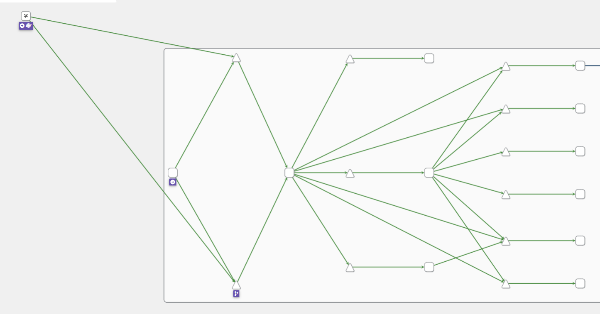
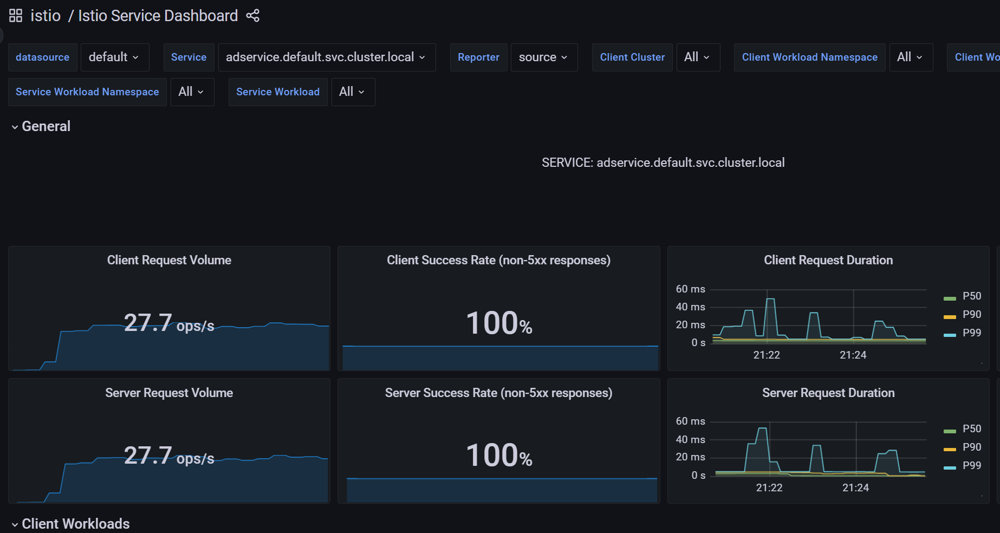
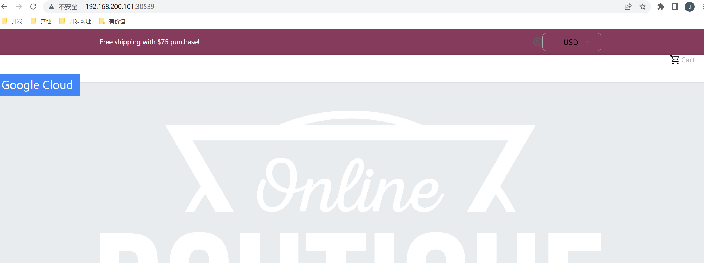
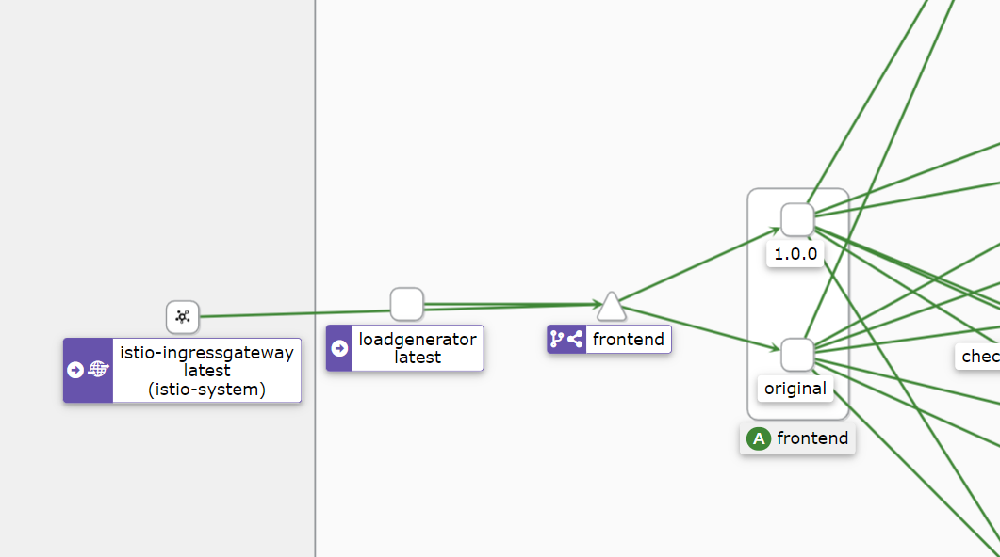
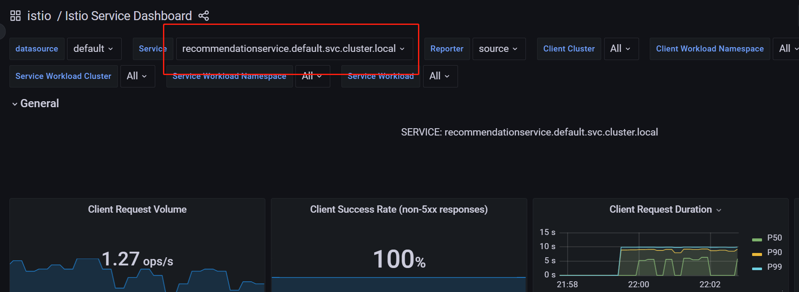
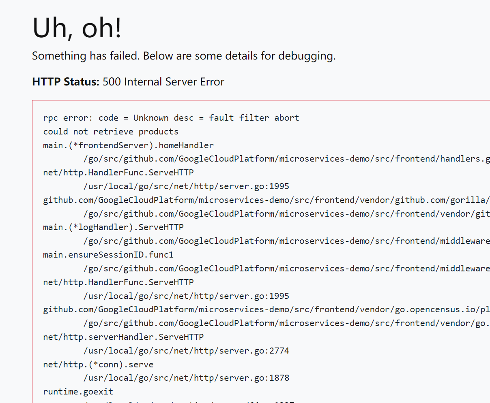
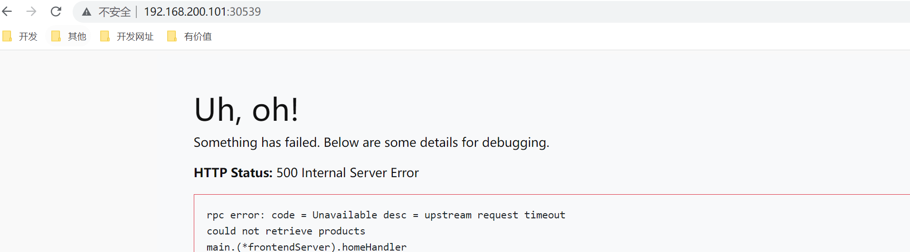
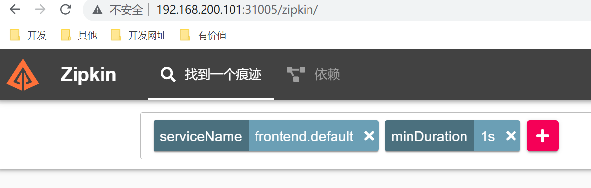
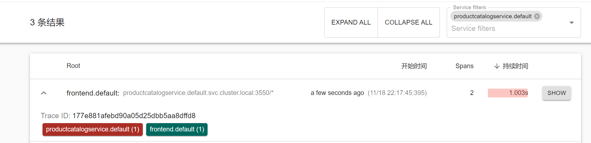

# 案例

## 1. 部署示例程序

~~~shell
kubectl apply  -f kubernetes-manifests.yaml
kubectl apply  -f istio-manifests.yaml 
#删除暴露的前端
kubectl delete svc frontend-external
~~~

### 1.1 ServiceEntry

使用服务条目资源（ServiceEntry）可以将条目添加到 Istio 内部维护的服务注册表中。添加服务条目后，Envoy 代理可以将流量发送到该服务，就好像该服务条目是网格中的服务一样。通过配置服务条目，可以管理在网格外部运行的服务的流量。

此外，可以配置虚拟服务和目标规则，以更精细的方式控制到服务条目的流量，就像为网格中的其他任何服务配置流量一样。

样例展示：

client.yaml

~~~yaml
apiVersion: apps/v1
kind: Deployment
metadata:
  name: client
spec:
  replicas: 1
  selector:
    matchLabels:
      app: client
  template:
    metadata:
      labels:
        app: client
    spec:
      containers:
      - name: busybox
        image: busybox
        imagePullPolicy: IfNotPresent
        command: ["/bin/sh","-c","sleep 3600"]
~~~

baidu-se.yaml

~~~yaml
apiVersion: networking.istio.io/v1beta1
kind: ServiceEntry
metadata:
  name: baidu-se
spec:
  hosts:
    - www.baidu.com
  location: MESH_EXTERNAL   # 定义网格外部还是内部,表示服务在网格外部。通常用于指示通过API使用的外部服务。  MESH_INTERNAL  表示服务是网格的一部分。通常用于指示在扩展服务网格以包括不受管理的基础架构时显式添加的服务
  ports:
    - name: http
      number: 80
      protocol: HTTP
  resolution: DNS
~~~

- hosts：DNS名称。可以具有通配符前缀。
- ports：关联的端口。
- ports.protocol： 以下之一：HTTP，HTTPS，HTTP2，GRPC，MONGO，TCP或TLS。
- exportTo：默认情况下使用“*”，这意味着该ServiceEntry公开给每个命名空间。 “.”仅将其限制为当前命名空间。目前，exportTo值仅限于这两个。
- resolution：主机的服务发现模式
- location：从网格的角度来看，应将此服务视为内部或外部服务。

验证：

~~~shell
kubectl exec -it $(kubectl get pods | grep -i client | awk '{print $1}') -- sh
wget -q -O - http://www.baidu.com
~~~

能正常访问。

对刚才编写的 ServiceEntry 资源做一些改动

baidu-se-gai.yaml

~~~yaml
apiVersion: networking.istio.io/v1beta1
kind: ServiceEntry
metadata:
  name: baidu-se
spec:
  hosts:
    - www.baidu.com
  location: MESH_EXTERNAL
  ports:
    - name: http
      number: 80
      protocol: HTTP
  resolution: STATIC # 静态
  endpoints:
    - address: 10.10.10.10  # 自定义一个内网的ip
~~~

继续上述的验证，发现不能访问

出现此问题的原因是，serviceentry 一直都在发挥作用，前面没报错的原因是默认指定的域名解析是基于DNS的。而调整后，设置了静态域名解析的方式，并随意给了一个内网IP来标识baidu。kubectl apply serviceentry后此配置立刻就被应用在网格内（client）的 envoy，那么在网格内访问baidu的时候，流量就被路由到了所指定的 10.10.10.10去了。

`使用 service entry 使用场景有哪些？`

这里假设一个场景，比如工作过程中需要调用外部合作方服务，该服务跟你的集群毫无关系，甚至对方服务可以布置在美国。但是通过服务条目，你可以将对方服务纳入到自己的 Istio 网格之内，就像它本身存在你的集群之内一样，就好像你做了内网拦截一样。而且服务条目可以结合虚拟服务（virtual service）、目的地规则（destination rule）做更加精细的流量控制，不仅如此，还可以做失败注入、重试等功能。

测试：

baidu-se.yaml

~~~yaml
apiVersion: networking.istio.io/v1beta1
kind: ServiceEntry
metadata:
  name: baidu-se
spec:
  hosts:
    - www.baidu.com
  location: MESH_EXTERNAL
  ports:
  - name: http
    number: 80
    protocol: HTTP
  resolution: DNS
~~~

baidu-dr.yaml

~~~yaml
apiVersion: networking.istio.io/v1beta1
kind: DestinationRule
metadata:
  name: baidu-dr
spec:
  host: www.baidu.com
  trafficPolicy: # 流量策略,包括：负载平衡策略、连接池大小、异常检测
    loadBalancer: # 默认LB策略
      simple: ROUND_ROBIN
~~~

baidu-vs.yaml

~~~yaml
apiVersion: networking.istio.io/v1beta1
kind: VirtualService
metadata:
  name: baidu-vs
spec:
  hosts:
    - www.baidu.com
  http:
  - route:
    - destination:
        host: www.baidu.com
        port:
          number: 80
    timeout: 1ms
~~~

这样我们就对`www.baidu.com`实现了精细的流控

## 2. 可观察性

组件之间的边的颜色代表这些组件之间的请求的健康状况。节点形状表示组件的类型，如服务、工作负载或应用程序。

## 3. 流量路由

这个例子同样是根据权重访问不同的版本。

~~~shell
[root@master microservice-demo]# kubectl get deploy | grep frontend
frontend                1/1     1            1           23m
[root@master microservice-demo]# kubectl delete deploy frontend
deployment.apps "frontend" deleted
~~~

重新创建一个前端deploy，名字还是frontend，但是指定了一个版本标签设置为 `original` 。yaml文件如下：

frontend-original.yaml

~~~yaml
apiVersion: apps/v1
kind: Deployment
metadata:
  name: frontend
spec:
  selector:
    matchLabels:
      app: frontend
      version: original
  template:
    metadata:
      labels:
        app: frontend
        version: original
      annotations:
        sidecar.istio.io/rewriteAppHTTPProbers: "true"
    spec:
      containers:
        - name: server
          image: gcr.io/google-samples/microservices-demo/frontend:v0.2.1
          ports:
          - containerPort: 8080
          readinessProbe:
            initialDelaySeconds: 10
            httpGet:
              path: "/_healthz"
              port: 8080
              httpHeaders:
              - name: "Cookie"
                value: "shop_session-id=x-readiness-probe"
          livenessProbe:
            initialDelaySeconds: 10
            httpGet:
              path: "/_healthz"
              port: 8080
              httpHeaders:
              - name: "Cookie"
                value: "shop_session-id=x-liveness-probe"
          env:
          - name: PORT
            value: "8080"
          - name: PRODUCT_CATALOG_SERVICE_ADDR
            value: "productcatalogservice:3550"
          - name: CURRENCY_SERVICE_ADDR
            value: "currencyservice:7000"
          - name: CART_SERVICE_ADDR
            value: "cartservice:7070"
          - name: RECOMMENDATION_SERVICE_ADDR
            value: "recommendationservice:8080"
          - name: SHIPPING_SERVICE_ADDR
            value: "shippingservice:50051"
          - name: CHECKOUT_SERVICE_ADDR
            value: "checkoutservice:5050"
          - name: AD_SERVICE_ADDR
            value: "adservice:9555"
          - name: ENV_PLATFORM
            value: "gcp"
          resources:
            requests:
              cpu: 100m
              memory: 64Mi
            limits:
              cpu: 200m
              memory: 128Mi
~~~

~~~shell
[root@master microservice-demo]# kubectl apply -f frontend-original.yaml 
deployment.apps/frontend created
[root@master microservice-demo]# kubectl get pod | grep frontend
frontend-7697bc8466-pdtzl                2/2     Running   0          38s
~~~

现在我们准备创建一个 DestinationRule，定义两个版本的前端——现有的（`original`）和新的（`v1`）：

frontend-dr.yaml

~~~yaml
apiVersion: networking.istio.io/v1alpha3
kind: DestinationRule
metadata:
  name: frontend
spec:
  host: frontend.default.svc.cluster.local
  subsets:
    - name: original
      labels:
        version: original
    - name: v1
      labels:
        version: 1.0.0
~~~

~~~shell
[root@master microservice-demo]# kubectl apply -f frontend-dr.yaml 
destinationrule.networking.istio.io/frontend created
~~~

接下来，我们将更新 VirtualService，并指定将所有流量路由到子集。在这种情况下，我们将把所有流量路由到原始版本original的前端。

frontend-vs.yaml

~~~yaml
apiVersion: networking.istio.io/v1alpha3
kind: VirtualService
metadata:
  name: frontend-ingress
spec:
  hosts:
    - '*'
  gateways:
    - frontend-gateway
  http:
  - route:
    - destination:
        host: frontend.default.svc.cluster.local
        port:
          number: 80
        subset: original
~~~

~~~shell
[root@master microservice-demo]# kubectl apply -f frontend-vs.yaml 
virtualservice.networking.istio.io/frontend-ingress configured
~~~

这个时候，我们将版本切换到了一个比较原始的版本上。

接下来，我们去部署v1版本。

frontend-v1.yaml

~~~yaml
apiVersion: apps/v1
kind: Deployment
metadata:
  name: frontend-v1
spec:
  selector:
    matchLabels:
      app: frontend
      version: 1.0.0
  template:
    metadata:
      labels:
        app: frontend
        version: 1.0.0
      annotations:
        sidecar.istio.io/rewriteAppHTTPProbers: "true"
    spec:
      containers:
        - name: server
          image: gcr.lank8s.cn/tetratelabs/boutique-frontend:1.0.0
          ports:
          - containerPort: 8080
          readinessProbe:
            initialDelaySeconds: 10
            httpGet:
              path: "/_healthz"
              port: 8080
              httpHeaders:
              - name: "Cookie"
                value: "shop_session-id=x-readiness-probe"
          livenessProbe:
            initialDelaySeconds: 10
            httpGet:
              path: "/_healthz"
              port: 8080
              httpHeaders:
              - name: "Cookie"
                value: "shop_session-id=x-liveness-probe"
          env:
          - name: PORT
            value: "8080"
          - name: PRODUCT_CATALOG_SERVICE_ADDR
            value: "productcatalogservice:3550"
          - name: CURRENCY_SERVICE_ADDR
            value: "currencyservice:7000"
          - name: CART_SERVICE_ADDR
            value: "cartservice:7070"
          - name: RECOMMENDATION_SERVICE_ADDR
            value: "recommendationservice:8080"
          - name: SHIPPING_SERVICE_ADDR
            value: "shippingservice:50051"
          - name: CHECKOUT_SERVICE_ADDR
            value: "checkoutservice:5050"
          - name: AD_SERVICE_ADDR
            value: "adservice:9555"
          - name: ENV_PLATFORM
            value: "gcp"
          resources:
            requests:
              cpu: 100m
              memory: 64Mi
            limits:
              cpu: 200m
              memory: 128Mi
~~~

~~~shell
[root@master microservice-demo]# kubectl apply -f frontend-v1.yaml 
deployment.apps/frontend-v1 created
[root@master microservice-demo]# kubectl get pod | grep frontend-v1
frontend-v1-68cdbfff94-qqttt             2/2     Running   0          88s
~~~

更新 VirtualService 中的权重，开始将 30% 的流量路由到 v1 的子集。

frontend-30.yaml 

~~~yaml
apiVersion: networking.istio.io/v1alpha3
kind: VirtualService
metadata:
  name: frontend-ingress
spec:
  hosts:
    - '*'
  gateways:
    - frontend-gateway
  http:
  - route:
    - destination:
        host: frontend.default.svc.cluster.local
        port:
          number: 80
        subset: original
      weight: 70
    - destination:
        host: frontend.default.svc.cluster.local
        port:
          number: 80
        subset: v1
      weight: 30
~~~

~~~shell
[root@master microservice-demo]# kubectl apply -f frontend-30.yaml 
virtualservice.networking.istio.io/frontend-ingress configured
~~~

两个版本之间会进行切换。

## 4. 故障注入

我们为推荐服务引入 5 秒的延迟。Envoy 将为 50% 的请求注入延迟。

recommendation-delay.yaml

~~~yaml
apiVersion: networking.istio.io/v1alpha3
kind: VirtualService
metadata:
  name: recommendationservice
spec:
  hosts:
  - recommendationservice.default.svc.cluster.local
  http:
  - route:
      - destination:
          host: recommendationservice.default.svc.cluster.local
    fault:
      delay:
        percentage:
          value: 50
        fixedDelay: 5s
~~~

~~~shell
[root@master microservice-demo]# kubectl apply -f recommendation-delay.yaml
virtualservice.networking.istio.io/recommendationservice created
~~~

点击一个产品进去，刷新页面，会发现该页面要么立即加载，要么有一个延迟加载页面。这个延迟是由于我们注入了 5 秒的延迟。

可以在grafana中看到客户端请求的持续时间。

产品目录服务的 50% 的请求注入一个 HTTP 500：

productcatalogservice-abort.yaml 

~~~yaml
apiVersion: networking.istio.io/v1alpha3
kind: VirtualService
metadata:
  name: productcatalogservice
spec:
  hosts:
  - productcatalogservice.default.svc.cluster.local
  http:
  - route:
      - destination:
          host: productcatalogservice.default.svc.cluster.local
    fault:
      abort:
        percentage:
          value: 50
        httpStatus: 500 
~~~

~~~shell
[root@master microservice-demo]# kubectl apply -f productcatalogservice-abort.yaml
virtualservice.networking.istio.io/productcatalogservice created
~~~

刷新几次产品页面，会得到一些错误信息。

~~~shell
 kubectl delete virtualservice productcatalogservice 
~~~

## 5. 弹性

在产品目录服务部署中添加一个**名为 `EXTRA_LATENCY` 的环境变量。这个变量会在每次调用服务时注入一个额外的休眠**。

~~~shell
[root@master microservice-demo]# kubectl edit deploy productcatalogservice
  spec:
      containers:
      - env:
        - name: EXTRA_LATENCY
          value: 6s
~~~

访问页面会得到6s的延迟。

更新VirtualService，给产品目录服务添加一个 2 秒的超时

productcatalogservice-timeout.yaml

~~~yaml
apiVersion: networking.istio.io/v1alpha3
kind: VirtualService
metadata:
  name: productcatalogservice
spec:
  hosts:
  - productcatalogservice.default.svc.cluster.local
  http:
  - route:
    - destination:
        host: productcatalogservice.default.svc.cluster.local
    timeout: 2s
~~~

刷新页面得到超时

定义一个**重试策略**，有三次尝试，每次尝试的超时为 1 秒。

productcatalogservice-retry.yaml

~~~yaml
apiVersion: networking.istio.io/v1alpha3
kind: VirtualService
metadata:
  name: productcatalogservice
spec:
  hosts:
  - productcatalogservice.default.svc.cluster.local
  http:
  - route:
    - destination:
        host: productcatalogservice.default.svc.cluster.local
    retries:
      attempts: 3
      perTryTimeout: 1s
~~~

~~~shell
[root@master microservice-demo]# kubectl apply -f productcatalogservice-retry.yaml 
virtualservice.networking.istio.io/productcatalogservice configured
~~~

打开zipkin，查看是否重试

~~~shell
kubectl delete virtualservice productcatalogservice
~~~

