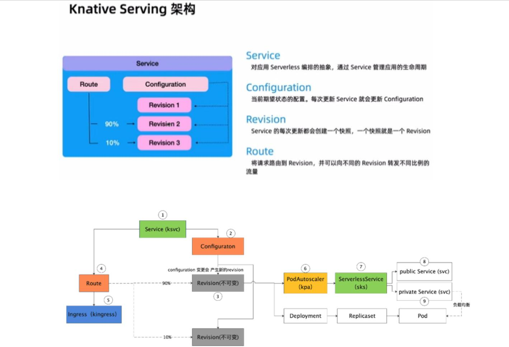

# Serverless
无服务器架构的出现不是为了取代传统的应用。
“无服务器”架构试图帮助开发者摆脱运行后端应用程序所需的服务器设备的设置和管理工作。
这个架构的就是要让开发人员关注代码的运行而不需要管理任何的基础设施。
从具有高度灵活性的使用模式及事件驱动的特点出发，开发人员／架构师应该重视这个新的计算范例，
它可以帮助我们达到减少部署、提高扩展性并减少代码后面的基础设施的维护负担。
Serverless = Faas + Baas；Faas 无状态（业务逻辑），Baas 有状态（通用服务：数据库，认证，消息队列）。

# 介绍
Knative 是谷歌牵头发起的 Serverless 项目，其定位为基于 Kubernetes 的 Serverless 解决方案，旨在标准化 Serverless。
在k8s和Istio的基础上做的扩展。

Knative  (牺牲资源,不太成熟): 无服务，资源更好的抽象(部署更加容易)

## 背景
k8s (paas), 为什么还需要 Knative (Serverless)？？
- 资源利用率 ： 中长尾应用（大部分时间都没有流量），将实例缩容为 0，避免闲置。
- 弹性伸缩 ： Knative KPA 它可以根据 请求量扩速容，支持缩容到 0 和从 0 启动，反应更迅速适合流量突发场景。比k8s的HPA更灵活。 
- 按比例灰度发布  : 封装成了ksvc，使其更容易实现灰度发布。 k8s原生（需要一个按流量分发的网关，两个 service，两个 deployment ，两个 ingress ，hpa，prometheus）
- 用户运维复杂性 ： k8s 本质上还是基础设施的抽象；对应 pod 的管控，服务的发布，镜像的构建等等需要上层的包装。 而这就是Knative的目标。

## 优势
- 便利性：Knative 以 Kubernetes 作为其底层框架，因此无论是线上还是线下，任何Kubernetes 集群，无论是云上 Kubernetes 服务还是自建 Kubernetes 集群，都能通过安装knative 插件快速的搭建 serverless 平台。
- 标准化：Knative 联合 CNCF，把所有事件标准化，统一为 CloudEvent，提供事件的跨平台，同时让函数和具体的调用方能够解耦。服务间解耦：使用 Knative 使得应用不在与底层依赖服务强绑定，可以跨云实现业务互通
- 成熟的生态：Knative 基于 Kubernetes 体系构建，与 kubernetes 生态结合更紧密；
- 自动伸缩：监控应用的请求，并自动扩缩容, 借助于 istio(ambassador,gloo 等)天生支持蓝绿发布、回滚功能，方便应用发布流程。
- 应用监控：支持日志的收集、查找和分析，并支持 VAmetrics 数据展示、调用关系 tracing

# 组件
## Serving（服务）
为其提供流量，基于负载自动伸缩，包括在没有负载时缩减到零。允许你为多个修订版本（revision）应用创
建流量策略，从而能够通过 URL 轻松路由到目标应用程序。
## Event（事件）
使得生产和消费事件变得容易。抽象出事件源，并允许操作人员使用自己选择的消息传递层。
联合 CNCF，把所有事件标准化，统一为 CloudEvent，提供事件的跨平台，同时让函数和具体的调用方能够解耦。
## Queue-proxy
流控的作用。

## 架构图

快照、路由、配置、服务(ksvc)

Queue-proxy : 流控的作用。
Autoscaller : 扩缩容的实现。
Activator :  

# 参考资料
- [Google Cloud Run 详细介绍](http://dockone.io/article/8852)
> Cloud Run 基于开源的 Knative 项目，是 Knative 的 Google Cloud 托管版本，也是业界第一个基于 Knative + Kubernetes 的 Serverless 托管服务。

