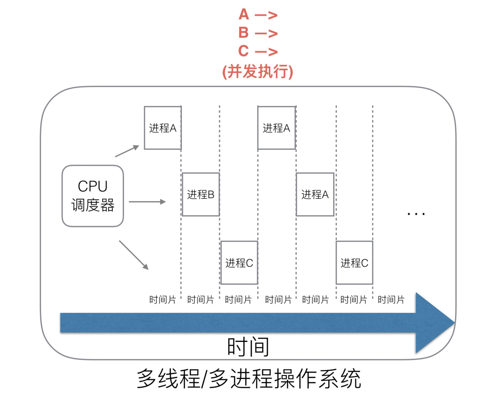
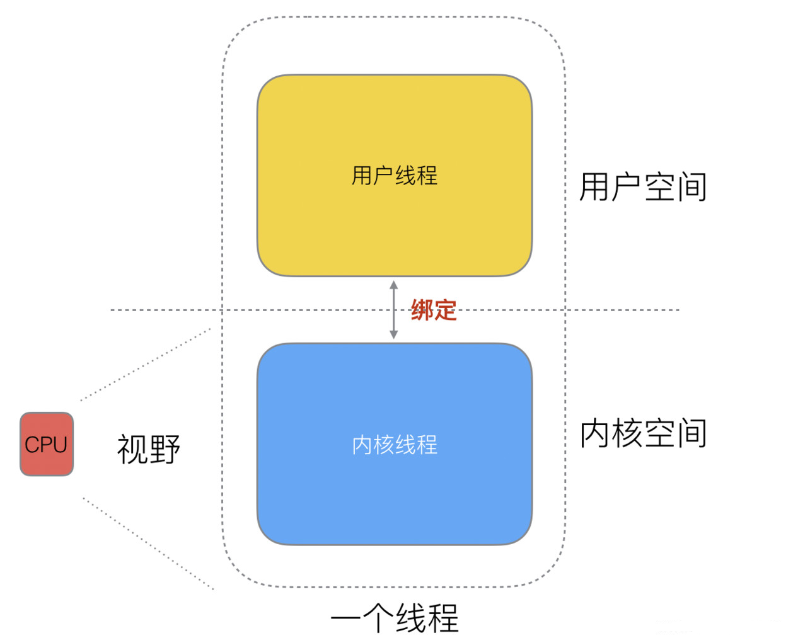
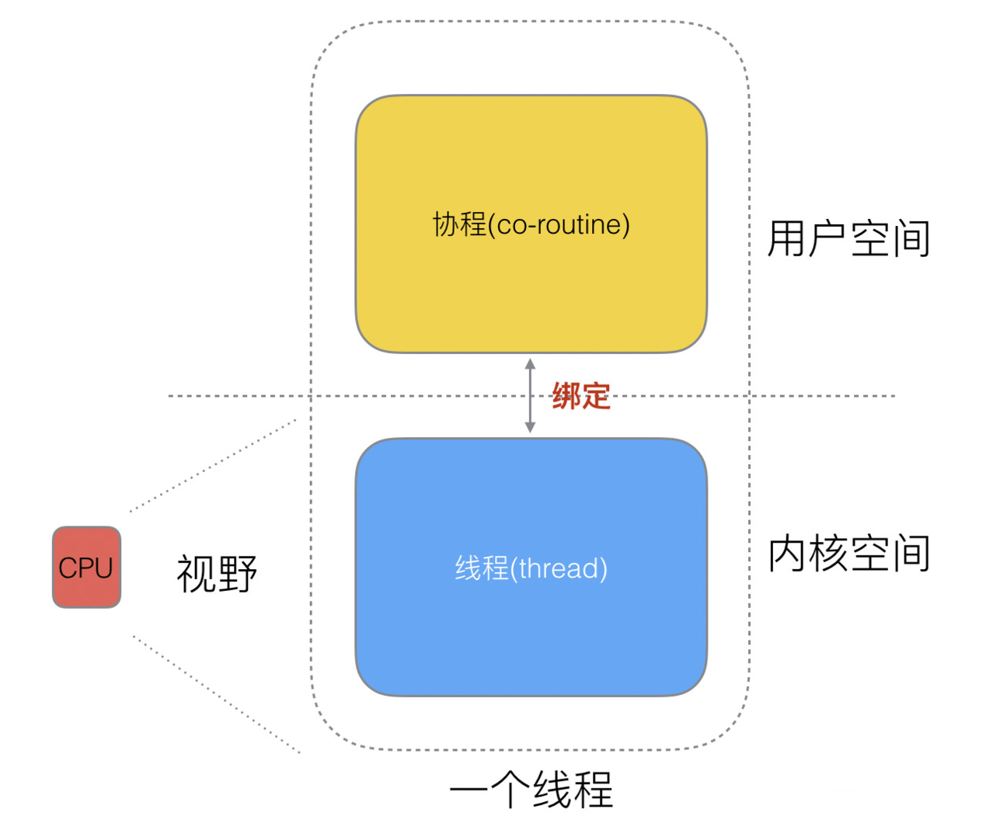
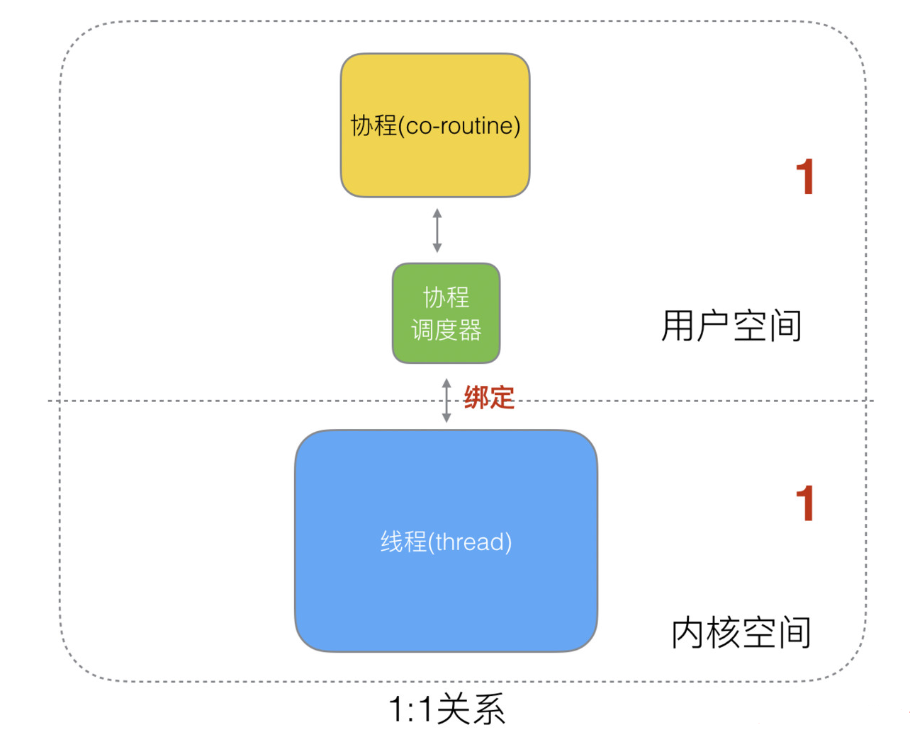
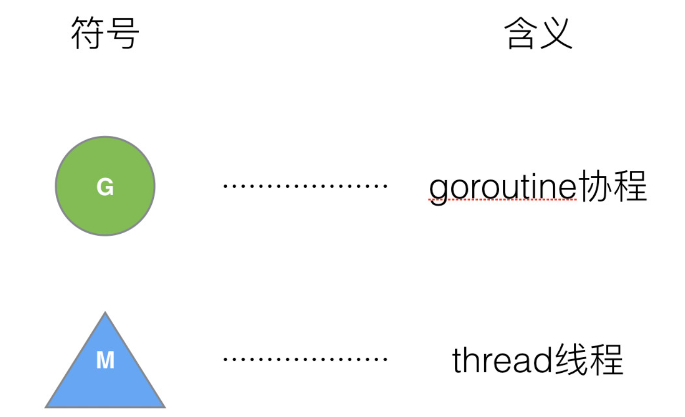
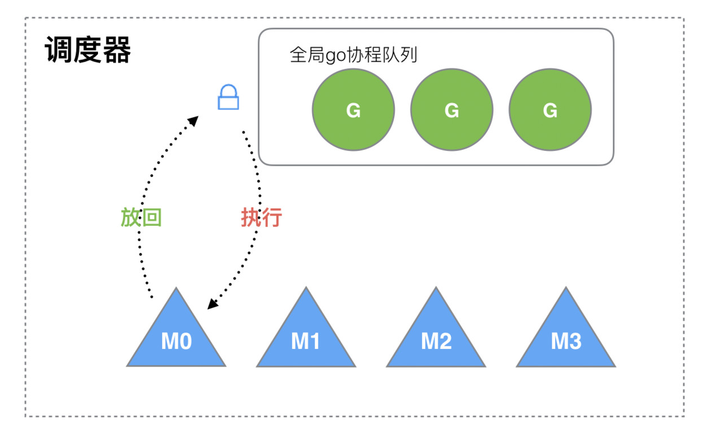
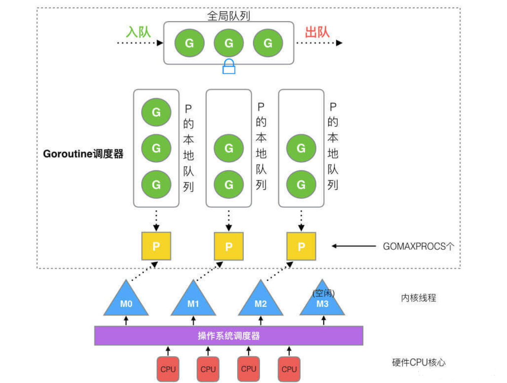
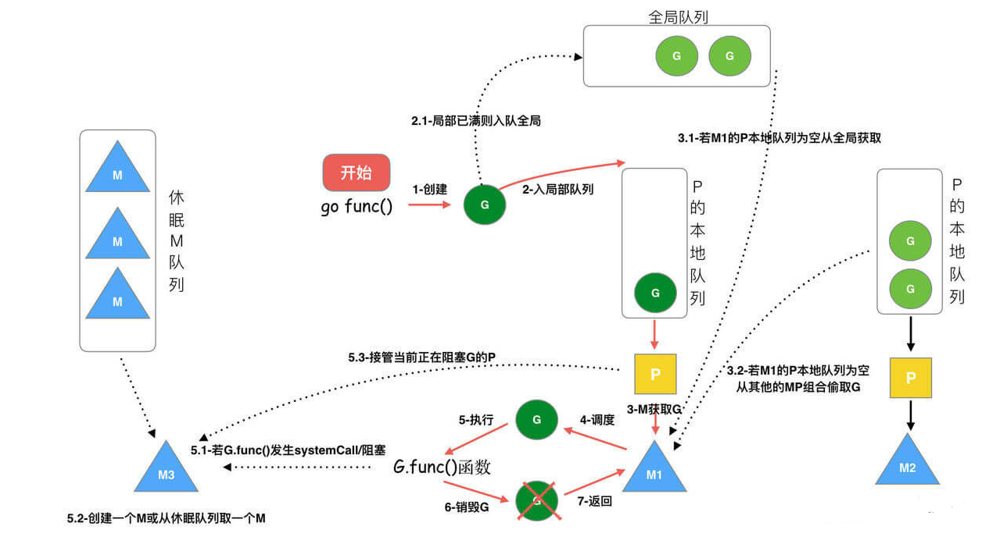
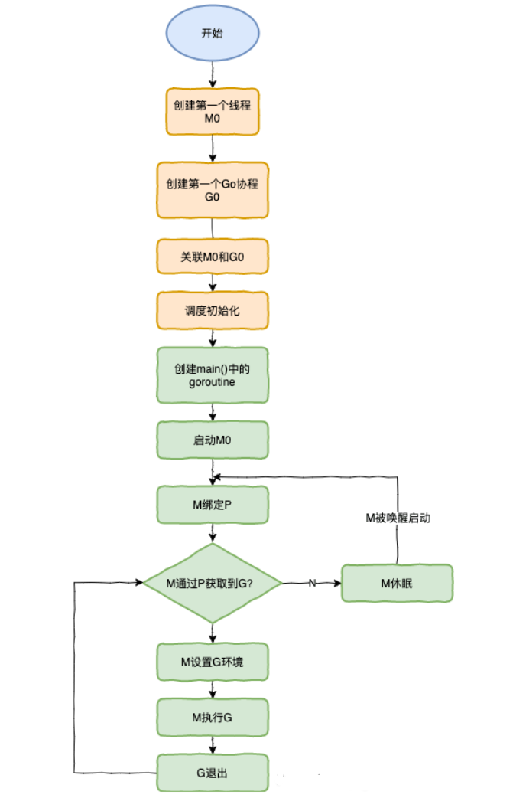

# 1. 并发

> 有人把Go语言比作 21 世纪的C语言，第一是因为Go语言设计简单，第二则是因为 21 世纪最重要的就是并发程序设计，而 Go 从语言层面就支持并发。同时实现了自动垃圾回收机制。

先来了解一些概念：

**进程/线程**

进程是程序在操作系统中的一次执行过程，系统进行资源分配和调度的一个独立单位。

线程是进程的一个执行实体，是 CPU 调度和分派的基本单位，它是比进程更小的能独立运行的基本单位。

一个进程可以创建和撤销多个线程，同一个进程中的多个线程之间可以并发执行。

**并发/并行**

多线程程序在单核心的 cpu 上运行，称为并发；

多线程程序在多核心的 cpu 上运行，称为并行。

并发与并行并不相同，并发主要由切换时间片来实现“同时”运行，并行则是直接利用多核实现多线程的运行，Go程序可以设置使用核心数，以发挥多核计算机的能力。

**协程/线程**

协程：独立的栈空间，共享堆空间，调度由用户自己控制，本质上有点类似于用户级线程，这些用户级线程的调度也是自己实现的。

线程：一个线程上可以跑多个协程，协程是轻量级的线程。

# 2. Goroutine

> Goroutine 一般将其翻译为Go协程，也就是说Go语言在语言层面就实现了协程的支持。

在java/c++中我们要实现并发编程的时候，我们通常需要自己维护一个线程池，并且需要自己去包装一个又一个的任务，同时需要自己去调度线程执行任务并维护上下文切换，这一切通常会耗费程序员大量的心智。那么能不能有一种机制，程序员只需要定义很多个任务，让系统去帮助我们把这些任务分配到CPU上实现并发执行呢？

Go语言中的goroutine就是这样一种机制， goroutine是由Go的运行时（runtime）调度和管理的。

Go程序会智能地将 goroutine 中的任务合理地分配给每个CPU。

Go语言之所以被称为现代化的编程语言，就是因为它在语言层面已经内置了调度和上下文切换的机制。

在Go语言编程中你不需要去自己写进程、线程、协程，你的技能包里只有一个技能–goroutine，当你需要让某个任务并发执行的时候，你只需要把这个任务包装成一个函数，开启一个goroutine去执行这个函数就可以了，就是这么简单粗暴。

## 2.1 使用

Go语言中使用goroutine非常简单，只需要在调用函数的时候在前面加上go关键字，就可以为一个函数创建一个goroutine。

一个goroutine必定对应一个函数，可以创建多个goroutine去执行相同的函数。

~~~go
go 函数名( 参数列表 )
~~~

- 函数名：要调用的函数名。
- 参数列表：调用函数需要传入的参数。

**启动单个goroutine**

~~~go
func hello() {
    fmt.Println("Hello Goroutine!")
}
func main() {
    hello()
    fmt.Println("main goroutine done!")
}
~~~

这个示例中hello函数和下面的语句是串行的，执行的结果是打印完Hello Goroutine!后打印main goroutine done!。

接下来我们在调用hello函数前面加上关键字go，也就是启动一个goroutine去执行hello这个函数。

~~~go
func main() {
    go hello() // 启动一个goroutine去执行hello函数
    fmt.Println("main goroutine done!")
}
~~~

这一次的执行结果只打印了main goroutine done!，并没有打印Hello Goroutine!。

`为什么呢？`

在程序启动时，Go程序就会为main()函数创建一个默认的goroutine。

当main()函数返回的时候该goroutine就结束了，所有在main()函数中启动的goroutine会一同结束，main函数所在的goroutine就像是权利的游戏中的夜王，其他的goroutine都是异鬼，夜王一死它转化的那些异鬼也就全部GG了。

所以我们要想办法让main函数等一等hello函数，最简单粗暴的方式就是time.Sleep了。

~~~go
func main() {
    go hello() // 启动一个goroutine去执行hello函数
    fmt.Println("main goroutine done!")
    time.Sleep(time.Second)
}
~~~

执行上面的代码你会发现，这一次先打印main goroutine done!，然后紧接着打印Hello Goroutine!。

首先为什么会先打印main goroutine done!是因为我们在创建新的goroutine的时候需要花费一些时间，而此时main函数所在的goroutine是继续执行的。

**启动多个goroutine**

~~~go
package main

import (
	"fmt"
	"time"
)

func hello(i int) {
	fmt.Println("Hello Goroutine!" , i)
}

func main()  {
	for i := 0; i < 10; i++ {
		go hello(i)
	}
	fmt.Println("main goroutine done!")
	time.Sleep(time.Second * 2)
}

~~~

多次执行上面的代码，会发现每次打印的数字的顺序都不一致。这是因为10个goroutine是并发执行的，而goroutine的调度是随机的。

> 问题：主协程 退出了，子协程还会执行吗？  // 不会。

**OS线程（操作系统线程）一般都有固定的栈内存（通常为2MB）,一个goroutine的栈在其生命周期开始时只有很小的栈（典型情况下2KB），goroutine的栈不是固定的，他可以按需增大和缩小，goroutine的栈大小限制可以达到1GB，虽然极少会用到这个大。所以在Go语言中一次创建十万左右的goroutine也是可以的。**

## 2.1 GMP

GPM是Go语言运行时（runtime）层面的实现，是go语言自己实现的一套调度系统。区别于操作系统调度OS线程。

- G很好理解，就是个goroutine的，里面除了存放本goroutine信息外 还有与所在P的绑定等信息。
- P管理着一组goroutine队列，P里面会存储当前goroutine运行的上下文环境（函数指针，堆栈地址及地址边界），P会对自己管理的goroutine队列做一些调度（比如把占用CPU时间较长的goroutine暂停、运行后续的goroutine等等）当自己的队列消费完了就去全局队列里取，如果全局队列里也消费完了会去其他P的队列里抢任务。
- M是Go运行时（runtime）对操作系统内核线程的虚拟， M与内核线程一般是一一映射的关系， 一个groutine最终是要放到M上执行的；

P与M一般也是一一对应的。他们关系是： P管理着一组G挂载在M上运行。当一个G长久阻塞在一个M上时，runtime会新建一个M，阻塞G所在的P会把其他的G 挂载在新建的M上。当旧的G阻塞完成或者认为其已经死掉时 回收旧的M。

P的个数是通过runtime.GOMAXPROCS设定（最大256），Go1.5版本之后默认为物理线程数。 在并发量大的时候会增加一些P和M，但不会太多，切换太频繁的话得不偿失。

单从线程调度讲，Go语言相比起其他语言的优势在于OS线程是由OS内核来调度的，goroutine则是由Go运行时（runtime）自己的调度器调度的，这个调度器使用一个称为m:n调度的技术（复用/调度m个goroutine到n个OS线程）。 其一大特点是goroutine的调度是在`用户态`下完成的， 不涉及内核态与用户态之间的频繁切换，包括内存的分配与释放，都是在用户态维护着一块大的内存池， 不直接调用系统的malloc函数（除非内存池需要改变），成本比调度OS线程低很多。 另一方面充分利用了多核的硬件资源，近似的把若干goroutine均分在物理线程上， 再加上本身goroutine的超轻量，以上种种保证了go调度方面的性能。

# 3. runtime包

**runtime.Gosched()**

让出CPU时间片，重新等待安排任务(大概意思就是本来计划的好好的周末出去烧烤，但是你妈让你去相亲,两种情况第一就是你相亲速度非常快，见面就黄不耽误你继续烧烤，第二种情况就是你相亲速度特别慢，见面就是你侬我侬的，耽误了烧烤，但是还馋就是耽误了烧烤你还得去烧烤)

~~~go
package main

import (
    "fmt"
    "runtime"
)

func main() {
    go func(s string) {
        for i := 0; i < 2; i++ {
            fmt.Println(s)
        }
    }("world")
    // 主协程
    for i := 0; i < 2; i++ {
        // 切一下，再次分配任务
        runtime.Gosched()
        fmt.Println("hello")
    }
}
~~~

**runtime.Goexit()**

退出当前协程(一边烧烤一边相亲，突然发现相亲对象太丑影响烧烤，果断让她滚蛋，然后也就没有然后了)

~~~go
package main

import (
    "fmt"
    "runtime"
)

func main() {
    go func() {
        defer fmt.Println("A.defer")
        func() {
            defer fmt.Println("B.defer")
            // 结束协程
            runtime.Goexit()
            defer fmt.Println("C.defer")
            fmt.Println("B")
        }()
        fmt.Println("A")
    }()
    for {
    }
}
~~~

**runtime.GOMAXPROCS**

Go运行时的调度器使用GOMAXPROCS参数来确定需要使用多少个OS线程来同时执行Go代码。默认值是机器上的CPU核心数。例如在一个8核心的机器上，调度器会把Go代码同时调度到8个OS线程上（GOMAXPROCS是m:n调度中的n）。

Go语言中可以通过runtime.GOMAXPROCS()函数设置当前程序并发时占用的CPU逻辑核心数。

Go1.5版本之前，默认使用的是单核心执行。Go1.5版本之后，默认使用全部的CPU逻辑核心数。

我们可以通过将任务分配到不同的CPU逻辑核心上实现并行的效果，这里举个例子：

~~~go
func a() {
    for i := 1; i < 10; i++ {
        fmt.Println("A:", i)
    }
}

func b() {
    for i := 1; i < 10; i++ {
        fmt.Println("B:", i)
    }
}

func main() {
    runtime.GOMAXPROCS(1)
    go a()
    go b()
    time.Sleep(time.Second)
}
~~~

两个任务只有一个逻辑核心，此时是做完一个任务再做另一个任务。 

将逻辑核心数设为2，此时两个任务并行执行，代码如下。

~~~go
func a() {
    for i := 1; i < 10; i++ {
        fmt.Println("A:", i)
    }
}

func b() {
    for i := 1; i < 10; i++ {
        fmt.Println("B:", i)
    }
}

func main() {
    runtime.GOMAXPROCS(2)
    go a()
    go b()
    time.Sleep(time.Second)
}
~~~

Go语言中的操作系统线程和goroutine的关系：

- 1.一个操作系统线程对应用户态多个goroutine。
- 2.go程序可以同时使用多个操作系统线程。
- 3.goroutine和OS线程是多对多的关系，即m:n。

# 4.Channel

单纯地将函数并发执行是没有意义的。函数与函数间需要交换数据才能体现并发执行函数的意义。

虽然可以使用共享内存进行数据交换，但是共享内存在不同的goroutine中容易发生竞态问题。为了保证数据交换的正确性，必须使用互斥量对内存进行加锁，这种做法势必造成性能问题。

Go语言的并发模型是CSP（Communicating Sequential Processes），提倡通过通信共享内存而不是通过共享内存而实现通信。

如果说goroutine是Go程序并发的执行体，channel就是它们之间的连接。channel是可以让一个goroutine发送特定值到另一个goroutine的通信机制。

Go 语言中的通道（channel）是一种特殊的类型。通道像一个传送带或者队列，总是遵循先入先出（First In First Out）的规则，保证收发数据的顺序。每一个通道都是一个具体类型的导管，也就是声明channel的时候需要为其指定元素类型。

**channel是一种类型，一种引用类型。声明通道类型的格式如下：**

~~~go
  var 变量 chan 类型
~~~

~~~go
 var ch1 chan int   // 声明一个传递整型的通道
    var ch2 chan bool  // 声明一个传递布尔型的通道
    var ch3 chan []int // 声明一个传递int切片的通道
~~~

## 4.1 创建channel

通道是引用类型，通道类型的空值是nil。

~~~go
var ch chan int
fmt.Println(ch) // <nil>
~~~

声明通道后需要使用make函数初始化之后才能使用。

创建channel的格式如下：

~~~go
  make(chan 元素类型, [缓冲大小])
~~~

channel的缓冲大小是可选的。

~~~go
ch4 := make(chan int)
ch5 := make(chan bool)
ch6 := make(chan []int)
~~~

## 4.2 channel操作

通道有发送（send）、接收(receive）和关闭（close）三种操作。

发送和接收都使用`<-`符号。

现在我们先使用以下语句定义一个通道：

~~~go
ch := make(chan int)
~~~

**发送：**

将一个值发送到通道中。

~~~go
ch <- 10 // 把10发送到ch中
~~~

**接收:**

从一个通道中接收值。

~~~go
x := <- ch // 从ch中接收值并赋值给变量x
<-ch       // 从ch中接收值，忽略结果
~~~

**关闭：**

我们通过调用内置的close函数来关闭通道。

~~~go
close(ch)
~~~

关于关闭通道需要注意的事情是，只有在通知接收方goroutine所有的数据都发送完毕的时候才需要关闭通道。通道是可以被垃圾回收机制回收的，它和关闭文件是不一样的，在结束操作之后关闭文件是必须要做的，但关闭通道不是必须的。

关闭后的通道有以下特点：

1. 对一个关闭的通道再发送值就会导致panic。
2. 对一个关闭的通道进行接收会一直获取值直到通道为空。
3. 对一个关闭的并且没有值的通道执行接收操作会得到对应类型的零值。
4. 关闭一个已经关闭的通道会导致panic。

## 4.3 无缓冲的通道

无缓冲的通道又称为阻塞的通道。我们来看一下下面的代码：

~~~go
func main() {
    ch := make(chan int)
    ch <- 10
    fmt.Println("发送成功")
}
~~~

上面这段代码能够通过编译，但是执行的时候会出现以下错误：

~~~go
fatal error: all goroutines are asleep - deadlock!
~~~

`为什么会出现deadlock错误呢？`

因为我们使用ch := make(chan int)创建的是无缓冲的通道，无缓冲的通道只有在有人接收值的时候才能发送值。就像你住的小区没有快递柜和代收点，快递员给你打电话必须要把这个物品送到你的手中，简单来说就是无缓冲的通道必须有接收才能发送。

上面的代码会阻塞在ch <- 10这一行代码形成死锁，那如何解决这个问题呢？

一种方法是启用一个goroutine去接收值，例如：

```go
func recv(c chan int) {
    ret := <-c
    fmt.Println("接收成功", ret)
}
func main() {
    ch := make(chan int)
    go recv(ch) // 启用goroutine从通道接收值
    ch <- 10
    fmt.Println("发送成功")
}
```

无缓冲通道上的发送操作会阻塞，直到另一个goroutine在该通道上执行接收操作，这时值才能发送成功，两个goroutine将继续执行。相反，如果接收操作先执行，接收方的goroutine将阻塞，直到另一个goroutine在该通道上发送一个值。

使用无缓冲通道进行通信将导致发送和接收的goroutine同步化。因此，无缓冲通道也被称为同步通道。

## 4.4 有缓冲的通道

我们可以在使用make函数初始化通道的时候为其指定通道的容量，例如：

~~~go
func main() {
    ch := make(chan int, 1) // 创建一个容量为1的有缓冲区通道
    ch <- 10
    fmt.Println("发送成功")
}
~~~

只要通道的容量大于零，那么该通道就是有缓冲的通道，通道的容量表示通道中能存放元素的数量。就像你小区的快递柜只有那么个多格子，格子满了就装不下了，就阻塞了，等到别人取走一个快递员就能往里面放一个。

我们可以使用内置的len函数获取通道内元素的数量，使用cap函数获取通道的容量，虽然我们很少会这么做。

## 4.5 close()

可以通过内置的close()函数关闭channel（如果你的管道不往里存值或者取值的时候一定记得关闭管道）

~~~go
package main

import "fmt"

func main() {
    c := make(chan int)
    go func() {
        for i := 0; i < 5; i++ {
            c <- i
        }
        close(c)
    }()
    for {
        if data, ok := <-c; ok {
            fmt.Println(data)
        } else {
            break
        }
    }
    fmt.Println("main结束")
}
~~~

**注意:关闭已经关闭的channel会引发panic。**

## 4.6 如何优雅的从通道循环取值

当通过通道发送有限的数据时，我们可以通过close函数关闭通道来告知从该通道接收值的goroutine停止等待。当通道被关闭时，往该通道发送值会引发panic，从该通道里接收的值一直都是类型零值。那如何判断一个通道是否被关闭了呢？

我们来看下面这个例子：

~~~go
func main() {
    ch1 := make(chan int)
    ch2 := make(chan int)
    // 开启goroutine将0~100的数发送到ch1中
    go func() {
        for i := 0; i < 100; i++ {
            ch1 <- i
        }
        close(ch1)
    }()
    // 开启goroutine从ch1中接收值，并将该值的平方发送到ch2中
    go func() {
        for {
            i, ok := <-ch1 // 通道关闭后再取值ok=false
            if !ok {
                break
            }
            ch2 <- i * i
        }
        close(ch2)
    }()
    // 在主goroutine中从ch2中接收值打印
    for i := range ch2 { // 通道关闭后会退出for range循环
        fmt.Println(i)
    }
}
~~~

从上面的例子中我们看到有两种方式在接收值的时候判断通道是否被关闭，我们通常使用的是for range的方式。

## 4.7 单向通道

有的时候我们会将通道作为参数在多个任务函数间传递，很多时候我们在不同的任务函数中使用通道都会对其进行限制，比如限制通道在函数中只能发送或只能接收。

Go语言中提供了单向通道来处理这种情况。例如，我们把上面的例子改造如下：

~~~go
func counter(out chan<- int) {
    for i := 0; i < 100; i++ {
        out <- i
    }
    close(out)
}

func squarer(out chan<- int, in <-chan int) {
    for i := range in {
        out <- i * i
    }
    close(out)
}
func printer(in <-chan int) {
    for i := range in {
        fmt.Println(i)
    }
}

func main() {
    ch1 := make(chan int)
    ch2 := make(chan int)
    go counter(ch1)
    go squarer(ch2, ch1)
    printer(ch2)
}
~~~

1. `chan<- int`是一个只能发送的通道，可以发送但是不能接收；
2. `<-chan int`是一个只能接收的通道，可以接收但是不能发送。

在函数传参及任何赋值操作中将双向通道转换为单向通道是可以的，但反过来是不可以的。

# 5. select

在某些场景下我们需要同时从多个通道接收数据。通道在接收数据时，如果没有数据可以接收将会发生阻塞。你也许会写出如下代码使用遍历的方式来实现：

~~~go
for{
    // 尝试从ch1接收值
    data, ok := <-ch1
    // 尝试从ch2接收值
    data, ok := <-ch2
    …
}
~~~

这种方式虽然可以实现从多个通道接收值的需求，但是运行性能会差很多。为了应对这种场景，Go内置了select关键字，可以同时响应多个通道的操作。

select的使用类似于switch语句，它有一系列case分支和一个默认的分支。每个case会对应一个通道的通信（接收或发送）过程。select会一直等待，直到某个case的通信操作完成时，就会执行case分支对应的语句。具体格式如下：

~~~go
select {
    case <-chan1:
       // 如果chan1成功读到数据，则进行该case处理语句
    case chan2 <- 1:
       // 如果成功向chan2写入数据，则进行该case处理语句
    default:
       // 如果上面都没有成功，则进入default处理流程
    }
~~~

**select可以同时监听一个或多个channel，直到其中一个channel ready**

~~~go
package main

import (
   "fmt"
   "time"
)

func test1(ch chan string) {
   time.Sleep(time.Second * 5)
   ch <- "test1"
}
func test2(ch chan string) {
   time.Sleep(time.Second * 2)
   ch <- "test2"
}

func main() {
   // 2个管道
   output1 := make(chan string)
   output2 := make(chan string)
   // 跑2个子协程，写数据
   go test1(output1)
   go test2(output2)
   // 用select监控
   select {
   case s1 := <-output1:
      fmt.Println("s1=", s1)
   case s2 := <-output2:
      fmt.Println("s2=", s2)
   }
}
~~~

**如果多个channel同时ready，则随机选择一个执行**

~~~go
package main

import (
	"fmt"
)

func main() {
	// 创建2个管道
	intChan := make(chan int, 1)
	stringChan := make(chan string, 1)
	go func() {
		//time.Sleep(2 * time.Second)
		intChan <- 1
	}()
	go func() {
		stringChan <- "hello"
	}()
	select {
	case value := <-intChan:
		fmt.Println("int:", value)
	case value := <-stringChan:
		fmt.Println("string:", value)
	}
	fmt.Println("main结束")
}
~~~

**可以用于判断管道是否存满**

~~~go
package main

import (
   "fmt"
   "time"
)

// 判断管道有没有存满
func main() {
   // 创建管道
   output1 := make(chan string, 10)
   // 子协程写数据
   go write(output1)
   // 取数据
   for s := range output1 {
      fmt.Println("res:", s)
      time.Sleep(time.Second)
   }
}

func write(ch chan string) {
   for {
      select {
      // 写数据
      case ch <- "hello":
         fmt.Println("write hello")
      default:
         fmt.Println("channel full")
      }
      time.Sleep(time.Millisecond * 500)
   }
}
~~~

# 6. 并发安全和锁

有时候在Go代码中可能会存在多个goroutine同时操作一个资源（临界区），这种情况会发生竞态问题（数据竞态）。类比现实生活中的例子有十字路口被各个方向的的汽车竞争。

举个例子：

~~~go
var x int64
var wg sync.WaitGroup

func add() {
  
    for i := 0; i < 5000; i++ {
        x = x + 1
    }
    wg.Done()
}
func main() {
    wg.Add(2)
    go add()
    go add()
    wg.Wait()
    fmt.Println(x)
}
~~~

上面的代码中我们开启了两个goroutine去累加变量x的值，这两个goroutine在访问和修改x变量的时候就会存在数据竞争，导致最后的结果与期待的不符。

## 6.1 互斥锁

互斥锁是一种常用的控制共享资源访问的方法，它能够保证同时只有一个goroutine可以访问共享资源。Go语言中使用sync包的Mutex类型来实现互斥锁。 

使用互斥锁来修复上面代码的问题：

~~~go
var x int64
var wg sync.WaitGroup
var lock sync.Mutex

func add() {
    for i := 0; i < 5000; i++ {
        lock.Lock() // 加锁
        x = x + 1
        lock.Unlock() // 解锁
    }
    wg.Done()
}
func main() {
    wg.Add(2)
    go add()
    go add()
    wg.Wait()
    fmt.Println(x)
}
~~~

使用互斥锁能够保证同一时间有且只有一个goroutine进入临界区，其他的goroutine则在等待锁；当互斥锁释放后，等待的goroutine才可以获取锁进入临界区，多个goroutine同时等待一个锁时，唤醒的策略是随机的。

## 6.2 读写互斥锁

互斥锁是完全互斥的，但是有很多实际的场景下是读多写少的，当我们并发的去读取一个资源不涉及资源修改的时候是没有必要加锁的，这种场景下使用读写锁是更好的一种选择。读写锁在Go语言中使用sync包中的RWMutex类型。

读写锁分为两种：读锁和写锁。当一个goroutine获取读锁之后，其他的goroutine如果是获取读锁会继续获得锁，如果是获取写锁就会等待；当一个goroutine获取写锁之后，其他的goroutine无论是获取读锁还是写锁都会等待。

读写锁示例：

~~~go
var (
    x      int64
    wg     sync.WaitGroup
    lock   sync.Mutex
    rwlock sync.RWMutex
)

func write() {
    // lock.Lock()   // 加互斥锁
    rwlock.Lock() // 加写锁
    x = x + 1
    time.Sleep(10 * time.Millisecond) // 假设读操作耗时10毫秒
    rwlock.Unlock()                   // 解写锁
    // lock.Unlock()                     // 解互斥锁
    wg.Done()
}

func read() {
    // lock.Lock()                  // 加互斥锁
    rwlock.RLock()               // 加读锁
    time.Sleep(time.Millisecond) // 假设读操作耗时1毫秒
    rwlock.RUnlock()             // 解读锁
    // lock.Unlock()                // 解互斥锁
    wg.Done()
}

func main() {
    start := time.Now()
    for i := 0; i < 10; i++ {
        wg.Add(1)
        go write()
    }

    for i := 0; i < 1000; i++ {
        wg.Add(1)
        go read()
    }

    wg.Wait()
    end := time.Now()
    fmt.Println(end.Sub(start))
}
~~~

需要注意的是读写锁非常适合读多写少的场景，如果读和写的操作差别不大，读写锁的优势就发挥不出来。

# 7.原子操作(atomic包)

代码中的加锁操作因为涉及内核态的上下文切换会比较耗时、代价比较高。针对`基本数据类型`我们还可以使用原子操作来保证并发安全，因为原子操作是Go语言提供的方法它在用户态就可以完成，因此性能比加锁操作更好。Go语言中原子操作由内置的标准库sync/atomic提供。

**atomic包**

| 方法                                                         | 解释           |
| ------------------------------------------------------------ | -------------- |
| func LoadInt32(addr *int32) (val int32) func LoadInt64(addr `*int64`) (val int64)<br>func LoadUint32(addr`*uint32`) (val uint32)<br>func LoadUint64(addr`*uint64`) (val uint64)<br>func LoadUintptr(addr`*uintptr`) (val uintptr)<br>func LoadPointer(addr`*unsafe.Pointer`) (val unsafe.Pointer) | 读取操作       |
| func StoreInt32(addr `*int32`, val int32) func StoreInt64(addr `*int64`, val int64) func StoreUint32(addr `*uint32`, val uint32) func StoreUint64(addr `*uint64`, val uint64) func StoreUintptr(addr `*uintptr`, val uintptr) func StorePointer(addr `*unsafe.Pointer`, val unsafe.Pointer) | 写入操作       |
| func AddInt32(addr `*int32`, delta int32) (new int32) func AddInt64(addr `*int64`, delta int64) (new int64) func AddUint32(addr `*uint32`, delta uint32) (new uint32) func AddUint64(addr `*uint64`, delta uint64) (new uint64) func AddUintptr(addr `*uintptr`, delta uintptr) (new uintptr) | 修改操作       |
| func SwapInt32(addr `*int32`, new int32) (old int32) func SwapInt64(addr `*int64`, new int64) (old int64) func SwapUint32(addr `*uint32`, new uint32) (old uint32) func SwapUint64(addr `*uint64`, new uint64) (old uint64) func SwapUintptr(addr `*uintptr`, new uintptr) (old uintptr) func SwapPointer(addr `*unsafe.Pointer`, new unsafe.Pointer) (old unsafe.Pointer) | 交换操作       |
| func CompareAndSwapInt32(addr `*int32`, old, new int32) (swapped bool) func CompareAndSwapInt64(addr `*int64`, old, new int64) (swapped bool) func CompareAndSwapUint32(addr `*uint32`, old, new uint32) (swapped bool) func CompareAndSwapUint64(addr `*uint64`, old, new uint64) (swapped bool) func CompareAndSwapUintptr(addr `*uintptr`, old, new uintptr) (swapped bool) func CompareAndSwapPointer(addr `*unsafe.Pointer`, old, new unsafe.Pointer) (swapped bool) | 比较并交换操作 |

比较下互斥锁和原子操作的性能：

~~~go
var x int64
var l sync.Mutex
var wg sync.WaitGroup

// 普通版加函数
func add() {
    // x = x + 1
    x++ // 等价于上面的操作
    wg.Done()
}

// 互斥锁版加函数
func mutexAdd() {
    l.Lock()
    x++
    l.Unlock()
    wg.Done()
}

// 原子操作版加函数
func atomicAdd() {
    atomic.AddInt64(&x, 1)
    wg.Done()
}

func main() {
    start := time.Now()
    for i := 0; i < 10000; i++ {
        wg.Add(1)
        // go add()       // 普通版add函数 不是并发安全的
        // go mutexAdd()  // 加锁版add函数 是并发安全的，但是加锁性能开销大
        go atomicAdd() // 原子操作版add函数 是并发安全，性能优于加锁版
    }
    wg.Wait()
    end := time.Now()
    fmt.Println(x)
    fmt.Println(end.Sub(start))
}
~~~

atomic包提供了底层的原子级内存操作，对于同步算法的实现很有用。这些函数必须谨慎地保证正确使用。除了某些特殊的底层应用，使用通道或者sync包的函数/类型实现同步更好。

# 8. GMP 原理与调度

## 8.1 Golang “调度器” 的由来

**单进程时代不需要调度器**

我们知道，一切的软件都是跑在操作系统上，真正用来干活 (计算) 的是 CPU。早期的操作系统每个程序就是一个进程，直到一个程序运行完，才能进行下一个进程，就是 “单进程时代”

一切的程序只能串行发生。


早期的单进程操作系统，面临 2 个问题：

1. 单一的执行流程，计算机只能一个任务一个任务处理。
2. 进程阻塞所带来的 CPU 时间浪费。

那么能不能有多个进程来宏观一起来执行多个任务呢？

后来操作系统就具有了最早的并发能力：多进程并发，当一个进程阻塞的时候，切换到另外等待执行的进程，这样就能尽量把 CPU 利用起来，CPU 就不浪费了。

**多进程 / 线程时代有了调度器需求**



在多进程 / 多线程的操作系统中，就解决了阻塞的问题，因为一个进程阻塞 cpu 可以立刻切换到其他进程中去执行，而且调度 cpu 的算法可以保证在运行的进程都可以被分配到 cpu 的运行时间片。这样从宏观来看，似乎多个进程是在同时被运行。

但新的问题就又出现了，进程拥有太多的资源，进程的创建、切换、销毁，都会占用很长的时间，CPU 虽然利用起来了，但如果进程过多，CPU 有很大的一部分都被用来进行进程调度了。

怎么才能提高 CPU 的利用率呢？

对于 Linux 操作系统来讲，cpu 对进程的态度和线程的态度是一样的。


很明显，CPU 调度切换的是进程和线程。尽管线程看起来很美好，但实际上多线程开发设计会变得更加复杂，要考虑很多同步竞争等问题，如锁、竞争冲突等。

**协程来提高 CPU 利用率**

多进程、多线程已经提高了系统的并发能力，但是在当今互联网高并发场景下，为每个任务都创建一个线程是不现实的，因为会消耗大量的内存 (进程虚拟内存会占用 4GB [32 位操作系统], 而线程也要大约 4MB)。

大量的进程 / 线程出现了新的问题

- 高内存占用
- 调度的高消耗 CPU

好了，然后工程师们就发现，其实一个线程分为 “内核态 “线程和” 用户态 “线程。

一个 “用户态线程” 必须要绑定一个 “内核态线程”，但是 CPU 并不知道有 “用户态线程” 的存在，它只知道它运行的是一个 “内核态线程”(Linux 的 PCB 进程控制块)。



我们再去细化去分类一下，内核线程依然叫 “线程 (thread)”，用户线程叫 “协程 (co-routine)”.



既然一个协程 (co-routine) 可以绑定一个线程 (thread)，那么能不能多个协程 (co-routine) 绑定一个或者多个线程 (thread) 上呢。

有 三种协程和线程的映射关系：

1. N:1 关系

   N 个协程绑定 1 个线程，优点就是协程在用户态线程即完成切换，不会陷入到内核态，这种切换非常的轻量快速。但也有很大的缺点，1 个进程的所有协程都绑定在 1 个线程上

   缺点：

   - 某个程序用不了硬件的多核加速能力
   - 一旦某协程阻塞，造成线程阻塞，本进程的其他协程都无法执行了，根本就没有并发的能力了。

   

   

2. 1:1 关系

   1 个协程绑定 1 个线程，这种最容易实现。协程的调度都由 CPU 完成了，不存在 N:1 缺点，

   缺点：

   - 协程的创建、删除和切换的代价都由 CPU 完成，有点略显昂贵了。

   

   

3. M:N 关系

   M 个协程绑定 N 个线程，是 N:1 和 1:1 类型的结合，克服了以上 2 种模型的缺点，但实现起来最为复杂。

   

    协程跟线程是有区别的，线程由 CPU 调度是抢占式的，协程由用户态调度是协作式的，一个协程让出 CPU 后，才执行下一个协程。

   

## 8.2 Go 语言的协程 goroutine

Go 为了提供更容易使用的并发方法，使用了 goroutine 和 channel。goroutine 来自协程的概念，让一组可复用的函数运行在一组线程之上，即使有协程阻塞，该线程的其他协程也可以被 runtime 调度，转移到其他可运行的线程上。最关键的是，程序员看不到这些底层的细节，这就降低了编程的难度，提供了更容易的并发。

Go 中，协程被称为 goroutine，它非常轻量，一个 goroutine 只占几 KB，并且这几 KB 就足够 goroutine 运行完，这就能在有限的内存空间内支持大量 goroutine，支持了更多的并发。虽然一个 goroutine 的栈只占几 KB，但实际是可伸缩的，如果需要更多内容，runtime 会自动为 goroutine 分配。

Goroutine 特点：

- 占用内存更小（几 kb）
- 调度更灵活 (runtime 调度)

**被废弃的 goroutine 调度器**

Go 目前使用的调度器是 2012 年重新设计的，因为之前的调度器性能存在问题，所以使用 4 年就被废弃了，那么我们先来分析一下被废弃的调度器是如何运作的？



来看看被废弃的 golang 调度器是如何实现的？



M 想要执行、放回 G 都必须访问全局 G 队列，并且 M 有多个，即多线程访问同一资源需要加锁进行保证互斥 / 同步，所以全局 G 队列是有互斥锁进行保护的。

老调度器有几个缺点：

- 创建、销毁、调度 G 都需要每个 M 获取锁，这就形成了激烈的锁竞争。
- M 转移 G 会造成延迟和额外的系统负载。比如当 G 中包含创建新协程的时候，M 创建了 G’，为了继续执行 G，需要把 G’交给 M’执行，也造成了很差的局部性，因为 G’和 G 是相关的，最好放在 M 上执行，而不是其他 M’。
- 系统调用 (CPU 在 M 之间的切换) 导致频繁的线程阻塞和取消阻塞操作增加了系统开销。

## 8.3 Goroutine 调度器的 GMP 模型的设计思想

新调度器中，除了 M (thread) 和 G (goroutine)，又引进了 P (Processor)。


Processor，它包含了运行 goroutine 的资源，如果线程想运行 goroutine，必须先获取 P，P 中还包含了可运行的 G 队列。

**GMP 模型**

在 Go 中，线程是运行 goroutine 的实体，调度器的功能是把可运行的 goroutine 分配到工作线程上。



- 全局队列（Global Queue）：存放等待运行的 G。
- P 的本地队列：同全局队列类似，存放的也是等待运行的 G，存的数量有限，不超过 256 个。新建 G’时，G’优先加入到 P 的本地队列，如果队列满了，则会把本地队列中一半的 G 移动到全局队列。
- P 列表：所有的 P 都在程序启动时创建，并保存在数组中，最多有 GOMAXPROCS(可配置) 个。
- M：线程想运行任务就得获取 P，从 P 的本地队列获取 G，P 队列为空时，M 也会尝试从全局队列拿一批 G 放到 P 的本地队列，或从其他 P 的本地队列偷一半放到自己 P 的本地队列。M 运行 G，G 执行之后，M 会从 P 获取下一个 G，不断重复下去。

Goroutine 调度器和 OS 调度器是通过 M 结合起来的，每个 M 都代表了 1 个内核线程，OS 调度器负责把内核线程分配到 CPU 的核上执行。

**有关 P 和 M 的个数问题**

1. P 的数量：

- 由启动时环境变量 $GOMAXPROCS 或者是由 runtime 的方法 GOMAXPROCS() 决定。这意味着在程序执行的任意时刻都只有 $GOMAXPROCS 个 goroutine 在同时运行。

2. M 的数量:

- go 语言本身的限制：go 程序启动时，会设置 M 的最大数量，默认 10000. 但是内核很难支持这么多的线程数，所以这个限制可以忽略。
- runtime/debug 中的 SetMaxThreads 函数，设置 M 的最大数量
- 一个 M 阻塞了，会创建新的 M。

M 与 P 的数量没有绝对关系，一个 M 阻塞，P 就会去创建或者切换另一个 M，所以，即使 P 的默认数量是 1，也有可能会创建很多个 M 出来。

**P 和 M 何时会被创建**

1. P 何时创建：在确定了 P 的最大数量 n 后，运行时系统会根据这个数量创建 n 个 P。
2. M 何时创建：没有足够的 M 来关联 P 并运行其中的可运行的 G。比如所有的 M 此时都阻塞住了，而 P 中还有很多就绪任务，就会去寻找空闲的 M，而没有空闲的，就会去创建新的 M。

**调度器的设计策略**

复用线程：避免频繁的创建、销毁线程，而是对线程的复用。

* work stealing 机制

 当本线程无可运行的 G 时，尝试从其他线程绑定的 P 偷取 G，而不是销毁线程。

* hand off 机制

 当本线程因为 G 进行系统调用阻塞时，线程释放绑定的 P，把 P 转移给其他空闲的线程执行。

利用并行：GOMAXPROCS 设置 P 的数量，最多有 GOMAXPROCS 个线程分布在多个 CPU 上同时运行。GOMAXPROCS 也限制了并发的程度，比如 GOMAXPROCS = 核数/2，则最多利用了一半的 CPU 核进行并行。

抢占：在 coroutine 中要等待一个协程主动让出 CPU 才执行下一个协程，在 Go 中，一个 goroutine 最多占用 CPU 10ms，防止其他 goroutine 被饿死，这就是 goroutine 不同于 coroutine 的一个地方。

全局 G 队列：在新的调度器中依然有全局 G 队列，但功能已经被弱化了，当 M 执行 work stealing 从其他 P 偷不到 G 时，它可以从全局 G 队列获取 G。

**go func () 调度流程**



从上图我们可以分析出几个结论：

1. 我们通过 go func () 来创建一个 goroutine；

2. 有两个存储 G 的队列，一个是局部调度器 P 的本地队列、一个是全局 G 队列。新创建的 G 会先保存在 P 的本地队列中，如果 P 的本地队列已经满了就会保存在全局的队列中；

3. G 只能运行在 M 中，一个 M 必须持有一个 P，M 与 P 是 1：1 的关系。M 会从 P 的本地队列弹出一个可执行状态的 G 来执行，如果 P 的本地队列为空，就会想其他的 MP 组合偷取一个可执行的 G 来执行；

4. 一个 M 调度 G 执行的过程是一个循环机制；

5. 当 M 执行某一个 G 时候如果发生了 syscall 或则其余阻塞操作，M 会阻塞，如果当前有一些 G 在执行，runtime 会把这个线程 M 从 P 中摘除 (detach)，然后再创建一个新的操作系统的线程 (如果有空闲的线程可用就复用空闲线程) 来服务于这个 P；

6. 当 M 系统调用结束时候，这个 G 会尝试获取一个空闲的 P 执行，并放入到这个 P 的本地队列。如果获取不到 P，那么这个线程 M 变成休眠状态， 加入到空闲线程中，然后这个 G 会被放入全局队列中。

**调度器的生命周期**




# 总结
- runtime: 用户态的使用。 对比java减少内核态的切换
- channel: 通信共享内存数据， 而不是加锁的方式（使得共享内存来实现通信）。
> 同步通道[不带容量]，有缓存通道[有容量,只有满了才阻塞]，接收和发送都会阻塞。
> 接受用for range 自动判断通道关闭。
> 单向通道：[限定作用,用途清楚,编码最好指定]在函数传参及任何赋值操作中将双向通道转换为单向通道是可以的，但反过来是不可以的。
> select: 同时从多个通道接收数据。带有随机性。可以用于判断管道是否存满。
- 锁: 和java类似互斥锁、读写锁
- atomic： 同java。
- GMP原理：go语音的核心。

