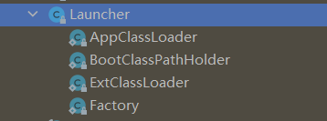
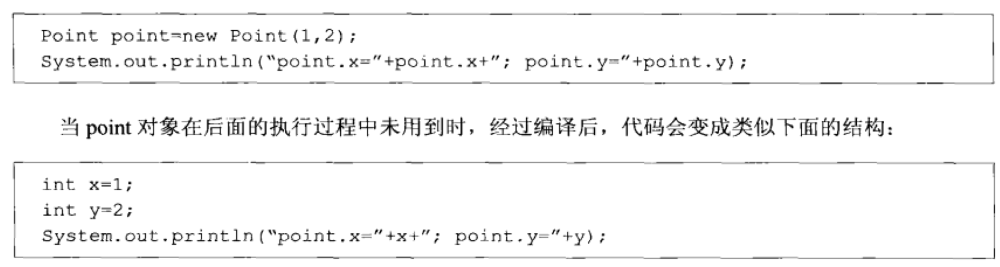
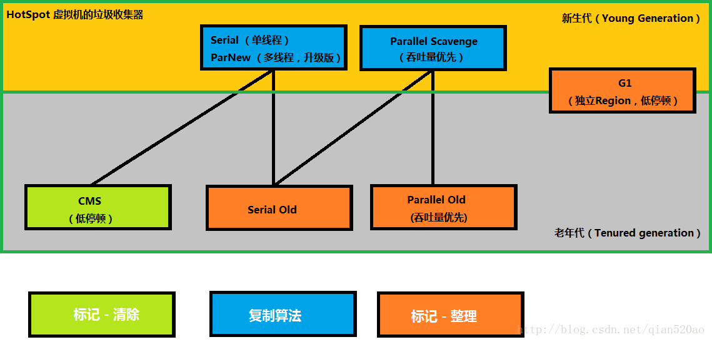

# 类加载运行全过程

## [通过Java命令执行代码的大体流程](https://blog.csdn.net/m0_45406092/article/details/108984101)

java.exe  => jvm.dll => sun.misc.Laucher.getLauncher() =>  laucher.getClassLoader(); => loader.loacClass("Test") => Test.Main();

```java
        // 1. java Hello
        // 2. java.exe调c++写的JVM
        // 3. sun.misc.Launcher类是java的入口
        Launcher launcher = Launcher.getLauncher();
        // 4. 加载运行的Hello类
        ClassLoader classLoader = launcher.getClassLoader();
        classLoader.loadClass("Hello");
        // 5. 调用main方法.
        Hello.main();
```

## loadClass类加载过程

- 加载 >> 验证 >> 准备 >> 解析 >> 初始化 >> 使用 >> 卸载

- **使用到**该类的时候才进行加载，**加载**时需要验证一下字节码文件的正确性，再**准备**给类的静态变量分配内存并赋予默认值，再**解析 **  
  
   将符号引用替换为直接引用使得指向数据所存内存的指针或句柄，再**初始化**给静态变量初始化为指定的值并且执行静态代码块

- **注意 **: 主类在运行过程中如果使用到其它类，会逐步加载这些类。jar包或war包里的类不是一次性全部加载的，是使用到时才加载。

## [类加载器和双亲委派机制](https://zhuanlan.zhihu.com/p/367609494)

## 几种常见的类加载器

引导类加载器、扩展类加载器、应用程序类加载器、自定义加载器



## [Launcher类加载器初始化过程](https://www.jianshu.com/p/912a7b60f316)

 [JAVA Launcher简析](https://blog.csdn.net/feiyingHiei/article/details/86553614)

[Launche 初始化 SecurityManager](https://blog.csdn.net/u013851082/article/details/60962141)

# Thread上下文ClassLoader的思考

[Thread.currentThread().getContextClassLoader()与Test.class.getClassLoader()区别](https://blog.csdn.net/Truong/article/details/34436367)

## 什么是双亲委派机制，AppClassLoader的loadClass源码

1. 首先，检查一下指定名称的类是否已经加载过，如果加载过了，就不需要再加载，直接返回。
2. 如果此类没有加载过，那么，再判断一下是否有父加载器；如果有父加载器，则由父加载器加载（即调用parent.loadClass(name, false);）.或者是调用bootstrap类加载器来加载。
3. 如果父加载器及bootstrap类加载器都没有找到指定的类，那么调用当前类加载器的findClass方法来完成类加载。

## 为什么要设计双亲委派机制

- 沙箱安全机制
- 避免类的重复加载，保证被加载类的唯一性

## 全盘负责委托机制

“全盘负责”是指当一个ClassLoader装载一个类时，除非显示地使用另一个ClassLoader，则该类所依赖及引用的类也由这个CladdLoader载入。

## 打破双亲委派机制

### 如何实现，核心方法

- 一个是loadClass(String, boolean)
- findClass

### String可以实现吗?

`                 java.lang.SecurityException: Prohibited package name: java.lang               `

沙箱安全机制，需要再解除这个限制

### [Tomcat打破双亲委派机制](https://blog.csdn.net/czmacd/article/details/54017027)

- 它要解决什么问题:  
  
  > 不同的应用程序可能会依赖同一个第三方类库的不同版本
  > 
  > 相同的类库相同的版本可以共享
  > 
  > web容器也有自己依赖的类库，不能与应用程序的类库混淆
  > 
  > web容器要支持jsp的修改

- Tomcat 如果使用默认的双亲委派类加载机制行不行,为什么.

- Tomcat自定义加载器有哪些
  
  > URLClassLoader   加载catalina.properties中配置的 common、server、shared的jar.
  > 
  > WebappClassLoader  各个Webapp私有的类加载器，加载路径中的class只对当前Webapp可见
  > 
  > JasperLoader 加载范围仅仅是这个JSP文件所编译出来的那一个.Class文件

- 模拟实现Tomcat的JasperLoader热加载

> 原理：后台启动线程监听jsp文件变化，如果变化了找到该jsp对应的servlet类的加载器引用(gcroot)，重新生成新的**JasperLoader**加载器赋值给引用，然后加载新的jsp对应的servlet类，之前的那个加载器因为没有gcroot引用了，下一次gc的时候会被销毁。类也会被卸载

## 不同类的对象

同一个JVM内，两个相同包名和类名的类对象可以共存，因为他们的类加载器可以不一样，所以看两个类对象是否是同一个，除了看类的包名和类名是否都相同之外，还需要他们的类加载器也是同一个才能认为他们是同一个。

# JVM内存模型

## [概括内存模型](https://zhuanlan.zhihu.com/p/101495810)


## [栈帧](https://juejin.cn/post/6979589472883048456)

更加详细: [理解 JVM Stack 栈帧 Frame](https://cloud.tencent.com/developer/article/1620319)

## [堆结构](https://blog.csdn.net/killerofjava/article/details/104295537)

## [方法区（元空间、永久代）](https://www.cnblogs.com/jklixin/p/13457936.html)

- 永久代和元空间的区别，元空间和方法区的区别:  [永久代到元空间](https://www.cnblogs.com/secbro/p/11718987.html)
  
  > 方法区是规范，元空间/永久代是实现。  永久代和堆是连续的一块内存 。1.8以后元空间不再与堆连续，而且是存在于本地内存

## [JVM内存参数设置](https://pic1.zhimg.com/v2-354d31865d1fb3362f5a1ca938f9a770_r.jpg)

`java -server -Xms2048M -Xmx2048M -Xmn1024M -Xss512K -XX:MetaspaceSize=256M -XX:MaxMetaspaceSize=256M -jar microservice-eureka-server.jar`

**结论：****通过上面这些内容介绍，大家应该对JVM优化有些概念了，就是尽可能让对象都在新生代里分配和回收，尽量别让太多对象频繁进入老年代，避免频繁对老年代进行垃圾回收，同时给系统充足的内存大小，避免新生代频繁的进行垃圾回收。**

# JVM对象创建

## [JAVA对象的创建过程](https://zhuanlan.zhihu.com/p/143743569)


## 分配内存

对象所需内存的大小在类加载完成后便可完全确定，为对象分配空间的任务等同于把 一块确定大小的内存从Java堆中划分出来。

### 如何划分内存

- “指针碰撞”（Bump the Pointer）(默认)
- “空闲列表”（Free List）

### 解决并发问题

- CAS（compare and swap）配上失败重试
- 本地线程分配缓冲（Thread Local Allocation Buffer,TLAB）  (JVM会默认开启-XX:+UseTLAB)

## 对象大小(存储的布局)

对象在内存中存储的布局可以分为3块区域：对象头（Header）、 实例数据（Instance Data）和对齐填充（Padding）

### 对象头

- 自身的运行时数据
  
  > 哈希码（HashCode）、GC分代年龄、锁状态标志、线程持有的锁、偏向线程ID、偏向时 间戳等

- 类型指针
  
  > 指向它的类元数据的指针

### 指针压缩

- 堆内存大于32G时，压缩指针会失效

- 堆内存小于4G时，不需要启用指针压缩

- 为什么要进行指针压缩？？ 
  
  > 使用32位指针(实际存储用64位)，使用较大指针在主内存和缓存之间移动数据，占用较大IO，同时GC也会承受较大压力。

# 内存分配机制

## [对象内存分配流程图](https://www.cnblogs.com/gaopengpy/p/12180381.html)


## 对象栈上分配

为了减少临时对象在堆内分配的数量，JVM**默认开启**通过**逃逸分析**(对象动态作用域:方法、线程)确定该对象不会被外部访问。如果不会逃逸可以将该对象在**栈上分配**内存，这样该对象所占用的内存空间就可以随栈帧出栈而销毁，就减轻了垃圾回收的压力。

- 逃逸分析
- [标量替换](https://luoyoubao.gitbooks.io/jvm/content/bian-yi-you-hua/biao-liang-ti-huan.html)
  
- 标量与聚合量

## 对象在Eden区分配

## 存入Survior空间,提前转移到老年代

Eden区没有足够空间进行分配时，虚拟机将发起一次Minor GC，GC期间虚拟机又发现对象无法存入Survior空间，所以只好把新生代的对象**提前转移到老年代**中去，老年代上的空间足够存放allocation1，所以不会出现Full GC。执行Minor GC后，后面分配的对象如果能够存在eden区的话，还是会在eden区分配内存

## 大对象直接进入老年代

## 长期存活的对象将进入老年代

## [对象动态年龄判断](https://www.jianshu.com/p/989d3b06a49d)

当前放对象的Survivor区域里(其中一块区域，放对象的那块s区)，一批对象的总大小大于这块Survivor区域内存大小的50%(-XX:TargetSurvivorRatio可以指定)，那么此时**大于等于**这批对象年龄最大值的对象，就可以**直接进入老年代**了。

> 1. MaxTenuringThreshold为15
> 2. 年龄1的对象占用了33%
> 3. 年龄2的对象占用33%
> 4. 年龄3的对象占用34%。
>
> 年龄1的占用了33%，年龄2的占用了33%，累加和超过默认的TargetSurvivorRatio（50%），年龄2和年龄3的对象都要晋升。
>
> 年龄从小到大进行累加，当加入某个年龄段后，累加和超过survivor区域*TargetSurvivorRatio的时候，就从这个年龄段网上的年龄的对象进行晋升。

## 老年代空间分配担保机制

年轻代每次**minor gc**之前JVM都会计算下老年代**剩余可用空间**

如果这个可用空间小于年轻代里现有的所有对象大小之和(**包括垃圾对象**)

就会看一个“-XX:-HandlePromotionFailure”(jdk1.8默认就设置了)的参数是否设置了

如果有这个参数，就会看看老年代的可用内存大小，是否大于之前每一次minor gc后进入老年代的对象的**平均大小**。

如果上一步结果是小于或者之前说的参数没有设置，那么就会触发一次Full gc，对老年代和年轻代一起回收一次垃圾，如果回收完还是没有足够空间存放新的对象就会发生"OOM"

# 对象内存回收

## 垃圾回收算法

### 引用计数法

### 可达性分析算法

## [常见引用类型](https://blog.csdn.net/qq_39192827/article/details/85611873)

- 强引用

- 软引用
  **软引用可用来实现内存敏感的高速缓存。**
  
                  public static SoftReference<User> user = new SoftReference<User>(new User());              

- 弱引用
  
  [ThreadLocal与WeakReference](https://blog.csdn.net/levena/article/details/78027136)
  
  ​                public static WeakReference<User> user = new WeakReference<User>(new User());              

- 虚引用
  [你不可不知的Java引用类型之——虚引用](https://www.cnblogs.com/mfrank/p/9837070.htm)
  
  [堆外内存 之 DirectByteBuffer 详解](https://www.jianshu.com/p/007052ee3773)

## 如何判断一个类是无用的类

- 该类所有的对象实例都已经被回收，也就是 Java 堆中不存在该类的任何实例。
- 加载该类的 ClassLoader 已经被回收。
- 该类对应的 java.lang.Class 对象没有在任何地方被引用，无法在任何地方通过反射访问该类的方法。

# 垃圾收集算法

## 分代收集理论

新生代，老年代生命周期不一样，采用不同的收集算法。

## 标记-复制算法

新生代中，每次收集都会有大量对象(近99%)死去，所以可以选择复制算法，只需要付出少量对象的复制成本就可以完成每次垃圾收集

## 标记-清除算法

标记存活的对象， 统一回收所有未被标记的对象

两个明显的问题：

- **效率问题  (如果需要标记的对象太多，效率不高)**
- **空间问题（标记清除后会产生大量不连续的碎片）**

## 标记-整理算法

所有存活的对象向一端移动，然后直接清理掉端边界以外的内存。

## 三色标记算法

# [垃圾收集器](https://blog.csdn.net/CrankZ/article/details/86009279)



## Stop-The-World

## 新生代收集器

### Serial

### ParNew

### Parallel

> `Parallel Scavenge`收集器提供了两个参数来用于精确控制吞吐量，一是控制最大垃圾收集停顿时间的`-XX:MaxGCPauseMillis`参数，二是控制吞吐量大小的`-XX:GCTimeRatio`参数

## 老年代收集器

### Serial Old

### Parallel Old

### CMS

1. 主要优点：**并发收集、低停顿**，缺点: 对CPU资源敏感、无法处理**浮动垃圾**、**“标记-清除”算法**会导致收集结束时会有**大量空间碎片**产生。

2. 执行步骤: 
- **初始标记 （停顿用户线程）：** 暂停所有的其他线程(STW)，并记录下gc roots**直接能引用的对象**，**速度很快**。
- **并发标记：** 并发标记阶段就是从GC Roots的直接关联对象开始遍历整个对象图的过程， 这个过程耗时较长但是不需要停顿用户线程， 可以与垃圾收集线程一起并发运行。因为用户程序继续运行，可能会有导致已经标记过的对象状态发生改变。
- **重新标记（停顿用户线程）：** 重新标记阶段就是为了修正并发标记期间因为用户程序继续运行而导致标记产生变动的那一部分对象的标记记录，**这个阶段的停顿时间一般会比初始标记阶段的时间稍长，远远比并发标记阶段时间短。主要用到三色标记里的****增量更新算法(见下面详解)做重新标记。**
- **并发清理：** 开启用户线程，同时GC线程开始对未标记的区域做清扫。这个阶段如果有新增对象会被标记为黑色不做任何处理(见下面三色标记算法详解)。
- **并发重置：**重置本次GC过程中的标记数据。
- 执行过程中，也许没回收完就再次触发full gc，这次gc将用serial old来回收了，变成了单线程。

## [新型垃圾收集器](https://blog.csdn.net/gaohaicheng123/article/details/106437504)

### G1

- 特点: **一款面向服务器的垃圾收集器,****主要针对配备多颗处理器及大容量内存的机器****. 以极高概率满足GC停顿时间要求的同时,还具备高吞吐量性能特征.**

- Humongous定义: **唯一不同的是对大对象的处理**，G1有专门分配大对象的Region叫**Humongous区**。专门存放短期巨型对象，不用直接进老年代，可以节约老年代的空间。

- 结构: Java堆划分为多个大小相等的独立区域（**Region**）,每个区域都可以是eden，survivor，old，**Humongous**

- G1垃圾收集分类: YoungGC、MixedGC、Full GC

- GC运作过程： **初始标记**、**并发标记**、**最终标记**、**筛选回收**（对各个Region的回收价值和成本进行排序，根据用户所期望的GC停顿STW时间来制定回收计划）

- **回收算法主要用的是复制算法**，**在后台维护了一个优先列表，每次根据允许的收集时间，优先选择回收价值最大的Region**

- **每秒几十万并发的kafka系统如何优化JVM**
  
  > 64G的系统，里面61G的Kafka，也就是说可以给年轻代分配个三四十G的内存用来支撑高并发处理，三四十G内存回收可能最快也要几秒钟，按kafka这个并发量放满三四十G的eden区可能也就一两分钟，那么意味着整个系统每运行一两分钟就会因为young gc卡顿几秒钟没法处理新消息，显然是不行的。那么对于这种情况如何优化了，我们可以使用G1收集器，设置 -XX:MaxGCPauseMills 为50ms，假设50ms能够回收三到四个G内存，然后50ms的卡顿其实完全能够接受，用户几乎无感知，那么整个系统就可以在卡顿几乎无感知的情况下一边处理业务一边收集垃圾。

- **什么场景适合使用G1**
1. 50%以上的堆被存活对象占用
2. 对象分配和晋升的速度变化非常大
3. 垃圾回收时间特别长，超过1秒
4. 8GB以上的堆内存(建议值)
5. 停顿时间是500ms以内

### Shenandoah

- JDK12 以上

- 类似G1

### ZGC

- JDK11 以上

- 目标: 
  
  1. **最糟糕的情况下吞吐量会降低15%**
  2. **最大GC停顿时间不超10ms**
  3. **支持TB量级的堆**
  4. **奠定未来GC特性的基础**

- 运作过程:
  
  1. **并发标记**
  2. **并发预备重分配**
  3. **并发重分配**
  4. **并发重映射**

## 如何选择垃圾收集器

1. 优先调整堆的大小让服务器自己来选择
2. 如果内存小于100M，使用串行收集器
3. 如果是单核，并且没有停顿时间的要求，串行或JVM自己选择
4. 如果允许停顿时间超过1秒，选择并行或者JVM自己选
5. 如果响应时间最重要，并且不能超过1秒，使用并发收集器
6. **4G以下可以用parallel，4-8G可以用ParNew+CMS，8G以上可以用G1，几百G以上用ZGC**

## 算法中遇到的问题

### **多标-浮动垃圾**

### **漏标-读写屏障**

- **CMS：写屏障 + 增量更新**
- **G1，Shenandoah：写屏障 + SATB**
- **ZGC：读屏障**

**为什么G1用SATB？CMS用增量更新？**

### **记忆集与卡表**

### **安全点与安全区域**

- 安全点就是指代码中一些特定的位置,当线程运行到这些位置时它的状态是确定的

- 安全区域是对正在执行的线程设定的

# JVM调优工具

## jdk自带命令

- 用jps查看其进程id

- Jinfo -flags jpid     # 查看正在运行的Java应用程序的扩展参数 

- jinfo -sysprops pid    # 查看java系统参数    

- jmap -histo 14660  #  查看内存信息，实例个数以及占用内存大小

- jmap -heap pid #查看堆信息

- jmap -dump  pid # 导出

- **jvisualvm** 分析**dump**文件    

- Jstack 查找死锁，可以找出占用cpu最高的线程堆栈信息

- jstat -gc pid  # 垃圾回收统计，可以评估程序内存使用及GC压力整体情况

## jvisualvm

不常用,需要开发端口，才能分析服务器。

## **[Arthas](https://alibaba.github.io/arthas)**

- 功能:
  
  1. 这个类从哪个 jar 包加载的？为什么会报各种类相关的 Exception？
  2. 我改的代码为什么没有执行到？难道是我没 commit？分支搞错了？
  3. 遇到问题无法在线上 debug，难道只能通过加日志再重新发布吗？
  4. 线上遇到某个用户的数据处理有问题，但线上同样无法 debug，线下无法重现！
  5. 是否有一个全局视角来查看系统的运行状况？
  6. 有什么办法可以监控到JVM的实时运行状态？
  7. 怎么快速定位应用的热点，生成火焰图？
  8. 怎样直接从JVM内查找某个类的实例？
  9. 为什么 CPU 又升高了，到底是哪里占用了 CPU ？
  10. 运行的多线程有死锁吗？有阻塞吗？
  11. 程序运行耗时很长，是哪里耗时比较长呢？如何监测呢？

- 常用指令:
  
  1. **dashboard**
  2. [thread](https://arthas.aliyun.com/doc/thread.html) ： 查看当前线程信息，查看线程的堆栈
  3. [jad](https://arthas.aliyun.com/doc/jad.html) : **反编译** 
  4. [ognl](https://arthas.aliyun.com/doc/ognl.html) ： **查看线上系统变量的值，甚至可以修改变量的值**


# 常量池

## Class常量池

- 常量池
- 存放编译期生成的各种字面量和符号引用

## 运行时常量池

- 动态链接，通过对象头里的类型指针去转换直接引用

## 字符串常量池

### intern

- 当调用 intern方法时，如果池已经包含一个等于此String对象的字符串 （用equals(oject)方法确定），则返回池中的字符串
- 否则，jdk1.6版本 (如果常量池没有) 需要将 s1 复制到字符串常量池里

### 版本

- Jdk1.6： 有永久代, 运行时常量池在永久代，运行时常量池包含字符串常量池
- Jdk1.7： 逐步去永久代,字符串常量池从永久代里的运行时常量池分离到堆里
- Jdk1.8： 无永久代，运行时常量池在元空间，字符串常量池里依然在堆里

## 八种基本类型的包装类和对象池

- Integer ：  -128 到 127 (缓存)


# 参考资料

- [Java final & 常量 & 常量池](https://blog.csdn.net/weixin_44227389/article/details/107345358)

- [final修饰的变量就是常量？final修饰局部变量在栈还是堆还是常量池中？](https://blog.csdn.net/b1480521874/article/details/89506095)
