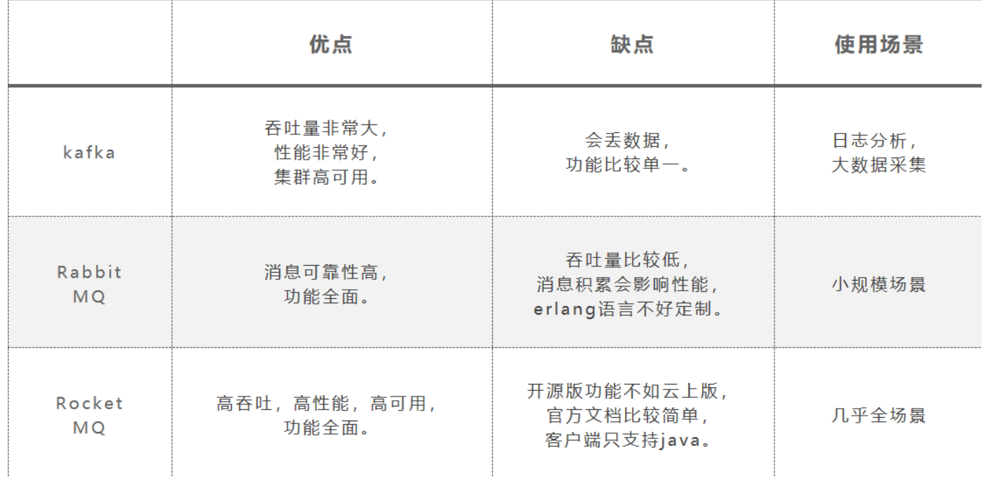

# 介绍

 目前RocketMQ在阿里云上有一个购买即可用的商业版本，商业版本集成了阿里内部一些更深层次的功能及运维定制。开源版本相对于阿里云上的商业版本，功能上略有缺失，但是大体上功能是一样的。

# 组件

## NameServer

- 提供轻量级的Broker路由服务。
- 要启动RocketMQ服务，需要先启动NameServer

## Broker

实际处理消息存储、转发等服务的核心组件。

## Producer

消息生产者集群。通常是业务系统中的一个功能模块。

## Consumer

消息消费者集群。通常也是业务系统中的一个功能模块。

## Topic

区分消息的种类；一个发送者可以发送消息给一个或者多个Topic；一个消息的接收者可以订阅一个或者多个Topic消息

## Message Queue

相当于是Topic的分区；用于并行发送和接收消息

# [快速安装RocketMQ](https://zhuanlan.zhihu.com/p/33765922)

## 启动NameServer

## 启动Broker

## 命令行快速验证

## 关闭RocketMQ服务

# [RocketMQ集群搭建](https://blog.csdn.net/Anbang713/article/details/107050264)

# RocketMQ原生API使用

## 消息发送者的固定步骤

1. 创建消息生产者producer，并制定生产者组名
2. 指定Nameserver地址
3. 启动producer
4. 创建消息对象，指定主题Topic、Tag和消息体
5. 发送消息
6. 关闭生产者producer

## 消息消费者的固定步骤

1. 创建消费者Consumer，制定消费者组名
2. 指定Nameserver地址
3. 订阅主题Topic和Tag
4. 设置回调函数，处理消息
5. 启动消费者consumer

## 功能样例

### 基本样例

使用消息生产者分别通过三种方式发送消息，同步发送、异步发送以及单向发送。

### 顺序消息

RocketMQ也只保证了每个OrderID的所有消息有序(发到了同一个queue)，而并不能保证所有消息都有序。所以这就涉及到了RocketMQ消息有序的原理。要保证最终消费到的消息是有序的，需要从Producer、Broker、Consumer三个步骤都保证消息有序才行。

### 广播消息

广播消息并没有特定的消息消费者样例，这是因为这涉及到消费者的集群消费模式。在集群状态(MessageModel.CLUSTERING)下，每一条消息只会被同一个消费者组中的一个实例消费到(这跟kafka和rabbitMQ的集群模式是一样的)。而广播模式则是把消息发给了所有订阅了对应主题的消费者，而不管消费者是不是同一个消费者组。

### 延迟消息

> 开源版本的RocketMQ中，对延迟消息并不支持任意时间的延迟设定(商业版本中支持)，而是只支持18个固定的延迟级别，1到18分别对应messageDelayLevel=1s 5s 10s 30s 1m 2m 3m 4m 5m 6m 7m 8m 9m 10m 20m 30m 1h 2h。这从哪里看出来的？其实从rocketmq-console控制台就能看出来。而这18个延迟级别也支持自行定义，不过一般情况下最好不要自定义修改。

### 批量消息

批量消息是指将多条消息合并成一个批量消息，一次发送出去。这样的好处是可以减少网络IO，提升吞吐量。

### 过滤消息

- 可以使用Message的Tag属性来简单快速的过滤信息。
- 可以使用SQL表达式来对消息进行过滤。

### 事务消息

- **对于复杂的分布式事务，RocketMQ提供的事务消息也是目前业内最佳的降级方案**。
- 事务消息是在分布式系统中保证最终一致性的两阶段提交的消息实现。他可以保证本地事务执行与消息发送两个操作的原子性，也就是这两个操作一起成功或者一起失败。

#### 限制

- 事务消息不支持延迟消息和批量消息。
- 为了避免单个消息被检查太多次而导致半队列消息累积，我们默认将单个消息的检查次数限制为 15 次
- 事务消息将在 Broker 配置文件中的参数 transactionMsgTimeout 这样的特定时间长度之后被检查。
- 事务性消息可能不止一次被检查或消费.
- 提交给用户的目标主题消息可能会失败，目前这依日志的记录而定。它的高可用性通过 RocketMQ 本身的高可用性机制来保证，如果希望确保事务消息不丢失、并且事务完整性得到保证，建议使用同步的双重写入机制。
- 事务消息的生产者 ID 不能与其他类型消息的生产者 ID 共享。与其他类型的消息不同，事务消息允许反向查询、MQ服务器能通过它们的生产者 ID 查询到消费者。

## ACL权限控制

权限控制（ACL）主要为RocketMQ提供Topic资源级别的用户访问控制。用户在使用RocketMQ权限控制时，可以在Client客户端通过 RPCHook注入AccessKey和SecretKey签名；Broker端对AccessKey所拥有的权限进行校验，校验不过，抛出异常；

# SpringBoot整合RocketMQ

- <artifactId>rocketmq-spring-boot-starter</artifactId>
- RocketMQTemplate 
- @RocketMQMessageListener
- @RocketMQTransactionListener

- [官网示例](https://github.com/apache/rocketmq-spring.git)
- 一定要注意版本。rocketmq-spring-boot-starter的更新进度一般都会略慢于RocketMQ的版本更新，并且版本不同会引发很多奇怪的问题。

# SpringCloudStream整合RocketMQ

- SpringCloudStream是Spring社区提供的一个统一的消息驱动框架，目的是想要以一个统一的编程模型来对接所有的MQ消息中间件产品。
- 不建议使用。

# 基础概念

## 消息模型（Message Model）

RocketMQ主要由Producer、Broker、Consumer 三部分组成，其中Producer 负责生产消息， Consumer 负责消费消息，Broker 负责存储消息。Broker 在实际部署过程中对应一台服务器，每个 Broker 可以存储多个Topic的消息，每个Topic的消息也可以分片存储于不同的 Broker。Message Queue 用于存储消息的物理地址，每个Topic中的消息地址存储于多个 Message Queue 中。 ConsumerGroup 由多个Consumer 实例构成。

## 消息生产者（Producer）

负责生产消息，一般由业务系统负责生产消息。一个消息生产者会把业务应用系统里产生的消息发送到broker服务器。RocketMQ提供多种发送方式，同步发送、异步发送、顺序发送、单向发送。同步和异步方式均需要Broker返回确认信息，单向发送不需要。

生产者中，会把同一类Producer组成一个集合，叫做生产者组，这类Producer发送同一类消息且发送逻辑一致。如果发送的是事务消息且原始生产者在发送之后崩溃，则Broker服务器会联系同一生产者组的其他生产者实例以提交或回溯消费。

## 消息消费者（Consumer）

负责消费消息，一般是后台系统负责异步消费。一个消息消费者会从Broker服务器拉取消息、并将其提供给应用程序。从应用的角度而言提供了两种消费形式：拉取式消费、推动式消费。

- 拉取式消费的应用通常主动调用Consumer的拉消息方法从Broker服务器拉消息、主动权由应用控制。一旦获取了批量消息，应用就会启动消费过程。
- 推动式消费模式下Broker收到数据后会主动推送给消费端，该消费模式一般实时性较高。

消费者同样会把同一类Consumer组成一个集合，叫做消费者组，这类Consumer通常消费同一类消息且消费逻辑一致。消费者组使得在消息消费方面，实现负载均衡和容错的目标变得非常容易。要注意的是，消费者组的消费者实例必须订阅完全相同的Topic。RocketMQ 支持两种消息模式：集群消费（Clustering）和广播消费（Broadcasting）。

- 集群消费模式下,相同Consumer Group的每个Consumer实例平均分摊消息。
- 广播消费模式下，相同Consumer Group的每个Consumer实例都接收全量的消息。

## 主题（Topic）

表示一类消息的集合，每个主题包含若干条消息，每条消息只能属于一个主题，是RocketMQ进行消息订阅的基本单位。

同一个Topic下的数据，会分片保存到不同的Broker上，而每一个分片单位，就叫做MessageQueue。MessageQueue是生产者发送消息与消费者消费消息的最小单位。

## 代理服务器（Broker Server）

### 定义

消息中转角色，负责存储消息、转发消息。代理服务器在RocketMQ系统中负责接收从生产者发送来的消息并存储、同时为消费者的拉取请求作准备。代理服务器也存储消息相关的元数据，包括消费者组、消费进度偏移和主题和队列消息等。

### 子模块

Broker Server是RocketMQ真正的业务核心，包含了多个重要的子模块：

- Remoting Module：整个Broker的实体，负责处理来自clients端的请求。
- Client Manager：负责管理客户端(Producer/Consumer)和维护Consumer的Topic订阅信息
- Store Service：提供方便简单的API接口处理消息存储到物理硬盘和查询功能。
- HA Service：高可用服务，提供Master Broker 和 Slave Broker之间的数据同步功能。
- Index Service：根据特定的Message key对投递到Broker的消息进行索引服务，以提供消息的快速查询。

### 高可用架构

Broker Server要保证高可用需要搭建主从集群架构。RocketMQ中有两种Broker架构模式：普通集群，Dledger高可用集群

#### 普通集群

这种集群模式下会给每个节点分配一个固定的角色，master负责响应客户端的请求，并存储消息。slave则只负责对master的消息进行同步保存，并响应部分客户端的读请求。消息同步方式分为同步同步和异步同步。

这种集群模式下各个节点的角色无法进行切换，也就是说，master节点挂了，这一组Broker就不可用了。

#### Dledger高可用集群

Dledger是RocketMQ自4.5版本引入的实现高可用集群的一项技术。这个模式下的集群会随机选出一个节点作为master，而当master节点挂了后，会从slave中自动选出一个节点升级成为master。

Dledger技术做的事情：1、接管Broker的CommitLog消息存储 2、从集群中选举出master节点 3、完成master节点往slave节点的消息同步。

Dledger的关键部分是在他的节点选举上。Dledger是使用Raft算法来进行节点选举的。

Dledger还会采用Raft协议进行多副本的消息同步。

## 名字服务（Name Server）

Broker Server会在启动时向所有的Name Server注册自己的服务信息，并且后续通过心跳请求的方式保证这个服务信息的实时性。生产者或消费者能够通过名字服务查找各主题相应的Broker IP列表。多个Namesrv实例组成集群，但相互独立，没有信息交换。

这种特性也就意味着NameServer中任意的节点挂了，只要有一台服务节点正常，整个路由服务就不会有影响。当然，这里不考虑节点的负载情况。

## 消息（Message）

消息系统所传输信息的物理载体，生产和消费数据的最小单位，每条消息必须属于一个主题Topic。RocketMQ中每个消息拥有唯一的Message ID，且可以携带具有业务标识的Key。系统提供了通过Message ID和Key查询消息的功能。

并且Message上有一个为消息设置的标志，Tag标签。用于同一主题下区分不同类型的消息。来自同一业务单元的消息，可以根据不同业务目的在同一主题下设置不同标签。标签能够有效地保持代码的清晰度和连贯性，并优化RocketMQ提供的查询系统。消费者可以根据Tag实现对不同子主题的不同消费逻辑，实现更好的扩展性。

# 消息存储原理

分布式队列因为有高可靠性的要求，所以数据要进行持久化存储。大致过程

1. MQ收到一条消息后，需要向生产者返回一个ACK响应，并将消息存储起来。
2. MQ Push一条消息给消费者后，等待消费者的ACK响应，需要将消息标记为已消费。如果没有标记为消费，MQ会不断的尝试往消费者推送这条消息。
3. MQ需要定期删除一些过期的消息，这样才能保证服务一直可用。

## 消息存储介质

采用的是类似于Kafka的文件存储机制，即直接用磁盘文件来保存消息，而不需要借助MySQL这一类索引工具。

### 磁盘保存文件慢吗

磁盘如果使用得当，磁盘的速度完全可以匹配上网络 的数据传输速度。目前的高性能磁盘，顺序写速度可以达到600MB/s， 超过了一般网卡的传输速度。但是磁盘随机写的速度只有大概100KB/s，和顺序写的性能相差6000倍！因为有如此巨大的速度差别，好的消息队列系统会比普通的消息队列系统速度快多个数量级。RocketMQ的消息用顺序写,保证了消息存储的速度。

### 零拷贝技术加速文件读写

通过使用mmap的方式，可以省去向用户态的内存复制，提高速度。这种机制在Java中是通过NIO包中的MappedByteBuffer实现的。RocketMQ充分利用了上述特性，也就是所谓的“零拷贝”技术，提高消息存盘和网络发送的速度。

采用MappedByteBuffer这种内存映射的方式有几个限制，其中之一是一次只能映射1.5~2G 的文件至用户态的虚拟内存，这也是为何RocketMQ默认设置单个CommitLog日志数据文件为1G的原因了。

## 消息存储结构

消息的存储分为三个部分

- CommitLog：存储消息的元数据。所有消息都会顺序存入到CommitLog文件当中。CommitLog由多个文件组成，每个文件固定大小1G。以第一条消息的偏移量为文件名。
- ConsumerQueue：存储消息在CommitLog的索引。一个MessageQueue一个文件，记录当前MessageQueue被哪些消费者组消费到了哪一条CommitLog。
- IndexFile：为了消息查询提供了一种通过key或时间区间来查询消息的方法，这种通过IndexFile来查找消息的方法不影响发送与消费消息的主流程

## 刷盘机制

RocketMQ为了提高性能，会尽量保证磁盘的顺序写。消息在写入磁盘时，有两种写磁盘的方式，同步刷盘和异步刷盘

### 同步刷盘

在返回写成功状态时，消息已经被写入磁盘。具体流程是，消息写入内存的PAGECACHE后，立刻通知刷盘线程刷盘， 然后等待刷盘完成，刷盘线程执行完成后唤醒等待的线程，返回消息写 成功的状态。

### 异步刷盘

在返回写成功状态时，消息可能只是被写入了内存的PAGECACHE，写操作的返回快，吞吐量大；当内存里的消息量积累到一定程度时，统一触发写磁盘动作，快速写入。

### 配置方式

刷盘方式是通过Broker配置文件里的flushDiskType 参数设置的，这个参数被配置成SYNC_FLUSH、ASYNC_FLUSH中的 一个。

## 消息主从复制

如果Broker以一个集群的方式部署，会有一个master节点和多个slave节点，消息需要从Master复制到Slave上。而消息复制的方式分为同步复制和异步复制。

### 同步复制

同步复制是等Master和Slave都写入消息成功后才反馈给客户端写入成功的状态。

在同步复制下，如果Master节点故障，Slave上有全部的数据备份，这样容易恢复数据。但是同步复制会增大数据写入的延迟，降低系统的吞吐量。

### 异步复制

异步复制是只要master写入消息成功，就反馈给客户端写入成功的状态。然后再异步的将消息复制给Slave节点。

在异步复制下，系统拥有较低的延迟和较高的吞吐量。但是如果master节点故障，而有些数据没有完成复制，就会造成数据丢失。

### 配置方式

消息复制方式是通过Broker配置文件里的brokerRole参数进行设置的，这个参数可以被设置成ASYNC_MASTER、 SYNC_MASTER、SLAVE三个值中的一个。

## 负载均衡

### Producer负载均衡

Producer发送消息时，默认会轮询目标Topic下的所有MessageQueue，并采用递增取模的方式往不同的MessageQueue上发送消息，以达到让消息平均落在不同的queue上的目的。而由于MessageQueue是分布在不同的Broker上的，所以消息也会发送到不同的broker上。

同时生产者在发送消息时，可以指定一个MessageQueueSelector。通过这个对象来将消息发送到自己指定的MessageQueue上。这样可以保证消息局部有序。

### Consumer负载均衡

Consumer也是以MessageQueue为单位来进行负载均衡。分为集群模式和广播模式。

#### 集群模式

在集群消费模式下，每条消息只需要投递到订阅这个topic的Consumer Group下的一个实例即可。RocketMQ采用主动拉取的方式拉取并消费消息，在拉取的时候需要明确指定拉取哪一条message queue。

而每当实例的数量有变更，都会触发一次所有实例的负载均衡，这时候会按照queue的数量和实例的数量平均分配queue给每个实例。

每次分配时，都会将MessageQueue和消费者ID进行排序后，再用不同的分配算法进行分配。内置的分配的算法共有六种，分别对应AllocateMessageQueueStrategy下的六种实现类，可以在consumer中直接set来指定。默认情况下使用的是最简单的平均分配策略。

- AllocateMachineRoomNearby： 将同机房的Consumer和Broker优先分配在一起。
- AllocateMessageQueueAveragely：平均分配。将所有MessageQueue平均分给每一个消费者
- AllocateMessageQueueAveragelyByCircle： 轮询分配。轮流的给一个消费者分配一个MessageQueue。
- AllocateMessageQueueByConfig： 不分配，直接指定一个messageQueue列表。类似于广播模式，直接指定所有队列。
- AllocateMessageQueueByMachineRoom：按逻辑机房的概念进行分配。又是对BrokerName和ConsumerIdc有定制化的配置。
- AllocateMessageQueueConsistentHash。源码中有测试代码AllocateMessageQueueConsitentHashTest。这个一致性哈希策略只需要指定一个虚拟节点数，是用的一个哈希环的算法，虚拟节点是为了让Hash数据在换上分布更为均匀。

#### 广播模式

广播模式下，每一条消息都会投递给订阅了Topic的所有消费者实例，所以也就没有消息分配这一说。而在实现上，就是在Consumer分配Queue时，所有Consumer都分到所有的Queue。

## 消息重试

首先对于广播模式的消息， 是不存在消息重试的机制的，即消息消费失败后，不会再重新进行发送，而只是继续消费新的消息。

而对于普通的消息，当消费者消费消息失败后，你可以通过设置返回状态达到消息重试的结果。

### 如何让消息进行重试

集群消费方式下，消息消费失败后期望消息重试，需要在消息监听器接口的实现中明确进行配置。可以有三种配置方式：

- 返回Action.ReconsumeLater-推荐
- 返回null
- 抛出异常

如果希望消费失败后不重试，可以直接返回Action.CommitMessage。

### 重试消息如何处理

重试的消息会进入一个 “%RETRY%”+ConsumeGroup 的队列中。

然后RocketMQ默认允许每条消息最多重试16次，每次重试的间隔时间就是那16个时间等级

### 重试次数

如果消息重试16次后仍然失败，消息将不再投递。转为进入死信队列。

另外一条消息无论重试多少次，这些重试消息的MessageId始终都是一样的。

然后关于这个重试次数，RocketMQ可以进行定制。例如通过consumer.setMaxReconsumeTimes(20);将重试次数设定为20次。当定制的重试次数超过16次后，消息的重试时间间隔均为2小时。

### 关于MessageId

在老版本的RocketMQ中，一条消息无论重试多少次，这些重试消息的MessageId始终都是一样的。

但是在4.7.1版本中，每次重试MessageId都会重建。

### **配置覆盖**

消息最大重试次数的设置对相同GroupID下的所有Consumer实例有效。并且最后启动的Consumer会覆盖之前启动的Consumer的配置。

## 死信队列

当一条消息消费失败，RocketMQ就会自动进行消息重试。而如果消息超过最大重试次数，RocketMQ就会认为这个消息有问题。但是此时，RocketMQ不会立刻将这个有问题的消息丢弃，而会将其发送到这个消费者组对应的一种特殊队列：死信队列。

死信队列的名称是%DLQ%+ConsumGroup

通常，一条消息进入了死信队列，意味着消息在消费处理的过程中出现了比较严重的错误，并且无法自行恢复。此时，一般需要人工去查看死信队列中的消息，对错误原因进行排查。然后对死信消息进行处理，比如转发到正常的Topic重新进行消费，或者丢弃。

### **特征**

- 一个死信队列对应一个ConsumGroup，而不是对应某个消费者实例。
- 如果一个ConsumeGroup没有产生死信队列，RocketMQ就不会为其创建相应的死信队列。
- 一个死信队列包含了这个ConsumeGroup里的所有死信消息，而不区分该消息属于哪个Topic。
- 死信队列中的消息不会再被消费者正常消费。
- 死信队列的有效期跟正常消息相同。默认3天，对应broker.conf中的fileReservedTime属性。超过这个最长时间的消息都会被删除，而不管消息是否消费过。

### 注意

默认创建出来的死信队列，他里面的消息是无法读取的，在控制台和消费者中都无法读取。这是因为这些默认的死信队列，他们的权限perm被设置成了2:禁读(这个权限有三种 2:禁读，4:禁写,6:可读可写)。需要手动将死信队列的权限配置成6，才能被消费(可以通过mqadmin指定或者web控制台)。

## 消息幂等

RocketMQ只能保证at least once，保证不了exactly once。所以，使用RocketMQ时，需要由业务系统自行保证消息的幂等性。

# 参考资料

[官网](https://rocketmq.apache.org/)

[github](https://github.com/apache/rocketmq/tree/develop/docs/cn)

