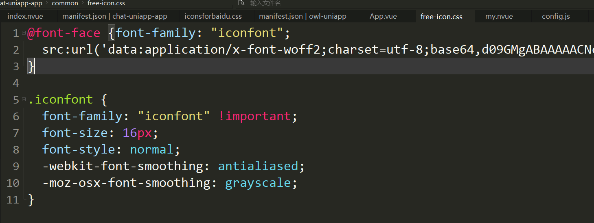

# 需求背景

接手二手项目时，不清楚项目中定义了哪些 icon。

- 接手二手项目，有时由于交接不到位，只能找到引用的 css。但不清楚该 icon 库具体包含哪些 icon。
- 导致二次开发时，不能很好地复用之前的 icon，若引入新icon，可能还会重复定义。导致前后 icon 风格不统一。

使用外部样式库，成套的后台管理系统框架时。找到其 icon 的定义列表比较麻烦。

- 需要先找到对应的官网，再找到其对 icon 定义。整个过程较为繁琐。而且还不一定有介绍。

# 目前情况

项目中的css 中 只有base64. 

# 操作步骤

- [把vux中的@font-face为base64格式的字体信息解码成可用的字体文件](https://www.cnblogs.com/moqiutao/p/8945131.html)

- 再去 [iconfont 在线预览工具及其解析](https://juejin.cn/post/6844903920666411015)  地址展示.就行了。 

# 后记

1. 可以使用fontCreator代替在线预览,个人觉得麻烦。
2. 有人说百度也有，但是打不开，就不要试了。

# 参考资料

[iconfont 在线预览工具及其解析](https://juejin.cn/post/6844903920666411015)

> - iconfont web 在线预览工具，无需安装，打开即用
> - 具体的使用,unicode 模式、Font class、Symbol都支持。
> - 对应的github https://github.com/Momo707577045/iconfont-preview

[把vux中的@font-face为base64格式的字体信息解码成可用的字体文件](https://www.cnblogs.com/moqiutao/p/8945131.html)

- [fontCreator使用小结](https://www.jianshu.com/p/6fb74839a2c1)

  > 桌面工具，查看和编辑字体。

- [字体图标管理平台](https://github.com/bolin-L/nicon)