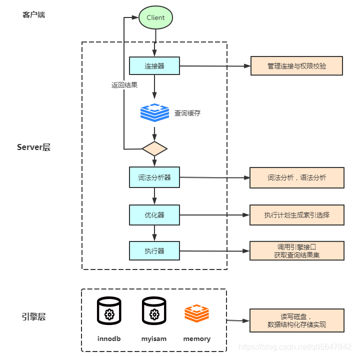
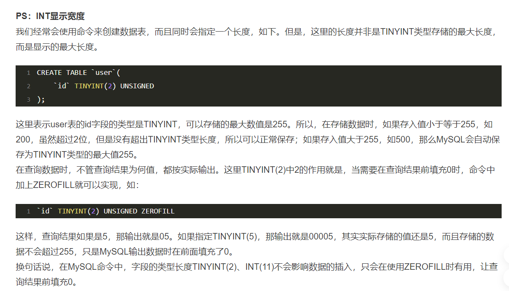

# SQL在MySQL中是执行过程



## Server 

### 连接器

- 建立客户端连接、获取权限、维持和管 理连接
- 修改权限需要重新连接才会同步权限

### 查询缓存

- mysql8.0已经移除了查询缓存功能
- 默认关闭，sql 为key 
- 如： select SQL_CACHE * from test where ID=5；

### 词法分析器

- 词法分析
- 语法分析
- 语义分析
- 构造执行树
- 生成执行计划
- 计划的执行

### 优化器

- 按照成本选择"最优执行计划"
- 可能放弃索引走全表扫描
- 优化sql语句，如最左前缀原则 B,C,A = A,B,C

### 执行器

- 调用执行引擎接口取满足条件的第一行，rows_examined 值+1
- 调用引擎接口取“下一行”，重复相同的判断逻辑，直到取到这个表的最后行
- 将上述遍历过程中所有满足条件的行组成的记录集作为结果集返回给客户端

### bin-log归档

- 用于恢复数据库磁盘的数据
- 不区分存储引擎.

## 存储引擎层

负责数据的存储和提取,其架构模式是插件式的


## [sql语句执行顺序是什么](https://m.php.cn/sql/470763.html)

from where group by having  聚合函数 select order by


# bin-log归档

## 特点

- 记录cud操作的二进制日志
- Binlog为逻辑日志,记录的是一条语句的原始逻辑
- Binlog不限大小,追加写入,不会覆盖以前的日志

## 开启binlog功能

- log‐bin

  > 配置开启binlog,存放路径

- binlog‐format

  > binlog格式，配置开启binlog

- sync‐binlog=1

  > 表示每1次执行写入就与硬盘同步

## 查看binlog内容

`mysqlbinlog`

- flush logs; 会多一个最新的bin‐log日志
- show master status; 查看最后一个bin‐log日志的相关信息
- reset master; 清空所有的bin‐log日志

### 逻辑点位

恢复到指定位置数据


## trace工具

开启trace工具会影响mysql性能，所以只能临时分析sql使用，用完之后立即关闭。

```mysql
mysql> set session optimizer_trace="enabled=on",end_markers_in_json=on;  --开启trace
mysql> select * from employees where name > 'a' order by position;
mysql> SELECT * FROM information_schema.OPTIMIZER_TRACE;
```

# Explain工具

```sql
 explain select * from actor;
```

## explain中的列

- id列

  > id列的编号是 select 的序列号，有几个 select 就有几个id，并且id的顺序是按 select 出现的顺序增长的。 id列越大执行优先级越高，id相同则从上往下执行，id为NULL最后执行。

- select_type列

  > 表示对应行是简单还是复杂的查询 

- table列
  正在访问哪个表,

- type列

  > 关联类型，决定如何查找表中的行，null >system > const > eq_ref > ref > range > index > ALL

- possible_keys列

  > 显示查询可能使用哪些索引来查找，预测索引

- key列

  > 显示实际采用哪个索引来优化对该表的访问，如果没有使用索引，则该列是 NULL。

- key_len列

  > 显示了mysql在索引里使用的字节数，通过这个值可以算出具体使用了索引中的哪些列。  联合索引失效，定位.

- ref列

  > 显示了在key列记录的索引中，表查找值所用到的列或常量，常见的有：const（常量），字段名（例：film.id）

- rows列

  > mysql估计要读取并检测的行数，注意这个不是结果集里的行数

- Extra列

  > 展示的是额外信息

  1. Using index：使用覆盖索引
  2. Using where：使用 where 语句来处理结果，并且查询的列未被索引覆盖
  3. Using index condition：查询的列不完全被索引覆盖，where条件中是一个前导列的范围；
  4. Using temporary：mysql需要创建一张临时表来处理查询。
  5. Using filesort：将用外部排序而不是索引排序
  6. Select tables optimized away：使用某些聚合函数（比如 max、min）来访问存在索引的某个字段


# MySQL建表数据类型选择

（1）确定合适的大类型：数字、字符串、时间、二进制；

（2）确定具体的类型：有无符号、取值范围、变长定长等。

1. 尽量用更小的数据类型，因为它们通常有更好的性能，花费更少的硬件资源
2. 尽量把字段定义为NOT NULL，避免使用NULL

##  数值类型

1. 如果整形数据没有负数，如ID号，建议指定为UNSIGNED无符号类型，容量可以扩大一倍。

2. 建议使用TINYINT代替ENUM、BITENUM、SET。

3. 避免使用整数的显示宽度(参看文档最后)，也就是说，不要用INT(10)类似的方法指定字段显示宽度，直接用INT。

   

4. DECIMAL最适合保存准确度要求高，而且用于计算的数据，比如价格。但是在使用DECIMAL类型的时候，注意长度设置。

5. 建议使用整形类型来运算和存储实数，方法是，实数乘以相应的倍数后再操作。

6. 整数通常是最佳的数据类型，因为它速度快，并且能使用AUTO_INCREMENT。

## 日期和时间

1. MySQL能存储的最小时间粒度为秒。
2. 建议用DATE数据类型来保存日期。MySQL中默认的日期格式是yyyy-mm-dd。
3. 用MySQL的内建类型DATE、TIME、DATETIME来存储时间，而不是使用字符串。
4. 当数据格式为TIMESTAMP和DATETIME时，可以用CURRENT_TIMESTAMP作为默认（MySQL5.6以后），MySQL会自动返回记录插入的确切时间。
5. TIMESTAMP是UTC时间戳，与时区相关。
6. DATETIME的存储格式是一个YYYYMMDD HH:MM:SS的整数，与时区无关，你存了什么，读出来就是什么。
7. 除非有特殊需求，一般的公司建议使用TIMESTAMP，它比DATETIME更节约空间，但是像阿里这样的公司一般会用DATETIME，因为不用考虑TIMESTAMP将来的时间上限问题。 TIMESTAMP 只到 1970-01-01 00:00:00 到 2038-01-19 03:14:07
8. 有时人们把Unix的时间戳保存为整数值，但是这通常没有任何好处，这种格式处理起来不太方便，我们并不推荐它。

## 字符串

1. 字符串的长度相差较大用VARCHAR；字符串短，且所有值都接近一个长度用CHAR。
2. CHAR和VARCHAR适用于包括人名、邮政编码、电话号码和不超过255个字符长度的任意字母数字组合。那些要用来计算的数字不要用VARCHAR类型保存，因为可能会导致一些与计算相关的问题。换句话说，可能影响到计算的准确性和完整性。
3. 尽量少用BLOB和TEXT，如果实在要用可以考虑将BLOB和TEXT字段单独存一张表，用id关联。
4. BLOB系列存储二进制字符串，与字符集无关。TEXT系列存储非二进制字符串，与字符集相关。
5. BLOB和TEXT都不能有默认值。


# 存储引擎

## MyISAM

- MyISAM在执行查询语句SELECT前，会自动给涉及的所有表加读锁,在执行update、insert、delete操作会自 动给涉及的表加写锁。
- 索引文件和数据文件是分离的(非聚集) 

## MyISAM Merge

- 合并表，几个相同的MyISAM表合并为一个虚表

## InnoDB

- InnoDB在执行查询语句SELECT时(非串行隔离级别)，不会加锁。但是update、insert、delete操作会加行锁。
- 它提供了事务、行级锁机制和外键约束的功能
- 有且只有一个聚簇索引(主键,没有自动生成rid)，其他的都是非聚集索引
- 为了一致性和节省存储 , 非主键索引叶子节点存储主键值，回表操作

## Archive

- 只支持select 和 insert语句，应用于日志记录和聚合分析
- 不支持索引

## MEMORY

- 基于内存的，临时存放数据，数据量不大，并且不需要较高的数据安全性
- MySQL 中使用该引擎作为临时表，存放查询的中间结果。


# Innodb

## BufferPool缓存机制

### 执行流程

1. 加载命中的一整页记录到Buffer pool

2. 写入更新前的旧数据到undo日志版本链中

3. 更新Buffer pool 数据

4. 写入redo log Buffer 中

5.  准备提交事务，刷新 redo 日志写入磁盘，第一次提交

6. 写入binlog日志

7. 写入commit标识到redo日志中，第二次提交

   > 这里也就保证binlog和redo日志一致

8. 不定时的更新整页修改的数据，到磁盘

### 优点

增删改查,都是操作的buffer pool  , 不直接操作磁盘。它可以保证每个更新请求都是更新内存BufferPool，然后顺序写日志文件，同时还能 保证各种异常情况下的数据一致性。

## 日志

### undo 日志

- 记录数据的逻辑变化，回滚时候，用undo里面的版本链，恢复buffer pool 数据
- 用于事务的回滚、MVCC

### redo 日志（重做日志）

- 主要作用是用于数据库的崩溃恢复，用来保证事务的持久性
- 宕机后，用redo日志恢复 buffer pool 缓存数据，防止数据丢失

## [自适应hash索引](https://www.jianshu.com/p/fa0a919be746)

> InnoDB会监控对表上各索引页的查询，如果观察该数据被访问的频次符合规则，那么就建立哈希索引来加快数据访问的速度，这个哈希索引称之为"**Adaptive Hash Index,AHI**",AHI是通过缓冲池的B+树页构建的，建立的速度很快，而且不对整颗树都建立哈希索引。(可以理解成热点的数据才会进入这个哈希表)

## [双写缓冲](https://blog.csdn.net/it_lihongmin/article/details/115192102)

写redo日志的同时还会写入到系统表空间的双写缓冲磁盘中。


# 整体调优

- 建表优化: 比如自增id、字段选择和字段大小、该用范式用、该冗余冗余。
- sql语句编写优化 :  OrderBy(group by)、 limit 、Join(in、exsits)、count、sql查询返回字段、慢查询。
- 索引优化:  尽可能建联合索引，聚簇索引。
- 整体系统优化:  尽可能避免间隙锁,一定不能存在退化表锁。尽可能避免数据库使用锁操作。
- 配置优化 : 锁超时时间配置、只在一个读库中开启慢查询、连接相关设置、缓存buffer_pool相关设置。

# 参考资料

[MySQL数据库存储引擎简介](https://zhuanlan.zhihu.com/p/59056833)

[mysql常用的存储引擎有哪些](https://www.php.cn/mysql-tutorials-418287.html)

[如何解决 bin log 与 redo log 的一致性问题](https://baijiahao.baidu.com/s?id=1719905225647709469&wfr=spider&for=pc)

> 可以理解为: 为什么说 redo log 具有崩溃恢复的能力，
>
> 所谓崩溃恢复就是：即使在数据库宕机的情况下，也不会出现操作一半的情况
>
> 也就是BufferPool缓存机制.

[浅析MySQL事务中的redo与undo](https://www.jianshu.com/p/20e10ed721d0)

[mysql explain详解](https://cloud.tencent.com/developer/article/1093229)

[mysql页面大小_MySQL innodb_page_size](https://blog.csdn.net/weixin_32660773/article/details/113434222)

> 代表和OS交互单位，决定索引树的高度。

[MySQL性能优化之参数配置](https://www.cnblogs.com/angryprogrammer/p/6667741.html)

[MySQL实战45讲总结](https://blog.csdn.net/liyifan687/article/details/114224787)

> 内卷开始必备。

