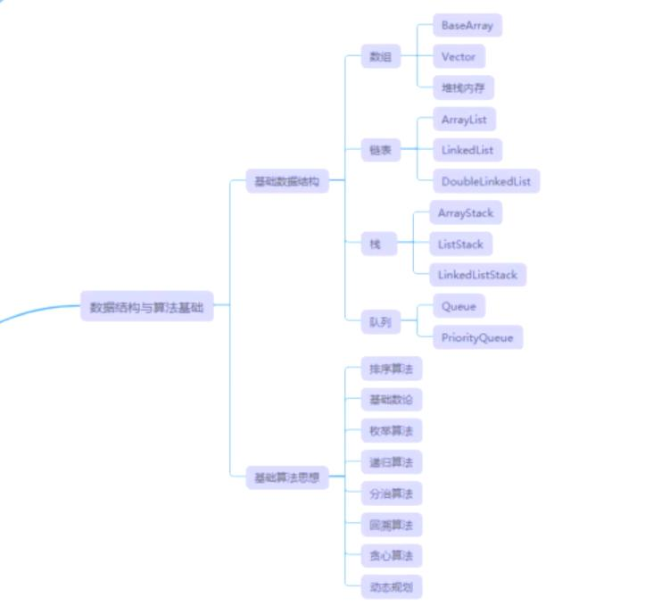
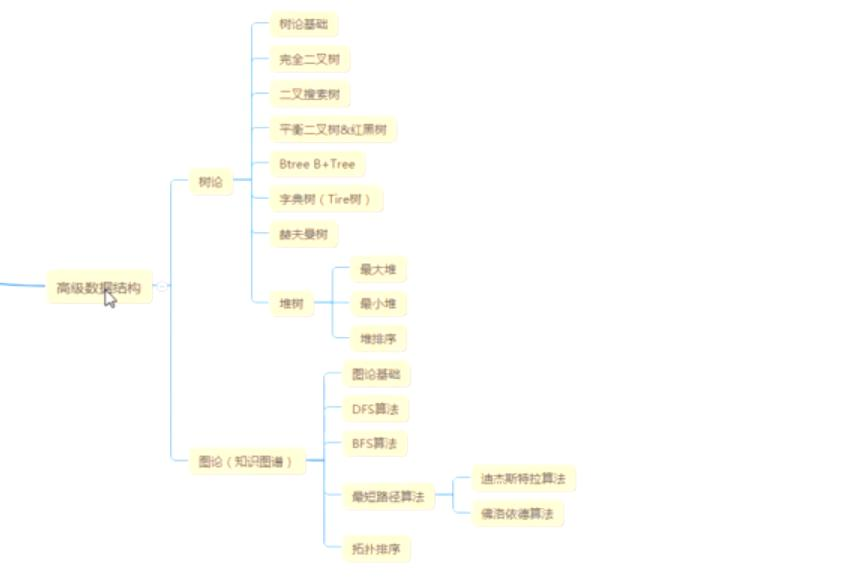
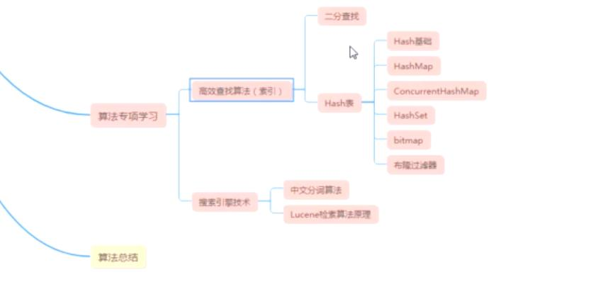

# 学习方式
如何快速的掌握数据结构与算法

1.什么是数据结构？什么是算法？
数据结构： 就是一个能组在一起的集合对象。比如数组 链表 队列等。
算法：就是解决问题的

2.数据结构与算法要学哪些内容？



> 数论普通人都重要,基础中的高级。 
> 图论属于进阶（最复杂的数据结构），知识图谱、大数据、社交。



3.面对这么多的知识点，我们应该怎么学习？
学习目的：
（1）提升能力的：全部学
（2）突击面试的：注意几个经典的：【数组】 链表 排序算法 二叉树 红黑树 B-Tree B+Tree 
（3）进阶的：树论+图论+我的专项+每节课的理论部分

# 为什么要学习数据结构与算法
1. BAT一线互联网公司面试必问技术？
2. 如果你不想做一辈子的CRUD工程师
3. 架构师必备，写出框架级的高性能代码
4. 提升自己的能力，不被行业淘汰
5. 所有计算机类的基础，几十年的时间才会淘汰，可以说学了就够一辈子用。

> 总之是一门被人们小看的性价比极高的基础，重要但不常用，实用却又难学。 

# 书籍、网站推荐

1.数据结构：
（1）严蔚敏版 数据结构与算法（都可以）
（2）大话数据结构（都可以）

2.算法：
（1）基础级：刘汝佳 算法竞赛入门经典（两本，还有一个是习题）
（2）进阶级：刘汝佳黑书 算法导论；非常难，非算法行业慎入

网站：
（1）力扣:https://leetcode-cn.com/  一般常用刷题的网站。
（2）POJ  北大的题库，比较难。  (有些公司的题就在里面)
 (3) HDU  杭州科技大学的题库（和POJ类似）。 

书籍:
java有关的基础： 《java编程思想》

# 算法的特性

五个特征：
- 有穷性 : 不是死循环。While(true){}
- 确定性 : 能有确定的结果
- 可行性 : 可以解决实际问题。
- 有输入有输出 


设计原则：
- 正确性
- 可读性
- 健壮性 bug( 写出代码很少有bug，而且系统比较稳定 )
- （重要）高效率与低存储: 内存+CPU 堆栈内存OOM (内存占用最小，CPU占用最小，运算速度最快)


评价算法的两个重要指标: 
占据整个学习的半壁江山，接下来我们会重点学习时间复杂度的计算
时间复杂度:运行一个程序所花费的时间。O()
空间复杂度：运行程序所需要的内存  OOM


# 时间复杂度


1. 时间复杂度计算的意义: 怎么测试接口的性能的？ 最好的就是，用代码分析。也就是时间复杂度

2. 时间复杂度表示方法：大O表示法。 O(1),O(n),O(nlogn),O(n^2),O(n+1),O(logn),O(n!)
o(1）< o(log2n)<o(n)<o(nlog2n)<o(n^2)<o(n^3)<o(2^n)<o(n!)<o(n^n)

3. 时间复杂度如何来分析
（1）找for while 递归。而且要找循环量最大的那一段
（2）同级循环怎么计算

4. 我们怎么找时间复杂度：
1.找到有循环的地方，
2.找有网络请求（RPC，远程调用，分布式，数据库请求）的地方。
就是测试时间：log打印，计算平均时间。
3.处理业务的地方。指的是某一段代码。

5. 几种常见的时间复杂度分析：
计算机忽略掉常数 :  计算时间复杂度 往往是计算比较大的 而且是不确定的数，如果已经确定了，那么就不用计算了，也是我们说的常量。
找运行最多的 : 注意有个规律，有加减法的时候，找次数最高的那个
- 常数：O(1)  1表示是常数，所有能确定的数字我们都用O(1)，O(1000)=>o(1)
```
		int a = 1;		//1次 O(1)
		for(int i = 0 ;i < 3;i++){//这里会运行几次？4次 在第4次的时候结束 跳出 i=3 (0 1 2 3)
			a = a + 1;			//这里运行几次？ 3次 O(1)? n+1 n 1 O(3)? => O(1)
		}
```
- 对数：O(logn)
```
		int n = Integer.MAX_VALUE;		//表示n是未知
		
		int i = 1;
		while( i <= n){
			 i = i * 2;		// O(log2n)  =>  O(logn)
		}
		while( i <= n){
			 i = i * 3;		// O(log3n)   => O(logn)
		}
		//i的值：2 4 8 16 32,=》2^0,2^1,2^2,2^3,.....2^n
		//===> 2^x=n =>求出x就是我们运行的次数 => x=log2n =>计算机忽略掉常数 => x = logn =>O(logn)
		//二分查找 为什么是logn的算法？   每次找一半。就是O(logN)
		//1~100 找69这个数
		//50:(1+100)/2 = 50
```
- 线性：O(n)
```
		for(i = 0 ; i < n;i++){
			a = a +1;			//运行了多少次？O(n) n一定是一个未知的，如果n是已知6的就是 O(1)
		}
```
- 线性对数：O(nlogn)
```
            n * logn  // 
			for(int j = 0 ; j < n ;j++){
				while ( i <= n){
					i = i * 2;
				}
			}
```
- 平方：O(n^2)
```
			for(i = 0 ; i < n;i++){	// 乘法 n次
				for(int j = 0 ; j < n ;j ++){		//n次
					a = a +1;			//运行了多少次？		O(n^2)
				}
			} 
			n * n =  n^2  => O(n^2) 
		
		// 冒泡排序。	
		for(i = 0 ; i < n;i++){	// 乘法 n次
			for(int j = i ; j < n ;j ++){		//n次 
						/*
						 * 外面的循环次数是确定的 O(n) n次，1 2 3 4 。。。n
						 * 
						 * i=n 运行1次
						 * i=n-1 运行2次
						 * .
						 * .
						 * .
						 * i=1 运行n次
						 * 
						 * 1,2,3 …… n次 最后里面这层要运行多少次？1+2+3+……+n=n*(n+1)/2 => 
						 * 
						 */
				a = a +1;			//运行了多少次？	n*(n+1)/2 => O(n^2); => (n^2+n)/2 =>  忽略常数2 => n^2 + n  => 找次数最高的那个  => n^2  => O(n^2)
			}
		}
		n *  ( (n*(n+1))/2 )  =  (n^2+n)/2    => n^2  =>  O(n^2)
		
```
- N次方：O(n^n)
```
	例如n张牌的洗牌： 结果有 n * (n-1) * (n-2)  .... * 1  => n! => n^n  => O(n^n)
	不常见。
```


6. 效率目标

学了时间复杂度，那我们的目的就是要把代码写到最优，效率最高；

O(1)>O(logn)>O(n)>O(nlogn)>O(n^2)>O(n^x)>O(n^n)
O(1)>O(logn)>O(n)>O(nlogn) 效果都是很好的。几乎优化的空间不是很大。
优化的目标就是要往O（1）的方向接近。
比如: 
登录：判断用户名密码O(1)到数据库里查记录；已经没办法优化逻辑代码,只能用其他手段如: 分布式 缓存。
列表的接口：排序，冒泡排序；=>找更优秀的排序算法 快速排序，归并排序，堆排序。


7. 项目中常见
最坏情况，最好情况，平均情况时间复杂度；  一般是指平均的时间复杂度


# 空间复杂度

1.空间复杂度分析的意义：找花了内存的地方。数据

2.如何找出程序的空间复杂度：开了空间的地方， 比如 数组 链表，缓存对象，递归(的层级也占队列)
```
		/*
		int data[100];
		List<>; list.add();
		Map put
		Set add
		Queue
		Object 
		*/
```

3.一般怎么改进？ 
尽量少的内存使用。


